# AI Engine Architecture

<cite>
**Referenced Files in This Document**
- [orchestrator.ts](file://packages/ai-engine/src/orchestrator.ts)
- [types.ts](file://packages/ai-engine/src/types.ts)
- [provider-registry.ts](file://packages/ai-engine/src/provider-registry.ts)
- [openai.ts](file://packages/ai-engine/src/providers/openai.ts)
- [anthropic.ts](file://packages/ai-engine/src/providers/anthropic.ts)
- [google.ts](file://packages/ai-engine/src/providers/google.ts)
- [ollama.ts](file://packages/ai-engine/src/providers/ollama.ts)
- [factory.ts](file://packages/ai-engine/src/providers/factory.ts)
- [smart-router.ts](file://packages/ai-engine/src/routing/smart-router.ts)
- [model-discovery.ts](file://packages/ai-engine/src/discovery/model-discovery.ts)
- [semantic-cache.ts](file://packages/ai-engine/src/cache/semantic-cache.ts)
- [budget-manager.ts](file://packages/ai-engine/src/budget/budget-manager.ts)
- [cost-tracker.ts](file://packages/ai-engine/src/cost/cost-tracker.ts)
- [context-manager.ts](file://packages/ai-engine/src/context/context-manager.ts)
- [permission-manager.ts](file://packages/ai-engine/src/permission/permission-manager.ts)
- [hook-runner.ts](file://packages/ai-engine/src/hooks/hook-runner.ts)
- [mcp-client.ts](file://packages/ai-engine/src/mcp/mcp-client.ts)
- [built-in-tools.ts](file://packages/ai-engine/src/tools/built-in-tools.ts)
- [chat-session-storage.ts](file://apps/desktop/src/utils/chat-session-storage.ts)
- [ApiManager.tsx](file://apps/desktop/src/components/ApiManager.tsx)
- [Terminal.tsx](file://apps/desktop/src/components/Terminal.tsx)
- [socketService.ts](file://apps/mobile/src/services/socketService.ts)
- [bluetoothService.ts](file://apps/mobile/src/services/bluetoothService.ts)
- [orchestrator.test.ts](file://tests/unit/orchestrator.test.ts)
</cite>

## Table of Contents
1. [Introduction](#introduction)
2. [Project Structure](#project-structure)
3. [Core Components](#core-components)
4. [Architecture Overview](#architecture-overview)
5. [Detailed Component Analysis](#detailed-component-analysis)
6. [Dependency Analysis](#dependency-analysis)
7. [Performance Considerations](#performance-considerations)
8. [Troubleshooting Guide](#troubleshooting-guide)
9. [Conclusion](#conclusion)
10. [Appendices](#appendices)

## Introduction
This document explains the AI Engine Architecture that powers a multi-provider AI system. It covers the abstraction layer that unifies OpenAI, Anthropic, Google, Ollama, and custom providers behind a single interface, the provider factory pattern, orchestration engine for concurrent requests and intelligent fallbacks, state management for AI sessions, and integration points with the desktop editor and mobile control features. The goal is to provide both high-level understanding and code-level insights for developers extending or integrating the AI Engine.

## Project Structure
The AI Engine resides under packages/ai-engine and is composed of:
- Orchestrator: central coordination and lifecycle management
- Provider Registry: registration and resolution of AI providers
- Providers: OpenAI, Anthropic, Google, Ollama, and factory-based custom providers
- Routing: model discovery and smart routing
- Caching: semantic prompt cache
- Cost/Budget: cost tracking and monthly budget enforcement
- Context/Permission/Hook/MCP/Tools: advanced orchestration modules
- Tests: unit tests validating orchestration behavior

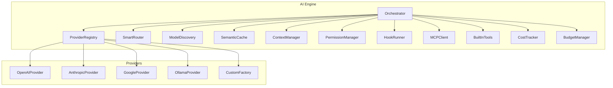

**Diagram sources**
- [orchestrator.ts](file://packages/ai-engine/src/orchestrator.ts)
- [provider-registry.ts](file://packages/ai-engine/src/provider-registry.ts)
- [smart-router.ts](file://packages/ai-engine/src/routing/smart-router.ts)
- [model-discovery.ts](file://packages/ai-engine/src/discovery/model-discovery.ts)
- [semantic-cache.ts](file://packages/ai-engine/src/cache/semantic-cache.ts)
- [context-manager.ts](file://packages/ai-engine/src/context/context-manager.ts)
- [permission-manager.ts](file://packages/ai-engine/src/permission/permission-manager.ts)
- [hook-runner.ts](file://packages/ai-engine/src/hooks/hook-runner.ts)
- [mcp-client.ts](file://packages/ai-engine/src/mcp/mcp-client.ts)
- [built-in-tools.ts](file://packages/ai-engine/src/tools/built-in-tools.ts)
- [openai.ts](file://packages/ai-engine/src/providers/openai.ts)
- [anthropic.ts](file://packages/ai-engine/src/providers/anthropic.ts)
- [google.ts](file://packages/ai-engine/src/providers/google.ts)
- [ollama.ts](file://packages/ai-engine/src/providers/ollama.ts)
- [factory.ts](file://packages/ai-engine/src/providers/factory.ts)

**Section sources**
- [orchestrator.ts](file://packages/ai-engine/src/orchestrator.ts)
- [provider-registry.ts](file://packages/ai-engine/src/provider-registry.ts)

## Core Components
- Orchestrator: Central coordinator managing provider registry, fallback logic, routing, cost/budget controls, semantic cache, and advanced modules (hooks, context, permissions, MCP, tools).
- ProviderRegistry: Registers providers from configuration and resolves them by type or role-based routing.
- Providers: Implementations for OpenAI, Anthropic, Google, Ollama, and a factory for custom providers.
- SmartRouter: Optional module that selects the best provider based on latency, cost, and quality thresholds.
- ModelDiscovery: Discovers available models from provider APIs.
- SemanticCache: Stores and retrieves semantically similar prompts to reduce redundant requests.
- CostTracker and BudgetManager: Track spending and enforce monthly limits.
- ContextManager, PermissionManager, HookRunner, MCPClient, BuiltInTools: Advanced orchestration features for context, permissions, lifecycle hooks, MCP integration, and built-in tools.

**Section sources**
- [orchestrator.ts](file://packages/ai-engine/src/orchestrator.ts)
- [provider-registry.ts](file://packages/ai-engine/src/provider-registry.ts)
- [smart-router.ts](file://packages/ai-engine/src/routing/smart-router.ts)
- [model-discovery.ts](file://packages/ai-engine/src/discovery/model-discovery.ts)
- [semantic-cache.ts](file://packages/ai-engine/src/cache/semantic-cache.ts)
- [budget-manager.ts](file://packages/ai-engine/src/budget/budget-manager.ts)
- [cost-tracker.ts](file://packages/ai-engine/src/cost/cost-tracker.ts)
- [context-manager.ts](file://packages/ai-engine/src/context/context-manager.ts)
- [permission-manager.ts](file://packages/ai-engine/src/permission/permission-manager.ts)
- [hook-runner.ts](file://packages/ai-engine/src/hooks/hook-runner.ts)
- [mcp-client.ts](file://packages/ai-engine/src/mcp/mcp-client.ts)
- [built-in-tools.ts](file://packages/ai-engine/src/tools/built-in-tools.ts)

## Architecture Overview
The AI Engine follows a layered architecture:
- Abstraction Layer: Provider interface unified across providers
- Factory Pattern: Dynamic creation and registration of providers
- Orchestration Layer: Orchestrator coordinates routing, fallback, caching, and advanced modules
- Integration Layer: Connects to desktop editor and mobile control via sockets and services

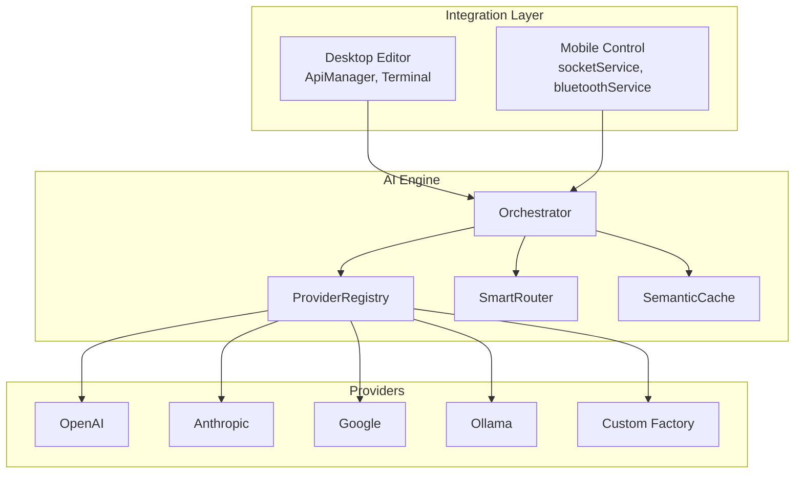

**Diagram sources**
- [orchestrator.ts](file://packages/ai-engine/src/orchestrator.ts)
- [provider-registry.ts](file://packages/ai-engine/src/provider-registry.ts)
- [smart-router.ts](file://packages/ai-engine/src/routing/smart-router.ts)
- [semantic-cache.ts](file://packages/ai-engine/src/cache/semantic-cache.ts)
- [openai.ts](file://packages/ai-engine/src/providers/openai.ts)
- [anthropic.ts](file://packages/ai-engine/src/providers/anthropic.ts)
- [google.ts](file://packages/ai-engine/src/providers/google.ts)
- [ollama.ts](file://packages/ai-engine/src/providers/ollama.ts)
- [factory.ts](file://packages/ai-engine/src/providers/factory.ts)
- [ApiManager.tsx](file://apps/desktop/src/components/ApiManager.tsx)
- [Terminal.tsx](file://apps/desktop/src/components/Terminal.tsx)
- [socketService.ts](file://apps/mobile/src/services/socketService.ts)
- [bluetoothService.ts](file://apps/mobile/src/services/bluetoothService.ts)

## Detailed Component Analysis

### Orchestrator: Central Coordination and Lifecycle
The Orchestrator initializes the provider registry, optional smart routing, model discovery, semantic cache, cost tracking, budget management, and advanced modules. It exposes methods to discover models, route providers, and execute chat with fallback logic.

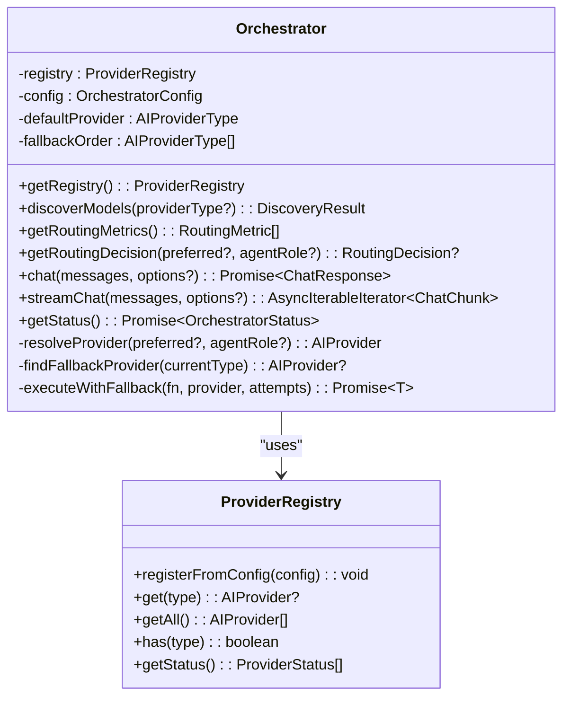

**Diagram sources**
- [orchestrator.ts](file://packages/ai-engine/src/orchestrator.ts)
- [provider-registry.ts](file://packages/ai-engine/src/provider-registry.ts)

**Section sources**
- [orchestrator.ts](file://packages/ai-engine/src/orchestrator.ts)

### Provider Factory Pattern and Registration
Providers are registered from configuration and resolved by type. The factory supports custom providers compatible with OpenAI-style APIs.

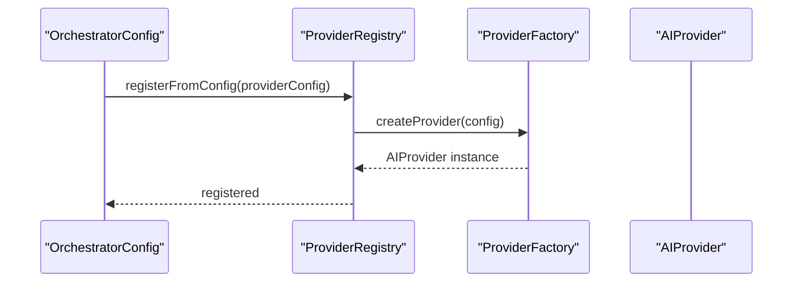

**Diagram sources**
- [provider-registry.ts](file://packages/ai-engine/src/provider-registry.ts)
- [factory.ts](file://packages/ai-engine/src/providers/factory.ts)

**Section sources**
- [provider-registry.ts](file://packages/ai-engine/src/provider-registry.ts)
- [factory.ts](file://packages/ai-engine/src/providers/factory.ts)

### Provider Implementations
Concrete providers implement a unified interface and expose capabilities like readiness checks and chat/streaming.

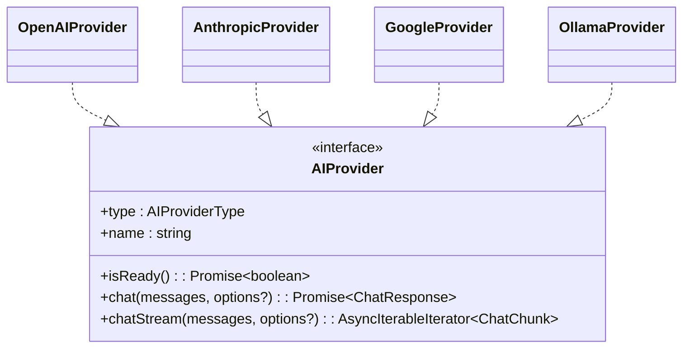

**Diagram sources**
- [openai.ts](file://packages/ai-engine/src/providers/openai.ts)
- [anthropic.ts](file://packages/ai-engine/src/providers/anthropic.ts)
- [google.ts](file://packages/ai-engine/src/providers/google.ts)
- [ollama.ts](file://packages/ai-engine/src/providers/ollama.ts)

**Section sources**
- [openai.ts](file://packages/ai-engine/src/providers/openai.ts)
- [anthropic.ts](file://packages/ai-engine/src/providers/anthropic.ts)
- [google.ts](file://packages/ai-engine/src/providers/google.ts)
- [ollama.ts](file://packages/ai-engine/src/providers/ollama.ts)

### Smart Routing and Model Discovery
SmartRouter selects providers based on configurable thresholds for cost, latency, and quality. ModelDiscovery queries provider APIs to enumerate available models.

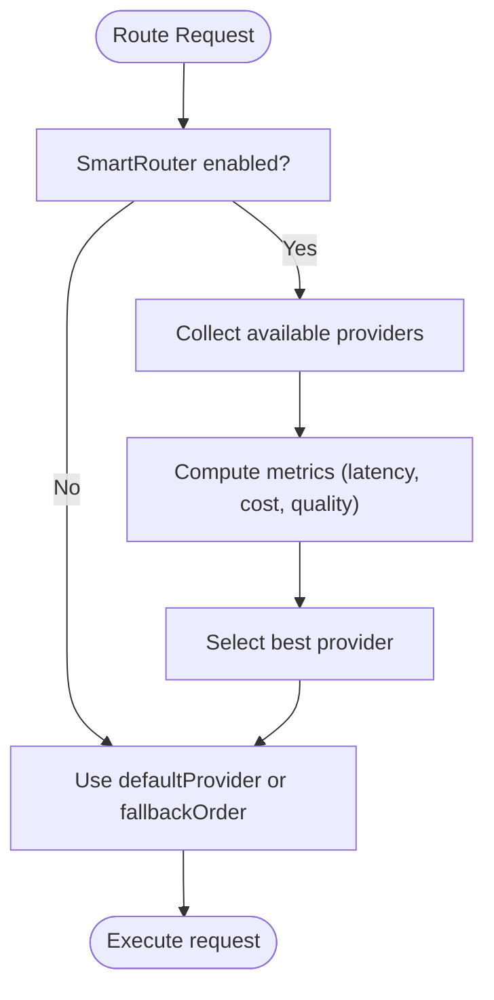

**Diagram sources**
- [smart-router.ts](file://packages/ai-engine/src/routing/smart-router.ts)
- [model-discovery.ts](file://packages/ai-engine/src/discovery/model-discovery.ts)

**Section sources**
- [smart-router.ts](file://packages/ai-engine/src/routing/smart-router.ts)
- [model-discovery.ts](file://packages/ai-engine/src/discovery/model-discovery.ts)

### Semantic Caching Strategy
SemanticCache reduces repeated work by storing embeddings of prompts and reusing responses when semantically similar prompts are detected.

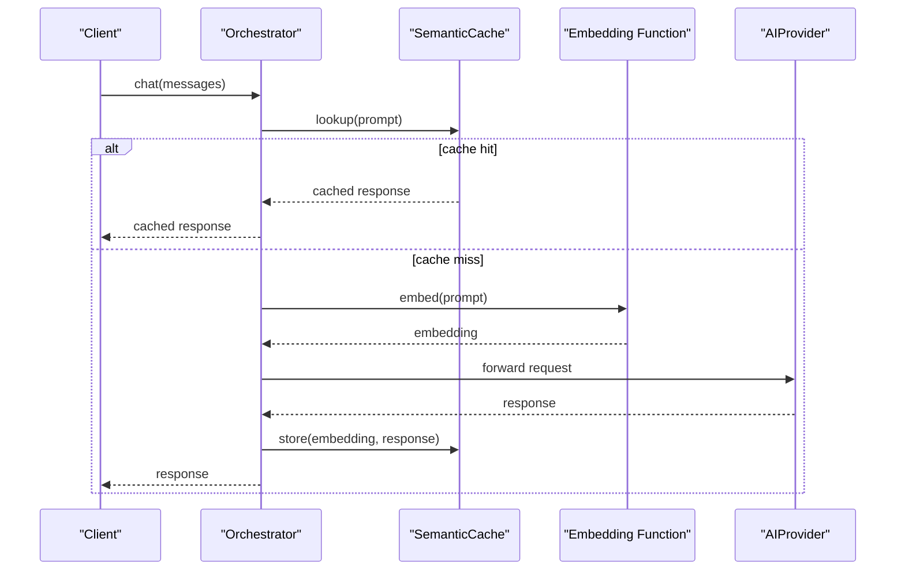

**Diagram sources**
- [semantic-cache.ts](file://packages/ai-engine/src/cache/semantic-cache.ts)
- [orchestrator.ts](file://packages/ai-engine/src/orchestrator.ts)

**Section sources**
- [semantic-cache.ts](file://packages/ai-engine/src/cache/semantic-cache.ts)
- [orchestrator.ts](file://packages/ai-engine/src/orchestrator.ts)

### Cost Tracking and Budget Management
CostTracker monitors per-request costs; BudgetManager enforces monthly spending limits and emits alerts.

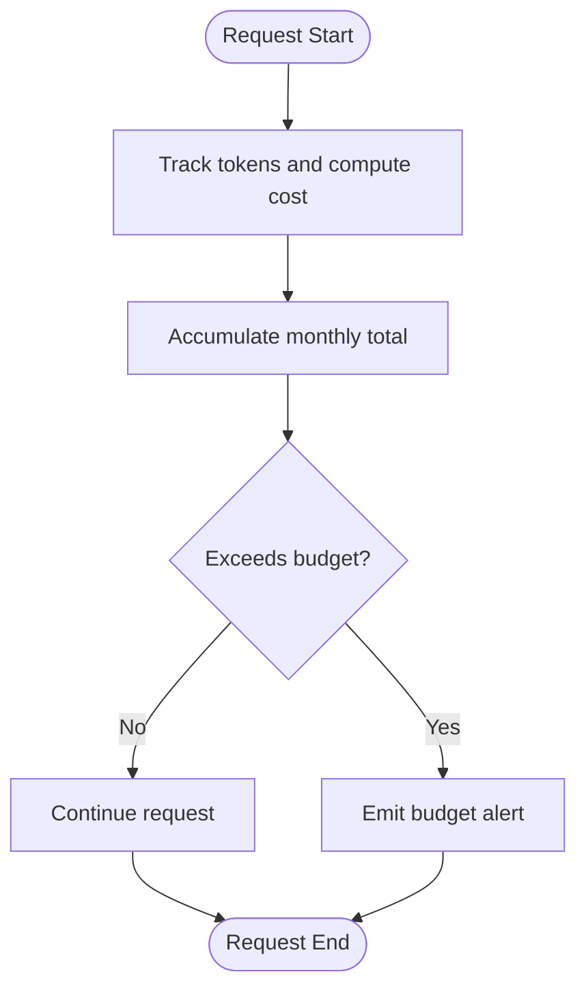

**Diagram sources**
- [cost-tracker.ts](file://packages/ai-engine/src/cost/cost-tracker.ts)
- [budget-manager.ts](file://packages/ai-engine/src/budget/budget-manager.ts)

**Section sources**
- [cost-tracker.ts](file://packages/ai-engine/src/cost/cost-tracker.ts)
- [budget-manager.ts](file://packages/ai-engine/src/budget/budget-manager.ts)

### Session State and Request Queuing
AI sessions are persisted in the desktop app using a dedicated storage utility. While the AI Engine itself focuses on orchestration, the desktop app manages session persistence and UI state.

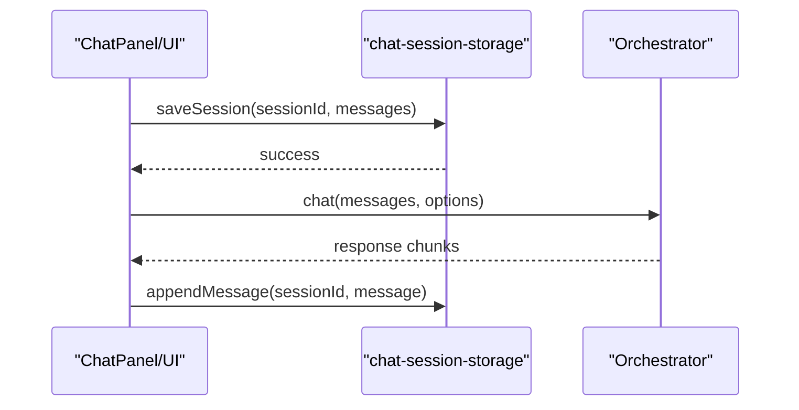

**Diagram sources**
- [chat-session-storage.ts](file://apps/desktop/src/utils/chat-session-storage.ts)
- [orchestrator.ts](file://packages/ai-engine/src/orchestrator.ts)

**Section sources**
- [chat-session-storage.ts](file://apps/desktop/src/utils/chat-session-storage.ts)
- [orchestrator.ts](file://packages/ai-engine/src/orchestrator.ts)

### Integration with Desktop Editor and Mobile Control
The desktop editor integrates with the AI Engine via API manager and terminal components. Mobile control uses socket and Bluetooth services to communicate with the AI Engine.

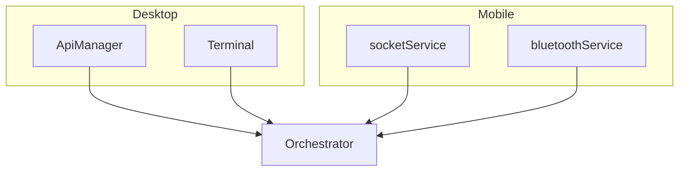

**Diagram sources**
- [ApiManager.tsx](file://apps/desktop/src/components/ApiManager.tsx)
- [Terminal.tsx](file://apps/desktop/src/components/Terminal.tsx)
- [socketService.ts](file://apps/mobile/src/services/socketService.ts)
- [bluetoothService.ts](file://apps/mobile/src/services/bluetoothService.ts)
- [orchestrator.ts](file://packages/ai-engine/src/orchestrator.ts)

**Section sources**
- [ApiManager.tsx](file://apps/desktop/src/components/ApiManager.tsx)
- [Terminal.tsx](file://apps/desktop/src/components/Terminal.tsx)
- [socketService.ts](file://apps/mobile/src/services/socketService.ts)
- [bluetoothService.ts](file://apps/mobile/src/services/bluetoothService.ts)
- [orchestrator.ts](file://packages/ai-engine/src/orchestrator.ts)

## Dependency Analysis
The AI Engine exhibits strong cohesion within orchestration modules and loose coupling through the Provider interface. Dependencies flow from Orchestrator to ProviderRegistry, SmartRouter, ModelDiscovery, and cache/cost modules, while providers depend only on the unified AIProvider interface.

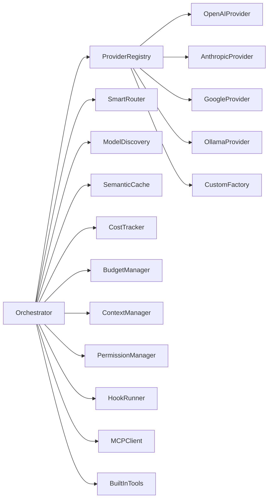

**Diagram sources**
- [orchestrator.ts](file://packages/ai-engine/src/orchestrator.ts)
- [provider-registry.ts](file://packages/ai-engine/src/provider-registry.ts)
- [smart-router.ts](file://packages/ai-engine/src/routing/smart-router.ts)
- [model-discovery.ts](file://packages/ai-engine/src/discovery/model-discovery.ts)
- [semantic-cache.ts](file://packages/ai-engine/src/cache/semantic-cache.ts)
- [cost-tracker.ts](file://packages/ai-engine/src/cost/cost-tracker.ts)
- [budget-manager.ts](file://packages/ai-engine/src/budget/budget-manager.ts)
- [context-manager.ts](file://packages/ai-engine/src/context/context-manager.ts)
- [permission-manager.ts](file://packages/ai-engine/src/permission/permission-manager.ts)
- [hook-runner.ts](file://packages/ai-engine/src/hooks/hook-runner.ts)
- [mcp-client.ts](file://packages/ai-engine/src/mcp/mcp-client.ts)
- [built-in-tools.ts](file://packages/ai-engine/src/tools/built-in-tools.ts)
- [openai.ts](file://packages/ai-engine/src/providers/openai.ts)
- [anthropic.ts](file://packages/ai-engine/src/providers/anthropic.ts)
- [google.ts](file://packages/ai-engine/src/providers/google.ts)
- [ollama.ts](file://packages/ai-engine/src/providers/ollama.ts)
- [factory.ts](file://packages/ai-engine/src/providers/factory.ts)

**Section sources**
- [orchestrator.ts](file://packages/ai-engine/src/orchestrator.ts)
- [provider-registry.ts](file://packages/ai-engine/src/provider-registry.ts)

## Performance Considerations
- Concurrency: Orchestrator executes requests with fallback retries; consider batching and rate limiting at the provider level.
- Caching: Enable semantic cache to reduce redundant calls; tune similarity threshold for optimal balance.
- Routing: Use SmartRouter to select providers with lower latency and cost; monitor routing metrics.
- Streaming: Prefer streaming responses for responsive UI; handle partial failures gracefully.
- Budget Controls: Monitor cost trends and adjust model selection to stay within budget.

[No sources needed since this section provides general guidance]

## Troubleshooting Guide
Common issues and resolutions:
- No providers registered: Verify OrchestratorConfig providers array and ensure registration via ProviderRegistry.
- Provider readiness failures: Implement proper isReady checks and credential validation in provider implementations.
- Fallback loops: Ensure fallbackOrder avoids the current provider and limit retry attempts.
- Budget exceeded: Adjust monthly limit or switch to less expensive models; review cost tracking logs.
- Semantic cache misses: Increase cache threshold or ensure embedding function is available.

**Section sources**
- [orchestrator.ts](file://packages/ai-engine/src/orchestrator.ts)
- [provider-registry.ts](file://packages/ai-engine/src/provider-registry.ts)
- [budget-manager.ts](file://packages/ai-engine/src/budget/budget-manager.ts)
- [semantic-cache.ts](file://packages/ai-engine/src/cache/semantic-cache.ts)

## Conclusion
The AI Engine provides a robust, extensible foundation for multi-provider AI orchestration. Its abstraction layer, factory pattern, and advanced modules enable intelligent routing, cost control, and caching while maintaining clean separation of concerns. Integration with desktop and mobile clients is straightforward through well-defined interfaces and services.

[No sources needed since this section summarizes without analyzing specific files]

## Appendices

### Extending with New AI Providers
Steps to integrate a new provider:
1. Define provider type in shared types and add to AIProviderType union.
2. Create a new provider class implementing AIProvider interface.
3. Register the provider via ProviderRegistry.fromConfig.
4. Add role-based routing entries if needed.
5. Test with Orchestrator and verify fallback behavior.

**Section sources**
- [provider-registry.ts](file://packages/ai-engine/src/provider-registry.ts)
- [types.ts](file://packages/ai-engine/src/types.ts)

### Testing the Orchestrator
Unit tests validate provider registration, routing by role, and fallback behavior. Use Vitest mocks to simulate provider readiness and chat responses.

**Section sources**
- [orchestrator.test.ts](file://tests/unit/orchestrator.test.ts)