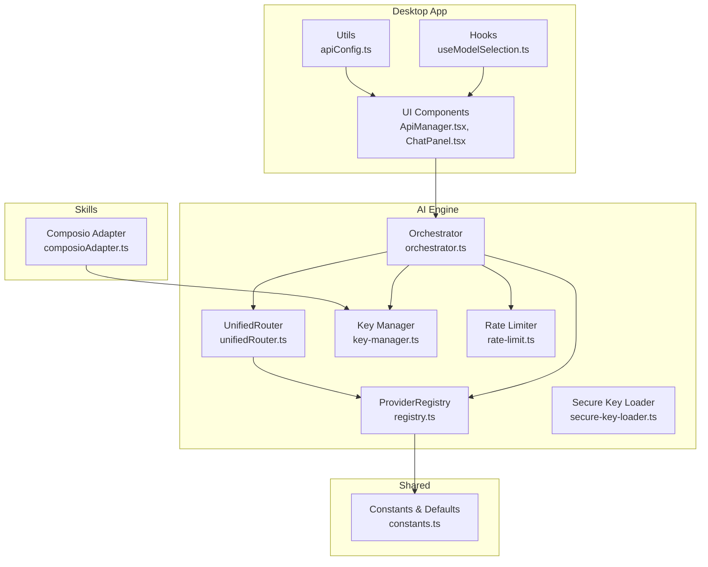
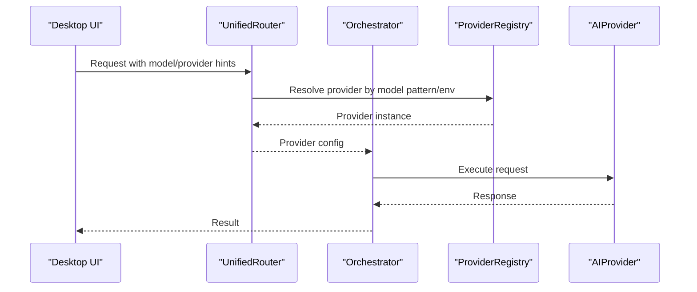
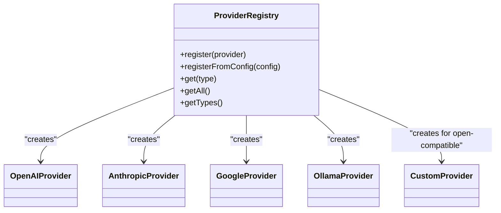
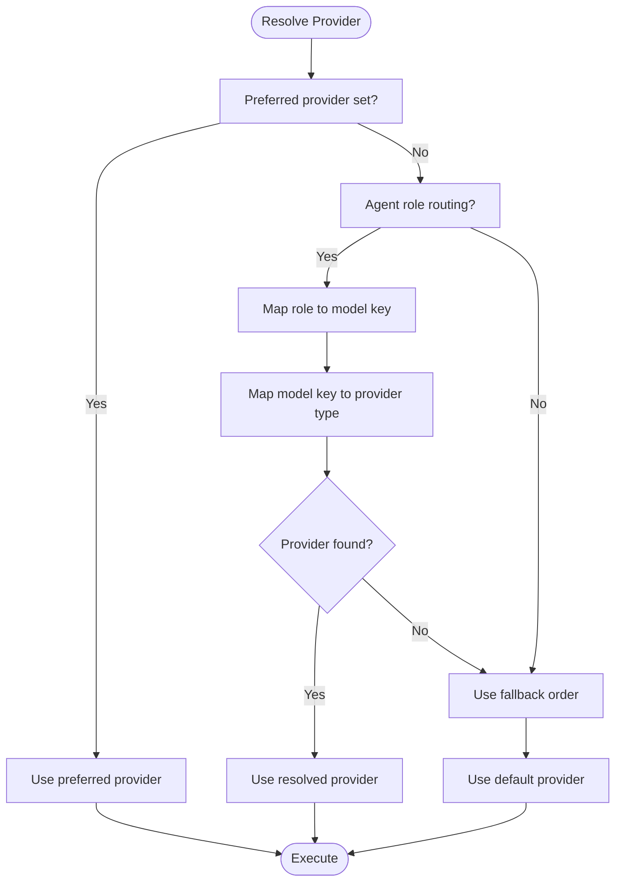
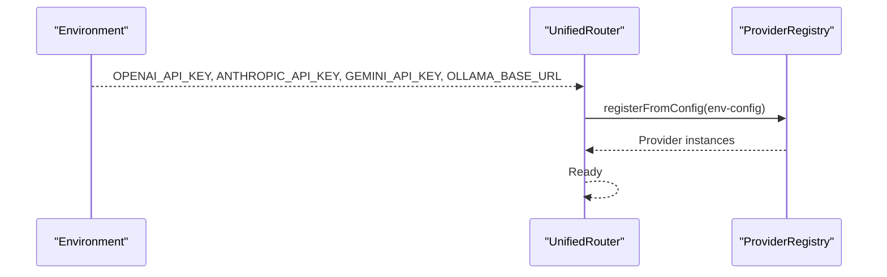
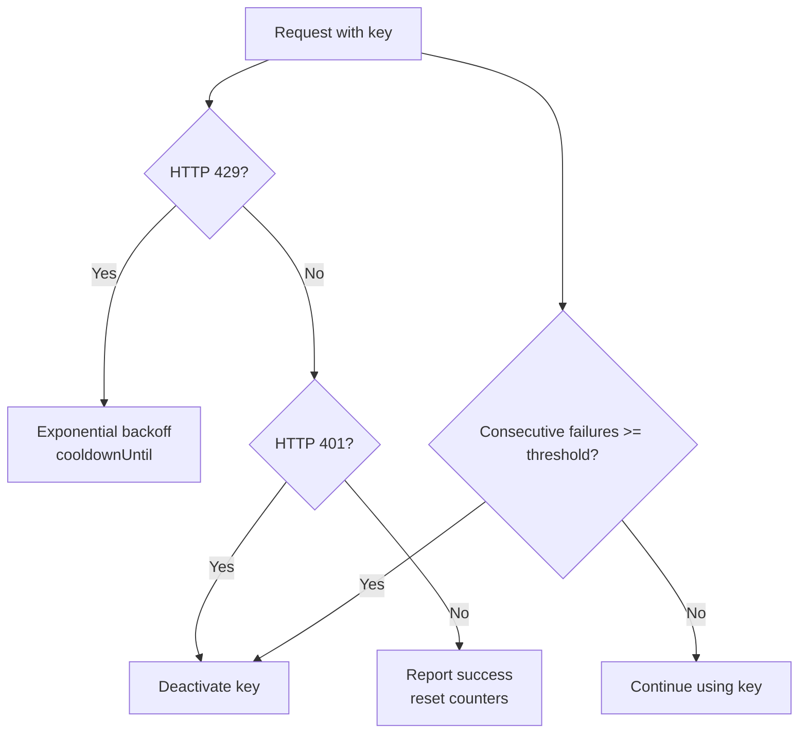
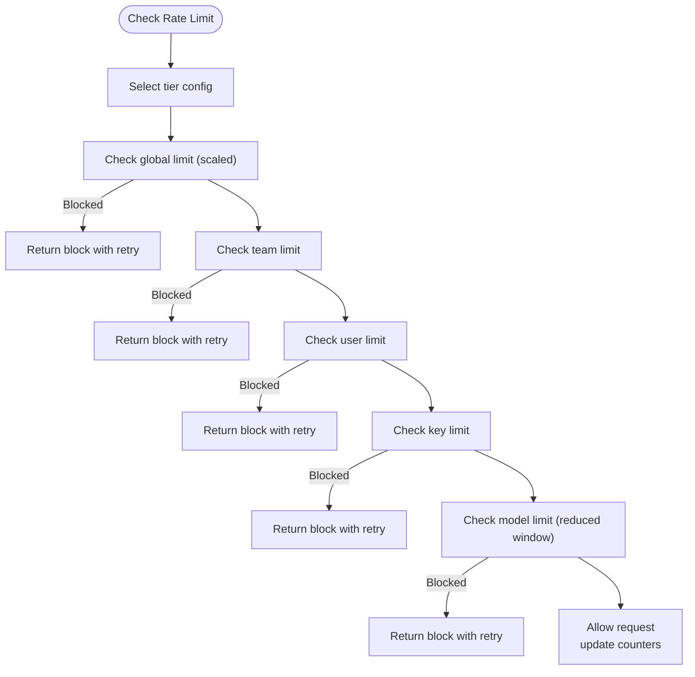
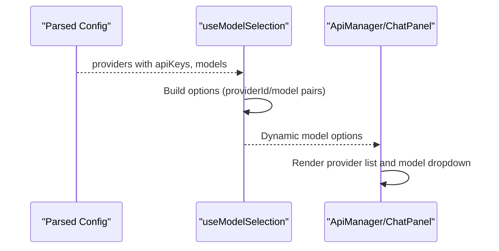
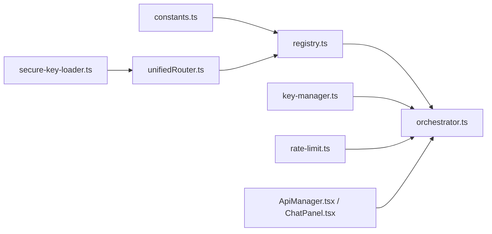

# AI Engine and Integration

<cite>
**Referenced Files in This Document**
- [useModelSelection.ts](file://apps/desktop/src/hooks/useModelSelection.ts)
- [ApiManager.tsx](file://apps/desktop/src/components/ApiManager.tsx)
- [constants.ts](file://packages/shared/src/constants.ts)
- [ChatPanel.tsx](file://apps/desktop/src/components/ChatPanel.tsx)
- [registry.ts](file://packages/ai-engine/src/registry.ts)
- [orchestrator.ts](file://packages/ai-engine/src/orchestrator.ts)
- [key-manager.ts](file://packages/ai-engine/src/key-manager.ts)
- [rate-limit.ts](file://packages/ai-engine/src/enterprise/rate-limit.ts)
- [secure-key-loader.ts](file://packages/ai-engine/src/utils/secure-key-loader.ts)
- [unifiedRouter.ts](file://packages/ai-engine/src/router/unifiedRouter.ts)
- [composioAdapter.ts](file://packages/skills/src/registry/composioAdapter.ts)
- [phase1.test.ts](file://tests/unit/phase1.test.ts)
- [unifiedRouter.test.ts](file://packages/ai-engine/tests/unifiedRouter.test.ts)
- [apiConfig.ts](file://apps/desktop/src/utils/apiConfig.ts)
</cite>

## Table of Contents
1. [Introduction](#introduction)
2. [Project Structure](#project-structure)
3. [Core Components](#core-components)
4. [Architecture Overview](#architecture-overview)
5. [Detailed Component Analysis](#detailed-component-analysis)
6. [Dependency Analysis](#dependency-analysis)
7. [Performance Considerations](#performance-considerations)
8. [Troubleshooting Guide](#troubleshooting-guide)
9. [Conclusion](#conclusion)
10. [Appendices](#appendices)

## Introduction
This document explains the AI Engine and Integration system that powers multi-provider AI orchestration across OpenAI, Anthropic Claude, Google AI, Ollama, and numerous other AI services through a unified abstraction layer. It covers provider integration patterns, configuration management, runtime switching, orchestration strategies, real-time code suggestions, intelligent refactoring, and desktop/mobile integration. It also documents rate limiting, error handling, performance, cost optimization, and fallback mechanisms.

## Project Structure
The AI Engine spans several packages and applications:
- Desktop application UI and configuration management
- AI Engine core (provider registry, orchestrator, routers, rate limiting, key management)
- Shared constants and provider metadata
- Skills adapters for external integrations
- Tests validating orchestration and routing behavior

**Diagram sources**
- [ApiManager.tsx](file://apps/desktop/src/components/ApiManager.tsx)
- [ChatPanel.tsx](file://apps/desktop/src/components/ChatPanel.tsx)
- [useModelSelection.ts](file://apps/desktop/src/hooks/useModelSelection.ts)
- [apiConfig.ts](file://apps/desktop/src/utils/apiConfig.ts)
- [registry.ts](file://packages/ai-engine/src/registry.ts)
- [orchestrator.ts](file://packages/ai-engine/src/orchestrator.ts)
- [unifiedRouter.ts](file://packages/ai-engine/src/router/unifiedRouter.ts)
- [key-manager.ts](file://packages/ai-engine/src/key-manager.ts)
- [rate-limit.ts](file://packages/ai-engine/src/enterprise/rate-limit.ts)
- [secure-key-loader.ts](file://packages/ai-engine/src/utils/secure-key-loader.ts)
- [constants.ts](file://packages/shared/src/constants.ts)
- [composioAdapter.ts](file://packages/skills/src/registry/composioAdapter.ts)

**Section sources**
- [registry.ts](file://packages/ai-engine/src/registry.ts)
- [orchestrator.ts](file://packages/ai-engine/src/orchestrator.ts)
- [unifiedRouter.ts](file://packages/ai-engine/src/router/unifiedRouter.ts)
- [key-manager.ts](file://packages/ai-engine/src/key-manager.ts)
- [rate-limit.ts](file://packages/ai-engine/src/enterprise/rate-limit.ts)
- [secure-key-loader.ts](file://packages/ai-engine/src/utils/secure-key-loader.ts)
- [constants.ts](file://packages/shared/src/constants.ts)
- [ApiManager.tsx](file://apps/desktop/src/components/ApiManager.tsx)
- [ChatPanel.tsx](file://apps/desktop/src/components/ChatPanel.tsx)
- [useModelSelection.ts](file://apps/desktop/src/hooks/useModelSelection.ts)
- [apiConfig.ts](file://apps/desktop/src/utils/apiConfig.ts)
- [composioAdapter.ts](file://packages/skills/src/registry/composioAdapter.ts)

## Core Components
- Provider Registry: Central factory for creating and managing AI providers (OpenAI, Anthropic, Google, Ollama, and custom/open-compatible providers).
- Orchestrator: Coordinates provider selection, routing, discovery, and optional cost/budget/semantic caching modules.
- Unified Router: Resolves providers by model patterns and environment configuration.
- Key Manager: Manages multiple API keys per provider, rotation strategies, and failure-aware deactivation/cooldown.
- Rate Limiter: Implements sliding-window rate limits with tiers and scopes (user/team/global).
- Secure Key Loader: Loads keys from environment variables with safe caching and minimal exposure.
- Shared Constants: Default provider metadata and defaults (e.g., Ollama base URL).
- UI Integrations: Desktop API manager and model selection hooks for configuration and runtime switching.

**Section sources**
- [registry.ts](file://packages/ai-engine/src/registry.ts)
- [orchestrator.ts](file://packages/ai-engine/src/orchestrator.ts)
- [unifiedRouter.ts](file://packages/ai-engine/src/router/unifiedRouter.ts)
- [key-manager.ts](file://packages/ai-engine/src/key-manager.ts)
- [rate-limit.ts](file://packages/ai-engine/src/enterprise/rate-limit.ts)
- [secure-key-loader.ts](file://packages/ai-engine/src/utils/secure-key-loader.ts)
- [constants.ts](file://packages/shared/src/constants.ts)
- [ApiManager.tsx](file://apps/desktop/src/components/ApiManager.tsx)
- [useModelSelection.ts](file://apps/desktop/src/hooks/useModelSelection.ts)

## Architecture Overview
The system abstracts multiple AI providers behind a single interface. Providers are registered at startup, then resolved dynamically by model identifiers or explicit preferences. The orchestrator coordinates fallback ordering, discovery, and optional advanced modules. The UI exposes configuration and runtime controls for providers and models.

**Diagram sources**
- [unifiedRouter.ts](file://packages/ai-engine/src/router/unifiedRouter.ts)
- [registry.ts](file://packages/ai-engine/src/registry.ts)
- [orchestrator.ts](file://packages/ai-engine/src/orchestrator.ts)

## Detailed Component Analysis

### Provider Registry and Factory
The registry creates provider instances based on configuration or environment. It supports dedicated providers (OpenAI, Anthropic, Google, Ollama) and a generic CustomProvider for open-compatible APIs. It also maps legacy and new provider types consistently.

**Diagram sources**
- [registry.ts](file://packages/ai-engine/src/registry.ts)

**Section sources**
- [registry.ts](file://packages/ai-engine/src/registry.ts)

### Orchestrator and Runtime Switching
The orchestrator maintains a registry, default provider, and fallback order. It resolves providers either by explicit preference, agent role routing, or model-key mapping. It optionally integrates cost tracking, budget management, and semantic caching.

**Diagram sources**
- [orchestrator.ts](file://packages/ai-engine/src/orchestrator.ts)

**Section sources**
- [orchestrator.ts](file://packages/ai-engine/src/orchestrator.ts)

### Unified Router and Environment Integration
The unified router loads providers from environment variables and aggregates them into the registry. It supports model-to-provider resolution and readiness checks.

**Diagram sources**
- [unifiedRouter.ts](file://packages/ai-engine/src/router/unifiedRouter.ts)

**Section sources**
- [unifiedRouter.ts](file://packages/ai-engine/src/router/unifiedRouter.ts)

### Key Management and Rotation Strategies
The key manager tracks key health, applies exponential backoff on 429, deactivates on 401, and supports rotation strategies (failover, round-robin, random). The secure key loader reads keys from environment variables safely.

**Diagram sources**
- [key-manager.ts](file://packages/ai-engine/src/key-manager.ts)

**Section sources**
- [key-manager.ts](file://packages/ai-engine/src/key-manager.ts)
- [secure-key-loader.ts](file://packages/ai-engine/src/utils/secure-key-loader.ts)

### Rate Limiting and Cost Controls
The rate limiter implements sliding-window counters across scopes (user, team, key, model, global) with configurable tiers. It supports burst allowances and token-based limits.

**Diagram sources**
- [rate-limit.ts](file://packages/ai-engine/src/enterprise/rate-limit.ts)

**Section sources**
- [rate-limit.ts](file://packages/ai-engine/src/enterprise/rate-limit.ts)

### Configuration Management and UI Integration
The desktop UI exposes provider configuration, multi-key management, and rotation strategies. The model selection hook builds dynamic model options from parsed configurations and provider metadata.

**Diagram sources**
- [useModelSelection.ts](file://apps/desktop/src/hooks/useModelSelection.ts)
- [ApiManager.tsx](file://apps/desktop/src/components/ApiManager.tsx)
- [ChatPanel.tsx](file://apps/desktop/src/components/ChatPanel.tsx)

**Section sources**
- [useModelSelection.ts](file://apps/desktop/src/hooks/useModelSelection.ts)
- [ApiManager.tsx](file://apps/desktop/src/components/ApiManager.tsx)
- [ChatPanel.tsx](file://apps/desktop/src/components/ChatPanel.tsx)
- [apiConfig.ts](file://apps/desktop/src/utils/apiConfig.ts)

### Real-time Code Suggestions and Refactoring
The system’s orchestration and provider abstractions enable real-time suggestions and refactoring by selecting appropriate providers for different stages (e.g., fast reasoning vs. detailed editing). The UI components integrate suggestions into the editor and overlays, while the orchestrator coordinates provider availability and latency.

[No sources needed since this section synthesizes behavior without analyzing specific files]

### Mobile Control Integration
Skills adapters manage external service credentials, isolation, rate limiting, and OAuth refresh flows. These capabilities support remote control and device interactions via the mobile app.

**Section sources**
- [composioAdapter.ts](file://packages/skills/src/registry/composioAdapter.ts)

## Dependency Analysis
The AI Engine depends on shared constants for provider defaults and the desktop UI for configuration. The orchestrator composes multiple modules (registry, router, key manager, rate limiter) and optionally advanced modules (cost tracking, budget, cache).

**Diagram sources**
- [constants.ts](file://packages/shared/src/constants.ts)
- [registry.ts](file://packages/ai-engine/src/registry.ts)
- [orchestrator.ts](file://packages/ai-engine/src/orchestrator.ts)
- [unifiedRouter.ts](file://packages/ai-engine/src/router/unifiedRouter.ts)
- [key-manager.ts](file://packages/ai-engine/src/key-manager.ts)
- [rate-limit.ts](file://packages/ai-engine/src/enterprise/rate-limit.ts)
- [secure-key-loader.ts](file://packages/ai-engine/src/utils/secure-key-loader.ts)
- [ApiManager.tsx](file://apps/desktop/src/components/ApiManager.tsx)
- [ChatPanel.tsx](file://apps/desktop/src/components/ChatPanel.tsx)

**Section sources**
- [constants.ts](file://packages/shared/src/constants.ts)
- [registry.ts](file://packages/ai-engine/src/registry.ts)
- [orchestrator.ts](file://packages/ai-engine/src/orchestrator.ts)
- [unifiedRouter.ts](file://packages/ai-engine/src/router/unifiedRouter.ts)
- [key-manager.ts](file://packages/ai-engine/src/key-manager.ts)
- [rate-limit.ts](file://packages/ai-engine/src/enterprise/rate-limit.ts)
- [secure-key-loader.ts](file://packages/ai-engine/src/utils/secure-key-loader.ts)
- [ApiManager.tsx](file://apps/desktop/src/components/ApiManager.tsx)
- [ChatPanel.tsx](file://apps/desktop/src/components/ChatPanel.tsx)

## Performance Considerations
- Use model-based routing to select providers optimized for latency or capability.
- Enable rate limiting tiers aligned with provider plans to avoid throttling.
- Employ round-robin or failover strategies to distribute load and reduce contention.
- Cache provider metadata and model lists to minimize repeated discovery overhead.
- Prefer local providers (e.g., Ollama) for low-latency scenarios when feasible.

[No sources needed since this section provides general guidance]

## Troubleshooting Guide
Common issues and remedies:
- Authentication failures: Keys are deactivated on 401; re-enter keys in the UI and reset the key via the key manager.
- Rate limiting: On 429, the key enters cooldown; wait for the backoff period or switch to another key.
- Provider unavailability: Configure fallback order and monitor readiness; the orchestrator will attempt fallback providers.
- Model not found: Verify model availability for the selected provider and adjust model selection accordingly.

**Section sources**
- [key-manager.ts](file://packages/ai-engine/src/key-manager.ts)
- [rate-limit.ts](file://packages/ai-engine/src/enterprise/rate-limit.ts)
- [orchestrator.ts](file://packages/ai-engine/src/orchestrator.ts)

## Conclusion
The AI Engine and Integration system provides a robust, extensible framework for multi-provider AI orchestration. Its abstraction layer, dynamic provider resolution, key management, and rate limiting enable reliable, cost-effective, and performant AI workflows across desktop and mobile environments.

[No sources needed since this section summarizes without analyzing specific files]

## Appendices

### Provider-Specific Configuration Examples
- OpenAI: Set environment variables for API key and base URL; the unified router auto-registers when present.
- Anthropic: Provide API key and base URL; model discovery supported via router configuration.
- Google Gemini: Supply API key and base URL; default models and model fetching endpoints are configurable.
- Ollama: Configure base URL; no API key required for local deployments.
- Custom/Open-compatible providers: Use CustomProvider with compatible base URLs and model names.

**Section sources**
- [unifiedRouter.ts](file://packages/ai-engine/src/router/unifiedRouter.ts)
- [ApiManager.tsx](file://apps/desktop/src/components/ApiManager.tsx)
- [constants.ts](file://packages/shared/src/constants.ts)

### Best Practices for Provider Management
- Maintain multiple keys per provider and configure rotation strategies.
- Monitor provider readiness and fallback order to ensure resilience.
- Align rate limit tiers with subscription plans and usage patterns.
- Use environment variables for secure key loading and avoid logging sensitive values.
- Leverage model discovery and routing to optimize for task type and latency.

**Section sources**
- [secure-key-loader.ts](file://packages/ai-engine/src/utils/secure-key-loader.ts)
- [key-manager.ts](file://packages/ai-engine/src/key-manager.ts)
- [rate-limit.ts](file://packages/ai-engine/src/enterprise/rate-limit.ts)
- [unifiedRouter.ts](file://packages/ai-engine/src/router/unifiedRouter.ts)

### Validation and Testing References
- Unit tests demonstrate custom error hierarchy and orchestrator behavior.
- Router tests validate model-to-provider resolution across multiple providers.

**Section sources**
- [phase1.test.ts](file://tests/unit/phase1.test.ts)
- [unifiedRouter.test.ts](file://packages/ai-engine/tests/unifiedRouter.test.ts)