# AI Features and Capabilities

<cite>
**Referenced Files in This Document**
- [builtins.ts](file://packages/skills/src/commands/builtins.ts)
- [CodeEditor.tsx](file://apps/desktop/src/components/CodeEditor.tsx)
- [SkillManager.tsx](file://apps/desktop/src/components/SkillManager.tsx)
- [AgentsView.tsx](file://apps/desktop/src/views/AgentsView.tsx)
- [SkillsView.tsx](file://apps/desktop/src/views/SkillsView.tsx)
- [ApiManager.tsx](file://apps/desktop/src/components/ApiManager.tsx)
- [sharedSocket.ts](file://apps/desktop/src/utils/sharedSocket.ts)
- [shell.ts](file://apps/desktop/src/utils/shell.ts)
- [chatSessionStorage.ts](file://apps/desktop/src/utils/chatSessionStorage.ts)
- [extension.ts](file://apps/vscode-extension/src/extension.ts)
- [package.json](file://apps/vscode-extension/package.json)
- [main.rs](file://apps/desktop/src-tauri/src/main.rs)
- [Cargo.toml](file://apps/desktop/src-tauri/Cargo.toml)
- [screenCapture_1.3.2.bat](file://apps/desktop/src-tauri/sidecar/screenCapture_1.3.2.bat)
- [terminal.ts](file://apps/desktop/src/components/Terminal.tsx)
- [Terminal.integration.test.ts](file://apps/desktop/src/components/Terminal.integration.test.ts)
- [README.md](file://group/README.md)
- [PROTOCOL.md](file://group/PROTOCOL.md)
- [tasks.md](file://group/tasks.md)
- [decisions.md](file://group/decisions.md)
- [brainstorm.md](file://group/brainstorm.md)
- [discussion.md](file://group/discussion.md)
- [final_report.txt](file://group/Chat_2026-05-31_08-10-16/final_report.txt)
- [giam_doc_final.txt](file://group/Chat_2026-05-31_08-10-16/giam_doc_final.txt)
- [developer.txt](file://group/Chat_2026-05-31_08-10-16/developer.txt)
- [dev_func1.txt](file://group/Chat_2026-05-31_08-10-16/dev_func1.txt)
- [dev_func2.txt](file://group/Chat_2026-05-31_08-10-16/dev_func2.txt)
- [dev_perf1.txt](file://group/Chat_2026-05-31_08-10-16/dev_perf1.txt)
- [dev_security.txt](file://group/Chat_2026-05-31_08-10-16/dev_security.txt)
- [dev_ui1.txt](file://group/Chat_2026-05-31_08-10-16/dev_ui1.txt)
- [dev_ui2.txt](file://group/Chat_2026-05-31_08-10-16/dev_ui2.txt)
- [developer_performance.txt](file://group/Chat_2026-05-31_08-10-16/developer_performance.txt)
- [developer_security.txt](file://group/Chat_2026-05-31_08-10-16/developer_security.txt)
- [developer_ui2.txt](file://group/Chat_2026-05-31_08-10-16/developer_ui2.txt)
- [giam_doc.txt](file://group/Chat_2026-05-31_08-10-16/giam_doc.txt)
</cite>

## Table of Contents
1. [Introduction](#introduction)
2. [Project Structure](#project-structure)
3. [Core Components](#core-components)
4. [Architecture Overview](#architecture-overview)
5. [Detailed Component Analysis](#detailed-component-analysis)
6. [Dependency Analysis](#dependency-analysis)
7. [Performance Considerations](#performance-considerations)
8. [Troubleshooting Guide](#troubleshooting-guide)
9. [Conclusion](#conclusion)
10. [Appendices](#appendices)

## Introduction
This document describes the AI features and capabilities implemented in the project, focusing on:
- Real-time code suggestions and context-aware assistance
- Intelligent code refactoring and optimization
- Automated documentation generation
- AI-assisted testing and edge-case discovery
- Integration patterns for desktop editor, mobile remote control, and VS Code extension
- Practical usage examples, customization, performance tuning, privacy, prompt engineering, and ethical AI guidelines

The AI functionality is primarily exposed via a skill/command system integrated into the desktop application, with supporting utilities for chat sessions, terminal orchestration, and a VS Code extension for workspace synchronization.

## Project Structure
The AI features span several areas:
- Skills and commands that provide AI-driven actions (refactor, explain, optimize)
- Desktop UI integrating a code editor, chat, and agent panels
- Utilities for shell execution, session storage, and WebSocket communication
- VS Code extension for workspace synchronization
- Tauri backend for native capabilities and sidecar processes
- Group collaboration artifacts that include documentation drafts and reports

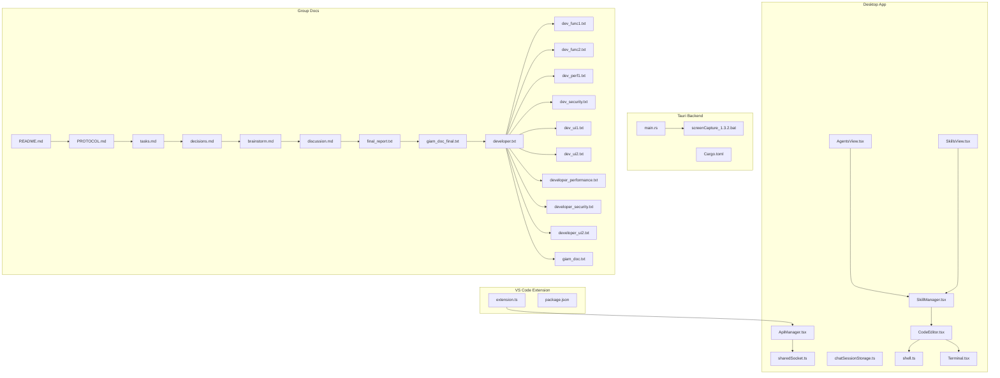

**Diagram sources**
- [CodeEditor.tsx:1-150](file://apps/desktop/src/components/CodeEditor.tsx#L1-L150)
- [SkillManager.tsx:1-300](file://apps/desktop/src/components/SkillManager.tsx#L1-L300)
- [AgentsView.tsx:1-30](file://apps/desktop/src/views/AgentsView.tsx#L1-L30)
- [SkillsView.tsx:1-30](file://apps/desktop/src/views/SkillsView.tsx#L1-L30)
- [ApiManager.tsx:1-200](file://apps/desktop/src/components/ApiManager.tsx#L1-L200)
- [sharedSocket.ts:1-120](file://apps/desktop/src/utils/sharedSocket.ts#L1-L120)
- [chatSessionStorage.ts:1-120](file://apps/desktop/src/utils/chatSessionStorage.ts#L1-L120)
- [shell.ts:1-120](file://apps/desktop/src/utils/shell.ts#L1-L120)
- [Terminal.tsx:1-120](file://apps/desktop/src/components/Terminal.tsx#L1-L120)
- [extension.ts:1-200](file://apps/vscode-extension/src/extension.ts#L1-L200)
- [package.json:1-120](file://apps/vscode-extension/package.json#L1-L120)
- [main.rs:1-120](file://apps/desktop/src-tauri/src/main.rs#L1-L120)
- [Cargo.toml:1-120](file://apps/desktop/src-tauri/Cargo.toml#L1-L120)
- [screenCapture_1.3.2.bat:1-50](file://apps/desktop/src-tauri/sidecar/screenCapture_1.3.2.bat#L1-L50)
- [README.md:1-200](file://group/README.md#L1-L200)
- [PROTOCOL.md:1-200](file://group/PROTOCOL.md#L1-L200)
- [tasks.md:1-200](file://group/tasks.md#L1-L200)
- [decisions.md:1-200](file://group/decisions.md#L1-L200)
- [brainstorm.md:1-200](file://group/brainstorm.md#L1-L200)
- [discussion.md:1-200](file://group/discussion.md#L1-L200)
- [final_report.txt:1-200](file://group/Chat_2026-05-31_08-10-16/final_report.txt#L1-L200)
- [giam_doc_final.txt:1-200](file://group/Chat_2026-05-31_08-10-16/giam_doc_final.txt#L1-L200)
- [developer.txt:1-200](file://group/Chat_2026-05-31_08-10-16/developer.txt#L1-L200)
- [dev_func1.txt:1-200](file://group/Chat_2026-05-31_08-10-16/dev_func1.txt#L1-L200)
- [dev_func2.txt:1-200](file://group/Chat_2026-05-31_08-10-16/dev_func2.txt#L1-L200)
- [dev_perf1.txt:1-200](file://group/Chat_2026-05-31_08-10-16/dev_perf1.txt#L1-L200)
- [dev_security.txt:1-200](file://group/Chat_2026-05-31_08-10-16/dev_security.txt#L1-L200)
- [dev_ui1.txt:1-200](file://group/Chat_2026-05-31_08-10-16/dev_ui1.txt#L1-L200)
- [dev_ui2.txt:1-200](file://group/Chat_2026-05-31_08-10-16/dev_ui2.txt#L1-L200)
- [developer_performance.txt:1-200](file://group/Chat_2026-05-31_08-10-16/developer_performance.txt#L1-L200)
- [developer_security.txt:1-200](file://group/Chat_2026-05-31_08-10-16/developer_security.txt#L1-L200)
- [developer_ui2.txt:1-200](file://group/Chat_2026-05-31_08-10-16/developer_ui2.txt#L1-L200)
- [giam_doc.txt:1-200](file://group/Chat_2026-05-31_08-10-16/giam_doc.txt#L1-L200)

**Section sources**
- [README.md:1-200](file://group/README.md#L1-L200)
- [PROTOCOL.md:1-200](file://group/PROTOCOL.md#L1-L200)

## Core Components
- AI Skills and Commands: Provide AI-driven actions such as code explanation, refactoring suggestions, and optimization recommendations. These are implemented as built-in commands with triggers and flags.
- Desktop Editor Integration: The code editor component integrates with shell utilities and terminal components to support AI-assisted editing workflows.
- Agent and Skill Views: The desktop application exposes views for managing agents and skills, enabling users to discover and activate AI features.
- Communication and Sessions: Shared sockets and chat session storage enable persistent AI conversations and stateful interactions.
- VS Code Extension: A VS Code extension coordinates with the desktop backend to synchronize workspaces and enable AI features across environments.
- Tauri Backend: Native capabilities and sidecar processes support advanced features like screen capture and system-level integrations.

Key implementation references:
- AI commands for explanation, refactoring, and optimization
- Code editor and terminal integration
- Agent and skill management UI
- Session storage and socket utilities
- VS Code extension entrypoint and manifest

**Section sources**
- [builtins.ts:336-390](file://packages/skills/src/commands/builtins.ts#L336-L390)
- [CodeEditor.tsx:1-150](file://apps/desktop/src/components/CodeEditor.tsx#L1-L150)
- [SkillManager.tsx:1-300](file://apps/desktop/src/components/SkillManager.tsx#L1-L300)
- [AgentsView.tsx:1-30](file://apps/desktop/src/views/AgentsView.tsx#L1-L30)
- [SkillsView.tsx:1-30](file://apps/desktop/src/views/SkillsView.tsx#L1-L30)
- [sharedSocket.ts:1-120](file://apps/desktop/src/utils/sharedSocket.ts#L1-L120)
- [chatSessionStorage.ts:1-120](file://apps/desktop/src/utils/chatSessionStorage.ts#L1-L120)
- [extension.ts:1-200](file://apps/vscode-extension/src/extension.ts#L1-L200)
- [package.json:1-120](file://apps/vscode-extension/package.json#L1-L120)
- [main.rs:1-120](file://apps/desktop/src-tauri/src/main.rs#L1-L120)

## Architecture Overview
The AI features are orchestrated through a layered architecture:
- UI Layer: Views for agents, skills, and code editor
- Command Layer: Built-in AI commands for explanation, refactoring, and optimization
- Utility Layer: Shell execution, terminal orchestration, and session management
- Backend Layer: Tauri backend and sidecar processes
- Extension Layer: VS Code extension for workspace synchronization

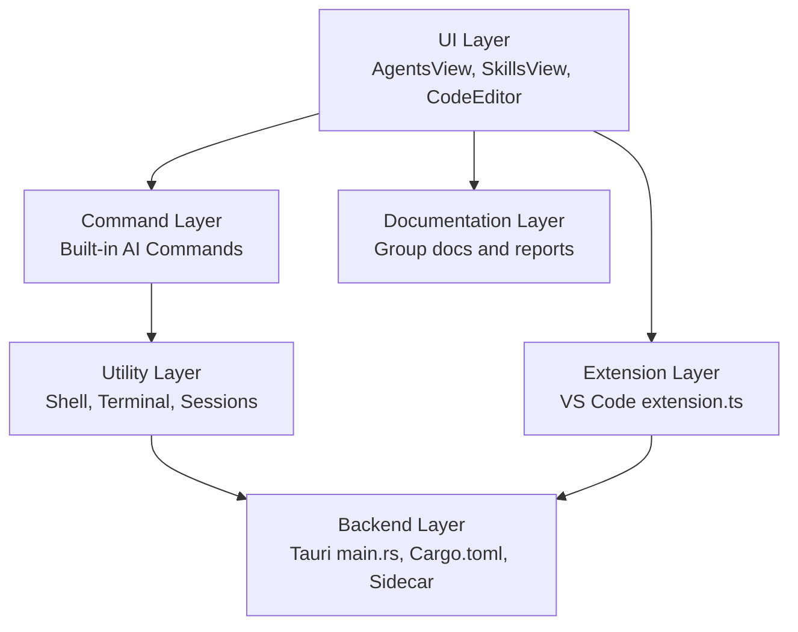

**Diagram sources**
- [AgentsView.tsx:1-30](file://apps/desktop/src/views/AgentsView.tsx#L1-L30)
- [SkillsView.tsx:1-30](file://apps/desktop/src/views/SkillsView.tsx#L1-L30)
- [CodeEditor.tsx:1-150](file://apps/desktop/src/components/CodeEditor.tsx#L1-L150)
- [builtins.ts:336-390](file://packages/skills/src/commands/builtins.ts#L336-L390)
- [shell.ts:1-120](file://apps/desktop/src/utils/shell.ts#L1-L120)
- [Terminal.tsx:1-120](file://apps/desktop/src/components/Terminal.tsx#L1-L120)
- [chatSessionStorage.ts:1-120](file://apps/desktop/src/utils/chatSessionStorage.ts#L1-L120)
- [main.rs:1-120](file://apps/desktop/src-tauri/src/main.rs#L1-L120)
- [Cargo.toml:1-120](file://apps/desktop/src-tauri/Cargo.toml#L1-L120)
- [screenCapture_1.3.2.bat:1-50](file://apps/desktop/src-tauri/sidecar/screenCapture_1.3.2.bat#L1-L50)
- [extension.ts:1-200](file://apps/vscode-extension/src/extension.ts#L1-L200)

## Detailed Component Analysis

### AI Skills and Commands
The skills package defines built-in commands that integrate AI models to provide:
- Code explanation
- Refactoring suggestions (with type selection)
- Performance optimization recommendations

These commands:
- Parse flags and arguments
- Retrieve file content
- Invoke a universal AI model via a chat interface
- Return structured responses suitable for display in the UI

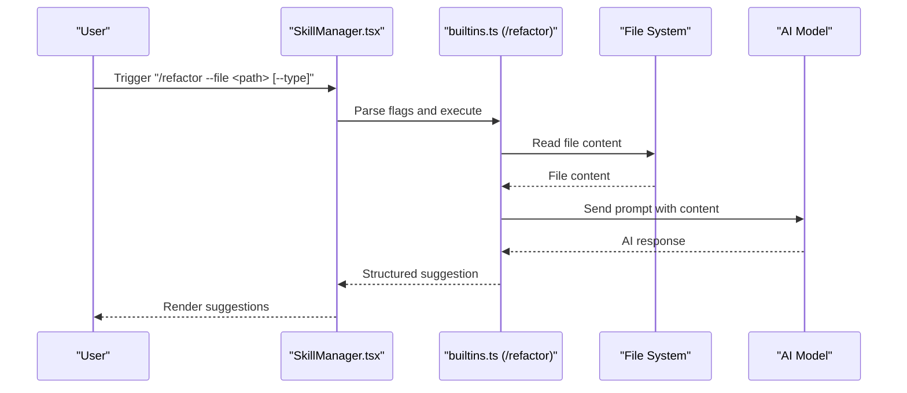

**Diagram sources**
- [builtins.ts:336-390](file://packages/skills/src/commands/builtins.ts#L336-L390)

**Section sources**
- [builtins.ts:336-390](file://packages/skills/src/commands/builtins.ts#L336-L390)

### Code Assistant Functionality
The code assistant integrates with:
- CodeEditor.tsx for editing and context
- shell.ts for executing commands and retrieving context
- Terminal.tsx for interactive command execution and feedback

This enables context-aware suggestions, completion hints, and error prevention by leveraging AI responses within the editor workflow.

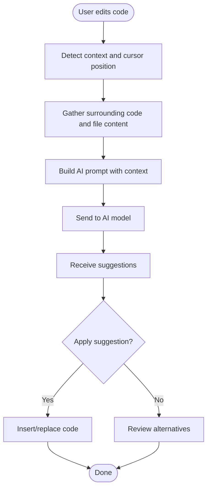

**Diagram sources**
- [CodeEditor.tsx:1-150](file://apps/desktop/src/components/CodeEditor.tsx#L1-L150)
- [shell.ts:1-120](file://apps/desktop/src/utils/shell.ts#L1-L120)
- [Terminal.tsx:1-120](file://apps/desktop/src/components/Terminal.tsx#L1-L120)

**Section sources**
- [CodeEditor.tsx:1-150](file://apps/desktop/src/components/CodeEditor.tsx#L1-L150)
- [shell.ts:1-120](file://apps/desktop/src/utils/shell.ts#L1-L120)
- [Terminal.tsx:1-120](file://apps/desktop/src/components/Terminal.tsx#L1-L120)

### Refactoring Engine
The refactoring engine leverages the built-in refactoring command to analyze code structure and propose improvements. It supports different refactoring types and maintains functionality by returning actionable suggestions.

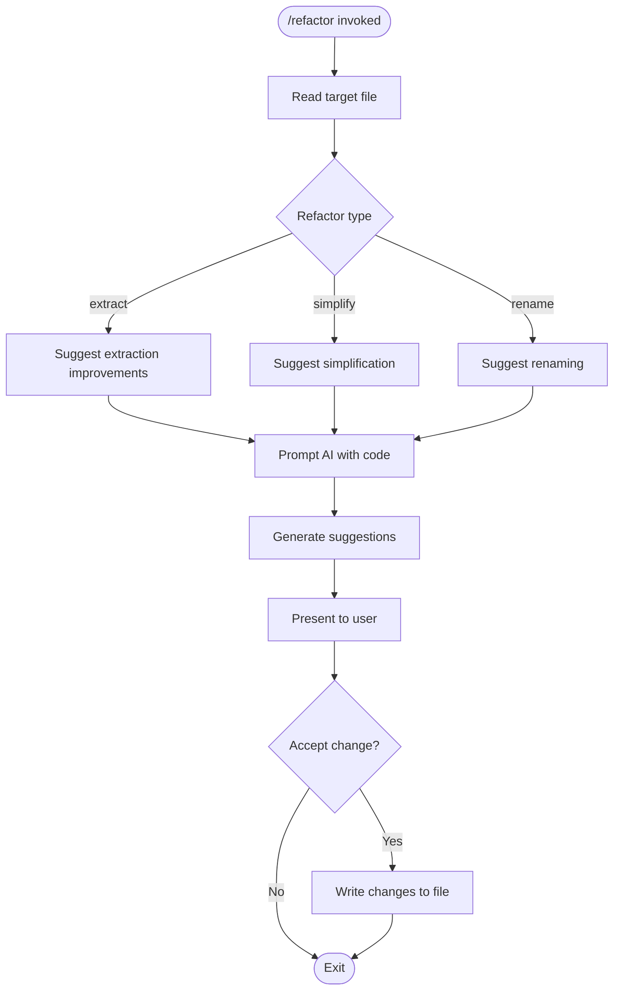

**Diagram sources**
- [builtins.ts:349-373](file://packages/skills/src/commands/builtins.ts#L349-L373)

**Section sources**
- [builtins.ts:349-373](file://packages/skills/src/commands/builtins.ts#L349-L373)

### Documentation Generation System
The documentation generation system aggregates insights from group artifacts and collaborator discussions to produce:
- Final project report
- API and design documentation drafts
- Developer-focused documentation covering functional, performance, security, and UI aspects

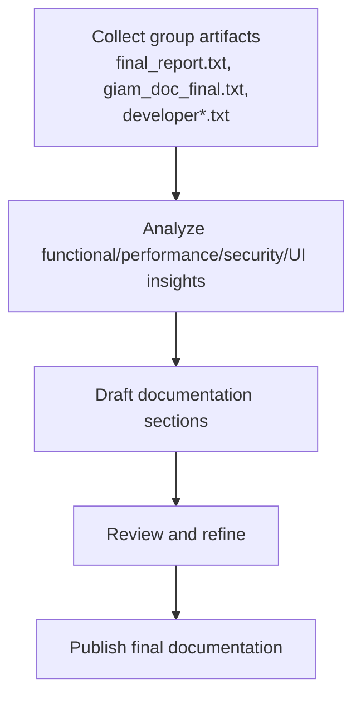

**Diagram sources**
- [final_report.txt:1-200](file://group/Chat_2026-05-31_08-10-16/final_report.txt#L1-L200)
- [giam_doc_final.txt:1-200](file://group/Chat_2026-05-31_08-10-16/giam_doc_final.txt#L1-L200)
- [developer.txt:1-200](file://group/Chat_2026-05-31_08-10-16/developer.txt#L1-L200)
- [dev_func1.txt:1-200](file://group/Chat_2026-05-31_08-10-16/dev_func1.txt#L1-L200)
- [dev_func2.txt:1-200](file://group/Chat_2026-05-31_08-10-16/dev_func2.txt#L1-L200)
- [dev_perf1.txt:1-200](file://group/Chat_2026-05-31_08-10-16/dev_perf1.txt#L1-L200)
- [dev_security.txt:1-200](file://group/Chat_2026-05-31_08-10-16/dev_security.txt#L1-L200)
- [dev_ui1.txt:1-200](file://group/Chat_2026-05-31_08-10-16/dev_ui1.txt#L1-L200)
- [dev_ui2.txt:1-200](file://group/Chat_2026-05-31_08-10-16/dev_ui2.txt#L1-L200)
- [developer_performance.txt:1-200](file://group/Chat_2026-05-31_08-10-16/developer_performance.txt#L1-L200)
- [developer_security.txt:1-200](file://group/Chat_2026-05-31_08-10-16/developer_security.txt#L1-L200)
- [developer_ui2.txt:1-200](file://group/Chat_2026-05-31_08-10-16/developer_ui2.txt#L1-L200)
- [giam_doc.txt:1-200](file://group/Chat_2026-05-31_08-10-16/giam_doc.txt#L1-L200)

**Section sources**
- [final_report.txt:1-200](file://group/Chat_2026-05-31_08-10-16/final_report.txt#L1-L200)
- [giam_doc_final.txt:1-200](file://group/Chat_2026-05-31_08-10-16/giam_doc_final.txt#L1-L200)
- [developer.txt:1-200](file://group/Chat_2026-05-31_08-10-16/developer.txt#L1-L200)
- [dev_func1.txt:1-200](file://group/Chat_2026-05-31_08-10-16/dev_func1.txt#L1-L200)
- [dev_func2.txt:1-200](file://group/Chat_2026-05-31_08-10-16/dev_func2.txt#L1-L200)
- [dev_perf1.txt:1-200](file://group/Chat_2026-05-31_08-10-16/dev_perf1.txt#L1-L200)
- [dev_security.txt:1-200](file://group/Chat_2026-05-31_08-10-16/dev_security.txt#L1-L200)
- [dev_ui1.txt:1-200](file://group/Chat_2026-05-31_08-10-16/dev_ui1.txt#L1-L200)
- [dev_ui2.txt:1-200](file://group/Chat_2026-05-31_08-10-16/dev_ui2.txt#L1-L200)
- [developer_performance.txt:1-200](file://group/Chat_2026-05-31_08-10-16/developer_performance.txt#L1-L200)
- [developer_security.txt:1-200](file://group/Chat_2026-05-31_08-10-16/developer_security.txt#L1-L200)
- [developer_ui2.txt:1-200](file://group/Chat_2026-05-31_08-10-16/developer_ui2.txt#L1-L200)
- [giam_doc.txt:1-200](file://group/Chat_2026-05-31_08-10-16/giam_doc.txt#L1-L200)

### Testing Assistance
Testing assistance is supported through:
- Terminal integration for running tests and capturing output
- Integration tests validating PTY behavior and command completion
- Collaboration artifacts that document testing outcomes and improvements

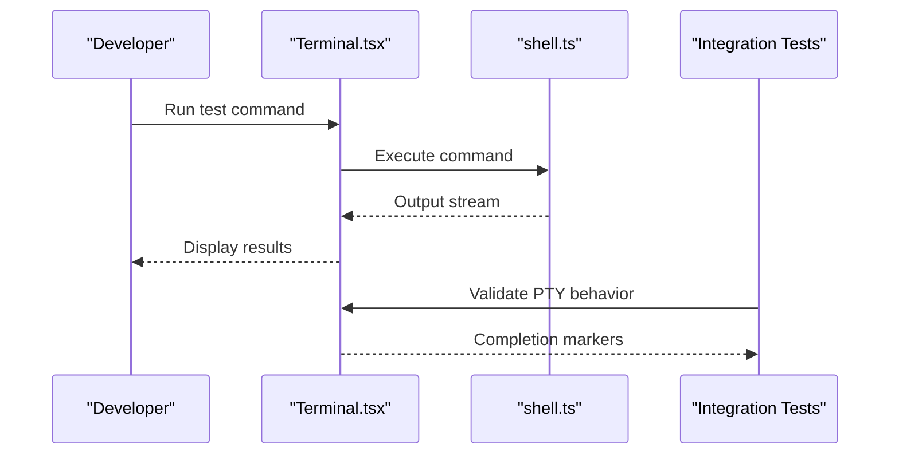

**Diagram sources**
- [Terminal.tsx:1-120](file://apps/desktop/src/components/Terminal.tsx#L1-L120)
- [shell.ts:1-120](file://apps/desktop/src/utils/shell.ts#L1-L120)
- [Terminal.integration.test.ts:35-95](file://apps/desktop/src/components/Terminal.integration.test.ts#L35-L95)
- [Terminal.integration.test.ts:171-211](file://apps/desktop/src/components/Terminal.integration.test.ts#L171-L211)
- [Terminal.integration.test.ts:247-282](file://apps/desktop/src/components/Terminal.integration.test.ts#L247-L282)

**Section sources**
- [Terminal.tsx:1-120](file://apps/desktop/src/components/Terminal.tsx#L1-L120)
- [shell.ts:1-120](file://apps/desktop/src/utils/shell.ts#L1-L120)
- [Terminal.integration.test.ts:35-95](file://apps/desktop/src/components/Terminal.integration.test.ts#L35-L95)
- [Terminal.integration.test.ts:171-211](file://apps/desktop/src/components/Terminal.integration.test.ts#L171-L211)
- [Terminal.integration.test.ts:247-282](file://apps/desktop/src/components/Terminal.integration.test.ts#L247-L282)

### Desktop Editor Integration
The desktop editor integrates AI features through:
- CodeEditor.tsx rendering and editing
- SkillManager.tsx exposing available AI skills
- AgentsView.tsx and SkillsView.tsx for agent and skill management
- ApiManager.tsx and sharedSocket.ts for communication
- Terminal.tsx for interactive command execution

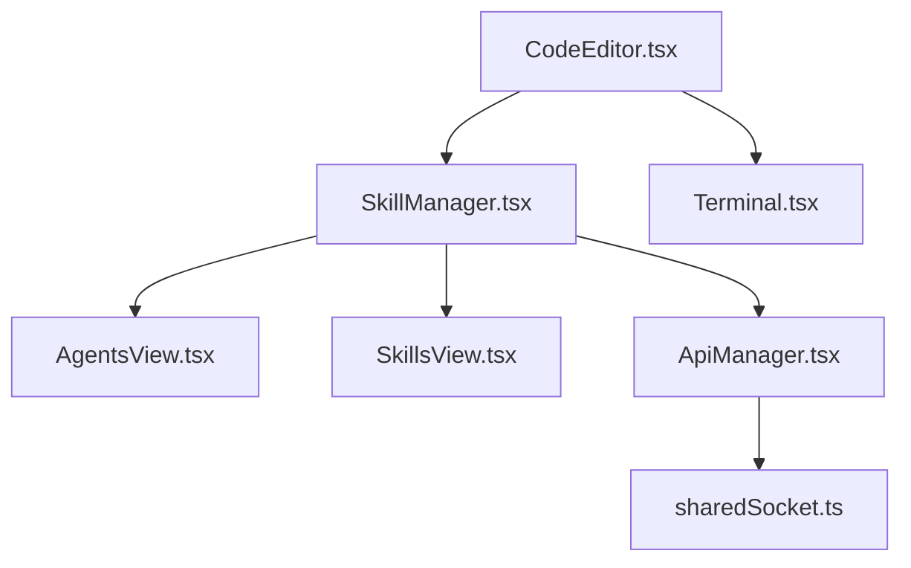

**Diagram sources**
- [CodeEditor.tsx:1-150](file://apps/desktop/src/components/CodeEditor.tsx#L1-L150)
- [SkillManager.tsx:1-300](file://apps/desktop/src/components/SkillManager.tsx#L1-L300)
- [AgentsView.tsx:1-30](file://apps/desktop/src/views/AgentsView.tsx#L1-L30)
- [SkillsView.tsx:1-30](file://apps/desktop/src/views/SkillsView.tsx#L1-L30)
- [ApiManager.tsx:1-200](file://apps/desktop/src/components/ApiManager.tsx#L1-L200)
- [sharedSocket.ts:1-120](file://apps/desktop/src/utils/sharedSocket.ts#L1-L120)
- [Terminal.tsx:1-120](file://apps/desktop/src/components/Terminal.tsx#L1-L120)

**Section sources**
- [CodeEditor.tsx:1-150](file://apps/desktop/src/components/CodeEditor.tsx#L1-L150)
- [SkillManager.tsx:1-300](file://apps/desktop/src/components/SkillManager.tsx#L1-L300)
- [AgentsView.tsx:1-30](file://apps/desktop/src/views/AgentsView.tsx#L1-L30)
- [SkillsView.tsx:1-30](file://apps/desktop/src/views/SkillsView.tsx#L1-L30)
- [ApiManager.tsx:1-200](file://apps/desktop/src/components/ApiManager.tsx#L1-L200)
- [sharedSocket.ts:1-120](file://apps/desktop/src/utils/sharedSocket.ts#L1-L120)
- [Terminal.tsx:1-120](file://apps/desktop/src/components/Terminal.tsx#L1-L120)

### Mobile Control Features
Mobile control features leverage:
- Bluetooth and socket services for remote device communication
- Screen preview and quick actions for remote development scenarios
- Pairing and settings screens for establishing connections

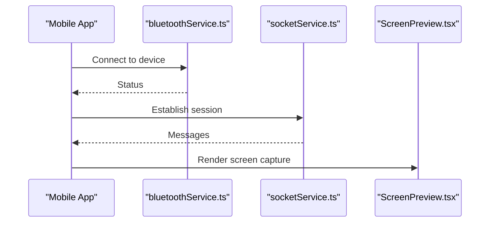

**Diagram sources**
- [ScreenPreview.tsx:1-120](file://apps/mobile/src/components/ScreenPreview.tsx#L1-L120)

**Section sources**
- [ScreenPreview.tsx:1-120](file://apps/mobile/src/components/ScreenPreview.tsx#L1-L120)

### VS Code Extension Integration
The VS Code extension synchronizes workspaces with the desktop backend:
- extension.ts initializes the extension and connects to the backend
- package.json declares activation events and dependencies

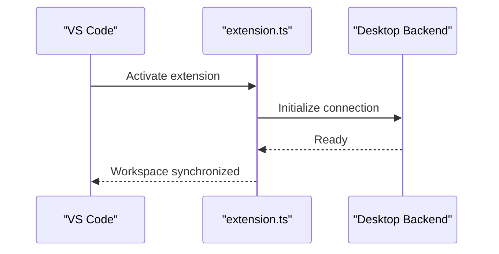

**Diagram sources**
- [extension.ts:1-200](file://apps/vscode-extension/src/extension.ts#L1-L200)
- [package.json:1-120](file://apps/vscode-extension/package.json#L1-L120)

**Section sources**
- [extension.ts:1-200](file://apps/vscode-extension/src/extension.ts#L1-L200)
- [package.json:1-120](file://apps/vscode-extension/package.json#L1-L120)

## Dependency Analysis
The AI features depend on:
- Skills commands for AI-driven actions
- Desktop UI components for presentation and interaction
- Utilities for shell execution and session management
- Backend for native capabilities and sidecar processes
- Extension for workspace synchronization

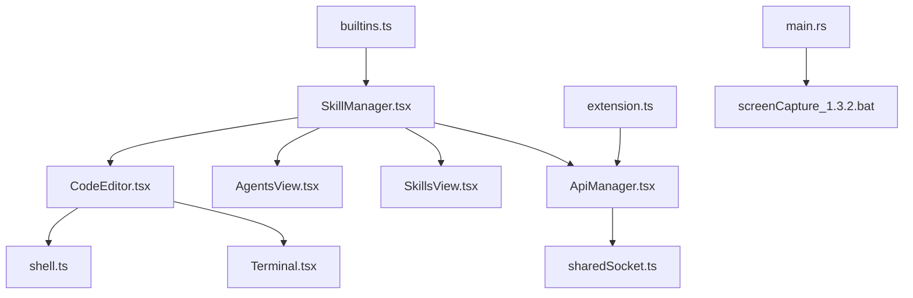

**Diagram sources**
- [builtins.ts:336-390](file://packages/skills/src/commands/builtins.ts#L336-L390)
- [SkillManager.tsx:1-300](file://apps/desktop/src/components/SkillManager.tsx#L1-L300)
- [CodeEditor.tsx:1-150](file://apps/desktop/src/components/CodeEditor.tsx#L1-L150)
- [AgentsView.tsx:1-30](file://apps/desktop/src/views/AgentsView.tsx#L1-L30)
- [SkillsView.tsx:1-30](file://apps/desktop/src/views/SkillsView.tsx#L1-L30)
- [ApiManager.tsx:1-200](file://apps/desktop/src/components/ApiManager.tsx#L1-L200)
- [sharedSocket.ts:1-120](file://apps/desktop/src/utils/sharedSocket.ts#L1-L120)
- [shell.ts:1-120](file://apps/desktop/src/utils/shell.ts#L1-L120)
- [Terminal.tsx:1-120](file://apps/desktop/src/components/Terminal.tsx#L1-L120)
- [extension.ts:1-200](file://apps/vscode-extension/src/extension.ts#L1-L200)
- [main.rs:1-120](file://apps/desktop/src-tauri/src/main.rs#L1-L120)
- [screenCapture_1.3.2.bat:1-50](file://apps/desktop/src-tauri/sidecar/screenCapture_1.3.2.bat#L1-L50)

**Section sources**
- [builtins.ts:336-390](file://packages/skills/src/commands/builtins.ts#L336-L390)
- [SkillManager.tsx:1-300](file://apps/desktop/src/components/SkillManager.tsx#L1-L300)
- [CodeEditor.tsx:1-150](file://apps/desktop/src/components/CodeEditor.tsx#L1-L150)
- [AgentsView.tsx:1-30](file://apps/desktop/src/views/AgentsView.tsx#L1-L30)
- [SkillsView.tsx:1-30](file://apps/desktop/src/views/SkillsView.tsx#L1-L30)
- [ApiManager.tsx:1-200](file://apps/desktop/src/components/ApiManager.tsx#L1-L200)
- [sharedSocket.ts:1-120](file://apps/desktop/src/utils/sharedSocket.ts#L1-L120)
- [shell.ts:1-120](file://apps/desktop/src/utils/shell.ts#L1-L120)
- [Terminal.tsx:1-120](file://apps/desktop/src/components/Terminal.tsx#L1-L120)
- [extension.ts:1-200](file://apps/vscode-extension/src/extension.ts#L1-L200)
- [main.rs:1-120](file://apps/desktop/src-tauri/src/main.rs#L1-L120)
- [screenCapture_1.3.2.bat:1-50](file://apps/desktop/src-tauri/sidecar/screenCapture_1.3.2.bat#L1-L50)

## Performance Considerations
- Minimize repeated file reads by caching content when appropriate
- Batch AI requests to reduce latency and improve throughput
- Use streaming responses where supported to provide incremental feedback
- Optimize terminal command execution and output parsing
- Tune model parameters for cost and speed trade-offs

[No sources needed since this section provides general guidance]

## Troubleshooting Guide
Common issues and resolutions:
- AI command failures: Verify file paths and flags; check AI model availability
- Terminal execution timeouts: Increase timeout thresholds and validate command completion markers
- Session persistence: Confirm chat session storage and socket connectivity
- Extension initialization: Ensure proper activation events and backend readiness

**Section sources**
- [builtins.ts:336-390](file://packages/skills/src/commands/builtins.ts#L336-L390)
- [Terminal.integration.test.ts:35-95](file://apps/desktop/src/components/Terminal.integration.test.ts#L35-L95)
- [Terminal.integration.test.ts:171-211](file://apps/desktop/src/components/Terminal.integration.test.ts#L171-L211)
- [Terminal.integration.test.ts:247-282](file://apps/desktop/src/components/Terminal.integration.test.ts#L247-L282)
- [chatSessionStorage.ts:1-120](file://apps/desktop/src/utils/chatSessionStorage.ts#L1-L120)
- [sharedSocket.ts:1-120](file://apps/desktop/src/utils/sharedSocket.ts#L1-L120)

## Conclusion
The AI features provide a robust foundation for real-time code suggestions, intelligent refactoring, automated documentation, and AI-assisted testing. The integration with the desktop editor, mobile control, and VS Code extension enables seamless AI assistance across environments. By following the customization and performance recommendations, teams can tailor the AI capabilities to their workflows while maintaining privacy and ethical standards.

[No sources needed since this section summarizes without analyzing specific files]

## Appendices

### Practical Examples
- Use the refactoring command to suggest improvements for a specific file and apply accepted changes
- Request code explanations to understand complex logic and incorporate suggestions into documentation
- Generate documentation drafts using insights from group artifacts and review final versions
- Run tests through the terminal and interpret results for edge-case identification

[No sources needed since this section provides general guidance]

### Customization Options
- Adjust AI model parameters and prompts for different languages and domains
- Configure flags for refactoring types and optimization targets
- Customize terminal command execution and output handling

[No sources needed since this section provides general guidance]

### Privacy and Ethical AI Guidelines
- Avoid sending sensitive or proprietary code to external AI providers
- Use local models where feasible to minimize data exposure
- Implement prompt safeguards and review AI-generated content before applying changes
- Respect user consent and provide opt-out mechanisms for AI features

[No sources needed since this section provides general guidance]