# AI Orchestration and Management

<cite>
**Referenced Files in This Document**
- [orchestrator.ts](file://packages/ai-engine/src/orchestrator.ts)
- [debateEngine.ts](file://packages/agents/src/orchestrator/debateEngine.ts)
- [registry.ts](file://packages/ai-engine/src/registry.ts)
- [manager.ts](file://packages/ai-engine/src/context/manager.ts)
- [compressor.ts](file://packages/ai-engine/src/context/compressor.ts)
- [smart-router.ts](file://packages/ai-engine/src/routing/smart-router.ts)
- [types.ts](file://packages/ai-engine/src/routing/types.ts)
- [cache.ts](file://packages/ai-engine/src/utils/cache.ts)
- [cost.ts](file://packages/ai-engine/src/utils/cost.ts)
- [runner.ts](file://packages/ai-engine/src/hooks/runner.ts)
- [security-checkers.ts](file://packages/ai-engine/src/hooks/security-checkers.ts)
- [permissions.ts](file://packages/ai-engine/src/security/permissions.ts)
- [client.ts](file://packages/ai-engine/src/mcp/client.ts)
- [types.ts](file://packages/ai-engine/src/types.ts)
- [index.ts](file://packages/ai-engine/src/index.ts)
- [orchestrator.test.ts](file://tests/unit/orchestrator.test.ts)
- [phase8-advanced.test.ts](file://tests/unit/phase8-advanced.test.ts)
- [phase5-platform.test.ts](file://tests/unit/phase5-platform.test.ts)
- [useChatSessions.ts](file://apps/desktop/src/components/useChatSessions.ts)
- [chatSessionStorage.ts](file://apps/desktop/src/utils/chatSessionStorage.ts)
</cite>

## Table of Contents
1. [Introduction](#introduction)
2. [Project Structure](#project-structure)
3. [Core Components](#core-components)
4. [Architecture Overview](#architecture-overview)
5. [Detailed Component Analysis](#detailed-component-analysis)
6. [Dependency Analysis](#dependency-analysis)
7. [Performance Considerations](#performance-considerations)
8. [Troubleshooting Guide](#troubleshooting-guide)
9. [Conclusion](#conclusion)
10. [Appendices](#appendices)

## Introduction
This document explains the AI Orchestration and Management systems implemented in the repository. It focuses on:
- The AI request orchestration engine coordinating multi-step workflows across multiple providers
- Session management for maintaining conversation context and state
- Request queueing, priority scheduling, rate limiting, and resource allocation strategies
- Intelligent fallback mechanisms, load balancing, and provider health monitoring
- The AI task execution pipeline: preprocessing, provider selection, routing, response aggregation, and post-processing
- Examples of complex orchestration scenarios: multi-agent collaboration, iterative refinement, and conditional branching
- Performance optimization, caching, and error recovery patterns

## Project Structure
The orchestration system spans several packages and modules:
- Orchestrator core: provider registration, resolution, fallback, streaming, and telemetry
- Context management: compaction and compression of conversation context
- Smart routing and model discovery: dynamic provider/model selection
- Caching and cost/budget management: semantic prompt cache and spending controls
- Hooks and permissions: pre/post tool execution and safety gates
- MCP client: external tool integration
- Agents: multi-agent debate orchestration for architectural alignment
- Desktop app: session persistence and UI integration

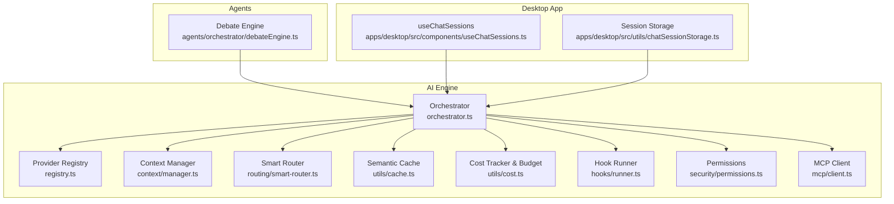

**Diagram sources**
- [orchestrator.ts:35-137](file://packages/ai-engine/src/orchestrator.ts#L35-L137)
- [registry.ts](file://packages/ai-engine/src/registry.ts)
- [manager.ts](file://packages/ai-engine/src/context/manager.ts)
- [smart-router.ts](file://packages/ai-engine/src/routing/smart-router.ts)
- [cache.ts](file://packages/ai-engine/src/utils/cache.ts)
- [cost.ts](file://packages/ai-engine/src/utils/cost.ts)
- [runner.ts](file://packages/ai-engine/src/hooks/runner.ts)
- [permissions.ts](file://packages/ai-engine/src/security/permissions.ts)
- [client.ts](file://packages/ai-engine/src/mcp/client.ts)
- [debateEngine.ts:27-88](file://packages/agents/src/orchestrator/debateEngine.ts#L27-L88)
- [useChatSessions.ts](file://apps/desktop/src/components/useChatSessions.ts)
- [chatSessionStorage.ts](file://apps/desktop/src/utils/chatSessionStorage.ts)

**Section sources**
- [orchestrator.ts:35-137](file://packages/ai-engine/src/orchestrator.ts#L35-L137)
- [registry.ts](file://packages/ai-engine/src/registry.ts)
- [manager.ts](file://packages/ai-engine/src/context/manager.ts)
- [smart-router.ts](file://packages/ai-engine/src/routing/smart-router.ts)
- [cache.ts](file://packages/ai-engine/src/utils/cache.ts)
- [cost.ts](file://packages/ai-engine/src/utils/cost.ts)
- [runner.ts](file://packages/ai-engine/src/hooks/runner.ts)
- [permissions.ts](file://packages/ai-engine/src/security/permissions.ts)
- [client.ts](file://packages/ai-engine/src/mcp/client.ts)
- [debateEngine.ts:27-88](file://packages/agents/src/orchestrator/debateEngine.ts#L27-L88)
- [useChatSessions.ts](file://apps/desktop/src/components/useChatSessions.ts)
- [chatSessionStorage.ts](file://apps/desktop/src/utils/chatSessionStorage.ts)

## Core Components
- Orchestrator: central coordinator for multi-provider orchestration, fallback, streaming, and telemetry
- Provider Registry: discovers, registers, and exposes providers
- Context Manager: compacts and compresses conversation context to fit model windows
- Smart Router: selects optimal provider/model based on latency, cost, and quality constraints
- Semantic Cache: caches semantically similar prompts to reduce repeated work
- Cost Tracker and Budget Manager: track and enforce spending limits
- Hook Runner and Permissions: enforce safety and policy gates around tool execution
- MCP Client: integrates external tools via MCP servers
- Debate Engine: multi-agent collaborative refinement for architectural specs

**Section sources**
- [orchestrator.ts:35-137](file://packages/ai-engine/src/orchestrator.ts#L35-L137)
- [registry.ts](file://packages/ai-engine/src/registry.ts)
- [manager.ts](file://packages/ai-engine/src/context/manager.ts)
- [smart-router.ts](file://packages/ai-engine/src/routing/smart-router.ts)
- [cache.ts](file://packages/ai-engine/src/utils/cache.ts)
- [cost.ts](file://packages/ai-engine/src/utils/cost.ts)
- [runner.ts](file://packages/ai-engine/src/hooks/runner.ts)
- [permissions.ts](file://packages/ai-engine/src/security/permissions.ts)
- [client.ts](file://packages/ai-engine/src/mcp/client.ts)
- [debateEngine.ts:27-88](file://packages/agents/src/orchestrator/debateEngine.ts#L27-L88)

## Architecture Overview
The orchestration engine coordinates a request from initiation to completion, integrating provider selection, fallback, streaming, caching, cost tracking, and context management.

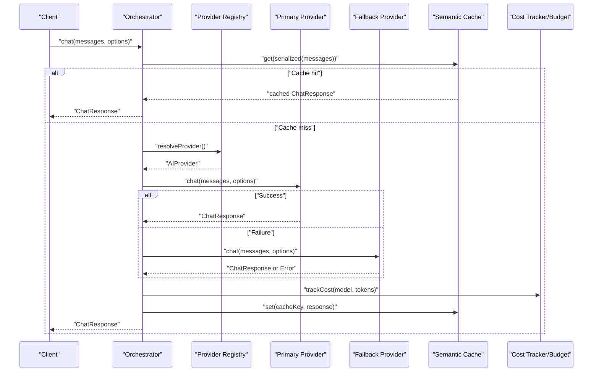

**Diagram sources**
- [orchestrator.ts:172-225](file://packages/ai-engine/src/orchestrator.ts#L172-L225)
- [cache.ts](file://packages/ai-engine/src/utils/cache.ts)
- [cost.ts](file://packages/ai-engine/src/utils/cost.ts)
- [registry.ts](file://packages/ai-engine/src/registry.ts)

**Section sources**
- [orchestrator.ts:172-225](file://packages/ai-engine/src/orchestrator.ts#L172-L225)
- [cache.ts](file://packages/ai-engine/src/utils/cache.ts)
- [cost.ts](file://packages/ai-engine/src/utils/cost.ts)
- [registry.ts](file://packages/ai-engine/src/registry.ts)

## Detailed Component Analysis

### Orchestrator: Multi-Provider Coordination and Streaming
The Orchestrator composes the orchestration pipeline:
- Provider resolution prioritizing explicit choice, agent-role routing, defaults, and fallbacks
- Retry and fallback execution for resilience
- Streaming support with per-chunk usage aggregation and final cost accounting
- Structured output generation, embeddings, and multimodal APIs
- Status reporting and provider testing
- Integration with hooks, permissions, MCP, and context management

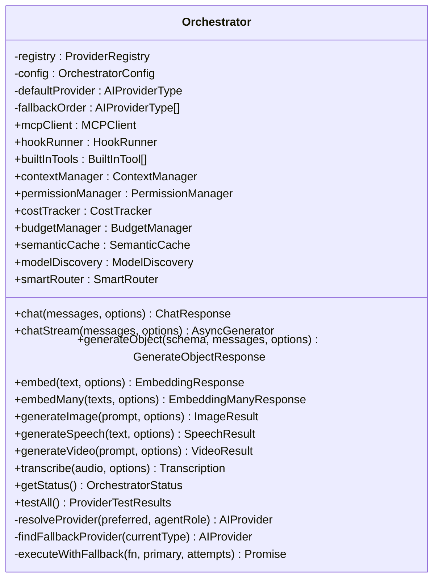

**Diagram sources**
- [orchestrator.ts:35-137](file://packages/ai-engine/src/orchestrator.ts#L35-L137)
- [orchestrator.ts:613-684](file://packages/ai-engine/src/orchestrator.ts#L613-L684)

**Section sources**
- [orchestrator.ts:35-137](file://packages/ai-engine/src/orchestrator.ts#L35-L137)
- [orchestrator.ts:172-225](file://packages/ai-engine/src/orchestrator.ts#L172-L225)
- [orchestrator.ts:227-359](file://packages/ai-engine/src/orchestrator.ts#L227-L359)
- [orchestrator.ts:361-478](file://packages/ai-engine/src/orchestrator.ts#L361-L478)
- [orchestrator.ts:480-498](file://packages/ai-engine/src/orchestrator.ts#L480-L498)
- [orchestrator.ts:500-518](file://packages/ai-engine/src/orchestrator.ts#L500-L518)
- [orchestrator.ts:613-684](file://packages/ai-engine/src/orchestrator.ts#L613-L684)

### Provider Registry
The registry maintains provider instances and supports registration from configuration, lookup by type, readiness checks, and iteration over all providers.

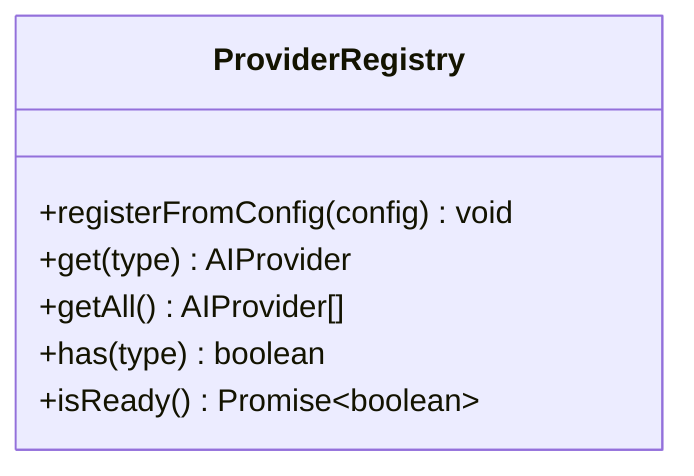

**Diagram sources**
- [registry.ts](file://packages/ai-engine/src/registry.ts)

**Section sources**
- [registry.ts](file://packages/ai-engine/src/registry.ts)

### Context Management
Context management ensures long conversations remain efficient by:
- Detecting when compaction is needed
- Compressing and summarizing messages
- Exposing usage statistics for budgeting and UI feedback

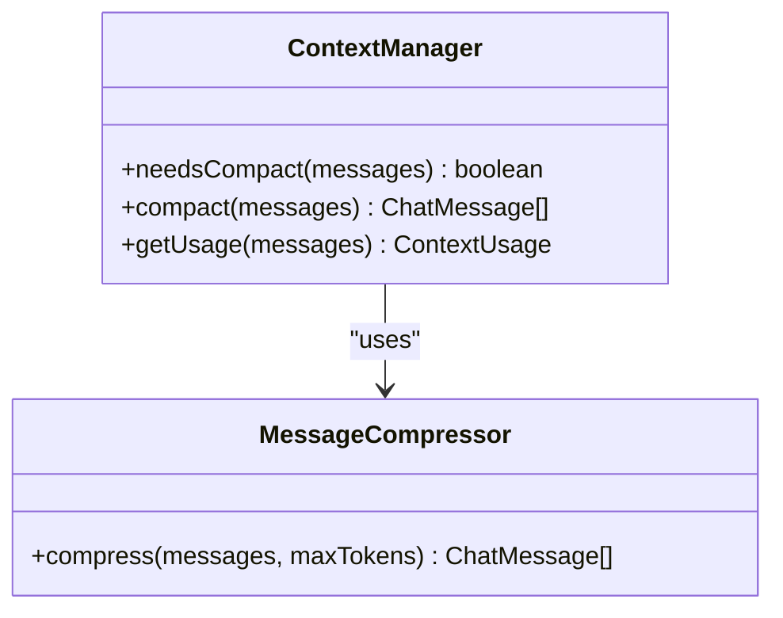

**Diagram sources**
- [manager.ts](file://packages/ai-engine/src/context/manager.ts)
- [compressor.ts](file://packages/ai-engine/src/context/compressor.ts)

**Section sources**
- [manager.ts](file://packages/ai-engine/src/context/manager.ts)
- [compressor.ts](file://packages/ai-engine/src/context/compressor.ts)

### Smart Routing and Model Discovery
Smart routing selects providers/models based on configurable constraints (latency, cost, quality). Model discovery enumerates available models from provider APIs.

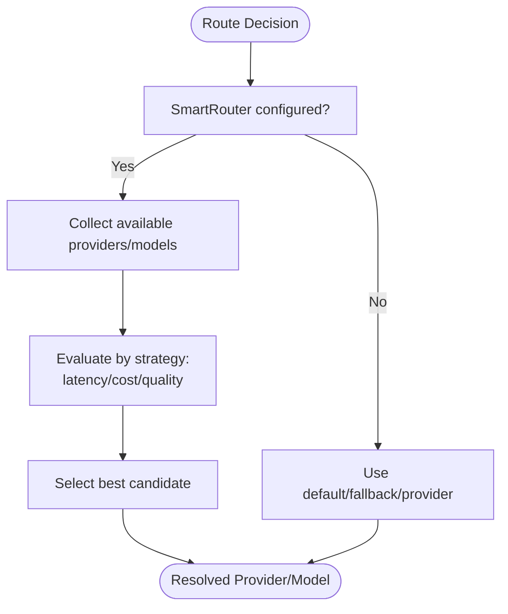

**Diagram sources**
- [smart-router.ts](file://packages/ai-engine/src/routing/smart-router.ts)
- [types.ts](file://packages/ai-engine/src/routing/types.ts)
- [orchestrator.ts:144-170](file://packages/ai-engine/src/orchestrator.ts#L144-L170)

**Section sources**
- [smart-router.ts](file://packages/ai-engine/src/routing/smart-router.ts)
- [types.ts](file://packages/ai-engine/src/routing/types.ts)
- [orchestrator.ts:144-170](file://packages/ai-engine/src/orchestrator.ts#L144-L170)

### Semantic Cache
The semantic cache reduces repeated computation by storing and retrieving semantically similar prompt responses. It embeds prompts and matches against a vector store with an in-memory fallback.

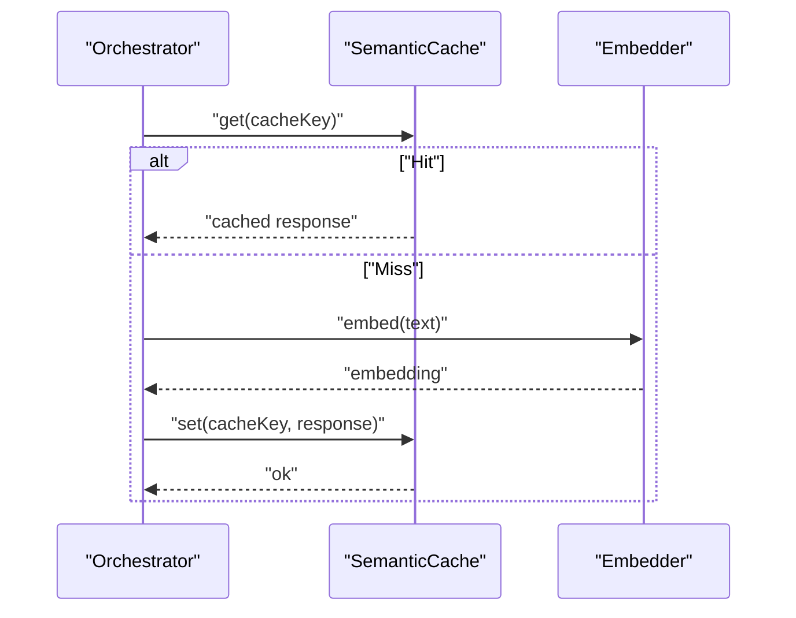

**Diagram sources**
- [cache.ts](file://packages/ai-engine/src/utils/cache.ts)
- [orchestrator.ts:177-186](file://packages/ai-engine/src/orchestrator.ts#L177-L186)
- [orchestrator.ts:220-223](file://packages/ai-engine/src/orchestrator.ts#L220-L223)
- [orchestrator.ts:236-248](file://packages/ai-engine/src/orchestrator.ts#L236-L248)
- [orchestrator.ts:347-358](file://packages/ai-engine/src/orchestrator.ts#L347-L358)

**Section sources**
- [cache.ts](file://packages/ai-engine/src/utils/cache.ts)
- [orchestrator.ts:177-186](file://packages/ai-engine/src/orchestrator.ts#L177-L186)
- [orchestrator.ts:220-223](file://packages/ai-engine/src/orchestrator.ts#L220-L223)
- [orchestrator.ts:236-248](file://packages/ai-engine/src/orchestrator.ts#L236-L248)
- [orchestrator.ts:347-358](file://packages/ai-engine/src/orchestrator.ts#L347-L358)

### Cost Tracking and Budget Management
Cost tracking estimates and records token usage per request. The budget manager enforces spending limits and emits alerts.

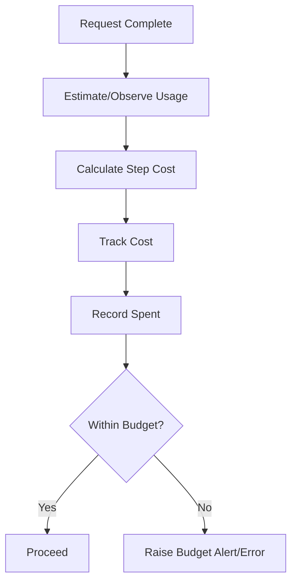

**Diagram sources**
- [cost.ts](file://packages/ai-engine/src/utils/cost.ts)
- [orchestrator.ts:199-205](file://packages/ai-engine/src/orchestrator.ts#L199-L205)
- [orchestrator.ts:330-332](file://packages/ai-engine/src/orchestrator.ts#L330-L332)

**Section sources**
- [cost.ts](file://packages/ai-engine/src/utils/cost.ts)
- [orchestrator.ts:199-205](file://packages/ai-engine/src/orchestrator.ts#L199-L205)
- [orchestrator.ts:330-332](file://packages/ai-engine/src/orchestrator.ts#L330-L332)

### Hooks, Permissions, and MCP
- Hook Runner executes pre/post tool hooks for safety and policy gating
- Permissions module enforces capability-based access
- MCP Client integrates external tools via MCP servers

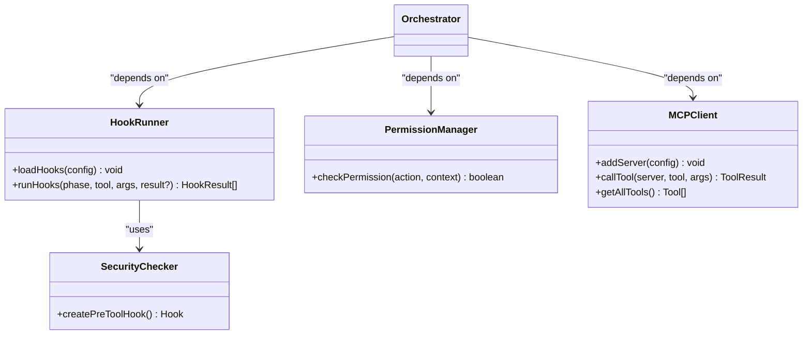

**Diagram sources**
- [runner.ts](file://packages/ai-engine/src/hooks/runner.ts)
- [security-checkers.ts](file://packages/ai-engine/src/hooks/security-checkers.ts)
- [permissions.ts](file://packages/ai-engine/src/security/permissions.ts)
- [client.ts](file://packages/ai-engine/src/mcp/client.ts)
- [orchestrator.ts:70-83](file://packages/ai-engine/src/orchestrator.ts#L70-L83)
- [orchestrator.ts:85-87](file://packages/ai-engine/src/orchestrator.ts#L85-L87)
- [orchestrator.ts:530-540](file://packages/ai-engine/src/orchestrator.ts#L530-L540)
- [orchestrator.ts:544-557](file://packages/ai-engine/src/orchestrator.ts#L544-L557)

**Section sources**
- [runner.ts](file://packages/ai-engine/src/hooks/runner.ts)
- [security-checkers.ts](file://packages/ai-engine/src/hooks/security-checkers.ts)
- [permissions.ts](file://packages/ai-engine/src/security/permissions.ts)
- [client.ts](file://packages/ai-engine/src/mcp/client.ts)
- [orchestrator.ts:70-83](file://packages/ai-engine/src/orchestrator.ts#L70-L83)
- [orchestrator.ts:85-87](file://packages/ai-engine/src/orchestrator.ts#L85-L87)
- [orchestrator.ts:530-540](file://packages/ai-engine/src/orchestrator.ts#L530-L540)
- [orchestrator.ts:544-557](file://packages/ai-engine/src/orchestrator.ts#L544-L557)

### Debate-Driven Architectural Alignment (Multi-Agent Collaboration)
The Debate Engine coordinates three roles:
- Innovator: proposes and refines the technical specification
- Devil’s Advocate: aggressively critiques for security/performance/backward compatibility
- Editor-in-Chief: synthesizes the final spec and assigns a consensus score

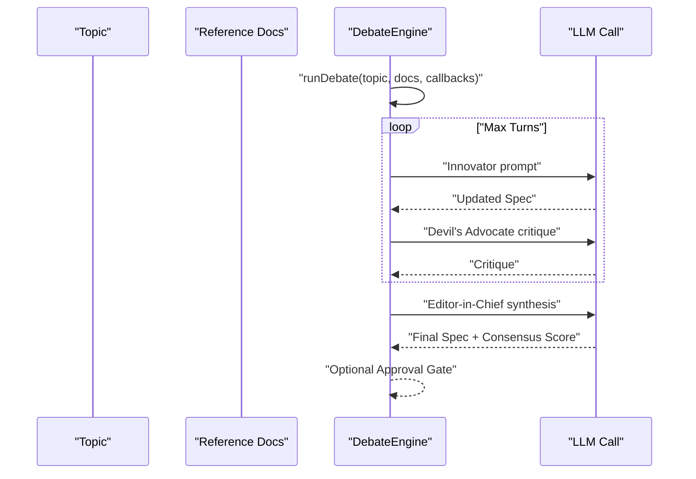

**Diagram sources**
- [debateEngine.ts:43-88](file://packages/agents/src/orchestrator/debateEngine.ts#L43-L88)
- [debateEngine.ts:93-133](file://packages/agents/src/orchestrator/debateEngine.ts#L93-L133)
- [debateEngine.ts:138-166](file://packages/agents/src/orchestrator/debateEngine.ts#L138-L166)
- [debateEngine.ts:171-221](file://packages/agents/src/orchestrator/debateEngine.ts#L171-L221)

**Section sources**
- [debateEngine.ts:27-88](file://packages/agents/src/orchestrator/debateEngine.ts#L27-L88)
- [debateEngine.ts:93-133](file://packages/agents/src/orchestrator/debateEngine.ts#L93-L133)
- [debateEngine.ts:138-166](file://packages/agents/src/orchestrator/debateEngine.ts#L138-L166)
- [debateEngine.ts:171-221](file://packages/agents/src/orchestrator/debateEngine.ts#L171-L221)

### Session Management and Long-Running Conversations
The desktop app integrates session management for persistent chat experiences:
- Session hooks and state management
- Local storage utilities for chat sessions

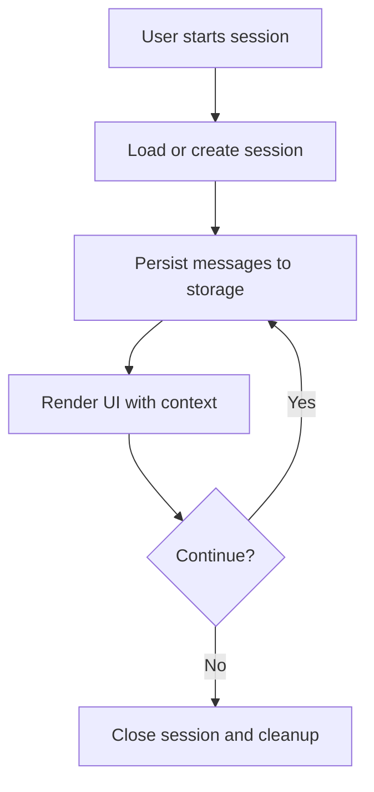

**Diagram sources**
- [useChatSessions.ts](file://apps/desktop/src/components/useChatSessions.ts)
- [chatSessionStorage.ts](file://apps/desktop/src/utils/chatSessionStorage.ts)

**Section sources**
- [useChatSessions.ts](file://apps/desktop/src/components/useChatSessions.ts)
- [chatSessionStorage.ts](file://apps/desktop/src/utils/chatSessionStorage.ts)

## Dependency Analysis
The Orchestrator composes multiple subsystems with clear boundaries and low coupling.

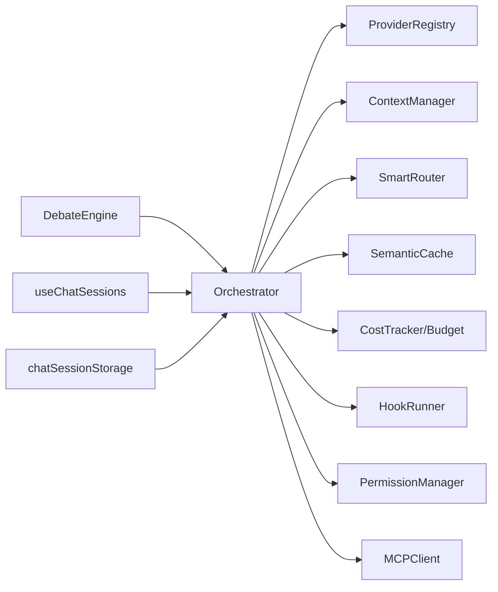

**Diagram sources**
- [orchestrator.ts:35-137](file://packages/ai-engine/src/orchestrator.ts#L35-L137)
- [registry.ts](file://packages/ai-engine/src/registry.ts)
- [manager.ts](file://packages/ai-engine/src/context/manager.ts)
- [smart-router.ts](file://packages/ai-engine/src/routing/smart-router.ts)
- [cache.ts](file://packages/ai-engine/src/utils/cache.ts)
- [cost.ts](file://packages/ai-engine/src/utils/cost.ts)
- [runner.ts](file://packages/ai-engine/src/hooks/runner.ts)
- [permissions.ts](file://packages/ai-engine/src/security/permissions.ts)
- [client.ts](file://packages/ai-engine/src/mcp/client.ts)
- [debateEngine.ts:27-88](file://packages/agents/src/orchestrator/debateEngine.ts#L27-L88)
- [useChatSessions.ts](file://apps/desktop/src/components/useChatSessions.ts)
- [chatSessionStorage.ts](file://apps/desktop/src/utils/chatSessionStorage.ts)

**Section sources**
- [orchestrator.ts:35-137](file://packages/ai-engine/src/orchestrator.ts#L35-L137)
- [registry.ts](file://packages/ai-engine/src/registry.ts)
- [manager.ts](file://packages/ai-engine/src/context/manager.ts)
- [smart-router.ts](file://packages/ai-engine/src/routing/smart-router.ts)
- [cache.ts](file://packages/ai-engine/src/utils/cache.ts)
- [cost.ts](file://packages/ai-engine/src/utils/cost.ts)
- [runner.ts](file://packages/ai-engine/src/hooks/runner.ts)
- [permissions.ts](file://packages/ai-engine/src/security/permissions.ts)
- [client.ts](file://packages/ai-engine/src/mcp/client.ts)
- [debateEngine.ts:27-88](file://packages/agents/src/orchestrator/debateEngine.ts#L27-L88)
- [useChatSessions.ts](file://apps/desktop/src/components/useChatSessions.ts)
- [chatSessionStorage.ts](file://apps/desktop/src/utils/chatSessionStorage.ts)

## Performance Considerations
- Semantic caching: reuse responses for semantically similar prompts to reduce latency and cost
- Context compaction: keep conversation windows within model limits to avoid truncation penalties
- Streaming with incremental usage: aggregate usage as chunks arrive to minimize estimation errors
- Retry with backoff: balance resilience and throughput with controlled delays
- Smart routing: select providers/models that meet latency/cost/quality targets
- Cost-aware batching: group compatible requests to amortize fixed costs

[No sources needed since this section provides general guidance]

## Troubleshooting Guide
Common issues and recovery patterns:
- Provider unavailability: rely on fallback order and retry attempts
- Streaming interruptions: re-route to a fallback provider and resume
- Budget exceeded: halt further requests and alert operators
- Context overflow: compact and compress messages before retry
- Hook failures: gate tool execution until remediation

**Section sources**
- [orchestrator.ts:261-316](file://packages/ai-engine/src/orchestrator.ts#L261-L316)
- [orchestrator.ts:318-328](file://packages/ai-engine/src/orchestrator.ts#L318-L328)
- [cost.ts](file://packages/ai-engine/src/utils/cost.ts)
- [manager.ts](file://packages/ai-engine/src/context/manager.ts)
- [runner.ts](file://packages/ai-engine/src/hooks/runner.ts)

## Conclusion
The AI Orchestration and Management system provides a robust, extensible framework for coordinating complex multi-step AI workflows across heterogeneous providers. It emphasizes reliability (fallback, retries), efficiency (semantic cache, context compaction, smart routing), observability (telemetry, cost tracking), and safety (hooks, permissions). The included multi-agent debate engine demonstrates advanced orchestration patterns suitable for architectural alignment and iterative refinement.

[No sources needed since this section summarizes without analyzing specific files]

## Appendices

### Example Scenarios and Patterns
- Multi-agent collaboration: use the Debate Engine to align on technical specifications through structured iterations
- Iterative refinement loops: chain multiple LLM calls with context updates and critiques
- Conditional branching: route based on agent roles or response content using hooks and router decisions

**Section sources**
- [debateEngine.ts:43-88](file://packages/agents/src/orchestrator/debateEngine.ts#L43-L88)
- [smart-router.ts](file://packages/ai-engine/src/routing/smart-router.ts)
- [runner.ts](file://packages/ai-engine/src/hooks/runner.ts)

### API Surface and Contracts
- Orchestrator methods: chat, chatStream, generateObject, embed/embedMany, multimodal APIs, status, testing
- Provider interface: chat, chatStream, embed, embedMany, optional multimodal methods
- Hook interface: pre/post tool execution with structured results
- Context manager: compact, needsCompact, usage stats

**Section sources**
- [orchestrator.ts:172-478](file://packages/ai-engine/src/orchestrator.ts#L172-L478)
- [types.ts](file://packages/ai-engine/src/types.ts)
- [runner.ts](file://packages/ai-engine/src/hooks/runner.ts)
- [manager.ts](file://packages/ai-engine/src/context/manager.ts)

### Testing Evidence
- Provider resolution and status reporting verified in unit tests
- Advanced features (caching, budgeting, approvals) validated in targeted suites

**Section sources**
- [orchestrator.test.ts:50-88](file://tests/unit/orchestrator.test.ts#L50-L88)
- [phase8-advanced.test.ts:11-31](file://tests/unit/phase8-advanced.test.ts#L11-L31)
- [phase5-platform.test.ts:32-49](file://tests/unit/phase5-platform.test.ts#L32-L49)