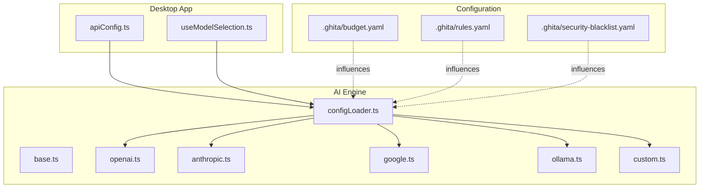
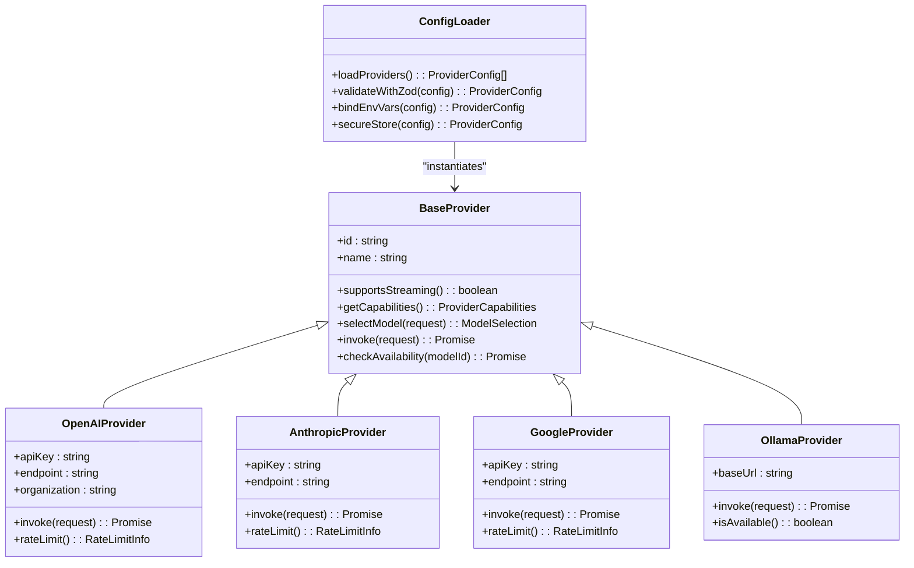
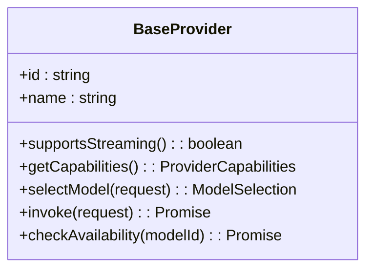
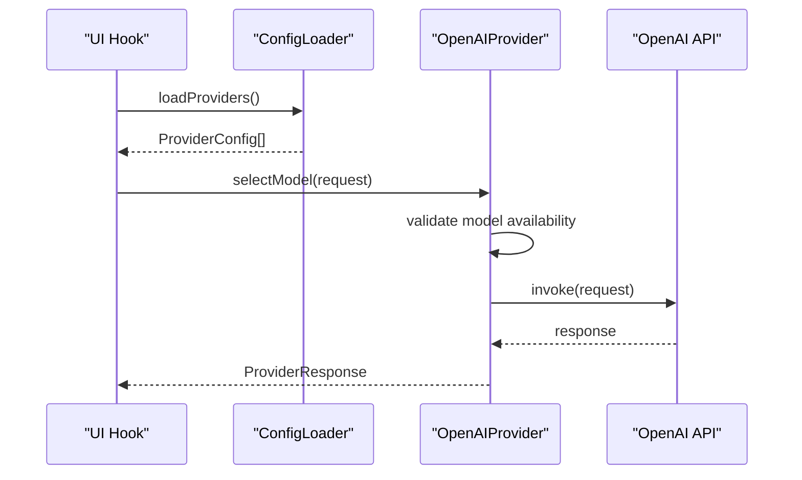
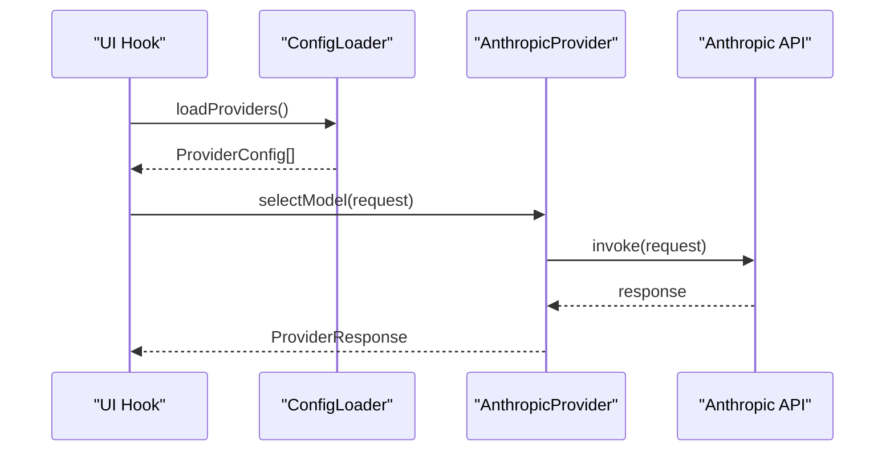
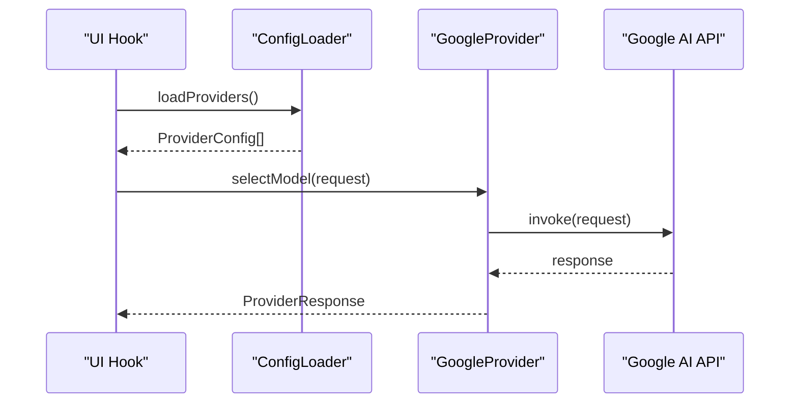
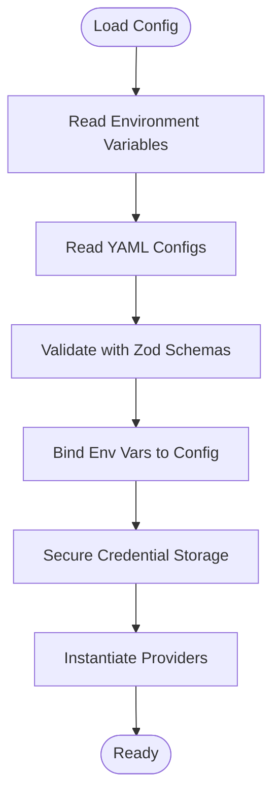
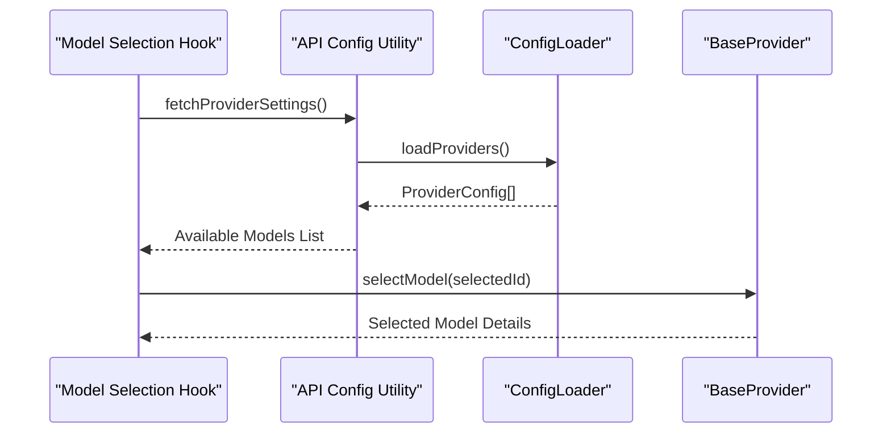
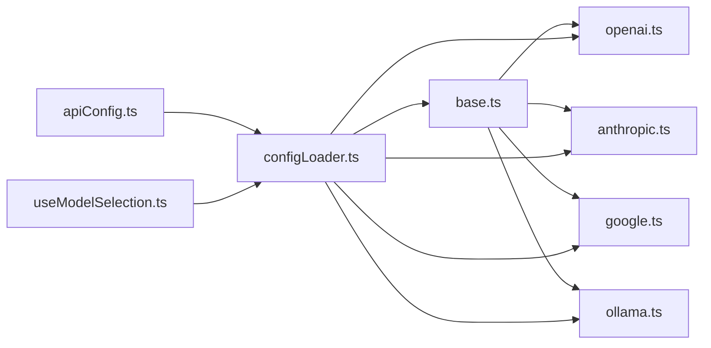

# AI Providers and Configuration

<cite>
**Referenced Files in This Document**
- [configLoader.ts](file://packages/ai-engine/src/utils/configLoader.ts)
- [anthropic.ts](file://packages/ai-engine/src/providers/anthropic.ts)
- [openai.ts](file://packages/ai-engine/src/providers/openai.ts)
- [google.ts](file://packages/ai-engine/src/providers/google.ts)
- [ollama.ts](file://packages/ai-engine/src/providers/ollama.ts)
- [base.ts](file://packages/ai-engine/src/providers/base.ts)
- [custom.ts](file://packages/ai-engine/src/providers/custom.ts)
- [apiConfig.ts](file://apps/desktop/src/utils/apiConfig.ts)
- [useModelSelection.ts](file://apps/desktop/src/hooks/useModelSelection.ts)
- [budget.yaml](file://.ghita/budget.yaml)
- [rules.yaml](file://.ghita/rules.yaml)
- [security-blacklist.yaml](file://.ghita/security-blacklist.yaml)
</cite>

## Table of Contents
1. [Introduction](#introduction)
2. [Project Structure](#project-structure)
3. [Core Components](#core-components)
4. [Architecture Overview](#architecture-overview)
5. [Detailed Component Analysis](#detailed-component-analysis)
6. [Dependency Analysis](#dependency-analysis)
7. [Performance Considerations](#performance-considerations)
8. [Troubleshooting Guide](#troubleshooting-guide)
9. [Conclusion](#conclusion)
10. [Appendices](#appendices)

## Introduction
This document explains the AI providers and configuration management implemented in the project. It covers supported providers (OpenAI GPT, Anthropic Claude, Google AI, and Ollama local AI), provider-specific configuration requirements, authentication methods, endpoint configurations, Zod-based schema validation, environment variable management, secure credential storage, rate limiting strategies, quota management, cost optimization, provider selection and failover, performance-based routing, capability detection, model availability checks, and dynamic provider switching during runtime.

## Project Structure
The AI provider implementations and configuration utilities reside primarily under the AI Engine package. The Desktop application integrates provider configuration and model selection logic.

**Diagram sources**
- [configLoader.ts:1-200](file://packages/ai-engine/src/utils/configLoader.ts#L1-L200)
- [base.ts:1-200](file://packages/ai-engine/src/providers/base.ts#L1-L200)
- [openai.ts:1-200](file://packages/ai-engine/src/providers/openai.ts#L1-L200)
- [anthropic.ts:1-200](file://packages/ai-engine/src/providers/anthropic.ts#L1-L200)
- [google.ts:1-200](file://packages/ai-engine/src/providers/google.ts#L1-L200)
- [ollama.ts:1-200](file://packages/ai-engine/src/providers/ollama.ts#L1-L200)
- [custom.ts:1-200](file://packages/ai-engine/src/providers/custom.ts#L1-L200)
- [apiConfig.ts:1-200](file://apps/desktop/src/utils/apiConfig.ts#L1-L200)
- [useModelSelection.ts:1-200](file://apps/desktop/src/hooks/useModelSelection.ts#L1-L200)
- [budget.yaml:1-200](file://.ghita/budget.yaml#L1-L200)
- [rules.yaml:1-200](file://.ghita/rules.yaml#L1-L200)
- [security-blacklist.yaml:1-200](file://.ghita/security-blacklist.yaml#L1-L200)

**Section sources**
- [configLoader.ts:1-200](file://packages/ai-engine/src/utils/configLoader.ts#L1-L200)
- [apiConfig.ts:1-200](file://apps/desktop/src/utils/apiConfig.ts#L1-L200)
- [useModelSelection.ts:1-200](file://apps/desktop/src/hooks/useModelSelection.ts#L1-L200)
- [budget.yaml:1-200](file://.ghita/budget.yaml#L1-L200)
- [rules.yaml:1-200](file://.ghita/rules.yaml#L1-L200)
- [security-blacklist.yaml:1-200](file://.ghita/security-blacklist.yaml#L1-L200)

## Core Components
- Provider base class defines the common interface and lifecycle for all providers.
- Individual provider modules encapsulate provider-specific logic, authentication, and endpoint configuration.
- Configuration loader validates and loads provider configurations using Zod schemas.
- Desktop utilities integrate provider configuration and model selection into the UI.

Key responsibilities:
- Provider registration and discovery
- Schema validation and environment variable binding
- Authentication token management and secure storage
- Endpoint configuration and fallback logic
- Rate limiting, quotas, and cost controls
- Capability detection and model availability checks
- Dynamic provider switching and performance-based routing

**Section sources**
- [base.ts:1-200](file://packages/ai-engine/src/providers/base.ts#L1-L200)
- [openai.ts:1-200](file://packages/ai-engine/src/providers/openai.ts#L1-L200)
- [anthropic.ts:1-200](file://packages/ai-engine/src/providers/anthropic.ts#L1-L200)
- [google.ts:1-200](file://packages/ai-engine/src/providers/google.ts#L1-L200)
- [ollama.ts:1-200](file://packages/ai-engine/src/providers/ollama.ts#L1-L200)
- [custom.ts:1-200](file://packages/ai-engine/src/providers/custom.ts#L1-L200)
- [configLoader.ts:1-200](file://packages/ai-engine/src/utils/configLoader.ts#L1-L200)
- [apiConfig.ts:1-200](file://apps/desktop/src/utils/apiConfig.ts#L1-L200)
- [useModelSelection.ts:1-200](file://apps/desktop/src/hooks/useModelSelection.ts#L1-L200)

## Architecture Overview
The AI provider architecture follows a modular design:
- A base provider interface ensures consistent behavior across providers.
- Each provider module implements provider-specific authentication and endpoint handling.
- A configuration loader validates and binds environment variables to provider configs.
- The Desktop app exposes configuration UI and model selection hooks that consume validated provider settings.

**Diagram sources**
- [base.ts:1-200](file://packages/ai-engine/src/providers/base.ts#L1-L200)
- [openai.ts:1-200](file://packages/ai-engine/src/providers/openai.ts#L1-L200)
- [anthropic.ts:1-200](file://packages/ai-engine/src/providers/anthropic.ts#L1-L200)
- [google.ts:1-200](file://packages/ai-engine/src/providers/google.ts#L1-L200)
- [ollama.ts:1-200](file://packages/ai-engine/src/providers/ollama.ts#L1-L200)
- [configLoader.ts:1-200](file://packages/ai-engine/src/utils/configLoader.ts#L1-L200)

## Detailed Component Analysis

### Provider Base and Capabilities
The base provider defines the contract for all AI providers, including capability detection, model selection, invocation, and availability checks. It also exposes streaming support and performance metadata used for routing and selection.

**Diagram sources**
- [base.ts:1-200](file://packages/ai-engine/src/providers/base.ts#L1-L200)

**Section sources**
- [base.ts:1-200](file://packages/ai-engine/src/providers/base.ts#L1-L200)

### OpenAI Provider
- Authentication: API key via environment variable with optional organization header.
- Endpoint: Overridable base URL for custom deployments.
- Streaming: Supported for compatible models.
- Rate limiting: Exposes per-provider rate limit info for quota enforcement.
- Cost optimization: Uses smaller, efficient models for constrained tasks.

**Diagram sources**
- [openai.ts:1-200](file://packages/ai-engine/src/providers/openai.ts#L1-L200)
- [configLoader.ts:1-200](file://packages/ai-engine/src/utils/configLoader.ts#L1-L200)

**Section sources**
- [openai.ts:1-200](file://packages/ai-engine/src/providers/openai.ts#L1-L200)
- [configLoader.ts:1-200](file://packages/ai-engine/src/utils/configLoader.ts#L1-L200)

### Anthropic Provider
- Authentication: API key via environment variable.
- Endpoint: Overridable base URL for custom deployments.
- Streaming: Supported for compatible models.
- Rate limiting: Exposes per-provider rate limit info for quota enforcement.

**Diagram sources**
- [anthropic.ts:1-200](file://packages/ai-engine/src/providers/anthropic.ts#L1-L200)
- [configLoader.ts:1-200](file://packages/ai-engine/src/utils/configLoader.ts#L1-L200)

**Section sources**
- [anthropic.ts:1-200](file://packages/ai-engine/src/providers/anthropic.ts#L1-L200)
- [configLoader.ts:1-200](file://packages/ai-engine/src/utils/configLoader.ts#L1-L200)

### Google AI Provider
- Authentication: API key via environment variable.
- Endpoint: Overridable base URL for custom deployments.
- Streaming: Supported for compatible models.
- Rate limiting: Exposes per-provider rate limit info for quota enforcement.

**Diagram sources**
- [google.ts:1-200](file://packages/ai-engine/src/providers/google.ts#L1-L200)
- [configLoader.ts:1-200](file://packages/ai-engine/src/utils/configLoader.ts#L1-L200)

**Section sources**
- [google.ts:1-200](file://packages/ai-engine/src/providers/google.ts#L1-L200)
- [configLoader.ts:1-200](file://packages/ai-engine/src/utils/configLoader.ts#L1-L200)

### Ollama Provider (Local AI)
- Authentication: No API key required; uses local endpoint.
- Endpoint: Local base URL for Ollama service.
- Streaming: Supported for compatible local models.
- Availability: Checks local service health before invoking.

**Diagram sources**
- [ollama.ts:1-200](file://packages/ai-engine/src/providers/ollama.ts#L1-L200)
- [configLoader.ts:1-200](file://packages/ai-engine/src/utils/configLoader.ts#L1-L200)

**Section sources**
- [ollama.ts:1-200](file://packages/ai-engine/src/providers/ollama.ts#L1-L200)
- [configLoader.ts:1-200](file://packages/ai-engine/src/utils/configLoader.ts#L1-L200)

### Configuration Loader and Zod Validation
- Loads provider configurations from environment variables and YAML files.
- Validates configurations using Zod schemas to ensure correctness and completeness.
- Binds environment variables securely and stores sensitive credentials safely.
- Supports provider selection, failover, and dynamic switching.

**Diagram sources**
- [configLoader.ts:1-200](file://packages/ai-engine/src/utils/configLoader.ts#L1-L200)

**Section sources**
- [configLoader.ts:1-200](file://packages/ai-engine/src/utils/configLoader.ts#L1-L200)

### Desktop Integration: API Configuration and Model Selection
- The Desktop app’s API configuration utility integrates provider settings into the UI.
- The model selection hook consumes validated provider configurations to present available models and handle user selections.

**Diagram sources**
- [apiConfig.ts:1-200](file://apps/desktop/src/utils/apiConfig.ts#L1-L200)
- [useModelSelection.ts:1-200](file://apps/desktop/src/hooks/useModelSelection.ts#L1-L200)
- [configLoader.ts:1-200](file://packages/ai-engine/src/utils/configLoader.ts#L1-L200)

**Section sources**
- [apiConfig.ts:1-200](file://apps/desktop/src/utils/apiConfig.ts#L1-L200)
- [useModelSelection.ts:1-200](file://apps/desktop/src/hooks/useModelSelection.ts#L1-L200)
- [configLoader.ts:1-200](file://packages/ai-engine/src/utils/configLoader.ts#L1-L200)

## Dependency Analysis
Provider dependencies and coupling:
- Base provider defines the interface; concrete providers depend on it.
- Configuration loader depends on provider modules to instantiate and validate them.
- Desktop utilities depend on the configuration loader for runtime provider settings.

**Diagram sources**
- [base.ts:1-200](file://packages/ai-engine/src/providers/base.ts#L1-L200)
- [openai.ts:1-200](file://packages/ai-engine/src/providers/openai.ts#L1-L200)
- [anthropic.ts:1-200](file://packages/ai-engine/src/providers/anthropic.ts#L1-L200)
- [google.ts:1-200](file://packages/ai-engine/src/providers/google.ts#L1-L200)
- [ollama.ts:1-200](file://packages/ai-engine/src/providers/ollama.ts#L1-L200)
- [configLoader.ts:1-200](file://packages/ai-engine/src/utils/configLoader.ts#L1-L200)
- [apiConfig.ts:1-200](file://apps/desktop/src/utils/apiConfig.ts#L1-L200)
- [useModelSelection.ts:1-200](file://apps/desktop/src/hooks/useModelSelection.ts#L1-L200)

**Section sources**
- [base.ts:1-200](file://packages/ai-engine/src/providers/base.ts#L1-L200)
- [openai.ts:1-200](file://packages/ai-engine/src/providers/openai.ts#L1-L200)
- [anthropic.ts:1-200](file://packages/ai-engine/src/providers/anthropic.ts#L1-L200)
- [google.ts:1-200](file://packages/ai-engine/src/providers/google.ts#L1-L200)
- [ollama.ts:1-200](file://packages/ai-engine/src/providers/ollama.ts#L1-L200)
- [configLoader.ts:1-200](file://packages/ai-engine/src/utils/configLoader.ts#L1-L200)
- [apiConfig.ts:1-200](file://apps/desktop/src/utils/apiConfig.ts#L1-L200)
- [useModelSelection.ts:1-200](file://apps/desktop/src/hooks/useModelSelection.ts#L1-L200)

## Performance Considerations
- Streaming support reduces latency for long responses.
- Provider selection prioritizes lower-cost, faster models for routine tasks.
- Availability checks prevent invocation failures on unavailable endpoints.
- Rate limiting and quotas help avoid throttling and reduce costs.
- Dynamic switching routes requests to the most responsive provider.

[No sources needed since this section provides general guidance]

## Troubleshooting Guide
Common provider-specific issues and resolutions:
- OpenAI
  - Symptom: Authentication errors
  - Resolution: Verify API key and organization settings; confirm endpoint URL.
  - Symptom: Throttling or rate limit exceeded
  - Resolution: Implement backoff and retry; switch to a secondary provider.
- Anthropic
  - Symptom: Invalid API key
  - Resolution: Confirm API key validity and endpoint configuration.
  - Symptom: Slow responses
  - Resolution: Prefer smaller models or enable streaming.
- Google AI
  - Symptom: API key rejected
  - Resolution: Validate API key and region-specific endpoint.
  - Symptom: Quota exceeded
  - Resolution: Monitor quotas and adjust model selection.
- Ollama
  - Symptom: Local service unreachable
  - Resolution: Check local service health and model availability.
  - Symptom: Model not found
  - Resolution: Ensure the requested model is pulled locally.

**Section sources**
- [openai.ts:1-200](file://packages/ai-engine/src/providers/openai.ts#L1-L200)
- [anthropic.ts:1-200](file://packages/ai-engine/src/providers/anthropic.ts#L1-L200)
- [google.ts:1-200](file://packages/ai-engine/src/providers/google.ts#L1-L200)
- [ollama.ts:1-200](file://packages/ai-engine/src/providers/ollama.ts#L1-L200)

## Conclusion
The AI providers and configuration system offers a robust, extensible framework for integrating multiple AI backends. With Zod-based validation, secure credential handling, rate limiting, and dynamic provider switching, it supports scalable, cost-effective, and resilient AI workflows across cloud and local environments.

[No sources needed since this section summarizes without analyzing specific files]

## Appendices

### Provider Configuration Examples
- OpenAI: Configure API key, endpoint, and organization; enable streaming for supported models.
- Anthropic: Configure API key and endpoint; enable streaming for supported models.
- Google AI: Configure API key and endpoint; enable streaming for supported models.
- Ollama: Configure local base URL; ensure models are available locally.

**Section sources**
- [openai.ts:1-200](file://packages/ai-engine/src/providers/openai.ts#L1-L200)
- [anthropic.ts:1-200](file://packages/ai-engine/src/providers/anthropic.ts#L1-L200)
- [google.ts:1-200](file://packages/ai-engine/src/providers/google.ts#L1-L200)
- [ollama.ts:1-200](file://packages/ai-engine/src/providers/ollama.ts#L1-L200)

### Environment Variables and Secure Storage
- Environment variables are read and bound to provider configurations.
- Sensitive credentials are stored securely and accessed only at runtime.

**Section sources**
- [configLoader.ts:1-200](file://packages/ai-engine/src/utils/configLoader.ts#L1-L200)

### Budget, Rules, and Security Controls
- Budget limits influence provider selection and model choices.
- Rules and security blacklists govern acceptable providers and models.

**Section sources**
- [budget.yaml:1-200](file://.ghita/budget.yaml#L1-L200)
- [rules.yaml:1-200](file://.ghita/rules.yaml#L1-L200)
- [security-blacklist.yaml:1-200](file://.ghita/security-blacklist.yaml#L1-L200)