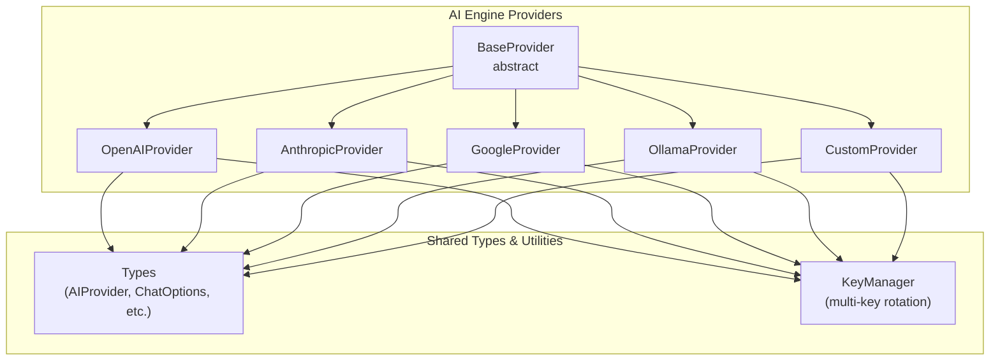
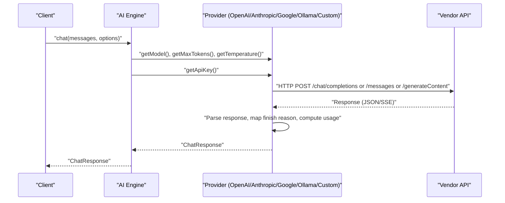
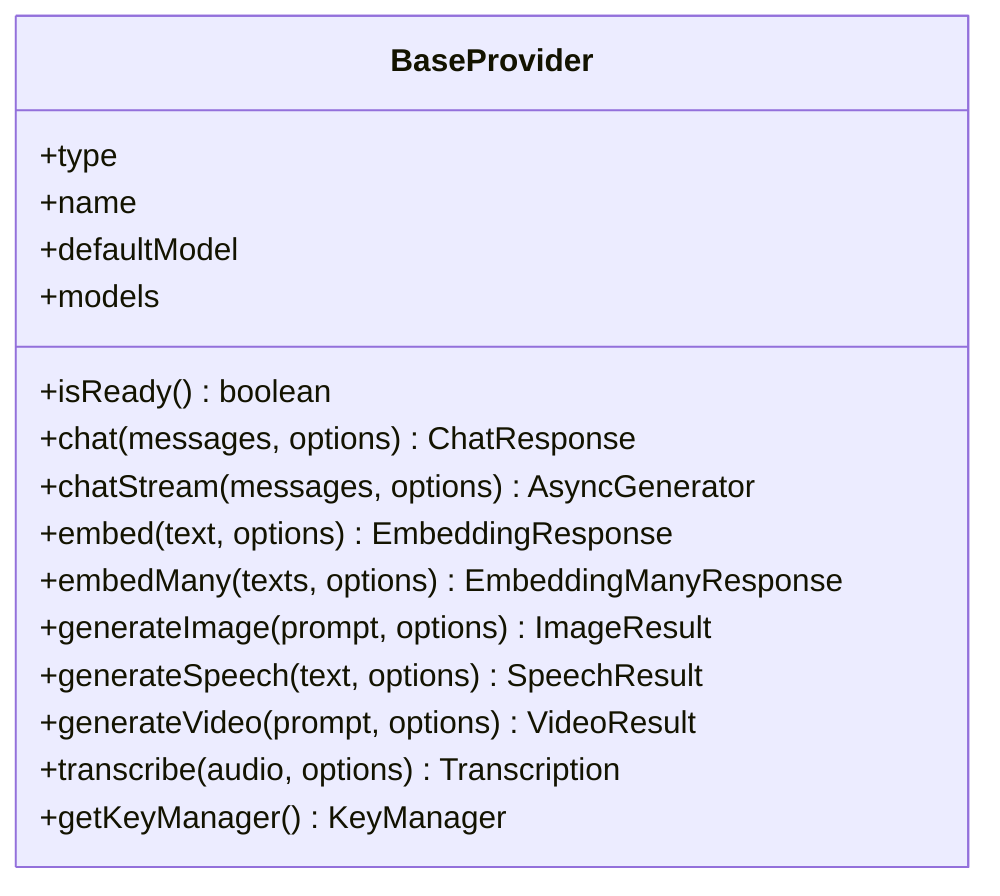
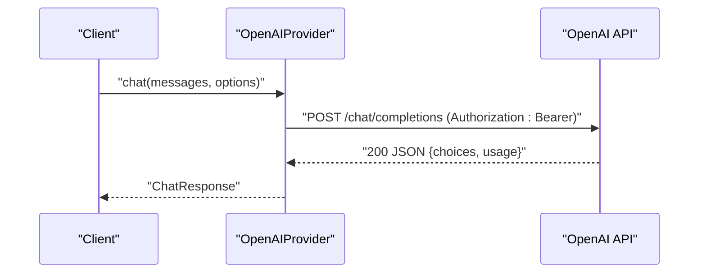
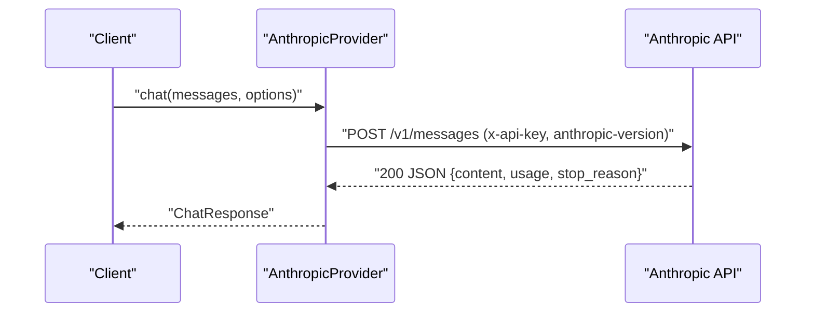
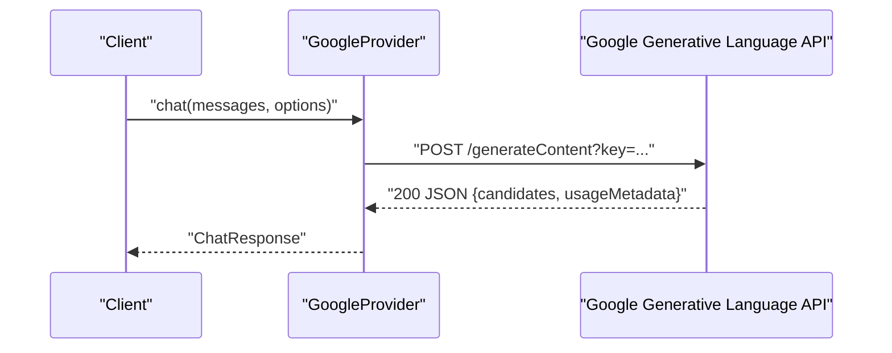
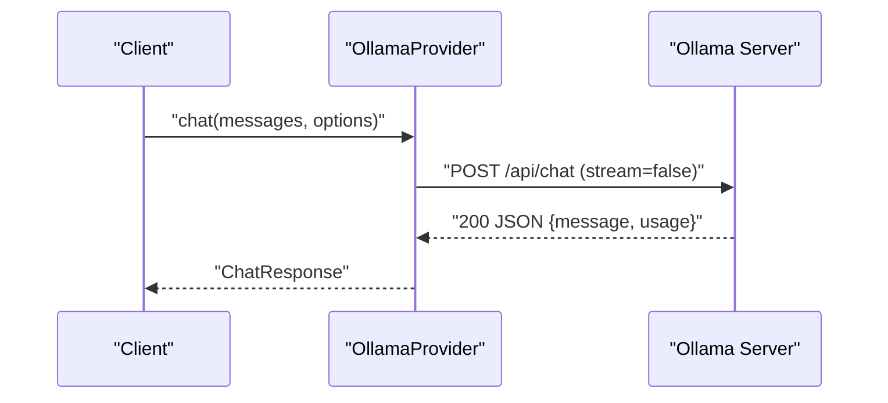
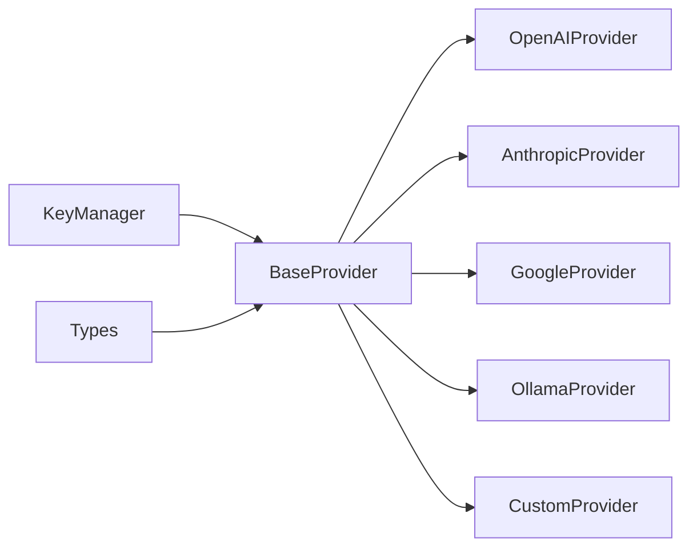

# AI Provider APIs

<cite>
**Referenced Files in This Document**
- [base.ts](file://packages/ai-engine/src/providers/base.ts)
- [openai.ts](file://packages/ai-engine/src/providers/openai.ts)
- [anthropic.ts](file://packages/ai-engine/src/providers/anthropic.ts)
- [google.ts](file://packages/ai-engine/src/providers/google.ts)
- [ollama.ts](file://packages/ai-engine/src/providers/ollama.ts)
- [custom.ts](file://packages/ai-engine/src/providers/custom.ts)
- [types.ts](file://packages/ai-engine/src/types.ts)
- [key-manager.ts](file://packages/ai-engine/src/key-manager.ts)
- [fallbackManager.d.ts](file://packages/ai-engine/dist/gateway/fallbackManager.d.ts)
- [apiConfig.ts](file://apps/desktop/src/utils/apiConfig.ts)
</cite>

## Table of Contents
1. [Introduction](#introduction)
2. [Project Structure](#project-structure)
3. [Core Components](#core-components)
4. [Architecture Overview](#architecture-overview)
5. [Detailed Component Analysis](#detailed-component-analysis)
6. [Dependency Analysis](#dependency-analysis)
7. [Performance Considerations](#performance-considerations)
8. [Troubleshooting Guide](#troubleshooting-guide)
9. [Conclusion](#conclusion)
10. [Appendices](#appendices)

## Introduction
This document provides comprehensive API documentation for AI provider integrations in the AI Engine. It covers OpenAI, Anthropic Claude, Google AI, and Ollama local AI services. The documentation details authentication methods, API key management, rate limiting considerations, request/response schemas, parameter specifications, output formatting, provider abstraction, multi-provider configuration, AI engine configuration (model selection, temperature, response handling), fallback mechanisms, error handling strategies, provider-specific features, practical examples, cost management, quota tracking, performance optimization, and migration guidance.

## Project Structure
The AI Engine organizes provider implementations under a shared abstraction layer. Each provider extends a base class that encapsulates common behaviors such as key rotation, readiness checks, and standardized response handling. Provider-specific logic handles endpoint construction, header management, streaming parsing, and optional features like embeddings and audio generation.

**Diagram sources**
- [base.ts:18-117](file://packages/ai-engine/src/providers/base.ts#L18-L117)
- [openai.ts:19-367](file://packages/ai-engine/src/providers/openai.ts#L19-L367)
- [anthropic.ts:16-202](file://packages/ai-engine/src/providers/anthropic.ts#L16-L202)
- [google.ts:16-265](file://packages/ai-engine/src/providers/google.ts#L16-L265)
- [ollama.ts:10-250](file://packages/ai-engine/src/providers/ollama.ts#L10-L250)
- [custom.ts:10-179](file://packages/ai-engine/src/providers/custom.ts#L10-L179)

**Section sources**
- [base.ts:18-117](file://packages/ai-engine/src/providers/base.ts#L18-L117)
- [types.ts](file://packages/ai-engine/src/types.ts)
- [key-manager.ts](file://packages/ai-engine/src/key-manager.ts)

## Core Components
- BaseProvider: Defines the contract for all providers, including readiness checks, chat and streaming chat methods, embedding and media generation capabilities, and standardized parameter extraction (model, tokens, temperature). It manages API keys via KeyManager and reports key health.
- Provider Implementations: Specialized handlers for OpenAI, Anthropic, Google, Ollama, and Custom providers. They implement endpoint URLs, headers, request bodies, streaming parsing, and usage reporting.
- Shared Types: Define the AIProvider interface, ChatMessage, ChatOptions, ChatResponse, ProviderConfig, and related types used across providers.
- KeyManager: Manages multiple API keys with rotation strategies and tracks health to support failover and resilience.

Key responsibilities:
- Authentication: Header injection (Bearer or provider-specific headers).
- Parameterization: Model selection, token limits, temperature, topP, stop sequences.
- Streaming: Event parsing for SSE-like or JSON chunked responses.
- Usage: Token accounting and finish reasons mapped consistently.
- Extensibility: Custom provider for OpenAI-compatible endpoints.

**Section sources**
- [base.ts:18-117](file://packages/ai-engine/src/providers/base.ts#L18-L117)
- [openai.ts:19-367](file://packages/ai-engine/src/providers/openai.ts#L19-L367)
- [anthropic.ts:16-202](file://packages/ai-engine/src/providers/anthropic.ts#L16-L202)
- [google.ts:16-265](file://packages/ai-engine/src/providers/google.ts#L16-L265)
- [ollama.ts:10-250](file://packages/ai-engine/src/providers/ollama.ts#L10-L250)
- [custom.ts:10-179](file://packages/ai-engine/src/providers/custom.ts#L10-L179)
- [types.ts](file://packages/ai-engine/src/types.ts)
- [key-manager.ts](file://packages/ai-engine/src/key-manager.ts)

## Architecture Overview
The AI Engine uses a provider abstraction to unify interactions across multiple AI vendors. A configuration object supplies provider type, base URL, API keys, and defaults. Each provider translates unified inputs into vendor-specific requests and normalizes outputs.

**Diagram sources**
- [base.ts:56-87](file://packages/ai-engine/src/providers/base.ts#L56-L87)
- [openai.ts:33-79](file://packages/ai-engine/src/providers/openai.ts#L33-L79)
- [anthropic.ts:30-90](file://packages/ai-engine/src/providers/anthropic.ts#L30-L90)
- [google.ts:30-87](file://packages/ai-engine/src/providers/google.ts#L30-L87)
- [ollama.ts:49-97](file://packages/ai-engine/src/providers/ollama.ts#L49-L97)
- [custom.ts:27-79](file://packages/ai-engine/src/providers/custom.ts#L27-L79)

## Detailed Component Analysis

### Base Provider Abstraction
The BaseProvider defines:
- Required properties: type, name, defaultModel, models.
- Methods: isReady, chat, chatStream, embed, embedMany, generateImage, generateSpeech, transcribe.
- Helpers: getModel, getMaxTokens, getTemperature, getApiKey, reportKeySuccess, reportKeyFailure, getKeyManager, getBaseUrl.
- Defaults: sensible defaults for temperature and max tokens; unsupported features raise AIUnsupportedFeatureError.

**Diagram sources**
- [base.ts:18-117](file://packages/ai-engine/src/providers/base.ts#L18-L117)

**Section sources**
- [base.ts:18-117](file://packages/ai-engine/src/providers/base.ts#L18-L117)

### OpenAI Provider
Capabilities:
- Chat and streaming chat using OpenAI-compatible endpoints.
- Embeddings, images (DALL·E), speech (TTS), and transcription (Whisper).
- Authentication via Authorization: Bearer header.
- Request parameters: model, messages, max_tokens, temperature, top_p, stop, stream.
- Response normalization: content, model, provider, usage, finishReason.

Key implementation details:
- Endpoint construction supports custom base URL.
- Streaming parses SSE data lines and handles [DONE].
- Usage fields normalized from provider response.

**Diagram sources**
- [openai.ts:33-79](file://packages/ai-engine/src/providers/openai.ts#L33-L79)

**Section sources**
- [openai.ts:19-367](file://packages/ai-engine/src/providers/openai.ts#L19-L367)

### Anthropic Provider
Capabilities:
- Chat and streaming chat using Messages API.
- Authentication via x-api-key header and anthropic-version header.
- System message handling separated from chat messages.
- Response normalization: content, model, provider, usage, finishReason.

Key implementation details:
- Streaming parses event lines and yields content blocks until message_stop.
- Finish reason mapped from stop_reason.

**Diagram sources**
- [anthropic.ts:30-90](file://packages/ai-engine/src/providers/anthropic.ts#L30-L90)

**Section sources**
- [anthropic.ts:16-202](file://packages/ai-engine/src/providers/anthropic.ts#L16-L202)

### Google AI (Gemini) Provider
Capabilities:
- Chat and streaming chat using Gemini endpoints.
- Embeddings and batch embeddings.
- Authentication via API key query parameter.
- Request parameters: contents, generationConfig (maxOutputTokens, temperature, topP, stopSequences).
- Response normalization: content concatenation, usage metadata, finishReason.

Key implementation details:
- Converts messages to Gemini's role/part format (assistant -> model).
- Streaming extracts concatenated text from JSON chunks.

**Diagram sources**
- [google.ts:30-87](file://packages/ai-engine/src/providers/google.ts#L30-L87)

**Section sources**
- [google.ts:16-265](file://packages/ai-engine/src/providers/google.ts#L16-L265)

### Ollama Provider (Local AI)
Capabilities:
- Local model inference via Ollama API.
- Dynamic model discovery via /api/tags.
- Chat and streaming chat, embeddings.
- No authentication required by default.
- Request parameters: model, messages, stream, options (num_predict, temperature).

Key implementation details:
- Uses configurable base URL with a default fallback.
- Streaming yields partial JSON lines until done flag.

**Diagram sources**
- [ollama.ts:49-97](file://packages/ai-engine/src/providers/ollama.ts#L49-L97)

**Section sources**
- [ollama.ts:10-250](file://packages/ai-engine/src/providers/ollama.ts#L10-L250)

### Custom Provider (OpenAI-Compatible)
Capabilities:
- Generic OpenAI-compatible endpoint support.
- Configurable provider type/name and base URL.
- Optional Authorization header injection.
- Standardized streaming with usage inclusion.

Key implementation details:
- Normalizes base URL and constructs /chat/completions endpoint.
- Supports both sync and streaming modes.

**Section sources**
- [custom.ts:10-179](file://packages/ai-engine/src/providers/custom.ts#L10-L179)

## Dependency Analysis
Provider dependencies and relationships:
- All providers depend on BaseProvider and KeyManager for authentication and key rotation.
- Shared types define the contract for inputs and outputs.
- Custom provider depends on AI provider type registry for defaults.

**Diagram sources**
- [base.ts:18-117](file://packages/ai-engine/src/providers/base.ts#L18-L117)
- [key-manager.ts](file://packages/ai-engine/src/key-manager.ts)
- [types.ts](file://packages/ai-engine/src/types.ts)
- [custom.ts:16-21](file://packages/ai-engine/src/providers/custom.ts#L16-L21)

**Section sources**
- [base.ts:18-117](file://packages/ai-engine/src/providers/base.ts#L18-L117)
- [key-manager.ts](file://packages/ai-engine/src/key-manager.ts)
- [types.ts](file://packages/ai-engine/src/types.ts)
- [custom.ts:16-21](file://packages/ai-engine/src/providers/custom.ts#L16-L21)

## Performance Considerations
- Streaming: Prefer streaming APIs for real-time responses to reduce latency and improve UX.
- Token limits: Tune max_tokens per provider to balance quality and cost.
- Temperature: Lower values increase determinism; higher values increase creativity.
- Embeddings batching: Use embedMany for multiple texts to reduce overhead.
- Retry/backoff: Implement retry with exponential backoff for transient failures; leverage KeyManager health reporting.
- Connection pooling: Reuse connections where supported by underlying HTTP client.
- Caching: Cache embeddings and non-sensitive prompts where appropriate.
- Monitoring: Track provider latency, token usage, and error rates for optimization.

[No sources needed since this section provides general guidance]

## Troubleshooting Guide
Common issues and resolutions:
- Authentication failures:
  - Verify API key presence and validity.
  - Check provider-specific headers (Authorization vs x-api-key).
- Rate limiting:
  - Implement backoff and retry strategies.
  - Monitor status codes and adjust concurrency.
- Streaming errors:
  - Ensure content-type is SSE or JSON chunked.
  - Handle malformed JSON gracefully during parsing.
- Model availability:
  - Validate model name against provider’s supported list.
  - Use default model as fallback.
- Local provider connectivity:
  - Confirm Ollama service is reachable and models are pulled.
- Usage reporting:
  - Validate token fields presence in provider responses.

**Section sources**
- [openai.ts:54-58](file://packages/ai-engine/src/providers/openai.ts#L54-L58)
- [anthropic.ts:59-63](file://packages/ai-engine/src/providers/anthropic.ts#L59-L63)
- [google.ts:54-58](file://packages/ai-engine/src/providers/google.ts#L54-L58)
- [ollama.ts:68-76](file://packages/ai-engine/src/providers/ollama.ts#L68-L76)
- [custom.ts:54-58](file://packages/ai-engine/src/providers/custom.ts#L54-L58)

## Conclusion
The AI Engine provides a robust, extensible abstraction for integrating multiple AI providers. By centralizing authentication, parameterization, and response normalization, it simplifies cross-provider development. The KeyManager enables resilient key rotation, while streaming and usage reporting enhance performance and observability. Custom providers allow seamless integration with OpenAI-compatible services.

[No sources needed since this section summarizes without analyzing specific files]

## Appendices

### API Key Management and Rotation
- Multi-key support: Supply multiple keys; BaseProvider rotates via KeyManager.
- Health reporting: reportKeySuccess/reportKeyFailure updates key health.
- Rotation strategy: Failover by default; extendable for round-robin or weighted strategies.

**Section sources**
- [base.ts:27-36](file://packages/ai-engine/src/providers/base.ts#L27-L36)
- [base.ts:76-82](file://packages/ai-engine/src/providers/base.ts#L76-L82)
- [key-manager.ts](file://packages/ai-engine/src/key-manager.ts)

### Fallback Mechanisms
- Provider readiness: isReady checks key health and connectivity (when applicable).
- KeyManager-based failover: automatic switching to next healthy key.
- Graceful degradation: disable unsupported features with clear errors.

**Section sources**
- [base.ts:29-31](file://packages/ai-engine/src/providers/base.ts#L29-L31)
- [openai.ts:29-31](file://packages/ai-engine/src/providers/openai.ts#L29-L31)
- [anthropic.ts:26-28](file://packages/ai-engine/src/providers/anthropic.ts#L26-L28)
- [google.ts:26-28](file://packages/ai-engine/src/providers/google.ts#L26-L28)
- [ollama.ts:24-33](file://packages/ai-engine/src/providers/ollama.ts#L24-L33)

### Provider-Specific Features
- OpenAI: Embeddings, images, speech, transcription; supports topP and stop sequences.
- Anthropic: System message separation; streaming delta parsing.
- Google: Gemini role conversion; batch embeddings; streaming JSON chunks.
- Ollama: Dynamic model discovery; local inference; embeddings.
- Custom: OpenAI-compatible endpoints with flexible base URL and headers.

**Section sources**
- [openai.ts:180-301](file://packages/ai-engine/src/providers/openai.ts#L180-L301)
- [anthropic.ts:34-46](file://packages/ai-engine/src/providers/anthropic.ts#L34-L46)
- [google.ts:170-179](file://packages/ai-engine/src/providers/google.ts#L170-L179)
- [ollama.ts:36-47](file://packages/ai-engine/src/providers/ollama.ts#L36-L47)
- [custom.ts:27-79](file://packages/ai-engine/src/providers/custom.ts#L27-L79)

### Request/Response Schemas and Parameters
- Inputs:
  - messages: array of ChatMessage with role/content.
  - options: model, maxTokens, temperature, topP, stop, signal, provider-specific fields.
- Outputs:
  - ChatResponse: content, model, provider, usage, finishReason.
  - EmbeddingResponse/EmbeddingManyResponse: embedding(s), model, provider, usage.
  - Media generation: image URL/b64, audio buffer/content-type, transcription text.

**Section sources**
- [types.ts](file://packages/ai-engine/src/types.ts)
- [openai.ts:62-78](file://packages/ai-engine/src/providers/openai.ts#L62-L78)
- [anthropic.ts:67-89](file://packages/ai-engine/src/providers/anthropic.ts#L67-L89)
- [google.ts:62-86](file://packages/ai-engine/src/providers/google.ts#L62-L86)
- [ollama.ts:78-96](file://packages/ai-engine/src/providers/ollama.ts#L78-L96)
- [custom.ts:62-78](file://packages/ai-engine/src/providers/custom.ts#L62-L78)

### Cost Management and Quota Tracking
- Token usage: Track promptTokens, completionTokens, totalTokens from provider responses.
- Model selection: Choose cost-effective models for less critical tasks.
- Rate limiting: Respect provider quotas; implement backoff and retry.
- Budget controls: Integrate with external budget systems to cap spending.

**Section sources**
- [openai.ts:72-76](file://packages/ai-engine/src/providers/openai.ts#L72-L76)
- [anthropic.ts:83-87](file://packages/ai-engine/src/providers/anthropic.ts#L83-L87)
- [google.ts:80-84](file://packages/ai-engine/src/providers/google.ts#L80-L84)
- [ollama.ts:90-95](file://packages/ai-engine/src/providers/ollama.ts#L90-L95)
- [custom.ts:72-76](file://packages/ai-engine/src/providers/custom.ts#L72-L76)

### Practical Examples and Workflows
- Example call flow (OpenAI):
  - Prepare messages and options.
  - Invoke chat; handle response content and usage.
  - On error, inspect status and rethrow with key failure reported.
- Streaming flow (Anthropic):
  - Send stream-enabled request.
  - Parse event lines; yield deltas until message_stop.
- Embedding workflow (Google):
  - Call embed or embedMany.
  - Aggregate embeddings and usage metrics.

**Section sources**
- [openai.ts:33-79](file://packages/ai-engine/src/providers/openai.ts#L33-L79)
- [anthropic.ts:92-186](file://packages/ai-engine/src/providers/anthropic.ts#L92-L186)
- [google.ts:194-263](file://packages/ai-engine/src/providers/google.ts#L194-L263)

### Migration and Backwards Compatibility
- Provider changes:
  - Maintain stable ChatResponse shape; map finishReasons consistently.
  - Keep default models aligned with provider defaults.
- Backwards compatibility:
  - Preserve existing parameter names where possible.
  - Add optional fields with safe defaults.
- Configuration:
  - Use ProviderConfig to specify base URL, keys, and defaults.
  - Leverage CustomProvider for transitional endpoints.

**Section sources**
- [types.ts](file://packages/ai-engine/src/types.ts)
- [custom.ts:16-21](file://packages/ai-engine/src/providers/custom.ts#L16-L21)

### Configuration Management
- Desktop API configuration utility:
  - Centralized provider settings and credentials.
  - Environment-aware overrides and secret management.

**Section sources**
- [apiConfig.ts](file://apps/desktop/src/utils/apiConfig.ts)