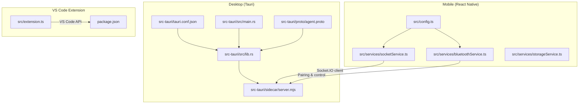
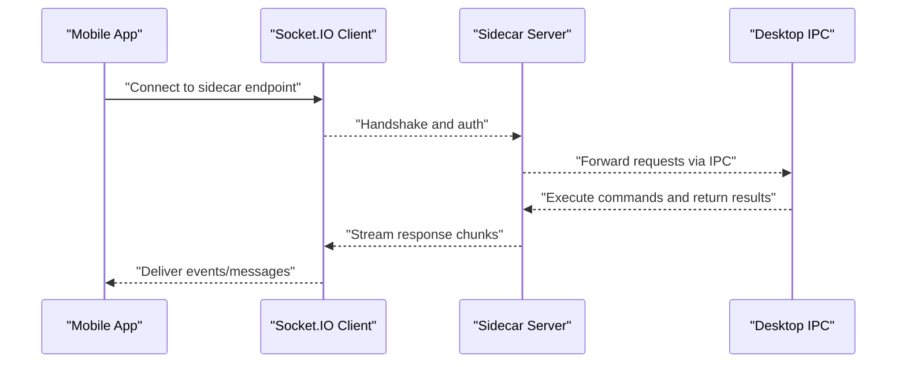
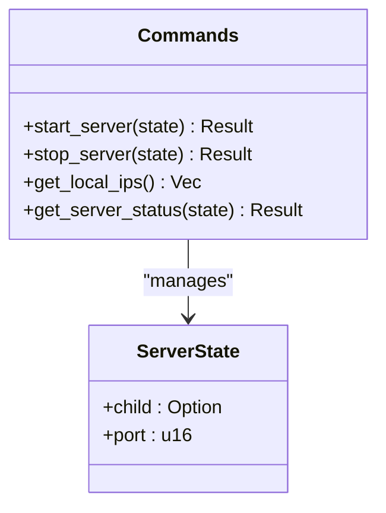
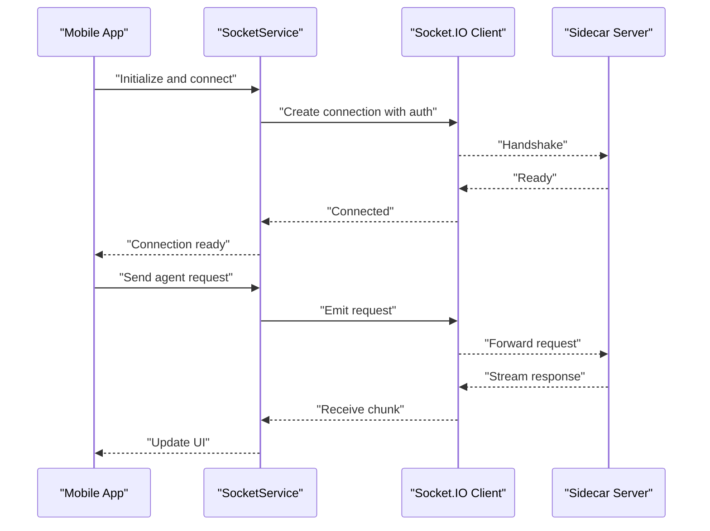
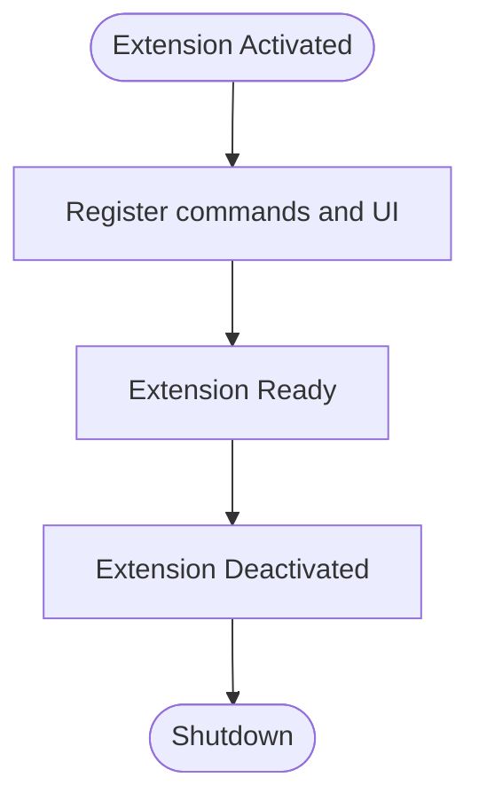
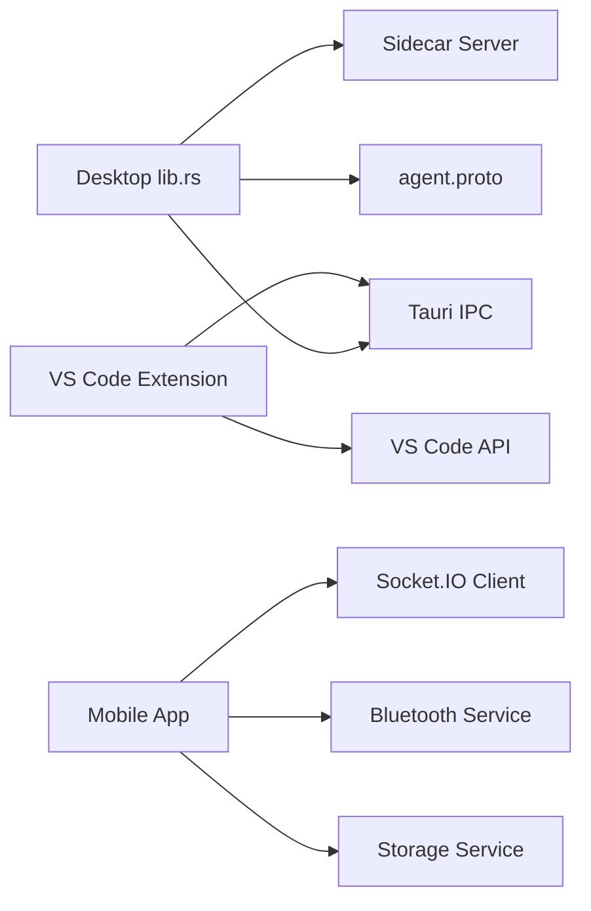

# API Reference

<cite>
**Referenced Files in This Document**
- [lib.rs](file://apps/desktop/src-tauri/src/lib.rs)
- [main.rs](file://apps/desktop/src-tauri/src/main.rs)
- [tauri.conf.json](file://apps/desktop/src-tauri/tauri.conf.json)
- [agent.proto](file://apps/desktop/src-tauri/proto/agent.proto)
- [Cargo.toml](file://apps/desktop/src-tauri/Cargo.toml)
- [sharedSocket.ts](file://apps/desktop/src/utils/sharedSocket.ts)
- [apiConfig.ts](file://apps/desktop/src/utils/apiConfig.ts)
- [shell.ts](file://apps/desktop/src/utils/shell.ts)
- [socketService.ts](file://apps/mobile/src/services/socketService.ts)
- [bluetoothService.ts](file://apps/mobile/src/services/bluetoothService.ts)
- [storageService.ts](file://apps/mobile/src/services/storageService.ts)
- [config.ts](file://apps/mobile/src/config.ts)
- [extension.ts](file://apps/vscode-extension/src/extension.ts)
- [package.json](file://apps/vscode-extension/package.json)
- [developer_performance.txt](file://group/Chat_2026-05-31_08-10-16/developer_performance.txt)
</cite>

## Table of Contents
1. [Introduction](#introduction)
2. [Project Structure](#project-structure)
3. [Core Components](#core-components)
4. [Architecture Overview](#architecture-overview)
5. [Detailed Component Analysis](#detailed-component-analysis)
6. [Dependency Analysis](#dependency-analysis)
7. [Performance Considerations](#performance-considerations)
8. [Troubleshooting Guide](#troubleshooting-guide)
9. [Conclusion](#conclusion)
10. [Appendices](#appendices)

## Introduction
This document provides a comprehensive API reference for GHITA CODING AGENT across three primary platforms: Desktop (Tauri), Mobile (React Native), and VS Code Extension. It covers:
- Tauri command definitions and IPC protocols used for desktop integration and sidecar process control
- Socket.IO client methods for mobile real-time communication
- VS Code extension API surface and lifecycle management
- AI provider integration patterns and communication protocols
- Cross-platform messaging, serialization, and error handling strategies
- Authentication, security, and performance optimization guidance
- Versioning, compatibility, and migration notes

## Project Structure
The project is organized into three main applications and supporting packages. The Desktop app exposes Tauri commands for system integration and a sidecar server for agent orchestration. The Mobile app connects via Socket.IO and Bluetooth for device pairing and remote control. The VS Code extension integrates with the editor’s API and contributes commands and UI.

**Diagram sources**
- [lib.rs:144-188](file://apps/desktop/src-tauri/src/lib.rs#L144-L188)
- [main.rs](file://apps/desktop/src-tauri/src/main.rs)
- [tauri.conf.json](file://apps/desktop/src-tauri/tauri.conf.json)
- [agent.proto](file://apps/desktop/src-tauri/proto/agent.proto)
- [socketService.ts](file://apps/mobile/src/services/socketService.ts)
- [bluetoothService.ts](file://apps/mobile/src/services/bluetoothService.ts)
- [storageService.ts](file://apps/mobile/src/services/storageService.ts)
- [config.ts](file://apps/mobile/src/config.ts)
- [extension.ts](file://apps/vscode-extension/src/extension.ts)
- [package.json](file://apps/vscode-extension/package.json)

**Section sources**
- [lib.rs:144-188](file://apps/desktop/src-tauri/src/lib.rs#L144-L188)
- [tauri.conf.json](file://apps/desktop/src-tauri/tauri.conf.json)
- [socketService.ts](file://apps/mobile/src/services/socketService.ts)
- [bluetoothService.ts](file://apps/mobile/src/services/bluetoothService.ts)
- [extension.ts](file://apps/vscode-extension/src/extension.ts)
- [package.json](file://apps/vscode-extension/package.json)

## Core Components
This section outlines the primary APIs and their responsibilities across platforms.

- Desktop (Tauri)
  - IPC commands for sidecar lifecycle management and LAN discovery
  - Sidecar server for agent orchestration and proxying
  - Protocol buffer definitions for typed agent messages
  - Shared socket utilities for desktop-to-sidecar communication
  - API configuration and shell utilities for process orchestration

- Mobile (React Native)
  - Socket.IO client service for real-time messaging with the sidecar
  - Bluetooth service for device pairing and control
  - Storage service for persisted settings and session data
  - Application configuration module

- VS Code Extension
  - Extension activation and deactivation lifecycle
  - Contribution of commands and UI integration points

**Section sources**
- [lib.rs:144-188](file://apps/desktop/src-tauri/src/lib.rs#L144-L188)
- [sharedSocket.ts](file://apps/desktop/src/utils/sharedSocket.ts)
- [apiConfig.ts](file://apps/desktop/src/utils/apiConfig.ts)
- [shell.ts](file://apps/desktop/src/utils/shell.ts)
- [socketService.ts](file://apps/mobile/src/services/socketService.ts)
- [bluetoothService.ts](file://apps/mobile/src/services/bluetoothService.ts)
- [storageService.ts](file://apps/mobile/src/services/storageService.ts)
- [config.ts](file://apps/mobile/src/config.ts)
- [extension.ts](file://apps/vscode-extension/src/extension.ts)
- [package.json](file://apps/vscode-extension/package.json)

## Architecture Overview
The system comprises three communicating nodes:
- Desktop (Tauri) hosts the sidecar server and exposes IPC commands for system integration
- Mobile (React Native) connects via Socket.IO and Bluetooth to the sidecar
- VS Code Extension interacts with the editor’s API and can trigger desktop actions

**Diagram sources**
- [socketService.ts](file://apps/mobile/src/services/socketService.ts)
- [lib.rs:144-188](file://apps/desktop/src-tauri/src/lib.rs#L144-L188)
- [sharedSocket.ts](file://apps/desktop/src/utils/sharedSocket.ts)

## Detailed Component Analysis

### Desktop (Tauri) IPC Commands
The desktop application defines Tauri commands for:
- Starting/stopping the sidecar communication server
- Retrieving local IP addresses for LAN discovery
- Checking server status and returning structured runtime info

Command definitions and behavior:
- Start sidecar server
  - Purpose: Launch the sidecar process and return a readiness message with the bound port
  - Parameters: None
  - Returns: String message indicating server status
  - Notes: Uses a mutex-protected state to manage a single server instance

- Stop sidecar server
  - Purpose: Gracefully terminate the sidecar process
  - Parameters: None
  - Returns: String message indicating termination outcome

- Get local IP addresses
  - Purpose: Enumerate IPv4 non-loopback addresses for LAN pairing
  - Parameters: None
  - Returns: Array of IP address strings

- Get server status
  - Purpose: Query current server state, port, and client connections
  - Parameters: None
  - Returns: Structured JSON value containing runtime metadata

Security and error handling:
- All commands return either a success string or an error string derived from internal exceptions
- The server state is guarded by a mutex to prevent concurrent misuse

**Section sources**
- [lib.rs:144-188](file://apps/desktop/src-tauri/src/lib.rs#L144-L188)

#### IPC Command Class Diagram

**Diagram sources**
- [lib.rs:144-188](file://apps/desktop/src-tauri/src/lib.rs#L144-L188)

### Desktop Sidecar Server
The sidecar server is launched and controlled via Tauri IPC. It handles agent orchestration and can proxy requests. Startup and lifecycle management:
- Starts the sidecar process and captures its PID/port
- Provides a stop mechanism to gracefully terminate the process
- Exposes a status endpoint for health and runtime diagnostics

Operational notes:
- The sidecar is implemented as a Node.js script and communicates with the desktop app via IPC
- The server listens on a dynamic port determined at runtime

**Section sources**
- [lib.rs:144-188](file://apps/desktop/src-tauri/src/lib.rs#L144-L188)

### Protocol Buffers (agent.proto)
The agent protocol definition enables typed message exchange between components. It defines:
- Message schemas for agent commands and responses
- Field types and cardinality for reliable serialization/deserialization
- Compatibility rules for evolving message formats

Integration:
- Used by both desktop and mobile to ensure consistent message framing
- Enables efficient binary encoding and cross-language interoperability

**Section sources**
- [agent.proto](file://apps/desktop/src-tauri/proto/agent.proto)

### Desktop Utilities and Configuration
- Shared socket utilities
  - Provides a singleton Socket.IO client instance for desktop-sidecar communication
  - Handles connection lifecycle and event dispatching

- API configuration
  - Centralizes endpoint URLs and base configuration for backend integrations

- Shell utilities
  - Encapsulates process spawning and environment setup for the sidecar

**Section sources**
- [sharedSocket.ts](file://apps/desktop/src/utils/sharedSocket.ts)
- [apiConfig.ts](file://apps/desktop/src/utils/apiConfig.ts)
- [shell.ts](file://apps/desktop/src/utils/shell.ts)

### Mobile (React Native) Socket.IO Client
The mobile application consumes a Socket.IO-based real-time API:
- Connection handling
  - Establishes a WebSocket connection to the sidecar endpoint
  - Implements reconnection logic and heartbeat monitoring
  - Supports authentication tokens passed during handshake

- Message formats
  - Uses the agent protocol schema for payload framing
  - Streams incremental updates for long-running operations

- Event types
  - Chat and agent response events
  - Health and status notifications
  - Error and disconnect events

- Real-time interaction patterns
  - Request-response with streaming progress updates
  - Bidirectional control messages for remote operations

**Section sources**
- [socketService.ts](file://apps/mobile/src/services/socketService.ts)
- [config.ts](file://apps/mobile/src/config.ts)

#### Mobile Socket.IO Sequence

**Diagram sources**
- [socketService.ts](file://apps/mobile/src/services/socketService.ts)
- [config.ts](file://apps/mobile/src/config.ts)

### Mobile Bluetooth Service
The Bluetooth service supports device pairing and control:
- Pairing workflows with the desktop agent
- Reliable transport for control commands and telemetry
- Fallback and retry strategies for unstable links

**Section sources**
- [bluetoothService.ts](file://apps/mobile/src/services/bluetoothService.ts)

### Mobile Storage Service
Persistent storage for settings and sessions:
- Local key-value storage for user preferences
- Session persistence across app restarts
- Migration support for schema changes

**Section sources**
- [storageService.ts](file://apps/mobile/src/services/storageService.ts)

### VS Code Extension API
The extension integrates with VS Code:
- Activation and deactivation lifecycle
- Contribution of commands to trigger desktop actions
- UI integration points (panels, menus, status bar)
- Workspace integration for project-specific operations

Configuration:
- Declares command contributions and permissions in package manifest
- Uses VS Code’s extension API for window management and file system access

**Section sources**
- [extension.ts](file://apps/vscode-extension/src/extension.ts)
- [package.json](file://apps/vscode-extension/package.json)

#### VS Code Extension Lifecycle

**Diagram sources**
- [extension.ts](file://apps/vscode-extension/src/extension.ts)
- [package.json](file://apps/vscode-extension/package.json)

### AI Provider APIs and Communication Protocols
Cross-platform communication relies on:
- Socket.IO for real-time messaging
- Protocol buffers for typed payloads
- Optional Bluetooth for device pairing and control
- Tauri IPC for desktop-sidecar coordination

Authentication and security:
- Socket.IO handshake supports token-based authentication
- Desktop sidecar validates incoming requests and applies rate limits
- Protocol buffers enforce schema compliance and reduce parsing errors

Rate limiting considerations:
- Desktop sidecar throttles health checks and repeated queries
- Mobile clients debounce frequent UI updates and batch requests

**Section sources**
- [socketService.ts](file://apps/mobile/src/services/socketService.ts)
- [lib.rs:144-188](file://apps/desktop/src-tauri/src/lib.rs#L144-L188)
- [agent.proto](file://apps/desktop/src-tauri/proto/agent.proto)

## Dependency Analysis
Key dependencies and their roles:
- Desktop
  - Tauri runtime for IPC and system integration
  - Sidecar server for agent orchestration
  - Protocol buffers for typed messaging
  - Network utilities for LAN discovery

- Mobile
  - Socket.IO client for real-time connectivity
  - Bluetooth stack for pairing and control
  - Storage layer for persistence

- VS Code Extension
  - VS Code API for editor integration
  - Command contributions and UI extensions

**Diagram sources**
- [lib.rs:144-188](file://apps/desktop/src-tauri/src/lib.rs#L144-L188)
- [agent.proto](file://apps/desktop/src-tauri/proto/agent.proto)
- [socketService.ts](file://apps/mobile/src/services/socketService.ts)
- [bluetoothService.ts](file://apps/mobile/src/services/bluetoothService.ts)
- [storageService.ts](file://apps/mobile/src/services/storageService.ts)
- [extension.ts](file://apps/vscode-extension/src/extension.ts)

**Section sources**
- [lib.rs:144-188](file://apps/desktop/src-tauri/src/lib.rs#L144-L188)
- [Cargo.toml](file://apps/desktop/src-tauri/Cargo.toml)
- [socketService.ts](file://apps/mobile/src/services/socketService.ts)
- [bluetoothService.ts](file://apps/mobile/src/services/bluetoothService.ts)
- [storageService.ts](file://apps/mobile/src/services/storageService.ts)
- [extension.ts](file://apps/vscode-extension/src/extension.ts)

## Performance Considerations
Optimization insights derived from internal performance notes:
- Reduce unnecessary IPC calls when tabs are hidden
- Minimize synchronous blocking operations during sidecar startup
- Prefer dynamic imports for heavy modules to improve cold start
- Eliminate redundant dependencies (e.g., remove server-side Socket.IO from desktop)
- Bundle static assets locally to avoid CDN failures and latency
- Persist HTTP client instances to reuse connection pools and TLS caches
- Optimize rendering and debouncing for streaming UI updates

Practical recommendations:
- Batch frequent UI updates and debounce rapid-fire events
- Cache protocol buffer schemas and reuse encoders/decoders
- Use background threads for CPU-intensive tasks in the sidecar
- Monitor and cap concurrent requests to the sidecar

**Section sources**
- [developer_performance.txt](file://group/Chat_2026-05-31_08-10-16/developer_performance.txt)

## Troubleshooting Guide
Common issues and resolutions:
- Sidecar not starting
  - Verify IPC command execution and environment permissions
  - Check for conflicting ports and antivirus interference
  - Review logs emitted by the sidecar process

- Socket.IO connection failures
  - Confirm endpoint URL and authentication token
  - Validate firewall rules and network ACLs
  - Enable verbose logging in the Socket.IO client

- Bluetooth pairing problems
  - Ensure device proximity and supported profiles
  - Retry pairing after clearing cached credentials
  - Check for OS-level Bluetooth permissions

- Rate limiting and timeouts
  - Implement exponential backoff in clients
  - Reduce polling frequency and consolidate requests
  - Use streaming responses to minimize round trips

- Protocol mismatch
  - Align agent protocol versions across desktop and mobile
  - Validate message schemas before sending payloads
  - Use strict decoding and handle unknown fields gracefully

**Section sources**
- [lib.rs:144-188](file://apps/desktop/src-tauri/src/lib.rs#L144-L188)
- [socketService.ts](file://apps/mobile/src/services/socketService.ts)
- [bluetoothService.ts](file://apps/mobile/src/services/bluetoothService.ts)

## Conclusion
GHITA CODING AGENT provides a cohesive multi-platform API ecosystem:
- Tauri IPC for secure desktop integration
- Socket.IO for scalable real-time communication
- Protocol buffers for robust cross-language messaging
- VS Code extension for seamless IDE integration

Adhering to the guidelines in this document ensures reliable, performant, and secure integrations across all platforms.

## Appendices

### API Versioning and Compatibility
- Protocol buffers
  - Use semantic versioning for message schemas
  - Maintain backward compatibility by avoiding field deletions
  - Introduce new optional fields and mark removed ones as reserved

- Socket.IO
  - Keep client and server compatible minor versions
  - Document breaking changes in release notes
  - Provide migration helpers for event name changes

- Tauri IPC
  - Version command namespaces or prefixes
  - Maintain stable parameter ordering for existing commands
  - Deprecate commands with clear timelines and alternatives

- VS Code Extension
  - Follow semantic versioning and declare minimum VS Code versions
  - Use capability declarations for granular permissions
  - Provide upgrade paths for changed command signatures

**Section sources**
- [agent.proto](file://apps/desktop/src-tauri/proto/agent.proto)
- [socketService.ts](file://apps/mobile/src/services/socketService.ts)
- [lib.rs:144-188](file://apps/desktop/src-tauri/src/lib.rs#L144-L188)
- [package.json](file://apps/vscode-extension/package.json)

### Security Considerations
- Transport security
  - Use TLS for Socket.IO connections
  - Restrict sidecar exposure to localhost or LAN-only interfaces
  - Enforce authentication tokens at the Socket.IO handshake

- Access control
  - Limit Tauri command permissions via capability manifests
  - Validate all incoming IPC parameters and sanitize inputs
  - Apply rate limiting to prevent abuse

- Data protection
  - Encrypt sensitive payloads with symmetric keys
  - Avoid logging raw protocol buffer bytes
  - Clear stored credentials on logout or device removal

**Section sources**
- [tauri.conf.json](file://apps/desktop/src-tauri/tauri.conf.json)
- [socketService.ts](file://apps/mobile/src/services/socketService.ts)
- [storageService.ts](file://apps/mobile/src/services/storageService.ts)

### Debugging and Monitoring
- Desktop
  - Enable Tauri devtools and console logging
  - Inspect sidecar logs for startup and runtime errors
  - Monitor IPC throughput and latency metrics

- Mobile
  - Capture Socket.IO packet traces
  - Log Bluetooth pairing attempts and failure reasons
  - Track storage write/read latencies

- VS Code Extension
  - Use built-in extension host logs
  - Verify command registration and permission prompts
  - Test integration points with sample projects

**Section sources**
- [lib.rs:144-188](file://apps/desktop/src-tauri/src/lib.rs#L144-L188)
- [socketService.ts](file://apps/mobile/src/services/socketService.ts)
- [extension.ts](file://apps/vscode-extension/src/extension.ts)