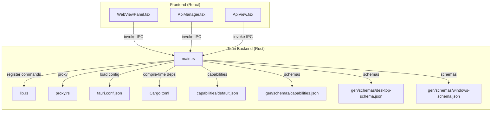
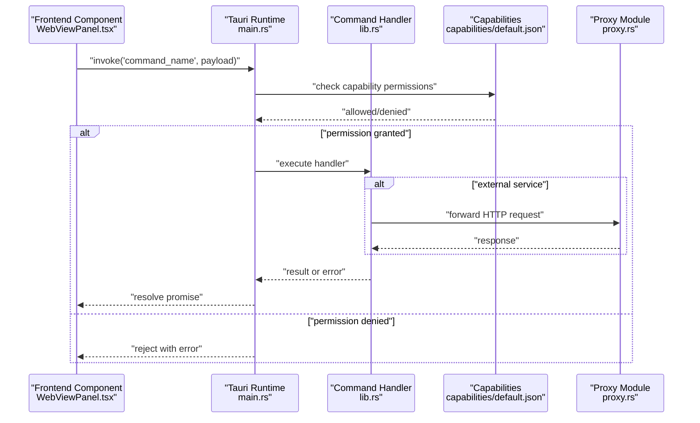
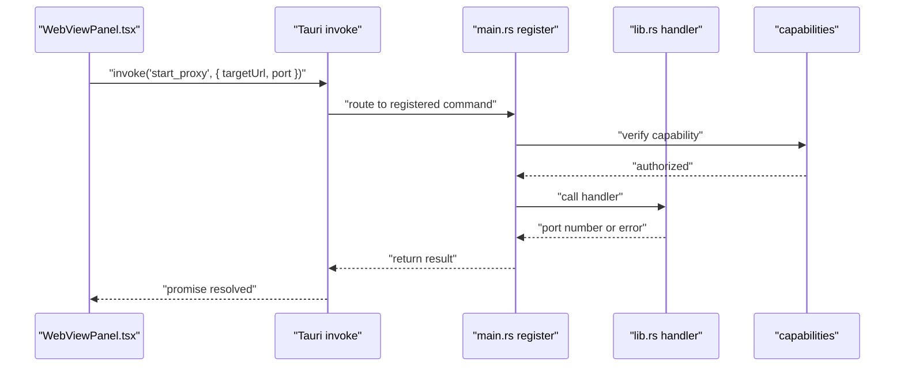
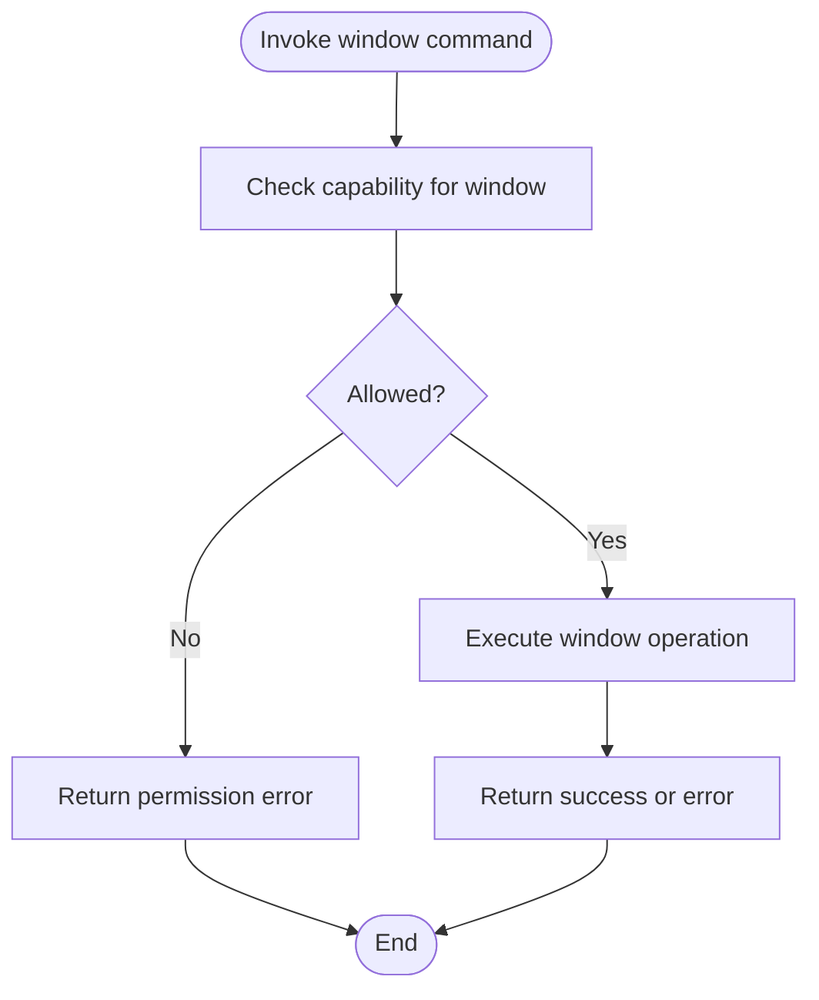
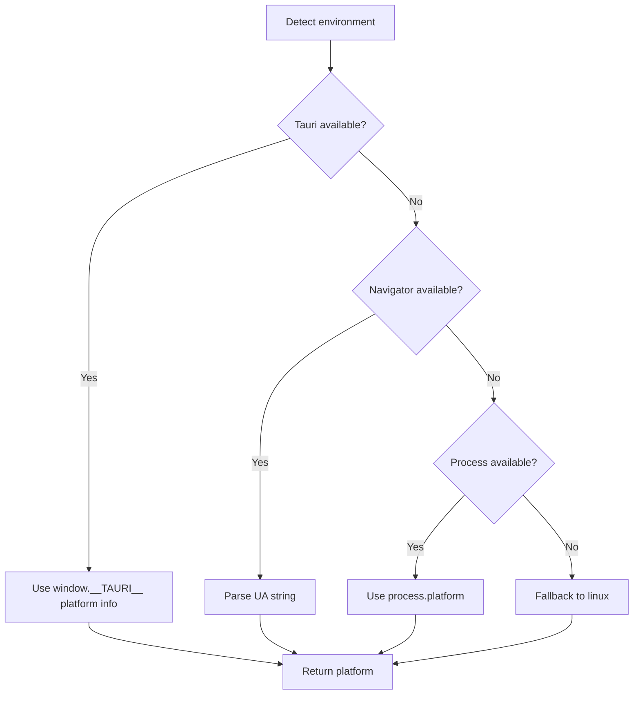
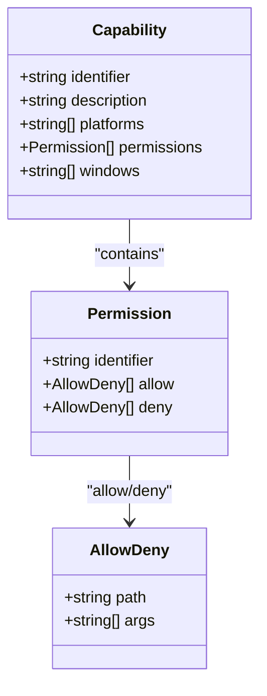
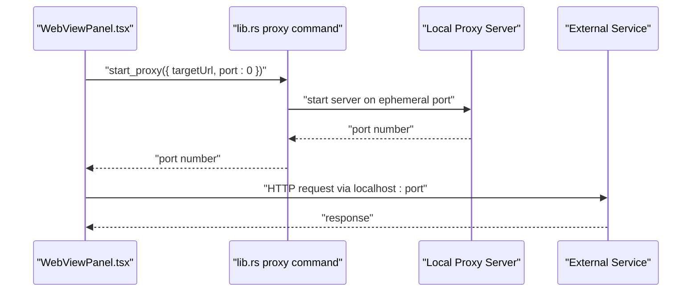
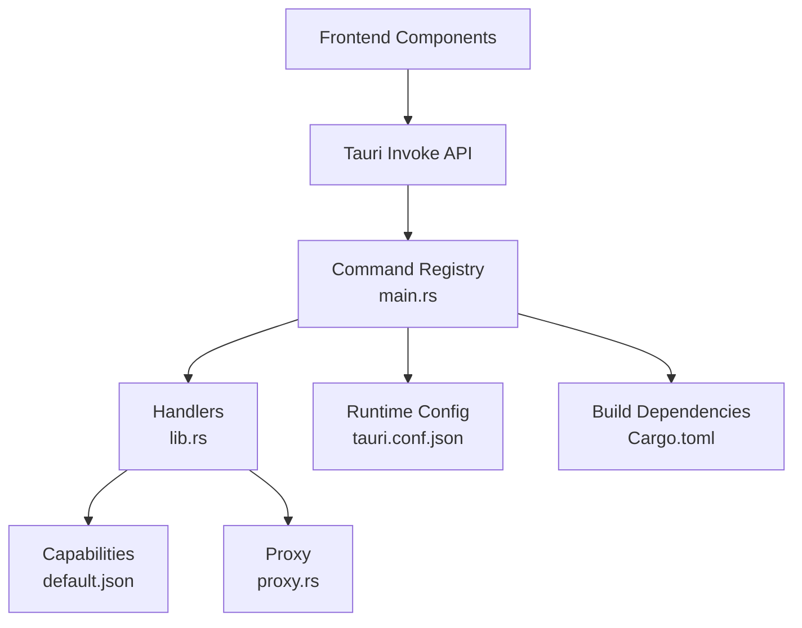

# Desktop API (Tauri)

<cite>
**Referenced Files in This Document**
- [main.rs](file://apps/desktop/src-tauri/src/main.rs)
- [lib.rs](file://apps/desktop/src-tauri/src/lib.rs)
- [proxy.rs](file://apps/desktop/src-tauri/src/proxy.rs)
- [tauri.conf.json](file://apps/desktop/src-tauri/tauri.conf.json)
- [Cargo.toml](file://apps/desktop/src-tauri/Cargo.toml)
- [default.json](file://apps/desktop/src-tauri/capabilities/default.json)
- [capabilities.json](file://apps/desktop/src-tauri/gen/schemas/capabilities.json)
- [desktop-schema.json](file://apps/desktop/src-tauri/gen/schemas/desktop-schema.json)
- [windows-schema.json](file://apps/desktop/src-tauri/gen/schemas/windows-schema.json)
- [WebViewPanel.tsx](file://apps/desktop/src/components/WebViewPanel.tsx)
- [ApiManager.tsx](file://apps/desktop/src/components/ApiManager.tsx)
- [ApiView.tsx](file://apps/desktop/src/views/ApiView.tsx)
- [utils.ts](file://packages/shared/src/utils.ts)
</cite>

## Table of Contents
1. [Introduction](#introduction)
2. [Project Structure](#project-structure)
3. [Core Components](#core-components)
4. [Architecture Overview](#architecture-overview)
5. [Detailed Component Analysis](#detailed-component-analysis)
6. [Dependency Analysis](#dependency-analysis)
7. [Performance Considerations](#performance-considerations)
8. [Troubleshooting Guide](#troubleshooting-guide)
9. [Conclusion](#conclusion)
10. [Appendices](#appendices)

## Introduction
This document provides comprehensive API documentation for the Tauri desktop application. It covers IPC command definitions, window management, system integration APIs, capability-based permissions, runtime integration (events and state), cross-platform compatibility, proxy functionality for external service communication, and security considerations. Practical examples of command invocation, parameter validation, and response processing are included, along with integration patterns, debugging techniques, and performance optimization guidance.

## Project Structure
The desktop application is organized into a frontend (React) and a Tauri backend (Rust). The Tauri backend defines commands exposed to the frontend via IPC, manages capabilities for permission control, and exposes a local proxy for secure external service communication. The frontend invokes commands using the Tauri API and renders UI components that integrate with the backend.

**Diagram sources**
- [main.rs](file://apps/desktop/src-tauri/src/main.rs)
- [lib.rs](file://apps/desktop/src-tauri/src/lib.rs)
- [proxy.rs](file://apps/desktop/src-tauri/src/proxy.rs)
- [tauri.conf.json](file://apps/desktop/src-tauri/tauri.conf.json)
- [Cargo.toml](file://apps/desktop/src-tauri/Cargo.toml)
- [default.json](file://apps/desktop/src-tauri/capabilities/default.json)
- [capabilities.json](file://apps/desktop/src-tauri/gen/schemas/capabilities.json)
- [desktop-schema.json](file://apps/desktop/src-tauri/gen/schemas/desktop-schema.json)
- [windows-schema.json](file://apps/desktop/src-tauri/gen/schemas/windows-schema.json)
- [WebViewPanel.tsx](file://apps/desktop/src/components/WebViewPanel.tsx)
- [ApiManager.tsx](file://apps/desktop/src/components/ApiManager.tsx)
- [ApiView.tsx](file://apps/desktop/src/views/ApiView.tsx)

**Section sources**
- [main.rs](file://apps/desktop/src-tauri/src/main.rs)
- [lib.rs](file://apps/desktop/src-tauri/src/lib.rs)
- [tauri.conf.json](file://apps/desktop/src-tauri/tauri.conf.json)
- [Cargo.toml](file://apps/desktop/src-tauri/Cargo.toml)

## Core Components
- IPC Command Layer: Commands are registered in the backend and invoked from the frontend. The frontend components use the Tauri invoke API to send requests and receive responses.
- Capability System: Permissions are defined per capability and bound to windows, restricting access to specific commands and resources.
- Proxy Service: A local proxy forwards HTTP requests to a configured target endpoint, enabling controlled external service communication.
- Runtime Integration: Event handling and state management are integrated with the Tauri runtime for lifecycle and inter-process coordination.

Key responsibilities:
- Expose typed commands with strict parameter validation and error handling.
- Enforce capability-based permissions at runtime.
- Provide a secure, configurable proxy for outbound traffic.
- Maintain cross-platform compatibility and robust error reporting.

**Section sources**
- [lib.rs](file://apps/desktop/src-tauri/src/lib.rs)
- [proxy.rs](file://apps/desktop/src-tauri/src/proxy.rs)
- [default.json](file://apps/desktop/src-tauri/capabilities/default.json)
- [capabilities.json](file://apps/desktop/src-tauri/gen/schemas/capabilities.json)

## Architecture Overview
The frontend invokes Tauri commands through the invoke API. The backend registers commands and routes them to handlers. Capabilities define which commands are permitted for specific windows. The proxy module handles outbound HTTP requests securely.

**Diagram sources**
- [main.rs](file://apps/desktop/src-tauri/src/main.rs)
- [lib.rs](file://apps/desktop/src-tauri/src/lib.rs)
- [proxy.rs](file://apps/desktop/src-tauri/src/proxy.rs)
- [default.json](file://apps/desktop/src-tauri/capabilities/default.json)

## Detailed Component Analysis

### IPC Command Definitions and Invocation
- Command Registration: Commands are registered in the backend and mapped to handler functions. Handlers accept structured parameters and return typed results or errors.
- Frontend Invocation: Components invoke commands using the Tauri invoke API, passing parameters and handling responses or exceptions.
- Parameter Validation: Handlers validate input types and required fields, returning explicit errors for invalid inputs.
- Error Handling: Errors are propagated back to the frontend with descriptive messages and codes for consistent handling.

Practical example paths:
- Invoke a command from a React component: [WebViewPanel.tsx](file://apps/desktop/src/components/WebViewPanel.tsx)
- Register and handle commands in the backend: [lib.rs](file://apps/desktop/src-tauri/src/lib.rs)
- Runtime entrypoint for command registration: [main.rs](file://apps/desktop/src-tauri/src/main.rs)

**Diagram sources**
- [WebViewPanel.tsx](file://apps/desktop/src/components/WebViewPanel.tsx)
- [main.rs](file://apps/desktop/src-tauri/src/main.rs)
- [lib.rs](file://apps/desktop/src-tauri/src/lib.rs)
- [default.json](file://apps/desktop/src-tauri/capabilities/default.json)

**Section sources**
- [WebViewPanel.tsx](file://apps/desktop/src/components/WebViewPanel.tsx)
- [lib.rs](file://apps/desktop/src-tauri/src/lib.rs)
- [main.rs](file://apps/desktop/src-tauri/src/main.rs)

### Window Management Commands
- Window Creation and Control: Commands exist to create, close, focus, and resize windows. These commands are gated by capabilities to restrict access.
- Window Association: Windows can be associated with capabilities by exact name or glob patterns, enabling privilege separation.
- Cross-Platform Behavior: Window operations adapt to platform-specific constraints while maintaining consistent IPC semantics.

Example paths:
- Capability definition for windows: [default.json](file://apps/desktop/src-tauri/capabilities/default.json)
- Window schema definitions: [windows-schema.json](file://apps/desktop/src-tauri/gen/schemas/windows-schema.json)

**Diagram sources**
- [default.json](file://apps/desktop/src-tauri/capabilities/default.json)
- [windows-schema.json](file://apps/desktop/src-tauri/gen/schemas/windows-schema.json)

**Section sources**
- [default.json](file://apps/desktop/src-tauri/capabilities/default.json)
- [windows-schema.json](file://apps/desktop/src-tauri/gen/schemas/windows-schema.json)

### System Integration APIs
- OS and Environment Detection: Utilities detect the platform and environment (desktop vs mobile) to tailor behavior.
- Platform-Specific Behaviors: Integration APIs adapt to Windows, macOS, and Linux environments.

Example paths:
- Platform detection logic: [utils.ts](file://packages/shared/src/utils.ts)

**Diagram sources**
- [utils.ts](file://packages/shared/src/utils.ts)

**Section sources**
- [utils.ts](file://packages/shared/src/utils.ts)

### Capability-Based Permissions
- Capability Model: Capabilities group permissions and bind them to windows. They control access to core, application, and plugin commands.
- Permission Granularity: Permissions can include identifiers, allow/deny lists, and platform filters.
- Schema Validation: Capability definitions are validated against JSON schemas for correctness.

Example paths:
- Capability definition: [default.json](file://apps/desktop/src-tauri/capabilities/default.json)
- Capability schema: [capabilities.json](file://apps/desktop/src-tauri/gen/schemas/capabilities.json)
- Desktop schema reference: [desktop-schema.json](file://apps/desktop/src-tauri/gen/schemas/desktop-schema.json)

**Diagram sources**
- [capabilities.json](file://apps/desktop/src-tauri/gen/schemas/capabilities.json)
- [desktop-schema.json](file://apps/desktop/src-tauri/gen/schemas/desktop-schema.json)

**Section sources**
- [default.json](file://apps/desktop/src-tauri/capabilities/default.json)
- [capabilities.json](file://apps/desktop/src-tauri/gen/schemas/capabilities.json)
- [desktop-schema.json](file://apps/desktop/src-tauri/gen/schemas/desktop-schema.json)

### Proxy Functionality for External Service Communication
- Purpose: Provides a local HTTP proxy that forwards requests to a configured target URL, enabling controlled outbound communication.
- Operation: Starts a local server, forwards method, path, headers, and body, and returns the response to the caller.
- Security: Restricts outbound traffic to the configured target and supports TLS and header filtering as needed.

Example paths:
- Proxy implementation: [proxy.rs](file://apps/desktop/src-tauri/src/proxy.rs)
- Frontend proxy usage: [WebViewPanel.tsx](file://apps/desktop/src/components/WebViewPanel.tsx)

**Diagram sources**
- [proxy.rs](file://apps/desktop/src-tauri/src/proxy.rs)
- [WebViewPanel.tsx](file://apps/desktop/src/components/WebViewPanel.tsx)

**Section sources**
- [proxy.rs](file://apps/desktop/src-tauri/src/proxy.rs)
- [WebViewPanel.tsx](file://apps/desktop/src/components/WebViewPanel.tsx)

### Runtime Integration: Events and State
- Event Handling: The Tauri runtime emits and listens to events for lifecycle, window state, and custom signals. Frontend components subscribe to events to update UI state.
- State Management: Persistent state can be managed via Tauri state APIs or stored in the frontend store, synchronized with backend updates.
- Cross-Platform Compatibility: Runtime APIs adapt to platform differences while exposing consistent event and state semantics.

Example paths:
- Runtime configuration: [tauri.conf.json](file://apps/desktop/src-tauri/tauri.conf.json)
- Backend initialization: [main.rs](file://apps/desktop/src-tauri/src/main.rs)

**Section sources**
- [tauri.conf.json](file://apps/desktop/src-tauri/tauri.conf.json)
- [main.rs](file://apps/desktop/src-tauri/src/main.rs)

## Dependency Analysis
- Frontend-to-Backend Coupling: Components depend on Tauri invoke APIs and capability-limited command sets.
- Backend Dependencies: Commands rely on capability checks, proxy module, and runtime configuration.
- External Dependencies: The proxy leverages HTTP libraries; capabilities and schemas enforce policy boundaries.

**Diagram sources**
- [main.rs](file://apps/desktop/src-tauri/src/main.rs)
- [lib.rs](file://apps/desktop/src-tauri/src/lib.rs)
- [proxy.rs](file://apps/desktop/src-tauri/src/proxy.rs)
- [tauri.conf.json](file://apps/desktop/src-tauri/tauri.conf.json)
- [Cargo.toml](file://apps/desktop/src-tauri/Cargo.toml)
- [default.json](file://apps/desktop/src-tauri/capabilities/default.json)

**Section sources**
- [Cargo.toml](file://apps/desktop/src-tauri/Cargo.toml)
- [tauri.conf.json](file://apps/desktop/src-tauri/tauri.conf.json)

## Performance Considerations
- Minimize IPC Calls: Batch operations and coalesce frequent calls to reduce overhead.
- Efficient Proxy Usage: Reuse proxy instances and avoid unnecessary restarts; configure timeouts appropriately.
- Capability Design: Keep capability sets minimal and precise to reduce permission checks and improve security.
- Frontend State Updates: Debounce UI updates triggered by frequent events to prevent excessive re-renders.
- Memory Management: Avoid retaining large payloads in IPC; stream or chunk data when possible.

## Troubleshooting Guide
- Permission Denied Errors: Verify the window’s capability includes the required permission identifier and platform filters.
- Proxy Not Running: Ensure the proxy is started and reachable on the returned port; check for port conflicts.
- Invalid Parameters: Confirm parameter types and required fields match command signatures; inspect handler logs for validation errors.
- Cross-Platform Issues: Validate platform-specific behaviors and adjust capabilities accordingly.

Common checks:
- Capability verification: [default.json](file://apps/desktop/src-tauri/capabilities/default.json)
- Proxy tests and behavior: [proxy.rs](file://apps/desktop/src-tauri/src/proxy.rs)
- Frontend invocation patterns: [WebViewPanel.tsx](file://apps/desktop/src/components/WebViewPanel.tsx)

**Section sources**
- [default.json](file://apps/desktop/src-tauri/capabilities/default.json)
- [proxy.rs](file://apps/desktop/src-tauri/src/proxy.rs)
- [WebViewPanel.tsx](file://apps/desktop/src/components/WebViewPanel.tsx)

## Conclusion
The Tauri desktop application provides a secure, cross-platform IPC layer with capability-based permissions, robust window management, and a configurable proxy for external service communication. By adhering to capability definitions, validating parameters, and leveraging runtime events and state, developers can build reliable and performant desktop integrations.

## Appendices

### API Reference Index
- IPC Commands
  - start_proxy(targetUrl, port): Starts a local proxy server and returns the listening port.
  - get_proxy_status(): Returns the current proxy status (running, port).
  - Other commands: Defined in the backend command registry.
- Capabilities
  - Identifier: Unique capability name.
  - Permissions: Command and resource access grants.
  - Windows: Window associations (exact or glob patterns).
  - Platforms: Optional platform filters.
- Proxy
  - Forwarding: Method, path, headers, and body forwarding to target URL.
  - Lifecycle: Start, reuse, and stop operations.

**Section sources**
- [lib.rs](file://apps/desktop/src-tauri/src/lib.rs)
- [proxy.rs](file://apps/desktop/src-tauri/src/proxy.rs)
- [default.json](file://apps/desktop/src-tauri/capabilities/default.json)