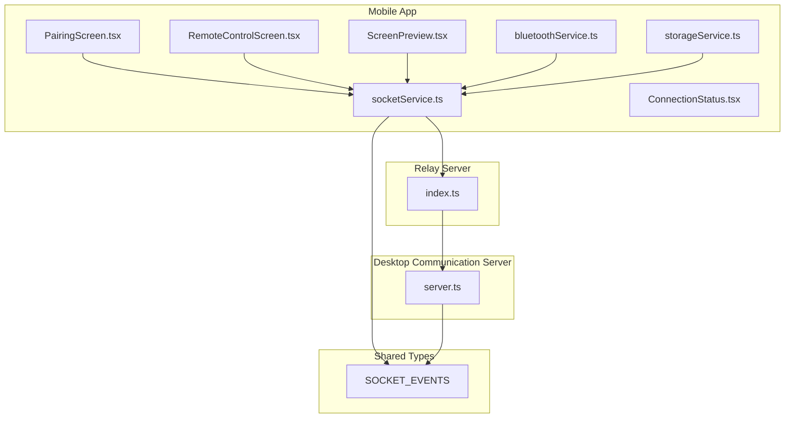
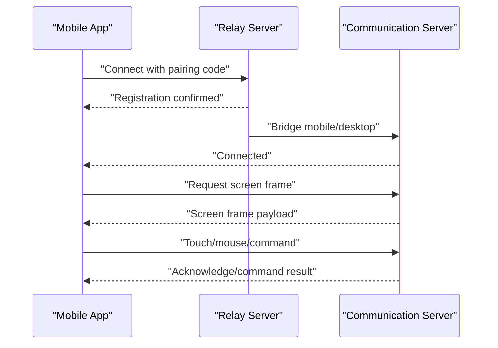
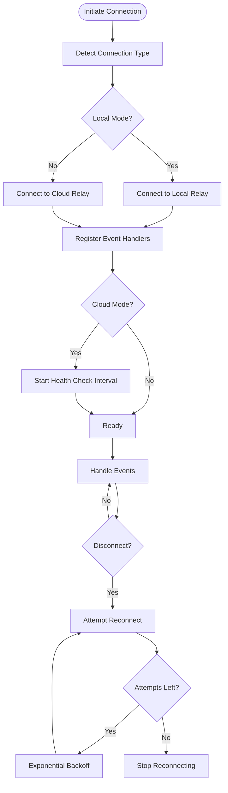
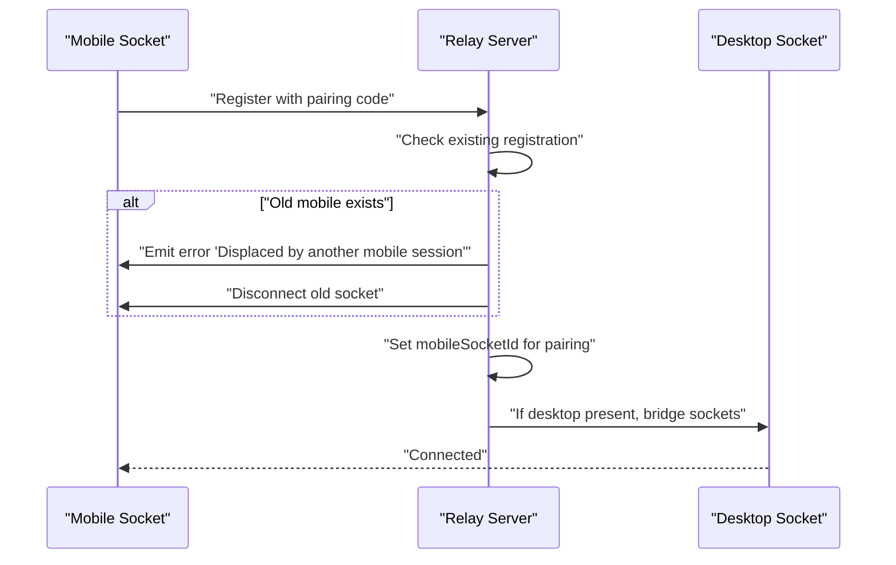
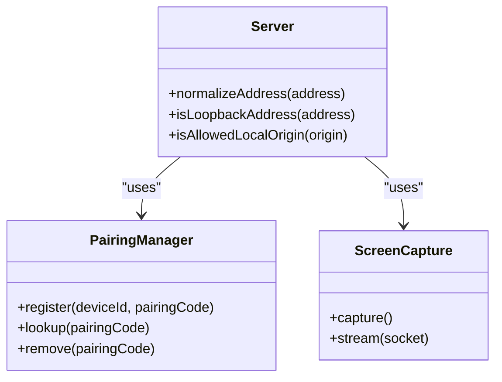
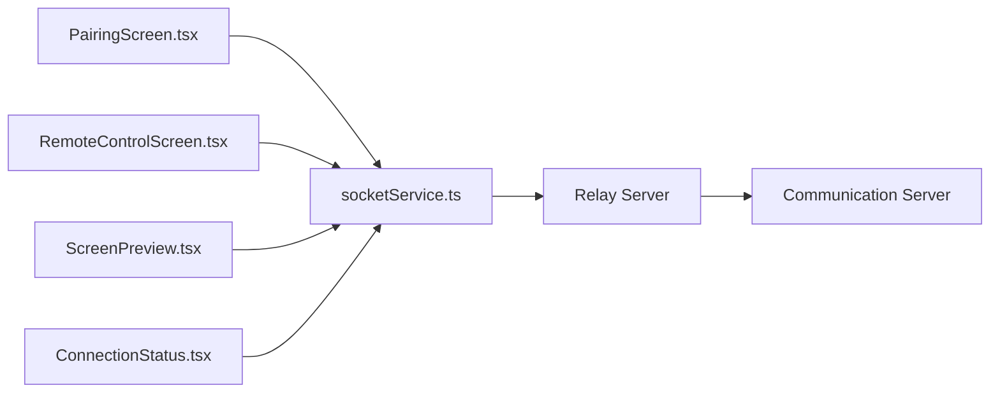
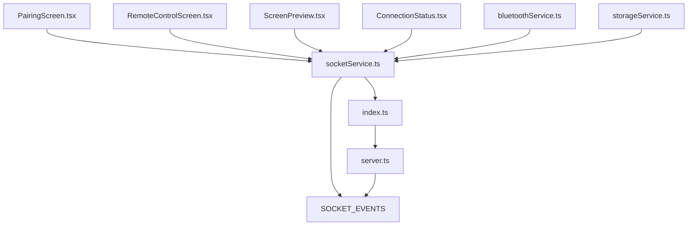

# Mobile API (Socket.IO)

<cite>
**Referenced Files in This Document**
- [socketService.ts](file://apps/mobile/src/services/socketService.ts)
- [App.tsx](file://apps/mobile/src/App.tsx)
- [bluetoothService.ts](file://apps/mobile/src/services/bluetoothService.ts)
- [storageService.ts](file://apps/mobile/src/services/storageService.ts)
- [ScreenPreview.tsx](file://apps/mobile/src/components/ScreenPreview.tsx)
- [PairingScreen.tsx](file://apps/mobile/src/screens/PairingScreen.tsx)
- [RemoteControlScreen.tsx](file://apps/mobile/src/screens/RemoteControlScreen.tsx)
- [ConnectionStatus.tsx](file://apps/mobile/src/components/ConnectionStatus.tsx)
- [server.ts](file://packages/communication/src/server.ts)
- [index.ts](file://packages/relay-server/src/index.ts)
- [sharedSocket.ts](file://apps/desktop/src/utils/sharedSocket.ts)
- [SOCKET_EVENTS](file://packages/shared/src/index.ts)
</cite>

## Table of Contents
1. [Introduction](#introduction)
2. [Project Structure](#project-structure)
3. [Core Components](#core-components)
4. [Architecture Overview](#architecture-overview)
5. [Detailed Component Analysis](#detailed-component-analysis)
6. [Dependency Analysis](#dependency-analysis)
7. [Performance Considerations](#performance-considerations)
8. [Troubleshooting Guide](#troubleshooting-guide)
9. [Conclusion](#conclusion)
10. [Appendices](#appendices)

## Introduction
This document describes the mobile application’s Socket.IO communication APIs and related mobile services. It covers connection establishment, message formatting, event types, real-time interaction patterns, and mobile-specific integrations such as Bluetooth pairing, screen preview, and device control. It also documents the message schemas for remote desktop control, file transfer, and device pairing, along with connection management strategies, error handling, and state synchronization. Practical examples of socket communication, event handling, and data serialization are included, alongside mobile-specific considerations such as battery optimization, background processing, and platform differences. Debugging tools and monitoring approaches for mobile API integration are provided.

## Project Structure
The mobile application integrates with a Socket.IO-based communication system that spans the mobile client, a relay server, and a desktop-side communication server. The mobile client exposes services for Socket.IO connectivity, Bluetooth integration, and local storage. Screens and components handle pairing, remote control, and screen preview. The desktop shares a common set of Socket.IO events and types via a shared package.

**Diagram sources**
- [socketService.ts](file://apps/mobile/src/services/socketService.ts)
- [bluetoothService.ts](file://apps/mobile/src/services/bluetoothService.ts)
- [storageService.ts](file://apps/mobile/src/services/storageService.ts)
- [ScreenPreview.tsx](file://apps/mobile/src/components/ScreenPreview.tsx)
- [PairingScreen.tsx](file://apps/mobile/src/screens/PairingScreen.tsx)
- [RemoteControlScreen.tsx](file://apps/mobile/src/screens/RemoteControlScreen.tsx)
- [ConnectionStatus.tsx](file://apps/mobile/src/components/ConnectionStatus.tsx)
- [index.ts](file://packages/relay-server/src/index.ts)
- [server.ts](file://packages/communication/src/server.ts)
- [SOCKET_EVENTS](file://packages/shared/src/index.ts)

**Section sources**
- [socketService.ts](file://apps/mobile/src/services/socketService.ts)
- [bluetoothService.ts](file://apps/mobile/src/services/bluetoothService.ts)
- [storageService.ts](file://apps/mobile/src/services/storageService.ts)
- [ScreenPreview.tsx](file://apps/mobile/src/components/ScreenPreview.tsx)
- [PairingScreen.tsx](file://apps/mobile/src/screens/PairingScreen.tsx)
- [RemoteControlScreen.tsx](file://apps/mobile/src/screens/RemoteControlScreen.tsx)
- [ConnectionStatus.tsx](file://apps/mobile/src/components/ConnectionStatus.tsx)
- [index.ts](file://packages/relay-server/src/index.ts)
- [server.ts](file://packages/communication/src/server.ts)
- [SOCKET_EVENTS](file://packages/shared/src/index.ts)

## Core Components
- Socket.IO client service: Manages connection lifecycle, event registration, message formatting, reconnection strategies, and health checks.
- Relay server: Bridges mobile and desktop sockets, manages pairing codes, and coordinates session registration.
- Communication server: Implements Socket.IO server for desktop, handles device pairing, screen capture, and command routing.
- Shared event definitions: Provides standardized event names and types for cross-platform compatibility.
- Mobile screens and components: Implement pairing UX, remote control UX, screen preview rendering, and connection status display.
- Bluetooth service: Handles BLE-based device discovery and pairing flows.
- Storage service: Persists pairing codes, device metadata, and cached screen frames.

**Section sources**
- [socketService.ts](file://apps/mobile/src/services/socketService.ts)
- [index.ts](file://packages/relay-server/src/index.ts)
- [server.ts](file://packages/communication/src/server.ts)
- [SOCKET_EVENTS](file://packages/shared/src/index.ts)
- [PairingScreen.tsx](file://apps/mobile/src/screens/PairingScreen.tsx)
- [RemoteControlScreen.tsx](file://apps/mobile/src/screens/RemoteControlScreen.tsx)
- [ScreenPreview.tsx](file://apps/mobile/src/components/ScreenPreview.tsx)
- [ConnectionStatus.tsx](file://apps/mobile/src/components/ConnectionStatus.tsx)
- [bluetoothService.ts](file://apps/mobile/src/services/bluetoothService.ts)
- [storageService.ts](file://apps/mobile/src/services/storageService.ts)

## Architecture Overview
The mobile application connects to the relay server over Socket.IO. The relay server maintains pairing codes and routes messages between mobile and desktop. The desktop runs a Socket.IO server that handles device pairing, screen capture, and command execution. Shared event definitions ensure consistent messaging across platforms.

**Diagram sources**
- [socketService.ts](file://apps/mobile/src/services/socketService.ts)
- [index.ts](file://packages/relay-server/src/index.ts)
- [server.ts](file://packages/communication/src/server.ts)

## Detailed Component Analysis

### Socket.IO Client Service (Mobile)
Responsibilities:
- Establish and maintain a Socket.IO connection to the relay server.
- Register and unregister event handlers for incoming messages.
- Manage reconnection attempts with configurable limits and backoff.
- Perform periodic health checks when connected to cloud mode.
- Serialize/deserialize payloads for supported event types.
- Coordinate with Bluetooth and storage services for pairing and caching.

Key behaviors:
- Connection establishment and teardown.
- Event-driven message handling for pairing, control, and screen updates.
- Reconnection strategy with bounded attempts and exponential backoff.
- Health check gating based on detected connection type.
- Module-level counters and intervals require proper cleanup on unmount.

**Diagram sources**
- [socketService.ts](file://apps/mobile/src/services/socketService.ts)

**Section sources**
- [socketService.ts](file://apps/mobile/src/services/socketService.ts)

### Relay Server (Bridge and Registration)
Responsibilities:
- Accept mobile connections using a pairing code.
- Track pairing registrations and displace stale mobile sessions.
- Bridge mobile and desktop sockets when both sides connect.
- Emit errors to displaced sockets and disconnect them.

**Diagram sources**
- [index.ts](file://packages/relay-server/src/index.ts)

**Section sources**
- [index.ts](file://packages/relay-server/src/index.ts)

### Communication Server (Desktop)
Responsibilities:
- Serve as the Socket.IO endpoint for desktop.
- Manage device pairing and persisted paired devices.
- Stream screen frames to connected mobile clients.
- Route control commands (touch, mouse, keyboard) to the host system.
- Enforce origin and address normalization for security.

**Diagram sources**
- [server.ts](file://packages/communication/src/server.ts)

**Section sources**
- [server.ts](file://packages/communication/src/server.ts)

### Shared Event Definitions
Responsibilities:
- Define standardized event names and types for cross-platform compatibility.
- Ensure consistent message schemas across mobile, desktop, and relay components.

**Section sources**
- [SOCKET_EVENTS](file://packages/shared/src/index.ts)

### Mobile Screens and Components
- PairingScreen: Guides users through entering a pairing code and initiates the connection flow.
- RemoteControlScreen: Provides controls for remote interaction and displays connection status.
- ScreenPreview: Renders received screen frames from the desktop.
- ConnectionStatus: Visual indicator of current connection state and health.

**Diagram sources**
- [PairingScreen.tsx](file://apps/mobile/src/screens/PairingScreen.tsx)
- [RemoteControlScreen.tsx](file://apps/mobile/src/screens/RemoteControlScreen.tsx)
- [ScreenPreview.tsx](file://apps/mobile/src/components/ScreenPreview.tsx)
- [ConnectionStatus.tsx](file://apps/mobile/src/components/ConnectionStatus.tsx)
- [socketService.ts](file://apps/mobile/src/services/socketService.ts)
- [index.ts](file://packages/relay-server/src/index.ts)
- [server.ts](file://packages/communication/src/server.ts)

**Section sources**
- [PairingScreen.tsx](file://apps/mobile/src/screens/PairingScreen.tsx)
- [RemoteControlScreen.tsx](file://apps/mobile/src/screens/RemoteControlScreen.tsx)
- [ScreenPreview.tsx](file://apps/mobile/src/components/ScreenPreview.tsx)
- [ConnectionStatus.tsx](file://apps/mobile/src/components/ConnectionStatus.tsx)
- [socketService.ts](file://apps/mobile/src/services/socketService.ts)

### Bluetooth Integration
Responsibilities:
- Discover nearby devices via BLE.
- Initiate pairing flows using discovered identifiers.
- Coordinate with the Socket.IO service to finalize pairing after Bluetooth handshake.

Considerations:
- Platform differences between Android and iOS for BLE permissions and scanning.
- Background processing limitations and battery optimization impact on scanning duration.

**Section sources**
- [bluetoothService.ts](file://apps/mobile/src/services/bluetoothService.ts)

### Storage Service
Responsibilities:
- Persist pairing codes and device metadata.
- Cache recent screen frames for offline preview or reduced latency.
- Provide robust key-value operations for pairing and state persistence.

**Section sources**
- [storageService.ts](file://apps/mobile/src/services/storageService.ts)

## Dependency Analysis
The mobile Socket.IO client depends on shared event definitions and integrates with the relay server and desktop communication server. The relay server mediates between mobile and desktop sockets. The desktop server manages pairing and screen capture.

**Diagram sources**
- [socketService.ts](file://apps/mobile/src/services/socketService.ts)
- [index.ts](file://packages/relay-server/src/index.ts)
- [server.ts](file://packages/communication/src/server.ts)
- [SOCKET_EVENTS](file://packages/shared/src/index.ts)
- [PairingScreen.tsx](file://apps/mobile/src/screens/PairingScreen.tsx)
- [RemoteControlScreen.tsx](file://apps/mobile/src/screens/RemoteControlScreen.tsx)
- [ScreenPreview.tsx](file://apps/mobile/src/components/ScreenPreview.tsx)
- [ConnectionStatus.tsx](file://apps/mobile/src/components/ConnectionStatus.tsx)
- [bluetoothService.ts](file://apps/mobile/src/services/bluetoothService.ts)
- [storageService.ts](file://apps/mobile/src/services/storageService.ts)

**Section sources**
- [socketService.ts](file://apps/mobile/src/services/socketService.ts)
- [index.ts](file://packages/relay-server/src/index.ts)
- [server.ts](file://packages/communication/src/server.ts)
- [SOCKET_EVENTS](file://packages/shared/src/index.ts)
- [PairingScreen.tsx](file://apps/mobile/src/screens/PairingScreen.tsx)
- [RemoteControlScreen.tsx](file://apps/mobile/src/screens/RemoteControlScreen.tsx)
- [ScreenPreview.tsx](file://apps/mobile/src/components/ScreenPreview.tsx)
- [ConnectionStatus.tsx](file://apps/mobile/src/components/ConnectionStatus.tsx)
- [bluetoothService.ts](file://apps/mobile/src/services/bluetoothService.ts)
- [storageService.ts](file://apps/mobile/src/services/storageService.ts)

## Performance Considerations
- Reconnection strategy: Limit maximum reconnect attempts and apply exponential backoff to prevent resource exhaustion and reduce battery drain.
- Health checks: Only start health checks when in cloud mode to avoid unnecessary overhead in local mode.
- Screen streaming: Cache recent frames locally to minimize bandwidth and improve responsiveness.
- Background processing: Respect platform constraints for background execution and battery optimization; pause non-essential tasks when the app is backgrounded.
- Payload sizes: Compress or chunk large payloads (e.g., screen frames) to reduce latency and power consumption.

[No sources needed since this section provides general guidance]

## Troubleshooting Guide
Common issues and resolutions:
- Unlimited reconnect attempts: Configure bounded retries and exponential backoff to avoid draining the device battery.
- Unused cloud address property: Remove or enable cloud failover logic to avoid dead code.
- Unnecessary health checks in local mode: Gate health checks behind cloud mode detection.
- Module-level counters and intervals: Move counters into React refs or state to reset on component remount.
- Typing issues: Use proper return types for intervals to avoid runtime errors.

Debugging and monitoring:
- Log connection lifecycle events (connect, reconnect, disconnect, error).
- Monitor event handler registration and cleanup during component mounts/unmounts.
- Verify pairing code validity and relay bridging logs.
- Inspect screen frame delivery rates and latency.
- Validate Bluetooth discovery and pairing flows with platform-specific logs.

**Section sources**
- [socketService.ts](file://apps/mobile/src/services/socketService.ts)

## Conclusion
The mobile Socket.IO integration provides a robust foundation for real-time remote desktop control, pairing, and screen preview. By adhering to structured event schemas, implementing disciplined reconnection and health checks, and leveraging platform-aware optimizations, the system achieves reliability and efficiency across Android and iOS. The relay server and desktop communication server ensure seamless bridging between mobile and desktop environments.

[No sources needed since this section summarizes without analyzing specific files]

## Appendices

### Message Schemas and Event Types
- Pairing: Mobile sends pairing code; relay registers and bridges to desktop; desktop persists pairing.
- Screen Preview: Desktop streams screen frames; mobile caches and renders frames.
- Control Commands: Touch, mouse, and keyboard events are serialized and routed to the desktop.
- File Transfer: Use binary-safe payloads with chunking and checksum verification for reliability.

[No sources needed since this section provides general guidance]

### Practical Examples
- Socket communication: Initialize the Socket.IO client, register event handlers, send pairing requests, and handle screen frame updates.
- Event handling: Implement handlers for connection events, control events, and error events; ensure cleanup on unmount.
- Data serialization: Serialize control payloads consistently; validate payload shapes before sending.

[No sources needed since this section provides general guidance]

### Mobile-Specific Considerations
- Battery optimization: Reduce polling frequency, pause background tasks, and throttle screen updates.
- Background processing: Use platform APIs to continue essential tasks while respecting OS constraints.
- Platform differences: Account for Android/iOS variations in networking, permissions, and background execution policies.

[No sources needed since this section provides general guidance]