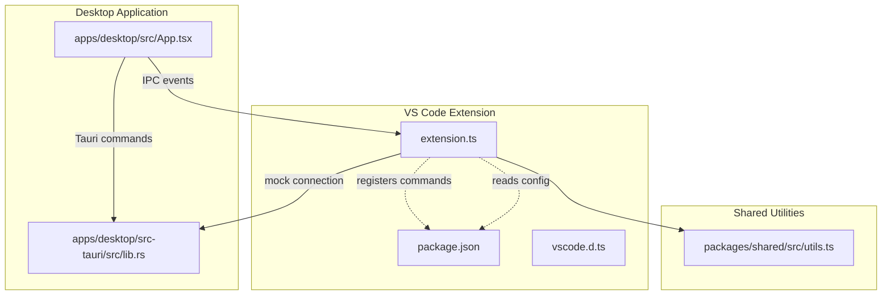
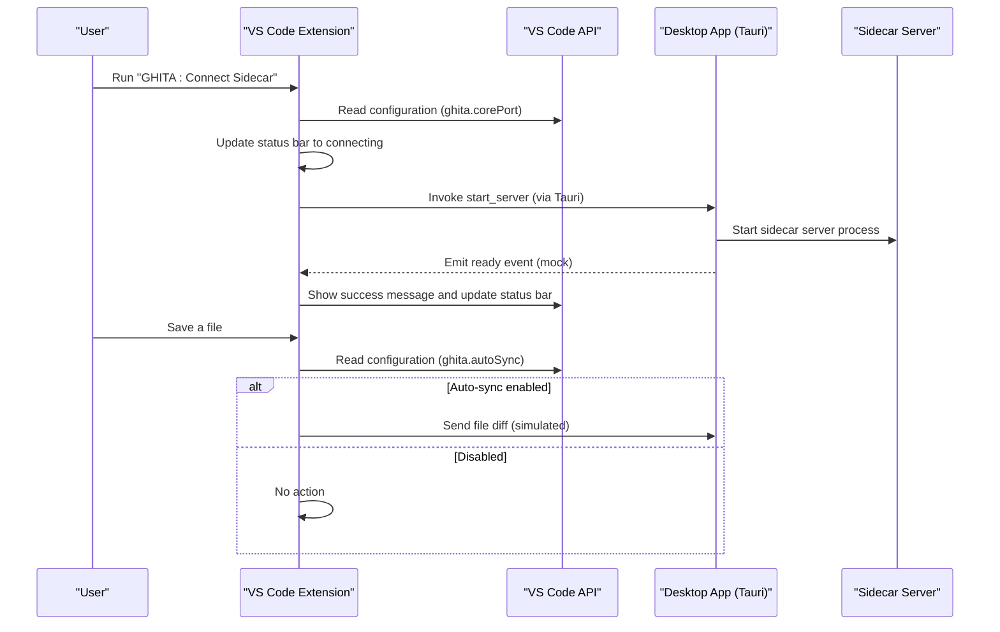
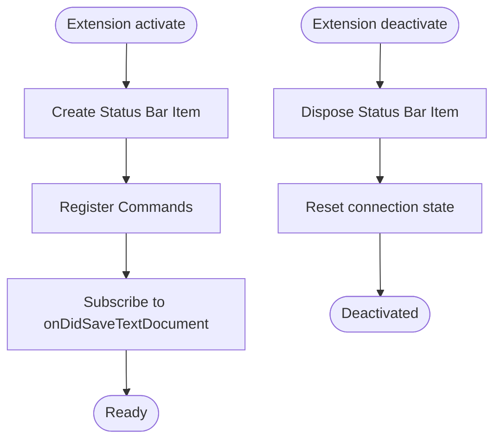
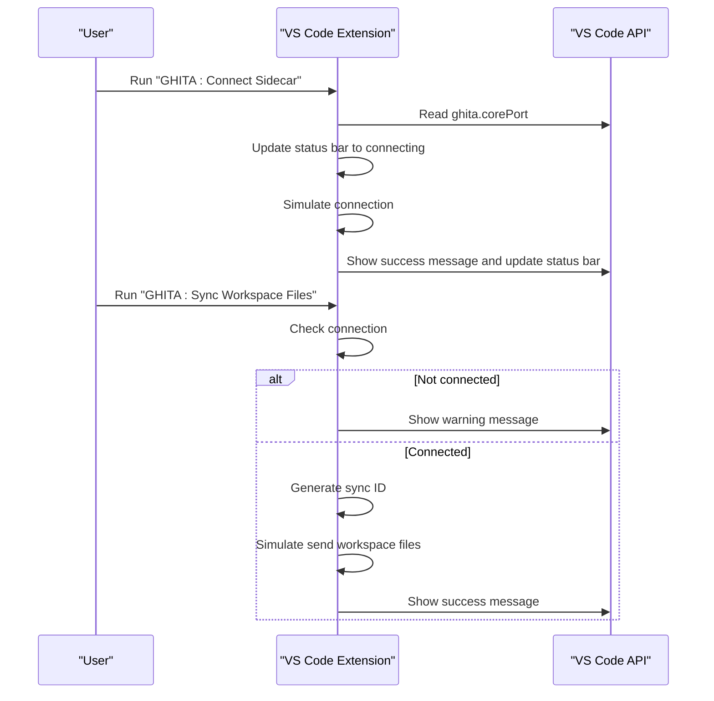
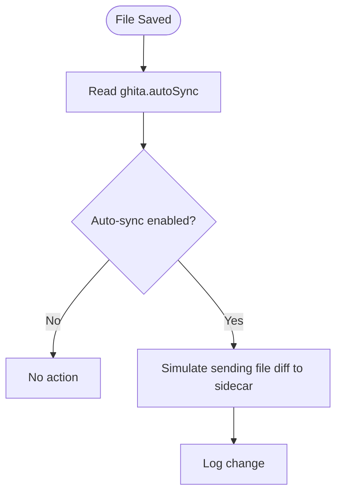
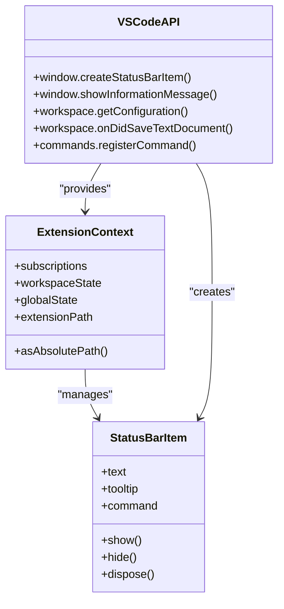
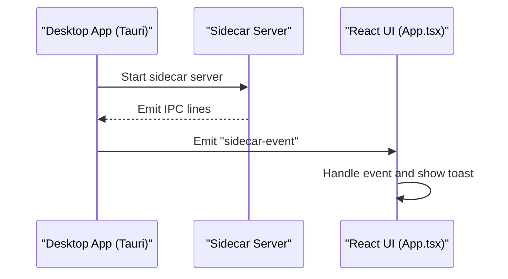
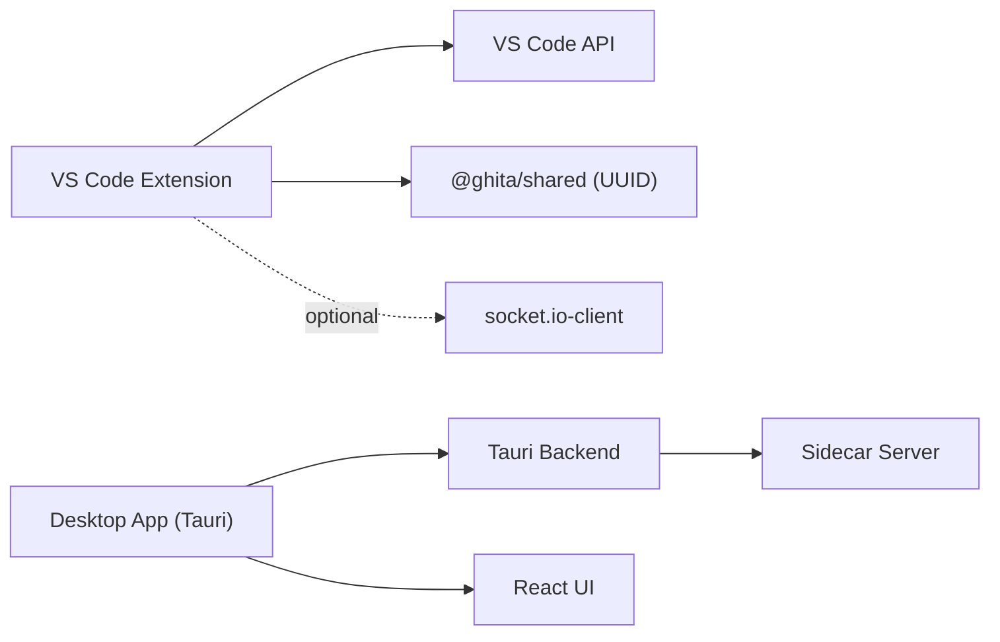

# VS Code Extension API

<cite>
**Referenced Files in This Document**
- [extension.ts](file://apps/vscode-extension/src/extension.ts)
- [package.json](file://apps/vscode-extension/package.json)
- [vscode.d.ts](file://apps/vscode-extension/src/vscode.d.ts)
- [utils.ts](file://packages/shared/src/utils.ts)
- [lib.rs](file://apps/desktop/src-tauri/src/lib.rs)
- [App.tsx](file://apps/desktop/src/App.tsx)
</cite>

## Table of Contents
1. [Introduction](#introduction)
2. [Project Structure](#project-structure)
3. [Core Components](#core-components)
4. [Architecture Overview](#architecture-overview)
5. [Detailed Component Analysis](#detailed-component-analysis)
6. [Dependency Analysis](#dependency-analysis)
7. [Performance Considerations](#performance-considerations)
8. [Troubleshooting Guide](#troubleshooting-guide)
9. [Conclusion](#conclusion)
10. [Appendices](#appendices)

## Introduction
This document provides comprehensive API documentation for the VS Code extension that integrates with the GHITA Coding Agent ecosystem. It covers the extension lifecycle (activation, commands, configuration, and deactivation), workspace integration points, UI integration via status bar, and the communication pathways to the desktop application’s sidecar server. Practical examples of commands, workspace operations, and UI integration are included, along with best practices, security considerations, performance tips, and debugging guidance.

## Project Structure
The VS Code extension is a minimal, focused integration that registers commands, exposes configuration options, and maintains a status indicator. It communicates with the desktop application’s sidecar server, which is managed by the Tauri backend.

**Diagram sources**
- [extension.ts:14-89](file://apps/vscode-extension/src/extension.ts#L14-L89)
- [package.json:13-44](file://apps/vscode-extension/package.json#L13-L44)
- [vscode.d.ts:14-96](file://apps/vscode-extension/src/vscode.d.ts#L14-L96)
- [utils.ts:76-92](file://packages/shared/src/utils.ts#L76-L92)
- [lib.rs:372-499](file://apps/desktop/src-tauri/src/lib.rs#L372-L499)
- [App.tsx:36-177](file://apps/desktop/src/App.tsx#L36-L177)

**Section sources**
- [extension.ts:14-89](file://apps/vscode-extension/src/extension.ts#L14-L89)
- [package.json:13-44](file://apps/vscode-extension/package.json#L13-L44)
- [vscode.d.ts:14-96](file://apps/vscode-extension/src/vscode.d.ts#L14-L96)

## Core Components
- Extension lifecycle: activation, command registration, configuration access, and deactivation.
- Commands: connect to sidecar and synchronize workspace files.
- Configuration: core port and auto-sync toggle.
- UI integration: status bar item with click command and informational messages.
- Workspace integration: automatic file sync on save.

Key implementation references:
- Activation and status bar creation: [extension.ts:14-24](file://apps/vscode-extension/src/extension.ts#L14-L24)
- Connect command: [extension.ts:25-48](file://apps/vscode-extension/src/extension.ts#L25-L48)
- Sync workspace command: [extension.ts:51-66](file://apps/vscode-extension/src/extension.ts#L51-L66)
- Auto-sync on save: [extension.ts:68-78](file://apps/vscode-extension/src/extension.ts#L68-L78)
- Deactivation cleanup: [extension.ts:84-90](file://apps/vscode-extension/src/extension.ts#L84-L90)
- Command contributions and configuration schema: [package.json:18-44](file://apps/vscode-extension/package.json#L18-L44)
- VS Code API typings: [vscode.d.ts:14-96](file://apps/vscode-extension/src/vscode.d.ts#L14-L96)
- UUID generation utility: [utils.ts:76-92](file://packages/shared/src/utils.ts#L76-L92)

**Section sources**
- [extension.ts:14-90](file://apps/vscode-extension/src/extension.ts#L14-L90)
- [package.json:18-44](file://apps/vscode-extension/package.json#L18-L44)
- [vscode.d.ts:14-96](file://apps/vscode-extension/src/vscode.d.ts#L14-L96)
- [utils.ts:76-92](file://packages/shared/src/utils.ts#L76-L92)

## Architecture Overview
The VS Code extension acts as a thin client that:
- Exposes commands to connect to the GHITA sidecar server and to synchronize workspace files.
- Reads user preferences (core port and auto-sync).
- Provides a status bar indicator reflecting connection state.
- Simulates communication with the sidecar server and workspace synchronization.

The desktop application manages the sidecar server via Tauri commands and emits IPC events consumed by the React UI. The VS Code extension does not directly communicate with the desktop server; it relies on the desktop app to manage the sidecar lifecycle and expose a gRPC/HTTP surface.

**Diagram sources**
- [extension.ts:25-48](file://apps/vscode-extension/src/extension.ts#L25-L48)
- [extension.ts:68-78](file://apps/vscode-extension/src/extension.ts#L68-L78)
- [lib.rs:42-153](file://apps/desktop/src-tauri/src/lib.rs#L42-L153)
- [App.tsx:71-92](file://apps/desktop/src/App.tsx#L71-L92)

## Detailed Component Analysis

### Extension Lifecycle Management
- Activation: Creates a status bar item, registers commands, and subscribes to workspace save events.
- Deactivation: Disposes the status bar item and resets connection state.

**Diagram sources**
- [extension.ts:14-24](file://apps/vscode-extension/src/extension.ts#L14-L24)
- [extension.ts:25-48](file://apps/vscode-extension/src/extension.ts#L25-L48)
- [extension.ts:51-66](file://apps/vscode-extension/src/extension.ts#L51-L66)
- [extension.ts:68-78](file://apps/vscode-extension/src/extension.ts#L68-L78)
- [extension.ts:84-90](file://apps/vscode-extension/src/extension.ts#L84-L90)

**Section sources**
- [extension.ts:14-90](file://apps/vscode-extension/src/extension.ts#L14-L90)

### Command Definitions and Workflows
- Connect Sidecar
  - Reads ghita.corePort from configuration.
  - Updates status bar to “connecting”.
  - Simulates connection establishment and updates status bar to “connected”.
  - Shows informational messages.

- Sync Workspace Files
  - Requires connection; otherwise warns the user.
  - Generates a short sync ID and simulates sending workspace files to the sidecar.
  - Confirms successful synchronization.

**Diagram sources**
- [extension.ts:25-48](file://apps/vscode-extension/src/extension.ts#L25-L48)
- [extension.ts:51-66](file://apps/vscode-extension/src/extension.ts#L51-L66)

**Section sources**
- [extension.ts:25-66](file://apps/vscode-extension/src/extension.ts#L25-L66)
- [package.json:18-28](file://apps/vscode-extension/package.json#L18-L28)

### Workspace Integration and Auto-Sync
- Subscribes to onDidSaveTextDocument.
- Respects ghita.autoSync configuration.
- Logs file changes for simulation of sending diffs to the sidecar.

**Diagram sources**
- [extension.ts:68-78](file://apps/vscode-extension/src/extension.ts#L68-L78)

**Section sources**
- [extension.ts:68-78](file://apps/vscode-extension/src/extension.ts#L68-L78)

### VS Code API Integration Patterns
- Status bar item creation and disposal.
- Command registration and invocation.
- Configuration access via workspace.getConfiguration.
- Informational dialogs for user feedback.

**Diagram sources**
- [vscode.d.ts:14-40](file://apps/vscode-extension/src/vscode.d.ts#L14-L40)
- [vscode.d.ts:66-96](file://apps/vscode-extension/src/vscode.d.ts#L66-L96)

**Section sources**
- [vscode.d.ts:14-96](file://apps/vscode-extension/src/vscode.d.ts#L14-L96)

### Extension Configuration Options and User Preferences
- ghita.corePort: integer, default 8080.
- ghita.autoSync: boolean, default true.
- Category and titles for commands are contributed under the GHITA CODING AGENT category.

**Section sources**
- [package.json:30-44](file://apps/vscode-extension/package.json#L30-L44)

### Communication Protocols with Desktop Application
- The desktop app manages the sidecar server via Tauri commands and emits IPC events.
- The VS Code extension simulates connection and synchronization; it does not directly call the sidecar.
- The desktop app listens for sidecar events and updates UI state accordingly.

**Diagram sources**
- [lib.rs:132-149](file://apps/desktop/src-tauri/src/lib.rs#L132-L149)
- [App.tsx:95-168](file://apps/desktop/src/App.tsx#L95-L168)

**Section sources**
- [lib.rs:42-153](file://apps/desktop/src-tauri/src/lib.rs#L42-L153)
- [App.tsx:95-168](file://apps/desktop/src/App.tsx#L95-L168)

## Dependency Analysis
- The extension depends on:
  - VS Code API (commands, window, workspace).
  - Shared utilities for ID generation.
  - Optional socket.io-client dependency declared in package.json.
- The desktop application manages the sidecar server lifecycle and exposes Tauri commands for control and status.

**Diagram sources**
- [extension.ts:5-6](file://apps/vscode-extension/src/extension.ts#L5-L6)
- [package.json:52-58](file://apps/vscode-extension/package.json#L52-L58)
- [lib.rs:372-407](file://apps/desktop/src-tauri/src/lib.rs#L372-L407)

**Section sources**
- [package.json:52-58](file://apps/vscode-extension/package.json#L52-L58)
- [lib.rs:372-407](file://apps/desktop/src-tauri/src/lib.rs#L372-L407)

## Performance Considerations
- Minimize synchronous work in event handlers (e.g., onDidSaveTextDocument). Offload heavy processing to background tasks or debounce frequent triggers.
- Avoid blocking UI updates; keep status bar updates and message dialogs lightweight.
- Use configuration caching to reduce repeated reads from workspace configuration.
- Prefer batching workspace synchronization operations when scaling to large projects.

## Troubleshooting Guide
- Connection appears offline:
  - Verify ghita.corePort matches the desktop sidecar server port.
  - Ensure the desktop sidecar server is running and reachable.
- Auto-sync not triggering:
  - Confirm ghita.autoSync is enabled.
  - Check that the extension is connected before expecting sync behavior.
- Status bar not updating:
  - Re-run the connect command to refresh status.
  - Inspect the developer console for errors.
- Desktop IPC events not reflected:
  - Confirm the desktop app is emitting sidecar events.
  - Check the React UI event listener setup.

**Section sources**
- [extension.ts:25-48](file://apps/vscode-extension/src/extension.ts#L25-L48)
- [extension.ts:68-78](file://apps/vscode-extension/src/extension.ts#L68-L78)
- [App.tsx:95-168](file://apps/desktop/src/App.tsx#L95-L168)

## Conclusion
The VS Code extension provides a concise integration layer for connecting to the GHITA sidecar server, synchronizing workspace files, and surfacing connection status via the status bar. Its lifecycle, commands, and configuration are straightforward, enabling predictable behavior. The desktop application manages the sidecar server and IPC events, while the extension focuses on user-facing actions and workspace integration.

## Appendices

### Best Practices
- Keep activation events minimal to reduce startup overhead.
- Use configuration defaults thoughtfully; avoid forcing users to configure unless necessary.
- Provide clear user feedback through status bar updates and informational dialogs.
- Avoid long-running operations on the UI thread; defer to background tasks.

### Security Considerations
- Validate and sanitize any user-provided configuration values before use.
- Avoid exposing sensitive operations through commands without safeguards.
- When integrating with external systems, prefer secure transport and least-privilege access.

### Debugging Techniques
- Use the VS Code Developer Tools Console to inspect logs and confirm command execution.
- Leverage onDidSaveTextDocument to verify auto-sync triggers.
- Monitor desktop sidecar logs emitted to the console for IPC diagnostics.