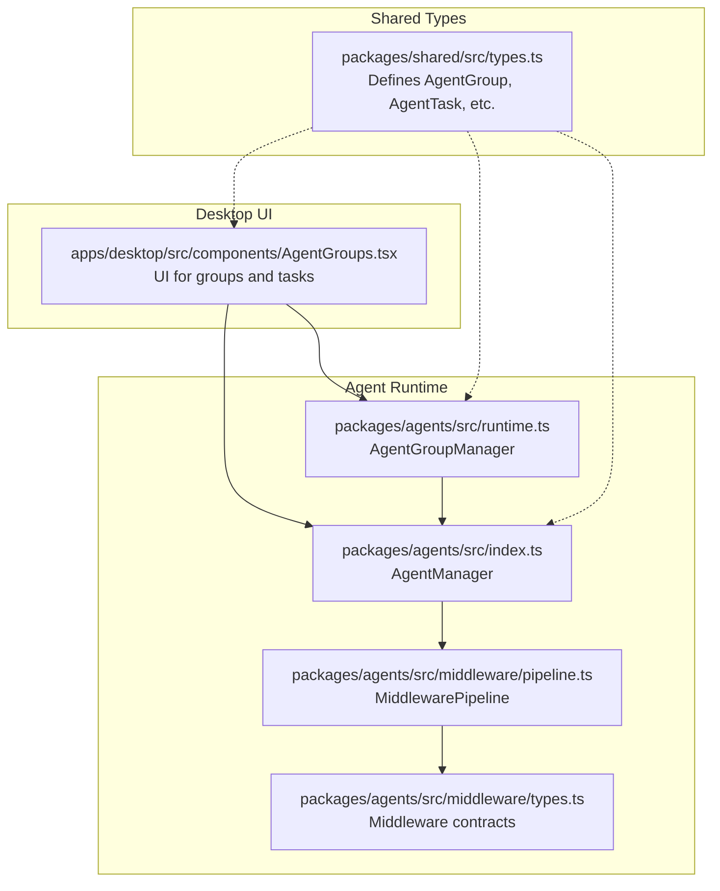
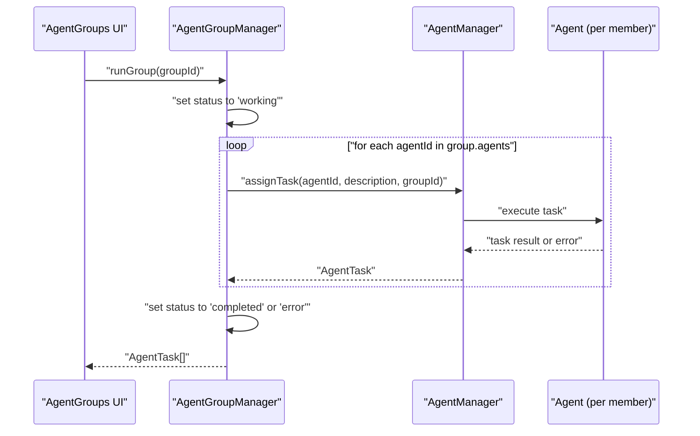
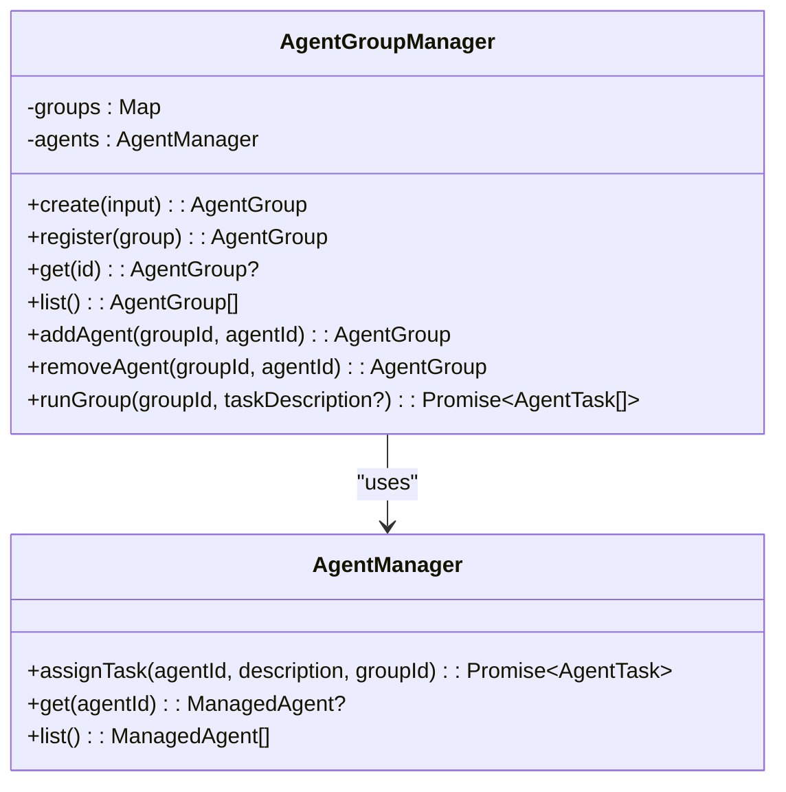
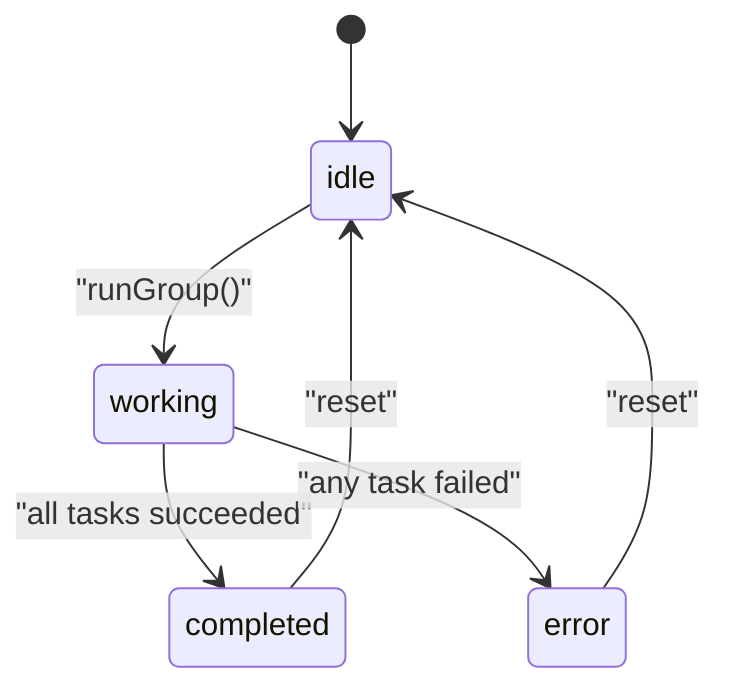
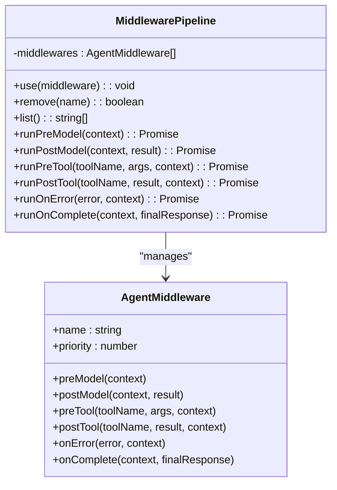
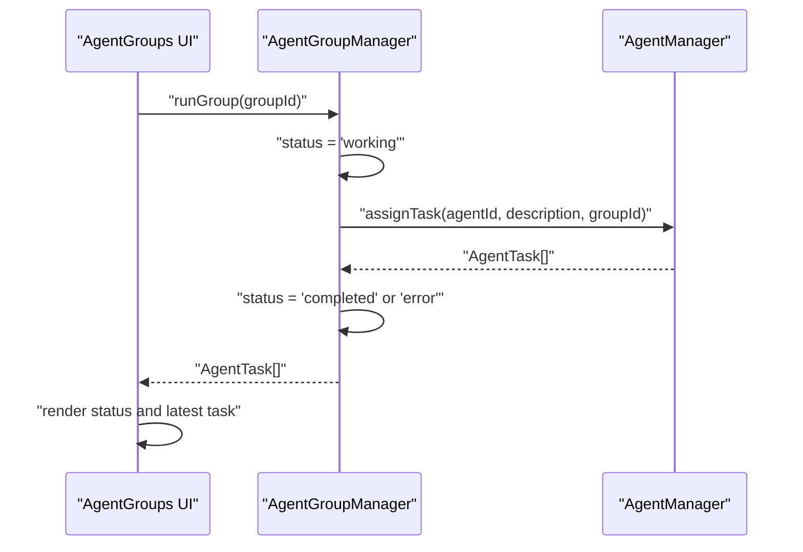
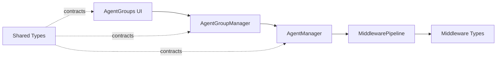

# Agent Groups and Coordination

<cite>
**Referenced Files in This Document**
- [runtime.ts](file://packages/agents/src/runtime.ts)
- [index.ts](file://packages/agents/src/index.ts)
- [types.ts](file://packages/shared/src/types.ts)
- [AgentGroups.tsx](file://apps/desktop/src/components/AgentGroups.tsx)
- [pipeline.ts](file://packages/agents/src/middleware/pipeline.ts)
- [types.ts](file://packages/agents/src/middleware/types.ts)
</cite>

## Table of Contents
1. [Introduction](#introduction)
2. [Project Structure](#project-structure)
3. [Core Components](#core-components)
4. [Architecture Overview](#architecture-overview)
5. [Detailed Component Analysis](#detailed-component-analysis)
6. [Dependency Analysis](#dependency-analysis)
7. [Performance Considerations](#performance-considerations)
8. [Troubleshooting Guide](#troubleshooting-guide)
9. [Conclusion](#conclusion)

## Introduction
This document explains the Agent Groups and Coordination system that enables collaborative workflows by organizing multiple agents with specialized roles into cohesive teams. It focuses on the AgentGroupManager class that manages group lifecycle, member management, and coordinated task execution. It also documents the middleware pipeline integration for approvals and quality gates, the group status management system, and practical examples for configuration and execution.

## Project Structure
The Agent Groups feature spans three main areas:
- Shared types define the AgentGroup contract used across packages.
- Runtime provides the AgentGroupManager and AgentManager that orchestrate groups and individual agents.
- Desktop UI integrates the runtime to visualize and operate groups.

**Diagram sources**
- [runtime.ts:194-265](file://packages/agents/src/runtime.ts#L194-L265)
- [index.ts:279-361](file://packages/agents/src/index.ts#L279-L361)
- [types.ts:100-120](file://packages/shared/src/types.ts#L100-L120)
- [AgentGroups.tsx:1-277](file://apps/desktop/src/components/AgentGroups.tsx#L1-L277)
- [pipeline.ts:1-42](file://packages/agents/src/middleware/pipeline.ts#L1-L42)
- [types.ts:73-105](file://packages/agents/src/middleware/types.ts#L73-L105)

**Section sources**
- [runtime.ts:194-265](file://packages/agents/src/runtime.ts#L194-L265)
- [index.ts:279-361](file://packages/agents/src/index.ts#L279-L361)
- [types.ts:100-120](file://packages/shared/src/types.ts#L100-L120)
- [AgentGroups.tsx:1-277](file://apps/desktop/src/components/AgentGroups.tsx#L1-L277)
- [pipeline.ts:1-42](file://packages/agents/src/middleware/pipeline.ts#L1-L42)
- [types.ts:73-105](file://packages/agents/src/middleware/types.ts#L73-L105)

## Core Components
- AgentGroup: A named team with an identifier, optional description, a list of agent identifiers, an active task reference, and a status field.
- AgentGroupManager: Manages group lifecycle, membership, and coordinated execution.
- AgentManager: Manages individual agents and their tasks; used by AgentGroupManager to assign work to group members.
- MiddlewarePipeline: Provides hooks for pre/post model calls, tool execution, errors, and completion to implement approvals and quality gates.

Key responsibilities:
- Group creation with role-aware configuration and workflow definition.
- Member management (add/remove agents) with validation.
- Coordinated task execution that assigns the same task to all group members.
- Status transitions: idle → working → completed or error.
- Middleware integration for human approvals and quality gates.

**Section sources**
- [types.ts:100-120](file://packages/shared/src/types.ts#L100-L120)
- [runtime.ts:194-265](file://packages/agents/src/runtime.ts#L194-L265)
- [index.ts:279-361](file://packages/agents/src/index.ts#L279-L361)
- [pipeline.ts:1-42](file://packages/agents/src/middleware/pipeline.ts#L1-L42)
- [types.ts:73-105](file://packages/agents/src/middleware/types.ts#L73-L105)

## Architecture Overview
The Agent Groups system coordinates multiple agents around a shared task. The UI triggers group execution, which delegates to AgentGroupManager. That manager updates the group’s status, assigns the same task to each member via AgentManager, and records outcomes.

**Diagram sources**
- [AgentGroups.tsx:185-194](file://apps/desktop/src/components/AgentGroups.tsx#L185-L194)
- [runtime.ts:245-264](file://packages/agents/src/runtime.ts#L245-L264)
- [index.ts:279-300](file://packages/agents/src/index.ts#L279-L300)

## Detailed Component Analysis

### AgentGroupManager
Responsibilities:
- Create groups with generated identifiers, name, description, initial agents, and optional task.
- Register existing groups.
- Retrieve, list, and sort groups.
- Add/remove agents with validation.
- Execute a group by assigning the same task to all members and updating group status based on outcomes.

**Diagram sources**
- [runtime.ts:194-265](file://packages/agents/src/runtime.ts#L194-L265)
- [index.ts:279-300](file://packages/agents/src/index.ts#L279-L300)

**Section sources**
- [runtime.ts:194-265](file://packages/agents/src/runtime.ts#L194-L265)
- [index.ts:279-361](file://packages/agents/src/index.ts#L279-L361)

### AgentGroup and Task Lifecycle
AgentGroup fields:
- id: Unique group identifier.
- name: Human-readable group name.
- description: Optional description.
- agents: Array of agent identifiers.
- task: Active task reference.
- status: idle | working | completed | error.

AgentTask fields (from AgentManager):
- id, agentId, groupId, status, startTime, endTime, result, error.

Status transitions:
- idle → working when runGroup starts.
- working → completed if all tasks succeed.
- working → error if any task fails.

**Diagram sources**
- [runtime.ts:245-264](file://packages/agents/src/runtime.ts#L245-L264)
- [index.ts:279-300](file://packages/agents/src/index.ts#L279-L300)

**Section sources**
- [types.ts:100-120](file://packages/shared/src/types.ts#L100-L120)
- [runtime.ts:245-264](file://packages/agents/src/runtime.ts#L245-L264)
- [index.ts:279-300](file://packages/agents/src/index.ts#L279-L300)

### Middleware Pipeline Integration
The middleware pipeline enables:
- Pre-model transformations and early exits.
- Post-model response adjustments and retries.
- Tool pre/post hooks for approvals and safety.
- Error handling and completion callbacks.

Human approval request/response types enable quality gates and human oversight.

**Diagram sources**
- [pipeline.ts:1-42](file://packages/agents/src/middleware/pipeline.ts#L1-L42)
- [types.ts:73-105](file://packages/agents/src/middleware/types.ts#L73-L105)

**Section sources**
- [pipeline.ts:1-42](file://packages/agents/src/middleware/pipeline.ts#L1-L42)
- [types.ts:48-105](file://packages/agents/src/middleware/types.ts#L48-L105)

### UI Integration and Execution Flow
The desktop UI component:
- Initializes runtime managers.
- Lists agents and groups.
- Triggers group execution and displays latest task outcomes.
- Reflects group status visually.

**Diagram sources**
- [AgentGroups.tsx:172-194](file://apps/desktop/src/components/AgentGroups.tsx#L172-L194)
- [runtime.ts:245-264](file://packages/agents/src/runtime.ts#L245-L264)
- [index.ts:279-300](file://packages/agents/src/index.ts#L279-L300)

**Section sources**
- [AgentGroups.tsx:1-277](file://apps/desktop/src/components/AgentGroups.tsx#L1-L277)
- [runtime.ts:245-264](file://packages/agents/src/runtime.ts#L245-L264)
- [index.ts:279-300](file://packages/agents/src/index.ts#L279-L300)

## Dependency Analysis
- AgentGroupManager depends on AgentManager to assign tasks to group members.
- AgentManager encapsulates task execution and maintains per-agent state and memory.
- MiddlewarePipeline is integrated into AgentManager to enforce approvals and quality gates.
- Shared types define contracts used across UI, runtime, and middleware.

**Diagram sources**
- [AgentGroups.tsx:1-277](file://apps/desktop/src/components/AgentGroups.tsx#L1-L277)
- [runtime.ts:194-265](file://packages/agents/src/runtime.ts#L194-L265)
- [index.ts:279-300](file://packages/agents/src/index.ts#L279-L300)
- [pipeline.ts:1-42](file://packages/agents/src/middleware/pipeline.ts#L1-L42)
- [types.ts:73-105](file://packages/agents/src/middleware/types.ts#L73-L105)
- [types.ts:100-120](file://packages/shared/src/types.ts#L100-L120)

**Section sources**
- [runtime.ts:194-265](file://packages/agents/src/runtime.ts#L194-L265)
- [index.ts:279-300](file://packages/agents/src/index.ts#L279-L300)
- [pipeline.ts:1-42](file://packages/agents/src/middleware/pipeline.ts#L1-L42)
- [types.ts:73-105](file://packages/agents/src/middleware/types.ts#L73-L105)
- [types.ts:100-120](file://packages/shared/src/types.ts#L100-L120)
- [AgentGroups.tsx:1-277](file://apps/desktop/src/components/AgentGroups.tsx#L1-L277)

## Performance Considerations
- Parallelism: The current runGroup assigns the same task to each agent sequentially. To scale, consider parallel task assignment with controlled concurrency and per-agent resource limits.
- Memory: Use AgentManager’s memory to record context and outcomes; avoid storing large intermediate artifacts in group state.
- Middleware overhead: Keep middleware lightweight; offload heavy checks to asynchronous queues if needed.
- Monitoring: Track group status transitions and per-agent task durations to detect bottlenecks.

[No sources needed since this section provides general guidance]

## Troubleshooting Guide
Common issues and resolutions:
- Group not found: Ensure the group exists before invoking runGroup.
- Agent not found: Verify agent identifiers are valid and registered.
- Task failures: Inspect AgentTask error fields and group status transitions.
- Approval gating: Confirm middleware preTool hooks are configured to require approvals.

**Section sources**
- [runtime.ts:225-243](file://packages/agents/src/runtime.ts#L225-L243)
- [index.ts:289-299](file://packages/agents/src/index.ts#L289-L299)

## Conclusion
The Agent Groups and Coordination system provides a structured way to organize agents into teams, coordinate their actions around shared tasks, and integrate governance via middleware. By leveraging AgentGroupManager for lifecycle and execution, AgentManager for individual agent orchestration, and MiddlewarePipeline for approvals and quality gates, teams can implement robust, auditable, and scalable multi-agent workflows.