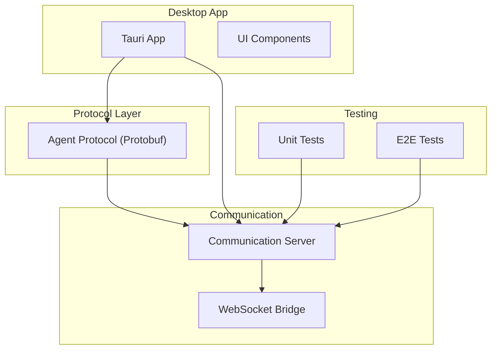
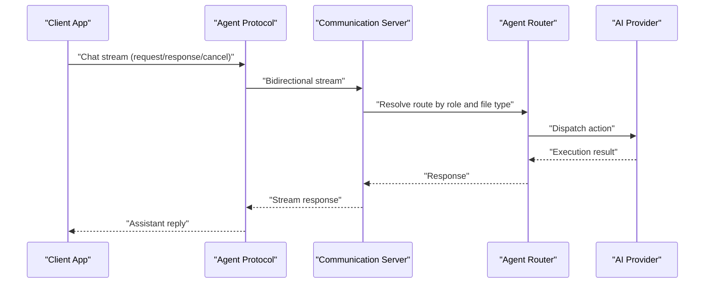
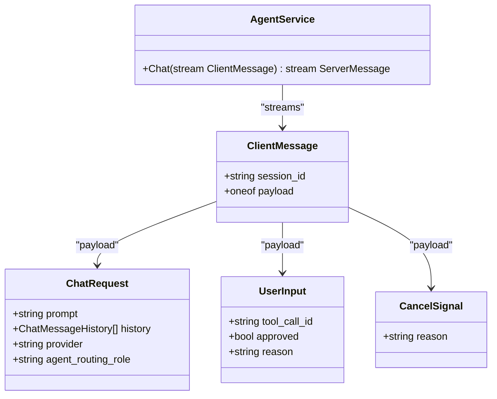
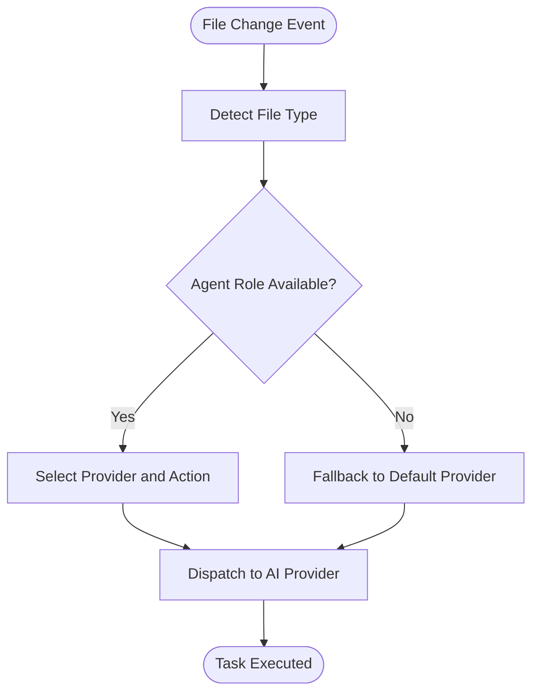
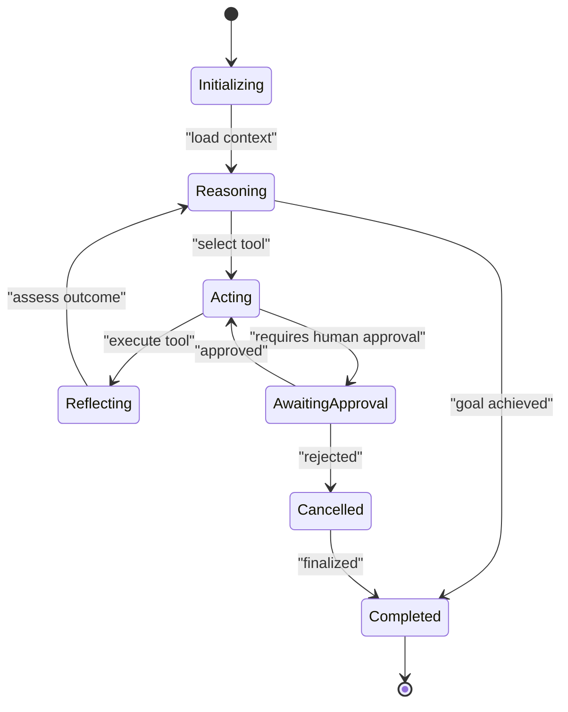
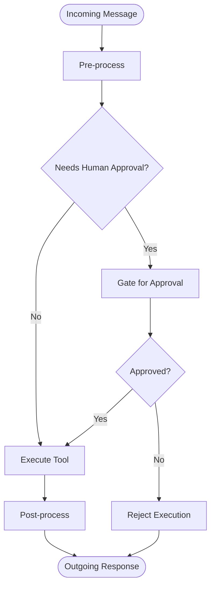
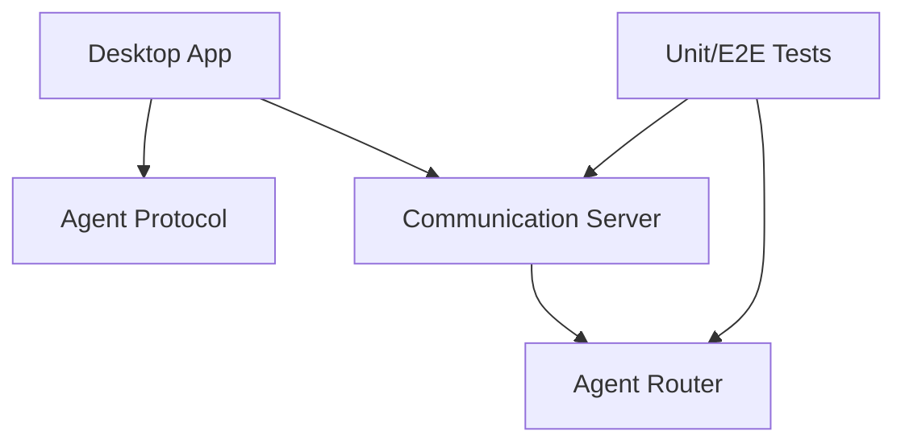

# Agent Protocol and Architecture

<cite>
**Referenced Files in This Document**
- [PROTOCOL.md](file://group/PROTOCOL.md)
- [agent.proto](file://packages/ai-engine/src/proto/agent.proto)
- [communicationServer.test.ts](file://tests/unit/communicationServer.test.ts)
- [e2e-integration.test.ts](file://tests/e2e/e2e-integration.test.ts)
- [agent.proto](file://apps/desktop/src-tauri/proto/agent.proto)
</cite>

## Table of Contents
1. [Introduction](#introduction)
2. [Project Structure](#project-structure)
3. [Core Components](#core-components)
4. [Architecture Overview](#architecture-overview)
5. [Detailed Component Analysis](#detailed-component-analysis)
6. [Dependency Analysis](#dependency-analysis)
7. [Performance Considerations](#performance-considerations)
8. [Troubleshooting Guide](#troubleshooting-guide)
9. [Conclusion](#conclusion)
10. [Appendices](#appendices)

## Introduction
This document explains the Agent Protocol and Architecture system implemented in the repository. It covers:
- The Agent Protocol (AP) specification that defines standardized communication patterns between agents and the central coordination system
- The router system that routes agent tasks based on complexity levels and domain expertise
- The ReAct (Reasoning and Acting) agent architecture, including lifecycle, step-by-step reasoning, and tool utilization patterns
- The middleware pipeline enabling customization via pre-processing, post-processing, and human approval workflows
- The agent adapter system providing compatibility layers for different AI providers and frameworks
- The agent runtime context including memory injection, skill registry integration, and task execution environments
- Practical examples of AP messages, router configurations, and ReAct agent implementations
- Agent state management, error handling, and performance optimization strategies

## Project Structure
The repository organizes agent-related functionality across multiple packages and applications:
- Protocol definition: Protobuf service and messages define the Agent Protocol for real-time bidirectional chat
- Centralized communication: Socket-based server for coordinating agent interactions
- Desktop application: Tauri-based desktop app integrating the agent protocol and related services
- Tests: Unit and end-to-end tests validating communication flows and router behavior

**Section sources**
- [agent.proto:1-39](file://packages/ai-engine/src/proto/agent.proto#L1-L39)
- [communicationServer.test.ts:1-37](file://tests/unit/communicationServer.test.ts#L1-L37)
- [e2e-integration.test.ts:44-98](file://tests/e2e/e2e-integration.test.ts#L44-L98)

## Core Components
- Agent Protocol (AP): Defines a bidirectional streaming RPC for chat, including request payloads, user approvals, and cancellation signals
- Router: Resolves file change events to provider actions, routing tasks by agent role and file type
- Middleware Pipeline: Enables pre-processing, post-processing, and human-in-the-loop approvals
- Agent Adapter: Provides compatibility layers for different AI providers and frameworks
- Runtime Context: Integrates memory, skills, and execution environments for agents

**Section sources**
- [agent.proto:1-39](file://packages/ai-engine/src/proto/agent.proto#L1-L39)
- [e2e-integration.test.ts:94-98](file://tests/e2e/e2e-integration.test.ts#L94-L98)

## Architecture Overview
The system centers on a real-time bidirectional chat protocol and a centralized communication server. The desktop application integrates the protocol and server to orchestrate agent interactions.

**Diagram sources**
- [agent.proto:5-8](file://packages/ai-engine/src/proto/agent.proto#L5-L8)
- [communicationServer.test.ts:1-37](file://tests/unit/communicationServer.test.ts#L1-L37)
- [e2e-integration.test.ts:94-98](file://tests/e2e/e2e-integration.test.ts#L94-L98)

## Detailed Component Analysis

### Agent Protocol (AP) Specification
The AP defines a streaming RPC service for real-time chat between clients and the server. The protocol supports:
- Chat requests with session identifiers, message history, provider selection, and agent routing roles
- User approvals for tool calls with optional reasons
- Cancellation signals for long-running operations

Key elements:
- Service: Bidirectional streaming RPC for chat
- ClientMessage payload variants: ChatRequest, UserInput (approval), CancelSignal
- ChatRequest includes prompt, history, provider hint, and agent routing role
- UserInput carries tool call ID, approval decision, and reason
- CancelSignal carries a reason for cancellation

**Diagram sources**
- [agent.proto:5-39](file://packages/ai-engine/src/proto/agent.proto#L5-L39)

**Section sources**
- [agent.proto:1-39](file://packages/ai-engine/src/proto/agent.proto#L1-L39)

### Router System
The router resolves file change events to provider actions, selecting the appropriate agent role and action based on file type. The router interface exposes:
- provider: Target AI provider
- action: Operation to perform (e.g., analyze, refactor)
- fileType: Type of file being processed

**Diagram sources**
- [e2e-integration.test.ts:94-98](file://tests/e2e/e2e-integration.test.ts#L94-L98)

**Section sources**
- [e2e-integration.test.ts:94-98](file://tests/e2e/e2e-integration.test.ts#L94-L98)

### ReAct Agent Architecture
The ReAct agent follows a structured lifecycle:
- Initialization: Load memory, skills, and environment
- Reasoning: Evaluate current state, goals, and available tools
- Acting: Execute tools and update state
- Reflection: Assess outcomes and refine strategy
- Termination: Return final result or request human input

Middleware pipeline integration:
- Pre-processing: Normalize inputs, inject context, validate permissions
- Human Approval: Request explicit approval for tool calls
- Post-processing: Log outcomes, update memory, handle errors

[No sources needed since this diagram shows conceptual workflow, not actual code structure]

### Middleware Pipeline
The middleware pipeline enables customization through:
- Pre-processing: Transform prompts, inject memory, enforce policies
- Human Approval: Gate tool execution with explicit user consent
- Post-processing: Record logs, update state, handle exceptions

[No sources needed since this diagram shows conceptual workflow, not actual code structure]

### Agent Adapter System
The adapter system provides compatibility layers for different AI providers and frameworks. It translates AP requests into provider-specific calls and normalizes responses. This enables pluggable integrations without changing the core protocol.

[No sources needed since this section provides general guidance]

### Agent Runtime Context
Runtime context includes:
- Memory Injection: Inject relevant memories and context into prompts
- Skill Registry Integration: Resolve and execute skills by name
- Task Execution Environments: Configure provider-specific environments and credentials

[No sources needed since this section provides general guidance]

### Practical Examples
- Agent Protocol Messages:
  - ChatRequest: Includes prompt, message history, provider hint, and agent routing role
  - UserInput: Carries tool call ID, approval decision, and reason
  - CancelSignal: Carries a reason for cancellation
- Router Configurations:
  - Map file types to agent roles and provider actions
  - Fallback to default provider when specialized routing is unavailable
- ReAct Agent Implementations:
  - Initialize with memory and skills
  - Iterate reasoning and acting steps until goal completion or human intervention

**Section sources**
- [agent.proto:19-39](file://packages/ai-engine/src/proto/agent.proto#L19-L39)
- [e2e-integration.test.ts:94-98](file://tests/e2e/e2e-integration.test.ts#L94-L98)

## Dependency Analysis
The desktop application depends on the Agent Protocol and Communication Server for coordinated agent interactions. Tests validate the server’s behavior and router resolution logic.

**Diagram sources**
- [communicationServer.test.ts:1-37](file://tests/unit/communicationServer.test.ts#L1-L37)
- [e2e-integration.test.ts:94-98](file://tests/e2e/e2e-integration.test.ts#L94-L98)

**Section sources**
- [communicationServer.test.ts:1-37](file://tests/unit/communicationServer.test.ts#L1-L37)
- [e2e-integration.test.ts:94-98](file://tests/e2e/e2e-integration.test.ts#L94-L98)

## Performance Considerations
- Minimize message sizes: Compress histories and avoid redundant metadata
- Batch updates: Combine multiple small operations into single streams
- Caching: Cache frequent tool results and memory segments
- Backpressure: Apply flow control to prevent overload during high concurrency
- Asynchronous processing: Offload heavy computations to background workers

[No sources needed since this section provides general guidance]

## Troubleshooting Guide
Common issues and resolutions:
- Connection failures: Verify WebSocket connectivity and server availability
- Routing errors: Confirm file type mappings and fallback provider configuration
- Approval timeouts: Implement timeout handling and retry mechanisms for gated actions
- Memory leaks: Ensure proper cleanup of contexts and tool resources
- Protocol mismatches: Validate message schemas and payload variants

**Section sources**
- [communicationServer.test.ts:24-37](file://tests/unit/communicationServer.test.ts#L24-L37)
- [e2e-integration.test.ts:44-98](file://tests/e2e/e2e-integration.test.ts#L44-L98)

## Conclusion
The Agent Protocol and Architecture system provides a standardized, extensible framework for building intelligent agents. By combining a robust protocol, a flexible router, a configurable middleware pipeline, and a reusable adapter system, the platform supports diverse AI providers and complex workflows while maintaining clear state management and strong error handling.

[No sources needed since this section summarizes without analyzing specific files]

## Appendices
- Additional Protocol Details: See the Agent Protocol definition for complete message schemas and service declarations
- Desktop Integration: The Tauri app integrates the protocol and server for end-user interaction

**Section sources**
- [agent.proto](file://apps/desktop/src-tauri/proto/agent.proto)
- [PROTOCOL.md:1-96](file://group/PROTOCOL.md#L1-L96)