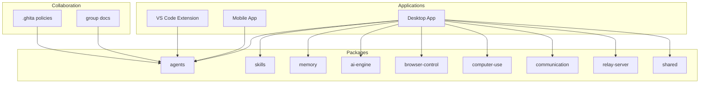
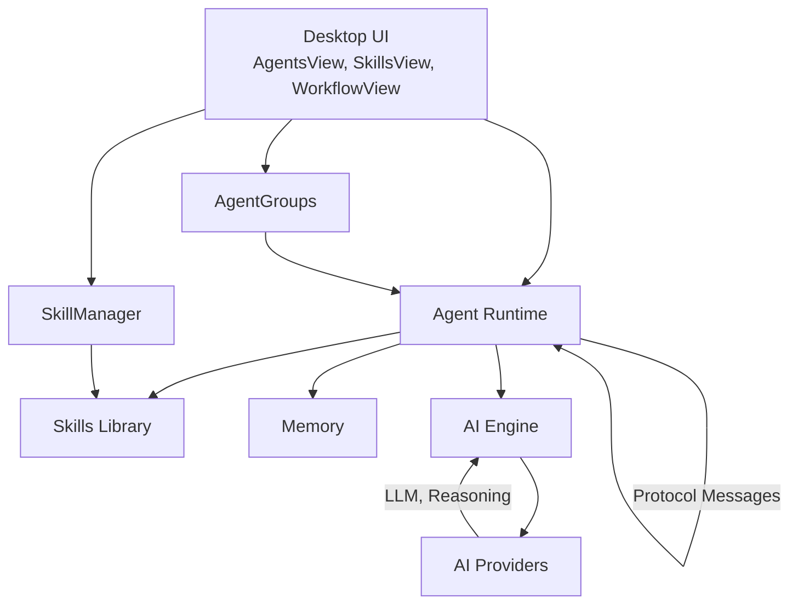
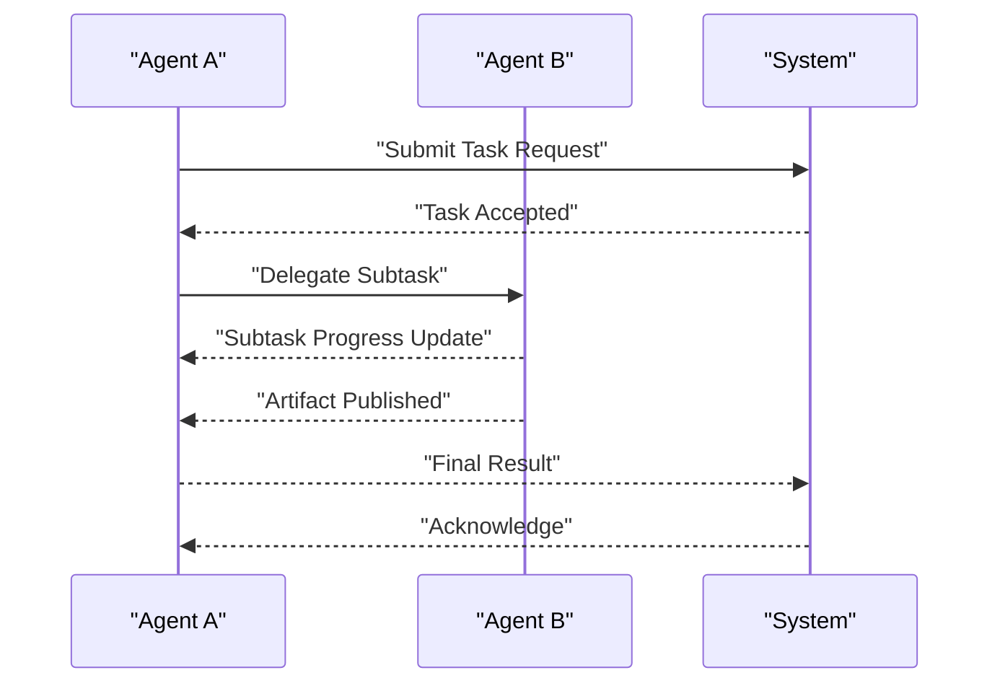
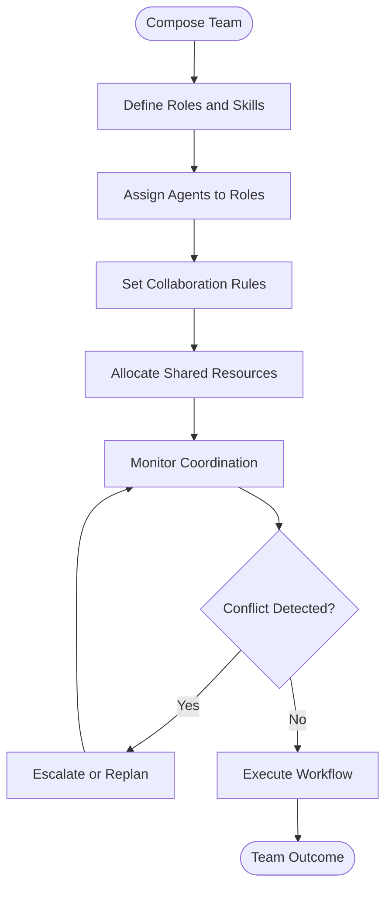
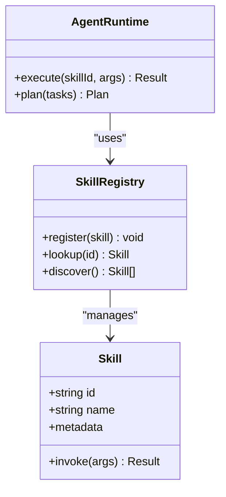
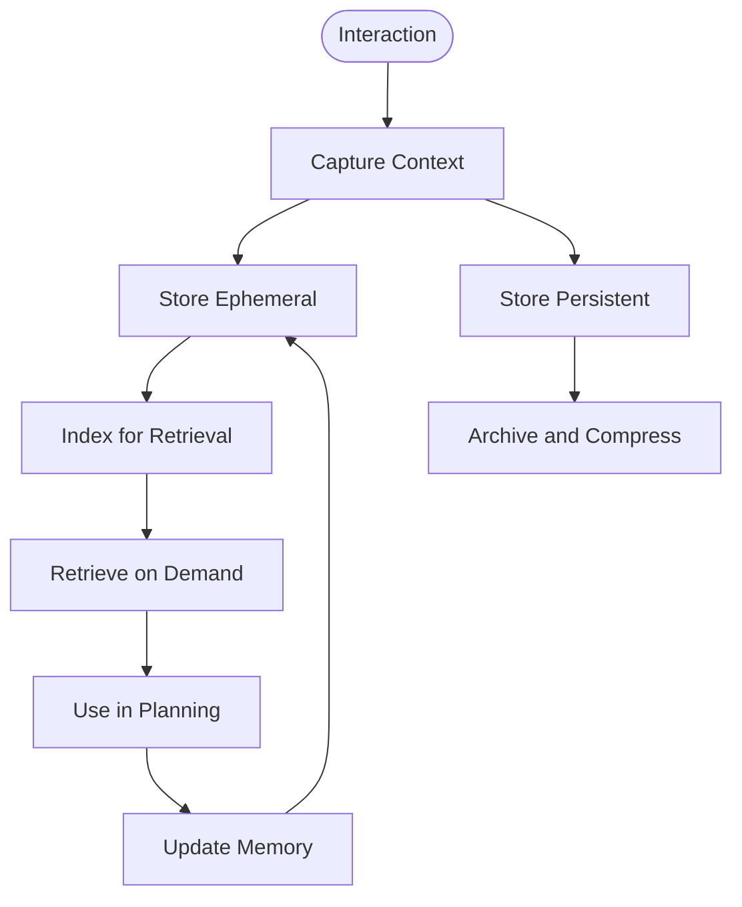
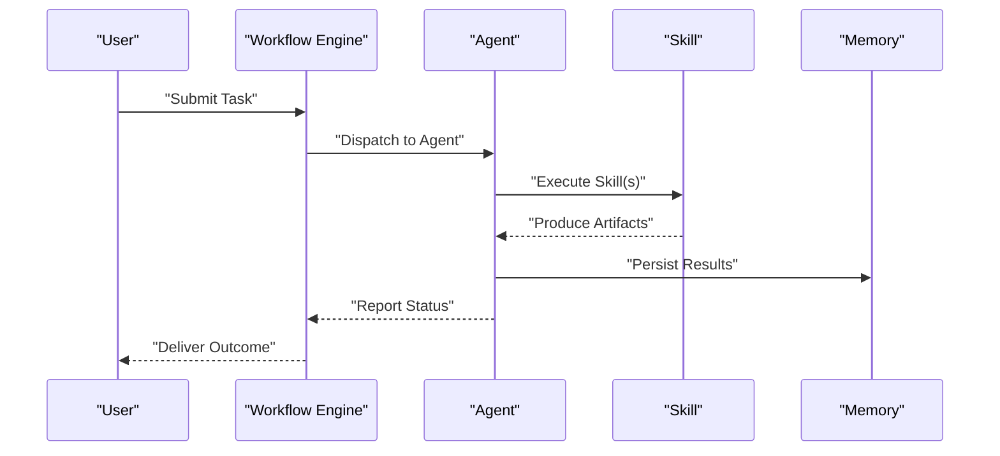
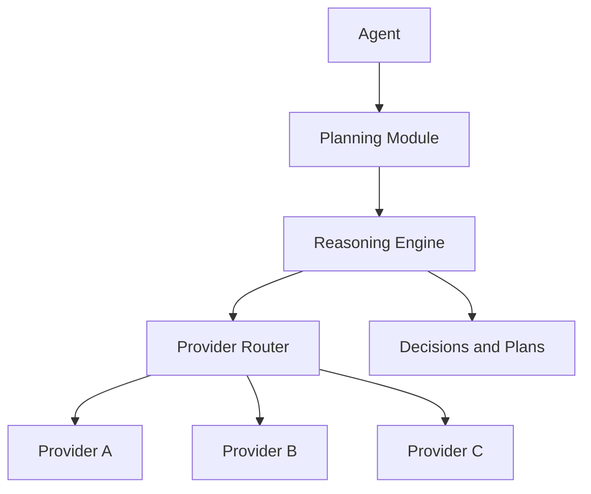
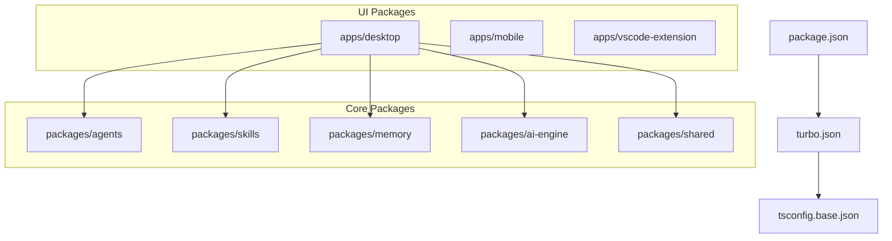

# Agent System and Automation

<cite>
**Referenced Files in This Document**
- [agent.proto](file://apps/desktop/src-tauri/proto/agent.proto)
- [AgentGroups.tsx](file://apps/desktop/src/components/AgentGroups.tsx)
- [SkillManager.tsx](file://apps/desktop/src/components/SkillManager.tsx)
- [AgentsView.tsx](file://apps/desktop/src/views/AgentsView.tsx)
- [SkillsView.tsx](file://apps/desktop/src/views/SkillsView.tsx)
- [WorkflowView.tsx](file://apps/desktop/src/views/WorkflowView.tsx)
- [appStore.ts](file://apps/desktop/src/stores/appStore.ts)
- [shell.ts](file://apps/desktop/src/utils/shell.ts)
- [chatSessionStorage.ts](file://apps/desktop/src/utils/chatSessionStorage.ts)
- [ApiManager.tsx](file://apps/desktop/src/components/ApiManager.tsx)
- [Terminal.tsx](file://apps/desktop/src/components/Terminal.tsx)
- [README.md](file://group/README.md)
- [PROTOCOL.md](file://group/PROTOCOL.md)
- [tasks.md](file://group/tasks.md)
- [decisions.md](file://group/decisions.md)
- [brainstorm.md](file://group/brainstorm.md)
- [discussion.md](file://group/discussion.md)
- [create-chat.sh](file://group/create-chat.sh)
- [join-chat.sh](file://group/join-chat.sh)
- [budget.yaml](file://.ghita/budget.yaml)
- [rules.yaml](file://.ghita/rules.yaml)
- [security-blacklist.yaml](file://.ghita/security-blacklist.yaml)
- [package.json](file://package.json)
- [turbo.json](file://turbo.json)
- [tsconfig.base.json](file://tsconfig.base.json)
</cite>

## Table of Contents
1. [Introduction](#introduction)
2. [Project Structure](#project-structure)
3. [Core Components](#core-components)
4. [Architecture Overview](#architecture-overview)
5. [Detailed Component Analysis](#detailed-component-analysis)
6. [Dependency Analysis](#dependency-analysis)
7. [Performance Considerations](#performance-considerations)
8. [Troubleshooting Guide](#troubleshooting-guide)
9. [Conclusion](#conclusion)
10. [Appendices](#appendices)

## Introduction
This document explains the Agent System and Automation capabilities implemented across the monorepo. It covers the agent protocol enabling autonomous task execution, agent groups for coordinated multi-domain workflows, the skills system for modular capabilities, the memory system for context retention, and the task management pipeline for artifacts and results. It also documents integration with AI providers, practical automation scenarios, coordination and conflict resolution strategies, and performance optimization for multi-agent systems.

## Project Structure
The repository is a monorepo organized around packages and applications:
- apps: Desktop, Mobile, and VS Code Extension frontends
- packages: Core libraries for agents, skills, memory, AI engine, browser control, computer use, communication, relay server, and shared utilities
- group: Collaborative working documents and protocols for agent teams
- .ghita: Governance and policy files for the ecosystem

**Section sources**
- [package.json:1-200](file://package.json#L1-L200)
- [turbo.json:1-200](file://turbo.json#L1-L200)
- [tsconfig.base.json:1-200](file://tsconfig.base.json#L1-L200)

## Core Components
- Agent Protocol: Defines message types and service contracts for agent communication and orchestration.
- Agent Groups: UI and logic for assembling teams of agents with roles and collaboration patterns.
- Skills System: Modular capabilities registered and executed by agents, with UI for management and discovery.
- Memory System: Persistent and ephemeral context storage enabling learning and continuity across interactions.
- Task Management: Workflows that orchestrate skills, artifacts, and results tracking.
- AI Engine Integration: Provider abstraction enabling reasoning and decision-making via external AI services.

**Section sources**
- [agent.proto:1-200](file://apps/desktop/src-tauri/proto/agent.proto#L1-L200)
- [AgentGroups.tsx:1-200](file://apps/desktop/src/components/AgentGroups.tsx#L1-L200)
- [SkillManager.tsx:1-200](file://apps/desktop/src/components/SkillManager.tsx#L1-L200)
- [AgentsView.tsx:1-200](file://apps/desktop/src/views/AgentsView.tsx#L1-L200)
- [SkillsView.tsx:1-200](file://apps/desktop/src/views/SkillsView.tsx#L1-L200)
- [WorkflowView.tsx:1-200](file://apps/desktop/src/views/WorkflowView.tsx#L1-L200)

## Architecture Overview
The system centers on a protocol-driven agent runtime, with UI surfaces for configuration and monitoring, and a skills library enabling modular behavior. Agents coordinate via messages defined in the protocol, while skills encapsulate reusable actions. Memory persists context across sessions, and the AI engine provides reasoning and planning.

**Diagram sources**
- [agent.proto:1-200](file://apps/desktop/src-tauri/proto/agent.proto#L1-L200)
- [AgentsView.tsx:1-200](file://apps/desktop/src/views/AgentsView.tsx#L1-L200)
- [SkillsView.tsx:1-200](file://apps/desktop/src/views/SkillsView.tsx#L1-L200)
- [WorkflowView.tsx:1-200](file://apps/desktop/src/views/WorkflowView.tsx#L1-L200)
- [SkillManager.tsx:1-200](file://apps/desktop/src/components/SkillManager.tsx#L1-L200)
- [AgentGroups.tsx:1-200](file://apps/desktop/src/components/AgentGroups.tsx#L1-L200)

## Detailed Component Analysis

### Agent Protocol Specification
The agent protocol defines the canonical message types and service boundaries for agent-to-agent and agent-to-system communication. It standardizes:
- Message envelopes for requests, responses, and events
- Task scheduling and progress reporting
- Artifact publication and retrieval
- Error propagation and recovery signals

**Diagram sources**
- [agent.proto:1-200](file://apps/desktop/src-tauri/proto/agent.proto#L1-L200)

**Section sources**
- [agent.proto:1-200](file://apps/desktop/src-tauri/proto/agent.proto#L1-L200)

### Agent Groups System
Agent Groups enable forming specialized teams of agents to collaborate on complex projects. The UI supports:
- Team composition and role assignment
- Communication channels and routing
- Resource allocation and capacity planning
- Conflict detection and resolution strategies

**Diagram sources**
- [AgentGroups.tsx:1-200](file://apps/desktop/src/components/AgentGroups.tsx#L1-L200)

**Section sources**
- [AgentGroups.tsx:1-200](file://apps/desktop/src/components/AgentGroups.tsx#L1-L200)
- [AgentsView.tsx:1-200](file://apps/desktop/src/views/AgentsView.tsx#L1-L200)

### Skills System Architecture
Skills are modular capabilities that agents can discover, register, and execute. The system supports:
- Skill definition and metadata
- Registration and discovery mechanisms
- Execution patterns and error handling
- Custom skill development and testing

**Diagram sources**
- [SkillsView.tsx:1-200](file://apps/desktop/src/views/SkillsView.tsx#L1-L200)
- [SkillManager.tsx:1-200](file://apps/desktop/src/components/SkillManager.tsx#L1-L200)

**Section sources**
- [SkillsView.tsx:1-200](file://apps/desktop/src/views/SkillsView.tsx#L1-L200)
- [SkillManager.tsx:1-200](file://apps/desktop/src/components/SkillManager.tsx#L1-L200)

### Memory System Implementation
AgentMemory enables context retention and learning across interactions. It integrates:
- Session-scoped ephemeral memory
- Persistent storage for long-term context
- Indexing and retrieval for fast recall
- Privacy controls and lifecycle management

**Diagram sources**
- [chatSessionStorage.ts:1-200](file://apps/desktop/src/utils/chatSessionStorage.ts#L1-L200)

**Section sources**
- [chatSessionStorage.ts:1-200](file://apps/desktop/src/utils/chatSessionStorage.ts#L1-L200)

### Task Management System
Task management coordinates agent workflows, artifact creation, and result tracking:
- Workflow orchestration and dependency resolution
- Artifact generation and cataloging
- Result validation and feedback loops
- Progress monitoring and alerting

**Diagram sources**
- [WorkflowView.tsx:1-200](file://apps/desktop/src/views/WorkflowView.tsx#L1-L200)
- [appStore.ts:1-200](file://apps/desktop/src/stores/appStore.ts#L1-L200)

**Section sources**
- [WorkflowView.tsx:1-200](file://apps/desktop/src/views/WorkflowView.tsx#L1-L200)
- [appStore.ts:1-200](file://apps/desktop/src/stores/appStore.ts#L1-L200)

### AI Engine Integration
The AI engine provides reasoning and decision-making capabilities:
- Provider abstraction for multiple AI backends
- Prompt engineering and chain-of-thought orchestration
- Cost and latency optimization
- Safety and governance enforcement

**Diagram sources**
- [agent.proto:1-200](file://apps/desktop/src-tauri/proto/agent.proto#L1-L200)

**Section sources**
- [agent.proto:1-200](file://apps/desktop/src-tauri/proto/agent.proto#L1-L200)

### Practical Examples and Automation Scenarios
- Multi-agent research team: Researchers, reviewers, and editors collaborate via Agent Groups to produce reports.
- Automated code review: A skill set combines static analysis, security scanning, and style checks under memory-informed planning.
- Workflow automation: Users define repeatable tasks that agents execute with artifact logging and result notifications.

**Section sources**
- [PROTOCOL.md:1-200](file://group/PROTOCOL.md#L1-L200)
- [tasks.md:1-200](file://group/tasks.md#L1-L200)
- [brainstorm.md:1-200](file://group/brainstorm.md#L1-L200)
- [discussion.md:1-200](file://group/discussion.md#L1-L200)

## Dependency Analysis
The monorepo uses a workspace configuration with shared TypeScript settings and a task runner for building and testing across packages. Dependencies are managed per package with cross-links between UI, agents, skills, memory, and AI engine.

**Diagram sources**
- [package.json:1-200](file://package.json#L1-L200)
- [turbo.json:1-200](file://turbo.json#L1-L200)
- [tsconfig.base.json:1-200](file://tsconfig.base.json#L1-L200)

**Section sources**
- [package.json:1-200](file://package.json#L1-L200)
- [turbo.json:1-200](file://turbo.json#L1-L200)
- [tsconfig.base.json:1-200](file://tsconfig.base.json#L1-L200)

## Performance Considerations
- Concurrency and batching: Limit concurrent agent executions and batch similar tasks to reduce overhead.
- Caching and indexing: Use memory indexing and artifact caching to minimize repeated computation.
- Provider selection: Route tasks to the most cost-effective provider based on complexity and SLAs.
- Resource quotas: Enforce per-agent and per-group budgets to prevent runaway resource usage.
- Monitoring: Track latency, error rates, and throughput to identify bottlenecks.

[No sources needed since this section provides general guidance]

## Troubleshooting Guide
- Protocol mismatches: Validate agent messages against the protocol spec to ensure compatibility.
- Skill failures: Inspect skill logs and retry policies; isolate failing skills and update metadata.
- Memory issues: Verify persistence backends and cleanup stale sessions; monitor index health.
- Workflow stalls: Check dependency chains and artifact availability; re-run failed steps with corrected inputs.
- UI sync problems: Confirm store state updates and event subscriptions; refresh session data when needed.

**Section sources**
- [agent.proto:1-200](file://apps/desktop/src-tauri/proto/agent.proto#L1-L200)
- [appStore.ts:1-200](file://apps/desktop/src/stores/appStore.ts#L1-L200)
- [chatSessionStorage.ts:1-200](file://apps/desktop/src/utils/chatSessionStorage.ts#L1-L200)

## Conclusion
The Agent System and Automation framework provides a robust foundation for autonomous, coordinated, and scalable AI-driven workflows. By combining a standardized agent protocol, modular skills, persistent memory, and provider-integrated reasoning, it enables complex multi-agent collaborations across diverse domains. The included UI surfaces and governance policies support both operational excellence and ethical alignment.

[No sources needed since this section summarizes without analyzing specific files]

## Appendices

### Governance and Policies
- Budget and resource allocation guidelines
- Rules for agent behavior and collaboration
- Security blacklist and safety constraints

**Section sources**
- [.ghita/budget.yaml:1-200](file://.ghita/budget.yaml#L1-L200)
- [.ghita/rules.yaml:1-200](file://.ghita/rules.yaml#L1-L200)
- [.ghita/security-blacklist.yaml:1-200](file://.ghita/security-blacklist.yaml#L1-L200)

### Collaboration Documents
- Protocol for agent interactions
- Task breakdowns and decision records
- Brainstorming and discussion artifacts
- Scripts for team chat creation and joining

**Section sources**
- [PROTOCOL.md:1-200](file://group/PROTOCOL.md#L1-L200)
- [tasks.md:1-200](file://group/tasks.md#L1-L200)
- [decisions.md:1-200](file://group/decisions.md#L1-L200)
- [brainstorm.md:1-200](file://group/brainstorm.md#L1-L200)
- [discussion.md:1-200](file://group/discussion.md#L1-L200)
- [create-chat.sh:1-200](file://group/create-chat.sh#L1-L200)
- [join-chat.sh:1-200](file://group/join-chat.sh#L1-L200)