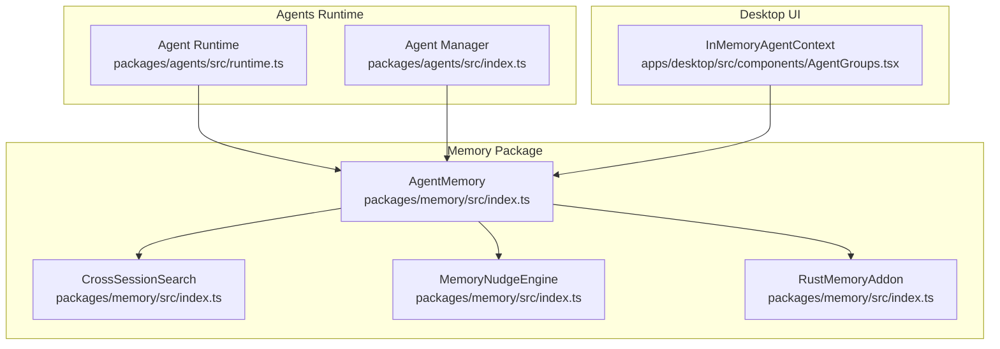
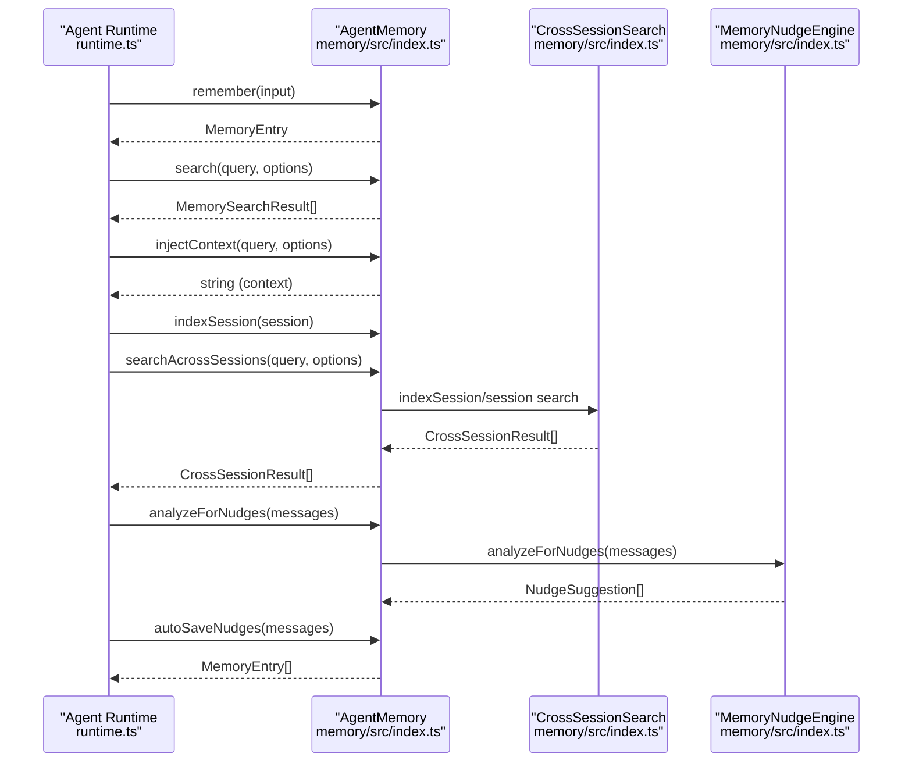
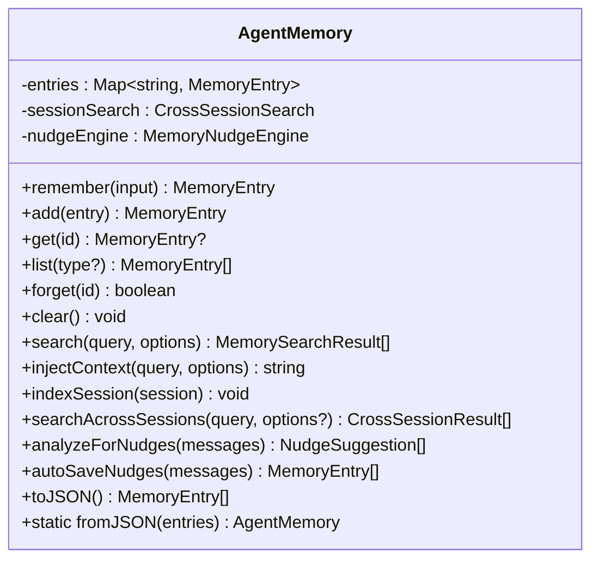
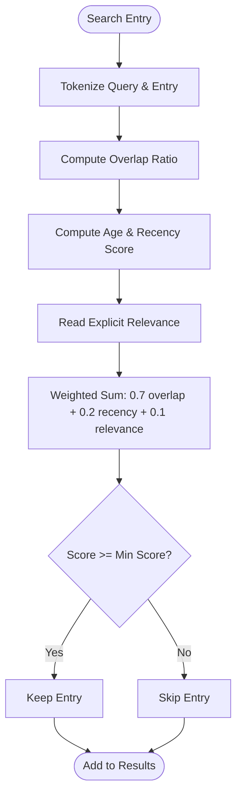
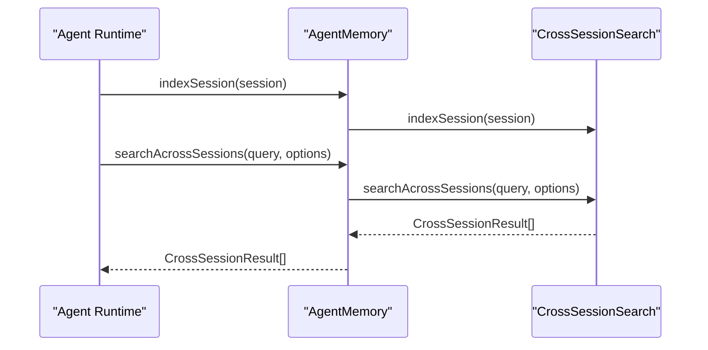
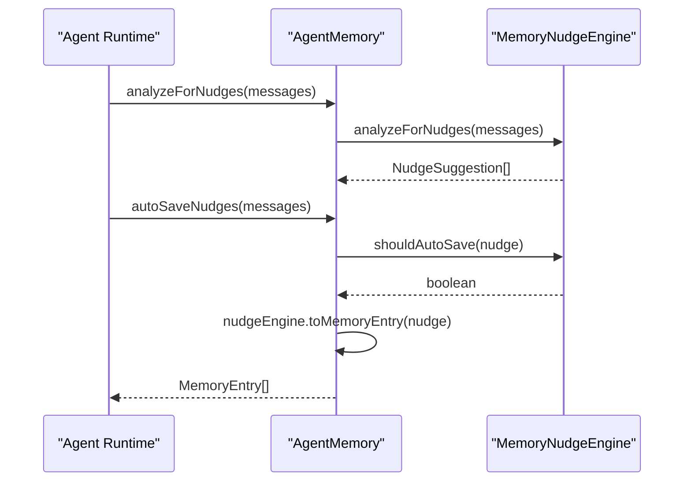
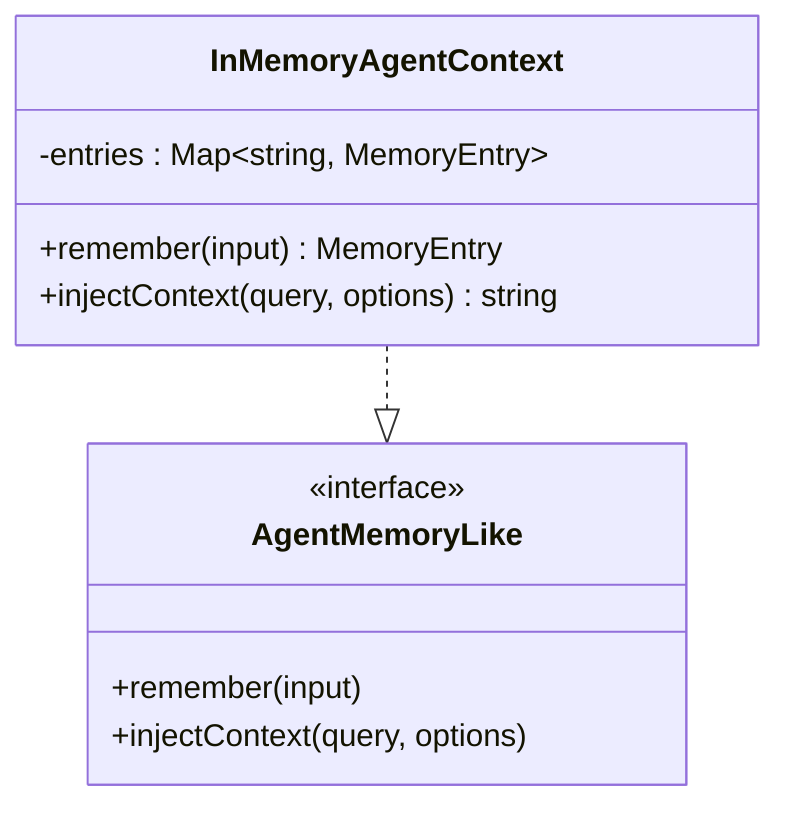
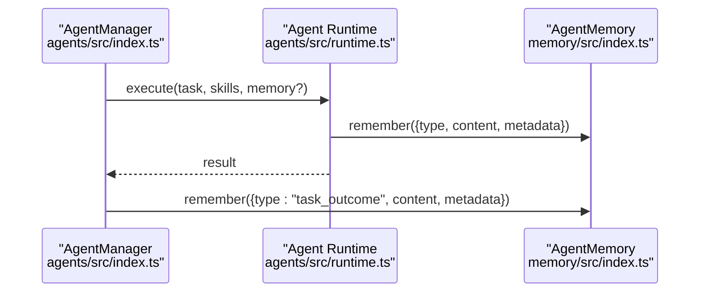
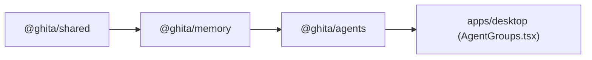

# Memory and Context Management

<cite>
**Referenced Files in This Document**
- [AgentGroups.tsx](file://apps/desktop/src/components/AgentGroups.tsx)
- [index.ts](file://packages/memory/src/index.ts)
- [runtime.ts](file://packages/agents/src/runtime.ts)
- [index.ts](file://packages/agents/src/index.ts)
- [package.json](file://packages/memory/package.json)
</cite>

## Table of Contents
1. [Introduction](#introduction)
2. [Project Structure](#project-structure)
3. [Core Components](#core-components)
4. [Architecture Overview](#architecture-overview)
5. [Detailed Component Analysis](#detailed-component-analysis)
6. [Dependency Analysis](#dependency-analysis)
7. [Performance Considerations](#performance-considerations)
8. [Troubleshooting Guide](#troubleshooting-guide)
9. [Conclusion](#conclusion)
10. [Appendices](#appendices)

## Introduction
This document explains the Memory and Context Management system used by agents to store, retrieve, and inject contextual information into decision-making workflows. It covers the AgentMemory interface and implementation patterns, memory storage backends (in-memory caching and persistent storage), context injection mechanisms, memory indexing and search capabilities, lifecycle management (retention, cleanup, privacy), integration with agent workflows, and practical usage patterns. It also addresses performance, scalability, and best practices for long-term agent memory.

## Project Structure
The memory system is primarily implemented in the @ghita/memory package and integrated with agent runtime and desktop UI components:
- @ghita/memory provides the AgentMemory class, search utilities, cross-session search, nudges, and optional semantic indexing via a Rust addon.
- @ghita/agents integrates memory into agent runtime and task execution.
- Desktop UI demonstrates an in-memory context provider for agent groups.

**Diagram sources**
- [runtime.ts:1-200](file://packages/agents/src/runtime.ts#L1-L200)
- [index.ts:1-400](file://packages/agents/src/index.ts#L1-L400)
- [index.ts:1-250](file://packages/memory/src/index.ts#L1-L250)
- [AgentGroups.tsx:1-120](file://apps/desktop/src/components/AgentGroups.tsx#L1-L120)

**Section sources**
- [package.json:1-30](file://packages/memory/package.json#L1-L30)
- [runtime.ts:1-200](file://packages/agents/src/runtime.ts#L1-L200)
- [index.ts:1-400](file://packages/agents/src/index.ts#L1-L400)
- [index.ts:1-250](file://packages/memory/src/index.ts#L1-L250)
- [AgentGroups.tsx:1-120](file://apps/desktop/src/components/AgentGroups.tsx#L1-L120)

## Core Components
- AgentMemory: Central memory store with CRUD operations, search, cross-session search, context injection, nudges, and serialization helpers.
- CrossSessionSearch: Indexes and searches across sessions for broader context recall.
- MemoryNudgeEngine: Detects patterns in conversations and optionally auto-saves nudges as memory entries.
- RustMemoryAddon: Optional semantic indexing and similarity utilities (e.g., cosine similarity).
- AgentMemoryLike: Minimal interface for memory providers used by agents.

Key capabilities:
- Store and retrieve memory entries with typed content and metadata.
- Token-based search with scoring that considers token overlap, recency, and explicit relevance.
- Context injection for LLM prompts with configurable header and character limits.
- Cross-session search to recall relevant memories across runs.
- Auto-save nudges derived from conversation analysis.

**Section sources**
- [index.ts:39-228](file://packages/memory/src/index.ts#L39-L228)
- [runtime.ts:10-40](file://packages/agents/src/runtime.ts#L10-L40)
- [index.ts:180-200](file://packages/agents/src/index.ts#L180-L200)

## Architecture Overview
The memory system sits between agents and their runtime. Agents can remember events, search memory, and inject context into prompts. The desktop UI demonstrates an in-memory context provider for agent groups.

**Diagram sources**
- [runtime.ts:150-220](file://packages/agents/src/runtime.ts#L150-L220)
- [index.ts:100-228](file://packages/memory/src/index.ts#L100-L228)

## Detailed Component Analysis

### AgentMemory Class
AgentMemory encapsulates the in-memory store and provides:
- remember(input): Creates and stores a new memory entry with generated ID, type, content, metadata, and timestamp.
- add(entry): Adds an existing entry to the store.
- get(id), list(type?), forget(id), clear(): CRUD and listing operations.
- search(query, options): Token-based search with scoring and filtering by type/metadata.
- injectContext(query, options): Builds a formatted context string from top-k results.
- indexSession(session), searchAcrossSessions(query, options): Cross-session search integration.
- analyzeForNudges(messages), autoSaveNudges(messages): Nudge detection and auto-persistence.
- toJSON/fromJSON: Serialization for persistence.

**Diagram sources**
- [index.ts:100-228](file://packages/memory/src/index.ts#L100-L228)

**Section sources**
- [index.ts:100-228](file://packages/memory/src/index.ts#L100-L228)

### Search and Scoring
- Tokenization uses Unicode word boundaries to normalize content.
- Score combines:
  - Token overlap ratio between query and entry.
  - Recency decay over ~30 days.
  - Explicit relevance (optional).
- Filtering supports type and metadata equality.

**Diagram sources**
- [index.ts:83-98](file://packages/memory/src/index.ts#L83-L98)

**Section sources**
- [index.ts:64-98](file://packages/memory/src/index.ts#L64-L98)

### Cross-Session Search
- indexSession(session) adds a session record to the cross-session index.
- searchAcrossSessions(query, options) searches across indexed sessions and returns ranked results.

**Diagram sources**
- [index.ts:184-193](file://packages/memory/src/index.ts#L184-L193)

**Section sources**
- [index.ts:184-193](file://packages/memory/src/index.ts#L184-L193)

### Nudge Engine and Auto-Save
- analyzeForNudges(messages) detects patterns and suggests nudges.
- autoSaveNudges(messages) conditionally persists suggested nudges as memory entries.

**Diagram sources**
- [index.ts:195-210](file://packages/memory/src/index.ts#L195-L210)

**Section sources**
- [index.ts:195-210](file://packages/memory/src/index.ts#L195-L210)

### In-Memory Context Provider (UI)
The desktop UI demonstrates an in-memory context provider that implements AgentMemoryLike for agent groups. It supports remembering entries and injecting context via a simple token-based scorer.

**Diagram sources**
- [AgentGroups.tsx:31-72](file://apps/desktop/src/components/AgentGroups.tsx#L31-L72)

**Section sources**
- [AgentGroups.tsx:31-72](file://apps/desktop/src/components/AgentGroups.tsx#L31-L72)

### Agent Integration
Agents integrate memory via AgentMemoryLike. The runtime and manager can optionally receive an AgentMemory instance and automatically remember task events and messages.

**Diagram sources**
- [index.ts:258-282](file://packages/agents/src/index.ts#L258-L282)
- [runtime.ts:160-180](file://packages/agents/src/runtime.ts#L160-L180)

**Section sources**
- [index.ts:258-282](file://packages/agents/src/index.ts#L258-L282)
- [runtime.ts:160-180](file://packages/agents/src/runtime.ts#L160-L180)

## Dependency Analysis
- @ghita/memory depends on @ghita/shared for types.
- @ghita/agents depends on @ghita/memory for AgentMemory and integrates it into runtime and manager.
- Desktop UI depends on @ghita/agents runtime types and demonstrates an in-memory context provider.

**Diagram sources**
- [package.json:22-27](file://packages/memory/package.json#L22-L27)
- [runtime.ts:1-40](file://packages/agents/src/runtime.ts#L1-L40)
- [index.ts:1-40](file://packages/agents/src/index.ts#L1-L40)
- [AgentGroups.tsx:1-20](file://apps/desktop/src/components/AgentGroups.tsx#L1-L20)

**Section sources**
- [package.json:1-30](file://packages/memory/package.json#L1-L30)
- [runtime.ts:1-40](file://packages/agents/src/runtime.ts#L1-L40)
- [index.ts:1-40](file://packages/agents/src/index.ts#L1-L40)
- [AgentGroups.tsx:1-20](file://apps/desktop/src/components/AgentGroups.tsx#L1-L20)

## Performance Considerations
- Tokenization and scoring are O(N) per entry during search, where N is the number of entries. For large-scale deployments, consider:
  - Pre-tokenization caches keyed by normalized content.
  - Metadata filters to reduce candidate sets before scoring.
  - Pagination and limit tuning to cap result size.
- Recency decay is linear; adjust decay window or precompute recency scores periodically.
- Cross-session search scales with indexed sessions; batch indexing and periodic re-indexing can improve throughput.
- Auto-save nudges should be rate-limited to avoid excessive writes.

[No sources needed since this section provides general guidance]

## Troubleshooting Guide
- Empty search results:
  - Verify query tokens are non-empty after normalization.
  - Lower minScore or remove restrictive metadata filters.
- Unexpectedly low relevance:
  - Increase explicit relevance hints in entries.
  - Adjust weighting factors in scoring if extending the implementation.
- Context too long for prompts:
  - Reduce maxCharacters in injectContext options.
  - Narrow query scope or increase limit to prioritize higher-scoring entries.
- Cross-session recall not working:
  - Ensure sessions are indexed via indexSession before searching across sessions.
- Nudges not auto-saving:
  - Confirm nudge patterns and thresholds in the engine configuration.
  - Verify shouldAutoSave conditions and toMemoryEntry conversion.

**Section sources**
- [index.ts:149-182](file://packages/memory/src/index.ts#L149-L182)
- [index.ts:184-193](file://packages/memory/src/index.ts#L184-L193)
- [index.ts:195-210](file://packages/memory/src/index.ts#L195-L210)

## Conclusion
The Memory and Context Management system provides a flexible, extensible foundation for agent memory. It supports in-memory caching, cross-session search, nudges, and optional semantic indexing. By integrating memory into agent workflows and offering robust search and context injection, it enables agents to recall relevant information efficiently and maintain coherent long-term behavior.

[No sources needed since this section summarizes without analyzing specific files]

## Appendices

### Practical Usage Patterns
- Remembering task outcomes and observations:
  - Use remember with type set to a domain-specific label and include metadata for filtering later.
- Injecting context into prompts:
  - Call injectContext with a concise query; tune limit and maxCharacters to fit model context windows.
- Cross-session recall:
  - Index sessions after runs; search across sessions to retrieve historical context.
- Sharing context between agents:
  - Persist AgentMemory to JSON and reconstruct instances to share across agents or sessions.
- Memory optimization:
  - Periodically forget low-value entries, prune by type/metadata, and rely on nudges to capture reusable insights.

**Section sources**
- [index.ts:113-147](file://packages/memory/src/index.ts#L113-L147)
- [index.ts:169-182](file://packages/memory/src/index.ts#L169-L182)
- [index.ts:212-218](file://packages/memory/src/index.ts#L212-L218)