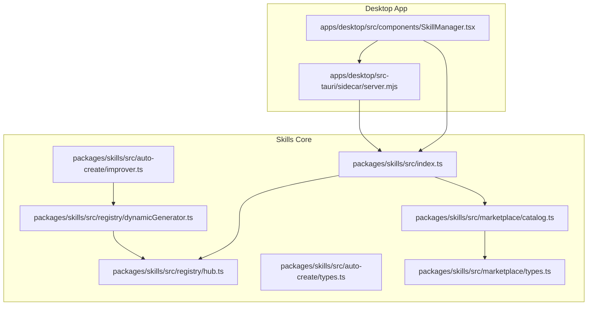
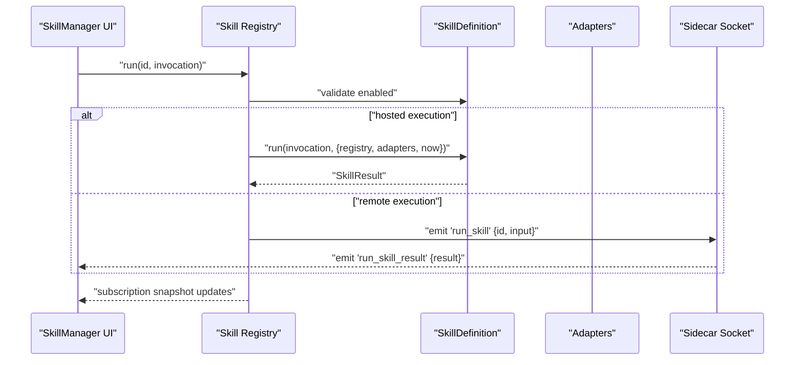
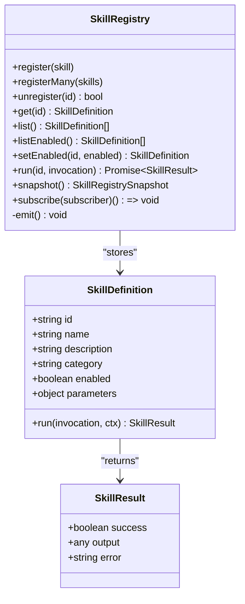
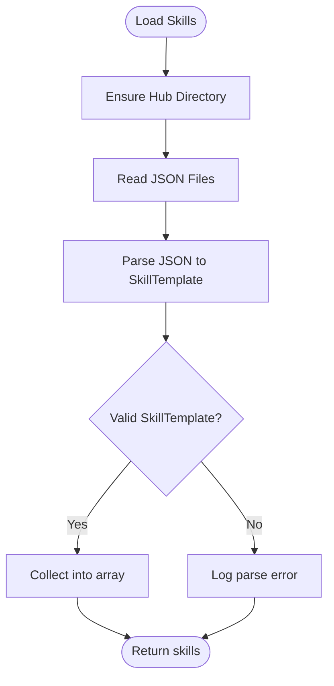
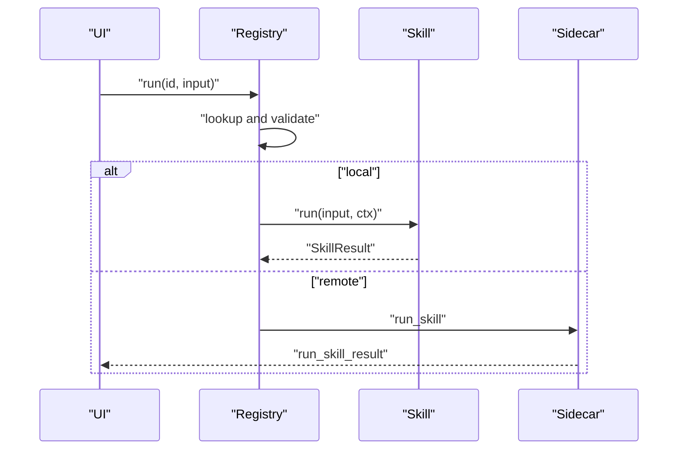
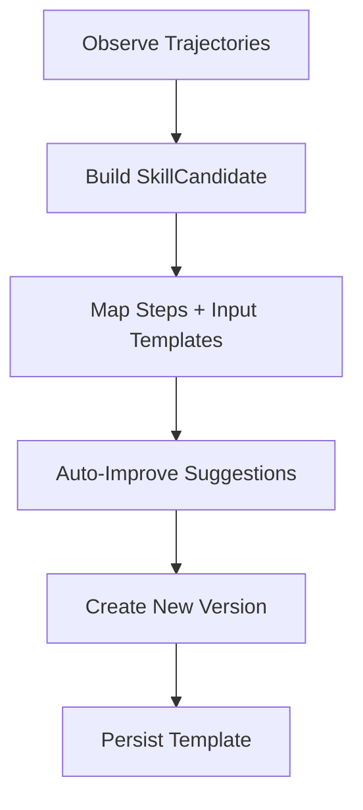
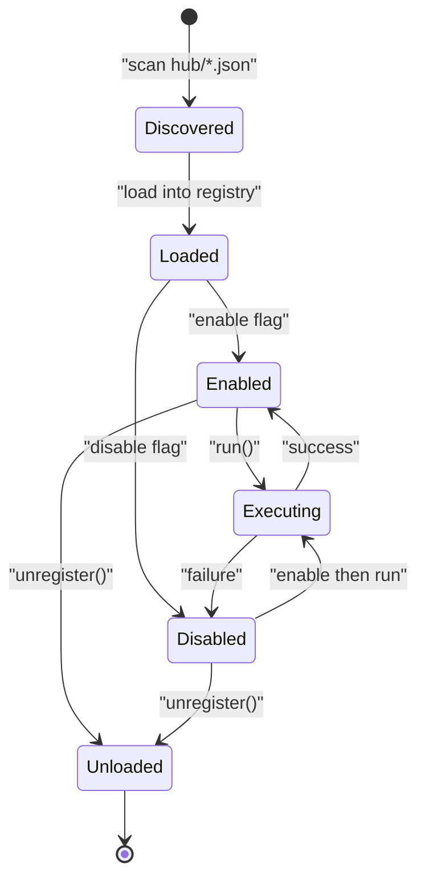
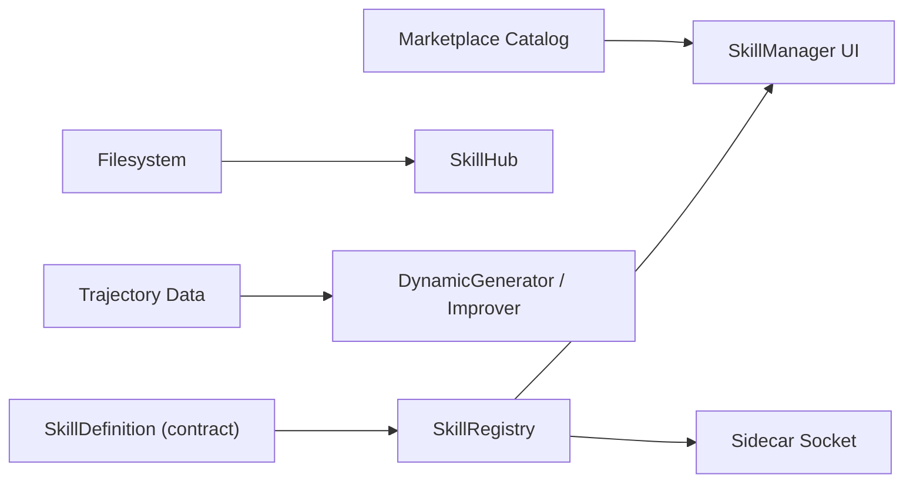

# Skills System and Management

<cite>
**Referenced Files in This Document**
- [index.ts](file://packages/skills/src/index.ts)
- [hub.ts](file://packages/skills/src/registry/hub.ts)
- [dynamicGenerator.ts](file://packages/skills/src/registry/dynamicGenerator.ts)
- [types.ts](file://packages/skills/src/auto-create/types.ts)
- [improver.ts](file://packages/skills/src/auto-create/improver.ts)
- [catalog.ts](file://packages/skills/src/marketplace/catalog.ts)
- [types.ts](file://packages/skills/src/marketplace/types.ts)
- [SkillManager.tsx](file://apps/desktop/src/components/SkillManager.tsx)
- [server.mjs](file://apps/desktop/src-tauri/sidecar/server.mjs)
- [dynamicGenerator.test.ts](file://packages/skills/tests/dynamicGenerator.test.ts)
</cite>

## Table of Contents
1. [Introduction](#introduction)
2. [Project Structure](#project-structure)
3. [Core Components](#core-components)
4. [Architecture Overview](#architecture-overview)
5. [Detailed Component Analysis](#detailed-component-analysis)
6. [Dependency Analysis](#dependency-analysis)
7. [Performance Considerations](#performance-considerations)
8. [Troubleshooting Guide](#troubleshooting-guide)
9. [Conclusion](#conclusion)
10. [Appendices](#appendices)

## Introduction
This document describes the Skills System and Management architecture used to discover, register, persist, compose, and execute skills across the agent ecosystem. It explains the skill registry pattern, skill definition and metadata format, storage backends, execution pipeline, dependency composition, lifecycle, versioning, and integration with the broader agent platform including memory injection and context sharing.

## Project Structure
The skills system spans a core TypeScript package and UI integrations:
- Core package: registry, marketplace, and auto-creation modules
- Desktop app: UI manager and sidecar integration for execution and listing

**Diagram sources**
- [index.ts:1-250](file://packages/skills/src/index.ts#L1-L250)
- [hub.ts:1-200](file://packages/skills/src/registry/hub.ts#L1-L200)
- [dynamicGenerator.ts:1-200](file://packages/skills/src/registry/dynamicGenerator.ts#L1-L200)
- [types.ts:1-80](file://packages/skills/src/auto-create/types.ts#L1-L80)
- [improver.ts:1-160](file://packages/skills/src/auto-create/improver.ts#L1-L160)
- [catalog.ts:1-140](file://packages/skills/src/marketplace/catalog.ts#L1-L140)
- [types.ts:1-60](file://packages/skills/src/marketplace/types.ts#L1-L60)
- [SkillManager.tsx:200-320](file://apps/desktop/src/components/SkillManager.tsx#L200-L320)
- [server.mjs:930-980](file://apps/desktop/src-tauri/sidecar/server.mjs#L930-L980)

**Section sources**
- [index.ts:1-250](file://packages/skills/src/index.ts#L1-L250)
- [hub.ts:1-200](file://packages/skills/src/registry/hub.ts#L1-L200)
- [dynamicGenerator.ts:1-200](file://packages/skills/src/registry/dynamicGenerator.ts#L1-L200)
- [types.ts:1-80](file://packages/skills/src/auto-create/types.ts#L1-L80)
- [improver.ts:1-160](file://packages/skills/src/auto-create/improver.ts#L1-L160)
- [catalog.ts:1-140](file://packages/skills/src/marketplace/catalog.ts#L1-L140)
- [types.ts:1-60](file://packages/skills/src/marketplace/types.ts#L1-L60)
- [SkillManager.tsx:200-320](file://apps/desktop/src/components/SkillManager.tsx#L200-L320)
- [server.mjs:930-980](file://apps/desktop/src-tauri/sidecar/server.mjs#L930-L980)

## Core Components
- Skill Registry: central in-memory store for skills with CRUD, enable/disable, listing, subscription, and execution orchestration.
- Skill Hub: filesystem-backed persistence for skill templates with load, save, search, and category statistics.
- Dynamic Generator: auto-creation of skills from agent trajectories with safety validation and optional sync commands.
- Improver: version-aware improvement suggestions and generation of new versions.
- Marketplace Catalog: cached catalog retrieval, search, filtering, pagination, and fallback behavior.
- UI Manager: desktop UI for browsing, enabling/disabling, and executing skills; integrates with sidecar for remote execution.
- Sidecar Integration: exposes list and run endpoints to the desktop app via socket events.

Key responsibilities:
- Registry: validates readiness, invokes run with adapter context, and emits snapshots.
- Hub: persists and loads skill templates as JSON, supports import/export and search.
- Auto-create: transforms observed agent behavior into structured skill templates.
- Marketplace: provides curated catalogs and metadata for distribution and installation.

**Section sources**
- [index.ts:145-237](file://packages/skills/src/index.ts#L145-L237)
- [hub.ts:45-157](file://packages/skills/src/registry/hub.ts#L45-L157)
- [dynamicGenerator.ts:134-174](file://packages/skills/src/registry/dynamicGenerator.ts#L134-L174)
- [improver.ts:50-142](file://packages/skills/src/auto-create/improver.ts#L50-L142)
- [catalog.ts:37-120](file://packages/skills/src/marketplace/catalog.ts#L37-L120)
- [SkillManager.tsx:237-302](file://apps/desktop/src/components/SkillManager.tsx#L237-L302)
- [server.mjs:937-975](file://apps/desktop/src-tauri/sidecar/server.mjs#L937-L975)

## Architecture Overview
The system follows a registry-first pattern with optional filesystem persistence and marketplace integration. Execution can be handled locally or proxied to a sidecar process.

**Diagram sources**
- [index.ts:187-201](file://packages/skills/src/index.ts#L187-L201)
- [SkillManager.tsx:280-302](file://apps/desktop/src/components/SkillManager.tsx#L280-L302)
- [server.mjs:937-975](file://apps/desktop/src-tauri/sidecar/server.mjs#L937-L975)

## Detailed Component Analysis

### Skill Registry Pattern
The registry maintains an in-memory map of skills, supports bulk registration/unregistration, enable/disable toggling, listing with ordering, and subscription-based notifications. Execution delegates to the skill’s run method with a context containing the registry, adapters, and a time source.

**Diagram sources**
- [index.ts:145-237](file://packages/skills/src/index.ts#L145-L237)

**Section sources**
- [index.ts:145-237](file://packages/skills/src/index.ts#L145-L237)

### Skill Definition Format and Execution Contracts
- Metadata: id, name, description, category, enabled flag, parameters schema.
- Parameters schema: typed keys with descriptions and required flags.
- Execution contract: run(invocation, context) returning a SkillResult with success, output, and error fields.
- Registry execution: validates presence and enabled state, then invokes run with registry, adapters, and timestamp.

Practical implications:
- Parameter validation occurs at runtime via the skill’s run implementation.
- Results unify success/failure semantics for UI and sidecar consumers.

**Section sources**
- [index.ts:187-201](file://packages/skills/src/index.ts#L187-L201)

### Skill Storage Backends: In-Memory and Filesystem
- In-memory registry: fast lookup, enable/disable, and snapshot emission.
- Filesystem hub: JSON-based persistence of skill templates under a configured hub path. Supports load, get, delete, export/import, search, and category counting.

**Diagram sources**
- [hub.ts:45-67](file://packages/skills/src/registry/hub.ts#L45-L67)

**Section sources**
- [hub.ts:45-157](file://packages/skills/src/registry/hub.ts#L45-L157)

### Skill Execution Pipeline
Execution path:
- UI triggers run via registry.
- Registry validates existence and enabled state.
- Skill’s run method executes with injected context (registry, adapters, now).
- Errors are caught and returned as SkillResult with error field.

Remote execution path:
- UI emits socket event to sidecar.
- Sidecar resolves the registry, runs the skill, and returns result.

**Diagram sources**
- [index.ts:187-201](file://packages/skills/src/index.ts#L187-L201)
- [SkillManager.tsx:280-302](file://apps/desktop/src/components/SkillManager.tsx#L280-L302)
- [server.mjs:937-975](file://apps/desktop/src-tauri/sidecar/server.mjs#L937-L975)

**Section sources**
- [index.ts:187-201](file://packages/skills/src/index.ts#L187-L201)
- [SkillManager.tsx:280-302](file://apps/desktop/src/components/SkillManager.tsx#L280-L302)
- [server.mjs:937-975](file://apps/desktop/src-tauri/sidecar/server.mjs#L937-L975)

### Skill Dependency Management and Composition
- Skills are composed via steps and parameters; auto-created skills capture tool invocations and input templates.
- Improvement engine suggests parameterization and step changes based on observed variability across trajectories.
- Versioning: semantic versioning with automatic bumps for parameter/step changes and optimizations.

**Diagram sources**
- [types.ts:18-51](file://packages/skills/src/auto-create/types.ts#L18-L51)
- [improver.ts:50-142](file://packages/skills/src/auto-create/improver.ts#L50-L142)

**Section sources**
- [types.ts:18-51](file://packages/skills/src/auto-create/types.ts#L18-L51)
- [improver.ts:50-142](file://packages/skills/src/auto-create/improver.ts#L50-L142)

### Skill Lifecycle: Discovery, Loading, Validation, Unloading
- Discovery: filesystem scanning for .json files under hub path; search supported by keyword matching.
- Loading: registry loads from in-memory map; hub loads from disk.
- Validation: registry validates enabled state; dynamic generator performs safety checks on generated templates.
- Unloading: registry supports unregister and snapshot-based state tracking.

**Diagram sources**
- [hub.ts:45-67](file://packages/skills/src/registry/hub.ts#L45-L67)
- [index.ts:151-185](file://packages/skills/src/index.ts#L151-L185)

**Section sources**
- [hub.ts:45-67](file://packages/skills/src/registry/hub.ts#L45-L67)
- [index.ts:151-185](file://packages/skills/src/index.ts#L151-L185)

### Practical Examples and Custom Skill Development
- Example skill definition: see SkillDefinition shape and run contract in the registry module.
- Example execution pattern: UI invokes run via registry; remote fallback uses sidecar socket events.
- Custom skill development: define parameters, implement run with adapters/context, and optionally persist via hub.

Note: The repository does not include concrete example skill JSON files; use the hub’s import/export and the registry’s snapshot/list APIs to manage and inspect skills.

**Section sources**
- [index.ts:187-201](file://packages/skills/src/index.ts#L187-L201)
- [SkillManager.tsx:280-302](file://apps/desktop/src/components/SkillManager.tsx#L280-L302)
- [hub.ts:106-126](file://packages/skills/src/registry/hub.ts#L106-L126)

### Skill Versioning, Backward Compatibility, and Performance
- Versioning: semantic versioning applied during improvements; parameter/step changes increment minor, optimizations increment patch.
- Backward compatibility: marketplace catalog returns single version per skill; cache TTL ensures freshness while reducing network calls.
- Performance: registry snapshot subscriptions minimize UI re-renders; hub search is in-memory after load; sidecar offloads heavy execution.

**Section sources**
- [improver.ts:100-142](file://packages/skills/src/auto-create/improver.ts#L100-L142)
- [catalog.ts:37-60](file://packages/skills/src/marketplace/catalog.ts#L37-L60)

### Integration with the Broader Agent Ecosystem
- Memory injection and context sharing: adapters passed to run provide contextual capabilities; registry snapshot informs UI state.
- Sidecar integration: socket events expose list and run endpoints for remote execution and discovery.
- Marketplace: curated catalogs and metadata support distribution and installation.

**Section sources**
- [index.ts:193-197](file://packages/skills/src/index.ts#L193-L197)
- [server.mjs:946-975](file://apps/desktop/src-tauri/sidecar/server.mjs#L946-L975)
- [catalog.ts:37-120](file://packages/skills/src/marketplace/catalog.ts#L37-L120)

## Dependency Analysis
The registry depends on the shared SkillDefinition contract and adapters; the hub depends on filesystem operations; auto-create depends on trajectory data; marketplace depends on catalog data and caching.

**Diagram sources**
- [index.ts:1-250](file://packages/skills/src/index.ts#L1-L250)
- [hub.ts:1-200](file://packages/skills/src/registry/hub.ts#L1-L200)
- [dynamicGenerator.ts:1-200](file://packages/skills/src/registry/dynamicGenerator.ts#L1-L200)
- [improver.ts:1-160](file://packages/skills/src/auto-create/improver.ts#L1-L160)
- [catalog.ts:1-140](file://packages/skills/src/marketplace/catalog.ts#L1-L140)
- [SkillManager.tsx:237-302](file://apps/desktop/src/components/SkillManager.tsx#L237-L302)
- [server.mjs:937-975](file://apps/desktop/src-tauri/sidecar/server.mjs#L937-L975)

**Section sources**
- [index.ts:1-250](file://packages/skills/src/index.ts#L1-L250)
- [hub.ts:1-200](file://packages/skills/src/registry/hub.ts#L1-L200)
- [dynamicGenerator.ts:1-200](file://packages/skills/src/registry/dynamicGenerator.ts#L1-L200)
- [improver.ts:1-160](file://packages/skills/src/auto-create/improver.ts#L1-L160)
- [catalog.ts:1-140](file://packages/skills/src/marketplace/catalog.ts#L1-L140)
- [SkillManager.tsx:237-302](file://apps/desktop/src/components/SkillManager.tsx#L237-L302)
- [server.mjs:937-975](file://apps/desktop/src-tauri/sidecar/server.mjs#L937-L975)

## Performance Considerations
- Prefer enabling only necessary skills to reduce registry overhead.
- Use registry snapshots and subscription to batch UI updates.
- Cache marketplace catalogs with TTL to avoid repeated network fetches.
- Offload long-running executions to the sidecar to keep the UI responsive.
- Limit filesystem scans by organizing hub files and using search/filter APIs.

## Troubleshooting Guide
Common issues and remedies:
- Skill not found: ensure the skill id exists in the registry and is registered.
- Skill disabled: toggle enabled state via registry setEnabled.
- Execution errors: check SkillResult.error; review skill’s run implementation and parameter validation.
- Safety validation failures: dynamic generator blocks dangerous command patterns; adjust templates accordingly.
- Remote execution timeouts: verify sidecar connectivity and socket event handlers.

**Section sources**
- [index.ts:187-201](file://packages/skills/src/index.ts#L187-L201)
- [dynamicGenerator.test.ts:93-124](file://packages/skills/tests/dynamicGenerator.test.ts#L93-L124)
- [server.mjs:937-975](file://apps/desktop/src-tauri/sidecar/server.mjs#L937-L975)

## Conclusion
The Skills System provides a robust, extensible framework for discovering, registering, persisting, composing, and executing skills. Its registry-first design, combined with filesystem persistence, auto-creation, and marketplace integration, enables dynamic workflows and scalable agent capabilities. The sidecar integration and snapshot-based UI updates ensure responsive and reliable operation across environments.

## Appendices
- Security note: dynamic generator includes safety validation to prevent potentially harmful command patterns.
- Versioning note: improvements automatically bump versions; marketplace catalogs currently return single versions per skill.

**Section sources**
- [dynamicGenerator.ts:134-174](file://packages/skills/src/registry/dynamicGenerator.ts#L134-L174)
- [improver.ts:100-142](file://packages/skills/src/auto-create/improver.ts#L100-L142)
- [catalog.ts:95-103](file://packages/skills/src/marketplace/catalog.ts#L95-L103)