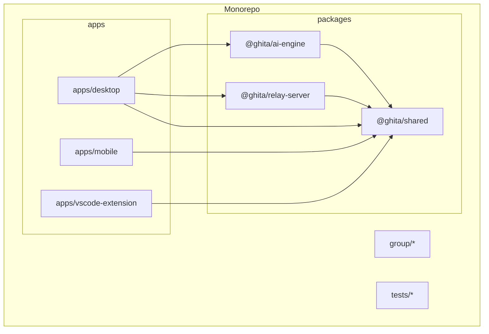
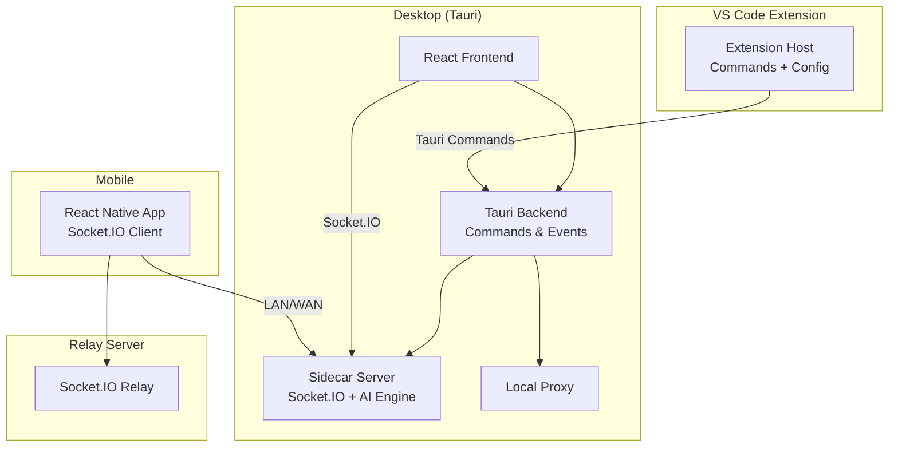
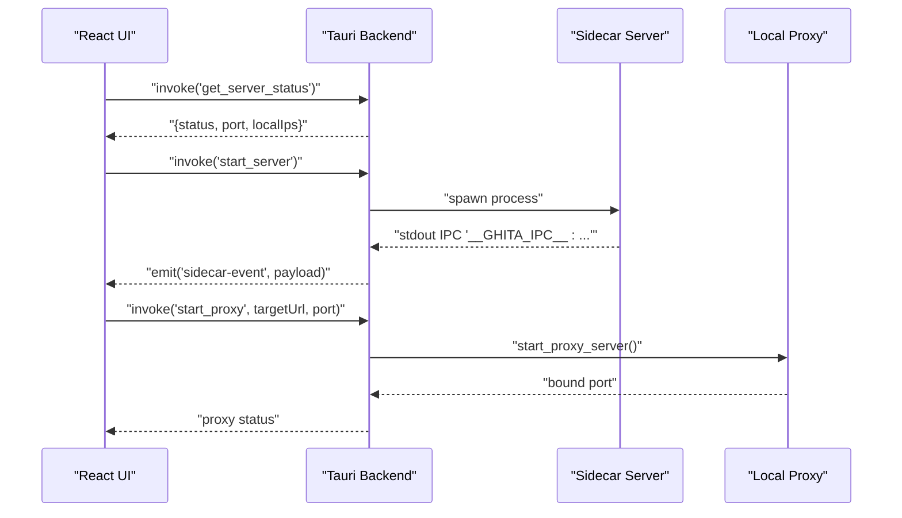
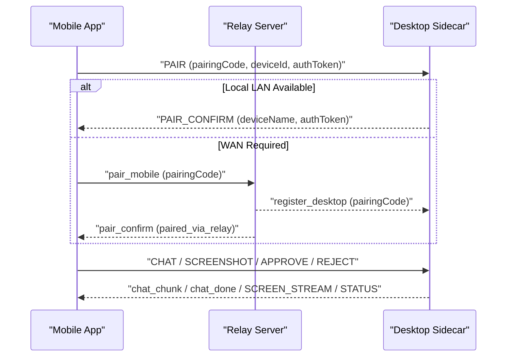
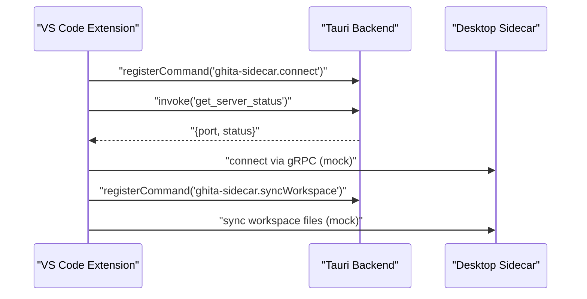
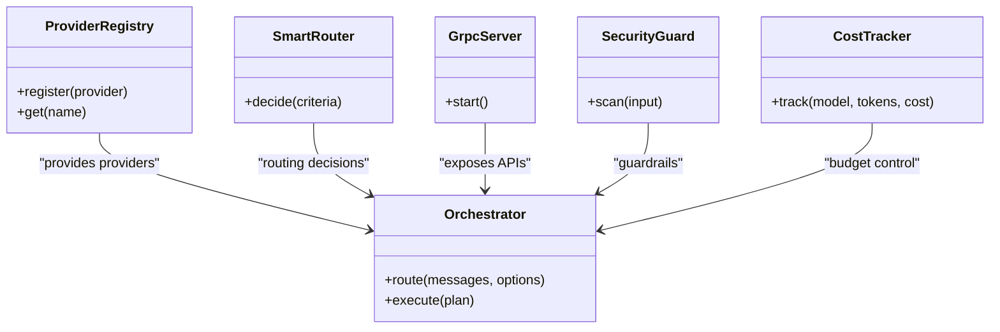
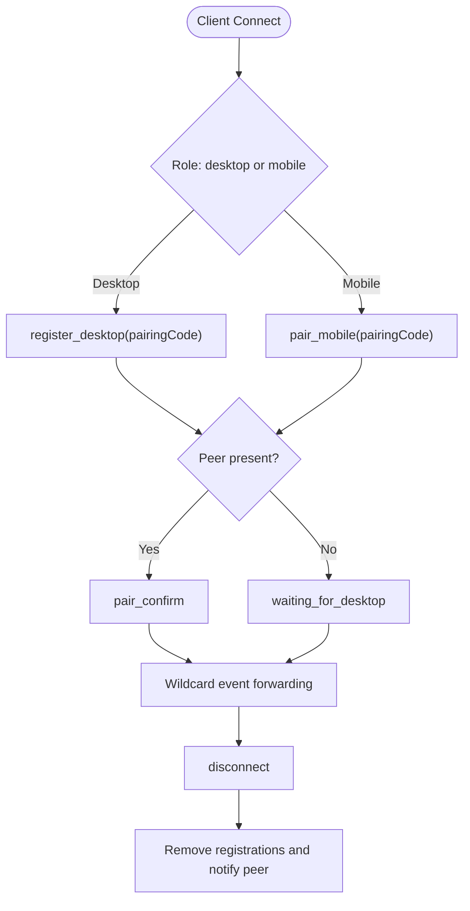
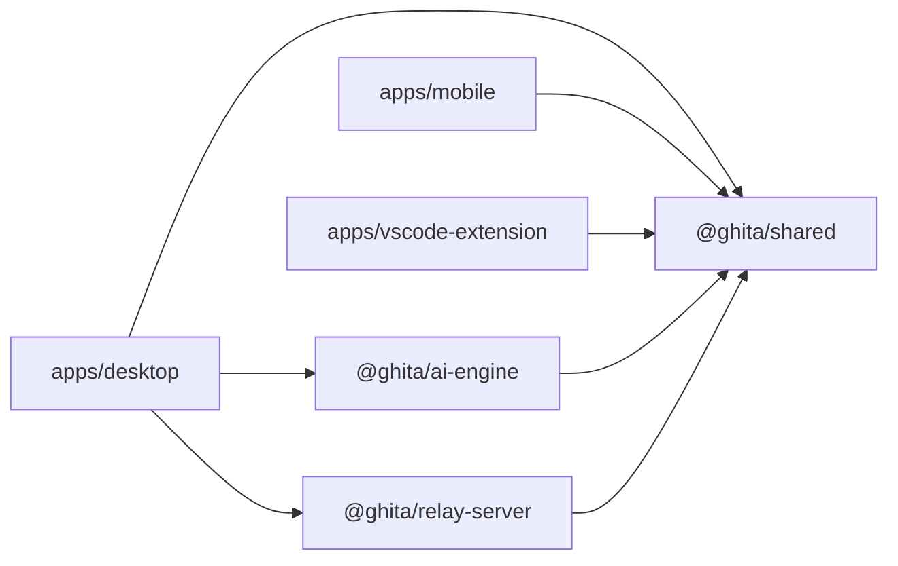

# Architecture and Design

<cite>
**Referenced Files in This Document**
- [apps/desktop/package.json](file://apps/desktop/package.json)
- [apps/desktop/src-tauri/tauri.conf.json](file://apps/desktop/src-tauri/tauri.conf.json)
- [apps/desktop/src-tauri/src/lib.rs](file://apps/desktop/src-tauri/src/lib.rs)
- [apps/desktop/src-tauri/src/main.rs](file://apps/desktop/src-tauri/src/main.rs)
- [apps/desktop/src-tauri/src/proxy.rs](file://apps/desktop/src-tauri/src/proxy.rs)
- [apps/desktop/src/App.tsx](file://apps/desktop/src/App.tsx)
- [apps/desktop/src/utils/sharedSocket.ts](file://apps/desktop/src/utils/sharedSocket.ts)
- [apps/mobile/package.json](file://apps/mobile/package.json)
- [apps/mobile/src/App.tsx](file://apps/mobile/src/App.tsx)
- [apps/mobile/src/services/socketService.ts](file://apps/mobile/src/services/socketService.ts)
- [apps/vscode-extension/package.json](file://apps/vscode-extension/package.json)
- [apps/vscode-extension/src/extension.ts](file://apps/vscode-extension/src/extension.ts)
- [packages/ai-engine/package.json](file://packages/ai-engine/package.json)
- [packages/ai-engine/src/index.ts](file://packages/ai-engine/src/index.ts)
- [packages/relay-server/package.json](file://packages/relay-server/package.json)
- [packages/relay-server/src/index.ts](file://packages/relay-server/src/index.ts)
</cite>

## Table of Contents
1. [Introduction](#introduction)
2. [Project Structure](#project-structure)
3. [Core Components](#core-components)
4. [Architecture Overview](#architecture-overview)
5. [Detailed Component Analysis](#detailed-component-analysis)
6. [Dependency Analysis](#dependency-analysis)
7. [Performance Considerations](#performance-considerations)
8. [Troubleshooting Guide](#troubleshooting-guide)
9. [Conclusion](#conclusion)
10. [Appendices](#appendices)

## Introduction
This document describes the system architecture of GHITA CODING AGENT, a cross-platform AI-powered development assistant. The system comprises three primary applications—Tauri desktop, React Native mobile, and a VS Code extension—communicating via Socket.IO and Tauri command bridges. At the center is the AI engine package with multi-provider orchestration and a sidecar server that coordinates AI operations locally. The document explains component interactions, data flows, technology choices, infrastructure requirements, scalability, and cross-cutting concerns such as security, monitoring, and extensibility.

## Project Structure
The repository follows a monorepo layout with:
- apps: platform-specific applications (desktop, mobile, VS Code extension)
- packages: shared libraries and engines (AI engine, relay server, shared utilities)
- group: collaborative artifacts and protocol documents
- tests: unit, integration, and quality loop tests

**Diagram sources**
- [apps/desktop/package.json:1-61](file://apps/desktop/package.json#L1-L61)
- [apps/mobile/package.json:1-44](file://apps/mobile/package.json#L1-L44)
- [apps/vscode-extension/package.json:1-61](file://apps/vscode-extension/package.json#L1-L61)
- [packages/ai-engine/package.json:1-44](file://packages/ai-engine/package.json#L1-L44)
- [packages/relay-server/package.json:1-40](file://packages/relay-server/package.json#L1-L40)

**Section sources**
- [apps/desktop/package.json:1-61](file://apps/desktop/package.json#L1-L61)
- [apps/mobile/package.json:1-44](file://apps/mobile/package.json#L1-L44)
- [apps/vscode-extension/package.json:1-61](file://apps/vscode-extension/package.json#L1-L61)
- [packages/ai-engine/package.json:1-44](file://packages/ai-engine/package.json#L1-L44)
- [packages/relay-server/package.json:1-40](file://packages/relay-server/package.json#L1-L40)

## Core Components
- Tauri Desktop Application
  - React frontend with Tauri backend for native capabilities.
  - Manages a sidecar server process and exposes Tauri commands for lifecycle control.
  - Provides a shared Socket.IO client for real-time communication with mobile and optional relay.

- React Native Mobile Application
  - Real-time remote control and pairing with desktop via Socket.IO.
  - Handles local and cloud (relay) connection modes with health checks and reconnection.

- VS Code Extension
  - Provides commands to connect to the sidecar and optionally synchronize workspace files.
  - Integrates with VS Code’s status bar and configuration.

- AI Engine Package
  - Multi-provider orchestration, model discovery, routing, security guardrails, caching, and enterprise-grade observability.
  - Exposes gRPC server entry points and orchestrator APIs.

- Relay Server
  - Socket.IO relay for WAN pairing and bridging events between desktop and mobile when local LAN is unavailable.

**Section sources**
- [apps/desktop/src-tauri/src/lib.rs:372-500](file://apps/desktop/src-tauri/src/lib.rs#L372-L500)
- [apps/desktop/src/App.tsx:71-92](file://apps/desktop/src/App.tsx#L71-L92)
- [apps/desktop/src/utils/sharedSocket.ts:28-80](file://apps/desktop/src/utils/sharedSocket.ts#L28-L80)
- [apps/mobile/src/services/socketService.ts:80-111](file://apps/mobile/src/services/socketService.ts#L80-L111)
- [apps/vscode-extension/src/extension.ts:14-79](file://apps/vscode-extension/src/extension.ts#L14-L79)
- [packages/ai-engine/src/index.ts:1-334](file://packages/ai-engine/src/index.ts#L1-L334)
- [packages/relay-server/src/index.ts:84-256](file://packages/relay-server/src/index.ts#L84-L256)

## Architecture Overview
The system centers around the desktop sidecar server, which:
- Runs a local Socket.IO server for desktop-local pairing and AI orchestration.
- Exposes Tauri commands for lifecycle management (start/stop/status) and proxying.
- Bridges AI engine capabilities and integrates with VS Code extension for workspace sync.

Mobile connects either directly via local LAN or through the relay server for WAN scenarios. The VS Code extension communicates with the sidecar via Tauri commands and optional gRPC transport abstractions.

**Diagram sources**
- [apps/desktop/src-tauri/src/lib.rs:372-500](file://apps/desktop/src-tauri/src/lib.rs#L372-L500)
- [apps/desktop/src/utils/sharedSocket.ts:28-80](file://apps/desktop/src/utils/sharedSocket.ts#L28-L80)
- [apps/mobile/src/services/socketService.ts:80-111](file://apps/mobile/src/services/socketService.ts#L80-L111)
- [packages/relay-server/src/index.ts:84-256](file://packages/relay-server/src/index.ts#L84-L256)
- [apps/vscode-extension/src/extension.ts:14-79](file://apps/vscode-extension/src/extension.ts#L14-L79)

## Detailed Component Analysis

### Tauri Desktop Application
- Responsibilities
  - Manage sidecar lifecycle (start/stop/status) and expose Tauri commands.
  - Provide a local Socket.IO server for desktop and integrate with AI engine.
  - Offer a local proxy for outbound requests and secure CSP-compliant embedding.
  - Emit UI-ready events to React frontend and manage splash/main windows.

- Key Implementation Notes
  - Sidecar process spawning with environment variables and logging redirection.
  - Robust status polling and local IP detection for LAN pairing.
  - Proxy server with request/response forwarding, timeouts, and header stripping for embedding.
  - Frontend readiness signaling and event bridging to UI.

**Diagram sources**
- [apps/desktop/src-tauri/src/lib.rs:42-153](file://apps/desktop/src-tauri/src/lib.rs#L42-L153)
- [apps/desktop/src-tauri/src/lib.rs:310-344](file://apps/desktop/src-tauri/src/lib.rs#L310-L344)
- [apps/desktop/src/App.tsx:20-34](file://apps/desktop/src/App.tsx#L20-L34)

**Section sources**
- [apps/desktop/src-tauri/src/lib.rs:42-153](file://apps/desktop/src-tauri/src/lib.rs#L42-L153)
- [apps/desktop/src-tauri/src/lib.rs:170-235](file://apps/desktop/src-tauri/src/lib.rs#L170-L235)
- [apps/desktop/src-tauri/src/proxy.rs:139-224](file://apps/desktop/src-tauri/src/proxy.rs#L139-L224)
- [apps/desktop/src/App.tsx:71-92](file://apps/desktop/src/App.tsx#L71-L92)

### React Native Mobile Application
- Responsibilities
  - Establish real-time pairing with desktop via Socket.IO.
  - Support local LAN and cloud relay modes with health checks and reconnection.
  - Streamline chat responses, screenshots, approvals, and telemetry.

- Key Implementation Notes
  - Centralized SocketService managing connection state, pairing, and event handlers.
  - Automatic fallback to local LAN when cloud connectivity is lost.
  - Strict event typing and timeout handling for robust UX.

**Diagram sources**
- [apps/mobile/src/services/socketService.ts:135-147](file://apps/mobile/src/services/socketService.ts#L135-L147)
- [packages/relay-server/src/index.ts:137-187](file://packages/relay-server/src/index.ts#L137-L187)
- [packages/relay-server/src/index.ts:189-215](file://packages/relay-server/src/index.ts#L189-L215)

**Section sources**
- [apps/mobile/src/services/socketService.ts:80-111](file://apps/mobile/src/services/socketService.ts#L80-L111)
- [apps/mobile/src/services/socketService.ts:330-520](file://apps/mobile/src/services/socketService.ts#L330-L520)
- [packages/relay-server/src/index.ts:84-256](file://packages/relay-server/src/index.ts#L84-L256)

### VS Code Extension
- Responsibilities
  - Provide commands to connect sidecar and optionally sync workspace files.
  - Manage status bar item and configuration (corePort, autoSync).

- Key Implementation Notes
  - Uses Tauri commands to coordinate with the desktop daemon.
  - Simulates workspace synchronization and file change notifications.

**Diagram sources**
- [apps/vscode-extension/src/extension.ts:25-66](file://apps/vscode-extension/src/extension.ts#L25-L66)
- [apps/desktop/src-tauri/src/lib.rs:186-235](file://apps/desktop/src-tauri/src/lib.rs#L186-L235)

**Section sources**
- [apps/vscode-extension/src/extension.ts:14-79](file://apps/vscode-extension/src/extension.ts#L14-L79)
- [apps/vscode-extension/package.json:1-61](file://apps/vscode-extension/package.json#L1-L61)

### AI Engine Architecture
- Responsibilities
  - Multi-provider orchestration (OpenAI, Anthropic, Google, Ollama, custom).
  - Model discovery, smart routing, cost tracking, and budget management.
  - Security guardrails, content filtering, audit logging, and observability.
  - Middleware pipeline, universal router, and enterprise-grade infrastructure.

- Key Implementation Notes
  - Provider registry and orchestrator with pluggable middlewares.
  - gRPC server entry points and MCP client integrations.
  - Context compression, token estimation, and anti-slop filters.

**Diagram sources**
- [packages/ai-engine/src/index.ts:39-48](file://packages/ai-engine/src/index.ts#L39-L48)
- [packages/ai-engine/src/index.ts:76-84](file://packages/ai-engine/src/index.ts#L76-L84)
- [packages/ai-engine/src/index.ts:114-117](file://packages/ai-engine/src/index.ts#L114-L117)
- [packages/ai-engine/src/index.ts:167-197](file://packages/ai-engine/src/index.ts#L167-L197)

**Section sources**
- [packages/ai-engine/src/index.ts:1-334](file://packages/ai-engine/src/index.ts#L1-L334)
- [packages/ai-engine/package.json:1-44](file://packages/ai-engine/package.json#L1-L44)

### Relay Server
- Responsibilities
  - Act as a Socket.IO relay for WAN pairing and event tunneling.
  - Maintain pairing maps and enforce rate limits.
  - Notify peers on disconnections and maintain health endpoints.

- Key Implementation Notes
  - Pair desktop and mobile by pairing code and forward wildcard events.
  - Enforce per-socket rate limiting and clean up registrations on disconnect.

**Diagram sources**
- [packages/relay-server/src/index.ts:84-256](file://packages/relay-server/src/index.ts#L84-L256)

**Section sources**
- [packages/relay-server/src/index.ts:1-264](file://packages/relay-server/src/index.ts#L1-L264)
- [packages/relay-server/package.json:1-40](file://packages/relay-server/package.json#L1-L40)

## Dependency Analysis
- Cross-application dependencies
  - Desktop depends on AI engine, communication, and shared packages.
  - Mobile depends on shared types and Socket.IO client.
  - VS Code extension depends on shared and Socket.IO client.

- Internal package dependencies
  - AI engine exports providers, orchestrator, gRPC server, and middleware.
  - Relay server depends on Express, Socket.IO, and CORS.

**Diagram sources**
- [apps/desktop/package.json:17-42](file://apps/desktop/package.json#L17-L42)
- [apps/mobile/package.json:17-28](file://apps/mobile/package.json#L17-L28)
- [apps/vscode-extension/package.json:52-54](file://apps/vscode-extension/package.json#L52-L54)
- [packages/ai-engine/package.json:24-30](file://packages/ai-engine/package.json#L24-L30)
- [packages/relay-server/package.json:23-27](file://packages/relay-server/package.json#L23-L27)

**Section sources**
- [apps/desktop/package.json:17-42](file://apps/desktop/package.json#L17-L42)
- [apps/mobile/package.json:17-28](file://apps/mobile/package.json#L17-L28)
- [apps/vscode-extension/package.json:52-54](file://apps/vscode-extension/package.json#L52-L54)
- [packages/ai-engine/package.json:24-30](file://packages/ai-engine/package.json#L24-L30)
- [packages/relay-server/package.json:23-27](file://packages/relay-server/package.json#L23-L27)

## Performance Considerations
- Desktop
  - Sidecar process management and stdout IPC threading to avoid blocking UI.
  - Local proxy with request size limits and timeouts to protect resources.
  - CSP hardening to allow embedding while preserving security.

- Mobile
  - Backoff reconnection strategy and health checks to recover from transient failures.
  - Streaming chat chunks and selective event forwarding to reduce overhead.

- Relay
  - Per-socket rate limiting to mitigate abuse and stabilize throughput.
  - Minimal event forwarding logic to minimize latency.

[No sources needed since this section provides general guidance]

## Troubleshooting Guide
- Desktop sidecar not starting
  - Verify Tauri command invocation and sidecar script path resolution.
  - Check environment variables and bundled Node presence.

- Socket.IO connection issues
  - Confirm port availability and firewall rules.
  - Validate pairing code and session token flow.

- Relay pairing failures
  - Ensure both sides register with the same pairing code.
  - Monitor rate limit warnings and peer disconnection messages.

**Section sources**
- [apps/desktop/src-tauri/src/lib.rs:42-153](file://apps/desktop/src-tauri/src/lib.rs#L42-L153)
- [apps/desktop/src/utils/sharedSocket.ts:28-80](file://apps/desktop/src/utils/sharedSocket.ts#L28-L80)
- [apps/mobile/src/services/socketService.ts:330-520](file://apps/mobile/src/services/socketService.ts#L330-L520)
- [packages/relay-server/src/index.ts:56-69](file://packages/relay-server/src/index.ts#L56-L69)

## Conclusion
GHITA CODING AGENT employs a cohesive monorepo architecture with clear separation across desktop, mobile, and VS Code extension applications. The Tauri desktop backend orchestrates a sidecar server and AI engine, enabling robust real-time communication via Socket.IO and Tauri commands. The AI engine supports multi-provider orchestration and enterprise-grade safety and observability. The relay server enables WAN pairing and resilient bridging. Together, these components deliver a scalable, secure, and extensible development assistant.

[No sources needed since this section summarizes without analyzing specific files]

## Appendices

### Technology Stack Choices
- Tauri 2.x for desktop efficiency and native capabilities with web UI.
- React Native for cross-platform mobile development and real-time communication.
- Socket.IO for reliable, bidirectional event streaming across LAN and WAN.
- TypeScript for strong typing across shared packages and applications.

**Section sources**
- [apps/desktop/src-tauri/tauri.conf.json:1-73](file://apps/desktop/src-tauri/tauri.conf.json#L1-L73)
- [apps/desktop/package.json:17-42](file://apps/desktop/package.json#L17-L42)
- [apps/mobile/package.json:17-28](file://apps/mobile/package.json#L17-L28)
- [apps/vscode-extension/package.json:52-54](file://apps/vscode-extension/package.json#L52-L54)

### Infrastructure Requirements and Deployment Topology
- Desktop
  - Bundled Node runtime for sidecar execution.
  - Local Socket.IO server bound to localhost with health checks.
  - Optional local proxy for outbound requests.

- Mobile
  - Direct LAN pairing preferred; fallback to relay server for WAN.

- Relay Server
  - Stateless Socket.IO server with rate limiting and health endpoint.
  - TLS termination recommended at reverse proxy in production.

**Section sources**
- [apps/desktop/src-tauri/src/lib.rs:118-127](file://apps/desktop/src-tauri/src/lib.rs#L118-L127)
- [apps/desktop/src-tauri/src/proxy.rs:139-224](file://apps/desktop/src-tauri/src/proxy.rs#L139-L224)
- [packages/relay-server/src/index.ts:16-43](file://packages/relay-server/src/index.ts#L16-L43)

### Security, Monitoring, and Extensibility
- Security
  - CSP hardening in Tauri configuration.
  - Session tokens and pairing-based authentication.
  - Rate limiting and guardrails in relay and AI engine.

- Monitoring
  - Health endpoints and telemetry events for cost and usage.
  - Audit logging and observability managers in AI engine.

- Extensibility
  - Plugin-like provider registry and middleware pipeline.
  - MCP client integrations and universal router for flexible orchestration.

**Section sources**
- [apps/desktop/src-tauri/tauri.conf.json:39-41](file://apps/desktop/src-tauri/tauri.conf.json#L39-L41)
- [apps/desktop/src/utils/sharedSocket.ts:15-20](file://apps/desktop/src/utils/sharedSocket.ts#L15-L20)
- [packages/relay-server/src/index.ts:52-69](file://packages/relay-server/src/index.ts#L52-L69)
- [packages/ai-engine/src/index.ts:167-197](file://packages/ai-engine/src/index.ts#L167-L197)
- [packages/ai-engine/src/index.ts:288-307](file://packages/ai-engine/src/index.ts#L288-L307)