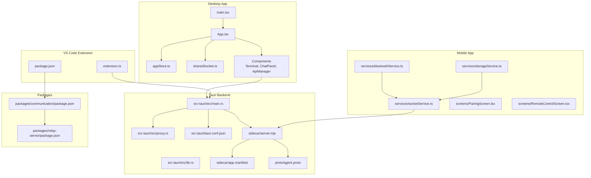
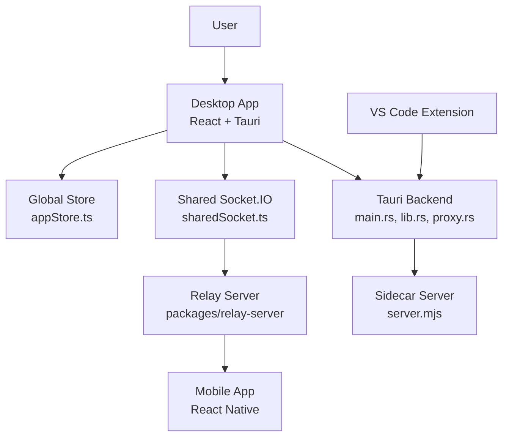
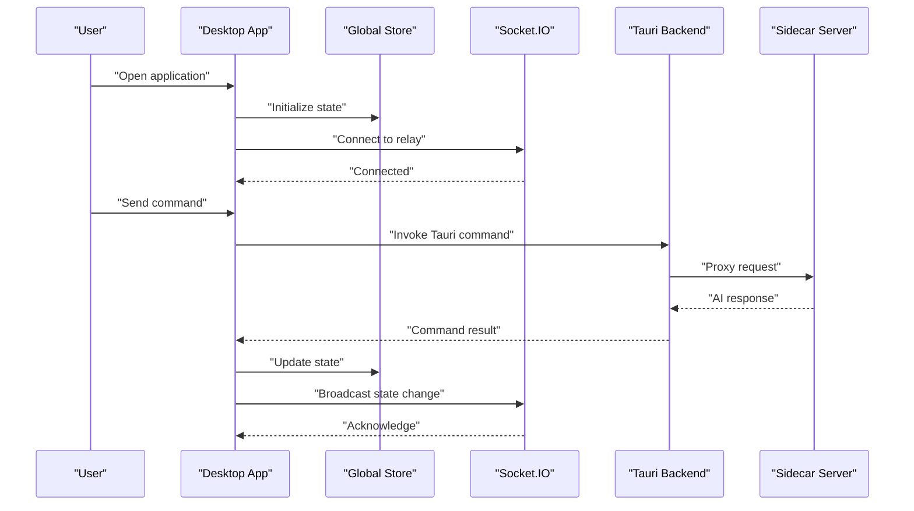
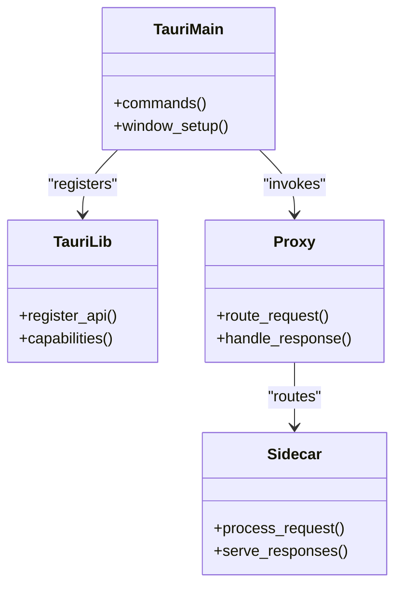
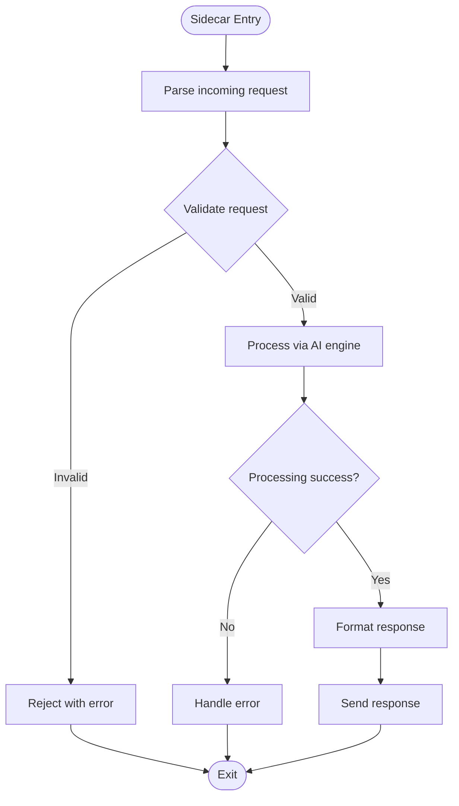
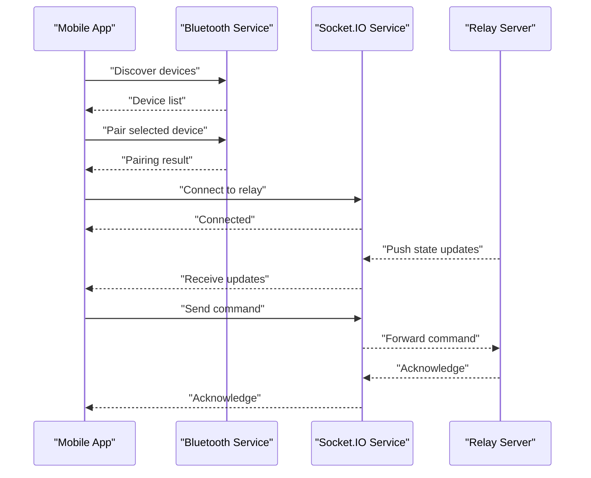
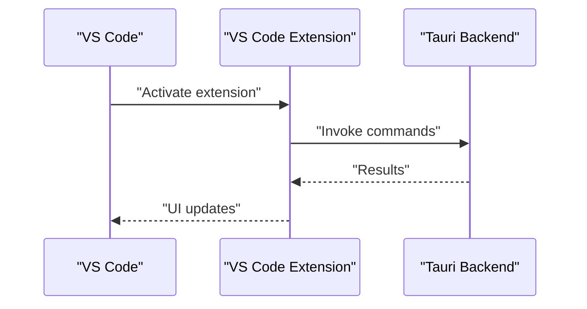
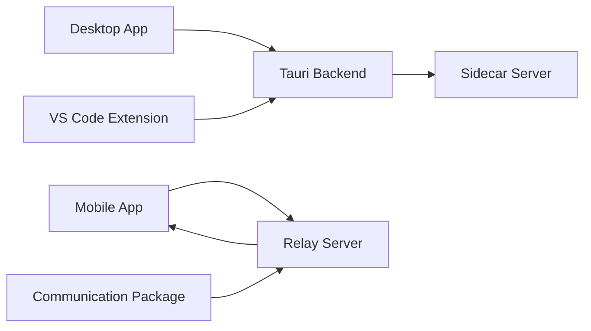

# Component Relationships and Data Flow

<cite>
**Referenced Files in This Document**
- [main.tsx](file://apps/desktop/src/main.tsx)
- [App.tsx](file://apps/desktop/src/App.tsx)
- [appStore.ts](file://apps/desktop/src/stores/appStore.ts)
- [sharedSocket.ts](file://apps/desktop/src/utils/sharedSocket.ts)
- [terminal.ts](file://apps/desktop/src/components/Terminal.tsx)
- [chatPanel.tsx](file://apps/desktop/src/components/ChatPanel.tsx)
- [apiManager.tsx](file://apps/desktop/src/components/ApiManager.tsx)
- [main.rs](file://apps/desktop/src-tauri/src/main.rs)
- [lib.rs](file://apps/desktop/src-tauri/src/lib.rs)
- [proxy.rs](file://apps/desktop/src-tauri/src/proxy.rs)
- [server.mjs](file://apps/desktop/src-tauri/sidecar/server.mjs)
- [app.manifest](file://apps/desktop/src-tauri/sidecar/app.manifest)
- [agent.proto](file://apps/desktop/src-tauri/proto/agent.proto)
- [tauri.conf.json](file://apps/desktop/src-tauri/tauri.conf.json)
- [bluetoothService.ts](file://apps/mobile/src/services/bluetoothService.ts)
- [socketService.ts](file://apps/mobile/src/services/socketService.ts)
- [storageService.ts](file://apps/mobile/src/services/storageService.ts)
- [PairingScreen.tsx](file://apps/mobile/src/screens/PairingScreen.tsx)
- [RemoteControlScreen.tsx](file://apps/mobile/src/screens/RemoteControlScreen.tsx)
- [extension.ts](file://apps/vscode-extension/src/extension.ts)
- [package.json](file://apps/vscode-extension/package.json)
- [communication package.json](file://packages/communication/package.json)
- [relay-server package.json](file://packages/relay-server/package.json)
- [README.md](file://README.md)
</cite>

## Table of Contents
1. [Introduction](#introduction)
2. [Project Structure](#project-structure)
3. [Core Components](#core-components)
4. [Architecture Overview](#architecture-overview)
5. [Detailed Component Analysis](#detailed-component-analysis)
6. [Dependency Analysis](#dependency-analysis)
7. [Performance Considerations](#performance-considerations)
8. [Troubleshooting Guide](#troubleshooting-guide)
9. [Conclusion](#conclusion)

## Introduction
This document explains the component relationships and data flow in GHITA CODING AGENT. It covers how the Tauri desktop application, mobile applications, and VS Code extension interact with each other and with the sidecar server to deliver a unified AI-powered development experience. The focus areas include:
- Communication protocols: Socket.IO messaging, Tauri commands, and state synchronization
- Data flow from user input through the sidecar server to AI processing and back to all connected platforms
- Cross-platform state coordination via the app store and shared services
- Typical user workflows with sequence diagrams
- Error handling, retry mechanisms, and state recovery strategies

## Project Structure
GHITA CODING AGENT is organized as a monorepo with three primary client applications and supporting packages:
- Desktop application built with Tauri and React/Vite
- Mobile application built with React Native
- VS Code extension
- Shared packages for communication, relay server, and other cross-cutting concerns

**Diagram sources**
- [main.tsx:1-50](file://apps/desktop/src/main.tsx#L1-L50)
- [App.tsx:1-100](file://apps/desktop/src/App.tsx#L1-L100)
- [appStore.ts:1-200](file://apps/desktop/src/stores/appStore.ts#L1-L200)
- [sharedSocket.ts:1-120](file://apps/desktop/src/utils/sharedSocket.ts#L1-L120)
- [terminal.ts:1-200](file://apps/desktop/src/components/Terminal.tsx#L1-L200)
- [chatPanel.tsx:1-200](file://apps/desktop/src/components/ChatPanel.tsx#L1-L200)
- [apiManager.tsx:1-200](file://apps/desktop/src/components/ApiManager.tsx#L1-L200)
- [main.rs:1-200](file://apps/desktop/src-tauri/src/main.rs#L1-L200)
- [lib.rs:1-200](file://apps/desktop/src-tauri/src/lib.rs#L1-L200)
- [proxy.rs:1-200](file://apps/desktop/src-tauri/src/proxy.rs#L1-L200)
- [tauri.conf.json:1-200](file://apps/desktop/src-tauri/tauri.conf.json#L1-L200)
- [server.mjs:1-200](file://apps/desktop/src-tauri/sidecar/server.mjs#L1-L200)
- [app.manifest:1-200](file://apps/desktop/src-tauri/sidecar/app.manifest#L1-L200)
- [agent.proto:1-200](file://apps/desktop/src-tauri/proto/agent.proto#L1-L200)
- [bluetoothService.ts:1-200](file://apps/mobile/src/services/bluetoothService.ts#L1-L200)
- [socketService.ts:1-200](file://apps/mobile/src/services/socketService.ts#L1-L200)
- [storageService.ts:1-200](file://apps/mobile/src/services/storageService.ts#L1-L200)
- [PairingScreen.tsx:1-200](file://apps/mobile/src/screens/PairingScreen.tsx#L1-L200)
- [RemoteControlScreen.tsx:1-200](file://apps/mobile/src/screens/RemoteControlScreen.tsx#L1-L200)
- [extension.ts:1-200](file://apps/vscode-extension/src/extension.ts#L1-L200)
- [package.json:1-200](file://apps/vscode-extension/package.json#L1-L200)
- [communication package.json:1-200](file://packages/communication/package.json#L1-L200)
- [relay-server package.json:1-200](file://packages/relay-server/package.json#L1-L200)

**Section sources**
- [main.tsx:1-50](file://apps/desktop/src/main.tsx#L1-L50)
- [App.tsx:1-100](file://apps/desktop/src/App.tsx#L1-L100)
- [tauri.conf.json:1-200](file://apps/desktop/src-tauri/tauri.conf.json#L1-L200)

## Core Components
- Desktop Application (React + Tauri)
  - Entry point initializes the UI and integrates with Tauri backend
  - Centralized state management via a global store
  - Real-time communication through a shared Socket.IO connection
  - Components for terminal, chat panel, and API management
- Tauri Backend
  - Rust-based Tauri runtime exposing commands to the frontend
  - Proxy layer for routing requests to the sidecar server
  - Sidecar server implementation for local AI processing and device control
- Mobile Application (React Native)
  - Bluetooth pairing and remote control workflows
  - Socket.IO client for real-time updates
  - Local storage service for offline state persistence
- VS Code Extension
  - Extension entry point integrating with the desktop backend
  - Package configuration aligning with shared communication packages
- Packages
  - Communication and relay server packages enabling cross-platform connectivity

Key implementation anchors:
- Desktop entry and app composition: [main.tsx:1-50](file://apps/desktop/src/main.tsx#L1-L50), [App.tsx:1-100](file://apps/desktop/src/App.tsx#L1-L100)
- Global state store: [appStore.ts:1-200](file://apps/desktop/src/stores/appStore.ts#L1-L200)
- Shared Socket.IO client: [sharedSocket.ts:1-120](file://apps/desktop/src/utils/sharedSocket.ts#L1-L120)
- Terminal component: [terminal.ts:1-200](file://apps/desktop/src/components/Terminal.tsx#L1-L200)
- Chat panel: [chatPanel.tsx:1-200](file://apps/desktop/src/components/ChatPanel.tsx#L1-L200)
- API manager: [apiManager.tsx:1-200](file://apps/desktop/src/components/ApiManager.tsx#L1-L200)
- Tauri main runtime: [main.rs:1-200](file://apps/desktop/src-tauri/src/main.rs#L1-L200)
- Tauri library: [lib.rs:1-200](file://apps/desktop/src-tauri/src/lib.rs#L1-L200)
- Proxy logic: [proxy.rs:1-200](file://apps/desktop/src-tauri/src/proxy.rs#L1-L200)
- Sidecar server: [server.mjs:1-200](file://apps/desktop/src-tauri/sidecar/server.mjs#L1-L200)
- Sidecar manifest: [app.manifest:1-200](file://apps/desktop/src-tauri/sidecar/app.manifest#L1-L200)
- Protocol buffer definition: [agent.proto:1-200](file://apps/desktop/src-tauri/proto/agent.proto#L1-L200)
- Tauri configuration: [tauri.conf.json:1-200](file://apps/desktop/src-tauri/tauri.conf.json#L1-L200)
- Mobile services: [bluetoothService.ts:1-200](file://apps/mobile/src/services/bluetoothService.ts#L1-L200), [socketService.ts:1-200](file://apps/mobile/src/services/socketService.ts#L1-L200), [storageService.ts:1-200](file://apps/mobile/src/services/storageService.ts#L1-L200)
- Mobile screens: [PairingScreen.tsx:1-200](file://apps/mobile/src/screens/PairingScreen.tsx#L1-L200), [RemoteControlScreen.tsx:1-200](file://apps/mobile/src/screens/RemoteControlScreen.tsx#L1-L200)
- VS Code extension: [extension.ts:1-200](file://apps/vscode-extension/src/extension.ts#L1-L200), [package.json:1-200](file://apps/vscode-extension/package.json#L1-L200)
- Communication packages: [communication package.json:1-200](file://packages/communication/package.json#L1-L200), [relay-server package.json:1-200](file://packages/relay-server/package.json#L1-L200)

**Section sources**
- [main.tsx:1-50](file://apps/desktop/src/main.tsx#L1-L50)
- [App.tsx:1-100](file://apps/desktop/src/App.tsx#L1-L100)
- [appStore.ts:1-200](file://apps/desktop/src/stores/appStore.ts#L1-L200)
- [sharedSocket.ts:1-120](file://apps/desktop/src/utils/sharedSocket.ts#L1-L120)
- [terminal.ts:1-200](file://apps/desktop/src/components/Terminal.tsx#L1-L200)
- [chatPanel.tsx:1-200](file://apps/desktop/src/components/ChatPanel.tsx#L1-L200)
- [apiManager.tsx:1-200](file://apps/desktop/src/components/ApiManager.tsx#L1-L200)
- [main.rs:1-200](file://apps/desktop/src-tauri/src/main.rs#L1-L200)
- [lib.rs:1-200](file://apps/desktop/src-tauri/src/lib.rs#L1-L200)
- [proxy.rs:1-200](file://apps/desktop/src-tauri/src/proxy.rs#L1-L200)
- [server.mjs:1-200](file://apps/desktop/src-tauri/sidecar/server.mjs#L1-L200)
- [app.manifest:1-200](file://apps/desktop/src-tauri/sidecar/app.manifest#L1-L200)
- [agent.proto:1-200](file://apps/desktop/src-tauri/proto/agent.proto#L1-L200)
- [tauri.conf.json:1-200](file://apps/desktop/src-tauri/tauri.conf.json#L1-L200)
- [bluetoothService.ts:1-200](file://apps/mobile/src/services/bluetoothService.ts#L1-L200)
- [socketService.ts:1-200](file://apps/mobile/src/services/socketService.ts#L1-L200)
- [storageService.ts:1-200](file://apps/mobile/src/services/storageService.ts#L1-L200)
- [PairingScreen.tsx:1-200](file://apps/mobile/src/screens/PairingScreen.tsx#L1-L200)
- [RemoteControlScreen.tsx:1-200](file://apps/mobile/src/screens/RemoteControlScreen.tsx#L1-L200)
- [extension.ts:1-200](file://apps/vscode-extension/src/extension.ts#L1-L200)
- [package.json:1-200](file://apps/vscode-extension/package.json#L1-L200)
- [communication package.json:1-200](file://packages/communication/package.json#L1-L200)
- [relay-server package.json:1-200](file://packages/relay-server/package.json#L1-L200)

## Architecture Overview
GHITA CODING AGENT employs a distributed, event-driven architecture:
- Desktop frontend drives user interactions and state
- Tauri backend exposes commands and proxies to the sidecar server
- Sidecar server hosts local AI processing and device control logic
- Mobile app connects via Bluetooth and Socket.IO to receive updates and send commands
- VS Code extension integrates with the desktop backend to extend IDE capabilities
- Shared communication packages enable consistent protocol definitions and relay mechanisms

**Diagram sources**
- [main.tsx:1-50](file://apps/desktop/src/main.tsx#L1-L50)
- [appStore.ts:1-200](file://apps/desktop/src/stores/appStore.ts#L1-L200)
- [sharedSocket.ts:1-120](file://apps/desktop/src/utils/sharedSocket.ts#L1-L120)
- [main.rs:1-200](file://apps/desktop/src-tauri/src/main.rs#L1-L200)
- [lib.rs:1-200](file://apps/desktop/src-tauri/src/lib.rs#L1-L200)
- [proxy.rs:1-200](file://apps/desktop/src-tauri/src/proxy.rs#L1-L200)
- [server.mjs:1-200](file://apps/desktop/src-tauri/sidecar/server.mjs#L1-L200)
- [relay-server package.json:1-200](file://packages/relay-server/package.json#L1-L200)

## Detailed Component Analysis

### Desktop Application
The desktop application initializes the UI and orchestrates state and communication:
- Entry point composes the main application shell
- Global store manages cross-component state
- Shared Socket.IO client maintains persistent connections
- Components encapsulate domain-specific UI and logic

**Diagram sources**
- [main.tsx:1-50](file://apps/desktop/src/main.tsx#L1-L50)
- [appStore.ts:1-200](file://apps/desktop/src/stores/appStore.ts#L1-L200)
- [sharedSocket.ts:1-120](file://apps/desktop/src/utils/sharedSocket.ts#L1-L120)
- [main.rs:1-200](file://apps/desktop/src-tauri/src/main.rs#L1-L200)
- [proxy.rs:1-200](file://apps/desktop/src-tauri/src/proxy.rs#L1-L200)
- [server.mjs:1-200](file://apps/desktop/src-tauri/sidecar/server.mjs#L1-L200)

**Section sources**
- [main.tsx:1-50](file://apps/desktop/src/main.tsx#L1-L50)
- [App.tsx:1-100](file://apps/desktop/src/App.tsx#L1-L100)
- [appStore.ts:1-200](file://apps/desktop/src/stores/appStore.ts#L1-L200)
- [sharedSocket.ts:1-120](file://apps/desktop/src/utils/sharedSocket.ts#L1-L120)
- [terminal.ts:1-200](file://apps/desktop/src/components/Terminal.tsx#L1-L200)
- [chatPanel.tsx:1-200](file://apps/desktop/src/components/ChatPanel.tsx#L1-L200)
- [apiManager.tsx:1-200](file://apps/desktop/src/components/ApiManager.tsx#L1-L200)

### Tauri Backend
The Tauri backend exposes native capabilities to the desktop frontend:
- Main runtime defines window policies and command handlers
- Library module registers APIs and capabilities
- Proxy logic routes requests to the sidecar server
- Configuration governs permissions and capabilities

**Diagram sources**
- [main.rs:1-200](file://apps/desktop/src-tauri/src/main.rs#L1-L200)
- [lib.rs:1-200](file://apps/desktop/src-tauri/src/lib.rs#L1-L200)
- [proxy.rs:1-200](file://apps/desktop/src-tauri/src/proxy.rs#L1-L200)
- [server.mjs:1-200](file://apps/desktop/src-tauri/sidecar/server.mjs#L1-L200)

**Section sources**
- [main.rs:1-200](file://apps/desktop/src-tauri/src/main.rs#L1-L200)
- [lib.rs:1-200](file://apps/desktop/src-tauri/src/lib.rs#L1-L200)
- [proxy.rs:1-200](file://apps/desktop/src-tauri/src/proxy.rs#L1-L200)
- [tauri.conf.json:1-200](file://apps/desktop/src-tauri/tauri.conf.json#L1-L200)

### Sidecar Server
The sidecar server provides local AI processing and device control:
- Implements request handling and response generation
- Uses a manifest to define capabilities
- Defines protocol messages via protobuf

**Diagram sources**
- [server.mjs:1-200](file://apps/desktop/src-tauri/sidecar/server.mjs#L1-L200)
- [app.manifest:1-200](file://apps/desktop/src-tauri/sidecar/app.manifest#L1-L200)
- [agent.proto:1-200](file://apps/desktop/src-tauri/proto/agent.proto#L1-L200)

**Section sources**
- [server.mjs:1-200](file://apps/desktop/src-tauri/sidecar/server.mjs#L1-L200)
- [app.manifest:1-200](file://apps/desktop/src-tauri/sidecar/app.manifest#L1-L200)
- [agent.proto:1-200](file://apps/desktop/src-tauri/proto/agent.proto#L1-L200)

### Mobile Application
The mobile application enables remote control and pairing:
- Bluetooth service handles device discovery and pairing
- Socket.IO service manages real-time communication with the relay
- Storage service persists state locally
- Screens implement pairing and remote control experiences

**Diagram sources**
- [bluetoothService.ts:1-200](file://apps/mobile/src/services/bluetoothService.ts#L1-L200)
- [socketService.ts:1-200](file://apps/mobile/src/services/socketService.ts#L1-L200)
- [storageService.ts:1-200](file://apps/mobile/src/services/storageService.ts#L1-L200)
- [PairingScreen.tsx:1-200](file://apps/mobile/src/screens/PairingScreen.tsx#L1-L200)
- [RemoteControlScreen.tsx:1-200](file://apps/mobile/src/screens/RemoteControlScreen.tsx#L1-L200)
- [relay-server package.json:1-200](file://packages/relay-server/package.json#L1-L200)

**Section sources**
- [bluetoothService.ts:1-200](file://apps/mobile/src/services/bluetoothService.ts#L1-L200)
- [socketService.ts:1-200](file://apps/mobile/src/services/socketService.ts#L1-L200)
- [storageService.ts:1-200](file://apps/mobile/src/services/storageService.ts#L1-L200)
- [PairingScreen.tsx:1-200](file://apps/mobile/src/screens/PairingScreen.tsx#L1-L200)
- [RemoteControlScreen.tsx:1-200](file://apps/mobile/src/screens/RemoteControlScreen.tsx#L1-L200)

### VS Code Extension
The VS Code extension integrates with the desktop backend:
- Extension entry point initializes integration
- Package configuration aligns with shared communication packages

**Diagram sources**
- [extension.ts:1-200](file://apps/vscode-extension/src/extension.ts#L1-L200)
- [package.json:1-200](file://apps/vscode-extension/package.json#L1-L200)
- [communication package.json:1-200](file://packages/communication/package.json#L1-L200)

**Section sources**
- [extension.ts:1-200](file://apps/vscode-extension/src/extension.ts#L1-L200)
- [package.json:1-200](file://apps/vscode-extension/package.json#L1-L200)
- [communication package.json:1-200](file://packages/communication/package.json#L1-L200)

## Dependency Analysis
The system exhibits layered dependencies:
- Desktop depends on Tauri backend for native capabilities and on the sidecar server for AI processing
- Mobile depends on the relay server for cross-device synchronization
- VS Code extension depends on Tauri backend for IDE integration
- Shared packages define communication standards and relay behavior

**Diagram sources**
- [main.rs:1-200](file://apps/desktop/src-tauri/src/main.rs#L1-L200)
- [server.mjs:1-200](file://apps/desktop/src-tauri/sidecar/server.mjs#L1-L200)
- [relay-server package.json:1-200](file://packages/relay-server/package.json#L1-L200)
- [communication package.json:1-200](file://packages/communication/package.json#L1-L200)

**Section sources**
- [main.rs:1-200](file://apps/desktop/src-tauri/src/main.rs#L1-L200)
- [server.mjs:1-200](file://apps/desktop/src-tauri/sidecar/server.mjs#L1-L200)
- [relay-server package.json:1-200](file://packages/relay-server/package.json#L1-L200)
- [communication package.json:1-200](file://packages/communication/package.json#L1-L200)

## Performance Considerations
- Minimize round-trips by batching Socket.IO events and deferring non-critical updates
- Use debounced input handlers in components to reduce unnecessary command invocations
- Cache frequently accessed state in the global store to avoid repeated fetches
- Offload heavy computations to the sidecar server to keep the UI responsive
- Employ lazy loading for components and screens to reduce initial load time

## Troubleshooting Guide
Common issues and recovery strategies:
- Socket.IO disconnections
  - Implement exponential backoff and reconnection retries
  - Persist pending actions and replay upon reconnection
- Tauri command failures
  - Log errors with context and surface actionable messages to the UI
  - Fallback to cached state while attempting recovery
- Sidecar server unavailability
  - Gracefully degrade functionality and notify users
  - Retry with jitter to prevent thundering herd effects
- Mobile pairing failures
  - Clear stale pairing data and restart discovery
  - Validate Bluetooth permissions and network conditions
- State inconsistencies
  - Use optimistic updates with eventual consistency
  - Implement conflict resolution strategies for concurrent edits

## Conclusion
GHITA CODING AGENT’s architecture integrates a Tauri-powered desktop application, a mobile app, and a VS Code extension around a shared sidecar server and relay infrastructure. The system emphasizes real-time communication, centralized state management, and cross-platform consistency. By leveraging Socket.IO, Tauri commands, and shared protocols, it delivers a cohesive development experience across devices while maintaining robust error handling and recovery mechanisms.