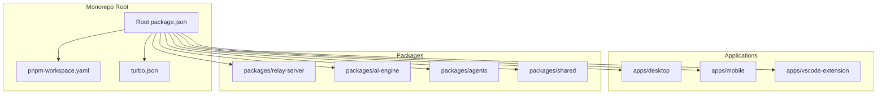
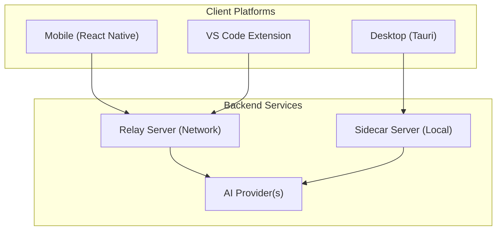
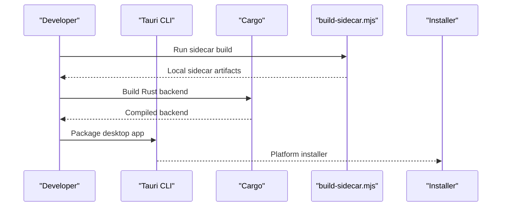
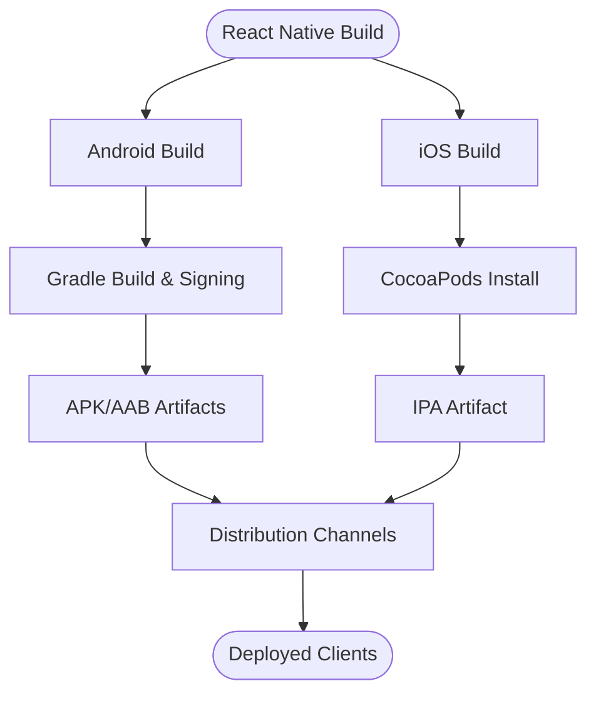
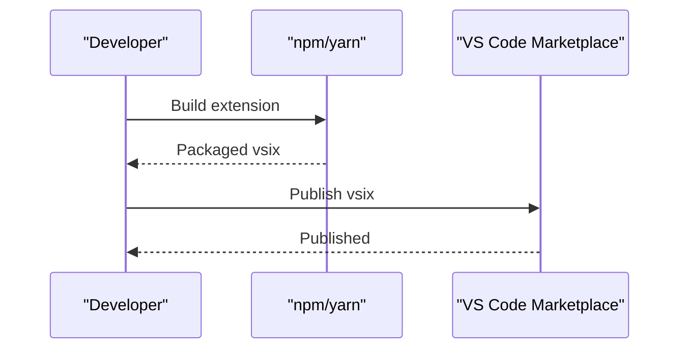
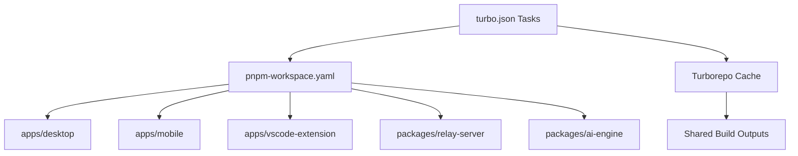
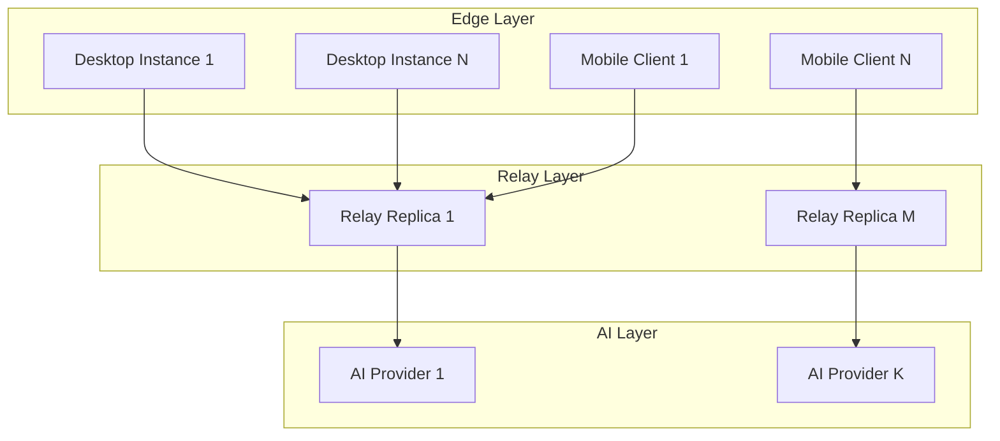
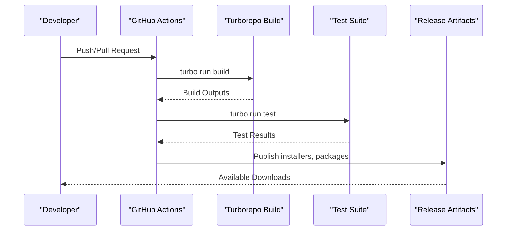
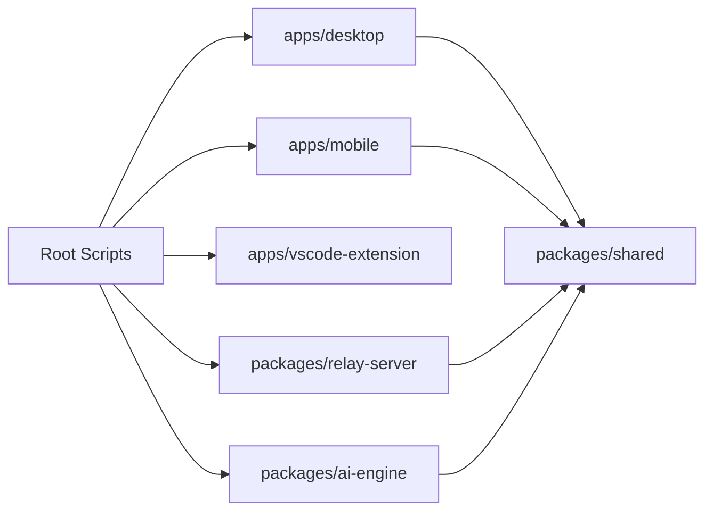

# Deployment Architecture and Scalability

<cite>
**Referenced Files in This Document**
- [turbo.json](file://turbo.json)
- [pnpm-workspace.yaml](file://pnpm-workspace.yaml)
- [package.json](file://package.json)
- [apps/desktop/package.json](file://apps/desktop/package.json)
- [apps/desktop/vite.config.ts](file://apps/desktop/vite.config.ts)
- [apps/desktop/src-tauri/tauri.conf.json](file://apps/desktop/src-tauri/tauri.conf.json)
- [apps/desktop/src-tauri/Cargo.toml](file://apps/desktop/src-tauri/Cargo.toml)
- [apps/desktop/scripts/build-sidecar.mjs](file://apps/desktop/scripts/build-sidecar.mjs)
- [apps/mobile/android/app/src/main/AndroidManifest.xml](file://apps/mobile/android/app/src/main/AndroidManifest.xml)
- [apps/mobile/ios/GhitaMobile/AppDelegate.mm](file://apps/mobile/ios/GhitaMobile/AppDelegate.mm)
- [apps/mobile/package.json](file://apps/mobile/package.json)
- [apps/mobile/react-native.config.js](file://apps/mobile/react-native.config.js)
- [apps/vscode-extension/package.json](file://apps/vscode-extension/package.json)
- [apps/vscode-extension/src/extension.ts](file://apps/vscode-extension/src/extension.ts)
- [packages/relay-server/package.json](file://packages/relay-server/package.json)
- [packages/ai-engine/package.json](file://packages/ai-engine/package.json)
- [.github/workflows](file://.github/workflows)
- [tests/e2e/e2e-integration.test.ts](file://tests/e2e/e2e-integration.test.ts)
- [tests/unit](file://tests/unit)
- [README.md](file://README.md)
</cite>

## Table of Contents
1. [Introduction](#introduction)
2. [Project Structure](#project-structure)
3. [Core Components](#core-components)
4. [Architecture Overview](#architecture-overview)
5. [Detailed Component Analysis](#detailed-component-analysis)
6. [Dependency Analysis](#dependency-analysis)
7. [Performance Considerations](#performance-considerations)
8. [Troubleshooting Guide](#troubleshooting-guide)
9. [Conclusion](#conclusion)
10. [Appendices](#appendices)

## Introduction
This document describes the deployment architecture and scalability considerations for GHITA CODING AGENT. It covers multi-platform deployment strategies for the desktop (Tauri), mobile (React Native), and VS Code extension, alongside the build system orchestrated by Turborepo, asset management, and distribution channels. It also outlines the scalability architecture for the sidecar server, relay server, and AI provider integration, including infrastructure requirements, containerization, cloud deployment options, load balancing, failover, monitoring, CI/CD, automated testing, release management, security, and performance optimization.

## Project Structure
The repository follows a monorepo layout managed by Turborepo and pnpm workspaces. Applications and packages are organized under dedicated directories, with platform-specific build configurations and native integrations.

**Diagram sources**
- [turbo.json](file://turbo.json)
- [pnpm-workspace.yaml](file://pnpm-workspace.yaml)
- [package.json](file://package.json)

**Section sources**
- [turbo.json](file://turbo.json)
- [pnpm-workspace.yaml](file://pnpm-workspace.yaml)
- [package.json](file://package.json)

## Core Components
- Desktop Application (Tauri): Cross-platform desktop client with Rust backend and TypeScript frontend. Includes a sidecar server and native OS integrations.
- Mobile Application (React Native): Android and iOS builds with Bluetooth connectivity and remote control features.
- VS Code Extension: A lightweight extension packaged via npm/yarn tools.
- Relay Server: A package intended to mediate connections between clients and AI providers.
- AI Engine: A package encapsulating AI provider integrations and inference logic.
- Shared Packages: Common utilities and types used across applications.

Key deployment artifacts and configurations:
- Desktop: Tauri configuration, Cargo manifest, sidecar build script.
- Mobile: Android and iOS native manifests and build configs.
- VS Code Extension: Package metadata and entry point.
- Build Orchestration: Turborepo tasks and pnpm workspace definitions.

**Section sources**
- [apps/desktop/src-tauri/tauri.conf.json](file://apps/desktop/src-tauri/tauri.conf.json)
- [apps/desktop/src-tauri/Cargo.toml](file://apps/desktop/src-tauri/Cargo.toml)
- [apps/desktop/scripts/build-sidecar.mjs](file://apps/desktop/scripts/build-sidecar.mjs)
- [apps/mobile/android/app/src/main/AndroidManifest.xml](file://apps/mobile/android/app/src/main/AndroidManifest.xml)
- [apps/mobile/ios/GhitaMobile/AppDelegate.mm](file://apps/mobile/ios/GhitaMobile/AppDelegate.mm)
- [apps/mobile/react-native.config.js](file://apps/mobile/react-native.config.js)
- [apps/vscode-extension/package.json](file://apps/vscode-extension/package.json)
- [packages/relay-server/package.json](file://packages/relay-server/package.json)
- [packages/ai-engine/package.json](file://packages/ai-engine/package.json)

## Architecture Overview
The GHITA CODING AGENT system comprises three primary client platforms and supporting backend services. The desktop app runs a local sidecar server for device control and screen capture, while the mobile app connects remotely via a relay server. The AI engine integrates with external AI providers through a pluggable interface. Turborepo coordinates builds and caching across all packages.

**Diagram sources**
- [apps/desktop/src-tauri/tauri.conf.json](file://apps/desktop/src-tauri/tauri.conf.json)
- [apps/desktop/scripts/build-sidecar.mjs](file://apps/desktop/scripts/build-sidecar.mjs)
- [packages/relay-server/package.json](file://packages/relay-server/package.json)
- [packages/ai-engine/package.json](file://packages/ai-engine/package.json)

## Detailed Component Analysis

### Desktop Application (Tauri) Deployment
- Build and Packaging:
  - Tauri configuration defines window behavior, security policies, and bundle targets.
  - Cargo manifest governs Rust backend compilation and dependencies.
  - Sidecar build script prepares auxiliary binaries/services bundled with the desktop app.
- Asset Management:
  - Vite configuration supports frontend bundling and development server.
  - Icons and resources are organized under the Tauri assets directory.
- Distribution Channels:
  - Tauri generates platform-specific installers (Windows, macOS, Linux) suitable for direct distribution or app stores.

**Diagram sources**
- [apps/desktop/src-tauri/tauri.conf.json](file://apps/desktop/src-tauri/tauri.conf.json)
- [apps/desktop/src-tauri/Cargo.toml](file://apps/desktop/src-tauri/Cargo.toml)
- [apps/desktop/scripts/build-sidecar.mjs](file://apps/desktop/scripts/build-sidecar.mjs)
- [apps/desktop/vite.config.ts](file://apps/desktop/vite.config.ts)

**Section sources**
- [apps/desktop/src-tauri/tauri.conf.json](file://apps/desktop/src-tauri/tauri.conf.json)
- [apps/desktop/src-tauri/Cargo.toml](file://apps/desktop/src-tauri/Cargo.toml)
- [apps/desktop/scripts/build-sidecar.mjs](file://apps/desktop/scripts/build-sidecar.mjs)
- [apps/desktop/vite.config.ts](file://apps/desktop/vite.config.ts)

### Mobile Application (React Native) Deployment
- Android:
  - Android manifest defines permissions, activities, and app icon sets.
  - Gradle build files manage dependencies and signing.
- iOS:
  - Objective-C++ AppDelegate initializes the RN runtime and native modules.
  - Xcode project configuration and Podfile handle CocoaPods dependencies.
- Build Orchestration:
  - React Native config ties native modules into the JS bundling process.

**Diagram sources**
- [apps/mobile/android/app/src/main/AndroidManifest.xml](file://apps/mobile/android/app/src/main/AndroidManifest.xml)
- [apps/mobile/ios/GhitaMobile/AppDelegate.mm](file://apps/mobile/ios/GhitaMobile/AppDelegate.mm)
- [apps/mobile/react-native.config.js](file://apps/mobile/react-native.config.js)

**Section sources**
- [apps/mobile/android/app/src/main/AndroidManifest.xml](file://apps/mobile/android/app/src/main/AndroidManifest.xml)
- [apps/mobile/ios/GhitaMobile/AppDelegate.mm](file://apps/mobile/ios/GhitaMobile/AppDelegate.mm)
- [apps/mobile/react-native.config.js](file://apps/mobile/react-native.config.js)

### VS Code Extension Packaging
- Packaging Metadata:
  - Package manifest defines activation events, main entry point, and bundled resources.
- Distribution:
  - Extensions are published to marketplace channels via npm/yarn tooling.

**Diagram sources**
- [apps/vscode-extension/package.json](file://apps/vscode-extension/package.json)
- [apps/vscode-extension/src/extension.ts](file://apps/vscode-extension/src/extension.ts)

**Section sources**
- [apps/vscode-extension/package.json](file://apps/vscode-extension/package.json)
- [apps/vscode-extension/src/extension.ts](file://apps/vscode-extension/src/extension.ts)

### Build System Orchestration with Turborepo
- Task Graph Execution:
  - Turborepo coordinates builds, tests, lint, and cache invalidation across applications and packages.
- Workspace Definition:
  - pnpm-workspace.yaml enumerates all packages and apps included in the monorepo.
- Root Scripts:
  - Root package.json scripts define top-level commands for building, testing, and releasing.

**Diagram sources**
- [turbo.json](file://turbo.json)
- [pnpm-workspace.yaml](file://pnpm-workspace.yaml)
- [package.json](file://package.json)

**Section sources**
- [turbo.json](file://turbo.json)
- [pnpm-workspace.yaml](file://pnpm-workspace.yaml)
- [package.json](file://package.json)

### Scalability Architecture
- Sidecar Server:
  - Runs locally on the desktop host to enable device control and screen capture.
  - Designed for low-latency, local-first operation; scales horizontally by adding more desktop instances.
- Relay Server:
  - Mediates network connections between mobile clients and AI providers.
  - Scales via horizontal pod autoscaling and load balancing across replicas.
- AI Provider Integration:
  - Pluggable adapter pattern allows switching providers and scaling out per provider capacity.
  - Rate limiting and circuit breakers prevent cascading failures.

**Diagram sources**
- [packages/relay-server/package.json](file://packages/relay-server/package.json)
- [packages/ai-engine/package.json](file://packages/ai-engine/package.json)

**Section sources**
- [packages/relay-server/package.json](file://packages/relay-server/package.json)
- [packages/ai-engine/package.json](file://packages/ai-engine/package.json)

### Infrastructure Requirements, Containerization, and Cloud Deployment
- Infrastructure:
  - Stateless relay servers behind a load balancer; persistent sidecar state kept on desktop hosts.
  - AI provider APIs accessed over HTTPS with retry/backoff and quotas.
- Containerization:
  - Relay server packaged as container images; sidecar runs as a native service on desktops.
- Cloud Options:
  - Kubernetes clusters for relay autoscaling; cloud-hosted AI providers for inference.
  - CDN for distributing desktop installers and mobile app updates.

[No sources needed since this section provides general guidance]

### Load Balancing, Failover, and Monitoring
- Load Balancing:
  - Round-robin or health-checked routing across relay replicas; sticky sessions for long-running sessions if needed.
- Failover:
  - Automatic failover to healthy replicas; circuit breaker for unhealthy AI providers.
- Monitoring:
  - Metrics for relay latency, throughput, and error rates; logs for sidecar and mobile client diagnostics.

[No sources needed since this section provides general guidance]

### CI/CD Pipeline Integration, Automated Testing, and Release Management
- CI/CD:
  - GitHub Actions workflows orchestrate builds, tests, and releases for all platforms.
- Automated Testing:
  - Unit tests, integration tests, and end-to-end tests integrated into the pipeline.
- Release Management:
  - Versioned releases tagged and published to respective channels (desktop installers, app stores, npm, VS Code Marketplace).

**Diagram sources**
- [.github/workflows](file://.github/workflows)
- [turbo.json](file://turbo.json)

**Section sources**
- [.github/workflows](file://.github/workflows)
- [turbo.json](file://turbo.json)
- [tests/e2e/e2e-integration.test.ts](file://tests/e2e/e2e-integration.test.ts)
- [tests/unit](file://tests/unit)

### Security Considerations for Production Deployments
- Transport Security:
  - TLS termination at load balancers; encrypted channels between clients and relay servers.
- Secrets Management:
  - Environment variables and secret managers for API keys and tokens.
- Access Control:
  - Device pairing and session tokens; rate limiting and IP allowlists for relay endpoints.
- Audit Logging:
  - Comprehensive logs for authentication, authorization, and sensitive operations.

[No sources needed since this section provides general guidance]

### Performance Optimization Strategies
- Build Optimization:
  - Turborepo caching, incremental builds, and parallel task execution.
- Runtime Optimization:
  - Lazy loading for desktop and mobile; efficient AI provider batching and caching.
- Network Optimization:
  - Compression, connection pooling, and adaptive bitrate streaming for media-heavy features.

[No sources needed since this section provides general guidance]

## Dependency Analysis
The monorepo’s dependency graph spans applications and packages, with Turborepo managing task execution order and caching.

**Diagram sources**
- [turbo.json](file://turbo.json)
- [pnpm-workspace.yaml](file://pnpm-workspace.yaml)
- [package.json](file://package.json)

**Section sources**
- [turbo.json](file://turbo.json)
- [pnpm-workspace.yaml](file://pnpm-workspace.yaml)
- [package.json](file://package.json)

## Performance Considerations
- Build Performance:
  - Leverage Turborepo caching and task partitioning to minimize rebuild times.
- Runtime Performance:
  - Optimize desktop and mobile resource usage; reduce sidecar overhead.
- Network Performance:
  - Use connection reuse and compression; batch AI requests to reduce latency.

[No sources needed since this section provides general guidance]

## Troubleshooting Guide
- Desktop Issues:
  - Verify Tauri configuration and sidecar build script outputs.
- Mobile Issues:
  - Confirm Android/iOS manifests and RN config alignment.
- Extension Issues:
  - Validate package metadata and activation events.
- CI/CD Issues:
  - Review workflow logs and Turborepo cache invalidation.

**Section sources**
- [apps/desktop/src-tauri/tauri.conf.json](file://apps/desktop/src-tauri/tauri.conf.json)
- [apps/desktop/scripts/build-sidecar.mjs](file://apps/desktop/scripts/build-sidecar.mjs)
- [apps/mobile/android/app/src/main/AndroidManifest.xml](file://apps/mobile/android/app/src/main/AndroidManifest.xml)
- [apps/mobile/ios/GhitaMobile/AppDelegate.mm](file://apps/mobile/ios/GhitaMobile/AppDelegate.mm)
- [apps/vscode-extension/package.json](file://apps/vscode-extension/package.json)
- [.github/workflows](file://.github/workflows)

## Conclusion
GHITA CODING AGENT employs a scalable, multi-platform architecture with a Tauri desktop app, React Native mobile clients, and a VS Code extension. Turborepo orchestrates builds and tests across the monorepo, while the relay server and AI provider integrations support horizontal scaling. Production deployments benefit from containerization, cloud hosting, robust monitoring, and CI/CD automation. Security and performance best practices ensure reliable operation at scale.

[No sources needed since this section summarizes without analyzing specific files]

## Appendices
- Additional Resources:
  - Refer to the root README for project context and contribution guidelines.

**Section sources**
- [README.md](file://README.md)