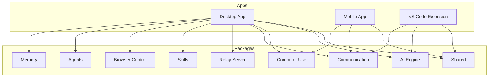
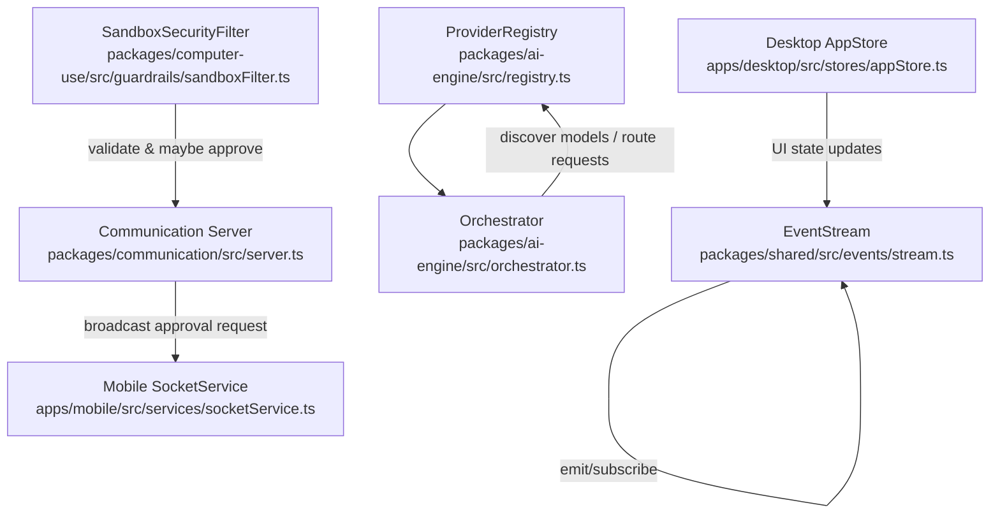
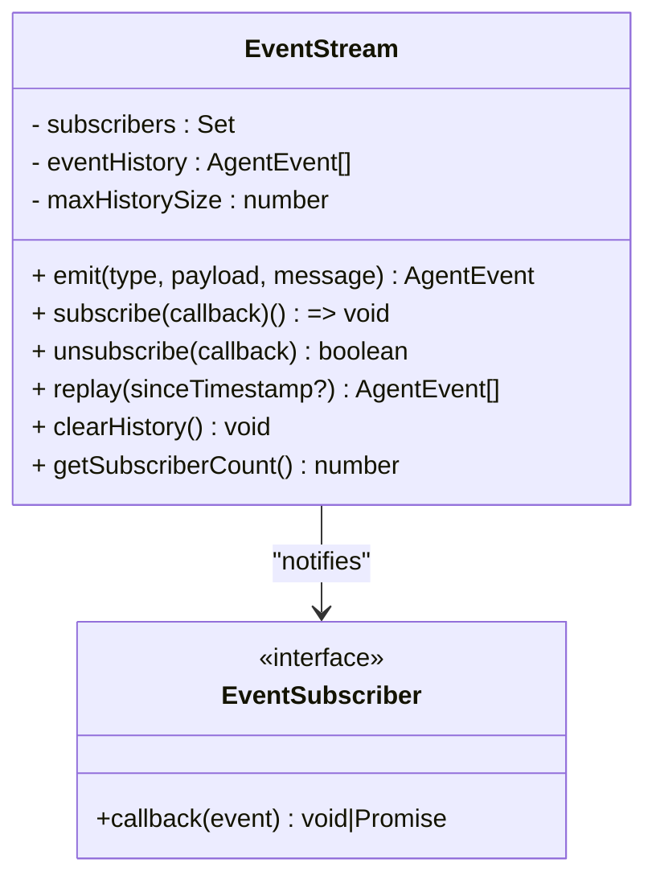
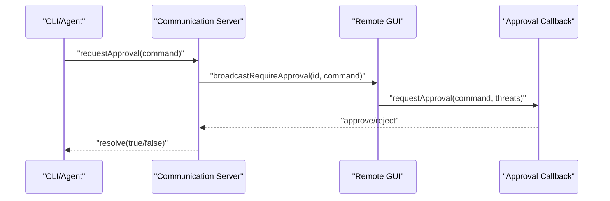
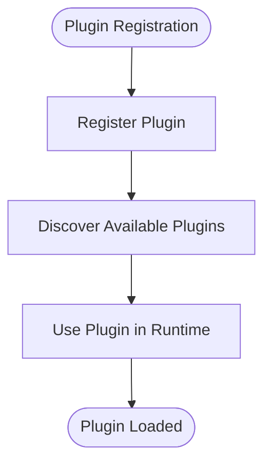
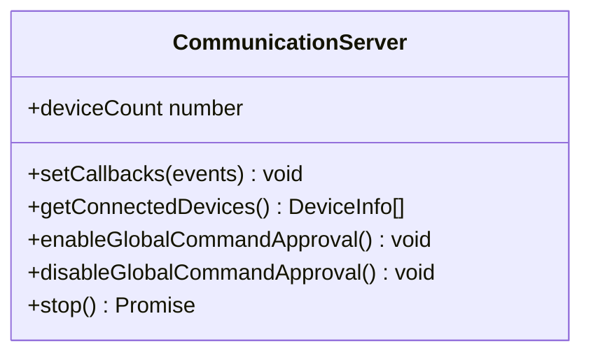
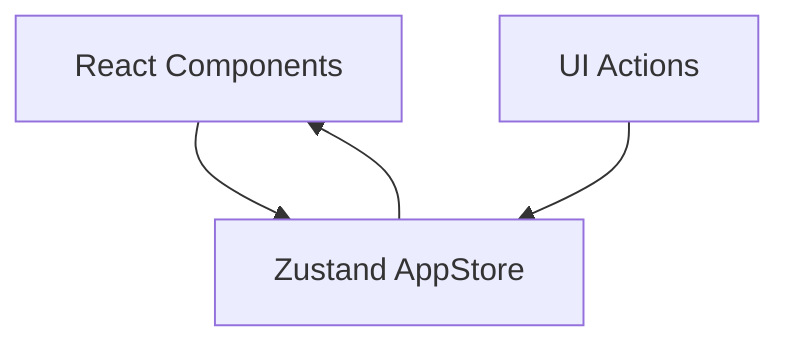
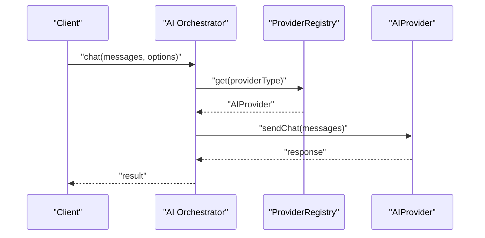
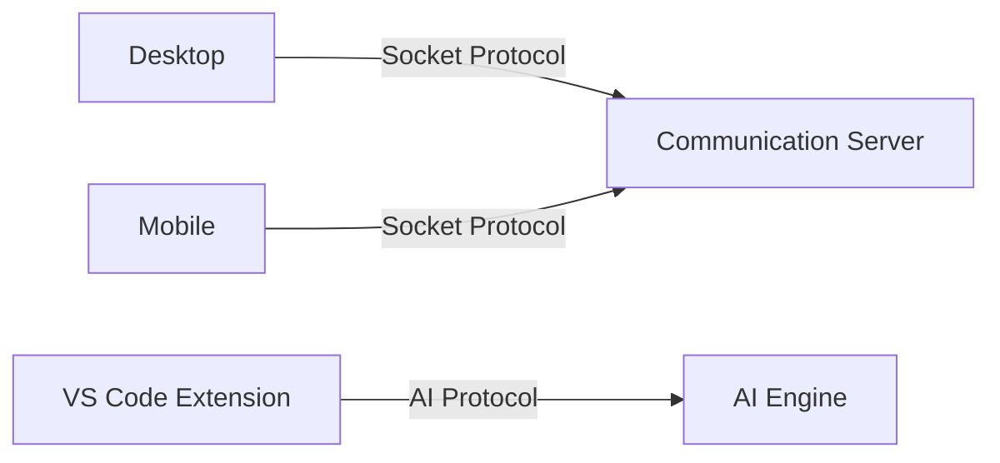
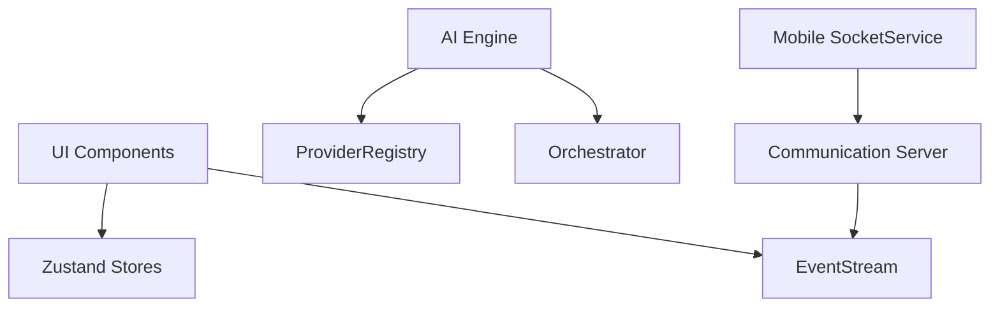

# Design Patterns and Architectural Principles

<cite>
**Referenced Files in This Document**
- [stream.ts](file://packages/shared/src/events/stream.ts)
- [registry.ts](file://packages/ai-engine/src/registry.ts)
- [orchestrator.ts](file://packages/ai-engine/src/orchestrator.ts)
- [sandboxFilter.ts](file://packages/computer-use/src/guardrails/sandboxFilter.ts)
- [server.ts](file://packages/communication/src/server.ts)
- [socketService.ts](file://apps/mobile/src/services/socketService.ts)
- [appStore.ts](file://apps/desktop/src/stores/appStore.ts)
- [phase7-agentic.test.ts](file://tests/unit/phase7-agentic.test.ts)
- [phase5-platform.test.ts](file://tests/unit/phase5-platform.test.ts)
- [README.md](file://README.md)
</cite>

## Table of Contents
1. [Introduction](#introduction)
2. [Project Structure](#project-structure)
3. [Core Components](#core-components)
4. [Architecture Overview](#architecture-overview)
5. [Detailed Component Analysis](#detailed-component-analysis)
6. [Dependency Analysis](#dependency-analysis)
7. [Performance Considerations](#performance-considerations)
8. [Troubleshooting Guide](#troubleshooting-guide)
9. [Conclusion](#conclusion)

## Introduction
This document explains the design patterns and architectural principles used in GHITA CODING AGENT. It focuses on observable real-time updates via an event stream, a factory-style provider registry for AI services, a centralized command approval mechanism spanning platforms, and a plugin-based extensibility system. It also covers the modular monorepo architecture, component-based UI design, service-oriented backend design, state management with Zustand, the command pattern for AI operations, and separation of concerns across platforms. Concrete examples from the codebase illustrate how these patterns are implemented and why they improve maintainability, scalability, and cross-platform consistency.

## Project Structure
GHITA CODING AGENT is organized as a monorepo with multiple applications and shared packages:
- apps: Desktop, Mobile, and VS Code Extension frontends
- packages: Shared libraries and domain-specific packages (ai-engine, computer-use, communication, relay-server, memory, skills, browser-control, agents, shared)
- tests: Unit, integration, and quality loop tests validating platform behavior and cross-device coordination



**Section sources**
- [README.md](file://README.md)

## Core Components
This section highlights the primary building blocks and the design patterns they embody.

- Observer Pattern (Real-time Updates)
  - Implemented via an event stream that emits typed events and notifies subscribers asynchronously. Subscribers receive events sequentially and errors are logged centrally, ensuring robust real-time updates across platforms.
  - Example: [EventStream.emit:22-47](file://packages/shared/src/events/stream.ts#L22-L47), [EventStream.subscribe:52-57](file://packages/shared/src/events/stream.ts#L52-L57)

- Factory Pattern (AI Provider Management)
  - A registry manages AI providers keyed by type, enabling dynamic registration, retrieval, and health checks. Providers are instantiated from configuration and can be queried for readiness and metadata.
  - Example: [ProviderRegistry.registerFromConfig:23-27](file://packages/ai-engine/src/registry.ts#L23-L27), [ProviderRegistry.get:30-32](file://packages/ai-engine/src/registry.ts#L30-L32), [ProviderRegistry.getStatus:60-72](file://packages/ai-engine/src/registry.ts#L60-L72)

- Singleton Pattern (Centralized Command Approval)
  - A global approval handler is exposed to coordinate command approval across platforms. The communication server sets up handlers and resolves approvals received from remote devices, ensuring consistent policy enforcement.
  - Example: [enableGlobalCommandApproval:328-340](file://packages/communication/src/server.ts#L328-L340), [approveCommandHandler hook usage:140-143](file://tests/unit/phase7-agentic.test.ts#L140-L143)

- Plugin-Based Extensibility
  - Plugins are managed via registries that support registration, discovery, and lifecycle operations. This enables modular addition of features without altering core logic.
  - Example: [Plugin registry pattern](file://packages/shared/src/plugins/registry.ts)

- Service-Oriented Backend
  - Services such as the communication server expose well-defined APIs for device connectivity, approval orchestration, and device lifecycle management.
  - Example: [Communication server public API:375-399](file://packages/communication/src/server.ts#L375-L399)

- Component-Based UI Design
  - UIs are composed of reusable React components organized per app, with hooks and stores managing state and cross-component coordination.
  - Example: [Desktop stores](file://apps/desktop/src/stores/appStore.ts)

- State Management with Zustand
  - Centralized state stores encapsulate UI and application state, enabling predictable updates and easy testing.
  - Example: [App store](file://apps/desktop/src/stores/appStore.ts)

- Command Pattern for AI Operations
  - AI operations are orchestrated through a central orchestrator that discovers models, routes requests, caches semantic prompts, and executes chats with fallback strategies.
  - Example: [Orchestrator.chat:172-175](file://packages/ai-engine/src/orchestrator.ts#L172-L175), [Model discovery:145-158](file://packages/ai-engine/src/orchestrator.ts#L145-L158)

- Separation of Concerns Across Platforms
  - Platform-specific implementations (desktop, mobile, extension) share common protocols and services while adapting UI and connectivity to platform constraints.
  - Example: [Mobile socket service:80-111](file://apps/mobile/src/services/socketService.ts#L80-L111), [Platform tests](file://tests/unit/phase5-platform.test.ts)

**Section sources**
- [stream.ts:1-91](file://packages/shared/src/events/stream.ts#L1-L91)
- [registry.ts:1-72](file://packages/ai-engine/src/registry.ts#L1-L72)
- [orchestrator.ts:101-175](file://packages/ai-engine/src/orchestrator.ts#L101-L175)
- [sandboxFilter.ts:403-405](file://packages/computer-use/src/guardrails/sandboxFilter.ts#L403-L405)
- [server.ts:328-340](file://packages/communication/src/server.ts#L328-L340)
- [socketService.ts:80-111](file://apps/mobile/src/services/socketService.ts#L80-L111)
- [appStore.ts](file://apps/desktop/src/stores/appStore.ts)
- [phase7-agentic.test.ts:128-152](file://tests/unit/phase7-agentic.test.ts#L128-L152)
- [phase5-platform.test.ts](file://tests/unit/phase5-platform.test.ts)

## Architecture Overview
The system follows a modular monorepo architecture with clear boundaries between UI, services, and shared infrastructure. Real-time updates propagate through an event stream; AI operations are routed via a provider registry and orchestrator; command approval is centralized; and platform-specific adapters handle connectivity and UI.



**Diagram sources**
- [stream.ts:1-91](file://packages/shared/src/events/stream.ts#L1-L91)
- [registry.ts:1-72](file://packages/ai-engine/src/registry.ts#L1-L72)
- [orchestrator.ts:101-175](file://packages/ai-engine/src/orchestrator.ts#L101-L175)
- [sandboxFilter.ts:403-405](file://packages/computer-use/src/guardrails/sandboxFilter.ts#L403-L405)
- [server.ts:328-340](file://packages/communication/src/server.ts#L328-L340)
- [socketService.ts:80-111](file://apps/mobile/src/services/socketService.ts#L80-L111)
- [appStore.ts](file://apps/desktop/src/stores/appStore.ts)

## Detailed Component Analysis

### Observer Pattern: Event Stream
The event stream provides publish-subscribe semantics for real-time notifications. Events include a unique ID, type, payload, timestamp, and optional message. Subscribers are notified sequentially, and errors are logged centrally. Historical events are retained with a configurable cap and can be replayed.



**Diagram sources**
- [stream.ts:10-91](file://packages/shared/src/events/stream.ts#L10-L91)

**Section sources**
- [stream.ts:19-47](file://packages/shared/src/events/stream.ts#L19-L47)

### Factory Pattern: AI Provider Registry
The provider registry registers AI providers by type and exposes methods to retrieve, list, and validate providers. It supports dynamic creation from configuration and exposes readiness checks across all providers.

```mermaid
classDiagram
class ProviderRegistry {
- providers : Map<AIProviderType, AIProvider>
+ register(provider) void
+ registerFromConfig(config) AIProvider
+ get(type) AIProvider?
+ getAll() AIProvider[]
+ getTypes() AIProviderType[]
+ has(type) boolean
+ remove(type) boolean
+ clear() void
+ getStatus() Promise<{type,name,ready}[]>
}
```

**Diagram sources**
- [registry.ts:14-72](file://packages/ai-engine/src/registry.ts#L14-L72)

**Section sources**
- [registry.ts:17-27](file://packages/ai-engine/src/registry.ts#L17-L27)

### Singleton Pattern: Centralized Command Approval
A global approval handler is installed to coordinate command approval across platforms. The communication server broadcasts approval requests and resolves them upon receiving responses from remote devices.



**Diagram sources**
- [server.ts:328-340](file://packages/communication/src/server.ts#L328-L340)
- [sandboxFilter.ts:507-511](file://packages/computer-use/src/guardrails/sandboxFilter.ts#L507-L511)

**Section sources**
- [server.ts:328-340](file://packages/communication/src/server.ts#L328-L340)
- [sandboxFilter.ts:403-405](file://packages/computer-use/src/guardrails/sandboxFilter.ts#L403-L405)
- [phase7-agentic.test.ts:138-152](file://tests/unit/phase7-agentic.test.ts#L138-L152)

### Plugin-Based Extensibility System
Plugins are managed via registries that support registration and discovery. This pattern allows adding new capabilities without modifying core logic, promoting modularity and testability.



[No sources needed since this diagram shows conceptual workflow, not actual code structure]

**Section sources**
- [README.md](file://README.md)

### Service-Oriented Backend: Communication Server
The communication server exposes APIs for device lifecycle management, broadcasting approval requests, and coordinating global approval handlers. It maintains connected devices and cleans up resources on shutdown.



**Diagram sources**
- [server.ts:375-399](file://packages/communication/src/server.ts#L375-L399)

**Section sources**
- [server.ts:302-323](file://packages/communication/src/server.ts#L302-L323)
- [server.ts:328-340](file://packages/communication/src/server.ts#L328-L340)

### Component-Based UI Design and Zustand State Management
The desktop app uses a Zustand store to manage application state, enabling predictable updates and easy testing. Components consume state via hooks and dispatch actions to update global state.



[No sources needed since this diagram shows conceptual workflow, not actual code structure]

**Section sources**
- [appStore.ts](file://apps/desktop/src/stores/appStore.ts)

### Command Pattern for AI Operations
The orchestrator coordinates AI operations: discovering models, selecting providers, caching semantic prompts, and executing chats with fallback strategies. This encapsulates the command execution flow and improves testability and maintainability.



**Diagram sources**
- [orchestrator.ts:172-175](file://packages/ai-engine/src/orchestrator.ts#L172-L175)
- [registry.ts:30-32](file://packages/ai-engine/src/registry.ts#L30-L32)

**Section sources**
- [orchestrator.ts:145-158](file://packages/ai-engine/src/orchestrator.ts#L145-L158)
- [orchestrator.ts:165-170](file://packages/ai-engine/src/orchestrator.ts#L165-L170)

### Separation of Concerns Across Platforms
Platform-specific implementations adapt to constraints while sharing common protocols and services. The mobile app connects to the desktop server via a socket service, and platform tests validate cross-device behavior.



**Diagram sources**
- [socketService.ts:80-111](file://apps/mobile/src/services/socketService.ts#L80-L111)
- [server.ts:375-399](file://packages/communication/src/server.ts#L375-L399)

**Section sources**
- [socketService.ts:80-111](file://apps/mobile/src/services/socketService.ts#L80-L111)
- [phase5-platform.test.ts](file://tests/unit/phase5-platform.test.ts)

## Dependency Analysis
The system exhibits low coupling and high cohesion:
- UI components depend on stores and shared event streams
- AI engine depends on provider registry and orchestrator
- Communication server depends on event streams and device registries
- Platform adapters depend on shared protocols and services



**Diagram sources**
- [stream.ts:1-91](file://packages/shared/src/events/stream.ts#L1-L91)
- [registry.ts:1-72](file://packages/ai-engine/src/registry.ts#L1-L72)
- [orchestrator.ts:101-175](file://packages/ai-engine/src/orchestrator.ts#L101-L175)
- [server.ts:328-340](file://packages/communication/src/server.ts#L328-L340)
- [socketService.ts:80-111](file://apps/mobile/src/services/socketService.ts#L80-L111)
- [appStore.ts](file://apps/desktop/src/stores/appStore.ts)

**Section sources**
- [stream.ts:1-91](file://packages/shared/src/events/stream.ts#L1-L91)
- [registry.ts:1-72](file://packages/ai-engine/src/registry.ts#L1-L72)
- [orchestrator.ts:101-175](file://packages/ai-engine/src/orchestrator.ts#L101-L175)
- [server.ts:328-340](file://packages/communication/src/server.ts#L328-L340)
- [socketService.ts:80-111](file://apps/mobile/src/services/socketService.ts#L80-L111)
- [appStore.ts](file://apps/desktop/src/stores/appStore.ts)

## Performance Considerations
- Event Stream: Sequential subscriber notification ensures ordering but may introduce latency under heavy load; consider batching or debouncing for high-frequency events.
- Provider Registry: Health checks and readiness queries should be cached to avoid repeated network calls.
- Orchestrator: Semantic caching reduces redundant computations; tune thresholds and collection configuration for optimal recall/latency balance.
- Communication Server: Reconnection policies and timeouts prevent stalls; monitor pending approvals and clean up stale entries.
- Mobile Connectivity: Transport selection and reconnection attempts should be tuned for network variability.

[No sources needed since this section provides general guidance]

## Troubleshooting Guide
- Event Stream Errors: Errors thrown by subscribers are logged centrally; inspect logs around [EventStream.emit:38-44](file://packages/shared/src/events/stream.ts#L38-L44) to diagnose subscriber failures.
- Provider Readiness: Use [getStatus:60-72](file://packages/ai-engine/src/registry.ts#L60-L72) to verify provider availability and credentials.
- Approval Handler Issues: Confirm global handler installation via [enableGlobalCommandApproval:328-340](file://packages/communication/src/server.ts#L328-L340) and verify callback resolution paths.
- Mobile Connection Problems: Validate connection parameters and transport selection in [Mobile SocketService.connect:80-111](file://apps/mobile/src/services/socketService.ts#L80-L111).
- State Drift: Review store updates and ensure actions are dispatched consistently; refer to [AppStore](file://apps/desktop/src/stores/appStore.ts).

**Section sources**
- [stream.ts:38-44](file://packages/shared/src/events/stream.ts#L38-L44)
- [registry.ts:60-72](file://packages/ai-engine/src/registry.ts#L60-L72)
- [server.ts:328-340](file://packages/communication/src/server.ts#L328-L340)
- [socketService.ts:80-111](file://apps/mobile/src/services/socketService.ts#L80-L111)
- [appStore.ts](file://apps/desktop/src/stores/appStore.ts)

## Conclusion
GHITA CODING AGENT leverages well-established design patterns—observer, factory, singleton, plugin-based extensibility, command pattern, and service orientation—to achieve a maintainable, scalable, and cross-platform system. The modular monorepo structure, component-based UI design, and centralized state management further enhance developer productivity and user consistency across desktop, mobile, and extension environments.