# System Architecture Overview

<cite>
**Referenced Files in This Document**
- [turbo.json](file://turbo.json)
- [pnpm-workspace.yaml](file://pnpm-workspace.yaml)
- [package.json](file://package.json)
- [apps/desktop/package.json](file://apps/desktop/package.json)
- [apps/mobile/package.json](file://apps/mobile/package.json)
- [apps/vscode-extension/package.json](file://apps/vscode-extension/package.json)
- [apps/desktop/src-tauri/tauri.conf.json](file://apps/desktop/src-tauri/tauri.conf.json)
- [apps/desktop/src/utils/sharedSocket.ts](file://apps/desktop/src/utils/sharedSocket.ts)
- [apps/mobile/src/services/socketService.ts](file://apps/mobile/src/services/socketService.ts)
- [apps/mobile/src/services/bluetoothService.ts](file://apps/mobile/src/services/bluetoothService.ts)
- [apps/vscode-extension/src/extension.ts](file://apps/vscode-extension/src/extension.ts)
- [packages/relay-server/package.json](file://packages/relay-server/package.json)
- [packages/communication/package.json](file://packages/communication/package.json)
- [packages/shared/package.json](file://packages/shared/package.json)
</cite>

## Table of Contents
1. [Introduction](#introduction)
2. [Monorepo Foundation](#monorepo-foundation)
3. [Cross-Platform Applications](#cross-platform-applications)
4. [Communication Architecture](#communication-architecture)
5. [System Boundaries and Components](#system-boundaries-and-components)
6. [Data Flow Patterns](#data-flow-patterns)
7. [Architectural Rationale](#architectural-rationale)
8. [Development Workflow Benefits](#development-workflow-benefits)
9. [Conclusion](#conclusion)

## Introduction

GHITA CODING AGENT employs a sophisticated monorepo architecture built on TurboRepo and pnpm workspaces to deliver a unified development experience across three distinct platforms: desktop, mobile, and VS Code extension. This architectural approach enables cross-platform consistency while maintaining platform-specific optimizations and native capabilities.

The system is designed around a central communication hub that coordinates interactions between heterogeneous clients through standardized protocols, ensuring seamless operation whether users are developing on desktop, mobile devices, or within the VS Code IDE.

## Monorepo Foundation

The monorepo structure serves as the foundation for GHITA CODING AGENT's distributed architecture, providing shared infrastructure and consistent development practices across all platform applications.

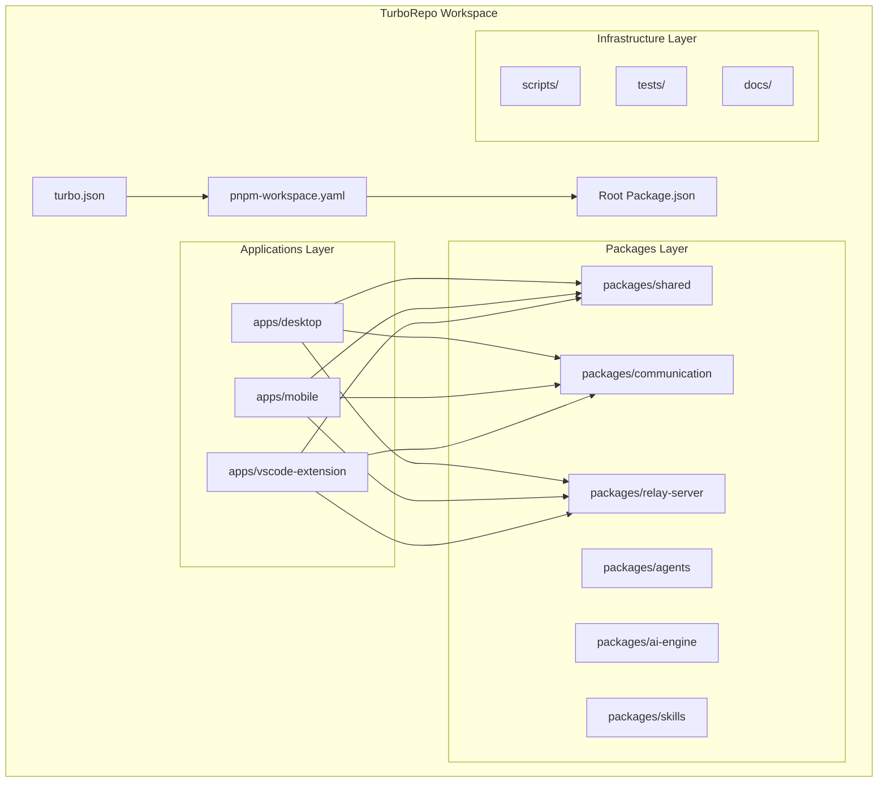

**Diagram sources**
- [turbo.json](file://turbo.json)
- [pnpm-workspace.yaml](file://pnpm-workspace.yaml)
- [package.json](file://package.json)

The monorepo leverages TurboRepo's intelligent caching and task orchestration to optimize build times and maintain consistency across platform-specific implementations. pnpm workspaces provide efficient dependency management while enabling local package linking for rapid iteration.

**Section sources**
- [turbo.json](file://turbo.json)
- [pnpm-workspace.yaml](file://pnpm-workspace.yaml)
- [package.json](file://package.json)

## Cross-Platform Applications

The system delivers three primary client applications, each optimized for its respective platform while sharing common business logic and communication protocols.

### Desktop Application Architecture

The desktop application utilizes Tauri framework to provide native performance and system integration capabilities. Built with modern web technologies, it offers a rich desktop experience with deep system access through Rust-based backend services.

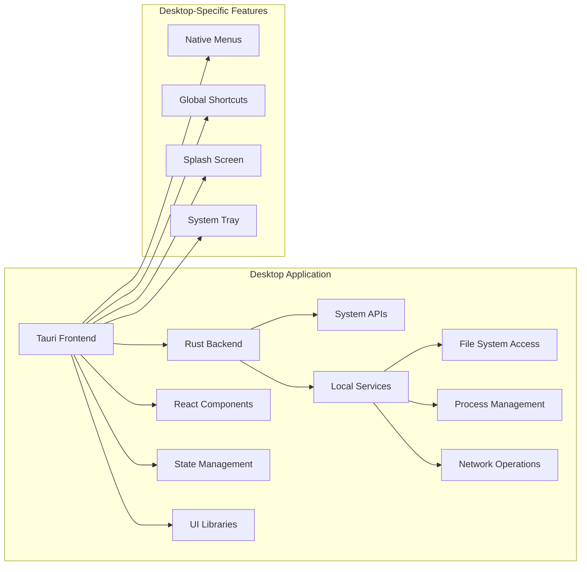

**Diagram sources**
- [apps/desktop/src-tauri/tauri.conf.json](file://apps/desktop/src-tauri/tauri.conf.json)
- [apps/desktop/src/App.tsx](file://apps/desktop/src/App.tsx)

### Mobile Application Architecture

The mobile application implements React Native to enable cross-platform mobile development with native performance characteristics. Bluetooth connectivity and device-specific optimizations provide seamless remote control capabilities.

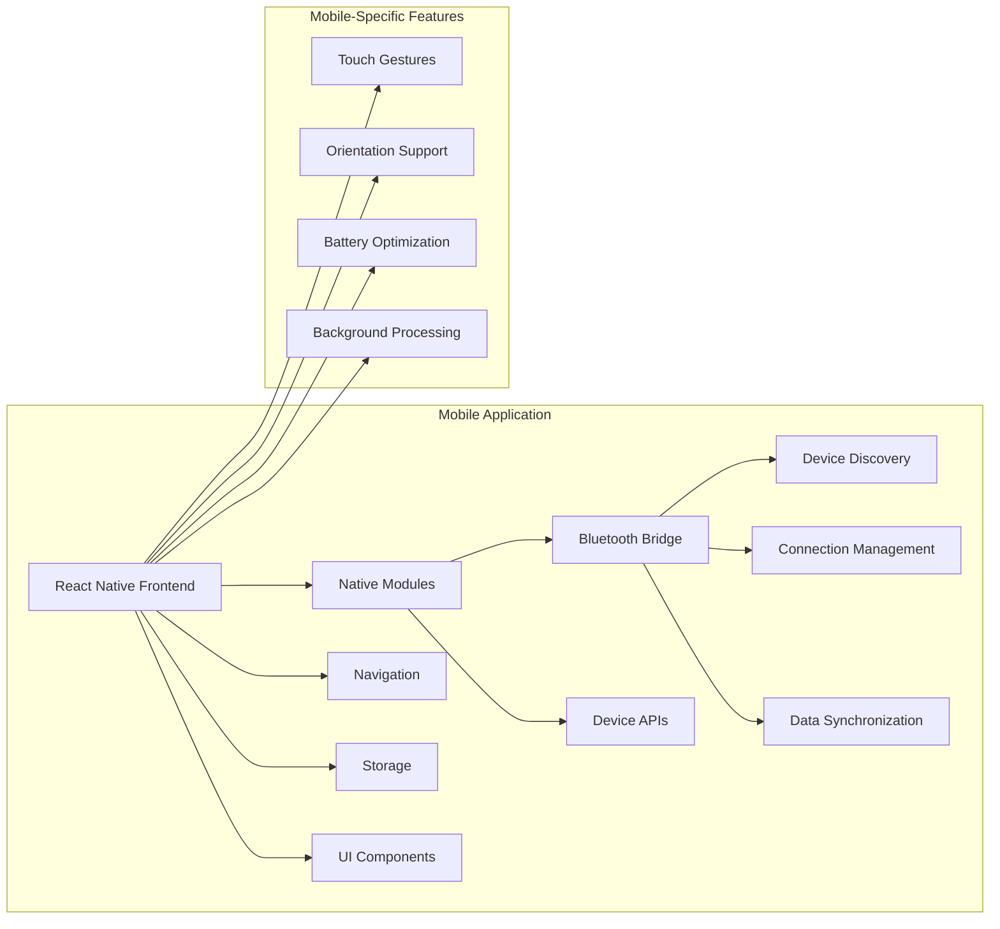

**Diagram sources**
- [apps/mobile/package.json](file://apps/mobile/package.json)
- [apps/mobile/src/services/bluetoothService.ts](file://apps/mobile/src/services/bluetoothService.ts)

### VS Code Extension Architecture

The VS Code extension integrates directly into the development environment, providing contextual AI assistance and code generation capabilities within familiar IDE workflows.

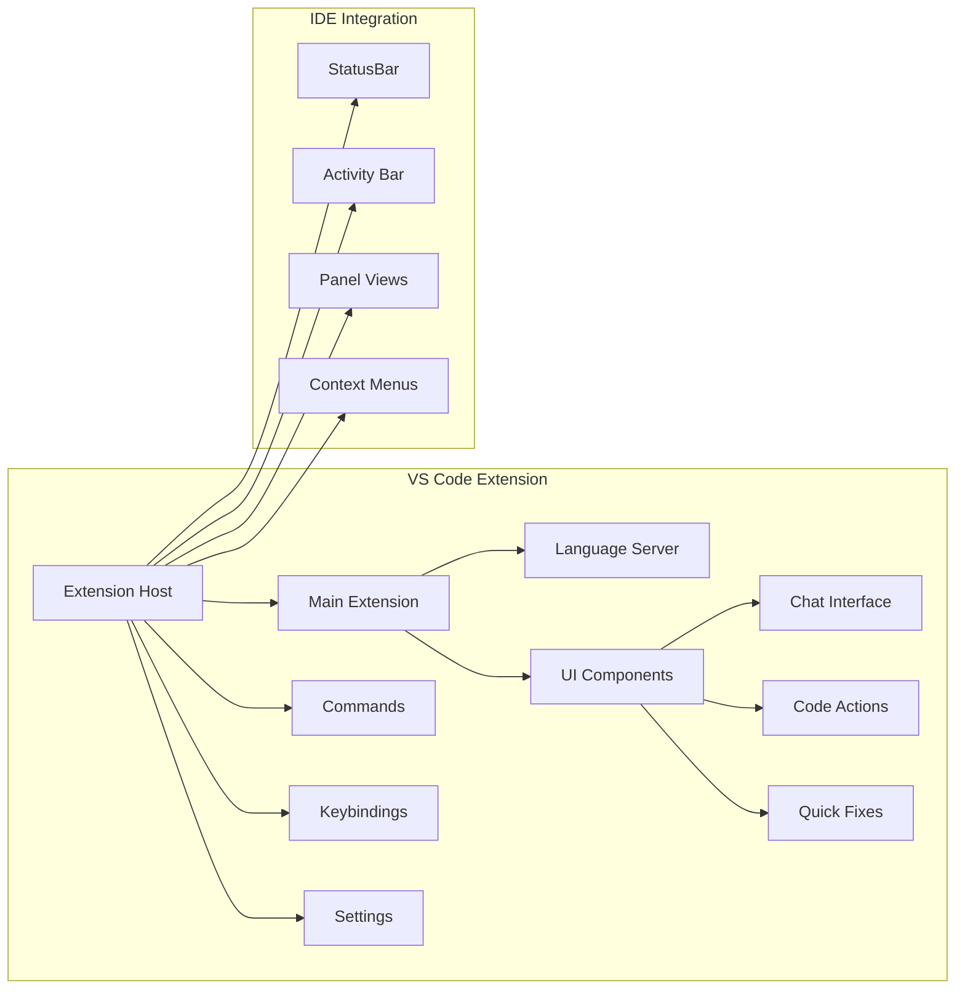

**Diagram sources**
- [apps/vscode-extension/src/extension.ts](file://apps/vscode-extension/src/extension.ts)
- [apps/vscode-extension/package.json](file://apps/vscode-extension/package.json)

**Section sources**
- [apps/desktop/package.json](file://apps/desktop/package.json)
- [apps/mobile/package.json](file://apps/mobile/package.json)
- [apps/vscode-extension/package.json](file://apps/vscode-extension/package.json)

## Communication Architecture

The communication system forms the backbone of GHITA CODING AGENT, enabling seamless coordination between all platform applications through standardized protocols and reliable transport mechanisms.

### Socket.IO Communication Layer

Socket.IO provides real-time bidirectional communication between clients and the central relay server, supporting event-driven architectures and automatic reconnection capabilities.

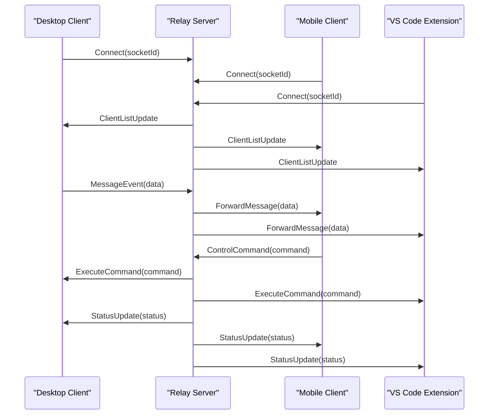

**Diagram sources**
- [apps/desktop/src/utils/sharedSocket.ts](file://apps/desktop/src/utils/sharedSocket.ts)
- [apps/mobile/src/services/socketService.ts](file://apps/mobile/src/services/socketService.ts)
- [packages/relay-server/package.json](file://packages/relay-server/package.json)

### Tauri Command System

Tauri enables secure communication between frontend JavaScript and Rust backend services, providing typed command invocation and system-level functionality access.

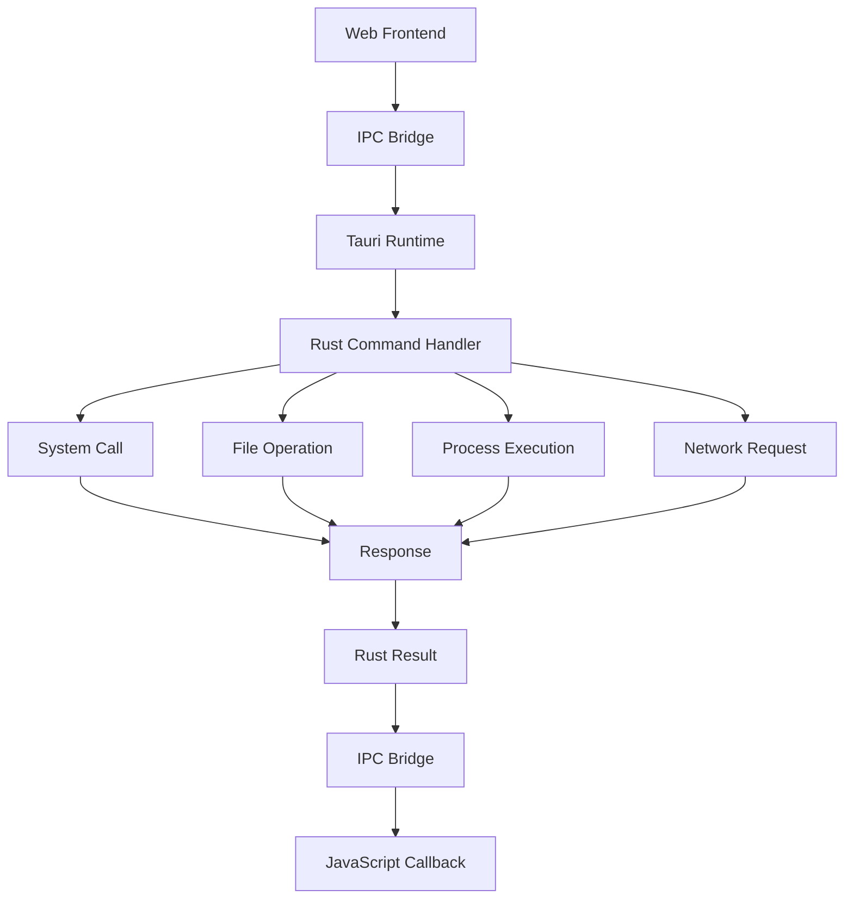

**Diagram sources**
- [apps/desktop/src-tauri/tauri.conf.json](file://apps/desktop/src-tauri/tauri.conf.json)

### Platform-Specific Communication Patterns

Each platform implements specialized communication strategies optimized for its deployment environment while maintaining compatibility with the central protocol.

**Section sources**
- [apps/desktop/src/utils/sharedSocket.ts](file://apps/desktop/src/utils/sharedSocket.ts)
- [apps/mobile/src/services/socketService.ts](file://apps/mobile/src/services/socketService.ts)
- [apps/mobile/src/services/bluetoothService.ts](file://apps/mobile/src/services/bluetoothService.ts)
- [apps/vscode-extension/src/extension.ts](file://apps/vscode-extension/src/extension.ts)

## System Boundaries and Components

The architecture establishes clear boundaries between platform applications and shared services, enabling independent development while maintaining system coherence.

### Core System Components

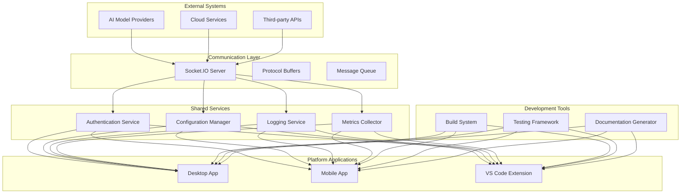

**Diagram sources**
- [packages/communication/package.json](file://packages/communication/package.json)
- [packages/shared/package.json](file://packages/shared/package.json)

### Component Responsibilities

| Component | Primary Function | Interfaces | Dependencies |
|-----------|------------------|------------|--------------|
| Desktop App | Native desktop experience | Tauri IPC, Socket.IO | Rust backend, shared UI components |
| Mobile App | Cross-platform mobile client | Bluetooth, Socket.IO | React Native, native modules |
| VS Code Extension | IDE integration | VS Code API, Socket.IO | Extension host, language services |
| Relay Server | Central communication hub | Socket.IO, Protocol Buffers | Authentication, logging services |
| Shared Packages | Common utilities and types | Internal APIs | None |
| Communication Package | Protocol definitions | Socket.IO, protobuf | Shared types |

**Section sources**
- [packages/relay-server/package.json](file://packages/relay-server/package.json)
- [packages/communication/package.json](file://packages/communication/package.json)
- [packages/shared/package.json](file://packages/shared/package.json)

## Data Flow Patterns

The system implements several coordinated data flow patterns that ensure consistency and reliability across all platform interactions.

### Real-time Event Propagation

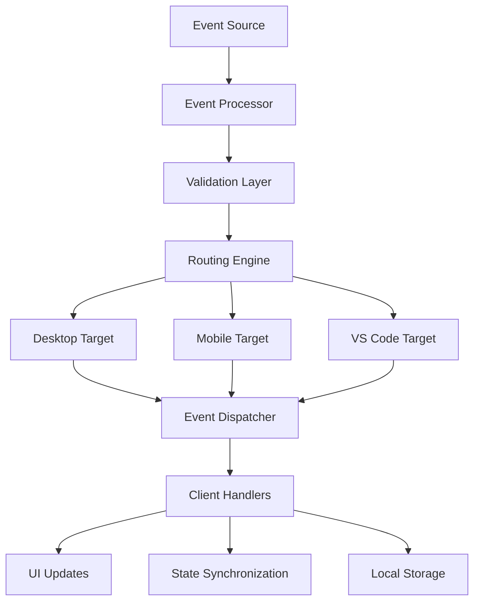

### Command Execution Pipeline

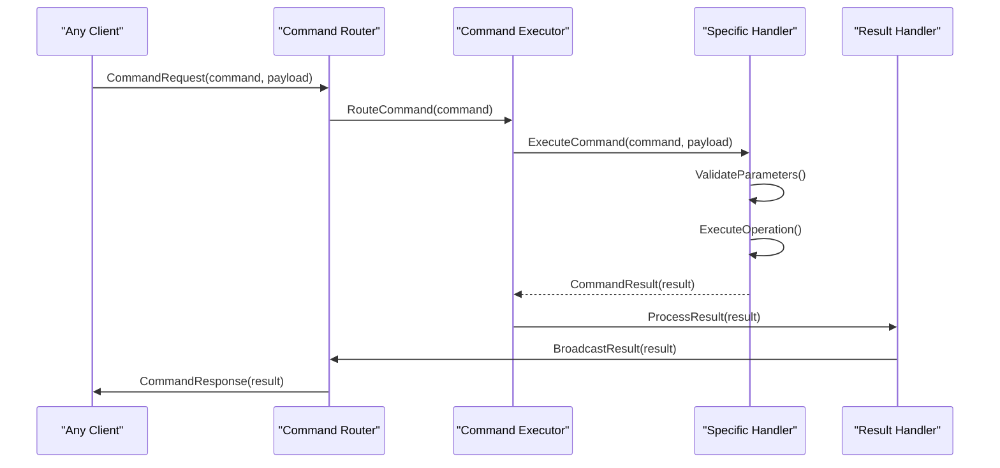

### State Synchronization Mechanism

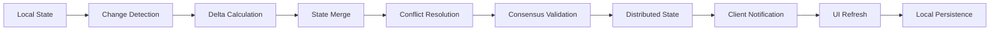

**Section sources**
- [apps/desktop/src/utils/sharedSocket.ts](file://apps/desktop/src/utils/sharedSocket.ts)
- [apps/mobile/src/services/socketService.ts](file://apps/mobile/src/services/socketService.ts)

## Architectural Rationale

The chosen architectural approach balances technical excellence with practical development considerations, providing a robust foundation for cross-platform AI-assisted development.

### Technical Advantages

**Cross-Platform Consistency**: Shared business logic and communication protocols ensure consistent user experiences across all platforms while allowing platform-specific optimizations.

**Development Efficiency**: Monorepo structure reduces duplication, enables shared tooling, and simplifies dependency management across applications.

**Scalability**: Modular architecture supports independent scaling of individual components and easy addition of new platform integrations.

**Maintainability**: Clear separation of concerns and standardized interfaces facilitate long-term maintenance and evolution.

### Strategic Benefits

**Unified Codebase**: Single source of truth for core functionality reduces maintenance overhead and ensures feature parity across platforms.

**Rapid Iteration**: Shared testing frameworks and development tools accelerate feature development and bug fixes.

**Resource Optimization**: Efficient resource utilization through shared libraries and optimized platform-specific implementations.

**Future Extensibility**: Well-defined boundaries and interfaces support easy integration of new platforms and communication channels.

## Development Workflow Benefits

The architectural design significantly enhances development productivity through streamlined processes and improved collaboration capabilities.

### Streamlined Development Processes

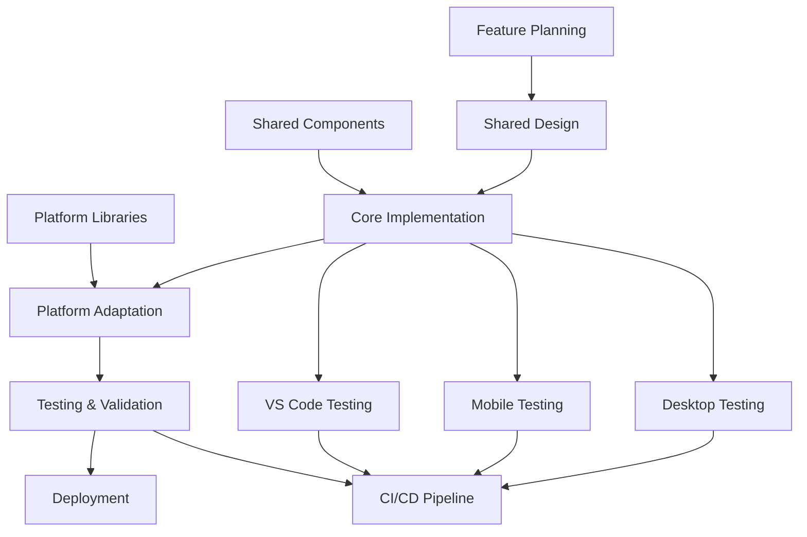

### Collaboration Enhancements

The monorepo structure facilitates team collaboration through:

- **Shared Standards**: Consistent coding standards and architectural patterns across all platform applications
- **Parallel Development**: Independent development streams for each platform while maintaining integration points
- **Knowledge Sharing**: Cross-platform learning opportunities and expertise exchange
- **Quality Assurance**: Unified testing strategies and continuous integration practices

### Tooling Integration

Advanced tooling supports the development workflow through:

- **Intelligent Caching**: TurboRepo's build caching accelerates development cycles
- **Type Safety**: Shared TypeScript definitions ensure compile-time error detection
- **Automated Testing**: Integrated testing frameworks support comprehensive quality assurance
- **Documentation Generation**: Automated documentation creation from code annotations

## Conclusion

GHITA CODING AGENT's system architecture represents a sophisticated balance between technical innovation and practical development considerations. The monorepo foundation, combined with platform-specific optimizations and robust communication systems, creates a scalable and maintainable solution for cross-platform AI-assisted development.

The chosen architecture enables efficient development workflows while maintaining the flexibility to evolve and adapt to changing requirements. Through careful separation of concerns, standardized interfaces, and comprehensive tooling support, the system provides a solid foundation for continued growth and innovation in the AI-assisted development space.

This architectural approach demonstrates how modern development practices can be effectively applied to create cohesive, scalable solutions that serve diverse user needs across multiple platforms while maintaining technical excellence and development efficiency.