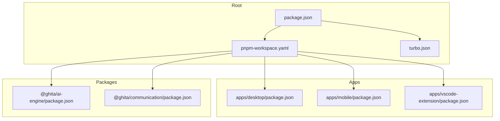
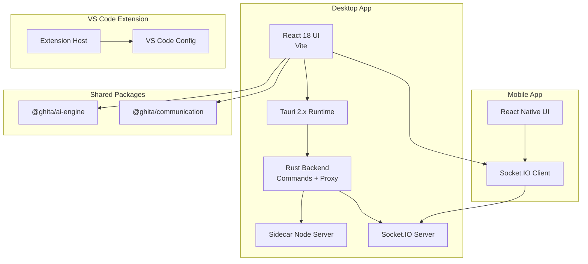
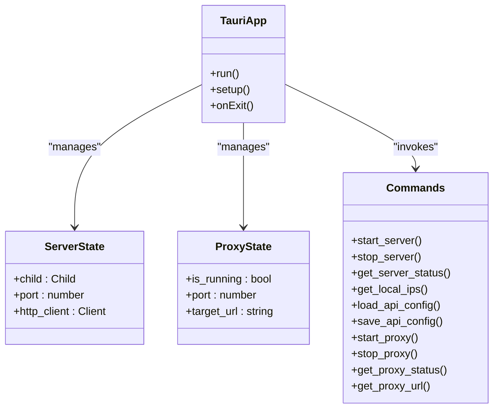
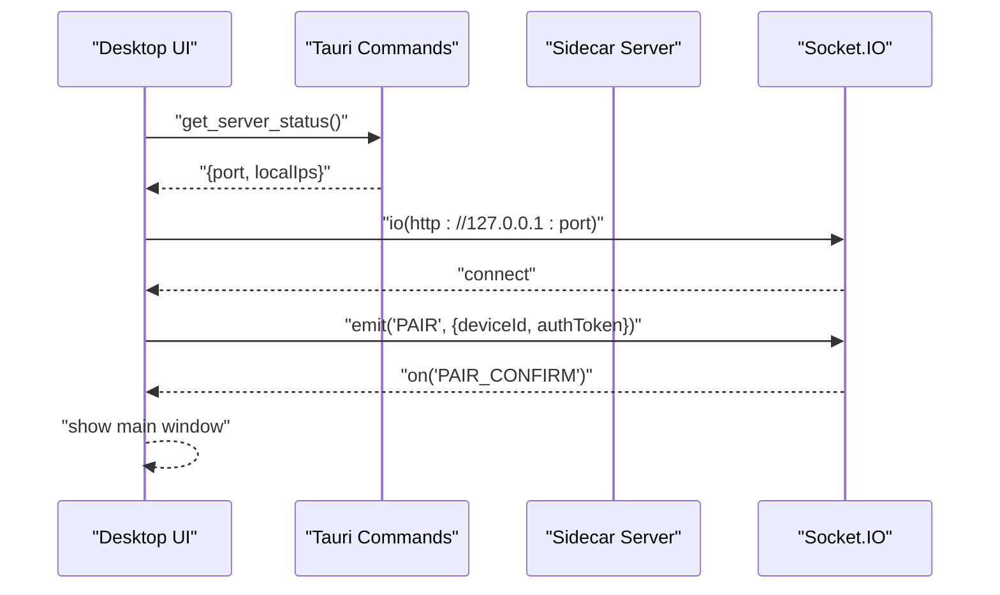
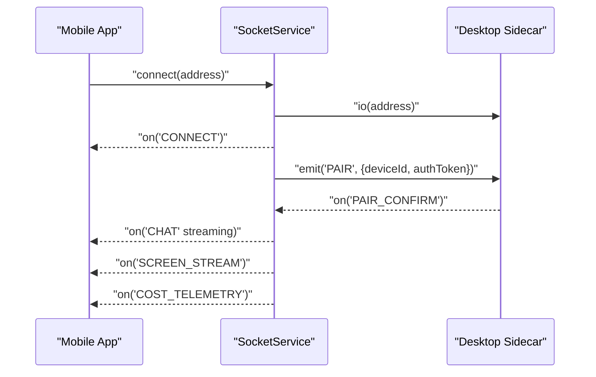
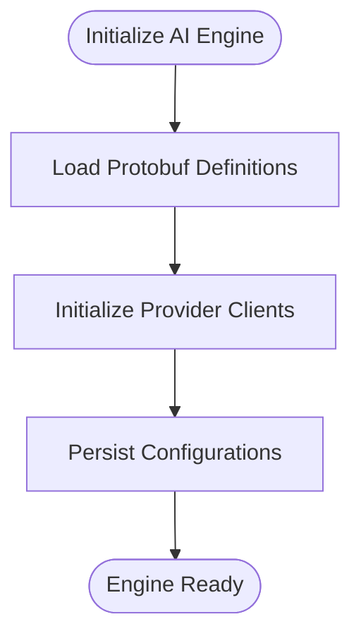
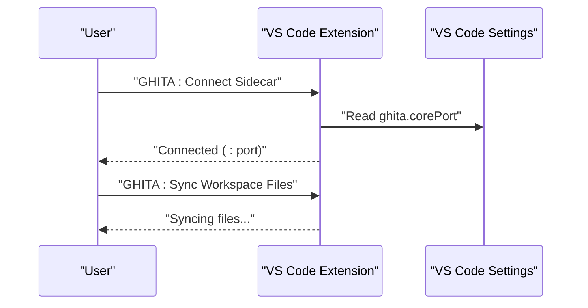
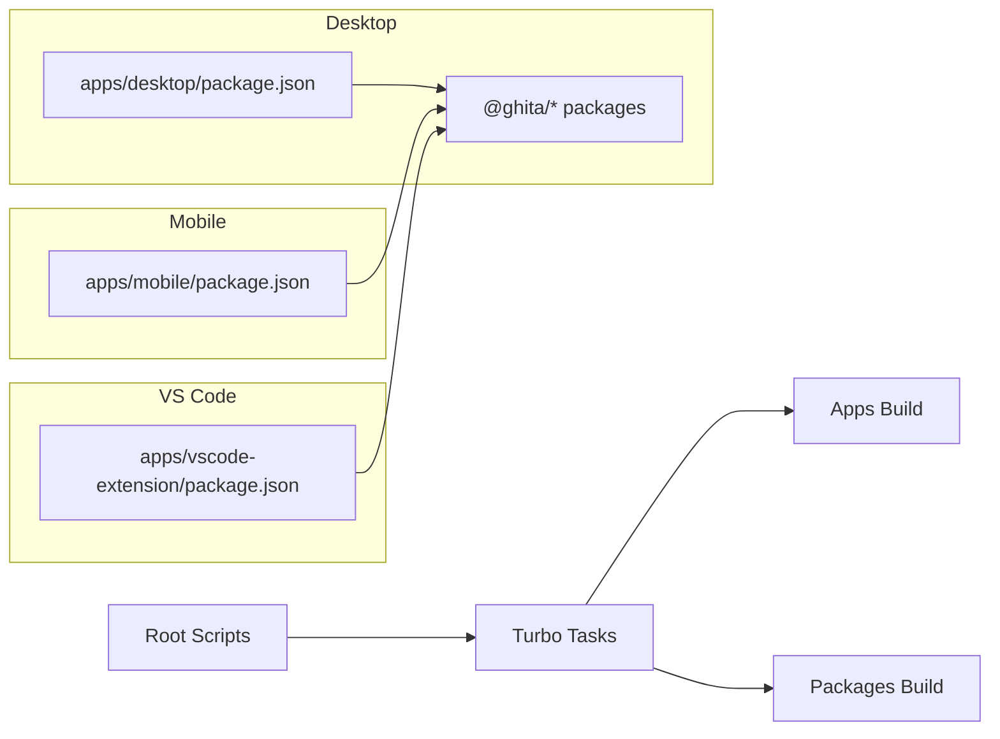

# Technology Stack and Implementation Choices

<cite>
**Referenced Files in This Document**
- [package.json](file://package.json)
- [pnpm-workspace.yaml](file://pnpm-workspace.yaml)
- [turbo.json](file://turbo.json)
- [apps/desktop/package.json](file://apps/desktop/package.json)
- [apps/desktop/src-tauri/tauri.conf.json](file://apps/desktop/src-tauri/tauri.conf.json)
- [apps/desktop/src-tauri/Cargo.toml](file://apps/desktop/src-tauri/Cargo.toml)
- [apps/desktop/src-tauri/src/main.rs](file://apps/desktop/src-tauri/src/main.rs)
- [apps/desktop/src-tauri/src/lib.rs](file://apps/desktop/src-tauri/src/lib.rs)
- [apps/desktop/src-tauri/src/proxy.rs](file://apps/desktop/src-tauri/src/proxy.rs)
- [apps/desktop/src/utils/apiConfig.ts](file://apps/desktop/src/utils/apiConfig.ts)
- [apps/desktop/src/utils/sharedSocket.ts](file://apps/desktop/src/utils/sharedSocket.ts)
- [packages/ai-engine/package.json](file://packages/ai-engine/package.json)
- [packages/communication/package.json](file://packages/communication/package.json)
- [apps/mobile/package.json](file://apps/mobile/package.json)
- [apps/mobile/src/services/socketService.ts](file://apps/mobile/src/services/socketService.ts)
- [apps/mobile/src/App.tsx](file://apps/mobile/src/App.tsx)
- [apps/vscode-extension/package.json](file://apps/vscode-extension/package.json)
- [apps/vscode-extension/src/extension.ts](file://apps/vscode-extension/src/extension.ts)
</cite>

## Table of Contents
1. [Introduction](#introduction)
2. [Project Structure](#project-structure)
3. [Core Components](#core-components)
4. [Architecture Overview](#architecture-overview)
5. [Detailed Component Analysis](#detailed-component-analysis)
6. [Dependency Analysis](#dependency-analysis)
7. [Performance Considerations](#performance-considerations)
8. [Security Implications](#security-implications)
9. [Maintenance Benefits](#maintenance-benefits)
10. [Comparison with Alternatives](#comparison-with-alternatives)
11. [Version Compatibility and Build Orchestration](#version-compatibility-and-build-orchestration)
12. [Conclusion](#conclusion)

## Introduction
This document explains the technology stack and implementation choices for GHITA CODING AGENT. It focuses on:
- Desktop efficiency with Tauri 2.x over Electron
- Frontend consistency with React 18 and TypeScript
- Cross-platform mobile development with React Native
- Real-time communication via Socket.IO
- Rust-based Tauri backend for system-level operations
- Multi-provider AI integration patterns
- Version compatibility, pnpm workspaces, and TurboRepo orchestration
- Performance, security, and maintenance trade-offs

## Project Structure
The monorepo is organized into:
- apps: desktop, mobile, and VS Code extension applications
- packages: shared libraries for AI engine, communication, agents, skills, memory, browser control, and computer use
- root tooling: pnpm workspaces, TurboRepo, ESLint, Prettier, and Node.js engine requirements

**Diagram sources**
- [package.json:1-55](file://package.json#L1-L55)
- [pnpm-workspace.yaml:1-8](file://pnpm-workspace.yaml#L1-L8)
- [turbo.json:1-26](file://turbo.json#L1-L26)
- [apps/desktop/package.json:1-61](file://apps/desktop/package.json#L1-L61)
- [apps/mobile/package.json:1-44](file://apps/mobile/package.json#L1-L44)
- [apps/vscode-extension/package.json:1-61](file://apps/vscode-extension/package.json#L1-L61)
- [packages/ai-engine/package.json:1-44](file://packages/ai-engine/package.json#L1-L44)
- [packages/communication/package.json:1-36](file://packages/communication/package.json#L1-L36)

**Section sources**
- [package.json:1-55](file://package.json#L1-L55)
- [pnpm-workspace.yaml:1-8](file://pnpm-workspace.yaml#L1-L8)
- [turbo.json:1-26](file://turbo.json#L1-L26)

## Core Components
- Desktop app built with Tauri 2.x and React 18, integrating a Rust backend for system-level operations and a sidecar Node server for real-time communication.
- Mobile app built with React Native for Android, connecting to the desktop via Socket.IO.
- VS Code extension for workspace integration and sidecar coordination.
- Shared packages encapsulating AI engine, communication protocols, and reusable logic.

Key implementation anchors:
- Desktop Tauri configuration and Rust backend commands for sidecar lifecycle, proxy server, and API config persistence.
- Socket.IO client/service implementations for real-time events and telemetry.
- AI engine and communication packages enabling multi-provider patterns and protocol loading.

**Section sources**
- [apps/desktop/src-tauri/tauri.conf.json:1-73](file://apps/desktop/src-tauri/tauri.conf.json#L1-L73)
- [apps/desktop/src-tauri/src/lib.rs:1-500](file://apps/desktop/src-tauri/src/lib.rs#L1-L500)
- [apps/desktop/src/utils/sharedSocket.ts:1-88](file://apps/desktop/src/utils/sharedSocket.ts#L1-L88)
- [apps/mobile/src/services/socketService.ts:1-525](file://apps/mobile/src/services/socketService.ts#L1-L525)
- [packages/ai-engine/package.json:1-44](file://packages/ai-engine/package.json#L1-L44)
- [packages/communication/package.json:1-36](file://packages/communication/package.json#L1-L36)

## Architecture Overview
GHITA CODING AGENT uses a hybrid architecture:
- Desktop app (Tauri + React) hosts a Rust backend that manages a sidecar Node server, a local proxy, and persistent configuration.
- Real-time communication is handled by Socket.IO between desktop and mobile, with optional cloud relay support.
- The AI engine integrates multiple providers and shared protocols, orchestrated through TypeScript packages.

**Diagram sources**
- [apps/desktop/src-tauri/tauri.conf.json:1-73](file://apps/desktop/src-tauri/tauri.conf.json#L1-L73)
- [apps/desktop/src-tauri/src/lib.rs:1-500](file://apps/desktop/src-tauri/src/lib.rs#L1-L500)
- [apps/desktop/src/utils/sharedSocket.ts:1-88](file://apps/desktop/src/utils/sharedSocket.ts#L1-L88)
- [apps/mobile/src/services/socketService.ts:1-525](file://apps/mobile/src/services/socketService.ts#L1-L525)
- [apps/vscode-extension/src/extension.ts:1-91](file://apps/vscode-extension/src/extension.ts#L1-L91)
- [packages/ai-engine/package.json:1-44](file://packages/ai-engine/package.json#L1-L44)
- [packages/communication/package.json:1-36](file://packages/communication/package.json#L1-L36)

## Detailed Component Analysis

### Tauri 2.x Desktop Backend (Rust)
The desktop Rust backend exposes Tauri commands for:
- Sidecar lifecycle: start/stop server, status checks, and local IP discovery
- Persistent configuration: API keys and chat sessions stored under app data dir
- Proxy server: embeds a local HTTP proxy to forward requests to external targets
- Updater integration and secure CSP configuration

**Diagram sources**
- [apps/desktop/src-tauri/src/lib.rs:12-399](file://apps/desktop/src-tauri/src/lib.rs#L12-L399)
- [apps/desktop/src-tauri/src/proxy.rs:15-29](file://apps/desktop/src-tauri/src/proxy.rs#L15-L29)

Key implementation highlights:
- Sidecar startup resolves multiple candidate paths and spawns a Node process with environment variables for port, data directory, and LAN enablement.
- Health checks query the sidecar’s health endpoint and inject local IP addresses.
- Proxy server binds to localhost, forwards requests with size limits and timeouts, and strips specific frame-ancestors headers while preserving security headers.

**Section sources**
- [apps/desktop/src-tauri/src/lib.rs:41-235](file://apps/desktop/src-tauri/src/lib.rs#L41-L235)
- [apps/desktop/src-tauri/src/proxy.rs:139-243](file://apps/desktop/src-tauri/src/proxy.rs#L139-L243)
- [apps/desktop/src-tauri/tauri.conf.json:39-41](file://apps/desktop/src-tauri/tauri.conf.json#L39-L41)

### Real-Time Communication with Socket.IO
The desktop and mobile share a Socket.IO-based protocol:
- Desktop exposes a shared socket factory that invokes Tauri commands to discover the sidecar port and establish a WebSocket connection with session tokens.
- Mobile implements a robust SocketService with connection state management, pairing, streaming chat chunks, telemetry, and local/cloud failover logic.

**Diagram sources**
- [apps/desktop/src/utils/sharedSocket.ts:28-80](file://apps/desktop/src/utils/sharedSocket.ts#L28-L80)
- [apps/desktop/src-tauri/src/lib.rs:186-235](file://apps/desktop/src-tauri/src/lib.rs#L186-L235)

**Diagram sources**
- [apps/mobile/src/services/socketService.ts:80-147](file://apps/mobile/src/services/socketService.ts#L80-L147)
- [apps/mobile/src/services/socketService.ts:330-520](file://apps/mobile/src/services/socketService.ts#L330-L520)

**Section sources**
- [apps/desktop/src/utils/sharedSocket.ts:1-88](file://apps/desktop/src/utils/sharedSocket.ts#L1-L88)
- [apps/mobile/src/services/socketService.ts:1-525](file://apps/mobile/src/services/socketService.ts#L1-L525)

### AI Engine and Multi-Provider Integration
The AI engine package integrates gRPC and WebSocket clients, SQLite-backed persistence, and Zod-based validation. It supports multiple providers and loads shared protocol definitions.

**Diagram sources**
- [packages/ai-engine/package.json:24-31](file://packages/ai-engine/package.json#L24-L31)

**Section sources**
- [packages/ai-engine/package.json:1-44](file://packages/ai-engine/package.json#L1-L44)

### VS Code Extension Integration
The VS Code extension provides commands to connect to the sidecar and synchronize workspace files, reading configuration from VS Code settings.

**Diagram sources**
- [apps/vscode-extension/src/extension.ts:26-78](file://apps/vscode-extension/src/extension.ts#L26-L78)
- [apps/vscode-extension/package.json:33-42](file://apps/vscode-extension/package.json#L33-L42)

**Section sources**
- [apps/vscode-extension/src/extension.ts:1-91](file://apps/vscode-extension/src/extension.ts#L1-L91)
- [apps/vscode-extension/package.json:1-61](file://apps/vscode-extension/package.json#L1-L61)

## Dependency Analysis
The monorepo uses pnpm workspaces and TurboRepo to manage dependencies and build orchestration across apps and packages.

**Diagram sources**
- [package.json:9-26](file://package.json#L9-L26)
- [turbo.json:3-24](file://turbo.json#L3-L24)
- [pnpm-workspace.yaml:1-8](file://pnpm-workspace.yaml#L1-L8)
- [apps/desktop/package.json:17-25](file://apps/desktop/package.json#L17-L25)
- [apps/mobile/package.json:17-28](file://apps/mobile/package.json#L17-L28)
- [apps/vscode-extension/package.json:52-54](file://apps/vscode-extension/package.json#L52-L54)

**Section sources**
- [package.json:1-55](file://package.json#L1-L55)
- [turbo.json:1-26](file://turbo.json#L1-L26)
- [pnpm-workspace.yaml:1-8](file://pnpm-workspace.yaml#L1-L8)

## Performance Considerations
- Tauri 2.x vs Electron: Tauri leverages native system APIs and a smaller runtime footprint compared to Electron, reducing memory usage and startup time for desktop operations.
- Rust backend: Tokio-based async I/O and hyper-based HTTP server provide efficient concurrency and low-latency request handling for the proxy and sidecar.
- Socket.IO: Efficient WebSocket transport with polling fallback and streaming chunking reduce latency for chat and screen sharing.
- React 18: Concurrent rendering and automatic batching improve UI responsiveness during frequent updates.
- pnpm + TurboRepo: Fast installs, deterministic builds, and caching minimize CI and developer iteration time.

[No sources needed since this section provides general guidance]

## Security Implications
- Tauri CSP: The desktop app defines a strict Content Security Policy limiting script, connect, and frame-ancestors sources to trusted origins and asset URLs.
- Proxy header stripping: Removes frame-ancestors to allow embedding while preserving security headers like CSP and content-type options.
- Session tokens: Socket.IO connections include generated session tokens to mitigate CSRF-like risks.
- Local-first storage: API configuration persists to Tauri-managed app data directories with fallback to localStorage for recovery.

**Section sources**
- [apps/desktop/src-tauri/tauri.conf.json:39-41](file://apps/desktop/src-tauri/tauri.conf.json#L39-L41)
- [apps/desktop/src-tauri/src/proxy.rs:31-38](file://apps/desktop/src-tauri/src/proxy.rs#L31-L38)
- [apps/desktop/src/utils/sharedSocket.ts:15-20](file://apps/desktop/src/utils/sharedSocket.ts#L15-L20)
- [apps/desktop/src/utils/apiConfig.ts:18-60](file://apps/desktop/src/utils/apiConfig.ts#L18-L60)

## Maintenance Benefits
- Monorepo with pnpm workspaces and TurboRepo simplifies dependency alignment, reduces duplication, and accelerates builds.
- Tauri’s plugin ecosystem and Rust stability reduce long-term maintenance overhead for desktop integrations.
- Socket.IO client/service abstractions isolate real-time concerns and simplify testing and debugging.
- Shared packages encapsulate AI and communication logic, enabling consistent upgrades and feature parity across platforms.

**Section sources**
- [package.json:9-26](file://package.json#L9-L26)
- [turbo.json:3-24](file://turbo.json#L3-L24)
- [pnpm-workspace.yaml:1-8](file://pnpm-workspace.yaml#L1-L8)

## Comparison with Alternatives
- Tauri vs Electron: Tauri offers smaller binaries, lower memory usage, and tighter OS integration; Electron provides broader web tech familiarity but at higher resource costs.
- React 18 + TypeScript vs alternatives: Provides strong typing, concurrent rendering, and ecosystem maturity for UI consistency and developer productivity.
- React Native vs Flutter/SwiftUI: React Native enables shared logic across platforms with native performance; Flutter offers hot reload and UI consistency; SwiftUI requires separate Apple platform investment.
- Socket.IO vs WebSockets/SignalR: Socket.IO adds convenience features like automatic reconnection, rooms, and polling fallback; WebSockets offer minimal overhead; SignalR is strong on .NET ecosystems.

[No sources needed since this section compares concepts without analyzing specific files]

## Version Compatibility and Build Orchestration
- Node.js: Root enforces Node >= 20 for toolchains and engines.
- pnpm: Workspace configuration and onlyBuiltDependencies ensure deterministic builds for native modules.
- TurboRepo: Task graph with cache, typecheck, lint, and build dependencies across packages and apps.
- Desktop: Tauri CLI and Vite build pipeline; Rust backend compiled with modern Tokio and hyper stacks.
- Mobile: React Native 0.76 with Android Gradle toolchain; Socket.IO client aligned with desktop.
- VS Code: Extension targets VS Code 1.85+ with TypeScript configuration.

**Section sources**
- [package.json:40-53](file://package.json#L40-L53)
- [pnpm-workspace.yaml:5-8](file://pnpm-workspace.yaml#L5-L8)
- [turbo.json:3-24](file://turbo.json#L3-L24)
- [apps/desktop/package.json:44-59](file://apps/desktop/package.json#L44-L59)
- [apps/mobile/package.json:30-42](file://apps/mobile/package.json#L30-L42)
- [apps/vscode-extension/package.json:7-8](file://apps/vscode-extension/package.json#L7-L8)

## Conclusion
GHITA CODING AGENT’s stack balances performance, security, and maintainability:
- Tauri 2.x and Rust deliver efficient desktop operations and system-level control.
- React 18 + TypeScript ensures a consistent, type-safe frontend.
- React Native provides cross-platform mobile coverage with shared communication logic.
- Socket.IO enables robust real-time features across desktop and mobile.
- The monorepo toolchain (pnpm + TurboRepo) streamlines development, testing, and releases.

[No sources needed since this section summarizes without analyzing specific files]