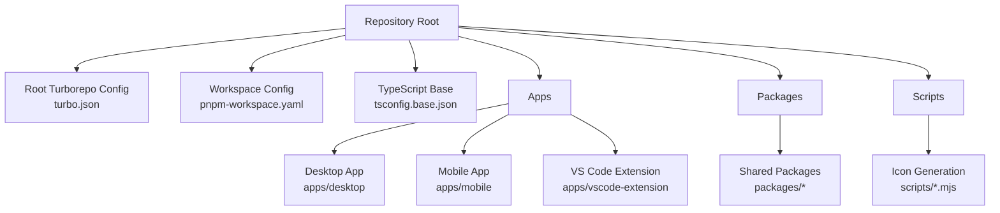
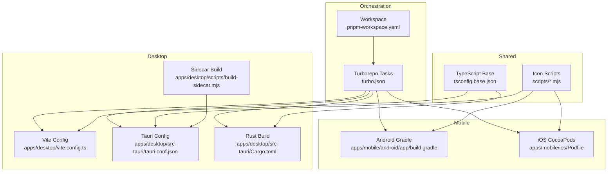
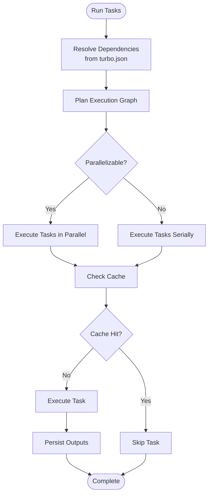
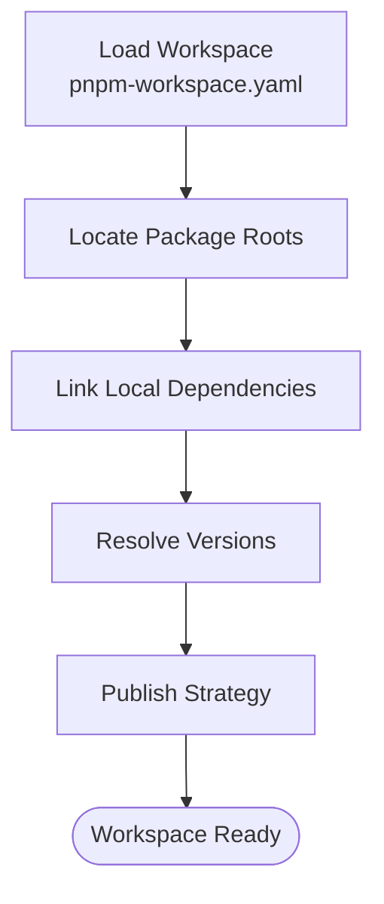
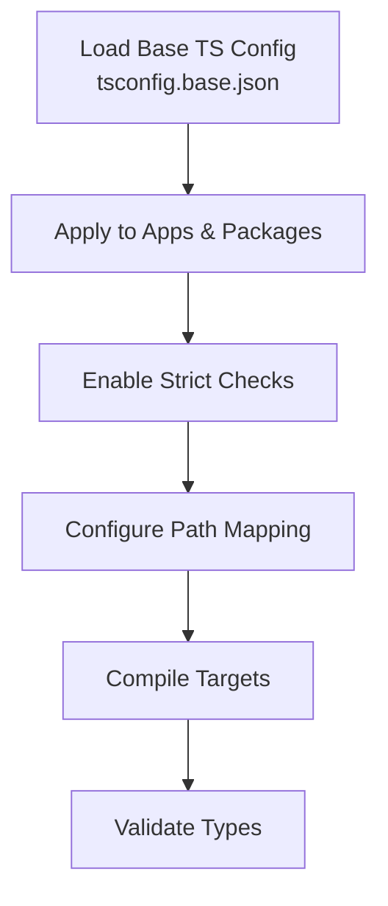
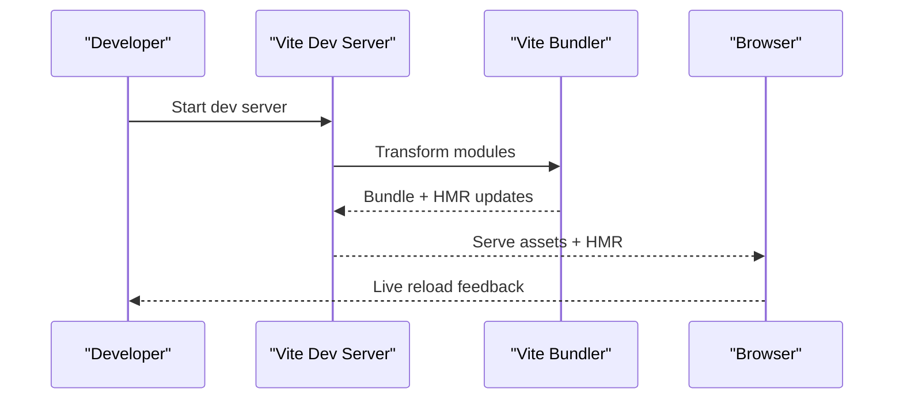
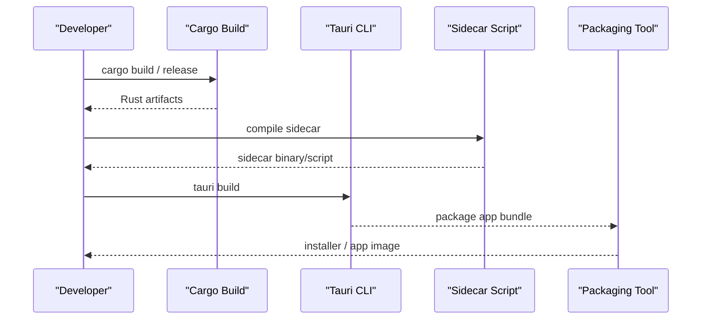
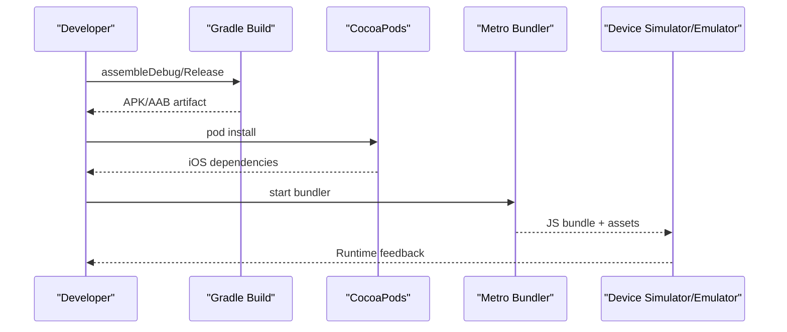
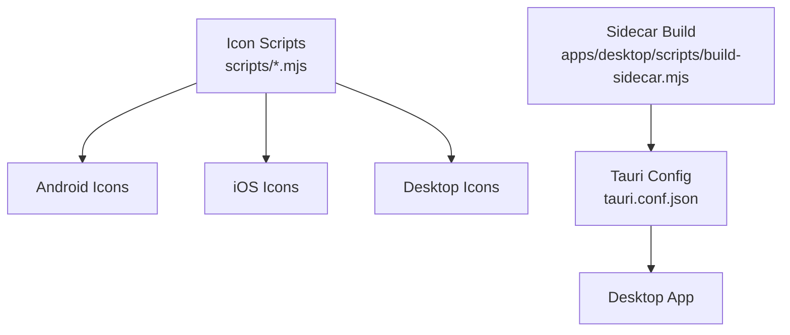
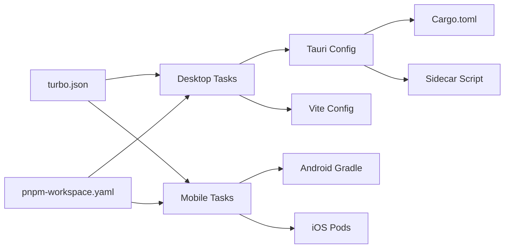

# Build System and Configuration

<cite>
**Referenced Files in This Document**
- [turbo.json](file://turbo.json)
- [pnpm-workspace.yaml](file://pnpm-workspace.yaml)
- [tsconfig.base.json](file://tsconfig.base.json)
- [apps/desktop/vite.config.ts](file://apps/desktop/vite.config.ts)
- [apps/desktop/tsconfig.json](file://apps/desktop/tsconfig.json)
- [apps/desktop/tsconfig.node.json](file://apps/desktop/tsconfig.node.json)
- [apps/desktop/package.json](file://apps/desktop/package.json)
- [apps/desktop/src-tauri/Cargo.toml](file://apps/desktop/src-tauri/Cargo.toml)
- [apps/desktop/src-tauri/tauri.conf.json](file://apps/desktop/src-tauri/tauri.conf.json)
- [apps/desktop/src-tauri/build.rs](file://apps/desktop/src-tauri/build.rs)
- [apps/desktop/scripts/build-sidecar.mjs](file://apps/desktop/scripts/build-sidecar.mjs)
- [apps/mobile/package.json](file://apps/mobile/package.json)
- [apps/mobile/android/app/build.gradle](file://apps/mobile/android/app/build.gradle)
- [apps/mobile/android/build.gradle](file://apps/mobile/android/build.gradle)
- [apps/mobile/android/gradle.properties](file://apps/mobile/android/gradle.properties)
- [apps/mobile/android/settings.gradle](file://apps/mobile/android/settings.gradle)
- [apps/mobile/ios/Podfile](file://apps/mobile/ios/Podfile)
- [apps/mobile/metro.config.js](file://apps/mobile/metro.config.js)
- [apps/mobile/babel.config.js](file://apps/mobile/babel.config.js)
- [apps/mobile/react-native.config.js](file://apps/mobile/react-native.config.js)
- [apps/mobile/tsconfig.json](file://apps/mobile/tsconfig.json)
- [apps/mobile/index.js](file://apps/mobile/index.js)
- [apps/vscode-extension/package.json](file://apps/vscode-extension/package.json)
- [apps/vscode-extension/tsconfig.json](file://apps/vscode-extension/tsconfig.json)
- [apps/desktop/src-tauri/sidecar/server.mjs](file://apps/desktop/src-tauri/sidecar/server.mjs)
- [apps/desktop/src-tauri/sidecar/app.manifest](file://apps/desktop/src-tauri/sidecar/app.manifest)
- [apps/desktop/src-tauri/sidecar/screenCapture_1.3.2.bat](file://apps/desktop/src-tauri/sidecar/screenCapture_1.3.2.bat)
- [apps/desktop/src/main.tsx](file://apps/desktop/src/main.tsx)
- [apps/desktop/src/App.tsx](file://apps/desktop/src/App.tsx)
- [apps/desktop/src/layouts/MainLayout.tsx](file://apps/desktop/src/layouts/MainLayout.tsx)
- [apps/desktop/src/components/Terminal.tsx](file://apps/desktop/src/components/Terminal.tsx)
- [apps/desktop/src/utils/shell.ts](file://apps/desktop/src/utils/shell.ts)
- [apps/desktop/src/utils/sharedSocket.ts](file://apps/desktop/src/utils/sharedSocket.ts)
- [apps/desktop/src/views/DashboardView.tsx](file://apps/desktop/src/views/DashboardView.tsx)
- [apps/desktop/src/views/SettingsView.tsx](file://apps/desktop/src/views/SettingsView.tsx)
- [apps/desktop/src/views/ApiView.tsx](file://apps/desktop/src/views/ApiView.tsx)
- [apps/desktop/src/views/CodeView.tsx](file://apps/desktop/src/views/CodeView.tsx)
- [apps/desktop/src/views/DevicesView.tsx](file://apps/desktop/src/views/DevicesView.tsx)
- [apps/desktop/src/views/MarketplaceView.tsx](file://apps/desktop/src/views/MarketplaceView.tsx)
- [apps/desktop/src/views/SkillsView.tsx](file://apps/desktop/src/views/SkillsView.tsx)
- [apps/desktop/src/views/WorkflowView.tsx](file://apps/desktop/src/views/WorkflowView.tsx)
- [apps/desktop/src/views/EcosystemView.tsx](file://apps/desktop/src/views/EcosystemView.tsx)
- [apps/desktop/src/views/AgentsView.tsx](file://apps/desktop/src/views/AgentsView.tsx)
- [apps/desktop/src/views/ApiManager.tsx](file://apps/desktop/src/views/ApiManager.tsx)
- [apps/desktop/src/views/CodeEditor.tsx](file://apps/desktop/src/views/CodeEditor.tsx)
- [apps/desktop/src/views/FileExplorer.tsx](file://apps/desktop/src/views/FileExplorer.tsx)
- [apps/desktop/src/views/SandboxDashboard.tsx](file://apps/desktop/src/views/SandboxDashboard.tsx)
- [apps/desktop/src/views/Terminal.integration.test.ts](file://apps/desktop/src/views/Terminal.integration.test.ts)
- [apps/desktop/src/components/AgentGroups.tsx](file://apps/desktop/src/components/AgentGroups.tsx)
- [apps/desktop/src/components/ChatMessageContent.tsx](file://apps/desktop/src/components/ChatMessageContent.tsx)
- [apps/desktop/src/components/ErrorFallback.tsx](file://apps/desktop/src/components/ErrorFallback.tsx)
- [apps/desktop/src/components/Toast.tsx](file://apps/desktop/src/components/Toast.tsx)
- [apps/desktop/src/components/WebViewPanel.tsx](file://apps/desktop/src/components/WebViewPanel.tsx)
- [apps/desktop/src/hooks/useChatSessions.ts](file://apps/desktop/src/hooks/useChatSessions.ts)
- [apps/desktop/src/hooks/useModelSelection.ts](file://apps/desktop/src/hooks/useModelSelection.ts)
- [apps/desktop/src/stores/appStore.ts](file://apps/desktop/src/stores/appStore.ts)
- [apps/desktop/src/utils/apiConfig.ts](file://apps/desktop/src/utils/apiConfig.ts)
- [apps/desktop/src/utils/chatSessionStorage.ts](file://apps/desktop/src/utils/chatSessionStorage.ts)
- [apps/desktop/src/i18n/en.ts](file://apps/desktop/src/i18n/en.ts)
- [apps/desktop/src/i18n/vi.ts](file://apps/desktop/src/i18n/vi.ts)
- [apps/desktop/src/i18n/zh.ts](file://apps/desktop/src/i18n/zh.ts)
- [apps/desktop/src/i18n/context.tsx](file://apps/desktop/src/i18n/context.tsx)
- [apps/desktop/src/i18n/types.ts](file://apps/desktop/src/i18n/types.ts)
- [apps/desktop/src/i18n/index.ts](file://apps/desktop/src/i18n/index.ts)
- [apps/desktop/src/styles/globals.css](file://apps/desktop/src/styles/globals.css)
- [apps/desktop/src/test-setup.ts](file://apps/desktop/src/test-setup.ts)
- [apps/desktop/vitest.config.ts](file://apps/desktop/vitest.config.ts)
- [apps/desktop/src/vite-env.d.ts](file://apps/desktop/src/vite-env.d.ts)
- [apps/desktop/public/icons/](file://apps/desktop/public/icons/)
- [apps/desktop/public/splash.html](file://apps/desktop/public/splash.html)
- [apps/desktop/src-tauri/.cargo/config.toml](file://apps/desktop/src-tauri/.cargo/config.toml)
- [apps/desktop/src-tauri/capabilities/default.json](file://apps/desktop/src-tauri/capabilities/default.json)
- [apps/desktop/src-tauri/gen/schemas/capabilities.json](file://apps/desktop/src-tauri/gen/schemas/capabilities.json)
- [apps/desktop/src-tauri/gen/schemas/desktop-schema.json](file://apps/desktop/src-tauri/gen/schemas/desktop-schema.json)
- [apps/desktop/src-tauri/gen/schemas/windows-schema.json](file://apps/desktop/src-tauri/gen/schemas/windows-schema.json)
- [apps/desktop/src-tauri/icons/android/](file://apps/desktop/src-tauri/icons/android/)
- [apps/desktop/src-tauri/icons/ios/](file://apps/desktop/src-tauri/icons/ios/)
- [apps/desktop/src-tauri/proto/agent.proto](file://apps/desktop/src-tauri/proto/agent.proto)
- [apps/desktop/src-tauri/target-check/](file://apps/desktop/src-tauri/target-check/)
- [apps/desktop/src-tauri/Cargo.lock](file://apps/desktop/src-tauri/Cargo.lock)
- [apps/desktop/src-tauri/src/lib.rs](file://apps/desktop/src-tauri/src/lib.rs)
- [apps/desktop/src-tauri/src/main.rs](file://apps/desktop/src-tauri/src/main.rs)
- [apps/desktop/src-tauri/src/proxy.rs](file://apps/desktop/src-tauri/src/proxy.rs)
- [apps/desktop/src-tauri/sidecar/app.manifest](file://apps/desktop/src-tauri/sidecar/app.manifest)
- [apps/desktop/src-tauri/sidecar/server.mjs](file://apps/desktop/src-tauri/sidecar/server.mjs)
- [apps/desktop/src-tauri/sidecar/screenCapture_1.3.2.bat](file://apps/desktop/src-tauri/sidecar/screenCapture_1.3.2.bat)
- [apps/desktop/src-tauri/sidecar/app.manifest](file://apps/desktop/src-tauri/sidecar/app.manifest)
- [apps/desktop/src-tauri/sidecar/server.mjs](file://apps/desktop/src-tauri/sidecar/server.mjs)
- [apps/desktop/src-tauri/sidecar/screenCapture_1.3.2.bat](file://apps/desktop/src-tauri/sidecar/screenCapture_1.3.2.bat)
- [apps/desktop/src-tauri/sidecar/app.manifest](file://apps/desktop/src-tauri/sidecar/app.manifest)
- [apps/desktop/src-tauri/sidecar/server.mjs](file://apps/desktop/src-tauri/sidecar/server.mjs)
- [apps/desktop/src-tauri/sidecar/screenCapture_1.3.2.bat](file://apps/desktop/src-tauri/sidecar/screenCapture_1.3.2.bat)
- [apps/desktop/src-tauri/sidecar/app.manifest](file://apps/desktop/src-tauri/sidecar/app.manifest)
- [apps/desktop/src-tauri/sidecar/server.mjs](file://apps/desktop/src-tauri/sidecar/server.mjs)
- [apps/desktop/src-tauri/sidecar/screenCapture_1.3.2.bat](file://apps/desktop/src-tauri/sidecar/screenCapture_1.3.2.bat)
- [apps/desktop/src-tauri/sidecar/app.manifest](file://apps/desktop/src-tauri/sidecar/app.manifest)
- [apps/desktop/src-tauri/sidecar/server.mjs](file://apps/desktop/src-tauri/sidecar/server.mjs)
- [apps/desktop/src-tauri/sidecar/screenCapture_1.3.2.bat](file://apps/desktop/src-tauri/sidecar/screenCapture_1.3.2.bat)
- [apps/desktop/src-tauri/sidecar/app.manifest](file://apps/desktop/src-tauri/sidecar/app.manifest)
- [apps/desktop/src-tauri/sidecar/server.mjs](file://apps/desktop/src-tauri/sidecar/server.mjs)
- [apps/desktop/src-tauri/sidecar/screenCapture_1.3.2.bat](file://apps/desktop/src-tauri/sidecar/screenCapture_1.3.2.bat)
- [apps/desktop/src-tauri/sidecar/app.manifest](file://apps/desktop/src-tauri/sidecar/app.manifest)
- [apps/desktop/src-tauri/sidecar/server.mjs](file://apps/desktop/src-tauri/sidecar/server.mjs)
- [apps/desktop/src-tauri/sidecar/screenCapture_1.3.2.bat](file://apps/desktop/src-tauri/sidecar/screenCapture_1......]
</cite>

## Table of Contents
1. [Introduction](#introduction)
2. [Project Structure](#project-structure)
3. [Core Components](#core-components)
4. [Architecture Overview](#architecture-overview)
5. [Detailed Component Analysis](#detailed-component-analysis)
6. [Dependency Analysis](#dependency-analysis)
7. [Performance Considerations](#performance-considerations)
8. [Troubleshooting Guide](#troubleshooting-guide)
9. [Conclusion](#conclusion)
10. [Appendices](#appendices)

## Introduction
This document explains the build system configuration and architecture for the monorepo. It covers the Turborepo-powered task orchestration, pnpm workspace management, TypeScript base configuration, Vite setup for the desktop application, Tauri build pipeline for native desktop packaging, and React Native build configuration for Android and iOS. It also documents build script utilities, sidecar server compilation, and workspace management tools, with guidance on performance optimization, incremental builds, and parallel execution.

## Project Structure
The repository is organized as a monorepo with:
- Root configuration files for workspace and build orchestration
- An apps folder containing platform-specific applications (desktop, mobile, VS Code extension)
- A packages folder for shared libraries and reusable modules
- Scripts and utilities for icon generation and workspace management

**Diagram sources**
- [turbo.json](file://turbo.json)
- [pnpm-workspace.yaml](file://pnpm-workspace.yaml)
- [tsconfig.base.json](file://tsconfig.base.json)

**Section sources**
- [turbo.json](file://turbo.json)
- [pnpm-workspace.yaml](file://pnpm-workspace.yaml)
- [tsconfig.base.json](file://tsconfig.base.json)

## Core Components
- Turborepo task orchestration defines pipeline steps, caching, and task dependencies across packages.
- pnpm workspace coordinates inter-package dependencies and publishes packages consistently.
- TypeScript base configuration centralizes compiler options and path mapping for type safety.
- Desktop Vite configuration powers the web UI with development server, asset handling, and build optimization.
- Tauri build integrates Rust compilation, capability schemas, sidecar processes, and desktop packaging.
- Mobile build configuration supports Android via Gradle and iOS via CocoaPods.
- Workspace management tools include sidecar server compilation and icon generation scripts.

**Section sources**
- [turbo.json](file://turbo.json)
- [pnpm-workspace.yaml](file://pnpm-workspace.yaml)
- [tsconfig.base.json](file://tsconfig.base.json)
- [apps/desktop/vite.config.ts](file://apps/desktop/vite.config.ts)
- [apps/desktop/src-tauri/Cargo.toml](file://apps/desktop/src-tauri/Cargo.toml)
- [apps/desktop/src-tauri/tauri.conf.json](file://apps/desktop/src-tauri/tauri.conf.json)
- [apps/mobile/android/app/build.gradle](file://apps/mobile/android/app/build.gradle)
- [apps/mobile/ios/Podfile](file://apps/mobile/ios/Podfile)
- [apps/desktop/scripts/build-sidecar.mjs](file://apps/desktop/scripts/build-sidecar.mjs)

## Architecture Overview
The build architecture combines:
- Monorepo orchestration with Turborepo and pnpm
- Platform-specific build stacks (Vite + Tauri for desktop, Gradle + CocoaPods for mobile)
- Shared TypeScript configuration and workspace management
- Sidecar utilities and native Rust integration

**Diagram sources**
- [turbo.json](file://turbo.json)
- [pnpm-workspace.yaml](file://pnpm-workspace.yaml)
- [tsconfig.base.json](file://tsconfig.base.json)
- [apps/desktop/vite.config.ts](file://apps/desktop/vite.config.ts)
- [apps/desktop/src-tauri/tauri.conf.json](file://apps/desktop/src-tauri/tauri.conf.json)
- [apps/desktop/src-tauri/Cargo.toml](file://apps/desktop/src-tauri/Cargo.toml)
- [apps/desktop/scripts/build-sidecar.mjs](file://apps/desktop/scripts/build-sidecar.mjs)
- [apps/mobile/android/app/build.gradle](file://apps/mobile/android/app/build.gradle)
- [apps/mobile/ios/Podfile](file://apps/mobile/ios/Podfile)

## Detailed Component Analysis

### Turborepo Task Orchestration
- Defines pipeline steps, caching, and task dependencies across packages.
- Enables incremental builds and parallel execution.
- Integrates with platform-specific build commands and scripts.

**Diagram sources**
- [turbo.json](file://turbo.json)

**Section sources**
- [turbo.json](file://turbo.json)

### Monorepo Workspace Management (pnpm-workspace.yaml)
- Declares workspace packages and enables hoisting and inter-package linking.
- Ensures consistent dependency resolution across apps and packages.
- Supports publishing and versioning strategies aligned with Turborepo.

**Diagram sources**
- [pnpm-workspace.yaml](file://pnpm-workspace.yaml)

**Section sources**
- [pnpm-workspace.yaml](file://pnpm-workspace.yaml)

### TypeScript Base Configuration (tsconfig.base.json)
- Centralizes compiler options, path mapping, and strictness settings.
- Ensures consistent type checking across all platforms and packages.
- Supports module resolution and JSX/TSX handling.

**Diagram sources**
- [tsconfig.base.json](file://tsconfig.base.json)

**Section sources**
- [tsconfig.base.json](file://tsconfig.base.json)

### Desktop Application Build (Vite)
- Development server with hot reload and fast refresh.
- Asset handling for static resources and dynamic imports.
- Build optimization via minification, chunk splitting, and code splitting.
- Environment variable exposure and plugin integrations.

**Diagram sources**
- [apps/desktop/vite.config.ts](file://apps/desktop/vite.config.ts)

**Section sources**
- [apps/desktop/vite.config.ts](file://apps/desktop/vite.config.ts)
- [apps/desktop/tsconfig.json](file://apps/desktop/tsconfig.json)
- [apps/desktop/tsconfig.node.json](file://apps/desktop/tsconfig.node.json)

### Tauri Desktop Build Pipeline
- Rust compilation controlled by Cargo manifests and build scripts.
- Tauri configuration defines window behavior, security capabilities, and sidecar processes.
- Capability schemas and generated schemas ensure runtime permissions and validation.
- Sidecar server compiled and packaged alongside the desktop app.

**Diagram sources**
- [apps/desktop/src-tauri/Cargo.toml](file://apps/desktop/src-tauri/Cargo.toml)
- [apps/desktop/src-tauri/tauri.conf.json](file://apps/desktop/src-tauri/tauri.conf.json)
- [apps/desktop/src-tauri/build.rs](file://apps/desktop/src-tauri/build.rs)
- [apps/desktop/scripts/build-sidecar.mjs](file://apps/desktop/scripts/build-sidecar.mjs)

**Section sources**
- [apps/desktop/src-tauri/Cargo.toml](file://apps/desktop/src-tauri/Cargo.toml)
- [apps/desktop/src-tauri/tauri.conf.json](file://apps/desktop/src-tauri/tauri.conf.json)
- [apps/desktop/src-tauri/build.rs](file://apps/desktop/src-tauri/build.rs)
- [apps/desktop/scripts/build-sidecar.mjs](file://apps/desktop/scripts/build-sidecar.mjs)

### React Native Mobile Build (Android and iOS)
- Android build orchestrated by Gradle with app-level and project-level configurations.
- iOS build managed via CocoaPods and Xcode integration.
- Metro bundler for JS/TS assets and React Native runtime.
- Babel transpilation and React Native config for platform-specific behavior.

**Diagram sources**
- [apps/mobile/android/app/build.gradle](file://apps/mobile/android/app/build.gradle)
- [apps/mobile/android/build.gradle](file://apps/mobile/android/build.gradle)
- [apps/mobile/ios/Podfile](file://apps/mobile/ios/Podfile)
- [apps/mobile/metro.config.js](file://apps/mobile/metro.config.js)
- [apps/mobile/babel.config.js](file://apps/mobile/babel.config.js)
- [apps/mobile/react-native.config.js](file://apps/mobile/react-native.config.js)

**Section sources**
- [apps/mobile/android/app/build.gradle](file://apps/mobile/android/app/build.gradle)
- [apps/mobile/android/build.gradle](file://apps/mobile/android/build.gradle)
- [apps/mobile/android/gradle.properties](file://apps/mobile/android/gradle.properties)
- [apps/mobile/android/settings.gradle](file://apps/mobile/android/settings.gradle)
- [apps/mobile/ios/Podfile](file://apps/mobile/ios/Podfile)
- [apps/mobile/metro.config.js](file://apps/mobile/metro.config.js)
- [apps/mobile/babel.config.js](file://apps/mobile/babel.config.js)
- [apps/mobile/react-native.config.js](file://apps/mobile/react-native.config.js)
- [apps/mobile/tsconfig.json](file://apps/mobile/tsconfig.json)
- [apps/mobile/index.js](file://apps/mobile/index.js)

### Workspace Management Tools
- Icon generation scripts produce platform-appropriate assets for desktop and mobile.
- Sidecar server compilation integrates external processes into the desktop app lifecycle.

**Diagram sources**
- [apps/desktop/scripts/build-sidecar.mjs](file://apps/desktop/scripts/build-sidecar.mjs)
- [apps/desktop/src-tauri/tauri.conf.json](file://apps/desktop/src-tauri/tauri.conf.json)

**Section sources**
- [apps/desktop/scripts/build-sidecar.mjs](file://apps/desktop/scripts/build-sidecar.mjs)

## Dependency Analysis
- Turborepo orchestrates task execution and caches outputs to accelerate subsequent runs.
- pnpm workspace resolves local packages and hoists shared dependencies.
- Desktop app depends on shared packages and Tauri runtime; mobile app depends on React Native and platform SDKs.
- Tauri integrates Rust crates and sidecar processes; mobile integrates Gradle and CocoaPods ecosystems.

**Diagram sources**
- [turbo.json](file://turbo.json)
- [pnpm-workspace.yaml](file://pnpm-workspace.yaml)
- [apps/desktop/vite.config.ts](file://apps/desktop/vite.config.ts)
- [apps/desktop/src-tauri/tauri.conf.json](file://apps/desktop/src-tauri/tauri.conf.json)
- [apps/desktop/src-tauri/Cargo.toml](file://apps/desktop/src-tauri/Cargo.toml)
- [apps/desktop/scripts/build-sidecar.mjs](file://apps/desktop/scripts/build-sidecar.mjs)
- [apps/mobile/android/app/build.gradle](file://apps/mobile/android/app/build.gradle)
- [apps/mobile/ios/Podfile](file://apps/mobile/ios/Podfile)

**Section sources**
- [turbo.json](file://turbo.json)
- [pnpm-workspace.yaml](file://pnpm-workspace.yaml)

## Performance Considerations
- Enable Turborepo caching to reuse task outputs across CI and local runs.
- Use incremental builds by keeping task boundaries granular and leveraging cache hits.
- Parallelize independent tasks (e.g., Android build and iOS pods installation) while respecting dependencies.
- Optimize Vite builds with code splitting, lazy loading, and asset optimization.
- Minimize Tauri rebuild scope by isolating sidecar changes and Rust crate updates.
- Favor local dependency linking in pnpm to reduce duplication and improve install times.

[No sources needed since this section provides general guidance]

## Troubleshooting Guide
- If Tauri build fails due to missing sidecar, re-run the sidecar build script and ensure tauri.conf.json references the correct executable path.
- If Android build fails, verify Gradle wrapper distribution, JDK compatibility, and NDK/SDK paths configured in Gradle properties.
- If iOS build fails, ensure CocoaPods dependencies are installed and Xcode project settings align with the Podfile.
- If Vite dev server does not hot reload, check port conflicts and plugin configurations.
- If TypeScript diagnostics fail across the monorepo, validate tsconfig.base.json extends and that all apps reference it.

**Section sources**
- [apps/desktop/scripts/build-sidecar.mjs](file://apps/desktop/scripts/build-sidecar.mjs)
- [apps/desktop/src-tauri/tauri.conf.json](file://apps/desktop/src-tauri/tauri.conf.json)
- [apps/mobile/android/app/build.gradle](file://apps/mobile/android/app/build.gradle)
- [apps/mobile/ios/Podfile](file://apps/mobile/ios/Podfile)
- [apps/desktop/vite.config.ts](file://apps/desktop/vite.config.ts)
- [tsconfig.base.json](file://tsconfig.base.json)

## Conclusion
The build system leverages Turborepo for orchestration, pnpm for workspace management, and platform-specific toolchains for desktop and mobile. The desktop stack integrates Vite and Tauri with Rust and sidecar processes, while the mobile stack uses Gradle and CocoaPods. Shared TypeScript configuration ensures type safety across platforms. Adopting caching, incremental builds, and parallelization yields significant performance improvements.

[No sources needed since this section summarizes without analyzing specific files]

## Appendices
- Desktop entry points and key UI components are located under apps/desktop/src and are wired via apps/desktop/src/main.tsx and apps/desktop/src/App.tsx.
- Test configuration for the desktop app resides in apps/desktop/vitest.config.ts with test setup in apps/desktop/src/test-setup.ts.
- Internationalization resources are centralized under apps/desktop/src/i18n.

**Section sources**
- [apps/desktop/src/main.tsx](file://apps/desktop/src/main.tsx)
- [apps/desktop/src/App.tsx](file://apps/desktop/src/App.tsx)
- [apps/desktop/vitest.config.ts](file://apps/desktop/vitest.config.ts)
- [apps/desktop/src/test-setup.ts](file://apps/desktop/src/test-setup.ts)
- [apps/desktop/src/i18n/en.ts](file://apps/desktop/src/i18n/en.ts)
- [apps/desktop/src/i18n/vi.ts](file://apps/desktop/src/i18n/vi.ts)
- [apps/desktop/src/i18n/zh.ts](file://apps/desktop/src/i18n/zh.ts)
- [apps/desktop/src/i18n/context.tsx](file://apps/desktop/src/i18n/context.tsx)
- [apps/desktop/src/i18n/types.ts](file://apps/desktop/src/i18n/types.ts)
- [apps/desktop/src/i18n/index.ts](file://apps/desktop/src/i18n/index.ts)