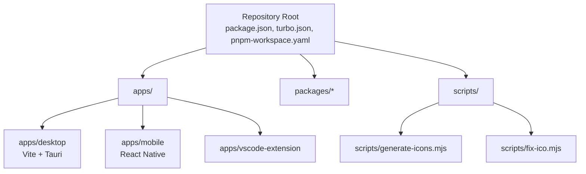
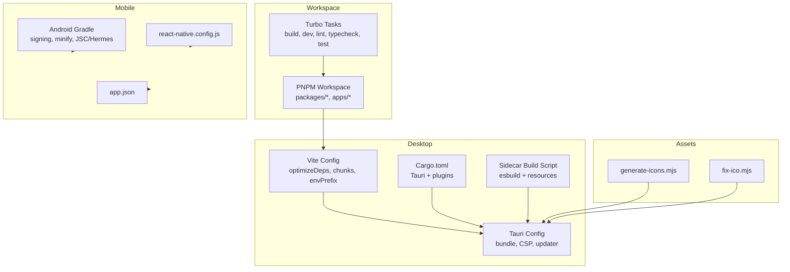
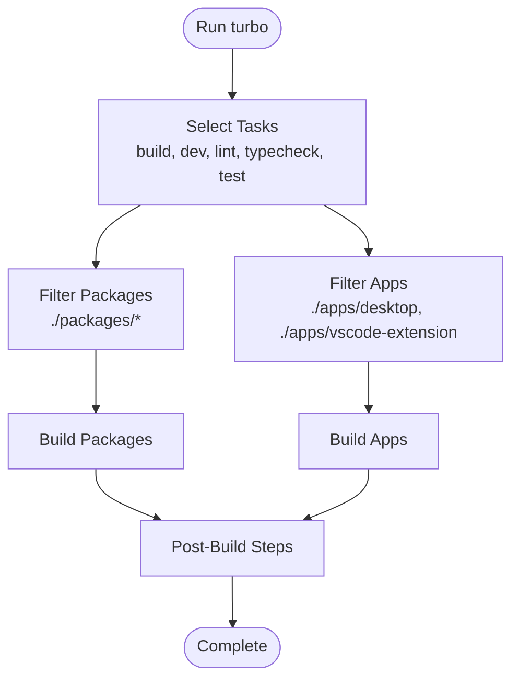
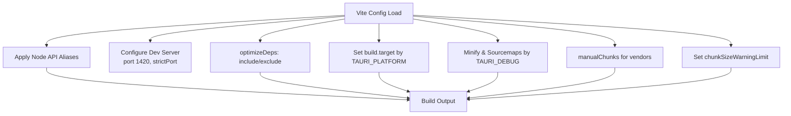
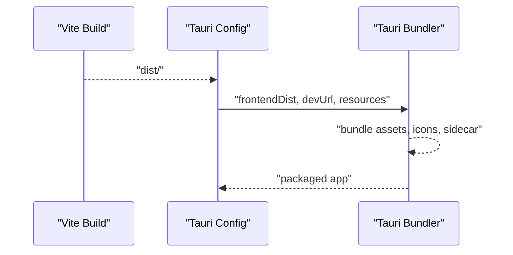
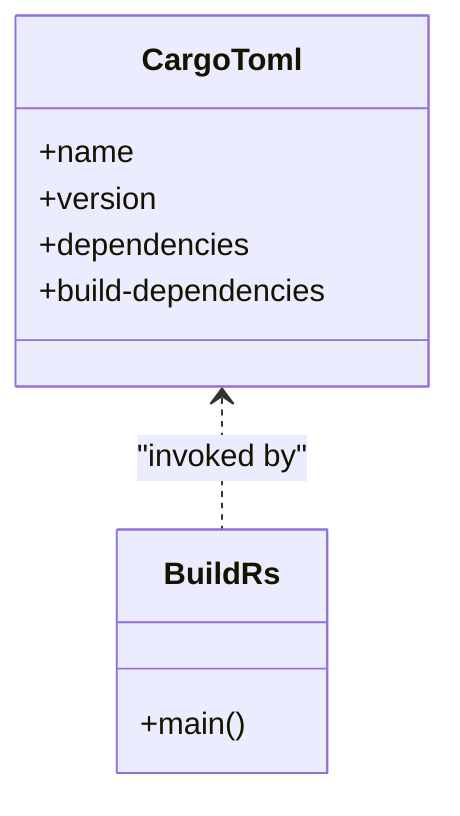
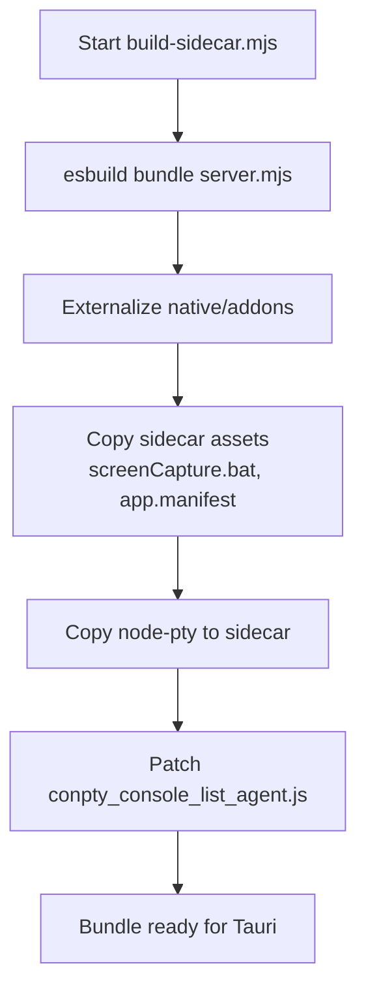
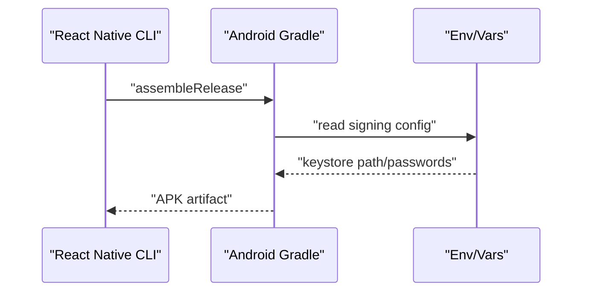
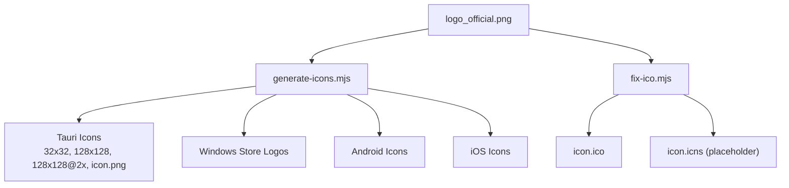
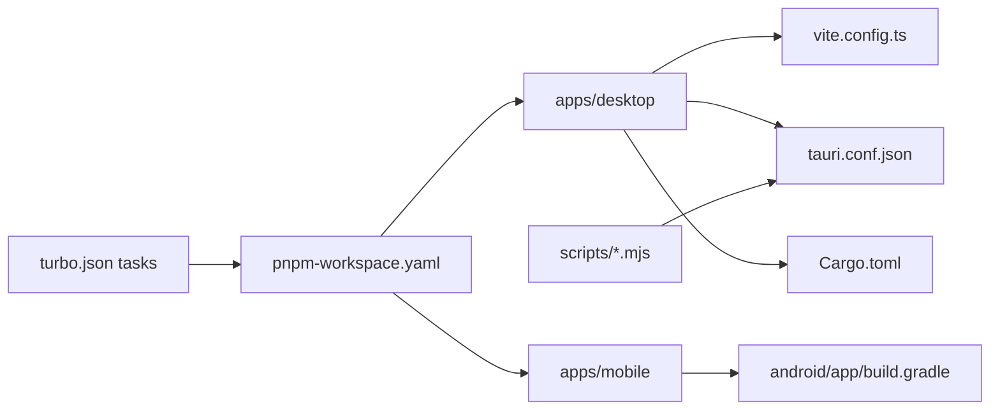

# Build and Deployment

<cite>
**Referenced Files in This Document**
- [turbo.json](file://turbo.json)
- [package.json](file://package.json)
- [pnpm-workspace.yaml](file://pnpm-workspace.yaml)
- [apps/desktop/vite.config.ts](file://apps/desktop/vite.config.ts)
- [apps/desktop/src-tauri/tauri.conf.json](file://apps/desktop/src-tauri/tauri.conf.json)
- [apps/desktop/src-tauri/build.rs](file://apps/desktop/src-tauri/build.rs)
- [apps/desktop/src-tauri/Cargo.toml](file://apps/desktop/src-tauri/Cargo.toml)
- [apps/desktop/scripts/build-sidecar.mjs](file://apps/desktop/scripts/build-sidecar.mjs)
- [apps/desktop/src-tauri/sidecar/server.mjs](file://apps/desktop/src-tauri/sidecar/server.mjs)
- [apps/desktop/src-tauri/sidecar/app.manifest](file://apps/desktop/src-tauri/sidecar/app.manifest)
- [scripts/generate-icons.mjs](file://scripts/generate-icons.mjs)
- [scripts/fix-ico.mjs](file://scripts/fix-ico.mjs)
- [apps/mobile/android/app/build.gradle](file://apps/mobile/android/app/build.gradle)
- [apps/mobile/react-native.config.js](file://apps/mobile/react-native.config.js)
- [apps/mobile/app.json](file://apps/mobile/app.json)
</cite>

## Table of Contents
1. [Introduction](#introduction)
2. [Project Structure](#project-structure)
3. [Core Components](#core-components)
4. [Architecture Overview](#architecture-overview)
5. [Detailed Component Analysis](#detailed-component-analysis)
6. [Dependency Analysis](#dependency-analysis)
7. [Performance Considerations](#performance-considerations)
8. [Troubleshooting Guide](#troubleshooting-guide)
9. [Conclusion](#conclusion)
10. [Appendices](#appendices)

## Introduction
This document explains the Build and Deployment system for the GHITA Coding Agent across desktop, mobile, and shared packages. It covers the TurboRepo orchestration, Vite configuration for the desktop web UI, Tauri native packaging, React Native Android build, asset management (icons, resources), sidecar server bundling, and deployment/release procedures. It also includes development workflows, optimization strategies, CI/CD integration patterns, platform-specific signing, and troubleshooting guidance.

## Project Structure
The repository is a monorepo organized by apps and packages. TurboRepo coordinates builds across workspaces, while platform-specific configurations handle packaging and distribution.

**Diagram sources**
- [package.json:1-55](file://package.json#L1-L55)
- [turbo.json:1-26](file://turbo.json#L1-L26)
- [pnpm-workspace.yaml:1-8](file://pnpm-workspace.yaml#L1-L8)

**Section sources**
- [package.json:1-55](file://package.json#L1-L55)
- [turbo.json:1-26](file://turbo.json#L1-L26)
- [pnpm-workspace.yaml:1-8](file://pnpm-workspace.yaml#L1-L8)

## Core Components
- Workspace and Orchestration
  - TurboRepo tasks define build, dev, lint, typecheck, test, and cache/persistence behavior. Filters target packages and apps.
  - PNPM workspace defines package locations and onlyBuiltDependencies for native modules.
- Desktop Application
  - Vite config for React UI, dependency optimization, chunk splitting, and Tauri integration.
  - Tauri config for bundling, CSP, updater, and platform resources/icons.
  - Rust backend via Tauri and Cargo for native capabilities.
  - Sidecar server built with esbuild and packaged as part of the app bundle.
- Mobile Application
  - React Native Android build with Gradle, JSC/Hermes selection, signing, and release/minification.
- Asset Management
  - Icon generation scripts produce platform-specific assets for Tauri, Windows Store, Android, and iOS.

**Section sources**
- [turbo.json:1-26](file://turbo.json#L1-L26)
- [package.json:9-26](file://package.json#L9-L26)
- [pnpm-workspace.yaml:1-8](file://pnpm-workspace.yaml#L1-L8)
- [apps/desktop/vite.config.ts:1-114](file://apps/desktop/vite.config.ts#L1-L114)
- [apps/desktop/src-tauri/tauri.conf.json:1-73](file://apps/desktop/src-tauri/tauri.conf.json#L1-L73)
- [apps/desktop/src-tauri/Cargo.toml:1-32](file://apps/desktop/src-tauri/Cargo.toml#L1-L32)
- [apps/desktop/scripts/build-sidecar.mjs:1-102](file://apps/desktop/scripts/build-sidecar.mjs#L1-L102)
- [apps/mobile/android/app/build.gradle:1-104](file://apps/mobile/android/app/build.gradle#L1-L104)
- [scripts/generate-icons.mjs:1-140](file://scripts/generate-icons.mjs#L1-L140)
- [scripts/fix-ico.mjs:1-53](file://scripts/fix-ico.mjs#L1-L53)

## Architecture Overview
The build system orchestrates multiple targets:
- Shared packages built first to satisfy downstream dependencies.
- Desktop web UI built with Vite and consumed by Tauri.
- Tauri bundles the frontend and native backend into a desktop app.
- Mobile app built via React Native CLI and Gradle for Android.
- Assets (icons, resources) generated and included in respective platforms.

**Diagram sources**
- [turbo.json:1-26](file://turbo.json#L1-L26)
- [pnpm-workspace.yaml:1-8](file://pnpm-workspace.yaml#L1-L8)
- [apps/desktop/vite.config.ts:1-114](file://apps/desktop/vite.config.ts#L1-L114)
- [apps/desktop/src-tauri/tauri.conf.json:1-73](file://apps/desktop/src-tauri/tauri.conf.json#L1-L73)
- [apps/desktop/src-tauri/Cargo.toml:1-32](file://apps/desktop/src-tauri/Cargo.toml#L1-L32)
- [apps/desktop/scripts/build-sidecar.mjs:1-102](file://apps/desktop/scripts/build-sidecar.mjs#L1-L102)
- [apps/mobile/android/app/build.gradle:1-104](file://apps/mobile/android/app/build.gradle#L1-L104)
- [apps/mobile/react-native.config.js:1-11](file://apps/mobile/react-native.config.js#L1-L11)
- [apps/mobile/app.json:1-5](file://apps/mobile/app.json#L1-L5)
- [scripts/generate-icons.mjs:1-140](file://scripts/generate-icons.mjs#L1-L140)
- [scripts/fix-ico.mjs:1-53](file://scripts/fix-ico.mjs#L1-L53)

## Detailed Component Analysis

### TurboRepo Orchestration
- Task definitions:
  - build depends on upstream packages (^build) and outputs dist/**.
  - dev is non-cached and persistent for interactive development.
  - lint/typecheck/test depend on build to ensure correctness against compiled artifacts.
  - clean disables caching to remove derived state.
- Workspace filtering:
  - Root scripts filter packages and apps for targeted builds.
  - onlyBuiltDependencies ensures native modules are prebuilt consistently.

**Diagram sources**
- [turbo.json:3-24](file://turbo.json#L3-L24)
- [package.json:9-26](file://package.json#L9-L26)
- [pnpm-workspace.yaml:1-8](file://pnpm-workspace.yaml#L1-L8)

**Section sources**
- [turbo.json:1-26](file://turbo.json#L1-L26)
- [package.json:9-26](file://package.json#L9-L26)
- [pnpm-workspace.yaml:1-8](file://pnpm-workspace.yaml#L1-L8)

### Desktop Build: Vite Configuration
Key behaviors:
- Aliasing Node APIs and heavy libraries to a shim to avoid bundling them in the renderer.
- Fixed dev server port (1420) for Tauri dev mode.
- Pre-bundling heavy dependencies to prevent WebView reloads during dev.
- Target selection based on platform (Chrome vs Safari).
- Manual chunking for vendor groups (React, Tauri plugins, state, sockets).
- Optional minification and source maps controlled by environment flags.

**Diagram sources**
- [apps/desktop/vite.config.ts:11-114](file://apps/desktop/vite.config.ts#L11-L114)

**Section sources**
- [apps/desktop/vite.config.ts:1-114](file://apps/desktop/vite.config.ts#L1-L114)

### Desktop Packaging: Tauri Configuration
Highlights:
- Frontend dist path and dev URL integration with Vite.
- Security policy (CSP) restricting origins and enabling IPC.
- Bundle targets “all” with resources inclusion (sidecar, proto).
- Icon sets for multiple formats and platforms.
- Updater endpoint and public key for signed updates.

**Diagram sources**
- [apps/desktop/src-tauri/tauri.conf.json:6-63](file://apps/desktop/src-tauri/tauri.conf.json#L6-L63)

**Section sources**
- [apps/desktop/src-tauri/tauri.conf.json:1-73](file://apps/desktop/src-tauri/tauri.conf.json#L1-L73)

### Rust Backend and Cargo
- Tauri crate with plugins for shell, fs, dialog, and updater.
- Hyper/Tokio stack for local HTTP server and networking.
- Build script delegates to tauri_build.

**Diagram sources**
- [apps/desktop/src-tauri/Cargo.toml:1-32](file://apps/desktop/src-tauri/Cargo.toml#L1-L32)
- [apps/desktop/src-tauri/build.rs:1-4](file://apps/desktop/src-tauri/build.rs#L1-L4)

**Section sources**
- [apps/desktop/src-tauri/Cargo.toml:1-32](file://apps/desktop/src-tauri/Cargo.toml#L1-L32)
- [apps/desktop/src-tauri/build.rs:1-4](file://apps/desktop/src-tauri/build.rs#L1-L4)

### Sidecar Server Build and Packaging
- esbuild bundles server.mjs into a single ESM output.
- Externalizes native/addon modules and copies required assets (e.g., screenshot-desktop resources).
- Copies node-pty into sidecar resources and patches a problematic Windows console attach call.
- On Windows, optionally bundles node.exe for self-contained runtime.

**Diagram sources**
- [apps/desktop/scripts/build-sidecar.mjs:14-102](file://apps/desktop/scripts/build-sidecar.mjs#L14-L102)
- [apps/desktop/src-tauri/sidecar/server.mjs:1-800](file://apps/desktop/src-tauri/sidecar/server.mjs#L1-L800)
- [apps/desktop/src-tauri/sidecar/app.manifest](file://apps/desktop/src-tauri/sidecar/app.manifest)

**Section sources**
- [apps/desktop/scripts/build-sidecar.mjs:1-102](file://apps/desktop/scripts/build-sidecar.mjs#L1-L102)
- [apps/desktop/src-tauri/sidecar/server.mjs:1-800](file://apps/desktop/src-tauri/sidecar/server.mjs#L1-L800)
- [apps/desktop/src-tauri/sidecar/app.manifest](file://apps/desktop/src-tauri/sidecar/app.manifest)

### Mobile Build: Android APK Generation
- React Native Gradle configuration with autolinking and JS engine selection.
- Signing configs for debug and release; release requires environment variables or gradle.properties.
- Proguard/R8 minification enabled for release builds.
- react-native.config.js and app.json define project metadata.

**Diagram sources**
- [apps/mobile/android/app/build.gradle:49-91](file://apps/mobile/android/app/build.gradle#L49-L91)
- [apps/mobile/react-native.config.js:1-11](file://apps/mobile/react-native.config.js#L1-L11)
- [apps/mobile/app.json:1-5](file://apps/mobile/app.json#L1-L5)

**Section sources**
- [apps/mobile/android/app/build.gradle:1-104](file://apps/mobile/android/app/build.gradle#L1-L104)
- [apps/mobile/react-native.config.js:1-11](file://apps/mobile/react-native.config.js#L1-L11)
- [apps/mobile/app.json:1-5](file://apps/mobile/app.json#L1-L5)

### Asset Management: Icons and Resources
- generate-icons.mjs:
  - Generates PNG icons for Tauri, Windows Store, Android, and iOS.
  - Produces ICO and placeholder ICNS for Windows and macOS.
- fix-ico.mjs:
  - Creates a proper ICO with multiple embedded sizes using png-to-ico.

**Diagram sources**
- [scripts/generate-icons.mjs:46-134](file://scripts/generate-icons.mjs#L46-L134)
- [scripts/fix-ico.mjs:17-47](file://scripts/fix-ico.mjs#L17-L47)

**Section sources**
- [scripts/generate-icons.mjs:1-140](file://scripts/generate-icons.mjs#L1-L140)
- [scripts/fix-ico.mjs:1-53](file://scripts/fix-ico.mjs#L1-L53)

## Dependency Analysis
- Workspace dependencies:
  - TurboRepo tasks enforce topological ordering via ^build.
  - PNPM workspace globs packages and apps; onlyBuiltDependencies ensures consistent native module builds.
- Desktop build dependencies:
  - Vite aliases heavy modules to a shim; optimizeDeps excludes heavy packages and includes core vendor packages.
  - Tauri bundle includes sidecar and proto resources.
- Mobile build dependencies:
  - Android Gradle reads signing credentials from environment or gradle.properties.
- Asset dependencies:
  - Icon generation relies on Sharp and optional png-to-ico.

**Diagram sources**
- [turbo.json:1-26](file://turbo.json#L1-L26)
- [pnpm-workspace.yaml:1-8](file://pnpm-workspace.yaml#L1-L8)
- [apps/desktop/vite.config.ts:63-92](file://apps/desktop/vite.config.ts#L63-L92)
- [apps/desktop/src-tauri/tauri.conf.json:46-49](file://apps/desktop/src-tauri/tauri.conf.json#L46-L49)
- [apps/mobile/android/app/build.gradle:49-81](file://apps/mobile/android/app/build.gradle#L49-L81)
- [scripts/generate-icons.mjs:13-14](file://scripts/generate-icons.mjs#L13-L14)

**Section sources**
- [turbo.json:1-26](file://turbo.json#L1-L26)
- [pnpm-workspace.yaml:1-8](file://pnpm-workspace.yaml#L1-L8)
- [apps/desktop/vite.config.ts:63-92](file://apps/desktop/vite.config.ts#L63-L92)
- [apps/desktop/src-tauri/tauri.conf.json:46-49](file://apps/desktop/src-tauri/tauri.conf.json#L46-L49)
- [apps/mobile/android/app/build.gradle:49-81](file://apps/mobile/android/app/build.gradle#L49-L81)
- [scripts/generate-icons.mjs:13-14](file://scripts/generate-icons.mjs#L13-L14)

## Performance Considerations
- Vite optimization
  - Pre-bundle heavy dependencies to avoid mid-session reloads in Tauri WebView.
  - Split vendor chunks to improve caching and reduce initial payload.
  - Adjust chunkSizeWarningLimit to detect oversized chunks early.
- Desktop bundling
  - Use platform-specific targets to minimize polyfills and improve runtime performance.
  - Keep minification enabled in production builds; enable source maps only when debugging.
- Sidecar bundling
  - Externalize native/addon modules; bundle only necessary runtime files.
  - Patch problematic Windows console attach to avoid crashes and hangs.
- Mobile
  - Enable Proguard/R8 minification and keep Hermes/JSC aligned with performance goals.
  - Use environment variables for signing to avoid committing secrets.

[No sources needed since this section provides general guidance]

## Troubleshooting Guide
- Desktop: Vite dev server port conflicts
  - Ensure port 1420 is free or adjust strictPort behavior.
  - Verify Tauri devUrl matches Vite’s configured port.
- Desktop: Heavy dependency reloads in WebView
  - Confirm optimizeDeps.include lists core vendor packages.
  - Exclude heavy packages from Vite’s pre-bundling if they cause instability.
- Desktop: Sidecar runtime issues on Windows
  - Re-run build-sidecar to re-copy node.exe and node-pty.
  - Apply the conpty console attach patch if pairing or terminal sessions fail.
- Desktop: Tauri bundle missing resources
  - Verify tauri.conf.json resources and icons paths.
  - Regenerate icons using generate-icons.mjs or fix-ico.mjs.
- Mobile: Android release signing failures
  - Set GHITA_RELEASE_KEYSTORE_PATH, GHITA_RELEASE_KEYSTORE_PASSWORD, GHITA_RELEASE_KEY_ALIAS, GHITA_RELEASE_KEY_PASSWORD.
  - Use gradle.properties fallback values if environment variables are not present.
- Mobile: Gradle sync or NDK issues
  - Ensure ndkVersion, buildToolsVersion, compileSdkVersion, targetSdkVersion align with local SDK setup.
- General: Workspace build inconsistencies
  - Clear caches with turbo clean and rebuild filtered targets.
  - Reinstall dependencies with pnpm and onlyBuiltDependencies applied.

**Section sources**
- [apps/desktop/vite.config.ts:48-54](file://apps/desktop/vite.config.ts#L48-L54)
- [apps/desktop/vite.config.ts:63-92](file://apps/desktop/vite.config.ts#L63-L92)
- [apps/desktop/scripts/build-sidecar.mjs:43-48](file://apps/desktop/scripts/build-sidecar.mjs#L43-L48)
- [apps/desktop/scripts/build-sidecar.mjs:69-100](file://apps/desktop/scripts/build-sidecar.mjs#L69-L100)
- [apps/desktop/src-tauri/tauri.conf.json:46-56](file://apps/desktop/src-tauri/tauri.conf.json#L46-L56)
- [scripts/generate-icons.mjs:16-20](file://scripts/generate-icons.mjs#L16-L20)
- [scripts/fix-ico.mjs:17-47](file://scripts/fix-ico.mjs#L17-L47)
- [apps/mobile/android/app/build.gradle:56-80](file://apps/mobile/android/app/build.gradle#L56-L80)
- [package.json:21-26](file://package.json#L21-L26)

## Conclusion
The build and deployment system leverages TurboRepo for orchestration, Vite for the desktop UI, Tauri for native packaging, and React Native for Android. Asset generation and sidecar bundling are automated via scripts. Platform-specific signing and resource inclusion are handled through configuration files. Following the outlined workflows and troubleshooting steps ensures reliable builds and smooth deployments across desktop and mobile.

[No sources needed since this section summarizes without analyzing specific files]

## Appendices

### Development Workflow
- Local development
  - Run turbo dev for workspace-wide watching.
  - Use dev:desktop and dev:android for platform-specific dev servers.
- Hot reloading and debugging
  - Vite dev server at port 1420; Tauri dev integrates with devUrl.
  - Desktop sidecar logs and health endpoints aid debugging.
- Best practices
  - Keep optimizeDeps updated with heavy dependencies.
  - Use environment variables for secrets (e.g., Android signing).
  - Regularly regenerate icons and verify Tauri bundle resources.

**Section sources**
- [package.json:10-12](file://package.json#L10-L12)
- [apps/desktop/vite.config.ts:48-54](file://apps/desktop/vite.config.ts#L48-L54)
- [apps/desktop/src-tauri/tauri.conf.json:8](file://apps/desktop/src-tauri/tauri.conf.json#L8)

### Deployment Pipeline and Release Procedures
- Desktop
  - Build with tauri build; Tauri bundles resources and icons.
  - Updater configuration enables over-the-air updates with a public key.
- Mobile
  - Build release APK with assembleRelease; ensure signing variables are set.
- Version management
  - Update app versions in tauri.conf.json and package.json as needed.
- Automated builds
  - Integrate turbo build and platform-specific build scripts into CI/CD pipelines.
  - Cache node_modules and Turbo outputs to speed up jobs.

**Section sources**
- [apps/desktop/src-tauri/tauri.conf.json:4-10](file://apps/desktop/src-tauri/tauri.conf.json#L4-L10)
- [apps/desktop/src-tauri/tauri.conf.json:65-71](file://apps/desktop/src-tauri/tauri.conf.json#L65-L71)
- [apps/mobile/android/app/build.gradle:82-91](file://apps/mobile/android/app/build.gradle#L82-L91)

### CI/CD Integration Patterns
- Jobs
  - Install dependencies with pnpm and onlyBuiltDependencies.
  - Run turbo build with filters for packages and apps.
  - Build desktop with tauri build and mobile with Gradle assembleRelease.
- Caching
  - Cache node_modules and .turbo directories.
  - Cache pnpm store for faster installs.
- Secrets
  - Provide Android signing keys via environment variables or CI secrets.
  - Use Tauri updater public key for signed releases.

**Section sources**
- [package.json:9-26](file://package.json#L9-L26)
- [pnpm-workspace.yaml:5-8](file://pnpm-workspace.yaml#L5-L8)
- [apps/mobile/android/app/build.gradle:56-80](file://apps/mobile/android/app/build.gradle#L56-L80)

### Platform-Specific Notes
- Desktop
  - Windows: WebView Chromium target; ensure webview installer mode.
  - macOS/Linux: Safari target; verify CSP allows necessary connections.
- Mobile
  - Android: JSC/Hermes selection; Proguard/R8 minification; signing requirements.
  - iOS: Icons managed via Xcode assets; ensure proper entitlements and provisioning profiles.

**Section sources**
- [apps/desktop/vite.config.ts:96](file://apps/desktop/vite.config.ts#L96)
- [apps/desktop/src-tauri/tauri.conf.json:57-62](file://apps/desktop/src-tauri/tauri.conf.json#L57-L62)
- [apps/mobile/android/app/build.gradle:34](file://apps/mobile/android/app/build.gradle#L34)
- [apps/mobile/android/app/build.gradle:88-90](file://apps/mobile/android/app/build.gradle#L88-L90)