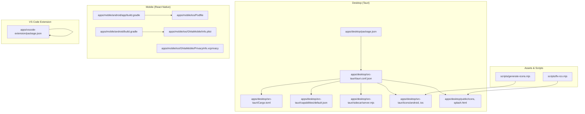
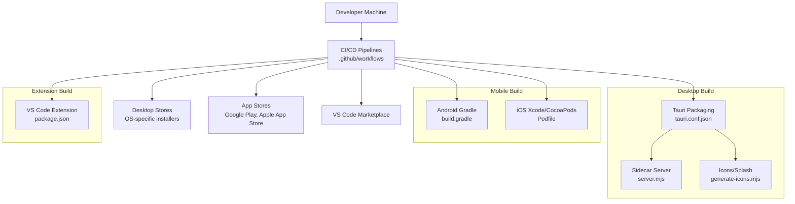
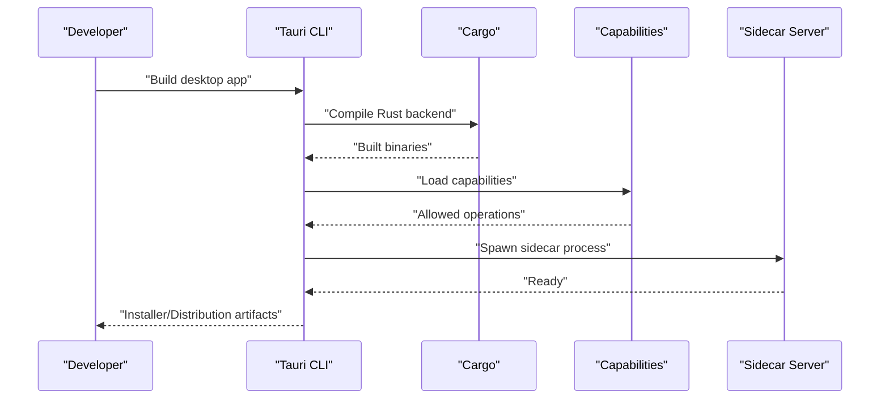
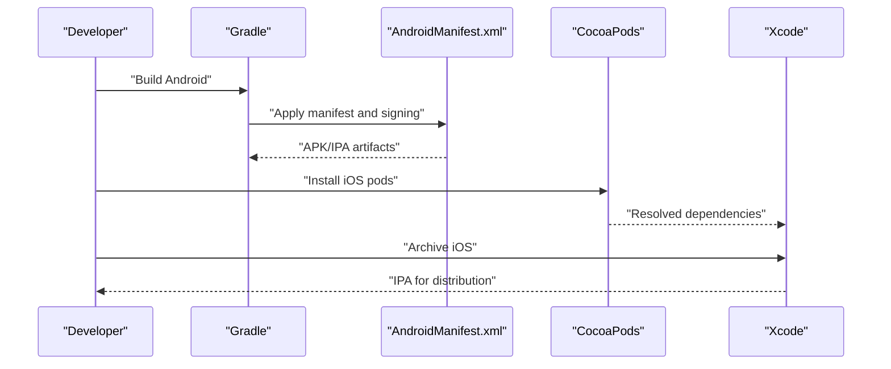
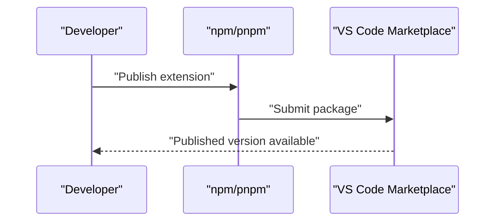
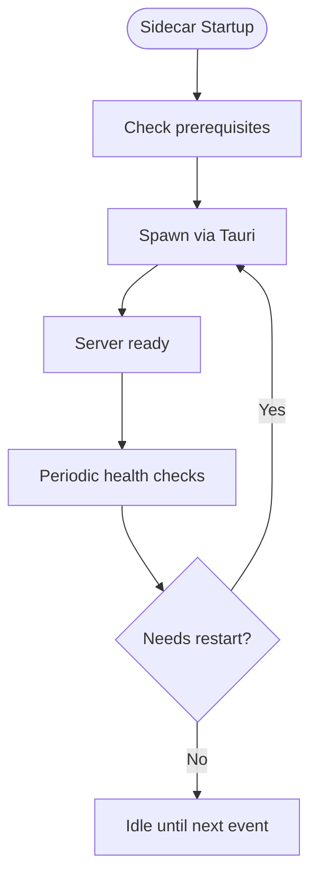
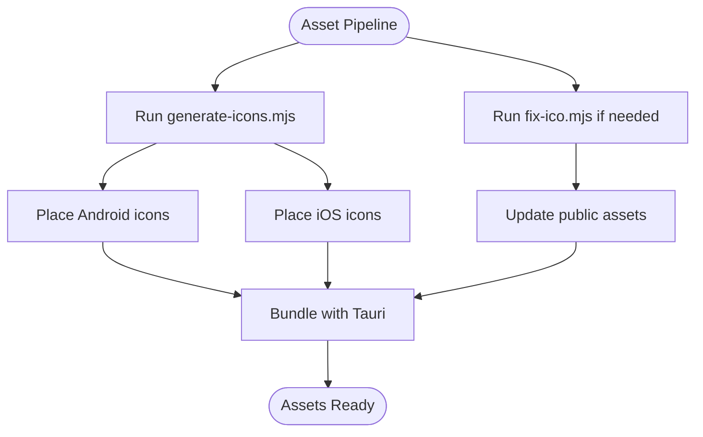
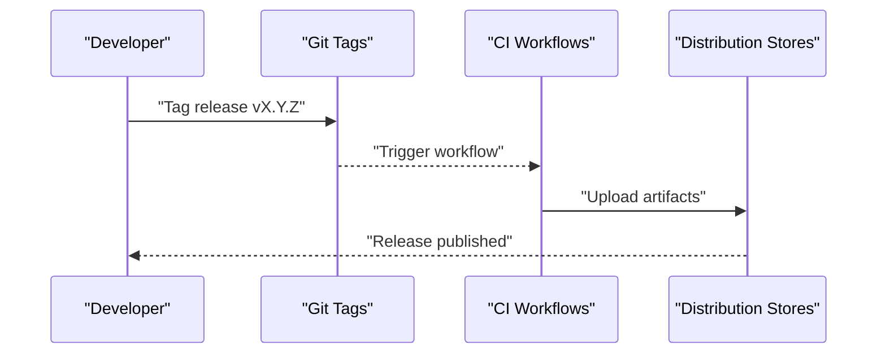
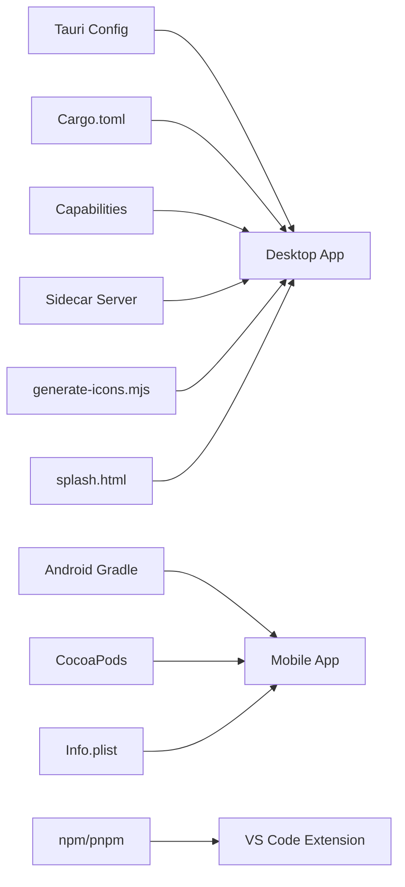

# Deployment and Distribution

<cite>
**Referenced Files in This Document**
- [apps/desktop/package.json](file://apps/desktop/package.json)
- [apps/desktop/src-tauri/tauri.conf.json](file://apps/desktop/src-tauri/tauri.conf.json)
- [apps/desktop/src-tauri/Cargo.toml](file://apps/desktop/src-tauri/Cargo.toml)
- [apps/desktop/src-tauri/capabilities/default.json](file://apps/desktop/src-tauri/capabilities/default.json)
- [apps/desktop/src-tauri/sidecar/server.mjs](file://apps/desktop/src-tauri/sidecar/server.mjs)
- [apps/desktop/src-tauri/sidecar/app.manifest](file://apps/desktop/src-tauri/sidecar/app.manifest)
- [apps/desktop/scripts/build-sidecar.mjs](file://apps/desktop/scripts/build-sidecar.mjs)
- [apps/mobile/android/app/build.gradle](file://apps/mobile/android/app/build.gradle)
- [apps/mobile/android/build.gradle](file://apps/mobile/android/build.gradle)
- [apps/mobile/android/app/src/main/AndroidManifest.xml](file://apps/mobile/android/app/src/main/AndroidManifest.xml)
- [apps/mobile/ios/GhitaMobile/AppDelegate.mm](file://apps/mobile/ios/GhitaMobile/AppDelegate.mm)
- [apps/mobile/ios/GhitaMobile/Info.plist](file://apps/mobile/ios/GhitaMobile/Info.plist)
- [apps/mobile/ios/GhitaMobile/Podfile](file://apps/mobile/ios/Podfile)
- [apps/mobile/ios/GhitaMobile/PrivacyInfo.xcprivacy](file://apps/mobile/ios/GhitaMobile/PrivacyInfo.xcprivacy)
- [apps/mobile/ios/GhitaMobile/LaunchScreen.storyboard](file://apps/mobile/ios/GhitaMobile/LaunchScreen.storyboard)
- [apps/mobile/scripts/patch-jcenter.js](file://apps/mobile/scripts/patch-jcenter.js)
- [apps/vscode-extension/package.json](file://apps/vscode-extension/package.json)
- [apps/vscode-extension/src/extension.ts](file://apps/vscode-extension/src/extension.ts)
- [scripts/generate-icons.mjs](file://scripts/generate-icons.mjs)
- [scripts/fix-ico.mjs](file://scripts/fix-ico.mjs)
- [apps/desktop/public/icons](file://apps/desktop/public/icons)
- [apps/desktop/public/splash.html](file://apps/desktop/public/splash.html)
- [apps/desktop/src-tauri/icons/android](file://apps/desktop/src-tauri/icons/android)
- [apps/desktop/src-tauri/icons/ios](file://apps/desktop/src-tauri/icons/ios)
- [.github/workflows](file://.github/workflows)
- [README.md](file://README.md)
</cite>

## Table of Contents
1. [Introduction](#introduction)
2. [Project Structure](#project-structure)
3. [Core Components](#core-components)
4. [Architecture Overview](#architecture-overview)
5. [Detailed Component Analysis](#detailed-component-analysis)
6. [Dependency Analysis](#dependency-analysis)
7. [Performance Considerations](#performance-considerations)
8. [Troubleshooting Guide](#troubleshooting-guide)
9. [Conclusion](#conclusion)
10. [Appendices](#appendices)

## Introduction
This document explains deployment and distribution strategies across desktop (Tauri), mobile (Android/iOS), and the VS Code extension. It covers packaging, capability management, security policies, platform-specific signing, sidecar server deployment, asset generation, release management, environment strategies, rollback procedures, and monitoring. The goal is to enable repeatable, secure, and compliant releases for development, staging, and production.

## Project Structure
The repository organizes distribution concerns by application:
- Desktop: Tauri-based with Rust backend, TypeScript frontend, and sidecar server.
- Mobile: React Native Android and iOS projects with platform-specific assets and configurations.
- VS Code Extension: A Node-based extension packaged via npm/yarn/pnpm.
- Shared assets: Icon and splash generation scripts and resources.

**Diagram sources**
- [apps/desktop/package.json](file://apps/desktop/package.json)
- [apps/desktop/src-tauri/tauri.conf.json](file://apps/desktop/src-tauri/tauri.conf.json)
- [apps/desktop/src-tauri/Cargo.toml](file://apps/desktop/src-tauri/Cargo.toml)
- [apps/desktop/src-tauri/capabilities/default.json](file://apps/desktop/src-tauri/capabilities/default.json)
- [apps/desktop/src-tauri/sidecar/server.mjs](file://apps/desktop/src-tauri/sidecar/server.mjs)
- [apps/desktop/src-tauri/icons/android](file://apps/desktop/src-tauri/icons/android)
- [apps/desktop/src-tauri/icons/ios](file://apps/desktop/src-tauri/icons/ios)
- [apps/desktop/public/icons](file://apps/desktop/public/icons)
- [apps/desktop/public/splash.html](file://apps/desktop/public/splash.html)
- [apps/mobile/android/app/build.gradle](file://apps/mobile/android/app/build.gradle)
- [apps/mobile/android/build.gradle](file://apps/mobile/android/build.gradle)
- [apps/mobile/ios/Podfile](file://apps/mobile/ios/Podfile)
- [apps/mobile/ios/GhitaMobile/Info.plist](file://apps/mobile/ios/GhitaMobile/Info.plist)
- [apps/mobile/ios/GhitaMobile/PrivacyInfo.xcprivacy](file://apps/mobile/ios/GhitaMobile/PrivacyInfo.xcprivacy)
- [scripts/generate-icons.mjs](file://scripts/generate-icons.mjs)
- [scripts/fix-ico.mjs](file://scripts/fix-ico.mjs)

**Section sources**
- [apps/desktop/package.json](file://apps/desktop/package.json)
- [apps/desktop/src-tauri/tauri.conf.json](file://apps/desktop/src-tauri/tauri.conf.json)
- [apps/desktop/src-tauri/Cargo.toml](file://apps/desktop/src-tauri/Cargo.toml)
- [apps/desktop/src-tauri/capabilities/default.json](file://apps/desktop/src-tauri/capabilities/default.json)
- [apps/desktop/src-tauri/sidecar/server.mjs](file://apps/desktop/src-tauri/sidecar/server.mjs)
- [apps/desktop/src-tauri/icons/android](file://apps/desktop/src-tauri/icons/android)
- [apps/desktop/src-tauri/icons/ios](file://apps/desktop/src-tauri/icons/ios)
- [apps/desktop/public/icons](file://apps/desktop/public/icons)
- [apps/desktop/public/splash.html](file://apps/desktop/public/splash.html)
- [apps/mobile/android/app/build.gradle](file://apps/mobile/android/app/build.gradle)
- [apps/mobile/android/build.gradle](file://apps/mobile/android/build.gradle)
- [apps/mobile/ios/Podfile](file://apps/mobile/ios/Podfile)
- [apps/mobile/ios/GhitaMobile/Info.plist](file://apps/mobile/ios/GhitaMobile/Info.plist)
- [apps/mobile/ios/GhitaMobile/PrivacyInfo.xcprivacy](file://apps/mobile/ios/GhitaMobile/PrivacyInfo.xcprivacy)
- [scripts/generate-icons.mjs](file://scripts/generate-icons.mjs)
- [scripts/fix-ico.mjs](file://scripts/fix-ico.mjs)

## Core Components
- Desktop application packaging via Tauri with Rust backend and TypeScript frontend. Packaging configuration is defined in tauri.conf.json and Cargo.toml. Capabilities define allowed operations and APIs. A Node.js sidecar runs alongside the app.
- Mobile application packaging via Gradle (Android) and CocoaPods/Xcode (iOS). Platform-specific signing and entitlements are configured in Gradle and Info.plist respectively.
- VS Code extension packaging via npm/pnpm with manifest metadata and activation events.
- Asset generation pipeline for icons and splash screens using Node scripts.

**Section sources**
- [apps/desktop/src-tauri/tauri.conf.json](file://apps/desktop/src-tauri/tauri.conf.json)
- [apps/desktop/src-tauri/Cargo.toml](file://apps/desktop/src-tauri/Cargo.toml)
- [apps/desktop/src-tauri/capabilities/default.json](file://apps/desktop/src-tauri/capabilities/default.json)
- [apps/desktop/src-tauri/sidecar/server.mjs](file://apps/desktop/src-tauri/sidecar/server.mjs)
- [apps/mobile/android/app/build.gradle](file://apps/mobile/android/app/build.gradle)
- [apps/mobile/ios/Podfile](file://apps/mobile/ios/Podfile)
- [apps/vscode-extension/package.json](file://apps/vscode-extension/package.json)
- [scripts/generate-icons.mjs](file://scripts/generate-icons.mjs)

## Architecture Overview
The distribution architecture integrates platform-specific build systems with shared asset generation and release orchestration.

**Diagram sources**
- [.github/workflows](file://.github/workflows)
- [apps/desktop/src-tauri/tauri.conf.json](file://apps/desktop/src-tauri/tauri.conf.json)
- [apps/desktop/src-tauri/sidecar/server.mjs](file://apps/desktop/src-tauri/sidecar/server.mjs)
- [scripts/generate-icons.mjs](file://scripts/generate-icons.mjs)
- [apps/mobile/android/app/build.gradle](file://apps/mobile/android/app/build.gradle)
- [apps/mobile/ios/Podfile](file://apps/mobile/ios/Podfile)
- [apps/vscode-extension/package.json](file://apps/vscode-extension/package.json)

## Detailed Component Analysis

### Desktop Application Packaging (Tauri)
- Packaging configuration: tauri.conf.json defines windowing, updater, security policies, and bundling options. Cargo.toml configures the Rust backend and dependencies.
- Capability management: capabilities/default.json restricts allowed operations to reduce attack surface.
- Sidecar server: server.mjs runs as a separate process managed by Tauri; app.manifest describes its lifecycle and permissions.
- Asset generation: generate-icons.mjs produces platform-appropriate icons; desktop public assets include splash.html and icons directory.

**Diagram sources**
- [apps/desktop/src-tauri/tauri.conf.json](file://apps/desktop/src-tauri/tauri.conf.json)
- [apps/desktop/src-tauri/Cargo.toml](file://apps/desktop/src-tauri/Cargo.toml)
- [apps/desktop/src-tauri/capabilities/default.json](file://apps/desktop/src-tauri/capabilities/default.json)
- [apps/desktop/src-tauri/sidecar/server.mjs](file://apps/desktop/src-tauri/sidecar/server.mjs)

**Section sources**
- [apps/desktop/src-tauri/tauri.conf.json](file://apps/desktop/src-tauri/tauri.conf.json)
- [apps/desktop/src-tauri/Cargo.toml](file://apps/desktop/src-tauri/Cargo.toml)
- [apps/desktop/src-tauri/capabilities/default.json](file://apps/desktop/src-tauri/capabilities/default.json)
- [apps/desktop/src-tauri/sidecar/server.mjs](file://apps/desktop/src-tauri/sidecar/server.mjs)
- [apps/desktop/src-tauri/sidecar/app.manifest](file://apps/desktop/src-tauri/sidecar/app.manifest)
- [apps/desktop/public/splash.html](file://apps/desktop/public/splash.html)
- [scripts/generate-icons.mjs](file://scripts/generate-icons.mjs)

### Mobile Application Distribution (Android and iOS)
- Android packaging: Gradle builds APK/APKs; signing is configured in Gradle files; AndroidManifest.xml defines permissions and app metadata.
- iOS packaging: CocoaPods resolves dependencies; Info.plist defines app metadata, privacy declarations, and launch storyboard; Podfile manages pods.
- Security and privacy: PrivacyInfo.xcprivacy declares data collection; network_security_config.xml may be used for cleartext policy on Android.

**Diagram sources**
- [apps/mobile/android/app/build.gradle](file://apps/mobile/android/app/build.gradle)
- [apps/mobile/android/build.gradle](file://apps/mobile/android/build.gradle)
- [apps/mobile/android/app/src/main/AndroidManifest.xml](file://apps/mobile/android/app/src/main/AndroidManifest.xml)
- [apps/mobile/ios/Podfile](file://apps/mobile/ios/Podfile)
- [apps/mobile/ios/GhitaMobile/Info.plist](file://apps/mobile/ios/GhitaMobile/Info.plist)
- [apps/mobile/ios/GhitaMobile/PrivacyInfo.xcprivacy](file://apps/mobile/ios/GhitaMobile/PrivacyInfo.xcprivacy)

**Section sources**
- [apps/mobile/android/app/build.gradle](file://apps/mobile/android/app/build.gradle)
- [apps/mobile/android/build.gradle](file://apps/mobile/android/build.gradle)
- [apps/mobile/android/app/src/main/AndroidManifest.xml](file://apps/mobile/android/app/src/main/AndroidManifest.xml)
- [apps/mobile/ios/Podfile](file://apps/mobile/ios/Podfile)
- [apps/mobile/ios/GhitaMobile/Info.plist](file://apps/mobile/ios/GhitaMobile/Info.plist)
- [apps/mobile/ios/GhitaMobile/PrivacyInfo.xcprivacy](file://apps/mobile/ios/GhitaMobile/PrivacyInfo.xcprivacy)
- [apps/mobile/scripts/patch-jcenter.js](file://apps/mobile/scripts/patch-jcenter.js)

### VS Code Extension Publishing
- Packaging: package.json defines metadata, activation events, contributes, and publisher fields.
- Publishing: Use the marketplace submission process via the publisher account; version management is controlled by package.json version and changelog updates.
- Update mechanism: The extension loads on activation; updates are distributed through the marketplace.

**Diagram sources**
- [apps/vscode-extension/package.json](file://apps/vscode-extension/package.json)

**Section sources**
- [apps/vscode-extension/package.json](file://apps/vscode-extension/package.json)
- [apps/vscode-extension/src/extension.ts](file://apps/vscode-extension/src/extension.ts)

### Sidecar Server Deployment (Desktop)
- Runtime requirements: Node.js script server.mjs runs as a sidecar process.
- Process management: Spawned by Tauri; lifecycle governed by app.manifest.
- Auto-start: Managed by Tauri’s process model; ensure proper startup hooks in tauri.conf.json.

**Diagram sources**
- [apps/desktop/src-tauri/sidecar/server.mjs](file://apps/desktop/src-tauri/sidecar/server.mjs)
- [apps/desktop/src-tauri/sidecar/app.manifest](file://apps/desktop/src-tauri/sidecar/app.manifest)
- [apps/desktop/src-tauri/tauri.conf.json](file://apps/desktop/src-tauri/tauri.conf.json)

**Section sources**
- [apps/desktop/src-tauri/sidecar/server.mjs](file://apps/desktop/src-tauri/sidecar/server.mjs)
- [apps/desktop/src-tauri/sidecar/app.manifest](file://apps/desktop/src-tauri/sidecar/app.manifest)
- [apps/desktop/src-tauri/tauri.conf.json](file://apps/desktop/src-tauri/tauri.conf.json)

### Asset Generation and Optimization
- Icons: generate-icons.mjs creates platform-specific icon sets; desktop public/icons and src-tauri/icons/android, src-tauri/icons/ios are used during packaging.
- Splash screen: splash.html is included for desktop loading experience.
- Resource bundling: Tauri bundles assets defined in tauri.conf.json; ensure assets are placed under the correct public paths.

**Diagram sources**
- [scripts/generate-icons.mjs](file://scripts/generate-icons.mjs)
- [scripts/fix-ico.mjs](file://scripts/fix-ico.mjs)
- [apps/desktop/public/icons](file://apps/desktop/public/icons)
- [apps/desktop/public/splash.html](file://apps/desktop/public/splash.html)
- [apps/desktop/src-tauri/icons/android](file://apps/desktop/src-tauri/icons/android)
- [apps/desktop/src-tauri/icons/ios](file://apps/desktop/src-tauri/icons/ios)

**Section sources**
- [scripts/generate-icons.mjs](file://scripts/generate-icons.mjs)
- [scripts/fix-ico.mjs](file://scripts/fix-ico.mjs)
- [apps/desktop/public/icons](file://apps/desktop/public/icons)
- [apps/desktop/public/splash.html](file://apps/desktop/public/splash.html)
- [apps/desktop/src-tauri/icons/android](file://apps/desktop/src-tauri/icons/android)
- [apps/desktop/src-tauri/icons/ios](file://apps/desktop/src-tauri/icons/ios)

### Release Management
- Version tagging: Use semantic versioning in package.json and tauri.conf.json; tag releases in Git.
- Changelog generation: Maintain a changelog per release; automate with CI if desired.
- Automated deployment pipelines: GitHub Actions workflows orchestrate builds and uploads for each platform.

**Diagram sources**
- [.github/workflows](file://.github/workflows)
- [apps/desktop/package.json](file://apps/desktop/package.json)
- [apps/vscode-extension/package.json](file://apps/vscode-extension/package.json)

**Section sources**
- [.github/workflows](file://.github/workflows)
- [apps/desktop/package.json](file://apps/desktop/package.json)
- [apps/vscode-extension/package.json](file://apps/vscode-extension/package.json)

## Dependency Analysis
- Desktop depends on Tauri configuration, Rust compilation, and sidecar process.
- Mobile depends on Gradle for Android and CocoaPods/Xcode for iOS.
- Extension depends on npm/pnpm publishing and marketplace submission.
- Assets depend on Node scripts and static resource placement.

**Diagram sources**
- [apps/desktop/src-tauri/tauri.conf.json](file://apps/desktop/src-tauri/tauri.conf.json)
- [apps/desktop/src-tauri/Cargo.toml](file://apps/desktop/src-tauri/Cargo.toml)
- [apps/desktop/src-tauri/capabilities/default.json](file://apps/desktop/src-tauri/capabilities/default.json)
- [apps/desktop/src-tauri/sidecar/server.mjs](file://apps/desktop/src-tauri/sidecar/server.mjs)
- [apps/mobile/android/app/build.gradle](file://apps/mobile/android/app/build.gradle)
- [apps/mobile/ios/Podfile](file://apps/mobile/ios/Podfile)
- [apps/mobile/ios/GhitaMobile/Info.plist](file://apps/mobile/ios/GhitaMobile/Info.plist)
- [apps/vscode-extension/package.json](file://apps/vscode-extension/package.json)
- [scripts/generate-icons.mjs](file://scripts/generate-icons.mjs)
- [apps/desktop/public/splash.html](file://apps/desktop/public/splash.html)

**Section sources**
- [apps/desktop/src-tauri/tauri.conf.json](file://apps/desktop/src-tauri/tauri.conf.json)
- [apps/desktop/src-tauri/Cargo.toml](file://apps/desktop/src-tauri/Cargo.toml)
- [apps/desktop/src-tauri/capabilities/default.json](file://apps/desktop/src-tauri/capabilities/default.json)
- [apps/desktop/src-tauri/sidecar/server.mjs](file://apps/desktop/src-tauri/sidecar/server.mjs)
- [apps/mobile/android/app/build.gradle](file://apps/mobile/android/app/build.gradle)
- [apps/mobile/ios/Podfile](file://apps/mobile/ios/Podfile)
- [apps/mobile/ios/GhitaMobile/Info.plist](file://apps/mobile/ios/GhitaMobile/Info.plist)
- [apps/vscode-extension/package.json](file://apps/vscode-extension/package.json)
- [scripts/generate-icons.mjs](file://scripts/generate-icons.mjs)
- [apps/desktop/public/splash.html](file://apps/desktop/public/splash.html)

## Performance Considerations
- Desktop: Minimize sidecar dependencies and keep server.mjs lightweight; bundle only necessary assets.
- Mobile: Optimize APK/IPA size by removing unused resources and enabling ProGuard/R8; use appropriate ABI splits.
- Extension: Keep activation events minimal; defer heavy initialization.

## Troubleshooting Guide
- Desktop
  - Capability errors: Verify capabilities/default.json aligns with required APIs.
  - Sidecar failures: Confirm server.mjs is executable and app.manifest is valid.
  - Asset missing: Ensure icons and splash are generated and placed under public paths.
- Mobile
  - Android signing issues: Validate keystore configuration in Gradle files.
  - iOS archive failures: Confirm provisioning profiles and certificates; verify Info.plist entries.
  - JCenter deprecation: Apply patch-jcenter.js if legacy dependencies exist.
- Extension
  - Publish failures: Check package.json metadata and publisher permissions.

**Section sources**
- [apps/desktop/src-tauri/capabilities/default.json](file://apps/desktop/src-tauri/capabilities/default.json)
- [apps/desktop/src-tauri/sidecar/server.mjs](file://apps/desktop/src-tauri/sidecar/server.mjs)
- [apps/desktop/src-tauri/sidecar/app.manifest](file://apps/desktop/src-tauri/sidecar/app.manifest)
- [apps/desktop/public/icons](file://apps/desktop/public/icons)
- [apps/desktop/public/splash.html](file://apps/desktop/public/splash.html)
- [apps/mobile/android/app/build.gradle](file://apps/mobile/android/app/build.gradle)
- [apps/mobile/ios/GhitaMobile/Info.plist](file://apps/mobile/ios/GhitaMobile/Info.plist)
- [apps/mobile/scripts/patch-jcenter.js](file://apps/mobile/scripts/patch-jcenter.js)
- [apps/vscode-extension/package.json](file://apps/vscode-extension/package.json)

## Conclusion
This guide consolidates platform-specific deployment and distribution practices for desktop, mobile, and the VS Code extension. By leveraging Tauri, Gradle, CocoaPods/Xcode, and npm/pnpm, combined with robust asset generation and CI/CD automation, teams can deliver secure, compliant, and maintainable releases across environments.

## Appendices
- Environment strategies
  - Development: Local builds with debug signing and minimal capabilities.
  - Staging: Signed artifacts with restricted capabilities; pre-release testing.
  - Production: Full signing, hardened capabilities, and verified assets.
- Rollback procedures
  - Desktop: Revert installer to previous version; update tauri.conf.json updater settings if applicable.
  - Mobile: Revoke or downgrade current store listing; publish previous artifact.
  - Extension: Withdraw current version; publish previous version.
- Monitoring deployment health
  - Desktop: Monitor sidecar logs and Tauri updater metrics.
  - Mobile: Track crash reports and store analytics.
  - Extension: Monitor marketplace downloads and telemetry if enabled.

[No sources needed since this section provides general guidance]