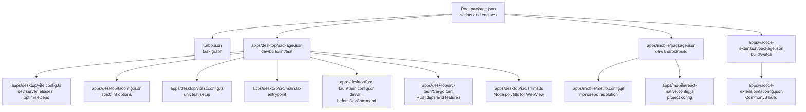
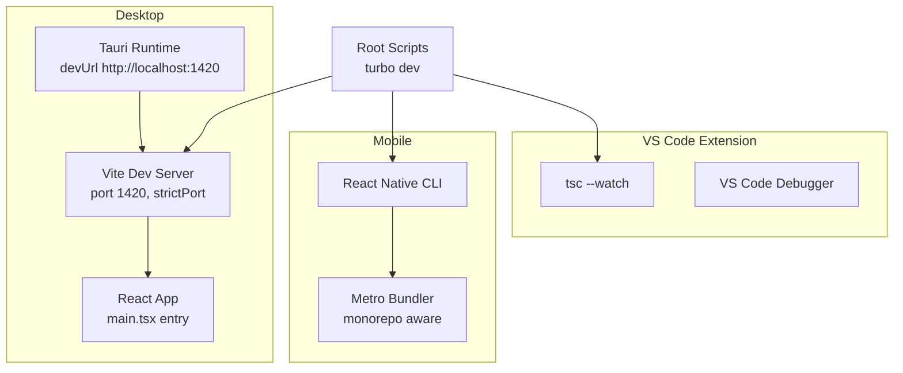
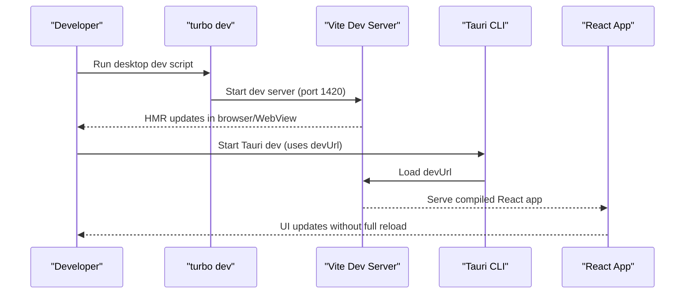
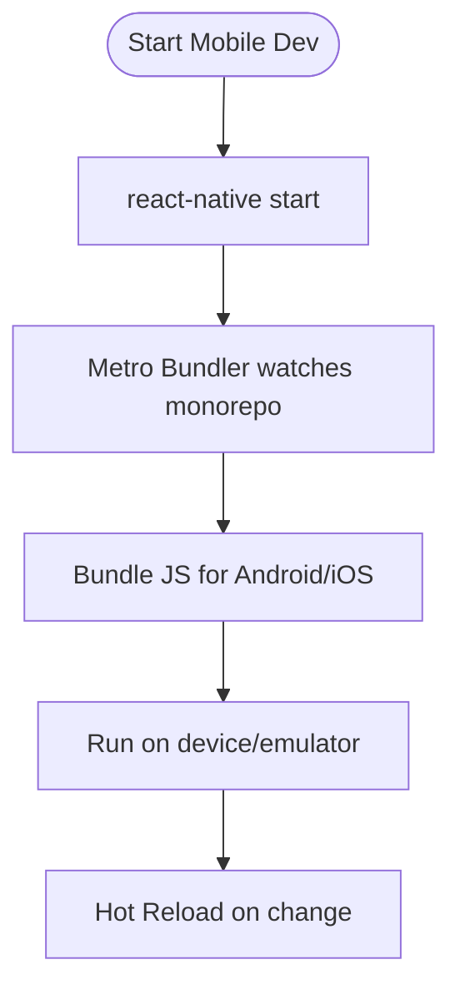
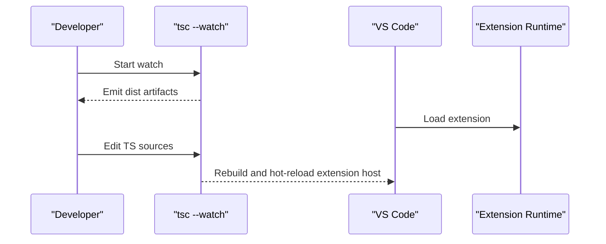
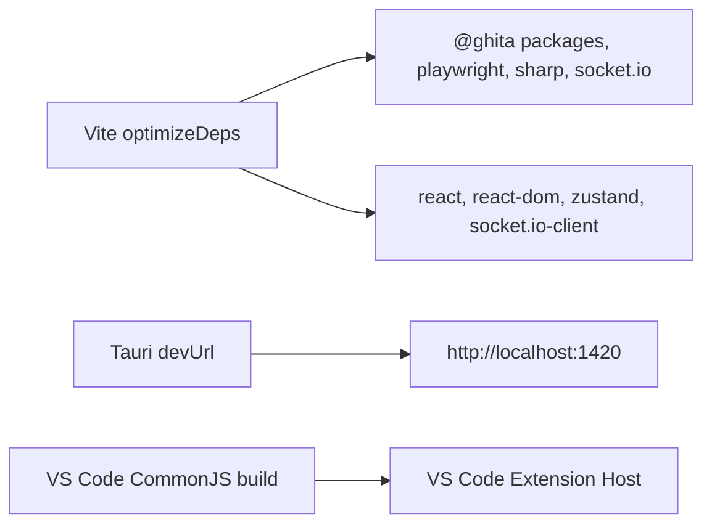

# Development Workflow and Optimization

<cite>
**Referenced Files in This Document**
- [package.json](file://package.json)
- [turbo.json](file://turbo.json)
- [eslint.config.js](file://eslint.config.js)
- [.prettierrc](file://.prettierrc)
- [apps/desktop/package.json](file://apps/desktop/package.json)
- [apps/desktop/vite.config.ts](file://apps/desktop/vite.config.ts)
- [apps/desktop/tsconfig.json](file://apps/desktop/tsconfig.json)
- [apps/desktop/vitest.config.ts](file://apps/desktop/vitest.config.ts)
- [apps/desktop/src/main.tsx](file://apps/desktop/src/main.tsx)
- [apps/desktop/src-tauri/tauri.conf.json](file://apps/desktop/src-tauri/tauri.conf.json)
- [apps/desktop/src-tauri/Cargo.toml](file://apps/desktop/src-tauri/Cargo.toml)
- [apps/desktop/src/shims.ts](file://apps/desktop/src/shims.ts)
- [apps/desktop/src/test-setup.ts](file://apps/desktop/src/test-setup.ts)
- [apps/mobile/package.json](file://apps/mobile/package.json)
- [apps/mobile/tsconfig.json](file://apps/mobile/tsconfig.json)
- [apps/mobile/metro.config.js](file://apps/mobile/metro.config.js)
- [apps/mobile/react-native.config.js](file://apps/mobile/react-native.config.js)
- [apps/vscode-extension/package.json](file://apps/vscode-extension/package.json)
- [apps/vscode-extension/tsconfig.json](file://apps/vscode-extension/tsconfig.json)
</cite>

## Table of Contents
1. [Introduction](#introduction)
2. [Project Structure](#project-structure)
3. [Core Components](#core-components)
4. [Architecture Overview](#architecture-overview)
5. [Detailed Component Analysis](#detailed-component-analysis)
6. [Dependency Analysis](#dependency-analysis)
7. [Performance Considerations](#performance-considerations)
8. [Troubleshooting Guide](#troubleshooting-guide)
9. [Conclusion](#conclusion)
10. [Appendices](#appendices)

## Introduction
This document explains the development workflow and optimization strategies for a cross-platform project spanning a Tauri desktop app, a React Native mobile app, and a VS Code extension. It covers hot reloading, debugging, formatting and linting, TypeScript checking, testing, development servers and ports, environment variables, and development automation. It also provides performance tips and troubleshooting guidance tailored to each platform.

## Project Structure
The repository is a monorepo managed with a task runner and package manager. Root-level scripts orchestrate development, building, linting, formatting, type checking, and testing across packages and apps. Platform-specific configurations define hot reload, bundling, and runtime behavior.

**Diagram sources**
- [package.json:9-26](file://package.json#L9-L26)
- [turbo.json:1-26](file://turbo.json#L1-L26)
- [apps/desktop/package.json:7-16](file://apps/desktop/package.json#L7-L16)
- [apps/desktop/vite.config.ts:11-114](file://apps/desktop/vite.config.ts#L11-L114)
- [apps/desktop/tsconfig.json:1-27](file://apps/desktop/tsconfig.json#L1-L27)
- [apps/desktop/vitest.config.ts:1-17](file://apps/desktop/vitest.config.ts#L1-L17)
- [apps/desktop/src/main.tsx:1-16](file://apps/desktop/src/main.tsx#L1-L16)
- [apps/desktop/src-tauri/tauri.conf.json:6-11](file://apps/desktop/src-tauri/tauri.conf.json#L6-L11)
- [apps/desktop/src-tauri/Cargo.toml:1-32](file://apps/desktop/src-tauri/Cargo.toml#L1-L32)
- [apps/desktop/src/shims.ts:1-162](file://apps/desktop/src/shims.ts#L1-L162)
- [apps/mobile/package.json:6-16](file://apps/mobile/package.json#L6-L16)
- [apps/mobile/metro.config.js:14-43](file://apps/mobile/metro.config.js#L14-L43)
- [apps/mobile/react-native.config.js:1-11](file://apps/mobile/react-native.config.js#L1-L11)
- [apps/vscode-extension/package.json:46-51](file://apps/vscode-extension/package.json#L46-L51)
- [apps/vscode-extension/tsconfig.json:1-17](file://apps/vscode-extension/tsconfig.json#L1-L17)

**Section sources**
- [package.json:1-55](file://package.json#L1-L55)
- [turbo.json:1-26](file://turbo.json#L1-L26)

## Core Components
- Root scripts orchestrate development, building, linting, formatting, type checking, and testing via the task runner.
- Desktop app uses Vite for dev server and React with Tauri for native packaging; includes a dedicated sidecar build script and pre-bundling strategy.
- Mobile app uses React Native with Metro configured for monorepo resolution and Android development.
- VS Code extension compiles TypeScript with a watch mode and exposes configuration options for the sidecar connection.

Key responsibilities:
- Hot reloading: Vite dev server for desktop; React Native CLI for mobile; TypeScript watch for VS Code extension.
- Debugging: Browser DevTools for desktop; React DevTools and Flipper for mobile; VS Code debugger for extension.
- Formatting and linting: Prettier and ESLint configured at root with platform-specific overrides.
- Testing: Vitest for desktop unit tests; React Native testing setup for mobile; Playwright/E2E coverage exists at repo root level.
- Environment variables: Vite envPrefix and Tauri devUrl; VS Code settings for sidecar port.

**Section sources**
- [package.json:9-26](file://package.json#L9-L26)
- [apps/desktop/package.json:7-16](file://apps/desktop/package.json#L7-L16)
- [apps/mobile/package.json:6-16](file://apps/mobile/package.json#L6-L16)
- [apps/vscode-extension/package.json:46-51](file://apps/vscode-extension/package.json#L46-L51)

## Architecture Overview
The development architecture centers on a unified task runner coordinating per-app configurations. Desktop integrates Vite for fast HMR and Tauri for packaging. Mobile relies on React Native CLI and Metro. The VS Code extension compiles to CommonJS and communicates with a sidecar server.

**Diagram sources**
- [apps/desktop/vite.config.ts:47-54](file://apps/desktop/vite.config.ts#L47-L54)
- [apps/desktop/src-tauri/tauri.conf.json:8](file://apps/desktop/src-tauri/tauri.conf.json#L8)
- [apps/desktop/src/main.tsx:1-16](file://apps/desktop/src/main.tsx#L1-L16)
- [apps/mobile/package.json:7-9](file://apps/mobile/package.json#L7-L9)
- [apps/vscode-extension/package.json:48](file://apps/vscode-extension/package.json#L48)

## Detailed Component Analysis

### Desktop Development Workflow (Vite + Tauri)
- Hot reloading: Vite dev server runs on a fixed port and watches frontend files while excluding Tauri sources to avoid unnecessary reloads.
- Aliasing: Node built-ins and heavy libraries are shimmed to prevent bundling conflicts and enable smooth HMR.
- Pre-bundling: Heavy dependencies are explicitly included to avoid mid-session reloads in the Tauri WebView.
- Environment variables: Vite exposes variables prefixed with VITE_ and TAURI_, enabling runtime configuration.
- Build targets: Output is optimized per platform with source maps controlled by a debug flag.

**Diagram sources**
- [apps/desktop/vite.config.ts:47-54](file://apps/desktop/vite.config.ts#L47-L54)
- [apps/desktop/src-tauri/tauri.conf.json:8](file://apps/desktop/src-tauri/tauri.conf.json#L8)
- [apps/desktop/src/main.tsx:1-16](file://apps/desktop/src/main.tsx#L1-L16)

**Section sources**
- [apps/desktop/vite.config.ts:11-114](file://apps/desktop/vite.config.ts#L11-L114)
- [apps/desktop/src-tauri/tauri.conf.json:6-11](file://apps/desktop/src-tauri/tauri.conf.json#L6-L11)
- [apps/desktop/src/main.tsx:1-16](file://apps/desktop/src/main.tsx#L1-L16)

### Mobile Development Workflow (React Native + Metro)
- Hot reloading: React Native CLI starts a dev server and Metro bundles JS; watchFolders include the monorepo root for shared packages.
- Resolution: Metro resolves packages from both local and monorepo node_modules and supports platform-specific extensions.
- Build pipeline: Android release builds use Gradle wrapper; development uses the React Native CLI.
- Type checking: TypeScript checks are integrated into scripts.

**Diagram sources**
- [apps/mobile/package.json:7-9](file://apps/mobile/package.json#L7-L9)
- [apps/mobile/metro.config.js:14-43](file://apps/mobile/metro.config.js#L14-L43)

**Section sources**
- [apps/mobile/package.json:6-16](file://apps/mobile/package.json#L6-L16)
- [apps/mobile/metro.config.js:14-43](file://apps/mobile/metro.config.js#L14-L43)
- [apps/mobile/react-native.config.js:1-11](file://apps/mobile/react-native.config.js#L1-L11)

### VS Code Extension Development Workflow
- Build and watch: TypeScript compile with watch mode for rapid iteration.
- Configuration: Exposes settings for sidecar port and auto-sync behavior.
- Packaging: Outputs CommonJS artifacts consumed by VS Code.

**Diagram sources**
- [apps/vscode-extension/package.json:46-51](file://apps/vscode-extension/package.json#L46-L51)
- [apps/vscode-extension/tsconfig.json:1-17](file://apps/vscode-extension/tsconfig.json#L1-L17)

**Section sources**
- [apps/vscode-extension/package.json:46-51](file://apps/vscode-extension/package.json#L46-L51)
- [apps/vscode-extension/tsconfig.json:1-17](file://apps/vscode-extension/tsconfig.json#L1-L17)

### Debugging Configuration
- Desktop: Use browser DevTools for front-end logic; Tauri dev mode loads the Vite URL for seamless debugging. Breakpoints in React components and utilities work out of the box.
- Mobile: Use Flipper for device inspection and React DevTools for component hierarchy. React Native CLI logs are visible in terminal.
- VS Code extension: Attach the VS Code debugger to the Extension Host. Configure launch settings to target the extension host process.

Environment variable handling:
- Desktop: Vite envPrefix allows exposing variables prefixed with VITE_ and TAURI_. Tauri devUrl is set to the Vite port.
- Mobile: No explicit environment variable exposure is defined in scripts; rely on React Native defaults.
- VS Code extension: Uses VS Code settings to configure sidecar port and auto-sync.

**Section sources**
- [apps/desktop/vite.config.ts:59-61](file://apps/desktop/vite.config.ts#L59-L61)
- [apps/desktop/src-tauri/tauri.conf.json:8](file://apps/desktop/src-tauri/tauri.conf.json#L8)
- [apps/vscode-extension/package.json:33-42](file://apps/vscode-extension/package.json#L33-L42)

### Code Formatting, Linting, and TypeScript Checking
- Formatting: Prettier configuration enforces consistent style across the monorepo. Root scripts provide format and check commands.
- Linting: ESLint is configured with TypeScript rules and recommended configs, ignoring generated and build folders.
- TypeScript: Strict TS options in desktop and mobile configs enforce strong typing; root scripts run type checks across the workspace.

Best practices:
- Run formatting and linting before committing.
- Keep TypeScript strict mode enabled for early bug detection.
- Use VS Code integrations for real-time linting and formatting.

**Section sources**
- [.prettierrc:1-12](file://.prettierrc#L1-L12)
- [eslint.config.js:1-50](file://eslint.config.js#L1-L50)
- [apps/desktop/tsconfig.json:2-22](file://apps/desktop/tsconfig.json#L2-L22)
- [apps/mobile/tsconfig.json:2-24](file://apps/mobile/tsconfig.json#L2-L24)

### Testing Setup and Configuration
- Desktop: Vitest runs unit tests with happy DOM environment, excluding integration tests and Tauri sources. Setup includes a test setup file for DOM matchers.
- Mobile: React Native scripts include type checking and linting; unit testing setup is configured via RN tooling.
- E2E and integration: E2E and integration tests exist at the repository root under dedicated directories.

Recommended approach:
- Write unit tests alongside components.
- Use Vitest for desktop; Jest-equivalent setups for mobile.
- Maintain separate suites for unit, integration, and E2E.

**Section sources**
- [apps/desktop/vitest.config.ts:1-17](file://apps/desktop/vitest.config.ts#L1-L17)
- [apps/desktop/src/test-setup.ts:1-6](file://apps/desktop/src/test-setup.ts#L1-L6)
- [apps/mobile/package.json:12-14](file://apps/mobile/package.json#L12-L14)

### Development Server Configuration, Ports, and Environment Variables
- Desktop: Fixed port 1420 with strictPort to prevent conflicts; Vite ignores Tauri sources to avoid reload storms.
- Tauri: devUrl points to the Vite dev server; beforeDevCommand triggers the frontend dev script.
- Environment variables: Vite envPrefix enables runtime exposure of TAURI_ variables; desktop build toggles minification and source maps based on a debug flag.

**Section sources**
- [apps/desktop/vite.config.ts:47-54](file://apps/desktop/vite.config.ts#L47-L54)
- [apps/desktop/src-tauri/tauri.conf.json:8](file://apps/desktop/src-tauri/tauri.conf.json#L8)
- [apps/desktop/vite.config.ts:59-61](file://apps/desktop/vite.config.ts#L59-L61)

### Development Scripts and Automation Tools
- Root scripts: dev, build, lint, format, typecheck, test, clean, rebuild leverage the task runner for consistent orchestration.
- Desktop: Separate scripts for dev, build, preview, and Tauri CLI invocation; sidecar build script is available.
- Mobile: Scripts for Android dev and release builds; type checking and linting included.
- VS Code extension: Build and watch scripts for iterative development.

Automation tips:
- Use root dev to spin up all platforms concurrently.
- Use platform-specific scripts for targeted development.
- Clean builds after dependency changes to avoid stale module resolution.

**Section sources**
- [package.json:9-26](file://package.json#L9-L26)
- [apps/desktop/package.json:7-16](file://apps/desktop/package.json#L7-L16)
- [apps/mobile/package.json:6-16](file://apps/mobile/package.json#L6-L16)
- [apps/vscode-extension/package.json:46-51](file://apps/vscode-extension/package.json#L46-L51)

## Dependency Analysis
The desktop app’s Vite configuration explicitly excludes heavy dependencies from pre-bundling and includes a curated list to stabilize HMR. Tauri devUrl aligns with Vite’s fixed port. The VS Code extension uses a CommonJS build suitable for VS Code runtime.

**Diagram sources**
- [apps/desktop/vite.config.ts:63-92](file://apps/desktop/vite.config.ts#L63-L92)
- [apps/desktop/src-tauri/tauri.conf.json:8](file://apps/desktop/src-tauri/tauri.conf.json#L8)
- [apps/vscode-extension/tsconfig.json:3-10](file://apps/vscode-extension/tsconfig.json#L3-L10)

**Section sources**
- [apps/desktop/vite.config.ts:63-92](file://apps/desktop/vite.config.ts#L63-L92)
- [apps/desktop/src-tauri/tauri.conf.json:8](file://apps/desktop/src-tauri/tauri.conf.json#L8)
- [apps/vscode-extension/tsconfig.json:1-17](file://apps/vscode-extension/tsconfig.json#L1-L17)

## Performance Considerations
- Desktop
  - Pre-bundle heavy dependencies to avoid mid-session reloads in WebView.
  - Disable minification and enable source maps in development via a debug flag.
  - Keep chunk sizes reasonable; review manual chunks for vendor separation.
- Mobile
  - Enable inline requires and limit dynamic imports to reduce bundle overhead.
  - Use watchFolders efficiently to avoid excessive file watching.
- VS Code extension
  - Keep build artifacts minimal; CommonJS output reduces startup overhead.
- General
  - Use strict TypeScript settings to catch performance-impacting issues early.
  - Run formatting and linting to maintain a healthy codebase and reduce CI time.

[No sources needed since this section provides general guidance]

## Troubleshooting Guide
- Desktop
  - Port conflicts: Vite uses a strict port; ensure nothing else binds to the dev port.
  - Missing root element: The React entry expects a root div; verify the HTML scaffold.
  - WebView reloads: If the WebView reloads unexpectedly, check optimizeDeps exclusions and includes.
- Mobile
  - Metro bundling issues: Verify watchFolders and nodeModulesPaths; ensure platform-specific extensions are supported.
  - Android build failures: Confirm Gradle wrapper availability and environment variables.
- VS Code extension
  - Missing dist artifacts: Ensure tsc watch is running and output directory is present.
  - Sidecar connectivity: Adjust sidecar port in VS Code settings if default is in use.
- General
  - Formatting/linting errors: Run format and lint scripts; address rule violations promptly.
  - Type errors: Fix TS issues before attempting builds.

**Section sources**
- [apps/desktop/vite.config.ts:47-54](file://apps/desktop/vite.config.ts#L47-L54)
- [apps/desktop/src/main.tsx:6-9](file://apps/desktop/src/main.tsx#L6-L9)
- [apps/desktop/vite.config.ts:63-92](file://apps/desktop/vite.config.ts#L63-L92)
- [apps/mobile/metro.config.js:14-43](file://apps/mobile/metro.config.js#L14-L43)
- [apps/vscode-extension/package.json:33-42](file://apps/vscode-extension/package.json#L33-L42)

## Conclusion
This guide consolidates the development workflow and optimization strategies across desktop, mobile, and VS Code extension contexts. By leveraging Vite’s HMR, Tauri’s devUrl alignment, Metro’s monorepo-aware configuration, and TypeScript watch modes, developers can iterate quickly. Adhering to formatting, linting, and strict TypeScript settings ensures code quality. The provided scripts and configurations streamline development across platforms while maintaining performance and reliability.

[No sources needed since this section summarizes without analyzing specific files]

## Appendices
- IDE setup recommendations
  - Desktop: Use VS Code with React and TypeScript extensions; enable ESLint and Prettier integrations.
  - Mobile: Install Flipper and React DevTools; configure Android Studio and Xcode for device/emulator support.
  - VS Code extension: Use recommended extensions for TypeScript and VS Code APIs; attach debugger to Extension Host.
- Development environment checklist
  - Node.js version meets engine requirements.
  - PNPM cache warmed; dependencies installed.
  - Platform SDKs (Android/iOS) available and configured.
  - Sidecar server running on the expected port for VS Code extension.

[No sources needed since this section provides general guidance]