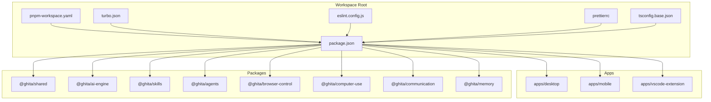
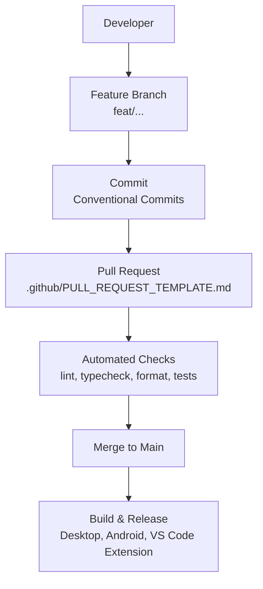
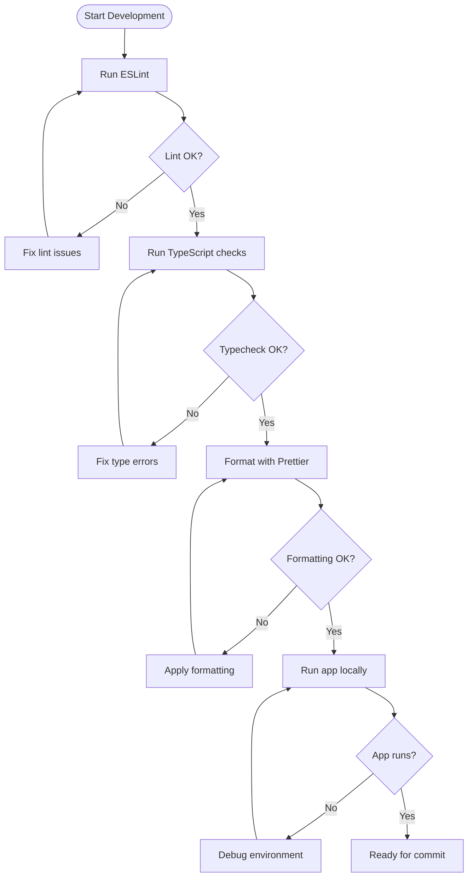
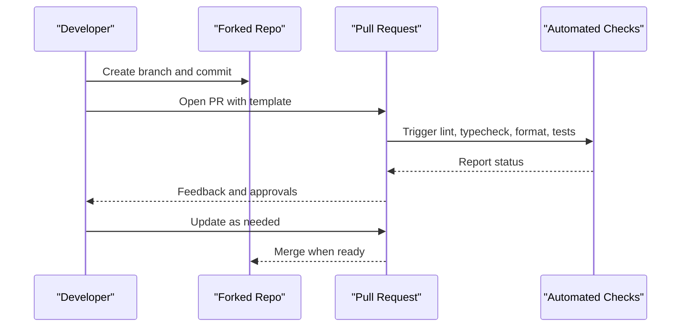
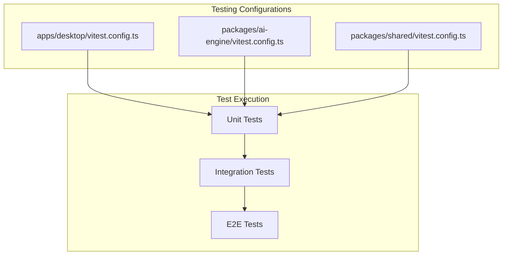

# Contributing and Development Guidelines

<cite>
**Referenced Files in This Document**
- [CONTRIBUTING.md](file://CONTRIBUTING.md)
- [README.md](file://README.md)
- [package.json](file://package.json)
- [pnpm-workspace.yaml](file://pnpm-workspace.yaml)
- [turbo.json](file://turbo.json)
- [eslint.config.js](file://eslint.config.js)
- [.prettierrc](file://.prettierrc)
- [tsconfig.base.json](file://tsconfig.base.json)
- [.github/PULL_REQUEST_TEMPLATE.md](file://.github/PULL_REQUEST_TEMPLATE.md)
- [apps/desktop/vitest.config.ts](file://apps/desktop/vitest.config.ts)
- [packages/ai-engine/vitest.config.ts](file://packages/ai-engine/vitest.config.ts)
- [packages/shared/vitest.config.ts](file://packages/shared/vitest.config.ts)
- [apps/desktop/src/test-setup.ts](file://apps/desktop/src/test-setup.ts)
- [group/decisions.md](file://group/decisions.md)
- [group/README.md](file://group/README.md)
- [apps/desktop/package.json](file://apps/desktop/package.json)
- [apps/mobile/package.json](file://apps/mobile/package.json)
- [apps/vscode-extension/package.json](file://apps/vscode-extension/package.json)
- [packages/ai-engine/package.json](file://packages/ai-engine/package.json)
- [packages/skills/package.json](file://packages/skills/package.json)
- [packages/agents/package.json](file://packages/agents/package.json)
- [packages/browser-control/package.json](file://packages/browser-control/package.json)
- [packages/computer-use/package.json](file://packages/computer-use/package.json)
- [packages/communication/package.json](file://packages/communication/package.json)
- [packages/memory/package.json](file://packages/memory/package.json)
- [packages/shared/package.json](file://packages/shared/package.json)
</cite>

## Table of Contents
1. [Introduction](#introduction)
2. [Project Structure](#project-structure)
3. [Core Components](#core-components)
4. [Architecture Overview](#architecture-overview)
5. [Detailed Component Analysis](#detailed-component-analysis)
6. [Dependency Analysis](#dependency-analysis)
7. [Performance Considerations](#performance-considerations)
8. [Troubleshooting Guide](#troubleshooting-guide)
9. [Conclusion](#conclusion)
10. [Appendices](#appendices)

## Introduction
This document consolidates the contributing and development guidelines for GHITA CODING AGENT. It covers development processes, code standards, commit conventions, pull request procedures, code review expectations, testing and quality assurance, project structure, branch management, release procedures, environment setup, debugging, and community participation. The goal is to ensure consistent, high-quality contributions across the monorepo while enabling smooth collaboration among contributors.

## Project Structure
GHITA CODING AGENT is a Turborepo-managed monorepo with multiple applications and shared packages. The structure supports:
- Desktop application (Tauri + React)
- Mobile application (React Native Android)
- VS Code extension
- Shared libraries and domain-specific packages (AI engine, skills, agents, browser control, computer use, communication, memory)

Key characteristics:
- Workspace managed by pnpm with Turborepo for task orchestration
- Strict TypeScript configuration and centralized ESLint/Prettier rules
- Comprehensive Vitest configuration per package/app for unit/integration/e2e coverage
- Environment configuration via .env and platform-specific build steps

**Diagram sources**
- [package.json:1-55](file://package.json#L1-L55)
- [pnpm-workspace.yaml:1-8](file://pnpm-workspace.yaml#L1-L8)
- [turbo.json:1-26](file://turbo.json#L1-L26)
- [eslint.config.js:1-50](file://eslint.config.js#L1-L50)
- [.prettierrc:1-12](file://.prettierrc#L1-L12)
- [tsconfig.base.json:1-44](file://tsconfig.base.json#L1-L44)

**Section sources**
- [README.md:58-78](file://README.md#L58-L78)
- [package.json:9-26](file://package.json#L9-L26)
- [pnpm-workspace.yaml:1-8](file://pnpm-workspace.yaml#L1-L8)
- [turbo.json:1-26](file://turbo.json#L1-L26)

## Core Components
This section outlines the essential development components that contributors must follow.

- Development environment
  - Node.js >= 20, pnpm >= 10.x, Rust (for Tauri), Android Studio (for mobile)
  - Sidecar server build for desktop app
  - Environment variables configured via .env

- Code standards
  - TypeScript strict mode
  - ESLint with TypeScript rules and globals
  - Prettier formatting with standardized options
  - Pre-commit checks: lint, typecheck, format, and app run checks

- Testing and quality
  - Vitest configuration per package/app
  - Unit, integration, and e2e tests included
  - Quality loop and benchmarking tests present

- Release and distribution
  - Desktop builds via Tauri
  - Android builds via Gradle
  - VS Code extension packaging handled separately

**Section sources**
- [CONTRIBUTING.md:10-16](file://CONTRIBUTING.md#L10-L16)
- [README.md:82-119](file://README.md#L82-L119)
- [README.md:120-139](file://README.md#L120-L139)
- [README.md:171-189](file://README.md#L171-L189)
- [CONTRIBUTING.md:54-59](file://CONTRIBUTING.md#L54-L59)
- [eslint.config.js:1-50](file://eslint.config.js#L1-L50)
- [.prettierrc:1-12](file://.prettierrc#L1-L12)
- [tsconfig.base.json:1-44](file://tsconfig.base.json#L1-L44)
- [apps/desktop/vitest.config.ts:1-16](file://apps/desktop/vitest.config.ts#L1-L16)
- [packages/ai-engine/vitest.config.ts:1-40](file://packages/ai-engine/vitest.config.ts#L1-L40)
- [packages/shared/vitest.config.ts:1-9](file://packages/shared/vitest.config.ts#L1-L9)

## Architecture Overview
The development workflow integrates the monorepo tooling with conventional commit messages and pull request templates. The CI-friendly scripts and task orchestration ensure consistent builds and tests across apps and packages.

**Diagram sources**
- [CONTRIBUTING.md:42-53](file://CONTRIBUTING.md#L42-L53)
- [.github/PULL_REQUEST_TEMPLATE.md:1-15](file://.github/PULL_REQUEST_TEMPLATE.md#L1-L15)
- [package.json:9-26](file://package.json#L9-L26)

**Section sources**
- [CONTRIBUTING.md:34-41](file://CONTRIBUTING.md#L34-L41)
- [CONTRIBUTING.md:79-114](file://CONTRIBUTING.md#L79-L114)
- [.github/PULL_REQUEST_TEMPLATE.md:1-15](file://.github/PULL_REQUEST_TEMPLATE.md#L1-L15)

## Detailed Component Analysis

### Code Standards and Conventions
- TypeScript strict mode enforced globally
- ESLint configuration includes recommended JS and TypeScript rules, with specific rules for unused variables, explicit any, banned comments, and consistent type imports
- Prettier formatting rules applied consistently across the monorepo
- Global TypeScript paths configured for internal packages

**Diagram sources**
- [CONTRIBUTING.md:54-59](file://CONTRIBUTING.md#L54-L59)
- [eslint.config.js:30-47](file://eslint.config.js#L30-L47)
- [.prettierrc:1-12](file://.prettierrc#L1-L12)
- [tsconfig.base.json:8-22](file://tsconfig.base.json#L8-L22)

**Section sources**
- [CONTRIBUTING.md:54-59](file://CONTRIBUTING.md#L54-L59)
- [eslint.config.js:1-50](file://eslint.config.js#L1-L50)
- [.prettierrc:1-12](file://.prettierrc#L1-L12)
- [tsconfig.base.json:1-44](file://tsconfig.base.json#L1-L44)

### Commit Message Format
Follow Conventional Commits with scopes such as feat:, fix:, docs:, style:, refactor:, test:, chore:. Keep commits focused and explain the “why” alongside the “what”.

**Section sources**
- [CONTRIBUTING.md:42-53](file://CONTRIBUTING.md#L42-L53)

### Pull Request Procedures
- One PR per feature or bug fix
- Clear description explaining rationale
- Attach screenshots/videos for UI changes
- Link related issues
- Use Draft PR for WIP
- PR template includes checklist for typecheck, lint, desktop/mobile tests

**Diagram sources**
- [CONTRIBUTING.md:79-114](file://CONTRIBUTING.md#L79-L114)
- [.github/PULL_REQUEST_TEMPLATE.md:1-15](file://.github/PULL_REQUEST_TEMPLATE.md#L1-L15)

**Section sources**
- [CONTRIBUTING.md:79-114](file://CONTRIBUTING.md#L79-L114)
- [.github/PULL_REQUEST_TEMPLATE.md:1-15](file://.github/PULL_REQUEST_TEMPLATE.md#L1-L15)

### Testing Requirements and Quality Assurance
- Vitest configuration per package/app defines environments, include/exclude patterns, and setup files
- Desktop app uses happy-dom environment with test setup
- AI engine and shared packages include extensive unit and integration tests
- Quality loop and benchmarking tests support continuous evaluation

**Diagram sources**
- [apps/desktop/vitest.config.ts:1-16](file://apps/desktop/vitest.config.ts#L1-L16)
- [packages/ai-engine/vitest.config.ts:1-40](file://packages/ai-engine/vitest.config.ts#L1-L40)
- [packages/shared/vitest.config.ts:1-9](file://packages/shared/vitest.config.ts#L1-L9)

**Section sources**
- [apps/desktop/vitest.config.ts:1-16](file://apps/desktop/vitest.config.ts#L1-L16)
- [packages/ai-engine/vitest.config.ts:1-40](file://packages/ai-engine/vitest.config.ts#L1-L40)
- [packages/shared/vitest.config.ts:1-9](file://packages/shared/vitest.config.ts#L1-L9)
- [apps/desktop/src/test-setup.ts:1-5](file://apps/desktop/src/test-setup.ts#L1-L5)

### Development Workflow and Branch Management
- Feature branches named with feat/<feature-name>
- Keep PRs small and focused
- Draft PRs for early feedback
- Use conventional commits and PR template

**Section sources**
- [CONTRIBUTING.md:36-41](file://CONTRIBUTING.md#L36-L41)
- [CONTRIBUTING.md:90-94](file://CONTRIBUTING.md#L90-L94)

### Release Procedures
- Desktop: Tauri build
- Android: Gradle build
- VS Code extension: separate packaging
- Scripts orchestrated via root package.json and Turborepo

**Section sources**
- [README.md:171-189](file://README.md#L171-L189)
- [package.json:13-16](file://package.json#L13-L16)
- [turbo.json:1-26](file://turbo.json#L1-L26)

### Coding Standards: ESLint, Prettier, TypeScript
- ESLint: recommended JS + TypeScript, strict rules for unused variables, explicit any, type imports, console usage, and empty blocks
- Prettier: semicolons, single quotes, trailing commas, print width, tabs, arrow parens, LF endings
- TypeScript: strict mode, ESNext module resolution, JSX transform, declaration generation, and path aliases

**Section sources**
- [eslint.config.js:30-47](file://eslint.config.js#L30-L47)
- [.prettierrc:1-12](file://.prettierrc#L1-L12)
- [tsconfig.base.json:8-40](file://tsconfig.base.json#L8-L40)

### Contribution Process: Issues, Features, Bugs
- Report bugs and propose features via GitHub Issues
- Use PR template and ensure all pre-merge checks pass

**Section sources**
- [CONTRIBUTING.md:115-119](file://CONTRIBUTING.md#L115-L119)
- [.github/PULL_REQUEST_TEMPLATE.md:1-15](file://.github/PULL_REQUEST_TEMPLATE.md#L1-L15)

### Documentation Contributions and Translations
- Documentation maintained under docs/ and integrated with project assets
- Multilingual support indicated in top-level documents; translations encouraged via PRs

**Section sources**
- [README.md:19-208](file://README.md#L19-L208)
- [CONTRIBUTING.md:121-236](file://CONTRIBUTING.md#L121-L236)

### Community Engagement and Governance
- Multi-agent group protocol for structured collaboration and decision logs
- Decision records include proposal, rationale, alternatives, approver, and status

**Section sources**
- [group/README.md:1-79](file://group/README.md#L1-L79)
- [group/decisions.md:1-25](file://group/decisions.md#L1-L25)

### Development Environment Setup and Debugging
- Install prerequisites: Node.js >= 20, pnpm >= 10.x, Rust, Android Studio
- Build sidecar server for desktop app
- Configure .env with required API keys
- Run dev servers for desktop and mobile
- Use scripts for lint, typecheck, format, and tests

**Section sources**
- [CONTRIBUTING.md:10-16](file://CONTRIBUTING.md#L10-L16)
- [README.md:82-119](file://README.md#L82-L119)
- [README.md:120-139](file://README.md#L120-L139)
- [README.md:171-189](file://README.md#L171-L189)

### Extending Features, Integrations, Backward Compatibility
- Organize new features within appropriate packages or apps based on scope
- Maintain strict TypeScript and lint rules to preserve code quality
- Add tests for new integrations and ensure they integrate with existing workflows
- Respect existing APIs and avoid breaking changes; introduce deprecations with migration guidance

**Section sources**
- [README.md:58-78](file://README.md#L58-L78)
- [CONTRIBUTING.md:54-59](file://CONTRIBUTING.md#L54-L59)
- [eslint.config.js:30-47](file://eslint.config.js#L30-L47)

## Dependency Analysis
The monorepo relies on Turborepo for task orchestration and pnpm workspace for dependency management. Each app and package maintains its own package.json with scoped scripts and dependencies.

```mermaid
graph TB
ROOTPKG["Root package.json"]
WORKSPACE["pnpm-workspace.yaml"]
TURBOCFG["turbo.json"]
ROOTPKG --> WORKSPACE
ROOTPKG --> TURBOCFG
subgraph "Apps"
DESKPKG["apps/desktop/package.json"]
MOBPKG["apps/mobile/package.json"]
VSCODEPKG["apps/vscode-extension/package.json"]
end
subgraph "Packages"
SHPKG["@ghita/shared/package.json"]
AIENGPKG["@ghita/ai-engine/package.json"]
SKILPKG["@ghita/skills/package.json"]
AGENPKG["@ghita/agents/package.json"]
BROWPKG["@ghita/browser-control/package.json"]
COMPUPKG["@ghita/computer-use/package.json"]
COMMPKG["@ghita/communication/package.json"]
MEMOPKG["@ghita/memory/package.json"]
end
ROOTPKG --> DESKPKG
ROOTPKG --> MOBPKG
ROOTPKG --> VSCODEPKG
ROOTPKG --> SHPKG
ROOTPKG --> AIENGPKG
ROOTPKG --> SKILPKG
ROOTPKG --> AGENPKG
ROOTPKG --> BROWPKG
ROOTPKG --> COMPUPKG
ROOTPKG --> COMMPKG
ROOTPKG --> MEMOPKG
```

**Diagram sources**
- [package.json:1-55](file://package.json#L1-L55)
- [pnpm-workspace.yaml:1-8](file://pnpm-workspace.yaml#L1-L8)
- [turbo.json:1-26](file://turbo.json#L1-L26)
- [apps/desktop/package.json](file://apps/desktop/package.json)
- [apps/mobile/package.json](file://apps/mobile/package.json)
- [apps/vscode-extension/package.json](file://apps/vscode-extension/package.json)
- [packages/shared/package.json](file://packages/shared/package.json)
- [packages/ai-engine/package.json](file://packages/ai-engine/package.json)
- [packages/skills/package.json](file://packages/skills/package.json)
- [packages/agents/package.json](file://packages/agents/package.json)
- [packages/browser-control/package.json](file://packages/browser-control/package.json)
- [packages/computer-use/package.json](file://packages/computer-use/package.json)
- [packages/communication/package.json](file://packages/communication/package.json)
- [packages/memory/package.json](file://packages/memory/package.json)

**Section sources**
- [package.json:1-55](file://package.json#L1-L55)
- [pnpm-workspace.yaml:1-8](file://pnpm-workspace.yaml#L1-L8)
- [turbo.json:1-26](file://turbo.json#L1-L26)

## Performance Considerations
- Keep PRs small to reduce merge conflicts and CI load
- Use Turborepo caching and incremental builds
- Prefer lightweight adapters and avoid unnecessary dependencies
- Profile and benchmark new features using existing quality loop tests

[No sources needed since this section provides general guidance]

## Troubleshooting Guide
Common issues and resolutions:
- Desktop app fails to start: verify Rust and Node versions, rebuild sidecar, check port availability
- Mobile cannot connect: ensure same network, confirm communication server is running, verify pairing code, try manual IP
- AI provider not working: check API keys, enable provider in API Manager, ensure local provider service is running, verify connectivity
- Skills not working: enable required skills, ensure adapters/tools are installed

**Section sources**
- [README.md:143-168](file://README.md#L143-L168)

## Conclusion
By adhering to the established development processes, code standards, and testing requirements, contributors can efficiently extend GHITA CODING AGENT while maintaining high quality and consistency. Use the monorepo tooling, follow the commit and PR conventions, and engage constructively with the community and governance protocols.

[No sources needed since this section summarizes without analyzing specific files]

## Appendices

### Appendix A: Quick Reference
- Environment: Node.js >= 20, pnpm >= 10.x, Rust, Android Studio
- Scripts: dev, build, lint, typecheck, format, test
- Commit convention: feat/, fix/, docs/, style/, refactor/, test/, chore/
- PR rules: concise, clear description, screenshots/video for UI, linked issues, draft PR for WIP

**Section sources**
- [CONTRIBUTING.md:10-16](file://CONTRIBUTING.md#L10-L16)
- [README.md:171-189](file://README.md#L171-L189)
- [CONTRIBUTING.md:42-53](file://CONTRIBUTING.md#L42-L53)
- [CONTRIBUTING.md:89-94](file://CONTRIBUTING.md#L89-L94)