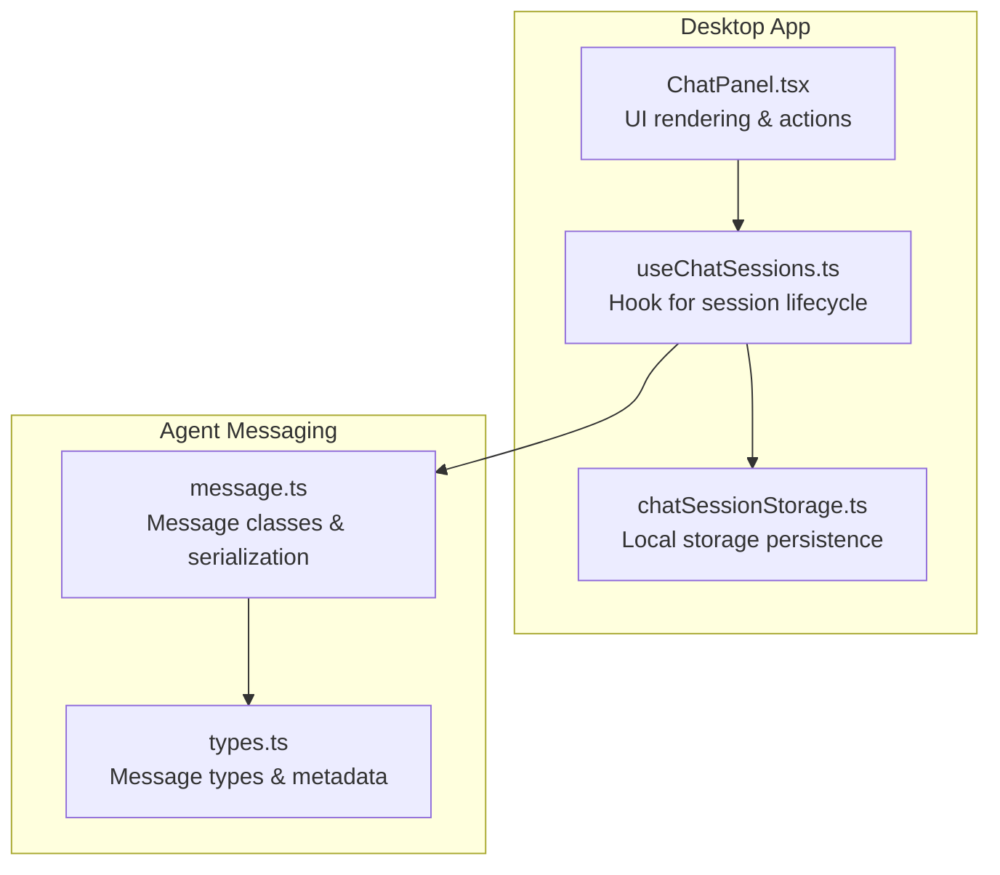
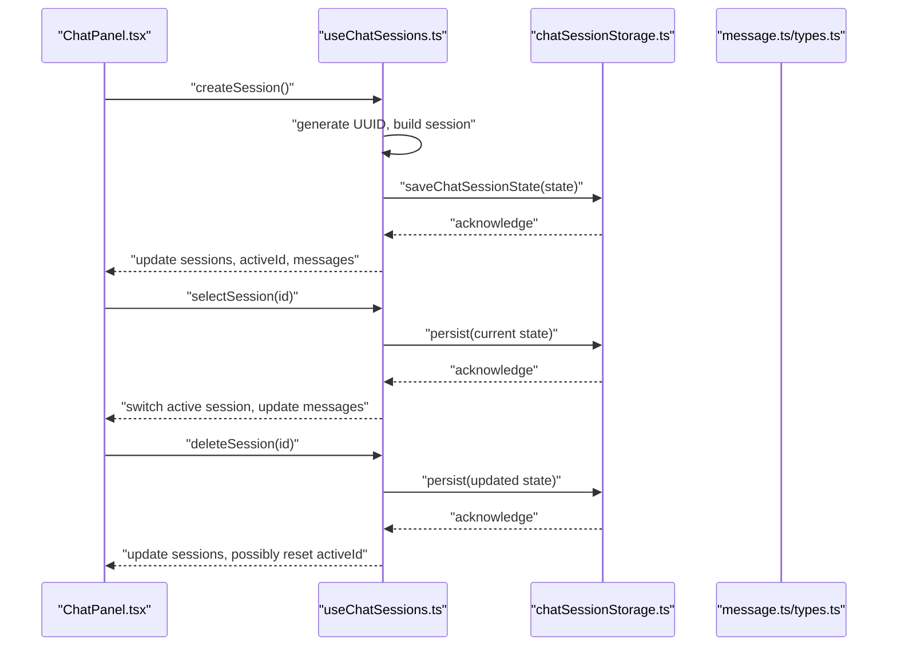
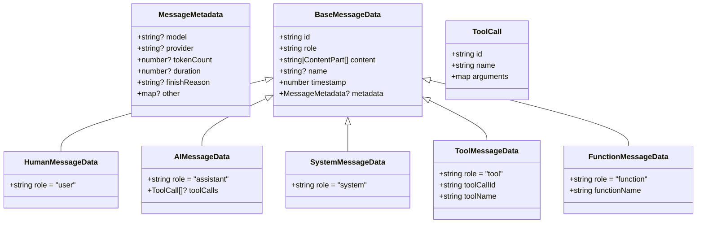
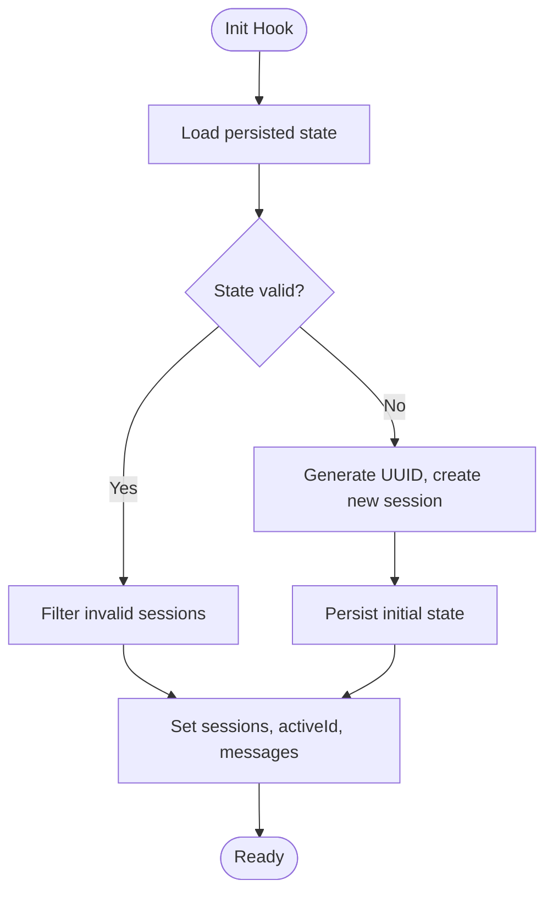
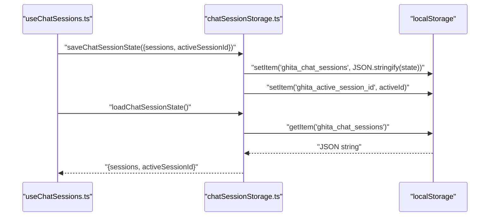
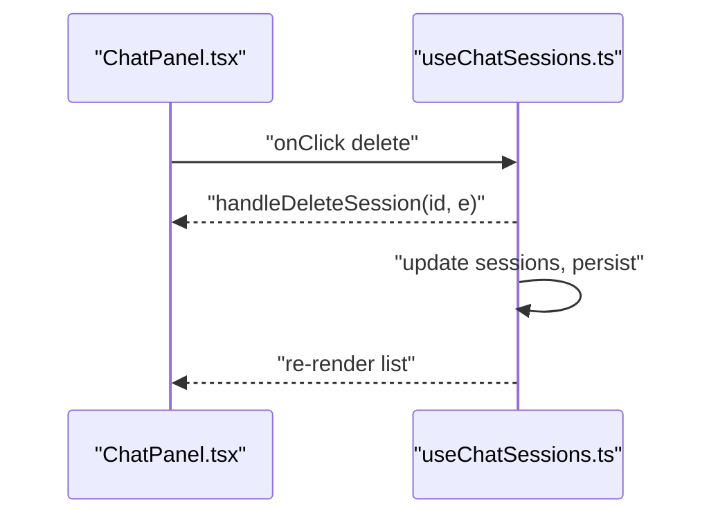
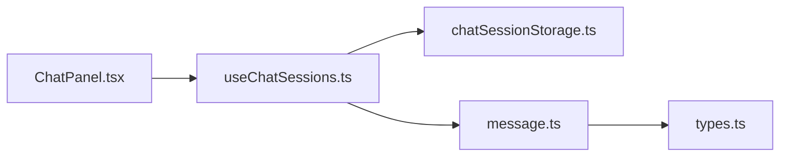

# Chat Session Management

<cite>
**Referenced Files in This Document**
- [useChatSessions.ts](file://apps/desktop/src/hooks/useChatSessions.ts)
- [chatSessionStorage.ts](file://apps/desktop/src/utils/chatSessionStorage.ts)
- [types.ts](file://packages/agents/src/messages/types.ts)
- [message.ts](file://packages/agents/src/messages/message.ts)
- [ChatPanel.tsx](file://apps/desktop/src/components/ChatPanel.tsx)
- [useChatSessions.test.ts](file://apps/desktop/src/hooks/useChatSessions.test.ts)
- [chatSessionStorage.test.ts](file://apps/desktop/src/utils/chatSessionStorage.test.ts)
</cite>

## Table of Contents
1. [Introduction](#introduction)
2. [Project Structure](#project-structure)
3. [Core Components](#core-components)
4. [Architecture Overview](#architecture-overview)
5. [Detailed Component Analysis](#detailed-component-analysis)
6. [Dependency Analysis](#dependency-analysis)
7. [Performance Considerations](#performance-considerations)
8. [Troubleshooting Guide](#troubleshooting-guide)
9. [Conclusion](#conclusion)

## Introduction
This document describes the Chat Session Management system responsible for maintaining conversation histories across application sessions, enabling users to create, switch, update, and delete chat sessions. It explains the session data model, persistence strategy using local storage, synchronization considerations across desktop, mobile, and VS Code environments, and integration with the broader state management system. It also covers session search and filtering, message threading, and cleanup policies.

## Project Structure
The chat session management spans three primary areas:
- Hook-based state management for active sessions and messages
- Local storage-backed persistence utilities
- Message data model and serialization used across the AI agent messaging pipeline

**Diagram sources**
- [useChatSessions.ts:58-206](file://apps/desktop/src/hooks/useChatSessions.ts#L58-L206)
- [chatSessionStorage.ts](file://apps/desktop/src/utils/chatSessionStorage.ts)
- [ChatPanel.tsx:1804-1834](file://apps/desktop/src/components/ChatPanel.tsx#L1804-L1834)
- [types.ts:1-74](file://packages/agents/src/messages/types.ts#L1-L74)
- [message.ts:40-155](file://packages/agents/src/messages/message.ts#L40-L155)

**Section sources**
- [useChatSessions.ts:58-206](file://apps/desktop/src/hooks/useChatSessions.ts#L58-L206)
- [chatSessionStorage.ts](file://apps/desktop/src/utils/chatSessionStorage.ts)
- [types.ts:1-74](file://packages/agents/src/messages/types.ts#L1-L74)
- [message.ts:40-155](file://packages/agents/src/messages/message.ts#L40-L155)
- [ChatPanel.tsx:1804-1834](file://apps/desktop/src/components/ChatPanel.tsx#L1804-L1834)

## Core Components
- useChatSessions hook: Manages session list, active session, current view, and messages; persists state to local storage; validates stored data and recovers from corruption.
- chatSessionStorage utilities: Encapsulate loading and saving of session state to/from local storage.
- Message model: Defines the canonical message data structure used across the agent pipeline, including roles, content, timestamps, and metadata.

Key responsibilities:
- Session lifecycle: create, select, delete, and initialize from persisted state.
- Message threading: maintain ordered message lists per session.
- Persistence: serialize/deserialize session arrays and active session ID.
- Validation: guard against malformed or corrupted session data.

**Section sources**
- [useChatSessions.ts:58-206](file://apps/desktop/src/hooks/useChatSessions.ts#L58-L206)
- [chatSessionStorage.ts](file://apps/desktop/src/utils/chatSessionStorage.ts)
- [types.ts:1-74](file://packages/agents/src/messages/types.ts#L1-L74)
- [message.ts:40-155](file://packages/agents/src/messages/message.ts#L40-L155)

## Architecture Overview
The system follows a unidirectional data flow:
- UI triggers actions (create/select/delete).
- Hook updates internal state and persists to local storage.
- On startup, the hook loads persisted state, validates it, and initializes the UI accordingly.

**Diagram sources**
- [ChatPanel.tsx:1804-1834](file://apps/desktop/src/components/ChatPanel.tsx#L1804-L1834)
- [useChatSessions.ts:153-193](file://apps/desktop/src/hooks/useChatSessions.ts#L153-L193)
- [chatSessionStorage.ts](file://apps/desktop/src/utils/chatSessionStorage.ts)
- [message.ts:40-155](file://packages/agents/src/messages/message.ts#L40-L155)
- [types.ts:1-74](file://packages/agents/src/messages/types.ts#L1-L74)

## Detailed Component Analysis

### Session Data Model
The session and message data structures are defined centrally to ensure consistency across environments.

**Diagram sources**
- [types.ts:1-74](file://packages/agents/src/messages/types.ts#L1-L74)
- [message.ts:40-155](file://packages/agents/src/messages/message.ts#L40-L155)

Notes on message formatting:
- Roles include user, assistant, system, tool, and function.
- Content can be plain text or multimodal parts.
- Metadata captures model/provider, token counts, duration, and completion reasons.
- Tool calls are attached to assistant messages.

**Section sources**
- [types.ts:1-74](file://packages/agents/src/messages/types.ts#L1-L74)
- [message.ts:40-155](file://packages/agents/src/messages/message.ts#L40-L155)

### Session Lifecycle and State Management
The useChatSessions hook centralizes session management:
- Initialization: Loads persisted state, filters invalid sessions, sets active session and messages, or creates a new session if none exist.
- Validation: Ensures each session and its messages conform to expected shapes.
- Persistence: Saves sessions and active session ID after any change.
- Switching: Updates active session and messages, with a small debounce to avoid rapid toggles.

**Diagram sources**
- [useChatSessions.ts:74-112](file://apps/desktop/src/hooks/useChatSessions.ts#L74-L112)

Key operations:
- Create: Generates a new session with a unique identifier, empty messages, and timestamp; switches to it.
- Select: Switches active session and updates messages; persists immediately.
- Delete: Removes selected session; if deleting the active session, selects the next available or creates a new one.

**Section sources**
- [useChatSessions.ts:142-193](file://apps/desktop/src/hooks/useChatSessions.ts#L142-L193)

### Persistence Strategy
Persistence is handled via local storage:
- State keys: sessions and active session ID are saved separately to minimize write contention.
- Serialization: Full session array plus active ID are written atomically by the persistence utility.
- Recovery: On load failure or corruption, the hook clears problematic entries and starts fresh.

**Diagram sources**
- [useChatSessions.ts:66-72](file://apps/desktop/src/hooks/useChatSessions.ts#L66-L72)
- [chatSessionStorage.ts](file://apps/desktop/src/utils/chatSessionStorage.ts)

**Section sources**
- [useChatSessions.ts:66-112](file://apps/desktop/src/hooks/useChatSessions.ts#L66-L112)
- [chatSessionStorage.ts](file://apps/desktop/src/utils/chatSessionStorage.ts)

### UI Integration and Rendering
The ChatPanel renders session history with:
- Title and localized timestamp
- Message count excluding streaming placeholders
- Delete action bound to the hook’s delete handler

**Diagram sources**
- [ChatPanel.tsx:1804-1834](file://apps/desktop/src/components/ChatPanel.tsx#L1804-L1834)
- [useChatSessions.ts:166-193](file://apps/desktop/src/hooks/useChatSessions.ts#L166-L193)

**Section sources**
- [ChatPanel.tsx:1804-1834](file://apps/desktop/src/components/ChatPanel.tsx#L1804-L1834)
- [useChatSessions.ts:166-193](file://apps/desktop/src/hooks/useChatSessions.ts#L166-L193)

### Search and Filtering
Current implementation focuses on:
- Session list rendering and selection
- Message count display
- No explicit keyword search or filtering APIs are present in the analyzed files

Recommendations:
- Add a filter predicate on sessions/messages for keyword search
- Debounce search input and support incremental filtering
- Persist filter state alongside session state

[No sources needed since this section provides general guidance]

### Cleanup Policies and Archive Functionality
Observed behaviors:
- Sessions are validated and filtered during initialization
- Deleting a session removes it from the list and resets active session if needed
- No explicit archive or retention policy is implemented in the analyzed files

Recommendations:
- Implement retention settings (e.g., max sessions, auto-delete older than N days)
- Provide manual archive toggle per session
- Add periodic cleanup jobs to remove stale sessions

[No sources needed since this section provides general guidance]

### Real-time Synchronization Across Environments
Observed behaviors:
- Persistence uses local storage
- No explicit cross-device synchronization is implemented in the analyzed files

Recommendations:
- Introduce a sync layer (e.g., cloud storage or relay server) to propagate changes
- Use optimistic updates with conflict resolution strategies
- Consider event sourcing or CRDTs for robust convergence across desktop, mobile, and VS Code

[No sources needed since this section provides general guidance]

## Dependency Analysis
The following diagram shows module-level dependencies among the core components:

**Diagram sources**
- [useChatSessions.ts:58-206](file://apps/desktop/src/hooks/useChatSessions.ts#L58-L206)
- [chatSessionStorage.ts](file://apps/desktop/src/utils/chatSessionStorage.ts)
- [message.ts:40-155](file://packages/agents/src/messages/message.ts#L40-L155)
- [types.ts:1-74](file://packages/agents/src/messages/types.ts#L1-L74)
- [ChatPanel.tsx:1804-1834](file://apps/desktop/src/components/ChatPanel.tsx#L1804-L1834)

**Section sources**
- [useChatSessions.ts:58-206](file://apps/desktop/src/hooks/useChatSessions.ts#L58-L206)
- [chatSessionStorage.ts](file://apps/desktop/src/utils/chatSessionStorage.ts)
- [message.ts:40-155](file://packages/agents/src/messages/message.ts#L40-L155)
- [types.ts:1-74](file://packages/agents/src/messages/types.ts#L1-L74)
- [ChatPanel.tsx:1804-1834](file://apps/desktop/src/components/ChatPanel.tsx#L1804-L1834)

## Performance Considerations
- Minimize writes: Persist only on meaningful changes (session switch, create, delete).
- Batch updates: Avoid frequent re-renders by grouping state updates.
- Lazy deserialization: Deserialize messages only when switching sessions.
- Memory footprint: Limit retained sessions based on retention settings.

[No sources needed since this section provides general guidance]

## Troubleshooting Guide
Common issues and remedies:
- Corrupted session data: The hook filters invalid sessions and falls back to a fresh state. Clear local storage keys if persistent failures occur.
- Active session mismatch: Ensure active session ID exists in the loaded session list; otherwise, the hook selects the first session or creates a new one.
- Rapid switching: A small debounce prevents race conditions during quick session switches.

**Section sources**
- [useChatSessions.ts:74-112](file://apps/desktop/src/hooks/useChatSessions.ts#L74-L112)
- [useChatSessions.ts:142-151](file://apps/desktop/src/hooks/useChatSessions.ts#L142-L151)

## Conclusion
The Chat Session Management system provides a robust foundation for session lifecycle and persistence using local storage. The useChatSessions hook centralizes state transitions and ensures data integrity through validation. Extending the system with search/filtering, retention/archiving, and cross-environment synchronization will further improve user experience across desktop, mobile, and VS Code.