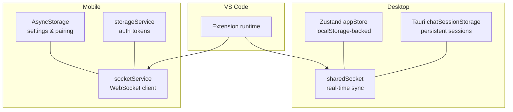
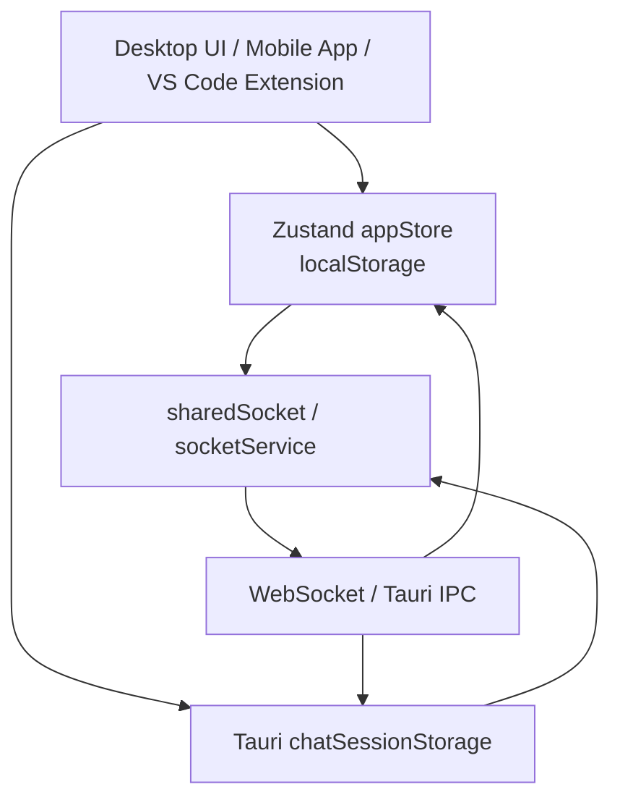
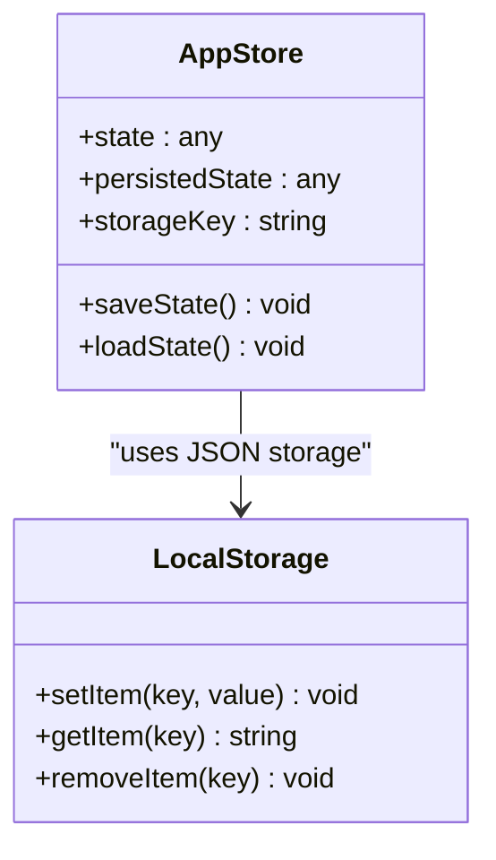
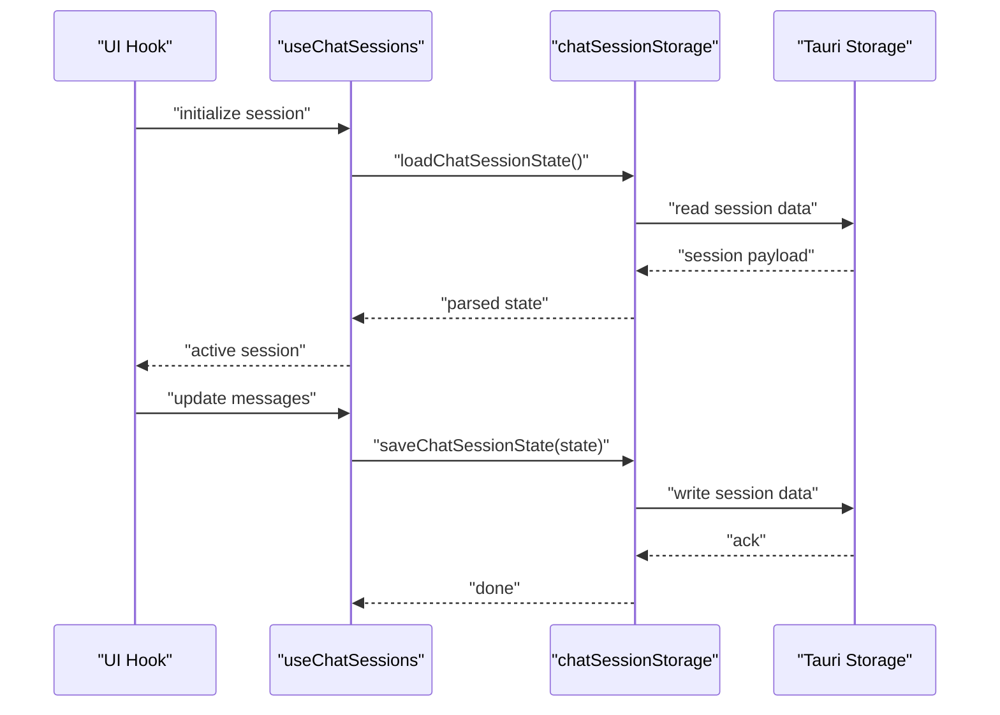
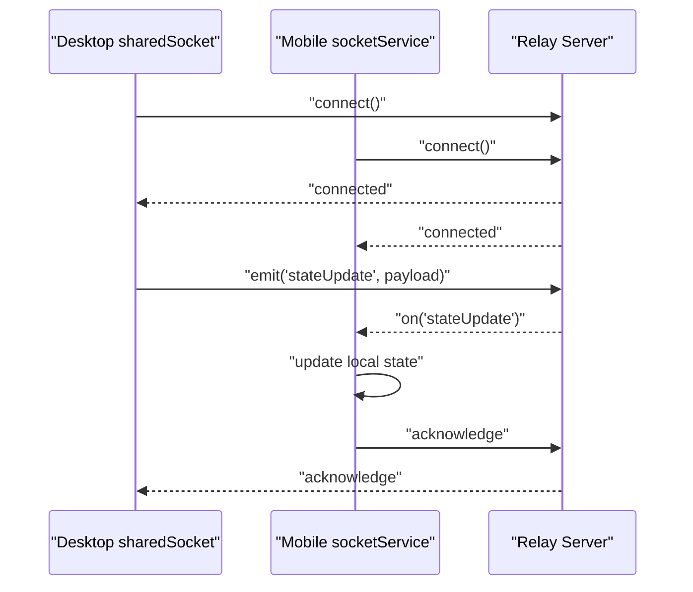
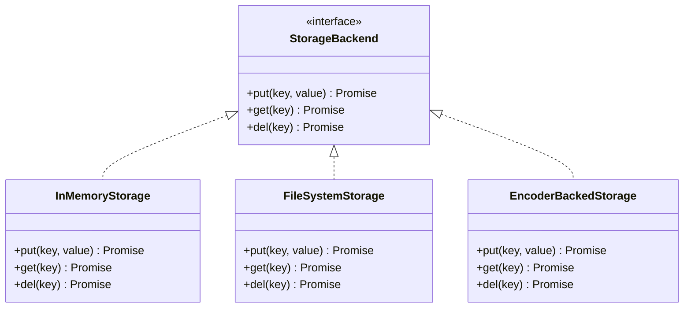
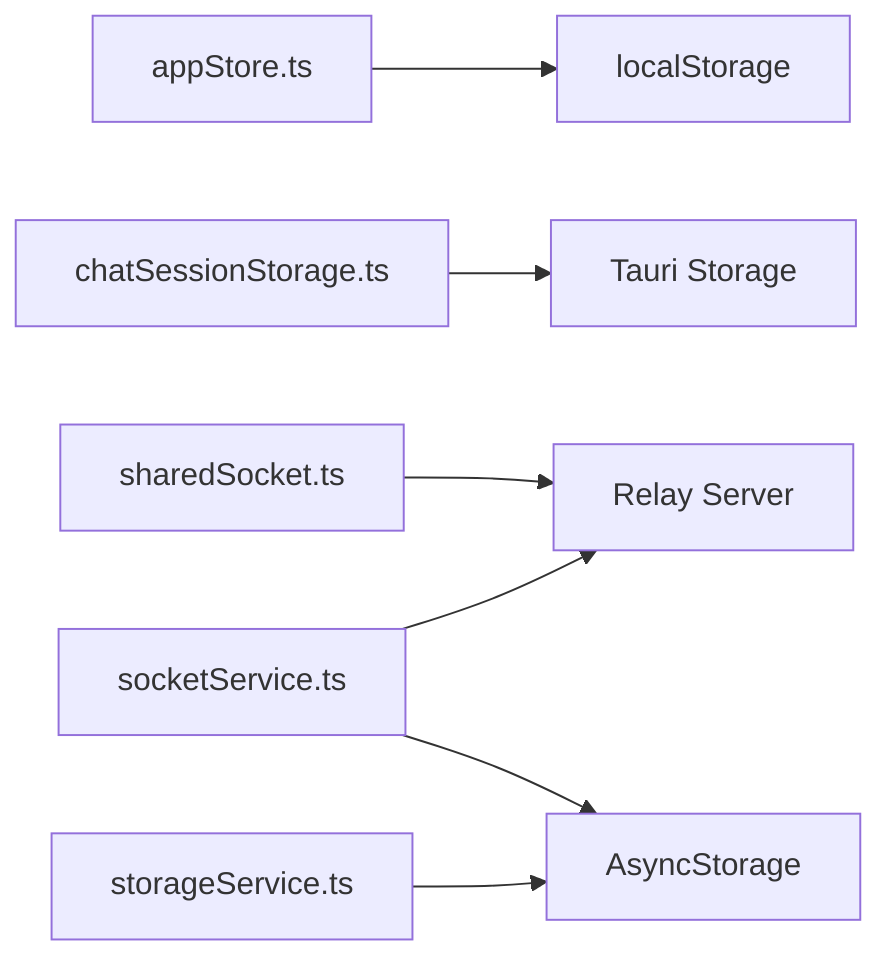

# Data Management and Storage

<cite>
**Referenced Files in This Document**
- [appStore.ts](file://apps/desktop/src/stores/appStore.ts)
- [chatSessionStorage.ts](file://apps/desktop/src/utils/chatSessionStorage.ts)
- [chatSessionStorage.test.ts](file://apps/desktop/src/utils/chatSessionStorage.test.ts)
- [useChatSessions.ts](file://apps/desktop/src/hooks/useChatSessions.ts)
- [sharedSocket.ts](file://apps/desktop/src/utils/sharedSocket.ts)
- [socketService.ts](file://apps/mobile/src/services/socketService.ts)
- [storageService.ts](file://apps/mobile/src/services/storageService.ts)
- [index.d.ts](file://packages/agents/dist/index.d.ts)
</cite>

## Table of Contents
1. [Introduction](#introduction)
2. [Project Structure](#project-structure)
3. [Core Components](#core-components)
4. [Architecture Overview](#architecture-overview)
5. [Detailed Component Analysis](#detailed-component-analysis)
6. [Dependency Analysis](#dependency-analysis)
7. [Performance Considerations](#performance-considerations)
8. [Troubleshooting Guide](#troubleshooting-guide)
9. [Conclusion](#conclusion)

## Introduction
This document explains the Data Management and Storage system across the desktop, mobile, and VS Code environments. It covers persistent memory for agent memories and conversation histories, chat session management, global state coordination via Zustand, shared sockets for real-time synchronization, and data persistence strategies including local storage and caching. It also outlines file system integration points, validation and backup strategies, security and privacy considerations, and lifecycle management for optimal performance.

## Project Structure
The data management system spans three primary platforms:
- Desktop (React + Tauri): Local storage-backed Zustand app store, Tauri-based chat session persistence, and shared socket for cross-session updates.
- Mobile (React Native): AsyncStorage-backed storage for settings and device pairing, WebSocket-based socket service for real-time updates.
- VS Code Extension: Notably absent dedicated storage modules in the provided structure; relies on desktop/mobile implementations for shared state.

**Section sources**
- [appStore.ts:140-160](file://apps/desktop/src/stores/appStore.ts#L140-L160)
- [chatSessionStorage.ts:1-200](file://apps/desktop/src/utils/chatSessionStorage.ts#L1-L200)
- [sharedSocket.ts:1-120](file://apps/desktop/src/utils/sharedSocket.ts#L1-L120)
- [socketService.ts:1-120](file://apps/mobile/src/services/socketService.ts#L1-L120)
- [storageService.ts:1-80](file://apps/mobile/src/services/storageService.ts#L1-L80)

## Core Components
- Zustand appStore with localStorage persistence coordinates global application state across desktop sessions.
- Tauri-backed chatSessionStorage persists and retrieves conversation sessions and message histories.
- Shared socket utilities synchronize state changes across desktop, mobile, and VS Code environments.
- Mobile AsyncStorage and socketService provide platform-specific persistence and connectivity.

**Section sources**
- [appStore.ts:140-160](file://apps/desktop/src/stores/appStore.ts#L140-L160)
- [chatSessionStorage.ts:1-200](file://apps/desktop/src/utils/chatSessionStorage.ts#L1-L200)
- [sharedSocket.ts:1-120](file://apps/desktop/src/utils/sharedSocket.ts#L1-L120)
- [socketService.ts:1-120](file://apps/mobile/src/services/socketService.ts#L1-L120)
- [storageService.ts:1-80](file://apps/mobile/src/services/storageService.ts#L1-L80)

## Architecture Overview
The system integrates three layers:
- State Layer: Global Zustand store with localStorage-backed persistence.
- Session Layer: Tauri-based chat session storage for messages and conversation state.
- Transport Layer: Shared socket implementations for real-time synchronization across platforms.

**Diagram sources**
- [appStore.ts:140-160](file://apps/desktop/src/stores/appStore.ts#L140-L160)
- [chatSessionStorage.ts:1-200](file://apps/desktop/src/utils/chatSessionStorage.ts#L1-L200)
- [sharedSocket.ts:1-120](file://apps/desktop/src/utils/sharedSocket.ts#L1-L120)
- [socketService.ts:1-120](file://apps/mobile/src/services/socketService.ts#L1-L120)

## Detailed Component Analysis

### Zustand App Store (Global State Persistence)
The desktop appStore uses a localStorage-backed Zustand persistence plugin to maintain application state across sessions. It defines a named storage key and delegates serialization/deserialization to a JSON storage adapter.

Key characteristics:
- Named storage key ensures deterministic persistence.
- JSON serialization enables structured state storage.
- Cross-session continuity supports multi-window and reload scenarios.

**Diagram sources**
- [appStore.ts:140-160](file://apps/desktop/src/stores/appStore.ts#L140-L160)

**Section sources**
- [appStore.ts:140-160](file://apps/desktop/src/stores/appStore.ts#L140-L160)

### Chat Session Management (Persistent Conversation Histories)
The desktop chatSessionStorage module provides:
- Loading persisted session state from Tauri storage.
- Saving current session state back to Tauri storage.
- Supporting message history management and conversation state persistence.

Integration points:
- Hook-based consumption via useChatSessions to initialize and update session state.
- Tests validate loading from Tauri storage and state transitions.

**Diagram sources**
- [useChatSessions.ts:1-60](file://apps/desktop/src/hooks/useChatSessions.ts#L1-L60)
- [chatSessionStorage.ts:1-200](file://apps/desktop/src/utils/chatSessionStorage.ts#L1-L200)

**Section sources**
- [useChatSessions.ts:1-60](file://apps/desktop/src/hooks/useChatSessions.ts#L1-L60)
- [chatSessionStorage.ts:1-200](file://apps/desktop/src/utils/chatSessionStorage.ts#L1-L200)
- [chatSessionStorage.test.ts:1-80](file://apps/desktop/src/utils/chatSessionStorage.test.ts#L1-L80)

### Shared Socket Implementation (Real-Time Synchronization)
The desktop sharedSocket module manages real-time connections and state synchronization. It handles connection attempts, error logging, and emitting/receiving events to keep desktop, mobile, and VS Code environments aligned.

Mobile counterpart:
- socketService establishes WebSocket connections and integrates with AsyncStorage-backed storageService for authentication tokens and pairing metadata.

**Diagram sources**
- [sharedSocket.ts:1-120](file://apps/desktop/src/utils/sharedSocket.ts#L1-L120)
- [socketService.ts:1-120](file://apps/mobile/src/services/socketService.ts#L1-L120)

**Section sources**
- [sharedSocket.ts:1-120](file://apps/desktop/src/utils/sharedSocket.ts#L1-L120)
- [socketService.ts:1-120](file://apps/mobile/src/services/socketService.ts#L1-L120)
- [storageService.ts:1-80](file://apps/mobile/src/services/storageService.ts#L1-L80)

### File System Integration and Memory Backends
The agents package exposes memory storage abstractions that support different backends:
- InMemoryStorage for transient memory.
- FileSystemStorage for durable file-based storage.
- EncoderBackedStorage with JSONEncoder for serialized entries.

These types define the contract for memory backends used by agent runtimes and skills.

**Diagram sources**
- [index.d.ts:1-80](file://packages/agents/dist/index.d.ts#L1-L80)

**Section sources**
- [index.d.ts:1-80](file://packages/agents/dist/index.d.ts#L1-L80)

## Dependency Analysis
- Desktop depends on Tauri for chat session persistence and Zustand for global state.
- Mobile depends on AsyncStorage for settings and socketService for connectivity.
- Shared socket bridges desktop and mobile; VS Code extension consumes the same transport layer.

**Diagram sources**
- [appStore.ts:140-160](file://apps/desktop/src/stores/appStore.ts#L140-L160)
- [chatSessionStorage.ts:1-200](file://apps/desktop/src/utils/chatSessionStorage.ts#L1-L200)
- [sharedSocket.ts:1-120](file://apps/desktop/src/utils/sharedSocket.ts#L1-L120)
- [socketService.ts:1-120](file://apps/mobile/src/services/socketService.ts#L1-L120)
- [storageService.ts:1-80](file://apps/mobile/src/services/storageService.ts#L1-L80)

**Section sources**
- [appStore.ts:140-160](file://apps/desktop/src/stores/appStore.ts#L140-L160)
- [chatSessionStorage.ts:1-200](file://apps/desktop/src/utils/chatSessionStorage.ts#L1-L200)
- [sharedSocket.ts:1-120](file://apps/desktop/src/utils/sharedSocket.ts#L1-L120)
- [socketService.ts:1-120](file://apps/mobile/src/services/socketService.ts#L1-L120)
- [storageService.ts:1-80](file://apps/mobile/src/services/storageService.ts#L1-L80)

## Performance Considerations
- Prefer incremental updates to minimize write amplification in chatSessionStorage and Zustand persistence.
- Batch socket emissions to reduce network overhead during rapid state changes.
- Use TTL-based invalidation for cached entries where applicable.
- Optimize message history trimming to cap memory footprint for long-running sessions.
- Leverage compression for large payloads transmitted over the shared socket.

## Troubleshooting Guide
Common issues and remedies:
- Session load failures: Verify Tauri storage availability and fallback to default state initialization.
- Socket connection errors: Inspect connection logs and retry with exponential backoff.
- State deserialization errors: Validate JSON structure and handle migration for schema changes.
- AsyncStorage corruption (mobile): Clear corrupted keys and rehydrate from server state.

**Section sources**
- [chatSessionStorage.test.ts:1-80](file://apps/desktop/src/utils/chatSessionStorage.test.ts#L1-L80)
- [sharedSocket.ts:60-80](file://apps/desktop/src/utils/sharedSocket.ts#L60-L80)
- [socketService.ts:1-120](file://apps/mobile/src/services/socketService.ts#L1-L120)

## Conclusion
The Data Management and Storage system combines localStorage-backed Zustand state, Tauri-based chat session persistence, and shared socket connectivity to deliver robust, cross-platform data continuity. By leveraging typed memory backends and platform-specific storage primitives, the system balances reliability, scalability, and real-time responsiveness across desktop, mobile, and VS Code environments.