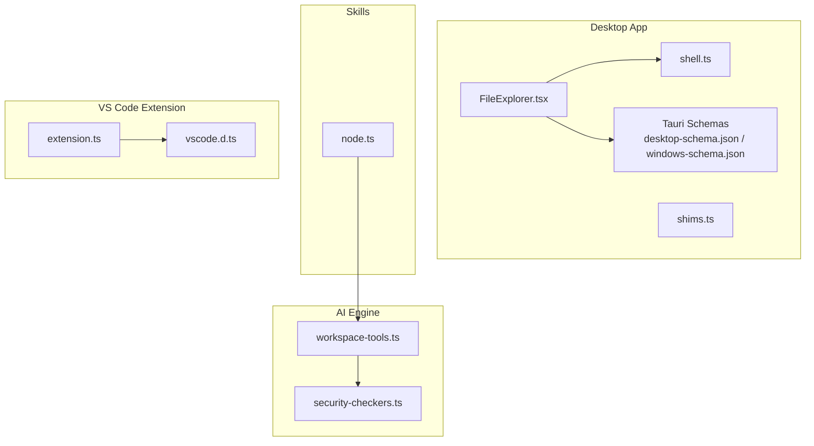
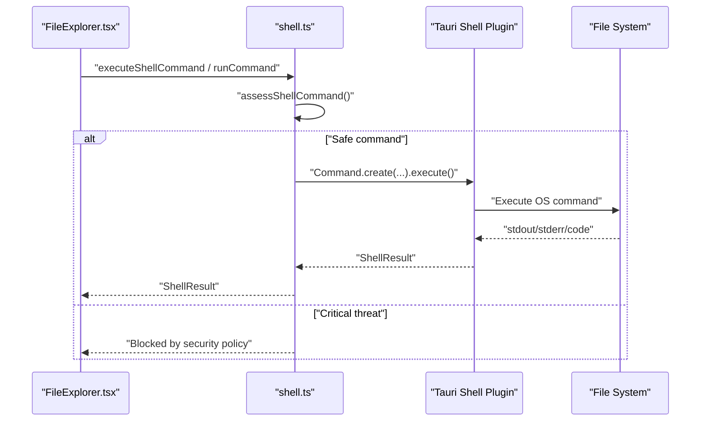
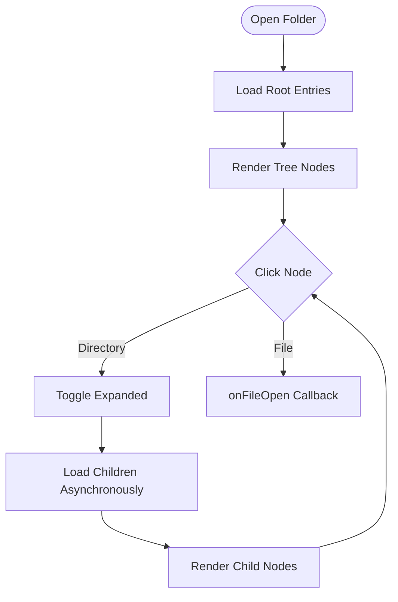
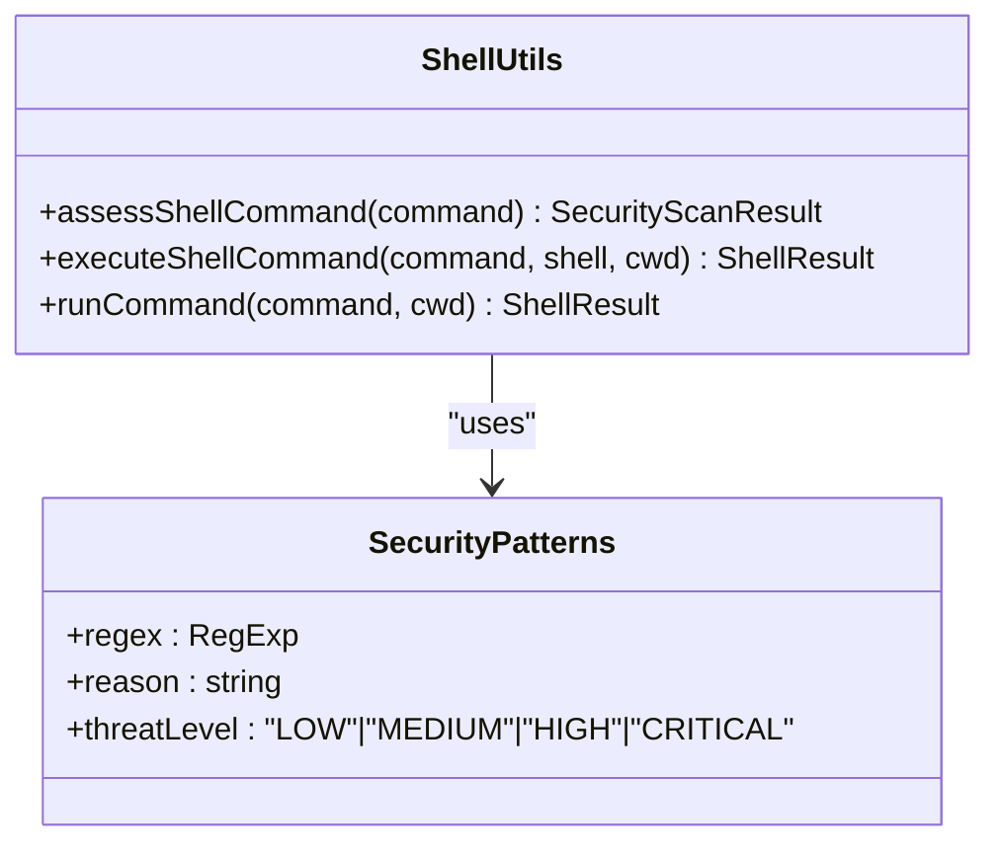
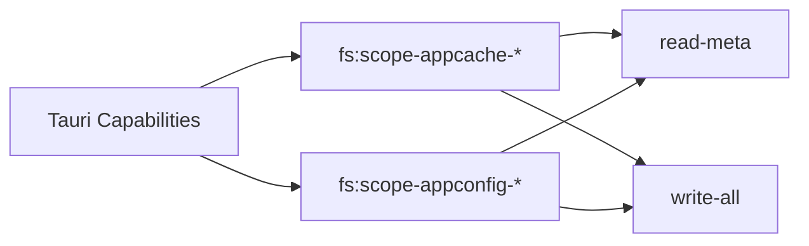
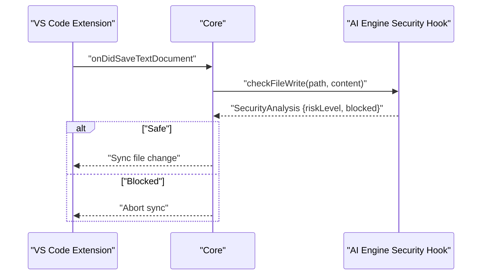
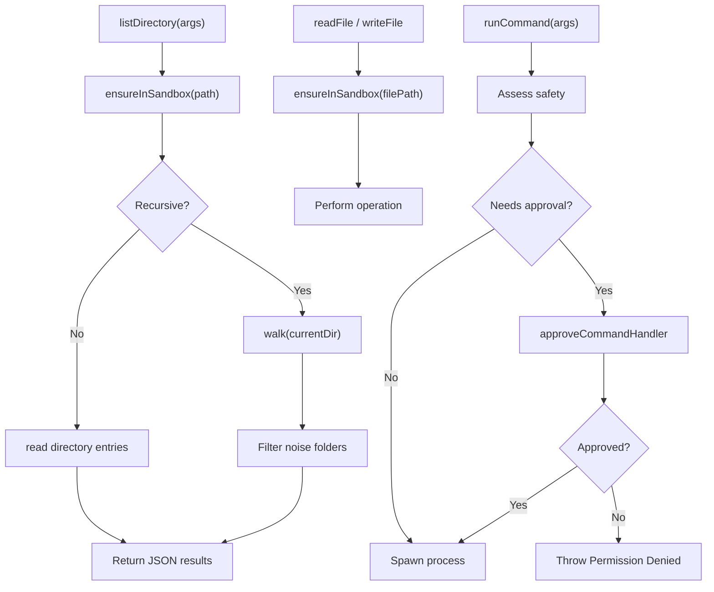
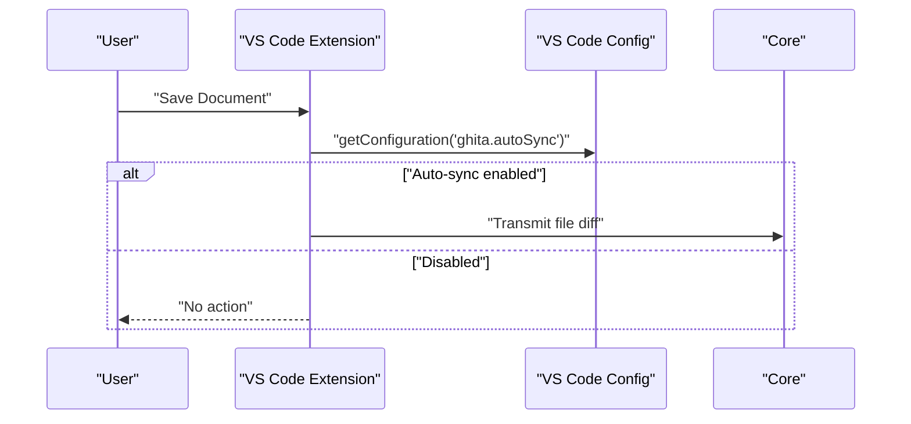
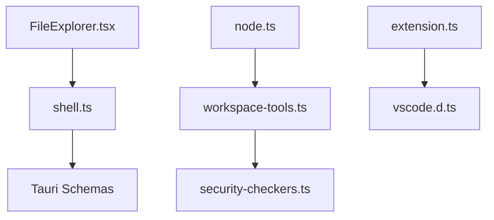

# File System Integration

<cite>
**Referenced Files in This Document**
- [FileExplorer.tsx](file://apps/desktop/src/components/FileExplorer.tsx)
- [shell.ts](file://apps/desktop/src/utils/shell.ts)
- [workspace-tools.ts](file://packages/ai-engine/src/tools/workspace-tools.ts)
- [node.ts](file://packages/skills/src/node.ts)
- [shims.ts](file://apps/desktop/src/shims.ts)
- [desktop-schema.json](file://apps/desktop/src-tauri/gen/schemas/desktop-schema.json)
- [windows-schema.json](file://apps/desktop/src-tauri/gen/schemas/windows-schema.json)
- [extension.ts](file://apps/vscode-extension/src/extension.ts)
- [vscode.d.ts](file://apps/vscode-extension/src/vscode.d.ts)
- [security-checkers.ts](file://packages/ai-engine/src/hooks/security-checkers.ts)
- [phase7-agentic.test.ts](file://tests/unit/phase7-agentic.test.ts)
- [e2e-integration.test.ts](file://tests/e2e/e2e-integration.test.ts)
</cite>

## Table of Contents
1. [Introduction](#introduction)
2. [Project Structure](#project-structure)
3. [Core Components](#core-components)
4. [Architecture Overview](#architecture-overview)
5. [Detailed Component Analysis](#detailed-component-analysis)
6. [Dependency Analysis](#dependency-analysis)
7. [Performance Considerations](#performance-considerations)
8. [Troubleshooting Guide](#troubleshooting-guide)
9. [Conclusion](#conclusion)
10. [Appendices](#appendices)

## Introduction
This document describes the File System Integration system across the Desktop application, AI Engine, Skills layer, VS Code extension, and Tauri capabilities. It explains the FileExplorer component for navigating and managing project files and directories, the shell utility functions for executing system commands and file operations, the API configuration system for accessing file system resources and managing permissions, file system monitoring capabilities, file operation patterns, and integration with VS Code workspace synchronization and mobile file access patterns. It also covers security considerations, permission management, and cross-platform compatibility, along with integration with the broader communication layer for remote file access and synchronization.

## Project Structure
The File System Integration spans several packages and applications:
- Desktop application: FileExplorer UI, shell utilities, Tauri plugin shell integration, and path shims for cross-platform compatibility.
- AI Engine: Workspace tools for listing directories, reading/writing files, and running commands with sandboxing and security checks.
- Skills: Node-based file and terminal operations with process execution.
- VS Code extension: Workspace synchronization triggers and event handling for file changes.
- Tauri schemas: File system capability definitions for desktop builds.

**Diagram sources**
- [FileExplorer.tsx:121-507](file://apps/desktop/src/components/FileExplorer.tsx#L121-L507)
- [shell.ts:1-158](file://apps/desktop/src/utils/shell.ts#L1-L158)
- [shims.ts:47-90](file://apps/desktop/src/shims.ts#L47-L90)
- [desktop-schema.json:216-5633](file://apps/desktop/src-tauri/gen/schemas/desktop-schema.json#L216-L5633)
- [windows-schema.json:216-5633](file://apps/desktop/src-tauri/gen/schemas/windows-schema.json#L216-L5633)
- [workspace-tools.ts:67-277](file://packages/ai-engine/src/tools/workspace-tools.ts#L67-L277)
- [security-checkers.ts:65-95](file://packages/ai-engine/src/hooks/security-checkers.ts#L65-L95)
- [node.ts:121-159](file://packages/skills/src/node.ts#L121-L159)
- [extension.ts:60-90](file://apps/vscode-extension/src/extension.ts#L60-L90)
- [vscode.d.ts:86-97](file://apps/vscode-extension/src/vscode.d.ts#L86-L97)

**Section sources**
- [FileExplorer.tsx:121-507](file://apps/desktop/src/components/FileExplorer.tsx#L121-L507)
- [shell.ts:1-158](file://apps/desktop/src/utils/shell.ts#L1-L158)
- [workspace-tools.ts:67-277](file://packages/ai-engine/src/tools/workspace-tools.ts#L67-L277)
- [node.ts:121-159](file://packages/skills/src/node.ts#L121-L159)
- [shims.ts:47-90](file://apps/desktop/src/shims.ts#L47-L90)
- [desktop-schema.json:216-5633](file://apps/desktop/src-tauri/gen/schemas/desktop-schema.json#L216-L5633)
- [windows-schema.json:216-5633](file://apps/desktop/src-tauri/gen/schemas/windows-schema.json#L216-L5633)
- [extension.ts:60-90](file://apps/vscode-extension/src/extension.ts#L60-L90)
- [vscode.d.ts:86-97](file://apps/vscode-extension/src/vscode.d.ts#L86-L97)

## Core Components
- FileExplorer: A React component that renders a hierarchical file tree, supports context menus for creating/deleting files/folders, and loads directory entries asynchronously while preventing race conditions.
- Shell Utilities: Cross-platform command execution wrappers using Tauri’s shell plugin with security scanning and automatic shell selection.
- Workspace Tools: AI Engine tools for listing directories, reading/writing files, and running commands with sandbox enforcement and safety checks.
- Skills Node Operations: Node-based file and terminal operations with process execution and path resolution.
- VS Code Extension: Workspace synchronization triggers and file change event handling for auto-sync on save.
- Tauri File System Capabilities: Capability definitions for scoped file access and recursive operations.

**Section sources**
- [FileExplorer.tsx:121-507](file://apps/desktop/src/components/FileExplorer.tsx#L121-L507)
- [shell.ts:1-158](file://apps/desktop/src/utils/shell.ts#L1-L158)
- [workspace-tools.ts:67-277](file://packages/ai-engine/src/tools/workspace-tools.ts#L67-L277)
- [node.ts:121-159](file://packages/skills/src/node.ts#L121-L159)
- [extension.ts:60-90](file://apps/vscode-extension/src/extension.ts#L60-L90)
- [desktop-schema.json:216-5633](file://apps/desktop/src-tauri/gen/schemas/desktop-schema.json#L216-L5633)

## Architecture Overview
The system integrates UI-driven file operations, secure shell execution, sandboxed AI workspace tools, and VS Code synchronization. Tauri capabilities define the scope of file system access, while the AI Engine enforces sandboxing and safety policies.

**Diagram sources**
- [FileExplorer.tsx:245-269](file://apps/desktop/src/components/FileExplorer.tsx#L245-L269)
- [shell.ts:90-158](file://apps/desktop/src/utils/shell.ts#L90-L158)

**Section sources**
- [FileExplorer.tsx:245-269](file://apps/desktop/src/components/FileExplorer.tsx#L245-L269)
- [shell.ts:90-158](file://apps/desktop/src/utils/shell.ts#L90-L158)

## Detailed Component Analysis

### FileExplorer Component
The FileExplorer component manages a virtualized file tree with lazy loading, context menus, and safe file operations. It prevents race conditions during rapid navigation and normalizes paths across platforms.

Key behaviors:
- Directory listing with sorting (folders first, then files) and filtering of hidden/system entries.
- Lazy loading of child nodes with a guard against concurrent requests.
- Context menu actions for creating files/folders and deleting items.
- Safe reload of parent directories after mutations.
- Path normalization and separator handling for cross-platform compatibility.

**Diagram sources**
- [FileExplorer.tsx:121-507](file://apps/desktop/src/components/FileExplorer.tsx#L121-L507)

**Section sources**
- [FileExplorer.tsx:121-507](file://apps/desktop/src/components/FileExplorer.tsx#L121-L507)

### Shell Utility Functions
The shell utilities provide a unified interface for executing system commands with security scanning and platform-aware shell selection.

Highlights:
- Security assessment using predefined patterns for malicious commands.
- Automatic selection between cmd and PowerShell based on command characteristics.
- Robust error handling returning structured ShellResult objects.
- Cross-platform path normalization and shims for environments without native Node APIs.

**Diagram sources**
- [shell.ts:1-158](file://apps/desktop/src/utils/shell.ts#L1-L158)

**Section sources**
- [shell.ts:1-158](file://apps/desktop/src/utils/shell.ts#L1-L158)
- [shims.ts:47-90](file://apps/desktop/src/shims.ts#L47-L90)

### API Configuration System and Permission Management
Tauri capabilities define fine-grained file system access scopes for desktop builds. These schemas enumerate permissions such as recursive read/write access to specific directories and metadata operations.

Key aspects:
- Scoped access tokens for folders like APPCACHE and APPCONFIG.
- Recursive and non-recursive variants for read and write operations.
- Metadata-only access for directory listings and stats.

**Diagram sources**
- [desktop-schema.json:216-5633](file://apps/desktop/src-tauri/gen/schemas/desktop-schema.json#L216-L5633)
- [windows-schema.json:216-5633](file://apps/desktop/src-tauri/gen/schemas/windows-schema.json#L216-L5633)

**Section sources**
- [desktop-schema.json:216-5633](file://apps/desktop/src-tauri/gen/schemas/desktop-schema.json#L216-L5633)
- [windows-schema.json:216-5633](file://apps/desktop/src-tauri/gen/schemas/windows-schema.json#L216-L5633)

### File System Monitoring and Real-Time Updates
The AI Engine includes a security hook that analyzes file write operations for risky content, and tests demonstrate path sandboxing to prevent directory traversal and absolute path escapes. The VS Code extension listens for file save events and simulates synchronization to the core.

**Diagram sources**
- [extension.ts:60-90](file://apps/vscode-extension/src/extension.ts#L60-L90)
- [security-checkers.ts:65-95](file://packages/ai-engine/src/hooks/security-checkers.ts#L65-L95)
- [phase7-agentic.test.ts:45-63](file://tests/unit/phase7-agentic.test.ts#L45-L63)

**Section sources**
- [extension.ts:60-90](file://apps/vscode-extension/src/extension.ts#L60-L90)
- [security-checkers.ts:65-95](file://packages/ai-engine/src/hooks/security-checkers.ts#L65-L95)
- [phase7-agentic.test.ts:45-63](file://tests/unit/phase7-agentic.test.ts#L45-L63)

### File Operation Patterns
The AI Engine workspace tools implement:
- Directory listing with optional recursion and noise-folder filtering.
- File read and write with sandbox enforcement.
- Command execution with safety checks and approval hooks.
- Path sandboxing to prevent traversal and absolute path escapes.

**Diagram sources**
- [workspace-tools.ts:67-277](file://packages/ai-engine/src/tools/workspace-tools.ts#L67-L277)
- [security-checkers.ts:65-95](file://packages/ai-engine/src/hooks/security-checkers.ts#L65-L95)
- [phase7-agentic.test.ts:45-63](file://tests/unit/phase7-agentic.test.ts#L45-L63)

**Section sources**
- [workspace-tools.ts:67-277](file://packages/ai-engine/src/tools/workspace-tools.ts#L67-L277)
- [security-checkers.ts:65-95](file://packages/ai-engine/src/hooks/security-checkers.ts#L65-L95)
- [phase7-agentic.test.ts:45-63](file://tests/unit/phase7-agentic.test.ts#L45-L63)

### Integration with VS Code Workspace Synchronization
The VS Code extension registers commands and event listeners to synchronize workspace changes. It logs file save events and simulates sending diffs to the core when connected and auto-sync is enabled.

**Diagram sources**
- [extension.ts:60-90](file://apps/vscode-extension/src/extension.ts#L60-L90)
- [vscode.d.ts:86-97](file://apps/vscode-extension/src/vscode.d.ts#L86-L97)

**Section sources**
- [extension.ts:60-90](file://apps/vscode-extension/src/extension.ts#L60-L90)
- [vscode.d.ts:86-97](file://apps/vscode-extension/src/vscode.d.ts#L86-L97)

### Mobile File Access Patterns
While the mobile app includes file-related services (e.g., storage service), the current focus of this document is on desktop and AI Engine integrations. Mobile file access patterns are out of scope for the referenced files.

[No sources needed since this section does not analyze specific files]

## Dependency Analysis
The system exhibits layered dependencies:
- Desktop UI depends on shell utilities and Tauri capabilities.
- AI Engine tools depend on sandboxing and security hooks.
- Skills layer depends on Node APIs and integrates with AI Engine tools.
- VS Code extension depends on VS Code APIs and communicates with the core.

**Diagram sources**
- [FileExplorer.tsx:121-507](file://apps/desktop/src/components/FileExplorer.tsx#L121-L507)
- [shell.ts:1-158](file://apps/desktop/src/utils/shell.ts#L1-L158)
- [desktop-schema.json:216-5633](file://apps/desktop/src-tauri/gen/schemas/desktop-schema.json#L216-L5633)
- [workspace-tools.ts:67-277](file://packages/ai-engine/src/tools/workspace-tools.ts#L67-L277)
- [security-checkers.ts:65-95](file://packages/ai-engine/src/hooks/security-checkers.ts#L65-L95)
- [node.ts:121-159](file://packages/skills/src/node.ts#L121-L159)
- [extension.ts:60-90](file://apps/vscode-extension/src/extension.ts#L60-L90)
- [vscode.d.ts:86-97](file://apps/vscode-extension/src/vscode.d.ts#L86-L97)

**Section sources**
- [FileExplorer.tsx:121-507](file://apps/desktop/src/components/FileExplorer.tsx#L121-L507)
- [shell.ts:1-158](file://apps/desktop/src/utils/shell.ts#L1-L158)
- [workspace-tools.ts:67-277](file://packages/ai-engine/src/tools/workspace-tools.ts#L67-L277)
- [security-checkers.ts:65-95](file://packages/ai-engine/src/hooks/security-checkers.ts#L65-L95)
- [node.ts:121-159](file://packages/skills/src/node.ts#L121-L159)
- [extension.ts:60-90](file://apps/vscode-extension/src/extension.ts#L60-L90)
- [vscode.d.ts:86-97](file://apps/vscode-extension/src/vscode.d.ts#L86-L97)

## Performance Considerations
- Lazy loading and caching of directory entries reduce UI thrash and unnecessary filesystem calls.
- Preventing race conditions during rapid navigation improves responsiveness.
- Using recursive directory listing with noise-folder filtering reduces overhead.
- Platform-aware shell selection minimizes overhead and maximizes compatibility.
- Sandboxing and security checks avoid expensive retries and mitigate risks.

[No sources needed since this section provides general guidance]

## Troubleshooting Guide
Common issues and resolutions:
- Security policy blocks: Review command patterns flagged as critical threats and adjust commands accordingly.
- Path sandboxing errors: Ensure paths are relative to the active workspace and avoid directory traversal attempts.
- Permission denied for commands: Implement approval handlers or adjust agent permission modes.
- VS Code sync not triggering: Verify auto-sync configuration and connection state.

**Section sources**
- [shell.ts:90-158](file://apps/desktop/src/utils/shell.ts#L90-L158)
- [phase7-agentic.test.ts:45-63](file://tests/unit/phase7-agentic.test.ts#L45-L63)
- [extension.ts:60-90](file://apps/vscode-extension/src/extension.ts#L60-L90)

## Conclusion
The File System Integration system combines a robust FileExplorer UI, secure shell utilities, sandboxed AI workspace tools, and VS Code synchronization to deliver a cohesive file management experience. Tauri capabilities provide granular control over file access, while security hooks and path sandboxing protect against misuse. The architecture supports cross-platform compatibility and lays the groundwork for remote synchronization and advanced monitoring.

[No sources needed since this section summarizes without analyzing specific files]

## Appendices

### Example Workflows
- File Explorer Navigation: Select a root folder, expand directories, and open files via callbacks.
- File Operations: Create files/folders, delete items, and refresh parent directories.
- System Command Execution: Assess command safety, select appropriate shell, and capture structured results.

**Section sources**
- [FileExplorer.tsx:245-329](file://apps/desktop/src/components/FileExplorer.tsx#L245-L329)
- [shell.ts:90-158](file://apps/desktop/src/utils/shell.ts#L90-L158)