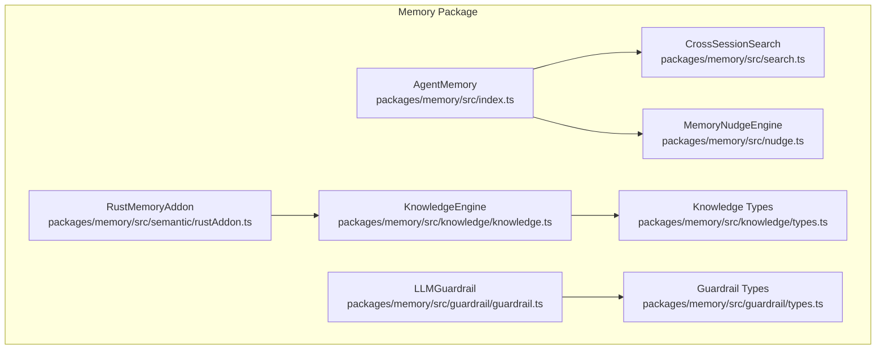
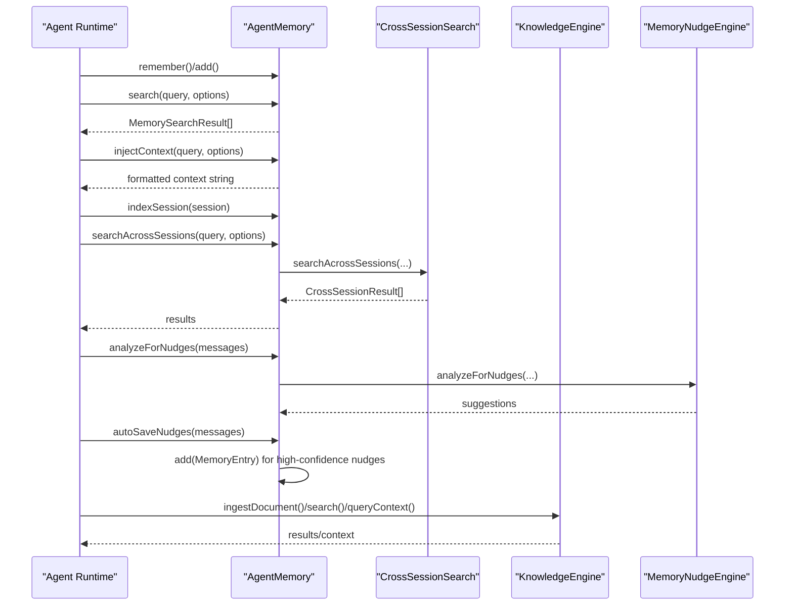
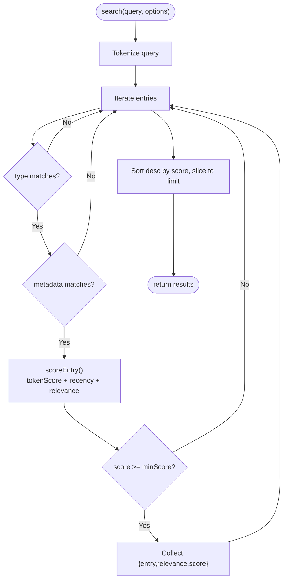
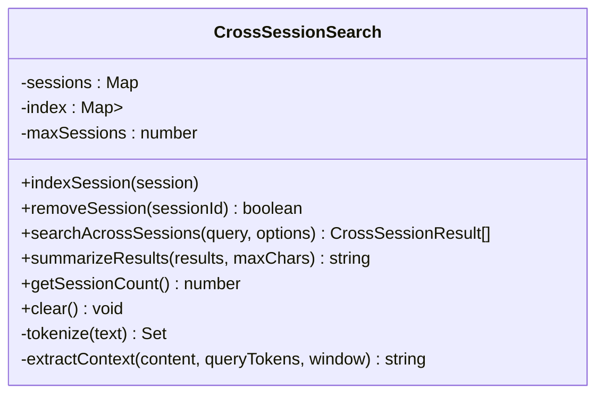
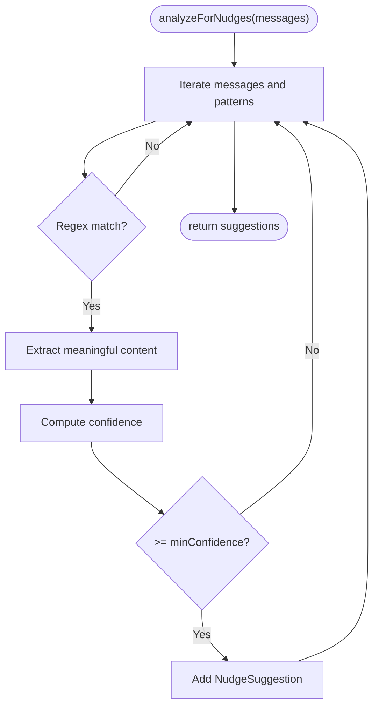
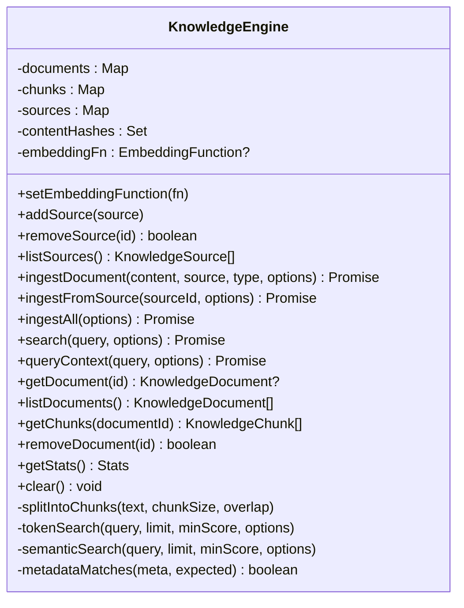
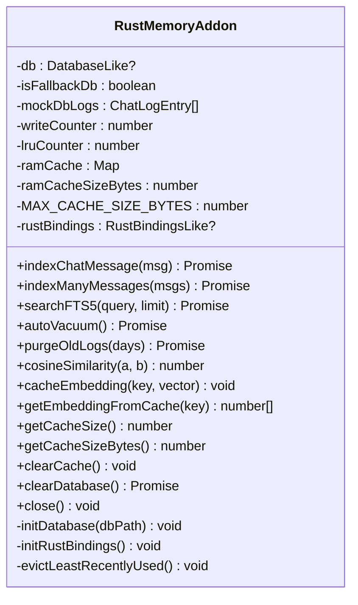
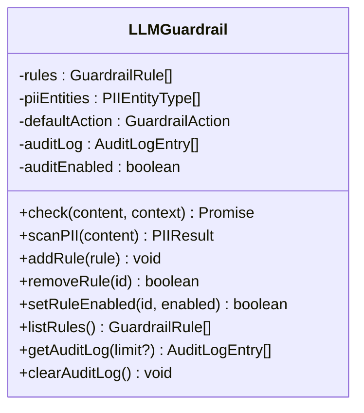
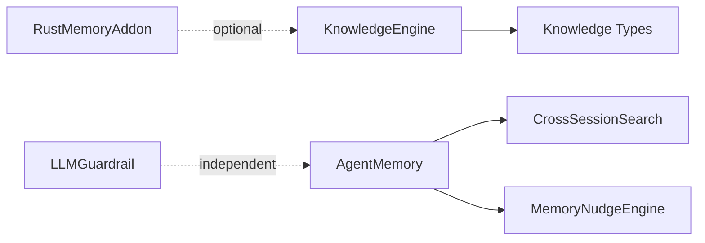

# Memory System and Persistence

<cite>
**Referenced Files in This Document**
- [index.ts](file://packages/memory/src/index.ts)
- [search.ts](file://packages/memory/src/search.ts)
- [nudge.ts](file://packages/memory/src/nudge.ts)
- [knowledge.ts](file://packages/memory/src/knowledge/knowledge.ts)
- [types.ts](file://packages/memory/src/knowledge/types.ts)
- [rustAddon.ts](file://packages/memory/src/semantic/rustAddon.ts)
- [guardrail.ts](file://packages/memory/src/guardrail/guardrail.ts)
- [types.ts](file://packages/memory/src/guardrail/types.ts)
- [runtime.ts](file://packages/agents/src/runtime.ts)
</cite>

## Table of Contents
1. [Introduction](#introduction)
2. [Project Structure](#project-structure)
3. [Core Components](#core-components)
4. [Architecture Overview](#architecture-overview)
5. [Detailed Component Analysis](#detailed-component-analysis)
6. [Dependency Analysis](#dependency-analysis)
7. [Performance Considerations](#performance-considerations)
8. [Troubleshooting Guide](#troubleshooting-guide)
9. [Conclusion](#conclusion)
10. [Appendices](#appendices)

## Introduction
This document explains the Memory System and Persistence architecture used by the GHITA Coding Agent. It covers persistent memory for agent experiences, token-based scoring, cross-session search, automatic memory saving via nudges, knowledge ingestion with embeddings and semantic search, and memory serialization for persistence. Practical examples illustrate memory operations, search queries, and context injection patterns. Lifecycle management, cleanup policies, and performance considerations for large datasets are included.

## Project Structure
The memory subsystem is primarily implemented in the memory package, with supporting modules for cross-session search, nudges, knowledge/RAG, guardrails, and a semantic acceleration layer.

**Diagram sources**
- [index.ts:100-219](file://packages/memory/src/index.ts#L100-L219)
- [search.ts:33-254](file://packages/memory/src/search.ts#L33-L254)
- [nudge.ts:93-181](file://packages/memory/src/nudge.ts#L93-L181)
- [knowledge.ts:54-332](file://packages/memory/src/knowledge/knowledge.ts#L54-L332)
- [types.ts:5-89](file://packages/memory/src/knowledge/types.ts#L5-L89)
- [rustAddon.ts:48-407](file://packages/memory/src/semantic/rustAddon.ts#L48-L407)
- [guardrail.ts:226-357](file://packages/memory/src/guardrail/guardrail.ts#L226-L357)
- [types.ts:5-99](file://packages/memory/src/guardrail/types.ts#L5-L99)

**Section sources**
- [index.ts:1-38](file://packages/memory/src/index.ts#L1-L38)
- [search.ts:1-31](file://packages/memory/src/search.ts#L1-L31)
- [nudge.ts:1-29](file://packages/memory/src/nudge.ts#L1-L29)
- [knowledge.ts:1-54](file://packages/memory/src/knowledge/knowledge.ts#L1-L54)
- [rustAddon.ts:1-47](file://packages/memory/src/semantic/rustAddon.ts#L1-L47)

## Core Components
- AgentMemory: Central in-memory store with CRUD-like operations, search, context injection, cross-session indexing, and automatic memory saving via nudges. Provides serialization via toJSON/fromJSON.
- CrossSessionSearch: In-memory inverted index enabling fast cross-session message search with recency bonuses.
- MemoryNudgeEngine: Pattern-based analyzer that detects preference, facts, solutions, and knowledge cues in conversation and suggests automatic saving.
- KnowledgeEngine: Documents/chunks ingestion, deduplication, chunking, optional embeddings, token-based and semantic search, and RAG context formatting.
- RustMemoryAddon: Optional acceleration layer with SQLite FTS5 chat indexing, cosine similarity fallback, and RAM cache for embeddings.
- LLMGuardrail: Content safety and compliance engine with PII detection, content filters, and LLM-as-judge.

**Section sources**
- [index.ts:100-219](file://packages/memory/src/index.ts#L100-L219)
- [search.ts:33-176](file://packages/memory/src/search.ts#L33-L176)
- [nudge.ts:93-181](file://packages/memory/src/nudge.ts#L93-L181)
- [knowledge.ts:54-332](file://packages/memory/src/knowledge/knowledge.ts#L54-L332)
- [rustAddon.ts:48-407](file://packages/memory/src/semantic/rustAddon.ts#L48-L407)
- [guardrail.ts:226-357](file://packages/memory/src/guardrail/guardrail.ts#L226-L357)

## Architecture Overview
The memory architecture integrates local memory, cross-session search, and knowledge systems. AgentMemory coordinates persistent storage and retrieval, while KnowledgeEngine supports long-term knowledge ingestion and semantic search. CrossSessionSearch enables retrieval across prior chat sessions. MemoryNudgeEngine improves recall by automatically persisting important patterns. RustMemoryAddon optionally accelerates chat indexing and similarity computations.

**Diagram sources**
- [index.ts:113-219](file://packages/memory/src/index.ts#L113-L219)
- [search.ts:105-176](file://packages/memory/src/search.ts#L105-L176)
- [nudge.ts:108-181](file://packages/memory/src/nudge.ts#L108-L181)
- [knowledge.ts:86-202](file://packages/memory/src/knowledge/knowledge.ts#L86-L202)
- [runtime.ts:174-178](file://packages/agents/src/runtime.ts#L174-L178)

## Detailed Component Analysis

### AgentMemory
AgentMemory provides persistent storage for agent memories with:
- remember(input): Creates and stores a new MemoryEntry with generated id, type, content, metadata, and timestamp.
- add(entry): Adds an existing MemoryEntry to storage.
- get(id): Retrieves a MemoryEntry by id.
- list(type?): Returns entries sorted by timestamp descending; optionally filtered by type.
- forget(id): Deletes an entry by id.
- clear(): Empties the in-memory store.
- search(query, options): Token-based scoring with recency and relevance weighting; returns top-k results.
- injectContext(query, options): Formats top memories into a context string for injection.
- indexSession(session): Adds a session to the cross-session index.
- searchAcrossSessions(query, options): Searches across indexed sessions with recency bonuses.
- analyzeForNudges(messages): Analyzes conversation for memory nudges.
- autoSaveNudges(messages): Automatically persists high-confidence nudges.
- toJSON(): Serializes current memory to array of entries.
- fromJSON(entries): Factory to reconstruct AgentMemory from persisted entries.

Scoring algorithm breakdown:
- Token matching: Intersection over union of token sets between query and entry content.
- Recency factor: Age-based decay capped at ~30 days; adds small recency bonus.
- Explicit relevance: Optional relevance score stored in entry.
- Weighted combination: tokenScore * 0.7 + recencyScore * 0.2 + explicitRelevance * 0.1.

**Diagram sources**
- [index.ts:149-167](file://packages/memory/src/index.ts#L149-L167)
- [index.ts:83-98](file://packages/memory/src/index.ts#L83-L98)

Practical examples:
- Remember a task outcome: see [runtime.ts:174-178](file://packages/agents/src/runtime.ts#L174-L178).
- Inject context into prompts: see [index.ts:169-182](file://packages/memory/src/index.ts#L169-L182).
- Search across sessions: see [index.ts:188-193](file://packages/memory/src/index.ts#L188-L193).

**Section sources**
- [index.ts:100-219](file://packages/memory/src/index.ts#L100-L219)

### CrossSessionSearch
CrossSessionSearch maintains an in-memory inverted index of tokens to session ids and supports:
- indexSession(session): Adds a session and indexes all tokens in messages and summaries.
- removeSession(sessionId): Removes a session and cleans up index entries.
- searchAcrossSessions(query, options): Candidate selection via token intersections, per-message scoring, and overall session score with recency bonus.
- summarizeResults(results, maxChars): Produces a human-readable summary of cross-session matches.
- getSessionCount(), clear(): Utilities for diagnostics and maintenance.

**Diagram sources**
- [search.ts:33-254](file://packages/memory/src/search.ts#L33-L254)

**Section sources**
- [search.ts:33-176](file://packages/memory/src/search.ts#L33-L176)

### MemoryNudgeEngine
MemoryNudgeEngine identifies memory-worthy patterns in conversation:
- analyzeForNudges(messages): Scans user/assistant messages with predefined patterns for preferences, facts, solutions, and knowledge notes; computes confidence.
- shouldAutoSave(nudge): Decides whether to auto-save based on thresholds.
- addCustomPattern(pattern): Extends patterns dynamically.
- toMemoryEntry(nudge): Converts suggestion to MemoryEntry with appropriate type and metadata.

**Diagram sources**
- [nudge.ts:108-144](file://packages/memory/src/nudge.ts#L108-L144)

**Section sources**
- [nudge.ts:93-181](file://packages/memory/src/nudge.ts#L93-L181)

### KnowledgeEngine (Ingestion and Semantic Search)
KnowledgeEngine manages documents, chunks, and optional embeddings:
- Ingestion: ingestDocument(), ingestFromSource(), ingestAll(); deduplicates by content hash; optional embedding generation.
- Chunking: configurable chunk size and overlap; preserves offsets.
- Search: token-based search by default; semantic search via cosine similarity if embeddings are available.
- RAG: queryContext() formats top results with source attribution.

**Diagram sources**
- [knowledge.ts:54-332](file://packages/memory/src/knowledge/knowledge.ts#L54-L332)
- [types.ts:5-89](file://packages/memory/src/knowledge/types.ts#L5-L89)

**Section sources**
- [knowledge.ts:54-332](file://packages/memory/src/knowledge/knowledge.ts#L54-L332)
- [types.ts:5-89](file://packages/memory/src/knowledge/types.ts#L5-L89)

### RustMemoryAddon (Optional Acceleration)
RustMemoryAddon provides:
- SQLite FTS5 chat indexing with relational table for structured access.
- Fallback in-memory mode when native bindings are unavailable.
- Cosine similarity computation with Rust bindings or JavaScript fallback.
- RAM cache for embeddings with LRU eviction up to 100 MB.
- Auto-Vacuum and periodic cleanup; purgeOldLogs() removes entries older than N days.

**Diagram sources**
- [rustAddon.ts:48-407](file://packages/memory/src/semantic/rustAddon.ts#L48-L407)

**Section sources**
- [rustAddon.ts:48-407](file://packages/memory/src/semantic/rustAddon.ts#L48-L407)

### LLMGuardrail (Safety and Compliance)
LLMGuardrail applies:
- Content filtering (keywords, patterns, length).
- PII detection with replaceable patterns and severities.
- LLM-as-judge rule using a provided LLM call function.
- Audit logging and dynamic rule management.

**Diagram sources**
- [guardrail.ts:226-357](file://packages/memory/src/guardrail/guardrail.ts#L226-L357)
- [types.ts:5-99](file://packages/memory/src/guardrail/types.ts#L5-L99)

**Section sources**
- [guardrail.ts:226-357](file://packages/memory/src/guardrail/guardrail.ts#L226-L357)
- [types.ts:5-99](file://packages/memory/src/guardrail/types.ts#L5-L99)

## Dependency Analysis
AgentMemory depends on CrossSessionSearch and MemoryNudgeEngine internally. KnowledgeEngine depends on knowledge types and optional embedding functions. RustMemoryAddon is optional and used by higher-level components when available. Guardrail is orthogonal but complementary for content safety.

**Diagram sources**
- [index.ts:6-9](file://packages/memory/src/index.ts#L6-L9)
- [knowledge.ts:5-13](file://packages/memory/src/knowledge/knowledge.ts#L5-L13)
- [rustAddon.ts:40-42](file://packages/memory/src/semantic/rustAddon.ts#L40-L42)
- [guardrail.ts:5-14](file://packages/memory/src/guardrail/guardrail.ts#L5-L14)

**Section sources**
- [index.ts:6-9](file://packages/memory/src/index.ts#L6-L9)
- [knowledge.ts:5-13](file://packages/memory/src/knowledge/knowledge.ts#L5-L13)

## Performance Considerations
- Tokenization and scoring:
  - Tokenize once per query and reuse; avoid repeated regex compilation.
  - Limit search results with a reasonable limit and minScore to bound complexity.
- Cross-session search:
  - Inverted index lookup is efficient; consider session pruning when exceeding maxSessions to cap memory growth.
  - Candidate selection via token intersections reduces per-session scanning.
- KnowledgeEngine:
  - Deduplicate by content hash to avoid redundant processing.
  - Use chunkSize and overlap tuned to content density; larger overlaps improve continuity at cost of more chunks.
  - Prefer token-based search for speed; enable semantic search only when embeddings are cached or computed once.
- RustMemoryAddon:
  - Leverage FTS5 for chat logs; use Auto-Vacuum periodically to prevent fragmentation.
  - RAM cache prevents recomputation; tune cache size and eviction policy for workload.
- Serialization:
  - toJSON() returns a sorted list; fromJSON() reconstructs state; batch saves to minimize frequent writes.

[No sources needed since this section provides general guidance]

## Troubleshooting Guide
- Memory search returns empty results:
  - Verify query tokens are non-empty; ensure minScore is not too high.
  - Confirm metadata filters match stored entries.
- Cross-session search slow:
  - Reduce maxSessions or prune older sessions.
  - Ensure query contains sufficient tokens for candidate selection.
- Nudge not auto-saving:
  - Check confidence thresholds and minConfidence/autoSaveThreshold.
  - Validate pattern coverage for the detected content type.
- Knowledge search slow:
  - Disable semantic search or precompute embeddings.
  - Adjust chunkSize and overlap to balance precision and performance.
- Guardrail blocking unexpected content:
  - Review content filter rules and PII patterns; adjust severity or disable temporarily for testing.
- RustMemoryAddon fallback:
  - If native bindings fail, expect slower operations; verify environment support for better-sqlite3 and Rust N-API.

**Section sources**
- [index.ts:149-167](file://packages/memory/src/index.ts#L149-L167)
- [search.ts:105-176](file://packages/memory/src/search.ts#L105-L176)
- [nudge.ts:149-151](file://packages/memory/src/nudge.ts#L149-L151)
- [knowledge.ts:173-185](file://packages/memory/src/knowledge/knowledge.ts#L173-L185)
- [guardrail.ts:261-297](file://packages/memory/src/guardrail/guardrail.ts#L261-L297)
- [rustAddon.ts:112-120](file://packages/memory/src/semantic/rustAddon.ts#L112-L120)

## Conclusion
The Memory System and Persistence architecture combines local memory, cross-session search, automatic memory saving, and knowledge ingestion with optional semantic acceleration. AgentMemory centralizes storage and retrieval with robust scoring and context injection. CrossSessionSearch and MemoryNudgeEngine enhance recall and usability. KnowledgeEngine supports scalable ingestion and search, while RustMemoryAddon optimizes chat indexing and similarity. Guardrail ensures safe and compliant operation. Together, these components provide a flexible, extensible foundation for agent memory and knowledge management.

[No sources needed since this section summarizes without analyzing specific files]

## Appendices

### Practical Examples

- Remembering a task completion:
  - See [runtime.ts:174-178](file://packages/agents/src/runtime.ts#L174-L178) for how the runtime remembers outcomes.

- Injecting context into prompts:
  - See [index.ts:169-182](file://packages/memory/src/index.ts#L169-L182) for formatting top memories into a context string.

- Cross-session search:
  - See [index.ts:188-193](file://packages/memory/src/index.ts#L188-L193) for indexing a session and performing cross-session retrieval.

- Automatic memory saving:
  - See [index.ts:195-210](file://packages/memory/src/index.ts#L195-L210) for analyzing nudges and auto-saving high-confidence suggestions.

- Knowledge ingestion and semantic search:
  - See [knowledge.ts:86-185](file://packages/memory/src/knowledge/knowledge.ts#L86-L185) for ingestion and search APIs.

- Memory serialization:
  - See [index.ts:212-218](file://packages/memory/src/index.ts#L212-L218) for toJSON/fromJSON.

[No sources needed since this section aggregates previously cited examples]