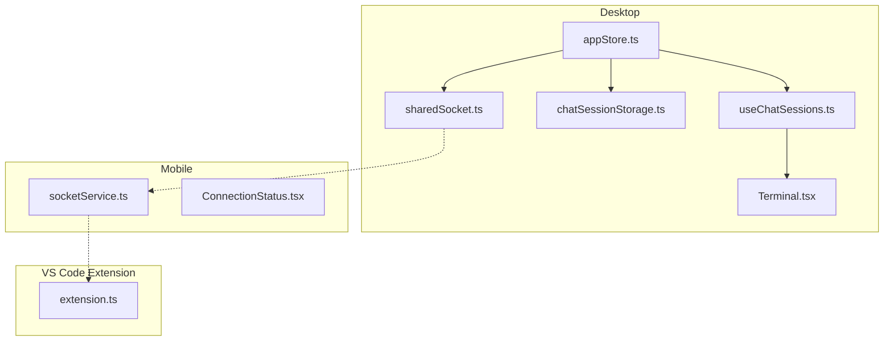
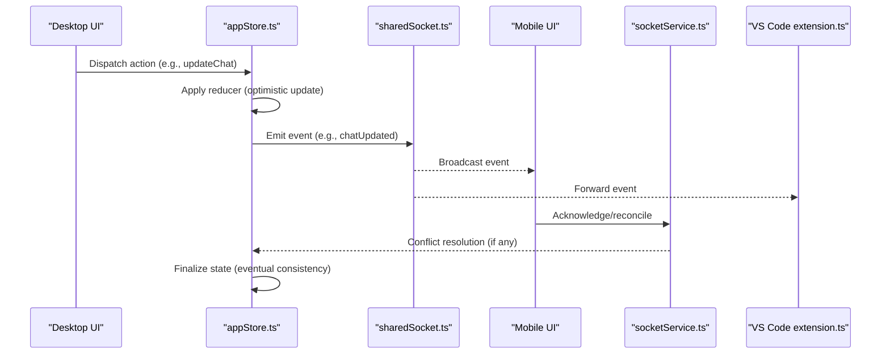
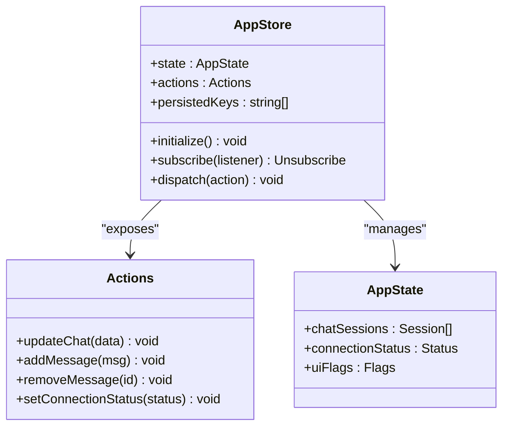
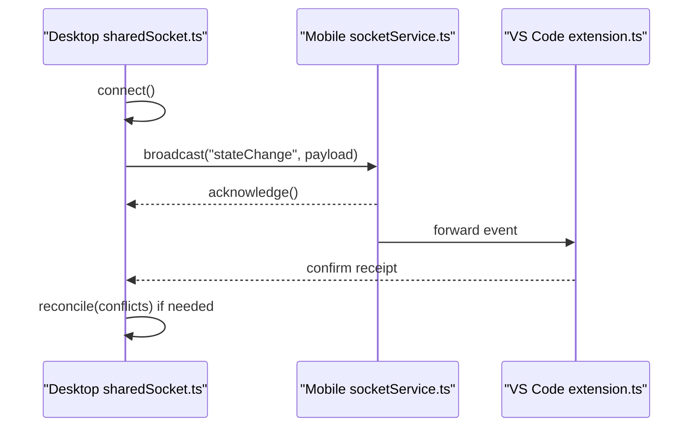
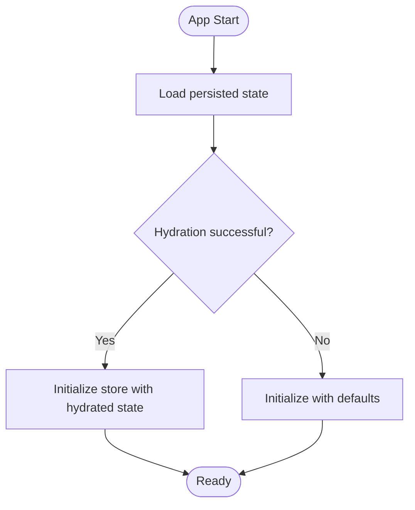
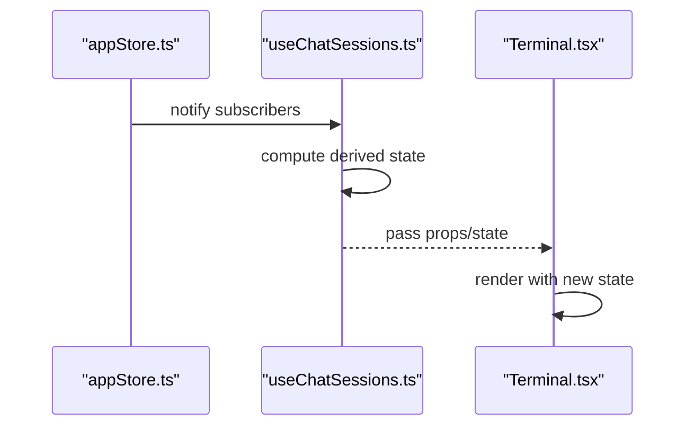
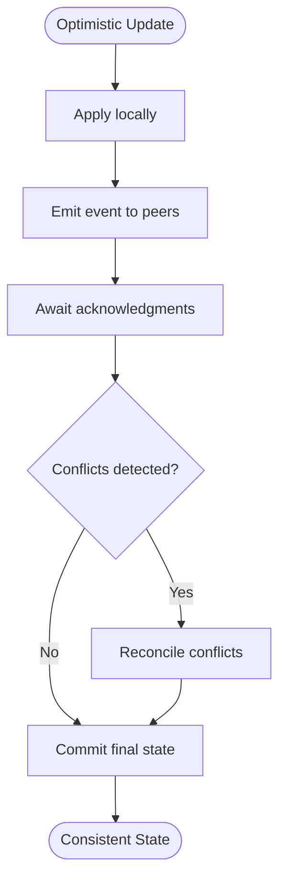
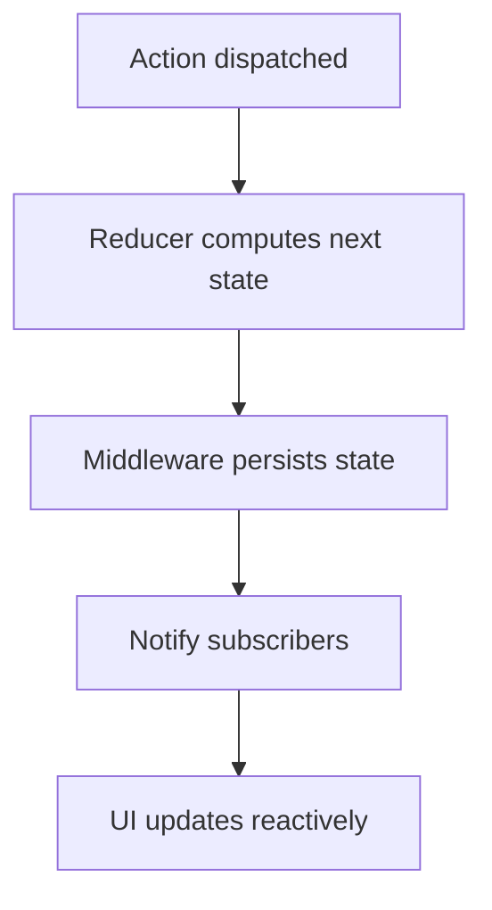
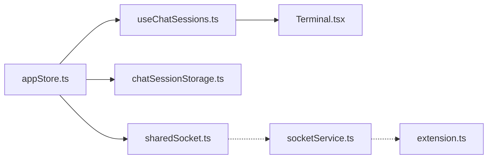

# State Management and Synchronization

<cite>
**Referenced Files in This Document**
- [appStore.ts](file://apps/desktop/src/stores/appStore.ts)
- [sharedSocket.ts](file://apps/desktop/src/utils/sharedSocket.ts)
- [socketService.ts](file://apps/mobile/src/services/socketService.ts)
- [extension.ts](file://apps/vscode-extension/src/extension.ts)
- [chatSessionStorage.ts](file://apps/desktop/src/utils/chatSessionStorage.ts)
- [useChatSessions.ts](file://apps/desktop/src/hooks/useChatSessions.ts)
- [Terminal.tsx](file://apps/desktop/src/components/Terminal.tsx)
- [ConnectionStatus.tsx](file://apps/mobile/src/components/ConnectionStatus.tsx)
</cite>

## Table of Contents
1. [Introduction](#introduction)
2. [Project Structure](#project-structure)
3. [Core Components](#core-components)
4. [Architecture Overview](#architecture-overview)
5. [Detailed Component Analysis](#detailed-component-analysis)
6. [Dependency Analysis](#dependency-analysis)
7. [Performance Considerations](#performance-considerations)
8. [Troubleshooting Guide](#troubleshooting-guide)
9. [Conclusion](#conclusion)

## Introduction
This document explains the State Management and Synchronization system built on Zustand for the desktop application and extended to mobile and VS Code environments. It covers the global state store, persistence mechanisms, real-time synchronization via shared sockets, optimistic updates, conflict resolution, and eventual consistency. It also documents subscription patterns for reactive UI updates, state initialization, update workflows, debugging, performance optimization, and cross-platform consistency guarantees.

## Project Structure
The state management spans three platforms:
- Desktop: Global state store, shared socket utilities, and persistence helpers
- Mobile: Socket service for real-time connectivity
- VS Code Extension: Extension entry point integrating with the broader ecosystem

**Diagram sources**
- [appStore.ts](file://apps/desktop/src/stores/appStore.ts)
- [sharedSocket.ts](file://apps/desktop/src/utils/sharedSocket.ts)
- [chatSessionStorage.ts](file://apps/desktop/src/utils/chatSessionStorage.ts)
- [useChatSessions.ts](file://apps/desktop/src/hooks/useChatSessions.ts)
- [Terminal.tsx](file://apps/desktop/src/components/Terminal.tsx)
- [socketService.ts](file://apps/mobile/src/services/socketService.ts)
- [ConnectionStatus.tsx](file://apps/mobile/src/components/ConnectionStatus.tsx)
- [extension.ts](file://apps/vscode-extension/src/extension.ts)

**Section sources**
- [appStore.ts](file://apps/desktop/src/stores/appStore.ts)
- [sharedSocket.ts](file://apps/desktop/src/utils/sharedSocket.ts)
- [socketService.ts](file://apps/mobile/src/services/socketService.ts)
- [extension.ts](file://apps/vscode-extension/src/extension.ts)

## Core Components
- Global State Store (Zustand): Centralized state container for application-wide data, actions, and derived state
- Shared Socket Utilities: Real-time connection management and event broadcasting across platforms
- Persistence Layer: Local storage synchronization and cross-session recovery
- Subscription Hooks: Reactive UI bindings and cross-component state sharing
- Platform-Specific Integrations: Mobile socket service and VS Code extension integration

Key responsibilities:
- State initialization and hydration from persisted storage
- Optimistic updates with rollback on conflicts
- Event-driven synchronization across desktop, mobile, and VS Code
- Efficient subscriptions for UI reactivity

**Section sources**
- [appStore.ts](file://apps/desktop/src/stores/appStore.ts)
- [sharedSocket.ts](file://apps/desktop/src/utils/sharedSocket.ts)
- [chatSessionStorage.ts](file://apps/desktop/src/utils/chatSessionStorage.ts)
- [useChatSessions.ts](file://apps/desktop/src/hooks/useChatSessions.ts)

## Architecture Overview
The system uses a centralized Zustand store with platform-specific adapters:
- Desktop: Full state store with persistence and shared socket utilities
- Mobile: Socket service for real-time events and connection status
- VS Code: Extension entry point coordinating with backend services

**Diagram sources**
- [appStore.ts](file://apps/desktop/src/stores/appStore.ts)
- [sharedSocket.ts](file://apps/desktop/src/utils/sharedSocket.ts)
- [socketService.ts](file://apps/mobile/src/services/socketService.ts)
- [extension.ts](file://apps/vscode-extension/src/extension.ts)

## Detailed Component Analysis

### Zustand-Based Global State Store (Desktop)
The store encapsulates application state, actions, and middleware for transformations. It supports:
- State initialization from persisted data
- Reducers for deterministic updates
- Middleware for logging, persistence, and cross-session recovery
- Subscriptions for reactive UI updates

**Diagram sources**
- [appStore.ts](file://apps/desktop/src/stores/appStore.ts)

**Section sources**
- [appStore.ts](file://apps/desktop/src/stores/appStore.ts)

### Shared Socket Implementation (Cross-Platform Real-Time)
The shared socket maintains real-time connections and broadcasts state changes:
- Connection lifecycle management
- Event emission and propagation
- Cross-session recovery and reconciliation
- Platform-specific adapters (desktop, mobile, VS Code)

**Diagram sources**
- [sharedSocket.ts](file://apps/desktop/src/utils/sharedSocket.ts)
- [socketService.ts](file://apps/mobile/src/services/socketService.ts)
- [extension.ts](file://apps/vscode-extension/src/extension.ts)

**Section sources**
- [sharedSocket.ts](file://apps/desktop/src/utils/sharedSocket.ts)
- [socketService.ts](file://apps/mobile/src/services/socketService.ts)
- [extension.ts](file://apps/vscode-extension/src/extension.ts)

### State Persistence and Cross-Session Recovery
Persistence ensures continuity across sessions:
- Local storage synchronization
- Hydration on startup
- Recovery of partial or corrupted state
- Incremental updates to minimize load

**Diagram sources**
- [chatSessionStorage.ts](file://apps/desktop/src/utils/chatSessionStorage.ts)
- [appStore.ts](file://apps/desktop/src/stores/appStore.ts)

**Section sources**
- [chatSessionStorage.ts](file://apps/desktop/src/utils/chatSessionStorage.ts)
- [appStore.ts](file://apps/desktop/src/stores/appStore.ts)

### Subscription Patterns and Reactive UI Updates
Reactive updates propagate state changes to UI components:
- Subscribe to store slices
- Derived state computations
- Cross-component sharing without prop drilling

**Diagram sources**
- [useChatSessions.ts](file://apps/desktop/src/hooks/useChatSessions.ts)
- [Terminal.tsx](file://apps/desktop/src/components/Terminal.tsx)
- [appStore.ts](file://apps/desktop/src/stores/appStore.ts)

**Section sources**
- [useChatSessions.ts](file://apps/desktop/src/hooks/useChatSessions.ts)
- [Terminal.tsx](file://apps/desktop/src/components/Terminal.tsx)
- [appStore.ts](file://apps/desktop/src/stores/appStore.ts)

### State Synchronization Patterns
Patterns for reliable cross-platform updates:
- Optimistic updates: immediate UI response with deferred server acknowledgment
- Conflict resolution: detect and resolve discrepancies on acknowledgment
- Eventual consistency: converge to a globally consistent state after reconciliation

**Diagram sources**
- [appStore.ts](file://apps/desktop/src/stores/appStore.ts)
- [sharedSocket.ts](file://apps/desktop/src/utils/sharedSocket.ts)

**Section sources**
- [appStore.ts](file://apps/desktop/src/stores/appStore.ts)
- [sharedSocket.ts](file://apps/desktop/src/utils/sharedSocket.ts)

### State Update Mechanisms
Actions, reducers, and middleware orchestrate transformations:
- Actions: user-triggered commands
- Reducers: pure transformations of state
- Middleware: logging, persistence, and cross-session recovery

**Diagram sources**
- [appStore.ts](file://apps/desktop/src/stores/appStore.ts)

**Section sources**
- [appStore.ts](file://apps/desktop/src/stores/appStore.ts)

### Examples of Workflows
- State initialization: load persisted data and hydrate the store
- Update operation: dispatch an action, apply reducer, emit event, reconcile if needed
- Synchronization workflow: broadcast changes, handle acknowledgments, resolve conflicts, finalize state

**Section sources**
- [appStore.ts](file://apps/desktop/src/stores/appStore.ts)
- [sharedSocket.ts](file://apps/desktop/src/utils/sharedSocket.ts)
- [chatSessionStorage.ts](file://apps/desktop/src/utils/chatSessionStorage.ts)

## Dependency Analysis
Inter-component relationships:
- Desktop store depends on shared socket utilities and persistence helpers
- Mobile socket service integrates with desktop store via shared socket
- VS Code extension coordinates with backend services and desktop store
- UI components subscribe to store updates via hooks

**Diagram sources**
- [appStore.ts](file://apps/desktop/src/stores/appStore.ts)
- [sharedSocket.ts](file://apps/desktop/src/utils/sharedSocket.ts)
- [chatSessionStorage.ts](file://apps/desktop/src/utils/chatSessionStorage.ts)
- [useChatSessions.ts](file://apps/desktop/src/hooks/useChatSessions.ts)
- [Terminal.tsx](file://apps/desktop/src/components/Terminal.tsx)
- [socketService.ts](file://apps/mobile/src/services/socketService.ts)
- [extension.ts](file://apps/vscode-extension/src/extension.ts)

**Section sources**
- [appStore.ts](file://apps/desktop/src/stores/appStore.ts)
- [sharedSocket.ts](file://apps/desktop/src/utils/sharedSocket.ts)
- [chatSessionStorage.ts](file://apps/desktop/src/utils/chatSessionStorage.ts)
- [useChatSessions.ts](file://apps/desktop/src/hooks/useChatSessions.ts)
- [Terminal.tsx](file://apps/desktop/src/components/Terminal.tsx)
- [socketService.ts](file://apps/mobile/src/services/socketService.ts)
- [extension.ts](file://apps/vscode-extension/src/extension.ts)

## Performance Considerations
- Minimize state updates: batch updates and avoid unnecessary re-renders
- Use selective subscriptions: subscribe to specific slices rather than entire state
- Persist incrementally: reduce load by persisting deltas
- Debounce high-frequency events: limit socket traffic during rapid updates
- Optimize derived computations: memoize expensive derived state
- Memory management: dispose subscriptions and clear large objects when unused

## Troubleshooting Guide
Common issues and resolutions:
- State desynchronization: verify acknowledgments and reconcile conflicts
- Persistence failures: check hydration logic and fallback defaults
- Socket disconnections: implement reconnection and exponential backoff
- UI not updating: ensure proper subscriptions and selector correctness
- Performance regressions: profile subscriptions and derived computations

**Section sources**
- [appStore.ts](file://apps/desktop/src/stores/appStore.ts)
- [sharedSocket.ts](file://apps/desktop/src/utils/sharedSocket.ts)
- [chatSessionStorage.ts](file://apps/desktop/src/utils/chatSessionStorage.ts)
- [socketService.ts](file://apps/mobile/src/services/socketService.ts)
- [extension.ts](file://apps/vscode-extension/src/extension.ts)

## Conclusion
The State Management and Synchronization system leverages a centralized Zustand store with robust persistence, real-time synchronization via shared sockets, and reactive subscriptions. By implementing optimistic updates, conflict resolution, and eventual consistency, it ensures reliable cross-platform state consistency across desktop, mobile, and VS Code environments. With careful attention to performance and debugging, the system scales effectively for large state objects and complex workflows.