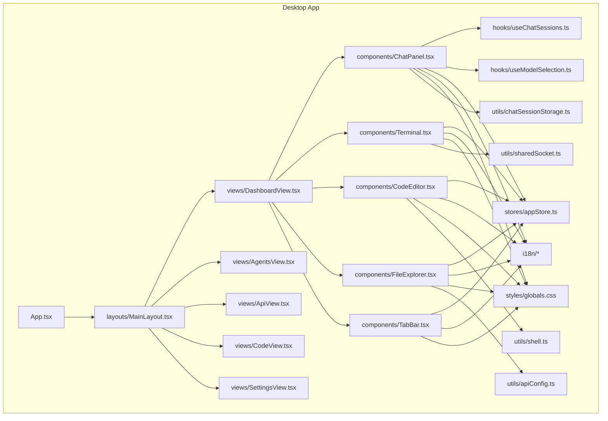
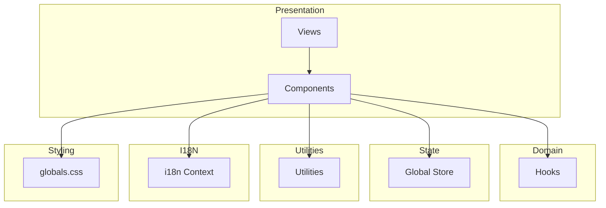
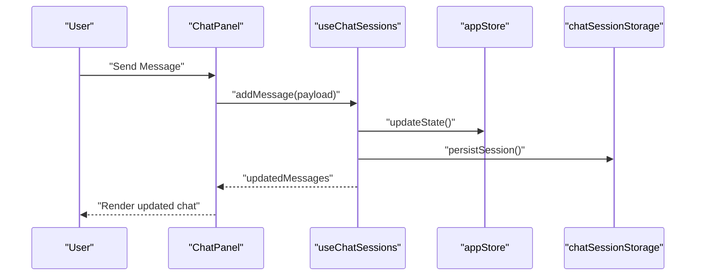
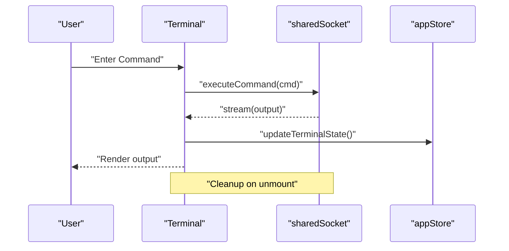
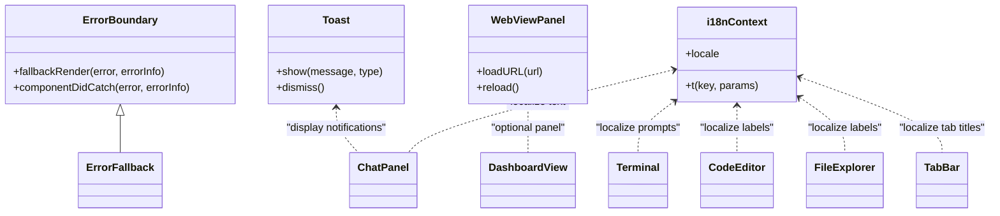
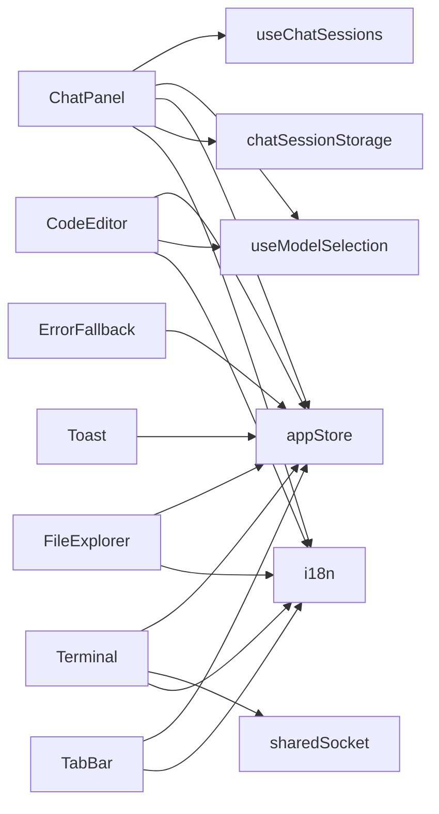

# Component System

<cite>
**Referenced Files in This Document**
- [ChatPanel.tsx](file://apps/desktop/src/components/ChatPanel.tsx)
- [Terminal.tsx](file://apps/desktop/src/components/Terminal.tsx)
- [CodeEditor.tsx](file://apps/desktop/src/components/CodeEditor.tsx)
- [FileExplorer.tsx](file://apps/desktop/src/components/FileExplorer.tsx)
- [TabBar.tsx](file://apps/desktop/src/components/TabBar.tsx)
- [MainLayout.tsx](file://apps/desktop/src/layouts/MainLayout.tsx)
- [App.tsx](file://apps/desktop/src/App.tsx)
- [useChatSessions.ts](file://apps/desktop/src/hooks/useChatSessions.ts)
- [useModelSelection.ts](file://apps/desktop/src/hooks/useModelSelection.ts)
- [appStore.ts](file://apps/desktop/src/stores/appStore.ts)
- [globals.css](file://apps/desktop/src/styles/globals.css)
- [context.tsx](file://apps/desktop/src/i18n/context.tsx)
- [en.ts](file://apps/desktop/src/i18n/en.ts)
- [index.ts](file://apps/desktop/src/i18n/index.ts)
- [types.ts](file://apps/desktop/src/i18n/types.ts)
- [ChatMessageContent.tsx](file://apps/desktop/src/components/ChatMessageContent.tsx)
- [ErrorFallback.tsx](file://apps/desktop/src/components/ErrorFallback.tsx)
- [Toast.tsx](file://apps/desktop/src/components/Toast.tsx)
- [WebViewPanel.tsx](file://apps/desktop/src/components/WebViewPanel.tsx)
- [DashboardView.tsx](file://apps/desktop/src/views/DashboardView.tsx)
- [AgentsView.tsx](file://apps/desktop/src/views/AgentsView.tsx)
- [ApiView.tsx](file://apps/desktop/src/views/ApiView.tsx)
- [CodeView.tsx](file://apps/desktop/src/views/CodeView.tsx)
- [SettingsView.tsx](file://apps/desktop/src/views/SettingsView.tsx)
- [Terminal.test.tsx](file://apps/desktop/src/components/Terminal.test.tsx)
- [Terminal.integration.test.ts](file://apps/desktop/src/components/Terminal.integration.test.ts)
- [ChatMessageContent.test.tsx](file://apps/desktop/src/components/ChatMessageContent.test.tsx)
- [ErrorFallback.test.tsx](file://apps/desktop/src/components/ErrorFallback.test.tsx)
- [useChatSessions.test.ts](file://apps/desktop/src/hooks/useChatSessions.test.ts)
- [chatSessionStorage.ts](file://apps/desktop/src/utils/chatSessionStorage.ts)
- [sharedSocket.ts](file://apps/desktop/src/utils/sharedSocket.ts)
- [shell.ts](file://apps/desktop/src/utils/shell.ts)
- [apiConfig.ts](file://apps/desktop/src/utils/apiConfig.ts)
</cite>

## Table of Contents
1. [Introduction](#introduction)
2. [Project Structure](#project-structure)
3. [Core Components](#core-components)
4. [Architecture Overview](#architecture-overview)
5. [Detailed Component Analysis](#detailed-component-analysis)
6. [Dependency Analysis](#dependency-analysis)
7. [Performance Considerations](#performance-considerations)
8. [Troubleshooting Guide](#troubleshooting-guide)
9. [Conclusion](#conclusion)
10. [Appendices](#appendices)

## Introduction
This document describes the desktop application’s component system architecture with a focus on reusable UI components that form the interactive workspace. It explains how components such as ChatPanel, Terminal, CodeEditor, FileExplorer, and TabBar collaborate to deliver a cohesive user experience. The documentation covers component hierarchy, communication patterns, lifecycle management, rendering optimization, styling and theming, testing strategies, accessibility, responsiveness, cross-platform considerations, and development best practices for extending the component library.

## Project Structure
The desktop application is organized around a React-based UI with TypeScript, Tauri for native capabilities, and a modular component library. The component system resides under apps/desktop/src/components and integrates with layout, views, hooks, stores, i18n, styles, and utilities.

**Diagram sources**
- [App.tsx](file://apps/desktop/src/App.tsx)
- [MainLayout.tsx](file://apps/desktop/src/layouts/MainLayout.tsx)
- [DashboardView.tsx](file://apps/desktop/src/views/DashboardView.tsx)
- [ChatPanel.tsx](file://apps/desktop/src/components/ChatPanel.tsx)
- [Terminal.tsx](file://apps/desktop/src/components/Terminal.tsx)
- [CodeEditor.tsx](file://apps/desktop/src/components/CodeEditor.tsx)
- [FileExplorer.tsx](file://apps/desktop/src/components/FileExplorer.tsx)
- [TabBar.tsx](file://apps/desktop/src/components/TabBar.tsx)
- [useChatSessions.ts](file://apps/desktop/src/hooks/useChatSessions.ts)
- [useModelSelection.ts](file://apps/desktop/src/hooks/useModelSelection.ts)
- [appStore.ts](file://apps/desktop/src/stores/appStore.ts)
- [globals.css](file://apps/desktop/src/styles/globals.css)
- [chatSessionStorage.ts](file://apps/desktop/src/utils/chatSessionStorage.ts)
- [sharedSocket.ts](file://apps/desktop/src/utils/sharedSocket.ts)
- [shell.ts](file://apps/desktop/src/utils/shell.ts)
- [apiConfig.ts](file://apps/desktop/src/utils/apiConfig.ts)

**Section sources**
- [App.tsx](file://apps/desktop/src/App.tsx)
- [MainLayout.tsx](file://apps/desktop/src/layouts/MainLayout.tsx)
- [DashboardView.tsx](file://apps/desktop/src/views/DashboardView.tsx)

## Core Components
This section introduces the primary reusable components and their roles in the workspace:

- ChatPanel: Manages chat sessions, message rendering, and user interactions for conversational AI experiences.
- Terminal: Provides an interactive terminal interface for command execution and logs.
- CodeEditor: Offers a code editing surface integrated with session and model selection.
- FileExplorer: Enables browsing and selecting files/folders within the project/workspace.
- TabBar: Controls tabbed navigation among panels and manages active panel state.

These components share common patterns: they consume hooks for state, integrate with the global store, use i18n for internationalization, and rely on shared utilities for networking, storage, and shell operations.

**Section sources**
- [ChatPanel.tsx](file://apps/desktop/src/components/ChatPanel.tsx)
- [Terminal.tsx](file://apps/desktop/src/components/Terminal.tsx)
- [CodeEditor.tsx](file://apps/desktop/src/components/CodeEditor.tsx)
- [FileExplorer.tsx](file://apps/desktop/src/components/FileExplorer.tsx)
- [TabBar.tsx](file://apps/desktop/src/components/TabBar.tsx)

## Architecture Overview
The component system follows a layered architecture:
- Presentation Layer: Views and components render UI and handle user interactions.
- Domain Layer: Hooks encapsulate domain logic (e.g., chat sessions, model selection).
- State Management: Global store coordinates cross-component state.
- Utilities: Shared services for networking, storage, and OS integration.
- Internationalization: Centralized i18n context and resources.
- Styles: Global CSS for consistent theming and responsive design.

[No sources needed since this diagram shows conceptual workflow, not actual code structure]

## Detailed Component Analysis

### ChatPanel.tsx
- Purpose: Hosts chat sessions, renders messages, and handles user input.
- Key integrations:
  - Uses useChatSessions hook for session management and message history.
  - Integrates with useModelSelection for model context.
  - Consumes appStore for global state.
  - Leverages i18n for localized text.
  - Utilizes chatSessionStorage for persistence.
- Communication patterns:
  - Props-driven rendering of messages via ChatMessageContent.
  - Event handlers for sending new messages and managing session state.
  - Error boundary via ErrorFallback for robustness.
- Lifecycle and rendering:
  - Initializes session on mount.
  - Efficiently updates only changed message nodes.
  - Debounces rapid input events to optimize performance.
- Styling and theming:
  - Inherits global styles from globals.css.
  - Responsive layout adapts to window size and panel constraints.

**Diagram sources**
- [ChatPanel.tsx](file://apps/desktop/src/components/ChatPanel.tsx)
- [useChatSessions.ts](file://apps/desktop/src/hooks/useChatSessions.ts)
- [appStore.ts](file://apps/desktop/src/stores/appStore.ts)
- [chatSessionStorage.ts](file://apps/desktop/src/utils/chatSessionStorage.ts)

**Section sources**
- [ChatPanel.tsx](file://apps/desktop/src/components/ChatPanel.tsx)
- [useChatSessions.ts](file://apps/desktop/src/hooks/useChatSessions.ts)
- [useModelSelection.ts](file://apps/desktop/src/hooks/useModelSelection.ts)
- [appStore.ts](file://apps/desktop/src/stores/appStore.ts)
- [ChatMessageContent.tsx](file://apps/desktop/src/components/ChatMessageContent.tsx)
- [ErrorFallback.tsx](file://apps/desktop/src/components/ErrorFallback.tsx)
- [chatSessionStorage.ts](file://apps/desktop/src/utils/chatSessionStorage.ts)

### Terminal.tsx
- Purpose: Provides a terminal emulator for executing commands and displaying output.
- Key integrations:
  - Uses sharedSocket for real-time command execution and streaming logs.
  - Integrates with appStore for session and environment state.
  - Leverages i18n for localized prompts and messages.
- Communication patterns:
  - Emits command events and receives stream updates.
  - Handles errors via ErrorFallback and displays actionable feedback.
- Lifecycle and rendering:
  - Mounts terminal instance and attaches listeners.
  - Cleans up subscriptions on unmount to prevent leaks.
- Styling and theming:
  - Applies global color tokens and font settings.

**Diagram sources**
- [Terminal.tsx](file://apps/desktop/src/components/Terminal.tsx)
- [sharedSocket.ts](file://apps/desktop/src/utils/sharedSocket.ts)
- [appStore.ts](file://apps/desktop/src/stores/appStore.ts)

**Section sources**
- [Terminal.tsx](file://apps/desktop/src/components/Terminal.tsx)
- [sharedSocket.ts](file://apps/desktop/src/utils/sharedSocket.ts)
- [appStore.ts](file://apps/desktop/src/stores/appStore.ts)
- [ErrorFallback.tsx](file://apps/desktop/src/components/ErrorFallback.tsx)

### CodeEditor.tsx
- Purpose: Offers a code editing experience with session-awareness and model integration.
- Key integrations:
  - Uses useModelSelection for model context.
  - Integrates with appStore for editor state and selections.
  - Leverages i18n for UI labels and tooltips.
- Communication patterns:
  - Propagates editor actions to store for synchronization.
  - Listens to store changes to reflect external edits.
- Lifecycle and rendering:
  - Initializes editor with persisted settings.
  - Optimizes render cycles by diffing buffer changes.
- Styling and theming:
  - Inherits global theme tokens for consistent look-and-feel.

**Section sources**
- [CodeEditor.tsx](file://apps/desktop/src/components/CodeEditor.tsx)
- [useModelSelection.ts](file://apps/desktop/src/hooks/useModelSelection.ts)
- [appStore.ts](file://apps/desktop/src/stores/appStore.ts)

### FileExplorer.tsx
- Purpose: Allows users to browse and select files and folders within the workspace.
- Key integrations:
  - Uses appStore for current path and selection state.
  - Leverages i18n for folder/file labels.
- Communication patterns:
  - Emits selection events to parent components.
  - Updates selection on click or keyboard navigation.
- Lifecycle and rendering:
  - Renders hierarchical tree efficiently with virtualization.
  - Maintains expanded/collapsed state across navigations.
- Styling and theming:
  - Uses global CSS for consistent spacing and typography.

**Section sources**
- [FileExplorer.tsx](file://apps/desktop/src/components/FileExplorer.tsx)
- [appStore.ts](file://apps/desktop/src/stores/appStore.ts)

### TabBar.tsx
- Purpose: Manages tabbed navigation among panels (e.g., Chat, Terminal, Editor).
- Key integrations:
  - Uses appStore for active tab and panel visibility.
  - Leverages i18n for tab labels.
- Communication patterns:
  - Dispatches tab change actions to store.
  - Coordinates with parent layout to switch rendered panels.
- Lifecycle and rendering:
  - Dynamically adds/removes tabs based on user actions.
  - Preserves scroll and focus state per tab.
- Styling and theming:
  - Inherits global theme tokens for borders and backgrounds.

**Section sources**
- [TabBar.tsx](file://apps/desktop/src/components/TabBar.tsx)
- [appStore.ts](file://apps/desktop/src/stores/appStore.ts)

### Supporting Components and Utilities
- ErrorFallback: Centralized error boundary for graceful degradation.
- Toast: Lightweight notification component for user feedback.
- WebViewPanel: Optional web content panel for documentation or dashboards.
- i18n: Context and resources for localization across components.

**Diagram sources**
- [ErrorFallback.tsx](file://apps/desktop/src/components/ErrorFallback.tsx)
- [Toast.tsx](file://apps/desktop/src/components/Toast.tsx)
- [WebViewPanel.tsx](file://apps/desktop/src/components/WebViewPanel.tsx)
- [context.tsx](file://apps/desktop/src/i18n/context.tsx)

**Section sources**
- [ErrorFallback.tsx](file://apps/desktop/src/components/ErrorFallback.tsx)
- [Toast.tsx](file://apps/desktop/src/components/Toast.tsx)
- [WebViewPanel.tsx](file://apps/desktop/src/components/WebViewPanel.tsx)
- [context.tsx](file://apps/desktop/src/i18n/context.tsx)
- [en.ts](file://apps/desktop/src/i18n/en.ts)
- [index.ts](file://apps/desktop/src/i18n/index.ts)
- [types.ts](file://apps/desktop/src/i18n/types.ts)

## Dependency Analysis
The component system exhibits low coupling and high cohesion:
- Components depend on hooks and the store for state, not on each other directly.
- Utilities are single-responsibility and imported only where needed.
- i18n is centralized, ensuring consistent translations across components.
- Styles are global, minimizing component-specific overrides.

**Diagram sources**
- [ChatPanel.tsx](file://apps/desktop/src/components/ChatPanel.tsx)
- [Terminal.tsx](file://apps/desktop/src/components/Terminal.tsx)
- [CodeEditor.tsx](file://apps/desktop/src/components/CodeEditor.tsx)
- [FileExplorer.tsx](file://apps/desktop/src/components/FileExplorer.tsx)
- [TabBar.tsx](file://apps/desktop/src/components/TabBar.tsx)
- [useChatSessions.ts](file://apps/desktop/src/hooks/useChatSessions.ts)
- [useModelSelection.ts](file://apps/desktop/src/hooks/useModelSelection.ts)
- [appStore.ts](file://apps/desktop/src/stores/appStore.ts)
- [chatSessionStorage.ts](file://apps/desktop/src/utils/chatSessionStorage.ts)
- [sharedSocket.ts](file://apps/desktop/src/utils/sharedSocket.ts)
- [ErrorFallback.tsx](file://apps/desktop/src/components/ErrorFallback.tsx)
- [Toast.tsx](file://apps/desktop/src/components/Toast.tsx)
- [context.tsx](file://apps/desktop/src/i18n/context.tsx)

**Section sources**
- [useChatSessions.ts](file://apps/desktop/src/hooks/useChatSessions.ts)
- [useModelSelection.ts](file://apps/desktop/src/hooks/useModelSelection.ts)
- [appStore.ts](file://apps/desktop/src/stores/appStore.ts)
- [chatSessionStorage.ts](file://apps/desktop/src/utils/chatSessionStorage.ts)
- [sharedSocket.ts](file://apps/desktop/src/utils/sharedSocket.ts)
- [context.tsx](file://apps/desktop/src/i18n/context.tsx)

## Performance Considerations
- Rendering optimization:
  - Use memoization for expensive computations and deep-prop comparisons.
  - Virtualize long lists (e.g., file trees) to reduce DOM nodes.
  - Batch updates to the store to minimize re-renders.
- Lifecycle management:
  - Unsubscribe from sockets and timers in cleanup phases.
  - Avoid memory leaks by clearing event listeners and intervals.
- Network and IO:
  - Debounce frequent events (typing, resizing).
  - Use streaming APIs where possible to avoid blocking the UI thread.
- Storage:
  - Persist only necessary state and debounce writes.
- Theming and styles:
  - Keep CSS minimal and scoped to avoid cascade conflicts.
  - Prefer CSS variables for theme tokens to enable runtime switching.

[No sources needed since this section provides general guidance]

## Troubleshooting Guide
- Error boundaries:
  - Wrap critical components with ErrorFallback to catch and display errors gracefully.
- Logging and diagnostics:
  - Integrate console logging with structured metadata for debugging.
  - Use unit and integration tests to validate component behavior.
- Common issues:
  - Terminal not responding: verify socket connectivity and permissions.
  - Chat not updating: confirm session storage and store synchronization.
  - File explorer stuck: check for long-running operations and cancel them if needed.

**Section sources**
- [ErrorFallback.tsx](file://apps/desktop/src/components/ErrorFallback.tsx)
- [Terminal.test.tsx](file://apps/desktop/src/components/Terminal.test.tsx)
- [Terminal.integration.test.ts](file://apps/desktop/src/components/Terminal.integration.test.ts)
- [ChatMessageContent.test.tsx](file://apps/desktop/src/components/ChatMessageContent.test.tsx)
- [ErrorFallback.test.tsx](file://apps/desktop/src/components/ErrorFallback.test.tsx)
- [useChatSessions.test.ts](file://apps/desktop/src/hooks/useChatSessions.test.ts)

## Conclusion
The component system is designed for modularity, scalability, and maintainability. Reusable components communicate through well-defined hooks and a central store, while utilities and i18n ensure consistent behavior and localization. By following the outlined patterns—prop interfaces, event handling, lifecycle management, rendering optimization, and testing strategies—the system supports efficient development and reliable user experiences across platforms.

[No sources needed since this section summarizes without analyzing specific files]

## Appendices

### Component Communication Patterns
- Props: Components receive data via typed props to enforce contracts.
- Events: Components emit callbacks for user actions and propagate state changes upward.
- Store: Centralized state updates trigger re-renders across dependent components.
- Hooks: Encapsulate reusable logic and side effects, enabling clean separation of concerns.

**Section sources**
- [ChatPanel.tsx](file://apps/desktop/src/components/ChatPanel.tsx)
- [Terminal.tsx](file://apps/desktop/src/components/Terminal.tsx)
- [CodeEditor.tsx](file://apps/desktop/src/components/CodeEditor.tsx)
- [FileExplorer.tsx](file://apps/desktop/src/components/FileExplorer.tsx)
- [TabBar.tsx](file://apps/desktop/src/components/TabBar.tsx)

### Styling Approach and Theme Integration
- Global CSS: Define base styles, typography, and theme tokens in globals.css.
- Component-level overrides: Apply minimal, targeted styles only when necessary.
- Theme tokens: Use CSS variables for colors, spacing, and typography to support light/dark modes.
- Responsive breakpoints: Implement media queries in globals.css for adaptive layouts.

**Section sources**
- [globals.css](file://apps/desktop/src/styles/globals.css)

### Accessibility Implementation
- Semantic HTML: Use appropriate roles and labels for interactive elements.
- Keyboard navigation: Ensure full keyboard operability for all controls.
- ARIA attributes: Add accessible names and descriptions where native semantics are insufficient.
- Focus management: Programmatically manage focus during modal opens and tab switches.
- Contrast and readability: Maintain sufficient contrast ratios and readable font sizes.

[No sources needed since this section provides general guidance]

### Responsive Design Patterns
- Flexible layouts: Use CSS Flexbox/Grid for adaptive arrangements.
- Breakpoints: Define viewport thresholds in globals.css for tablet and desktop.
- Touch targets: Ensure interactive elements are adequately sized for touch devices.
- Typography scaling: Adjust font sizes and line heights for smaller screens.

[No sources needed since this section provides general guidance]

### Cross-Platform Compatibility
- Platform abstractions: Use utilities for OS-specific behaviors (e.g., shell commands).
- Native capabilities: Leverage Tauri for secure, platform-native features.
- File system access: Normalize paths and permissions across Windows/macOS/Linux.
- Input methods: Support both mouse and touch interactions consistently.

[No sources needed since this section provides general guidance]

### Component Testing Strategies
- Unit tests: Validate component rendering, prop handling, and event emission.
- Integration tests: Verify component interactions with hooks and store.
- Snapshot tests: Capture UI structure to detect unintended regressions.
- Accessibility tests: Automate checks for WCAG criteria.
- Mock dependencies: Replace sockets, storage, and i18n contexts for isolated testing.

**Section sources**
- [Terminal.test.tsx](file://apps/desktop/src/components/Terminal.test.tsx)
- [Terminal.integration.test.ts](file://apps/desktop/src/components/Terminal.integration.test.ts)
- [ChatMessageContent.test.tsx](file://apps/desktop/src/components/ChatMessageContent.test.tsx)
- [ErrorFallback.test.tsx](file://apps/desktop/src/components/ErrorFallback.test.tsx)
- [useChatSessions.test.ts](file://apps/desktop/src/hooks/useChatSessions.test.ts)

### Component Documentation Standards
- Component README: Describe purpose, props, events, and usage examples.
- Storybook stories: Provide interactive examples and variants.
- Type documentation: Export clear TypeScript interfaces for props and events.
- Accessibility checklist: Include WCAG compliance notes and keyboard shortcuts.

[No sources needed since this section provides general guidance]

### Reusability Guidelines
- Single responsibility: Keep components focused on one concern.
- Composition over inheritance: Prefer props and children to extend behavior.
- Generic interfaces: Design APIs that adapt to different contexts.
- Utility extraction: Move shared logic into hooks or utilities.

[No sources needed since this section provides general guidance]

### Component Development Workflow
- Feature branches: Develop components in isolation with dedicated tests.
- Pull requests: Review component APIs, accessibility, and performance.
- Iterative refinement: Gather feedback and iterate on UX and performance.
- Release notes: Document breaking changes and deprecations for consumers.

[No sources needed since this section provides general guidance]