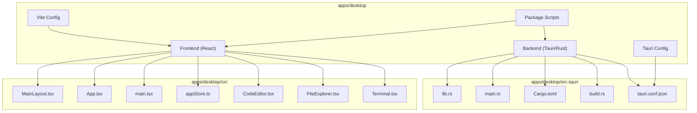
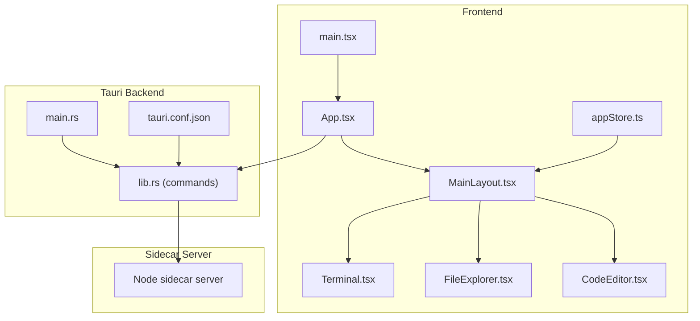
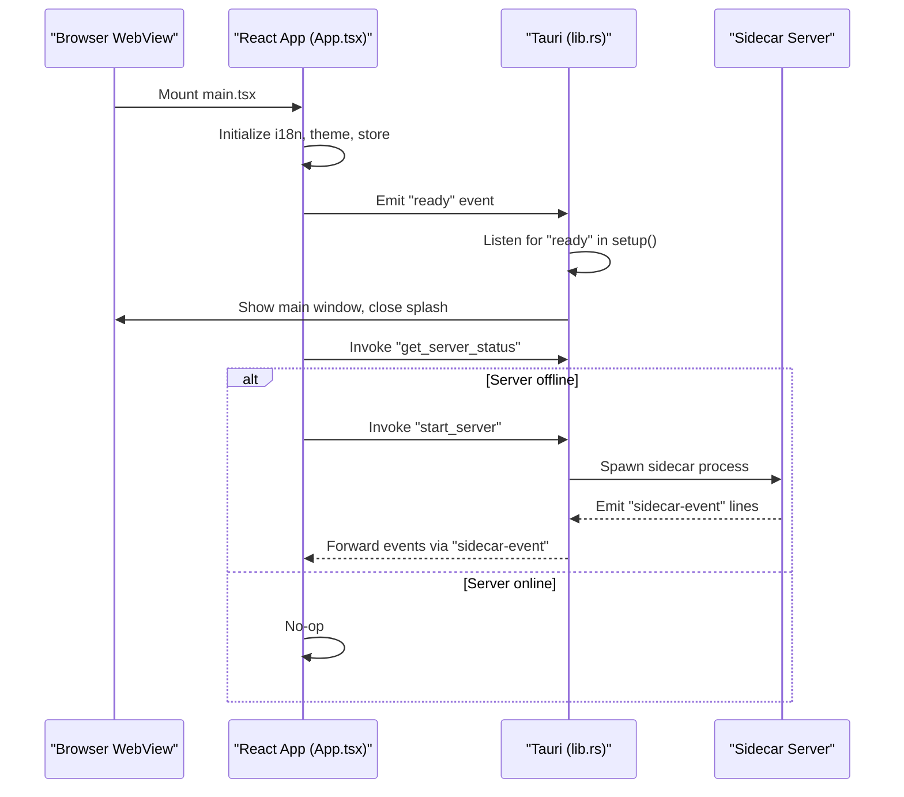
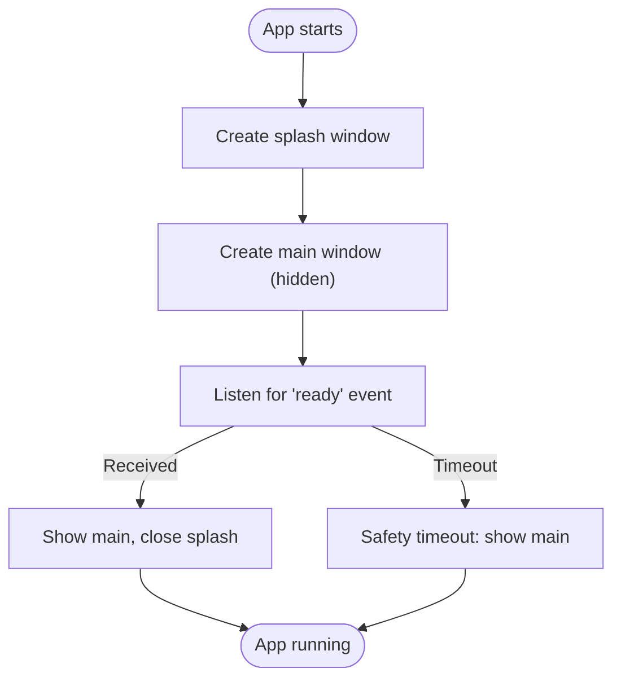
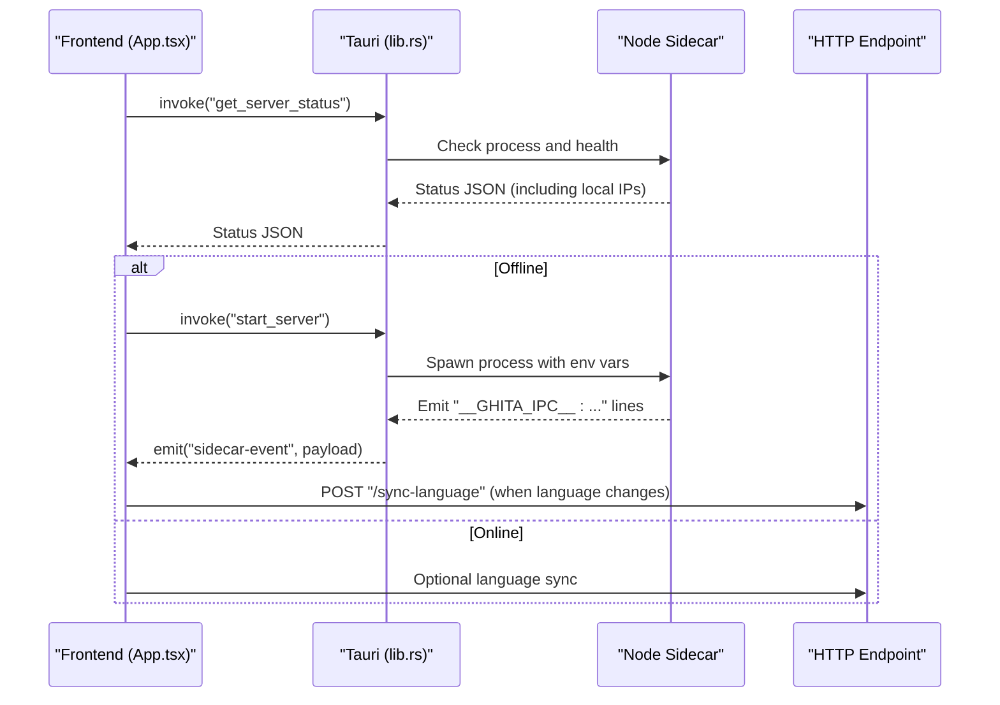
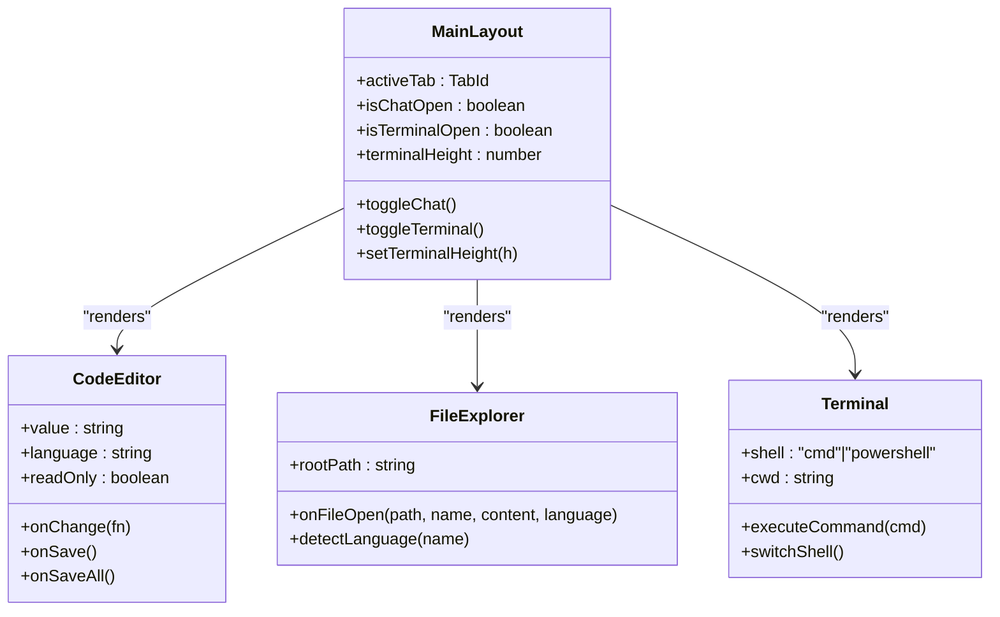
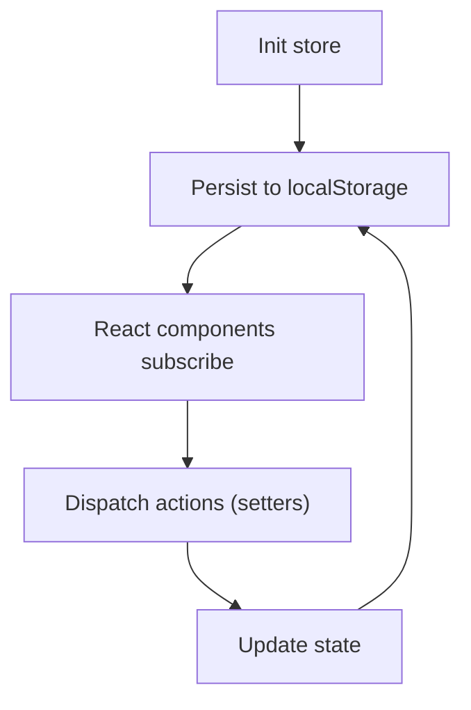
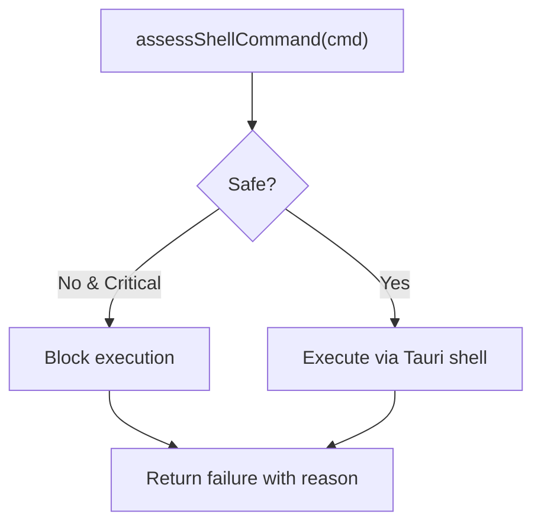
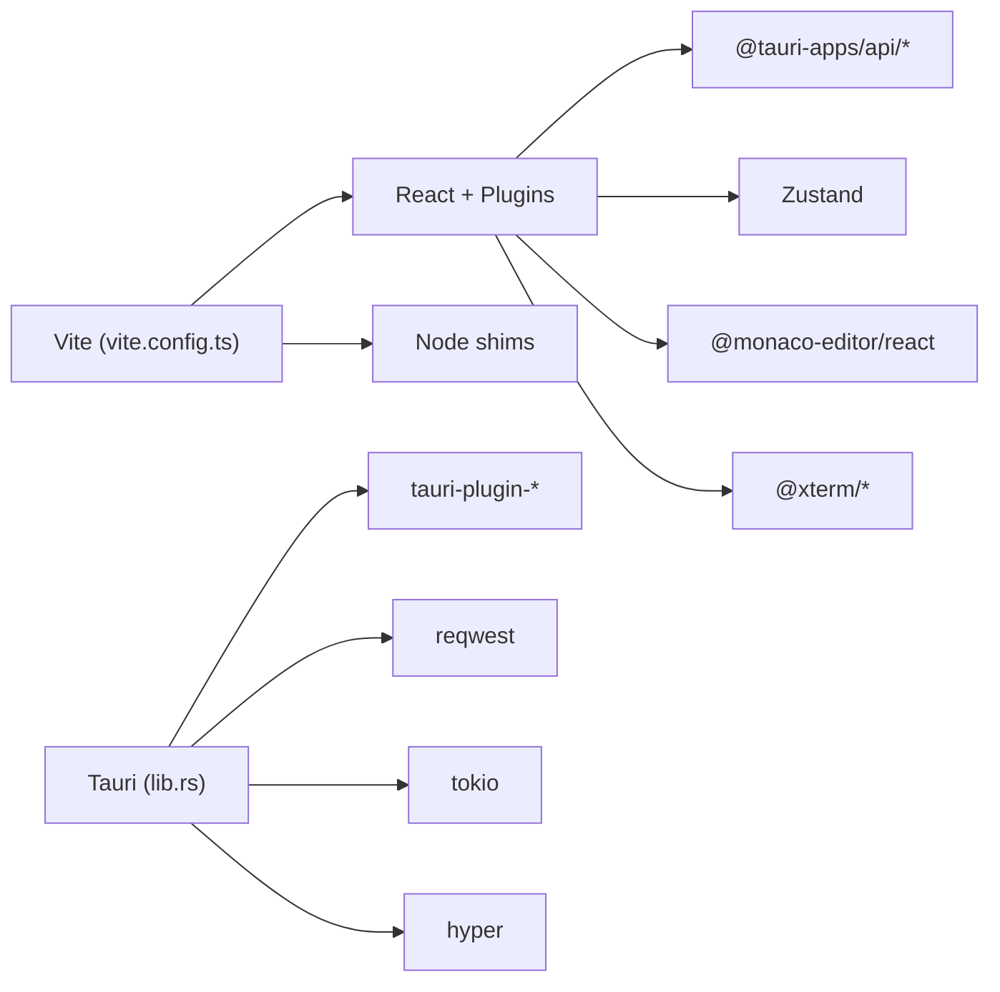

# Desktop Application Overview

<cite>
**Referenced Files in This Document**
- [App.tsx](file://apps/desktop/src/App.tsx)
- [main.tsx](file://apps/desktop/src/main.tsx)
- [MainLayout.tsx](file://apps/desktop/src/layouts/MainLayout.tsx)
- [tauri.conf.json](file://apps/desktop/src-tauri/tauri.conf.json)
- [vite.config.ts](file://apps/desktop/vite.config.ts)
- [package.json](file://apps/desktop/package.json)
- [lib.rs](file://apps/desktop/src-tauri/src/lib.rs)
- [main.rs](file://apps/desktop/src-tauri/src/main.rs)
- [Cargo.toml](file://apps/desktop/src-tauri/Cargo.toml)
- [build.rs](file://apps/desktop/src-tauri/build.rs)
- [CodeEditor.tsx](file://apps/desktop/src/components/CodeEditor.tsx)
- [FileExplorer.tsx](file://apps/desktop/src/components/FileExplorer.tsx)
- [Terminal.tsx](file://apps/desktop/src/components/Terminal.tsx)
- [appStore.ts](file://apps/desktop/src/stores/appStore.ts)
- [shell.ts](file://apps/desktop/src/utils/shell.ts)
</cite>

## Table of Contents
1. [Introduction](#introduction)
2. [Project Structure](#project-structure)
3. [Core Components](#core-components)
4. [Architecture Overview](#architecture-overview)
5. [Detailed Component Analysis](#detailed-component-analysis)
6. [Dependency Analysis](#dependency-analysis)
7. [Performance Considerations](#performance-considerations)
8. [Troubleshooting Guide](#troubleshooting-guide)
9. [Conclusion](#conclusion)
10. [Appendices](#appendices)

## Introduction
This document provides a comprehensive overview of the GHITA CODING AGENT desktop application. It explains how the Tauri 2.x + React (TypeScript) stack delivers native desktop functionality while remaining cross-platform compatible. The guide covers the application’s initialization, window management, integration with a Node-based sidecar server for AI operations, build configuration via Vite, and the monorepo structure. It also documents the desktop-specific UI features (VS Code-style code editor, multi-tab interface, integrated terminal, and file explorer), security considerations, performance optimizations, and platform-specific behaviors.

## Project Structure
The desktop application resides under apps/desktop and is organized into:
- Frontend (React + TypeScript): located under src/, including components, views, stores, and layouts.
- Backend (Rust + Tauri): located under src-tauri/, including Tauri configuration, commands, and sidecar management.
- Build and tooling: Vite configuration, package scripts, and Tauri CLI integration.

**Diagram sources**
- [MainLayout.tsx:142-347](file://apps/desktop/src/layouts/MainLayout.tsx#L142-L347)
- [App.tsx:179-187](file://apps/desktop/src/App.tsx#L179-L187)
- [main.tsx:1-16](file://apps/desktop/src/main.tsx#L1-L16)
- [appStore.ts:78-168](file://apps/desktop/src/stores/appStore.ts#L78-L168)
- [CodeEditor.tsx:1-126](file://apps/desktop/src/components/CodeEditor.tsx#L1-L126)
- [FileExplorer.tsx:1-526](file://apps/desktop/src/components/FileExplorer.tsx#L1-L526)
- [Terminal.tsx:1-366](file://apps/desktop/src/components/Terminal.tsx#L1-L366)
- [lib.rs:372-499](file://apps/desktop/src-tauri/src/lib.rs#L372-L499)
- [main.rs:1-7](file://apps/desktop/src-tauri/src/main.rs#L1-L7)
- [Cargo.toml:1-32](file://apps/desktop/src-tauri/Cargo.toml#L1-L32)
- [build.rs:1-4](file://apps/desktop/src-tauri/build.rs#L1-L4)
- [tauri.conf.json:1-73](file://apps/desktop/src-tauri/tauri.conf.json#L1-L73)

**Section sources**
- [tauri.conf.json:1-73](file://apps/desktop/src-tauri/tauri.conf.json#L1-L73)
- [vite.config.ts:1-114](file://apps/desktop/vite.config.ts#L1-L114)
- [package.json:1-61](file://apps/desktop/package.json#L1-L61)

## Core Components
- App.tsx: React root component that initializes internationalization, error boundaries, theme, and language synchronization with the sidecar server. It listens for sidecar events and triggers server startup if needed.
- main.tsx: Bootstraps the React application by rendering the root App inside a StrictMode wrapper.
- MainLayout.tsx: Provides the main UI shell with a tabbed interface, resizable terminal, collapsible right-side chat panel, and status bar. Implements per-view lazy loading and error boundaries.
- lib.rs: Defines Tauri commands for sidecar server lifecycle, status checks, LAN IP discovery, API configuration persistence, chat session storage, proxy management, and sandbox placeholders. Manages window transitions and cleanup on exit.
- main.rs: Entry point that invokes the Tauri runtime library.
- Stores: Zustand-based appStore manages UI state (tabs, terminal/chat visibility, theme/language, device connectivity, plugin state, and dashboard metrics).
- Desktop UI components:
  - CodeEditor.tsx: VS Code-like editor using Monaco with a custom dark theme and keyboard shortcuts.
  - FileExplorer.tsx: VS Code-style file tree with context menus, language detection, and safe file operations.
  - Terminal.tsx: Integrated terminal supporting cmd.exe and PowerShell with shell switching, CWD sync, and command execution via Tauri shell plugin.

**Section sources**
- [App.tsx:1-188](file://apps/desktop/src/App.tsx#L1-L188)
- [main.tsx:1-16](file://apps/desktop/src/main.tsx#L1-L16)
- [MainLayout.tsx:1-348](file://apps/desktop/src/layouts/MainLayout.tsx#L1-L348)
- [lib.rs:1-500](file://apps/desktop/src-tauri/src/lib.rs#L1-L500)
- [main.rs:1-7](file://apps/desktop/src-tauri/src/main.rs#L1-L7)
- [appStore.ts:1-169](file://apps/desktop/src/stores/appStore.ts#L1-L169)
- [CodeEditor.tsx:1-126](file://apps/desktop/src/components/CodeEditor.tsx#L1-L126)
- [FileExplorer.tsx:1-526](file://apps/desktop/src/components/FileExplorer.tsx#L1-L526)
- [Terminal.tsx:1-366](file://apps/desktop/src/components/Terminal.tsx#L1-L366)

## Architecture Overview
The desktop application follows a hybrid architecture:
- Frontend (React) renders the UI and interacts with Tauri commands for native capabilities.
- Backend (Tauri/Rust) exposes commands, manages a Node-based sidecar server, and controls windows and system resources.
- The sidecar server handles AI-related operations and communicates back to the frontend via Tauri events.

**Diagram sources**
- [App.tsx:179-187](file://apps/desktop/src/App.tsx#L179-L187)
- [main.tsx:1-16](file://apps/desktop/src/main.tsx#L1-L16)
- [MainLayout.tsx:142-347](file://apps/desktop/src/layouts/MainLayout.tsx#L142-L347)
- [CodeEditor.tsx:1-126](file://apps/desktop/src/components/CodeEditor.tsx#L1-L126)
- [FileExplorer.tsx:1-526](file://apps/desktop/src/components/FileExplorer.tsx#L1-L526)
- [Terminal.tsx:1-366](file://apps/desktop/src/components/Terminal.tsx#L1-L366)
- [lib.rs:372-499](file://apps/desktop/src-tauri/src/lib.rs#L372-L499)
- [main.rs:1-7](file://apps/desktop/src-tauri/src/main.rs#L1-L7)
- [tauri.conf.json:1-73](file://apps/desktop/src-tauri/tauri.conf.json#L1-L73)

## Detailed Component Analysis

### Application Initialization and Lifecycle
- Startup sequence:
  - main.tsx mounts the React app.
  - App.tsx sets up error boundaries, theme, and language synchronization.
  - App.tsx emits a ready event to Tauri after the first render.
  - Tauri setup listens for the ready event and transitions from splash to main window, with a safety timeout.
- Shutdown:
  - On RunEvent::Exit, Tauri terminates the sidecar process and stops proxy state.

**Diagram sources**
- [main.tsx:1-16](file://apps/desktop/src/main.tsx#L1-L16)
- [App.tsx:20-92](file://apps/desktop/src/App.tsx#L20-L92)
- [lib.rs:408-478](file://apps/desktop/src-tauri/src/lib.rs#L408-L478)

**Section sources**
- [main.tsx:1-16](file://apps/desktop/src/main.tsx#L1-L16)
- [App.tsx:1-188](file://apps/desktop/src/App.tsx#L1-L188)
- [lib.rs:408-499](file://apps/desktop/src-tauri/src/lib.rs#L408-L499)

### Window Management
- Two windows are defined: main and splash.
- The splash window is transparent and centered; the main window is initially hidden and shown upon receiving the ready event or after a safety timeout.
- CSP restricts content sources for security.

**Diagram sources**
- [tauri.conf.json:14-38](file://apps/desktop/src-tauri/tauri.conf.json#L14-L38)
- [lib.rs:408-478](file://apps/desktop/src-tauri/src/lib.rs#L408-L478)

**Section sources**
- [tauri.conf.json:14-42](file://apps/desktop/src-tauri/tauri.conf.json#L14-L42)
- [lib.rs:408-478](file://apps/desktop/src-tauri/src/lib.rs#L408-L478)

### Sidecar Server Integration
- Tauri commands manage the sidecar lifecycle:
  - start_server: spawns Node-based server from multiple candidate paths, injects environment variables, and streams IPC lines to the frontend.
  - get_server_status: checks process health and local IPs.
  - stop_server: terminates the sidecar gracefully.
- Frontend:
  - On startup, checks server status and auto-starts if needed.
  - Listens to sidecar-event and updates UI state accordingly.
  - Synchronizes language with the sidecar via HTTP.

**Diagram sources**
- [App.tsx:71-92](file://apps/desktop/src/App.tsx#L71-L92)
- [lib.rs:41-235](file://apps/desktop/src-tauri/src/lib.rs#L41-L235)

**Section sources**
- [App.tsx:49-168](file://apps/desktop/src/App.tsx#L49-L168)
- [lib.rs:41-235](file://apps/desktop/src-tauri/src/lib.rs#L41-L235)

### Desktop UI Features
- VS Code-style code editor:
  - Uses Monaco with a custom dark theme and keyboard shortcuts (Ctrl+S, Shift+Ctrl+S).
- Multi-tab interface:
  - MainLayout renders only the active tab and lazily loads views.
- Integrated terminal:
  - Supports cmd.exe and PowerShell, with shell switching, CWD resolution, and command execution via Tauri shell plugin.
- File explorer:
  - VS Code-style sidebar with context menus, language detection, and safe file operations.

**Diagram sources**
- [MainLayout.tsx:142-347](file://apps/desktop/src/layouts/MainLayout.tsx#L142-L347)
- [CodeEditor.tsx:1-126](file://apps/desktop/src/components/CodeEditor.tsx#L1-L126)
- [FileExplorer.tsx:1-526](file://apps/desktop/src/components/FileExplorer.tsx#L1-L526)
- [Terminal.tsx:1-366](file://apps/desktop/src/components/Terminal.tsx#L1-L366)

**Section sources**
- [MainLayout.tsx:112-140](file://apps/desktop/src/layouts/MainLayout.tsx#L112-L140)
- [CodeEditor.tsx:18-76](file://apps/desktop/src/components/CodeEditor.tsx#L18-L76)
- [FileExplorer.tsx:121-220](file://apps/desktop/src/components/FileExplorer.tsx#L121-L220)
- [Terminal.tsx:65-127](file://apps/desktop/src/components/Terminal.tsx#L65-L127)

### State Management and Stores
- Zustand appStore centralizes UI state:
  - Tabs, sidebar, terminal/chat panels, theme/language, device connectivity, plugin state, and dashboard metrics.
  - Persisted to localStorage with selective state serialization.

**Diagram sources**
- [appStore.ts:78-168](file://apps/desktop/src/stores/appStore.ts#L78-L168)

**Section sources**
- [appStore.ts:1-169](file://apps/desktop/src/stores/appStore.ts#L1-L169)

### Security Considerations
- Tauri CSP restricts script, image, and connect sources to trusted origins.
- Shell execution utility scans commands for malicious patterns and blocks critical threats.
- FileExplorer avoids binary file editing and sanitizes paths to prevent traversal issues.

**Diagram sources**
- [shell.ts:90-148](file://apps/desktop/src/utils/shell.ts#L90-L148)

**Section sources**
- [tauri.conf.json:40-41](file://apps/desktop/src-tauri/tauri.conf.json#L40-L41)
- [shell.ts:28-107](file://apps/desktop/src/utils/shell.ts#L28-L107)
- [FileExplorer.tsx:296-329](file://apps/desktop/src/components/FileExplorer.tsx#L296-L329)

## Dependency Analysis
- Frontend dependencies include React, Zustand, Monaco Editor, Xterm, and Tauri plugins for shell, fs, and dialog.
- Vite aliases Node built-ins to shims to avoid bundling conflicts in the Tauri context.
- Tauri dependencies include reqwest, local-ip-address, hyper, tokio, and tauri plugins.

**Diagram sources**
- [vite.config.ts:11-114](file://apps/desktop/vite.config.ts#L11-L114)
- [package.json:17-42](file://apps/desktop/package.json#L17-L42)
- [Cargo.toml:15-32](file://apps/desktop/src-tauri/Cargo.toml#L15-L32)

**Section sources**
- [vite.config.ts:14-92](file://apps/desktop/vite.config.ts#L14-L92)
- [package.json:17-42](file://apps/desktop/package.json#L17-L42)
- [Cargo.toml:15-32](file://apps/desktop/src-tauri/Cargo.toml#L15-L32)

## Performance Considerations
- Vite pre-bundles heavy dependencies to avoid mid-session reloads in the WebView.
- Chunk splitting separates vendor bundles for React, Tauri APIs, state management, and sockets.
- MainLayout renders only the active tab and suspenses inactive views to reduce background work.
- Terminal caps history length to limit memory growth.
- Monaco editor is memoized to prevent double-mounts in StrictMode.

[No sources needed since this section provides general guidance]

## Troubleshooting Guide
- Sidecar not starting:
  - Verify sidecar script paths and environment variables injected by Tauri.
  - Check stdout streaming and emitted sidecar-event messages.
- Language sync failures:
  - Confirm HTTP endpoint availability and CORS settings.
- Terminal execution issues:
  - Validate shell selection and CWD resolution logic.
- CSP violations:
  - Review tauri.conf.json CSP and adjust connect-src for required endpoints.

**Section sources**
- [lib.rs:118-149](file://apps/desktop/src-tauri/src/lib.rs#L118-L149)
- [App.tsx:56-67](file://apps/desktop/src/App.tsx#L56-L67)
- [Terminal.tsx:129-237](file://apps/desktop/src/components/Terminal.tsx#L129-L237)
- [tauri.conf.json:40-41](file://apps/desktop/src-tauri/tauri.conf.json#L40-L41)

## Conclusion
The GHITA CODING AGENT desktop application combines a modern React frontend with a robust Tauri/Rust backend to deliver a native, cross-platform experience. Its architecture centers on a clear separation of concerns: the frontend focuses on UI and user interactions, while Tauri exposes native capabilities and manages the sidecar server for AI operations. The application emphasizes security (CSP, shell scanning), performance (pre-bundling, lazy loading, chunking), and usability (VS Code-style editor, terminal, file explorer). Together, these elements provide a cohesive development environment tailored for AI-assisted coding workflows.

## Appendices
- Build configuration:
  - Vite targets Chrome or Safari depending on platform and disables screen clearing to preserve Rust error visibility.
  - Tauri CLI integration is configured via package scripts.
- Monorepo integration:
  - Workspace dependencies are referenced for shared packages.

**Section sources**
- [vite.config.ts:47-111](file://apps/desktop/vite.config.ts#L47-L111)
- [package.json:7-16](file://apps/desktop/package.json#L7-L16)
- [Cargo.toml:1-10](file://apps/desktop/src-tauri/Cargo.toml#L1-L10)