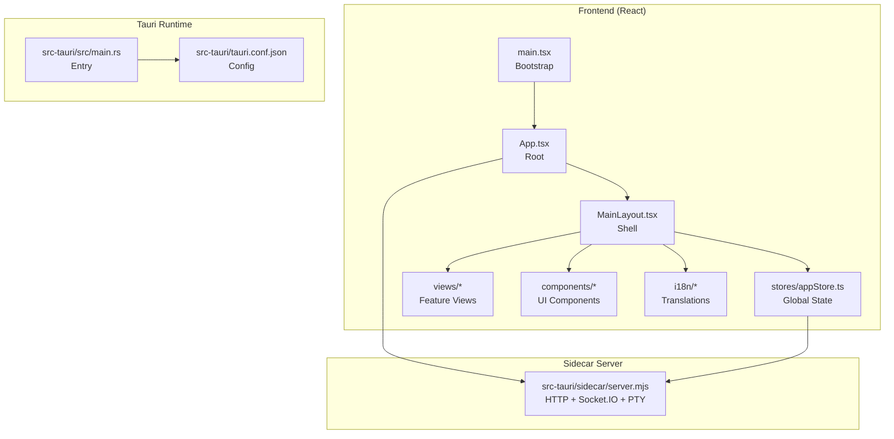
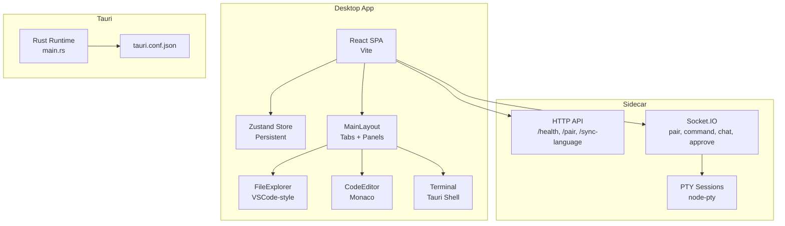
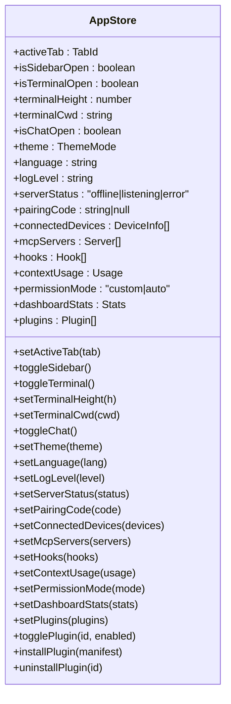
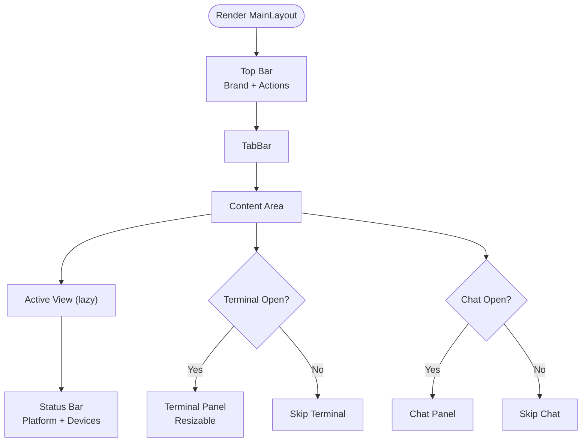
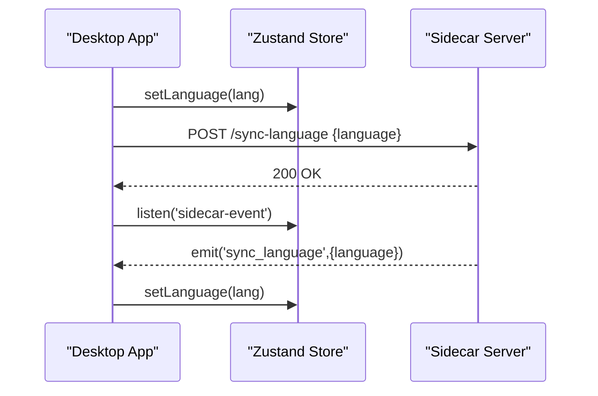
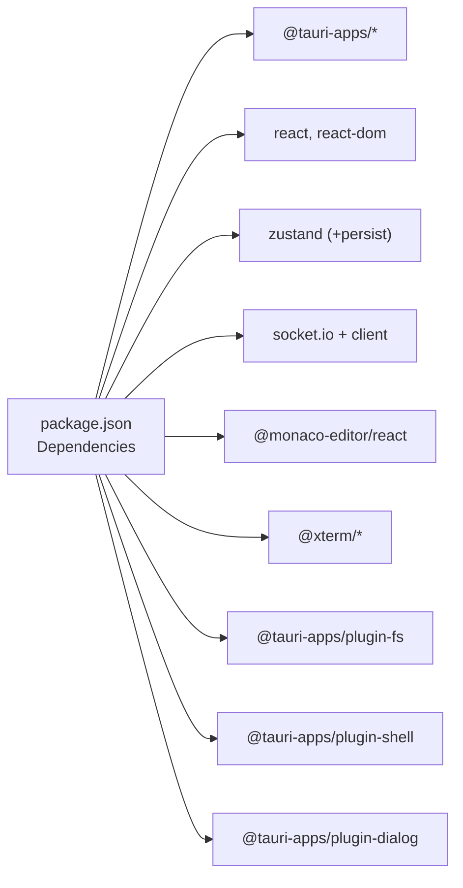
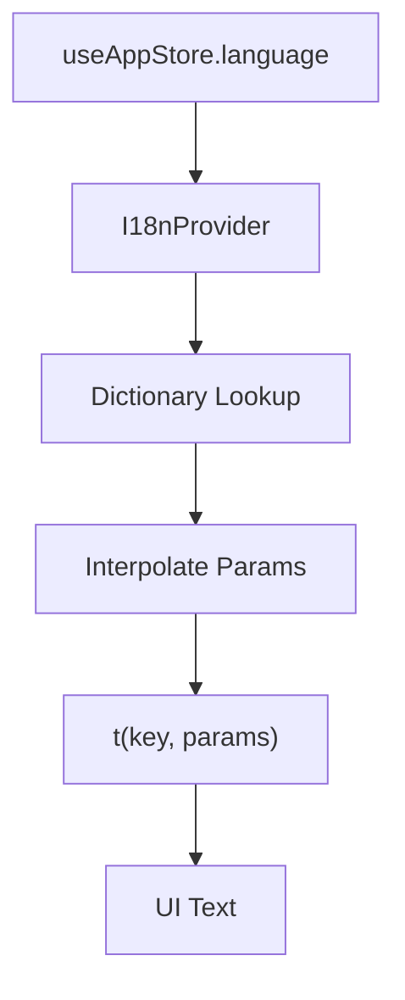

# Desktop Application

<cite>
**Referenced Files in This Document**
- [App.tsx](file://apps/desktop/src/App.tsx)
- [main.tsx](file://apps/desktop/src/main.tsx)
- [MainLayout.tsx](file://apps/desktop/src/layouts/MainLayout.tsx)
- [appStore.ts](file://apps/desktop/src/stores/appStore.ts)
- [context.tsx](file://apps/desktop/src/i18n/context.tsx)
- [en.ts](file://apps/desktop/src/i18n/en.ts)
- [vite.config.ts](file://apps/desktop/vite.config.ts)
- [tauri.conf.json](file://apps/desktop/src-tauri/tauri.conf.json)
- [server.mjs](file://apps/desktop/src-tauri/sidecar/server.mjs)
- [CodeEditor.tsx](file://apps/desktop/src/components/CodeEditor.tsx)
- [FileExplorer.tsx](file://apps/desktop/src/components/FileExplorer.tsx)
- [CodeView.tsx](file://apps/desktop/src/views/CodeView.tsx)
- [Terminal.tsx](file://apps/desktop/src/components/Terminal.tsx)
- [shell.ts](file://apps/desktop/src/utils/shell.ts)
- [main.rs](file://apps/desktop/src-tauri/src/main.rs)
- [package.json](file://apps/desktop/package.json)
</cite>

## Table of Contents
1. [Introduction](#introduction)
2. [Project Structure](#project-structure)
3. [Core Components](#core-components)
4. [Architecture Overview](#architecture-overview)
5. [Detailed Component Analysis](#detailed-component-analysis)
6. [Dependency Analysis](#dependency-analysis)
7. [Performance Considerations](#performance-considerations)
8. [Security Considerations](#security-considerations)
9. [Internationalization System](#internationalization-system)
10. [Build and Packaging Configuration](#build-and-packaging-configuration)
11. [Desktop Features and UX](#desktop-features-and-ux)
12. [Troubleshooting Guide](#troubleshooting-guide)
13. [Conclusion](#conclusion)

## Introduction
This document explains the GHITA CODING AGENT desktop application built with Tauri 2.x and React (TypeScript). It describes how the application achieves native desktop functionality while maintaining cross-platform compatibility, outlines the main application structure, state management, layout system, internationalization, and the integration with the sidecar server for AI and device communication. It also covers desktop-specific features such as the VS Code-style code editor, multi-tab interface, integrated terminal, and file explorer, along with security considerations, performance optimizations, and platform-specific features.

## Project Structure
The desktop application resides under apps/desktop and is organized into:
- Frontend (React + TypeScript): src/App.tsx and src/main.tsx serve as the entry points; src/layouts/MainLayout.tsx defines the primary UI shell; src/stores/appStore.ts manages global state; src/views and src/components implement feature areas and reusable UI.
- Internationalization: src/i18n provides a lightweight i18n context and translation dictionaries.
- Build and packaging: vite.config.ts configures Vite; src-tauri/tauri.conf.json configures Tauri; sidecar server runs under src-tauri/sidecar/server.mjs.
- Native integrations: @tauri-apps plugins are used for shell, filesystem, and dialogs.

**Diagram sources**
- [main.tsx:1-16](file://apps/desktop/src/main.tsx#L1-L16)
- [App.tsx:1-188](file://apps/desktop/src/App.tsx#L1-L188)
- [MainLayout.tsx:1-348](file://apps/desktop/src/layouts/MainLayout.tsx#L1-L348)
- [appStore.ts:1-169](file://apps/desktop/src/stores/appStore.ts#L1-L169)
- [context.tsx:1-69](file://apps/desktop/src/i18n/context.tsx#L1-L69)
- [main.rs:1-7](file://apps/desktop/src-tauri/src/main.rs#L1-L7)
- [tauri.conf.json:1-73](file://apps/desktop/src-tauri/tauri.conf.json#L1-L73)
- [server.mjs:1-2099](file://apps/desktop/src-tauri/sidecar/server.mjs#L1-L2099)

**Section sources**
- [main.tsx:1-16](file://apps/desktop/src/main.tsx#L1-L16)
- [App.tsx:1-188](file://apps/desktop/src/App.tsx#L1-L188)
- [MainLayout.tsx:1-348](file://apps/desktop/src/layouts/MainLayout.tsx#L1-L348)
- [appStore.ts:1-169](file://apps/desktop/src/stores/appStore.ts#L1-L169)
- [context.tsx:1-69](file://apps/desktop/src/i18n/context.tsx#L1-L69)
- [tauri.conf.json:1-73](file://apps/desktop/src-tauri/tauri.conf.json#L1-L73)
- [server.mjs:1-2099](file://apps/desktop/src-tauri/sidecar/server.mjs#L1-L2099)

## Core Components
- App.tsx: Root component that sets up the i18n provider, error boundary, theme synchronization, sidecar server lifecycle, and event listeners for device communication.
- main.tsx: React root bootstrapping with StrictMode and mounting App.
- MainLayout.tsx: Central layout with top bar, tab bar, active view rendering, resizable terminal, and collapsible chat panel.
- appStore.ts: Zustand store with persistence for theme, language, tabs, terminal/chat visibility, server status, device lists, and plugin management.
- i18n context: Lightweight dictionary-based translation provider with parameter interpolation and fallback behavior.

**Section sources**
- [App.tsx:1-188](file://apps/desktop/src/App.tsx#L1-L188)
- [main.tsx:1-16](file://apps/desktop/src/main.tsx#L1-L16)
- [MainLayout.tsx:1-348](file://apps/desktop/src/layouts/MainLayout.tsx#L1-L348)
- [appStore.ts:1-169](file://apps/desktop/src/stores/appStore.ts#L1-L169)
- [context.tsx:1-69](file://apps/desktop/src/i18n/context.tsx#L1-L69)

## Architecture Overview
The desktop app uses Tauri 2.x to embed a web runtime (Chromium on Windows, WebKit on macOS/Linux) and exposes native APIs via plugins. The frontend is a React SPA built with Vite. A Node-based sidecar server runs locally to manage device pairing, Socket.IO communication, PTY terminals, and AI-related orchestration. The sidecar is reachable via localhost HTTP and WebSocket endpoints and can be controlled from the desktop app.

**Diagram sources**
- [App.tsx:45-92](file://apps/desktop/src/App.tsx#L45-L92)
- [MainLayout.tsx:142-348](file://apps/desktop/src/layouts/MainLayout.tsx#L142-L348)
- [FileExplorer.tsx:121-200](file://apps/desktop/src/components/FileExplorer.tsx#L121-L200)
- [CodeEditor.tsx:1-126](file://apps/desktop/src/components/CodeEditor.tsx#L1-L126)
- [Terminal.tsx:65-200](file://apps/desktop/src/components/Terminal.tsx#L65-L200)
- [main.rs:1-7](file://apps/desktop/src-tauri/src/main.rs#L1-L7)
- [tauri.conf.json:1-73](file://apps/desktop/src-tauri/tauri.conf.json#L1-L73)
- [server.mjs:418-562](file://apps/desktop/src-tauri/sidecar/server.mjs#L418-L562)

## Detailed Component Analysis

### State Management with Zustand and Persistence
The global state is managed by a single Zustand store with persistence to localStorage. It controls:
- Tabs and active view
- Sidebar and panels (terminal/chat)
- Theme, language, log level
- Server status and device lists
- Plugins and permission modes
- MCP servers and hooks
- Dashboard statistics and context usage

**Diagram sources**
- [appStore.ts:13-76](file://apps/desktop/src/stores/appStore.ts#L13-L76)

**Section sources**
- [appStore.ts:1-169](file://apps/desktop/src/stores/appStore.ts#L1-L169)

### Layout System and Navigation
MainLayout orchestrates the application shell:
- Top bar with branding and quick toggles for terminal and chat
- TabBar for switching views
- Active view rendering with Suspense and error boundaries
- Resizable terminal panel with drag handle
- Right-side chat panel with lazy loading
- Status bar showing platform, device count, and server status

**Diagram sources**
- [MainLayout.tsx:142-348](file://apps/desktop/src/layouts/MainLayout.tsx#L142-L348)

**Section sources**
- [MainLayout.tsx:1-348](file://apps/desktop/src/layouts/MainLayout.tsx#L1-L348)

### Sidecar Server Integration
The desktop app communicates with a Node-based sidecar server that:
- Exposes HTTP endpoints for health, pairing, and language sync
- Runs a Socket.IO server for device pairing and live events
- Manages PTY sessions for the integrated terminal
- Lazily loads heavy modules to reduce startup time
- Enforces loopback-only access for sensitive endpoints

**Diagram sources**
- [App.tsx:49-69](file://apps/desktop/src/App.tsx#L49-L69)
- [server.mjs:483-518](file://apps/desktop/src-tauri/sidecar/server.mjs#L483-L518)

**Section sources**
- [App.tsx:49-69](file://apps/desktop/src/App.tsx#L49-L69)
- [server.mjs:418-562](file://apps/desktop/src-tauri/sidecar/server.mjs#L418-L562)

### Desktop-Specific Features

#### VS Code-Style Code Editor
- Monaco Editor with a custom dark theme optimized for GHITA
- Keyboard shortcuts for save/save-all
- Loading state and responsive options

**Section sources**
- [CodeEditor.tsx:1-126](file://apps/desktop/src/components/CodeEditor.tsx#L1-L126)

#### Multi-Tab Code Editing
- Open files tracked with modification state
- Save/save-all with robust error handling
- Tab closing with unsaved changes confirmation
- Keyboard shortcuts (Ctrl+S, Ctrl+Shift+S, Ctrl+W)

**Section sources**
- [CodeView.tsx:25-200](file://apps/desktop/src/views/CodeView.tsx#L25-L200)

#### Integrated Terminal
- Dual shell support (cmd.exe and PowerShell)
- Path resolution and current working directory sync
- History capping and auto-scroll
- Shell switching and internal cd handling

**Section sources**
- [Terminal.tsx:65-200](file://apps/desktop/src/components/Terminal.tsx#L65-L200)

#### File Explorer
- VS Code-style sidebar with expand/collapse
- Language detection by extension
- Binary file protection and context menu
- Real filesystem operations via Tauri FS plugin

**Section sources**
- [FileExplorer.tsx:121-200](file://apps/desktop/src/components/FileExplorer.tsx#L121-L200)

## Dependency Analysis
The desktop app relies on:
- Tauri 2.x with @tauri-apps plugins for shell, filesystem, and dialogs
- React 18 with Suspense and lazy loading for views
- Zustand for global state with persistence
- Socket.IO for device communication
- Monaco Editor for code editing
- Xterm for terminal rendering

**Diagram sources**
- [package.json:17-43](file://apps/desktop/package.json#L17-L43)

**Section sources**
- [package.json:1-61](file://apps/desktop/package.json#L1-L61)

## Performance Considerations
- Vite pre-bundling and manual chunks separate vendor libraries to minimize WebView reloads during development.
- Lazy loading of views and components reduces initial bundle size.
- Zustand persistence limits serialized state to essential keys.
- Terminal history capped to prevent memory growth.
- Sidecar lazy-loads heavy modules and PTY native addon to accelerate startup.

**Section sources**
- [vite.config.ts:62-112](file://apps/desktop/vite.config.ts#L62-L112)
- [appStore.ts:154-167](file://apps/desktop/src/stores/appStore.ts#L154-L167)
- [Terminal.tsx:111-118](file://apps/desktop/src/components/Terminal.tsx#L111-L118)
- [server.mjs:17-69](file://apps/desktop/src-tauri/sidecar/server.mjs#L17-L69)

## Security Considerations
- Sidecar restricts HTTP endpoints to loopback addresses and validates origins for Socket.IO.
- Shell command execution is scanned for malicious patterns; critical threats are blocked.
- CSP in tauri.conf.json restricts resources and connections to trusted sources.
- Pairing codes expire and are regenerated periodically; approvals require explicit confirmation.

**Section sources**
- [server.mjs:101-121](file://apps/desktop/src-tauri/sidecar/server.mjs#L101-L121)
- [shell.ts:90-107](file://apps/desktop/src/utils/shell.ts#L90-L107)
- [tauri.conf.json:39-41](file://apps/desktop/src-tauri/tauri.conf.json#L39-L41)

## Internationalization System
The i18n system provides:
- A lightweight dictionary-based translation function with parameter interpolation
- Context provider that selects language from the global store
- Fallback behavior to raw keys with placeholder substitution
- Translation keys defined in language files (e.g., English)

**Diagram sources**
- [context.tsx:33-68](file://apps/desktop/src/i18n/context.tsx#L33-L68)
- [en.ts:7-200](file://apps/desktop/src/i18n/en.ts#L7-L200)

**Section sources**
- [context.tsx:1-69](file://apps/desktop/src/i18n/context.tsx#L1-L69)
- [en.ts:1-200](file://apps/desktop/src/i18n/en.ts#L1-L200)

## Build and Packaging Configuration
- Vite configuration:
  - Aliased Node built-ins to shims for web compatibility
  - Fixed dev server port and strict port enforcement
  - Pre-bundled vendor chunks for faster WebView loads
  - Manual chunks for React, Tauri, state, and sockets
- Tauri configuration:
  - Dev URL points to Vite dev server
  - Windows and splash window definitions
  - CSP restricting resource and connect sources
  - Updater endpoint and public key

**Section sources**
- [vite.config.ts:1-114](file://apps/desktop/vite.config.ts#L1-L114)
- [tauri.conf.json:1-73](file://apps/desktop/src-tauri/tauri.conf.json#L1-L73)

## Desktop Features and UX
- Native shell integration for terminal commands with platform-aware selection
- File operations via Tauri FS plugin with safe defaults and error reporting
- Toast notifications for device events and actions
- Theme synchronization via data attributes on document root
- Responsive layout with draggable terminal resizing and collapsible panels

**Section sources**
- [Terminal.tsx:65-200](file://apps/desktop/src/components/Terminal.tsx#L65-L200)
- [FileExplorer.tsx:121-200](file://apps/desktop/src/components/FileExplorer.tsx#L121-L200)
- [App.tsx:36-48](file://apps/desktop/src/App.tsx#L36-L48)

## Troubleshooting Guide
- Sidecar not responding:
  - Verify server status via the store and ensure the desktop app invoked the start command on startup.
  - Check loopback-only endpoints and CORS policies.
- Terminal not starting:
  - Confirm shell availability and path resolution; ensure cwd is valid.
- File operations failing:
  - Review Tauri FS permissions and path correctness.
- Language sync issues:
  - Confirm /sync-language endpoint is called and sidecar emits sidecar-event with sync_language.

**Section sources**
- [App.tsx:71-92](file://apps/desktop/src/App.tsx#L71-L92)
- [server.mjs:483-518](file://apps/desktop/src-tauri/sidecar/server.mjs#L483-L518)
- [Terminal.tsx:129-200](file://apps/desktop/src/components/Terminal.tsx#L129-L200)
- [FileExplorer.tsx:121-200](file://apps/desktop/src/components/FileExplorer.tsx#L121-L200)

## Conclusion
GHITA CODING AGENT delivers a modern, cross-platform desktop experience by combining Tauri 2.x with a React SPA. The architecture leverages a centralized Zustand store, a flexible layout system, and a powerful sidecar server for AI and device operations. Desktop-specific features like Monaco-based editing, a multi-tab interface, integrated terminal, and file explorer provide a productivity-focused environment. Security and performance are addressed through CSP, loopback restrictions, shell scanning, and strategic lazy-loading and chunking.