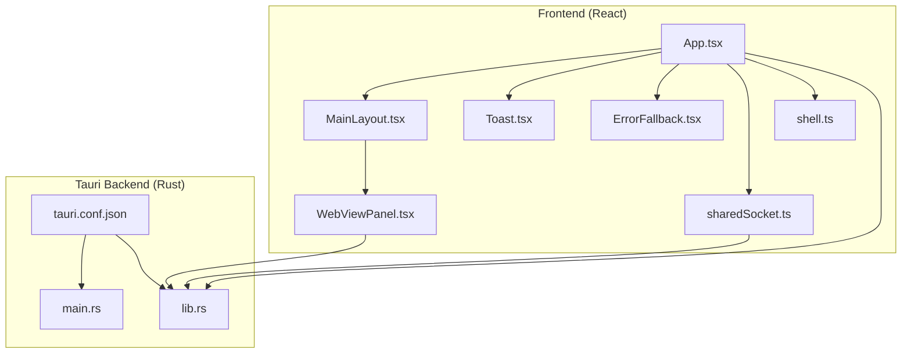
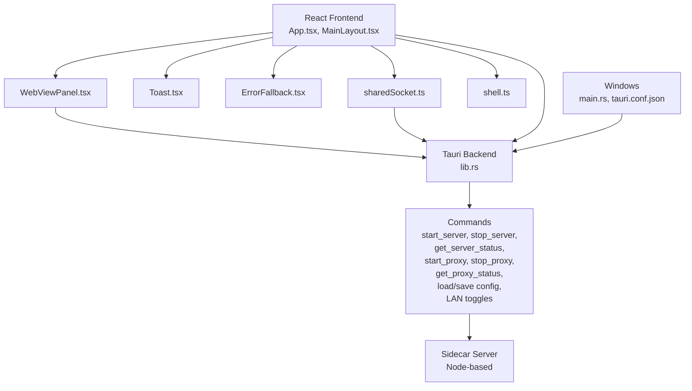
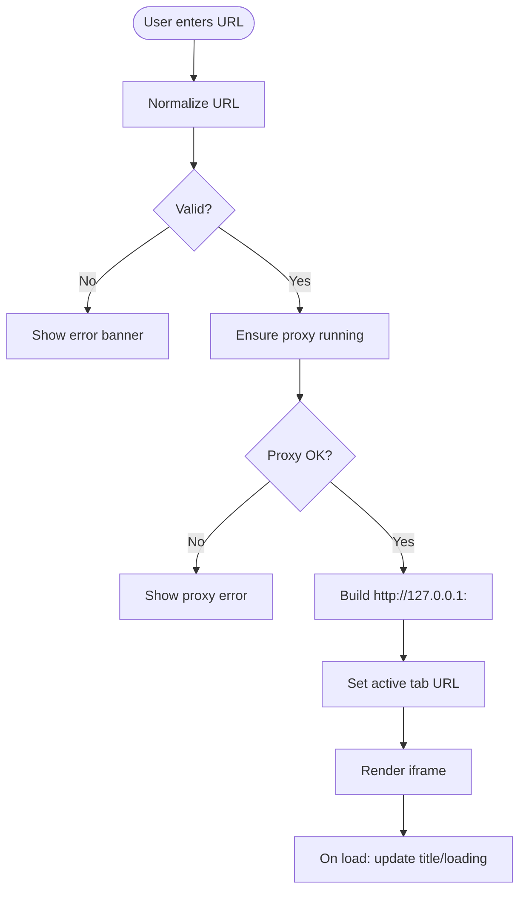
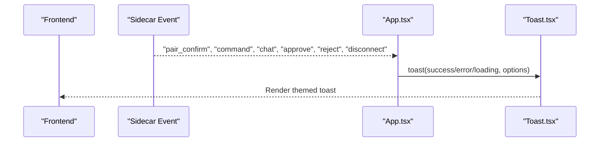
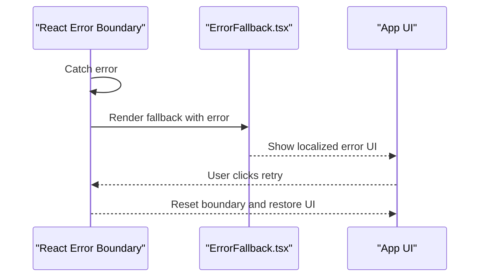
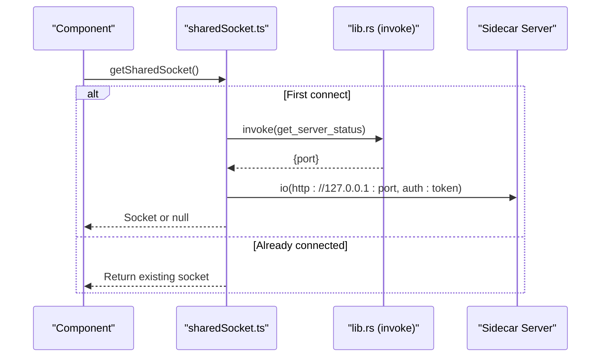
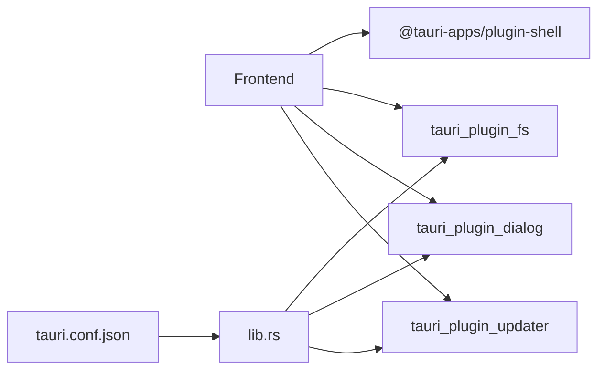
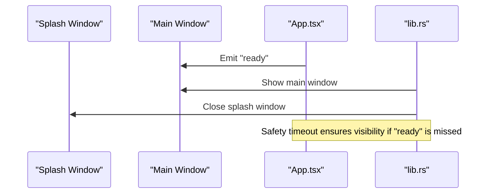
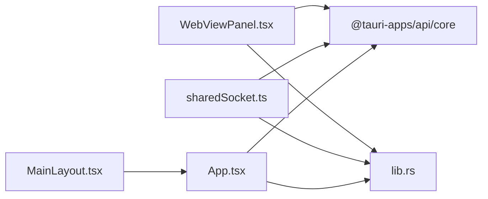

# Desktop-Specific Features

<cite>
**Referenced Files in This Document**
- [WebViewPanel.tsx](file://apps/desktop/src/components/WebViewPanel.tsx)
- [Toast.tsx](file://apps/desktop/src/components/Toast.tsx)
- [ErrorFallback.tsx](file://apps/desktop/src/components/ErrorFallback.tsx)
- [sharedSocket.ts](file://apps/desktop/src/utils/sharedSocket.ts)
- [shell.ts](file://apps/desktop/src/utils/shell.ts)
- [MainLayout.tsx](file://apps/desktop/src/layouts/MainLayout.tsx)
- [App.tsx](file://apps/desktop/src/App.tsx)
- [main.rs](file://apps/desktop/src-tauri/src/main.rs)
- [lib.rs](file://apps/desktop/src-tauri/src/lib.rs)
- [tauri.conf.json](file://apps/desktop/src-tauri/tauri.conf.json)
</cite>

## Table of Contents
1. [Introduction](#introduction)
2. [Project Structure](#project-structure)
3. [Core Components](#core-components)
4. [Architecture Overview](#architecture-overview)
5. [Detailed Component Analysis](#detailed-component-analysis)
6. [Dependency Analysis](#dependency-analysis)
7. [Performance Considerations](#performance-considerations)
8. [Troubleshooting Guide](#troubleshooting-guide)
9. [Conclusion](#conclusion)

## Introduction
This document explains the desktop application’s specialized features and utilities, focusing on:
- Embedding web content via WebViewPanel.tsx and its integration with the main interface
- Toast notification system and user feedback mechanisms
- Error boundary handling with ErrorFallback.tsx
- Real-time communication via sharedSocket.ts and the sidecar server
- Desktop-specific integrations including file system access, shell execution, and native OS features
- Platform-specific capabilities leveraging Tauri
- External tool integration, system notifications, and desktop environment features

## Project Structure
The desktop application is a Tauri-based React application with a Rust backend. Key areas:
- Frontend React components under apps/desktop/src
- Utilities for sockets and shell under apps/desktop/src/utils
- Tauri configuration and backend under apps/desktop/src-tauri

**Diagram sources**
- [App.tsx:1-188](file://apps/desktop/src/App.tsx#L1-L188)
- [MainLayout.tsx:1-348](file://apps/desktop/src/layouts/MainLayout.tsx#L1-L348)
- [WebViewPanel.tsx:1-537](file://apps/desktop/src/components/WebViewPanel.tsx#L1-L537)
- [Toast.tsx:1-49](file://apps/desktop/src/components/Toast.tsx#L1-L49)
- [ErrorFallback.tsx:1-74](file://apps/desktop/src/components/ErrorFallback.tsx#L1-L74)
- [sharedSocket.ts:1-88](file://apps/desktop/src/utils/sharedSocket.ts#L1-L88)
- [shell.ts:1-159](file://apps/desktop/src/utils/shell.ts#L1-L159)
- [main.rs:1-7](file://apps/desktop/src-tauri/src/main.rs#L1-L7)
- [lib.rs:1-500](file://apps/desktop/src-tauri/src/lib.rs#L1-L500)
- [tauri.conf.json:1-73](file://apps/desktop/src-tauri/tauri.conf.json#L1-L73)

**Section sources**
- [tauri.conf.json:1-73](file://apps/desktop/src-tauri/tauri.conf.json#L1-L73)
- [main.rs:1-7](file://apps/desktop/src-tauri/src/main.rs#L1-L7)
- [lib.rs:372-500](file://apps/desktop/src-tauri/src/lib.rs#L372-L500)

## Core Components
- WebViewPanel.tsx: A custom embedded browser with tab management, address bar, proxy integration, and loading states
- Toast.tsx: A themed notification wrapper using react-hot-toast
- ErrorFallback.tsx: A localized error boundary fallback UI
- sharedSocket.ts: A singleton socket.io client for the sidecar server with deduplication and timeouts
- shell.ts: A secure shell command executor with malicious pattern detection
- App.tsx and MainLayout.tsx: Application bootstrap, error boundaries, sidecar event handling, and layout orchestration

**Section sources**
- [WebViewPanel.tsx:1-537](file://apps/desktop/src/components/WebViewPanel.tsx#L1-L537)
- [Toast.tsx:1-49](file://apps/desktop/src/components/Toast.tsx#L1-L49)
- [ErrorFallback.tsx:1-74](file://apps/desktop/src/components/ErrorFallback.tsx#L1-L74)
- [sharedSocket.ts:1-88](file://apps/desktop/src/utils/sharedSocket.ts#L1-L88)
- [shell.ts:1-159](file://apps/desktop/src/utils/shell.ts#L1-L159)
- [App.tsx:1-188](file://apps/desktop/src/App.tsx#L1-L188)
- [MainLayout.tsx:1-348](file://apps/desktop/src/layouts/MainLayout.tsx#L1-L348)

## Architecture Overview
The desktop app uses Tauri to host a React UI with a Rust backend. The backend exposes commands for:
- Sidecar server lifecycle and status
- Proxy server control
- Local IP discovery
- Persistent storage APIs
- Updater plugin

Frontend components communicate with the backend via @tauri-apps/api/core invoke and event listeners. Real-time communication with the sidecar server uses socket.io through a shared singleton.

**Diagram sources**
- [App.tsx:1-188](file://apps/desktop/src/App.tsx#L1-L188)
- [MainLayout.tsx:1-348](file://apps/desktop/src/layouts/MainLayout.tsx#L1-L348)
- [WebViewPanel.tsx:1-537](file://apps/desktop/src/components/WebViewPanel.tsx#L1-L537)
- [Toast.tsx:1-49](file://apps/desktop/src/components/Toast.tsx#L1-L49)
- [ErrorFallback.tsx:1-74](file://apps/desktop/src/components/ErrorFallback.tsx#L1-L74)
- [sharedSocket.ts:1-88](file://apps/desktop/src/utils/sharedSocket.ts#L1-L88)
- [shell.ts:1-159](file://apps/desktop/src/utils/shell.ts#L1-L159)
- [lib.rs:372-500](file://apps/desktop/src-tauri/src/lib.rs#L372-L500)
- [main.rs:1-7](file://apps/desktop/src-tauri/src/main.rs#L1-L7)
- [tauri.conf.json:1-73](file://apps/desktop/src-tauri/tauri.conf.json#L1-L73)

## Detailed Component Analysis

### WebViewPanel.tsx: Embedded Browser and Proxy Integration
WebViewPanel.tsx provides:
- Tabbed browsing with add/close/switch actions
- Address bar with normalization and editing mode
- Proxy-aware navigation to route traffic through a local proxy
- Loading indicators and error banners
- Quick-access sites and iframe rendering

Key behaviors:
- Normalizes URLs and converts free-text queries to a search URL
- Ensures a proxy is running for the target domain root and constructs a proxy URL
- Updates tab metadata (title, favicon, loading state) on navigation and iframe load
- Supports refresh by forcing iframe reload

**Diagram sources**
- [WebViewPanel.tsx:27-137](file://apps/desktop/src/components/WebViewPanel.tsx#L27-L137)
- [WebViewPanel.tsx:188-211](file://apps/desktop/src/components/WebViewPanel.tsx#L188-L211)

**Section sources**
- [WebViewPanel.tsx:1-537](file://apps/desktop/src/components/WebViewPanel.tsx#L1-L537)

### Toast Notification System
Toast.tsx wraps react-hot-toast with a consistent theme and per-type styling:
- Success, error, and loading variants with distinct icons
- Positioned at the top-right with custom spacing and container offsets
- Uses CSS variables for theme alignment

Integration points:
- App.tsx listens to sidecar events and triggers toasts for pairing, commands, chats, approvals, and disconnections

**Diagram sources**
- [App.tsx:94-168](file://apps/desktop/src/App.tsx#L94-L168)
- [Toast.tsx:1-49](file://apps/desktop/src/components/Toast.tsx#L1-L49)

**Section sources**
- [Toast.tsx:1-49](file://apps/desktop/src/components/Toast.tsx#L1-L49)
- [App.tsx:94-168](file://apps/desktop/src/App.tsx#L94-L168)

### ErrorFallback.tsx: Graceful Error Handling
ErrorFallback.tsx presents a localized, styled fallback UI when an error boundary captures an error:
- Displays error message in a scrollable pre element
- Provides a retry button to reset the boundary
- Uses translation keys for internationalization

It is used as the fallback component for the root ErrorBoundary in App.tsx.

**Diagram sources**
- [ErrorFallback.tsx:1-74](file://apps/desktop/src/components/ErrorFallback.tsx#L1-L74)
- [App.tsx:179-187](file://apps/desktop/src/App.tsx#L179-L187)

**Section sources**
- [ErrorFallback.tsx:1-74](file://apps/desktop/src/components/ErrorFallback.tsx#L1-L74)
- [App.tsx:179-187](file://apps/desktop/src/App.tsx#L179-L187)

### sharedSocket.ts: WebSocket Management with Sidecar
sharedSocket.ts manages a single socket.io connection to the sidecar server:
- Generates a session token for auth
- Deduplicates concurrent connection attempts
- Waits for connection or error within a timeout
- Returns null if unavailable

Usage:
- Components import getSharedSocket() to share one connection across the app

**Diagram sources**
- [sharedSocket.ts:28-80](file://apps/desktop/src/utils/sharedSocket.ts#L28-L80)
- [lib.rs:186-235](file://apps/desktop/src-tauri/src/lib.rs#L186-L235)

**Section sources**
- [sharedSocket.ts:1-88](file://apps/desktop/src/utils/sharedSocket.ts#L1-L88)
- [lib.rs:186-235](file://apps/desktop/src-tauri/src/lib.rs#L186-L235)

### Desktop Integrations: File System, Clipboard, Shell, and OS Features
- File system access: Tauri backend registers tauri_plugin_fs; persistent storage commands (load/save API config, chat sessions) are exposed
- Shell execution: shell.ts uses @tauri-apps/plugin-shell with a security scanner to detect dangerous patterns
- Clipboard: Not present in the provided files; clipboard operations would be added via Tauri plugins if needed
- Native OS features: Tauri configuration defines windows, CSP, updater, and resources; main.rs sets subsystem behavior

**Diagram sources**
- [lib.rs:374-386](file://apps/desktop/src-tauri/src/lib.rs#L374-L386)
- [tauri.conf.json:43-71](file://apps/desktop/src-tauri/tauri.conf.json#L43-L71)

**Section sources**
- [lib.rs:374-386](file://apps/desktop/src-tauri/src/lib.rs#L374-L386)
- [shell.ts:1-159](file://apps/desktop/src/utils/shell.ts#L1-L159)
- [tauri.conf.json:1-73](file://apps/desktop/src-tauri/tauri.conf.json#L1-L73)

### Platform-Specific Capabilities and Tauri Usage
- Windows subsystem configuration prevents extra console windows in release
- Multiple windows: main window with decorations and a splash window without decorations
- CSP restricts content sources for security
- Updater plugin configured with a public key and endpoint
- Setup logic shows the main window and closes the splash when the frontend signals readiness

**Diagram sources**
- [main.rs:1-7](file://apps/desktop/src-tauri/src/main.rs#L1-L7)
- [lib.rs:408-478](file://apps/desktop/src-tauri/src/lib.rs#L408-L478)
- [App.tsx:20-34](file://apps/desktop/src/App.tsx#L20-L34)

**Section sources**
- [main.rs:1-7](file://apps/desktop/src-tauri/src/main.rs#L1-L7)
- [tauri.conf.json:14-38](file://apps/desktop/src-tauri/tauri.conf.json#L14-L38)
- [lib.rs:408-478](file://apps/desktop/src-tauri/src/lib.rs#L408-L478)
- [App.tsx:20-34](file://apps/desktop/src/App.tsx#L20-L34)

### Integration with External Tools and System Notifications
- Sidecar server lifecycle: start/stop/get_status commands manage a Node-based sidecar
- Local IP discovery: get_local_ips returns IPv4 non-loopback addresses
- LAN enablement: get_lan_enabled/set_lan_enabled toggles a flag persisted in app data
- Updater: tauri_plugin_updater checks and installs updates
- System notifications: Toast.tsx provides non-intrusive feedback aligned with the app theme

**Section sources**
- [lib.rs:42-168](file://apps/desktop/src-tauri/src/lib.rs#L42-L168)
- [lib.rs:170-184](file://apps/desktop/src-tauri/src/lib.rs#L170-L184)
- [lib.rs:270-286](file://apps/desktop/src-tauri/src/lib.rs#L270-L286)
- [tauri.conf.json:64-71](file://apps/desktop/src-tauri/tauri.conf.json#L64-L71)
- [Toast.tsx:1-49](file://apps/desktop/src/components/Toast.tsx#L1-L49)

## Dependency Analysis
- WebViewPanel.tsx depends on Tauri commands for proxy control and invokes them via @tauri-apps/api/core
- sharedSocket.ts depends on socket.io-client and Tauri commands to discover the sidecar port
- App.tsx orchestrates sidecar lifecycle, event listening, and language synchronization
- MainLayout.tsx composes views and applies per-view error boundaries

**Diagram sources**
- [WebViewPanel.tsx:1-537](file://apps/desktop/src/components/WebViewPanel.tsx#L1-L537)
- [sharedSocket.ts:1-88](file://apps/desktop/src/utils/sharedSocket.ts#L1-L88)
- [App.tsx:1-188](file://apps/desktop/src/App.tsx#L1-L188)
- [lib.rs:372-500](file://apps/desktop/src-tauri/src/lib.rs#L372-L500)

**Section sources**
- [WebViewPanel.tsx:1-537](file://apps/desktop/src/components/WebViewPanel.tsx#L1-L537)
- [sharedSocket.ts:1-88](file://apps/desktop/src/utils/sharedSocket.ts#L1-L88)
- [App.tsx:1-188](file://apps/desktop/src/App.tsx#L1-L188)
- [lib.rs:372-500](file://apps/desktop/src-tauri/src/lib.rs#L372-L500)

## Performance Considerations
- WebViewPanel.tsx minimizes unnecessary iframe reloads by updating src only when needed and uses a loading gradient overlay
- sharedSocket.ts deduplicates connection attempts and uses a connection timeout to avoid indefinite waits
- App.tsx renders only the active tab to reduce background work; hidden tabs are unmounted
- Tauri setup includes a safety timeout to prevent UI stalls if the “ready” event is missed

[No sources needed since this section provides general guidance]

## Troubleshooting Guide
- Proxy errors in WebViewPanel.tsx: Check ensureProxy invocation results and proxy status; verify target URL normalization and port availability
- Socket connection failures: Confirm sidecar is running, get_server_status returns a valid port, and the session token is accepted
- Sidecar events not appearing: Verify event listener registration and that the sidecar emits the expected events
- Shell command blocked: Review assessShellCommand results for detected threat patterns
- Window visibility issues: Confirm the “ready” event emission and Tauri setup logic for splash-to-main transition

**Section sources**
- [WebViewPanel.tsx:69-97](file://apps/desktop/src/components/WebViewPanel.tsx#L69-L97)
- [sharedSocket.ts:42-76](file://apps/desktop/src/utils/sharedSocket.ts#L42-L76)
- [App.tsx:94-168](file://apps/desktop/src/App.tsx#L94-L168)
- [shell.ts:90-107](file://apps/desktop/src/utils/shell.ts#L90-L107)
- [lib.rs:408-478](file://apps/desktop/src-tauri/src/lib.rs#L408-L478)

## Conclusion
The desktop application combines a React frontend with a Tauri-backed Rust backend to deliver a secure, integrated desktop experience. Specialized features include:
- An embeddable browser with proxy routing and tab management
- A unified toast notification system for user feedback
- Robust error boundaries for graceful degradation
- A shared socket connection to the sidecar server for real-time communication
- Secure shell execution with threat detection
- Tauri-powered windows, CSP, updater, and resource bundling

These components work together to provide a responsive, reliable, and platform-aware desktop application.