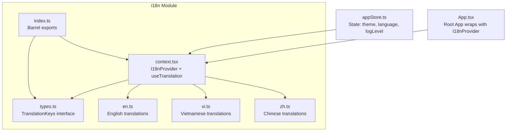
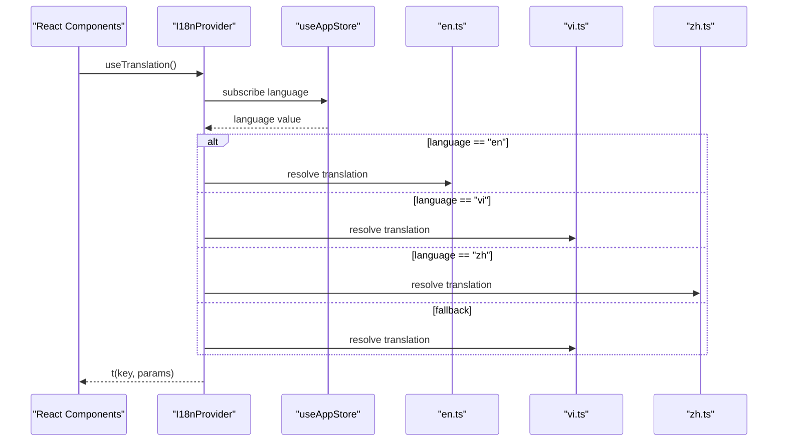
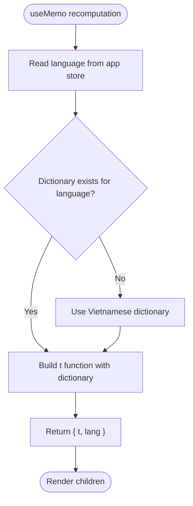
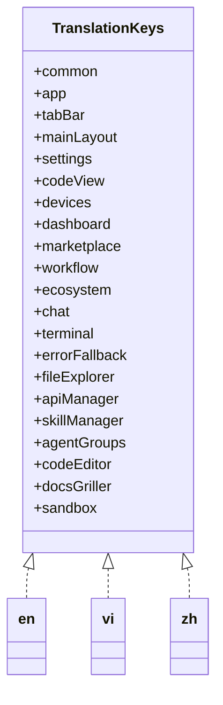
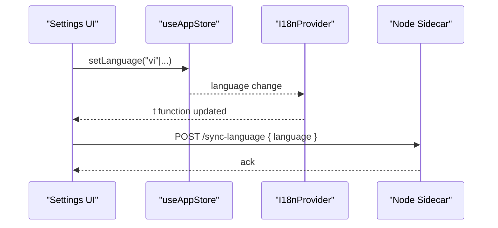
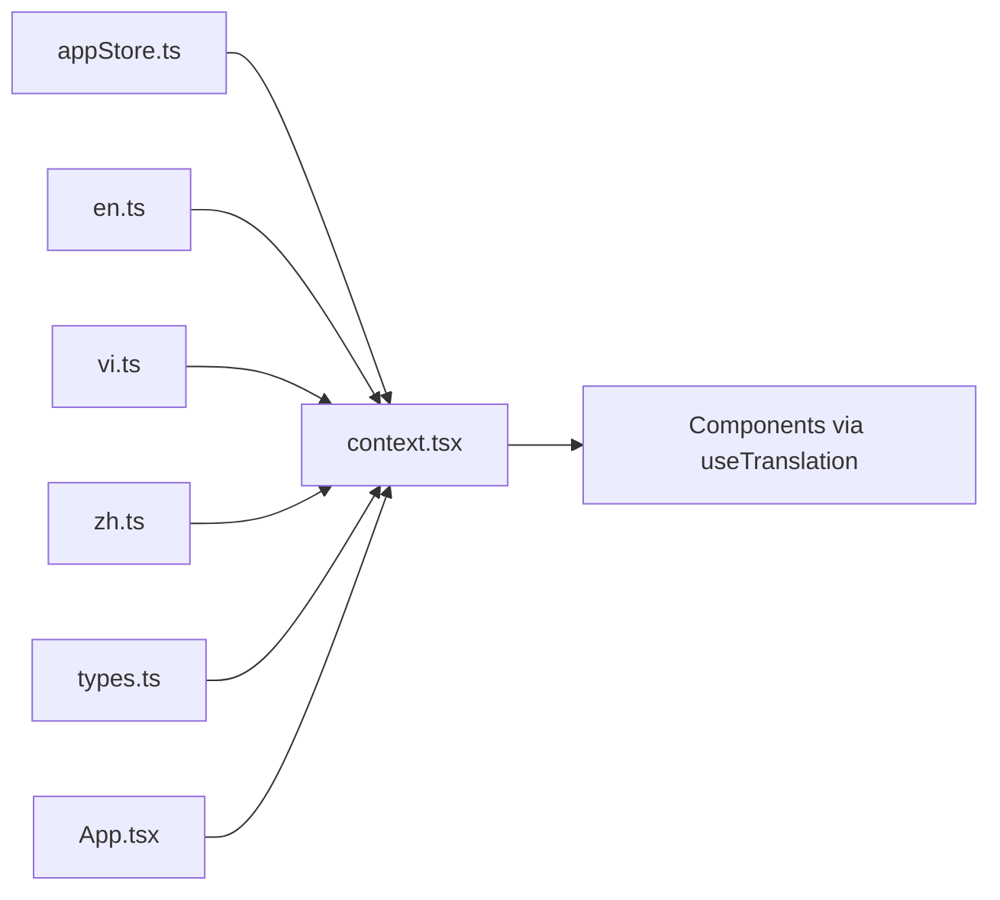

# Internationalization (i18n)

<cite>
**Referenced Files in This Document**
- [context.tsx](file://apps/desktop/src/i18n/context.tsx)
- [index.ts](file://apps/desktop/src/i18n/index.ts)
- [types.ts](file://apps/desktop/src/i18n/types.ts)
- [en.ts](file://apps/desktop/src/i18n/en.ts)
- [zh.ts](file://apps/desktop/src/i18n/zh.ts)
- [vi.ts](file://apps/desktop/src/i18n/vi.ts)
- [appStore.ts](file://apps/desktop/src/stores/appStore.ts)
- [App.tsx](file://apps/desktop/src/App.tsx)
</cite>

## Table of Contents
1. [Introduction](#introduction)
2. [Project Structure](#project-structure)
3. [Core Components](#core-components)
4. [Architecture Overview](#architecture-overview)
5. [Detailed Component Analysis](#detailed-component-analysis)
6. [Dependency Analysis](#dependency-analysis)
7. [Performance Considerations](#performance-considerations)
8. [Troubleshooting Guide](#troubleshooting-guide)
9. [Conclusion](#conclusion)

## Introduction
This document explains the desktop application’s internationalization (i18n) system. It covers how the i18n context manages language switching, locale detection, and translation loading; how translation files are organized per language; how the React component system integrates with the i18n provider; and how TypeScript types ensure type safety across the application. It also details dynamic language switching, translation key organization, pluralization handling, fallback mechanisms, and how the system supports right-to-left languages. Finally, it outlines performance considerations, lazy-loading strategies, and integration with the broader application state.

## Project Structure
The i18n implementation resides under apps/desktop/src/i18n and consists of:
- A context provider and hook that expose a t function and current language
- Language packs for English, Vietnamese, and Chinese
- Strongly typed translation keys via a central interface
- Barrel export for convenient imports

**Diagram sources**
- [context.tsx:1-69](file://apps/desktop/src/i18n/context.tsx#L1-L69)
- [index.ts:1-7](file://apps/desktop/src/i18n/index.ts#L1-L7)
- [types.ts:1-446](file://apps/desktop/src/i18n/types.ts#L1-L446)
- [en.ts:1-448](file://apps/desktop/src/i18n/en.ts#L1-L448)
- [vi.ts:1-448](file://apps/desktop/src/i18n/vi.ts#L1-L448)
- [zh.ts:1-448](file://apps/desktop/src/i18n/zh.ts#L1-L448)
- [App.tsx:179-187](file://apps/desktop/src/App.tsx#L179-L187)
- [appStore.ts:35-40](file://apps/desktop/src/stores/appStore.ts#L35-L40)

**Section sources**
- [context.tsx:1-69](file://apps/desktop/src/i18n/context.tsx#L1-L69)
- [index.ts:1-7](file://apps/desktop/src/i18n/index.ts#L1-L7)
- [types.ts:1-446](file://apps/desktop/src/i18n/types.ts#L1-L446)
- [en.ts:1-448](file://apps/desktop/src/i18n/en.ts#L1-L448)
- [vi.ts:1-448](file://apps/desktop/src/i18n/vi.ts#L1-L448)
- [zh.ts:1-448](file://apps/desktop/src/i18n/zh.ts#L1-L448)
- [App.tsx:179-187](file://apps/desktop/src/App.tsx#L179-L187)
- [appStore.ts:35-40](file://apps/desktop/src/stores/appStore.ts#L35-L40)

## Core Components
- I18nProvider: Creates a context with a t function and current language. It selects the active dictionary based on the app store’s language and falls back to Vietnamese if the selected language is unavailable.
- useTranslation: Returns the t function and current language for components to render localized strings.
- TranslationKeys: A strongly typed interface that defines the shape of all translation dictionaries, ensuring compile-time safety for translation keys.
- Language packs: Separate modules exporting dictionaries for English, Vietnamese, and Chinese. They follow the same structure as TranslationKeys and include interpolation placeholders.

Key behaviors:
- Dynamic language switching: The provider recomputes the t function whenever the language changes in the app store.
- Interpolation: Placeholders use double curly braces {{param}} and are replaced at runtime.
- Pluralization: Uses positional placeholders like {{count}} and optional suffixes (e.g., “s”) to handle plural forms.
- Fallback: If a key is missing or not a string, the provider returns the key itself, preventing crashes and aiding debugging.

**Section sources**
- [context.tsx:33-68](file://apps/desktop/src/i18n/context.tsx#L33-L68)
- [types.ts:5-446](file://apps/desktop/src/i18n/types.ts#L5-L446)
- [en.ts:7-447](file://apps/desktop/src/i18n/en.ts#L7-L447)
- [vi.ts:7-447](file://apps/desktop/src/i18n/vi.ts#L7-L447)
- [zh.ts:7-447](file://apps/desktop/src/i18n/zh.ts#L7-L447)

## Architecture Overview
The i18n system integrates with the application state and UI as follows:
- App.tsx wraps the application with I18nProvider, ensuring all components have access to the t function.
- The app store holds the current language and theme. Changing the language triggers re-rendering of the provider, which selects the appropriate dictionary.
- Components consume translations via useTranslation and render localized content.
- The system supports right-to-left languages conceptually through the lang property and placeholder interpolation; explicit RTL layout adjustments are not shown in the current code.

**Diagram sources**
- [App.tsx:179-187](file://apps/desktop/src/App.tsx#L179-L187)
- [context.tsx:33-68](file://apps/desktop/src/i18n/context.tsx#L33-L68)
- [appStore.ts:35-40](file://apps/desktop/src/stores/appStore.ts#L35-L40)
- [en.ts:7-447](file://apps/desktop/src/i18n/en.ts#L7-L447)
- [vi.ts:7-447](file://apps/desktop/src/i18n/vi.ts#L7-L447)
- [zh.ts:7-447](file://apps/desktop/src/i18n/zh.ts#L7-L447)

## Detailed Component Analysis

### I18n Context and Provider
- Purpose: Provide a t function and current language to the component tree.
- Language selection: Reads language from the app store; falls back to Vietnamese if the selected language is not present.
- Translation lookup: Splits the dot-notation key into segments and traverses the dictionary object. Returns the key if traversal fails.
- Interpolation: Replaces placeholders like {{param}} with provided values.
- Memoization: Uses useMemo to avoid unnecessary recomputation when language remains unchanged.

**Diagram sources**
- [context.tsx:33-68](file://apps/desktop/src/i18n/context.tsx#L33-L68)
- [appStore.ts:35-40](file://apps/desktop/src/stores/appStore.ts#L35-L40)

**Section sources**
- [context.tsx:33-68](file://apps/desktop/src/i18n/context.tsx#L33-L68)

### Translation Keys and Type Safety
- TranslationKeys defines the hierarchical structure of all translation keys across categories (common, app, tabBar, mainLayout, settings, codeView, devices, dashboard, marketplace, workflow, ecosystem, chat, terminal, errorFallback, fileExplorer, apiManager, skillManager, agentGroups, codeEditor, docsGriller, sandbox).
- Each language pack exports a dictionary conforming to TranslationKeys, ensuring compile-time verification of key presence and types.
- Interpolation placeholders are embedded in string values (e.g., {{name}}, {{count}}), enabling dynamic content insertion.

**Diagram sources**
- [types.ts:5-446](file://apps/desktop/src/i18n/types.ts#L5-L446)
- [en.ts:7-447](file://apps/desktop/src/i18n/en.ts#L7-L447)
- [vi.ts:7-447](file://apps/desktop/src/i18n/vi.ts#L7-L447)
- [zh.ts:7-447](file://apps/desktop/src/i18n/zh.ts#L7-L447)

**Section sources**
- [types.ts:5-446](file://apps/desktop/src/i18n/types.ts#L5-L446)
- [en.ts:7-447](file://apps/desktop/src/i18n/en.ts#L7-L447)
- [vi.ts:7-447](file://apps/desktop/src/i18n/vi.ts#L7-L447)
- [zh.ts:7-447](file://apps/desktop/src/i18n/zh.ts#L7-L447)

### Language Packs and Pluralization
- English, Vietnamese, and Chinese packs mirror the TranslationKeys structure.
- Pluralization is handled via placeholders such as {{count}} and optional suffixes (e.g., “s”), allowing flexible rendering of plural forms.
- Example keys demonstrate interpolation for names, errors, counts, and exit codes.

**Section sources**
- [en.ts:65-66](file://apps/desktop/src/i18n/en.ts#L65-L66)
- [en.ts:104-117](file://apps/desktop/src/i18n/en.ts#L104-L117)
- [en.ts:160-175](file://apps/desktop/src/i18n/en.ts#L160-L175)
- [en.ts:323-327](file://apps/desktop/src/i18n/en.ts#L323-L327)
- [vi.ts:65](file://apps/desktop/src/i18n/vi.ts#L65)
- [zh.ts:65](file://apps/desktop/src/i18n/zh.ts#L65)

### Dynamic Language Switching and Integration with App State
- Language is stored in the app store and exposed to the i18n provider via a selector.
- When the language changes, the provider rebuilds the t function with the new dictionary.
- The App component listens for sidecar events and updates the language in the app store, triggering provider recalculation.
- The provider also synchronizes the language to a Node sidecar server via an IPC call.

**Diagram sources**
- [appStore.ts:39-109](file://apps/desktop/src/stores/appStore.ts#L39-L109)
- [context.tsx:33-68](file://apps/desktop/src/i18n/context.tsx#L33-L68)
- [App.tsx:49-69](file://apps/desktop/src/App.tsx#L49-L69)

**Section sources**
- [appStore.ts:35-40](file://apps/desktop/src/stores/appStore.ts#L35-L40)
- [context.tsx:33-68](file://apps/desktop/src/i18n/context.tsx#L33-L68)
- [App.tsx:49-69](file://apps/desktop/src/App.tsx#L49-L69)

### Locale Detection and Fallback Mechanisms
- Locale detection is not implemented in code; the system relies on the app store’s language setting.
- Fallback behavior: If the selected language dictionary is missing, the provider falls back to Vietnamese.
- Missing keys: If a key resolves to a non-string or is absent, the provider returns the key itself, preserving stability and aiding debugging.

**Section sources**
- [context.tsx:37-48](file://apps/desktop/src/i18n/context.tsx#L37-L48)
- [context.tsx:23-29](file://apps/desktop/src/i18n/context.tsx#L23-L29)

### Right-to-Left Language Support
- The provider exposes a lang field, enabling downstream logic to adjust layout direction if needed.
- No explicit RTL-specific styling or direction attributes are present in the current code; integration would require additional CSS or layout adjustments.

**Section sources**
- [context.tsx:30](file://apps/desktop/src/i18n/context.tsx#L30)

### Translation Contribution Workflows and Naming Conventions
- Translation keys are organized hierarchically by feature or domain (e.g., common, app, settings, codeView).
- Naming convention: dot-separated paths (e.g., settings.title) ensure clarity and grouping.
- Interpolation placeholders: Use double curly braces {{param}} consistently across languages.
- Pluralization: Use {{count}} with optional suffixes to represent plural forms.
- Maintenance: Keep all language packs aligned with TranslationKeys; add missing keys to all dictionaries to prevent fallback rendering.

**Section sources**
- [types.ts:5-446](file://apps/desktop/src/i18n/types.ts#L5-L446)
- [en.ts:7-447](file://apps/desktop/src/i18n/en.ts#L7-L447)
- [vi.ts:7-447](file://apps/desktop/src/i18n/vi.ts#L7-L447)
- [zh.ts:7-447](file://apps/desktop/src/i18n/zh.ts#L7-L447)

## Dependency Analysis
- I18nProvider depends on:
  - appStore for language state
  - Language packs (en, vi, zh) for translation dictionaries
  - TranslationKeys for type safety
- App.tsx depends on I18nProvider to wrap the application and on the app store to synchronize language with the sidecar.
- Components depend on useTranslation to render localized content.

**Diagram sources**
- [context.tsx:33-68](file://apps/desktop/src/i18n/context.tsx#L33-L68)
- [en.ts:7-447](file://apps/desktop/src/i18n/en.ts#L7-L447)
- [vi.ts:7-447](file://apps/desktop/src/i18n/vi.ts#L7-L447)
- [zh.ts:7-447](file://apps/desktop/src/i18n/zh.ts#L7-L447)
- [types.ts:5-446](file://apps/desktop/src/i18n/types.ts#L5-L446)
- [appStore.ts:35-40](file://apps/desktop/src/stores/appStore.ts#L35-L40)
- [App.tsx:179-187](file://apps/desktop/src/App.tsx#L179-L187)

**Section sources**
- [context.tsx:33-68](file://apps/desktop/src/i18n/context.tsx#L33-L68)
- [appStore.ts:35-40](file://apps/desktop/src/stores/appStore.ts#L35-L40)
- [App.tsx:179-187](file://apps/desktop/src/App.tsx#L179-L187)

## Performance Considerations
- Current implementation loads all language dictionaries at startup. For large translation sets, consider:
  - Lazy-loading language packs via dynamic imports to reduce initial bundle size.
  - Splitting translations by feature or route and loading on demand.
  - Using a bundler plugin or build-time splitting to generate separate chunks per language.
- Memoization: The provider already memoizes the t function based on language, minimizing re-renders.
- Interpolation: Placeholder replacement is O(n) per key; keep parameter objects small and avoid deep nesting.
- Rendering: Prefer batching translation calls in frequently re-rendered components and cache results when appropriate.

[No sources needed since this section provides general guidance]

## Troubleshooting Guide
Common issues and resolutions:
- Missing translation key: The provider returns the key itself. Check TranslationKeys and ensure the key exists in all language packs.
- Incorrect interpolation: Verify placeholder names match the params object keys and types.
- Language not changing: Confirm the app store’s language setter is invoked and the provider is re-rendered.
- Sidecar synchronization failures: Inspect the IPC call and server status; ensure the sidecar is reachable and the endpoint is correct.

**Section sources**
- [context.tsx:23-29](file://apps/desktop/src/i18n/context.tsx#L23-L29)
- [context.tsx:37-48](file://apps/desktop/src/i18n/context.tsx#L37-L48)
- [App.tsx:49-69](file://apps/desktop/src/App.tsx#L49-L69)

## Conclusion
The desktop application’s i18n system centers on a lightweight, type-safe provider that selects language dictionaries based on the app store’s language state. It supports dynamic language switching, interpolation, and pluralization while providing robust fallbacks. The barrel export simplifies imports, and the TranslationKeys interface ensures consistency across language files. For scalability, consider lazy-loading language packs and optimizing rendering of frequently accessed translations. The system integrates seamlessly with the broader application state and UI, delivering a reliable foundation for multilingual experiences.