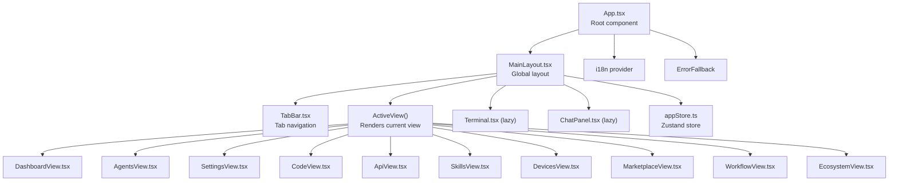
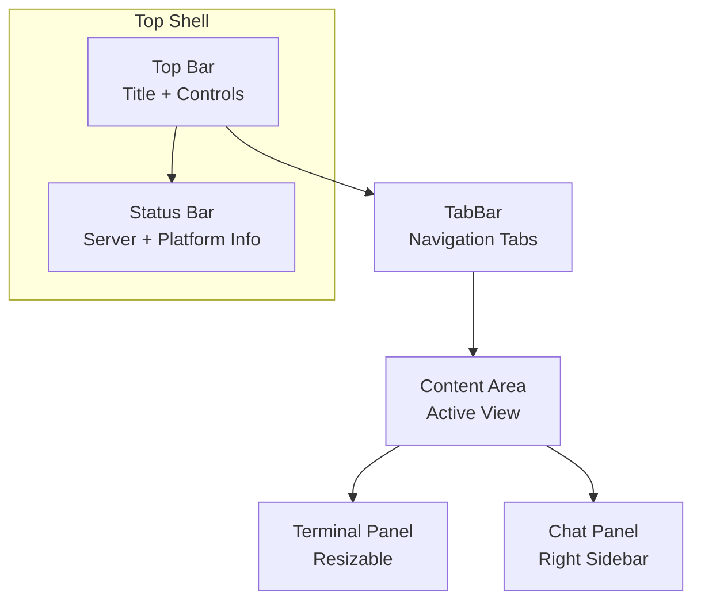
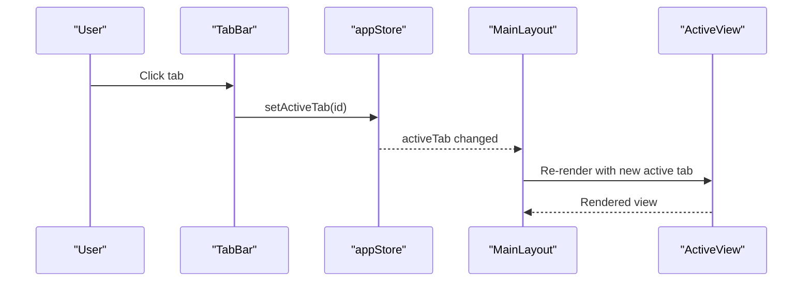
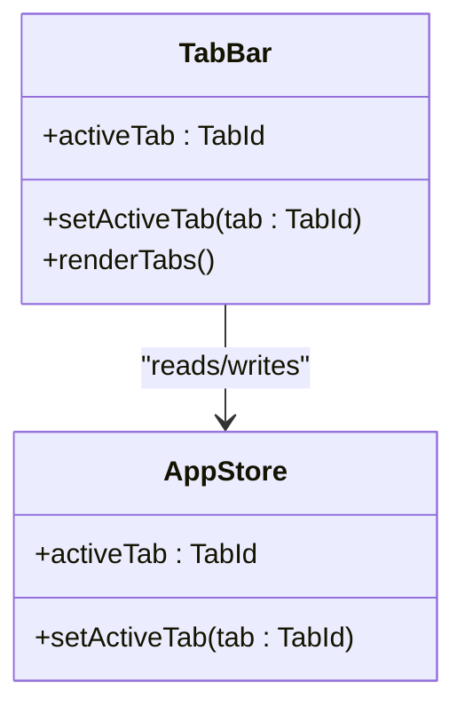
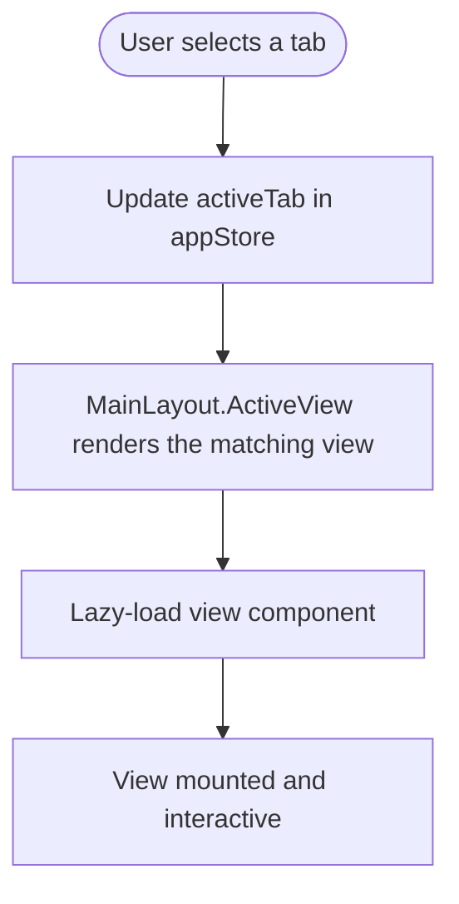
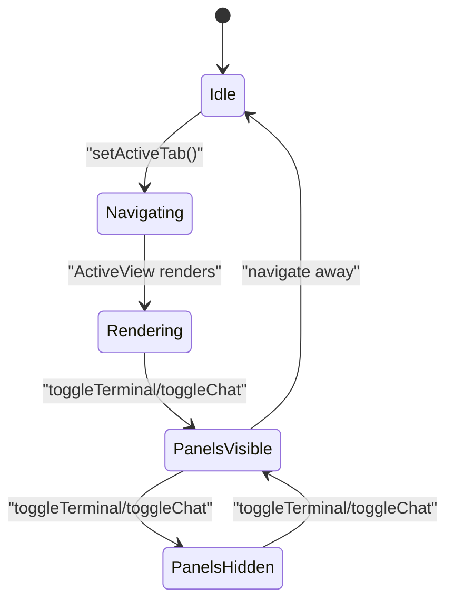
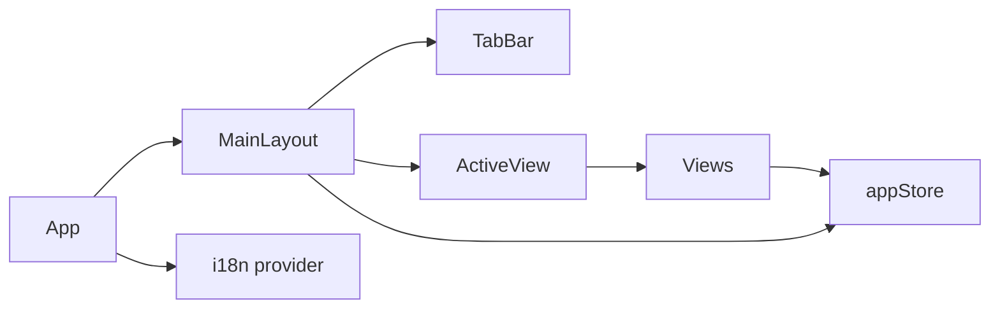

# Main Layout and Navigation

<cite>
**Referenced Files in This Document**
- [MainLayout.tsx](file://apps/desktop/src/layouts/MainLayout.tsx)
- [TabBar.tsx](file://apps/desktop/src/components/TabBar.tsx)
- [appStore.ts](file://apps/desktop/src/stores/appStore.ts)
- [App.tsx](file://apps/desktop/src/App.tsx)
- [DashboardView.tsx](file://apps/desktop/src/views/DashboardView.tsx)
- [AgentsView.tsx](file://apps/desktop/src/views/AgentsView.tsx)
- [SettingsView.tsx](file://apps/desktop/src/views/SettingsView.tsx)
- [CodeView.tsx](file://apps/desktop/src/views/CodeView.tsx)
- [ApiView.tsx](file://apps/desktop/src/views/ApiView.tsx)
- [SkillsView.tsx](file://apps/desktop/src/views/SkillsView.tsx)
- [DevicesView.tsx](file://apps/desktop/src/views/DevicesView.tsx)
- [MarketplaceView.tsx](file://apps/desktop/src/views/MarketplaceView.tsx)
- [WorkflowView.tsx](file://apps/desktop/src/views/WorkflowView.tsx)
- [EcosystemView.tsx](file://apps/desktop/src/views/EcosystemView.tsx)
</cite>

## Table of Contents
1. [Introduction](#introduction)
2. [Project Structure](#project-structure)
3. [Core Components](#core-components)
4. [Architecture Overview](#architecture-overview)
5. [Detailed Component Analysis](#detailed-component-analysis)
6. [Dependency Analysis](#dependency-analysis)
7. [Performance Considerations](#performance-considerations)
8. [Troubleshooting Guide](#troubleshooting-guide)
9. [Conclusion](#conclusion)

## Introduction
This document explains the desktop application’s main layout and navigation system. It focuses on the MainLayout.tsx component and how it orchestrates the overall application structure, including the top bar, tab navigation, content area, terminal panel, and chat sidebar. It also documents the view system, covering DashboardView.tsx, AgentsView.tsx, SettingsView.tsx, and other major views. The document details navigation patterns, route management, responsive behavior, tab management, panel organization, state management, persistence, and accessibility considerations.

## Project Structure
The desktop application follows a clear separation of concerns:
- Layout: MainLayout.tsx defines the global shell with header, tab bar, content area, terminal, and status bar.
- Views: Each major area (Dashboard, Agents, Settings, Code, API, Skills, Devices, Marketplace, Workflow, Ecosystem) is implemented as a dedicated view component.
- State: appStore.ts manages global state (active tab, panels, settings, server status, etc.) with persistence.
- Navigation: TabBar.tsx provides the tab interface; MainLayout.tsx renders the active view based on the store.
- Root: App.tsx wires up internationalization, error boundaries, and the main layout.



**Diagram sources**
- [App.tsx:179-187](file://apps/desktop/src/App.tsx#L179-L187)
- [MainLayout.tsx:142-347](file://apps/desktop/src/layouts/MainLayout.tsx#L142-L347)
- [TabBar.tsx:9-85](file://apps/desktop/src/components/TabBar.tsx#L9-L85)
- [appStore.ts:78-168](file://apps/desktop/src/stores/appStore.ts#L78-L168)

**Section sources**
- [App.tsx:179-187](file://apps/desktop/src/App.tsx#L179-L187)
- [MainLayout.tsx:142-347](file://apps/desktop/src/layouts/MainLayout.tsx#L142-L347)
- [TabBar.tsx:9-85](file://apps/desktop/src/components/TabBar.tsx#L9-L85)
- [appStore.ts:78-168](file://apps/desktop/src/stores/appStore.ts#L78-L168)

## Core Components
- MainLayout: Hosts the global UI shell, top bar, tab bar, content area, terminal panel, and status bar. It controls visibility and resizing of panels and renders the active view based on the store.
- TabBar: Provides the tab strip with icons and labels, and updates the active tab in the store.
- appStore: Centralized state for active tab, panels, theme, language, server status, and other global settings with persistence.
- Views: Each view encapsulates a distinct functional area and integrates with the store for data and state.

Key responsibilities:
- Navigation: TabBar triggers setActiveTab; MainLayout reads activeTab to render the appropriate view.
- Panels: Terminal and chat panels are controlled via booleans and dimensions stored in the app store.
- Error handling: MainLayout wraps the active view with a per-view error boundary and a global error boundary at the root.

**Section sources**
- [MainLayout.tsx:142-347](file://apps/desktop/src/layouts/MainLayout.tsx#L142-L347)
- [TabBar.tsx:9-85](file://apps/desktop/src/components/TabBar.tsx#L9-L85)
- [appStore.ts:78-168](file://apps/desktop/src/stores/appStore.ts#L78-L168)

## Architecture Overview
The layout architecture centers around a single-page application pattern with:
- Lazy-loaded views for performance.
- A tabbed content area that renders only the active tab.
- Optional side panels (terminal and chat) that can be toggled and resized.
- A status bar reflecting runtime information.



**Diagram sources**
- [MainLayout.tsx:188-345](file://apps/desktop/src/layouts/MainLayout.tsx#L188-L345)

## Detailed Component Analysis

### MainLayout.tsx
MainLayout orchestrates the entire UI:
- Top bar displays the application title and platform/version badge, plus quick toggles for terminal and chat.
- TabBar below the top bar provides navigation among views.
- Content area renders the currently active view lazily and with error boundaries.
- Terminal panel appears below the content when toggled, with a draggable resize handle.
- Chat panel appears as a right sidebar when toggled.
- Status bar shows server/device status and environment details.

Notable behaviors:
- ActiveView renders only the active tab to avoid background work in hidden tabs.
- Terminal resize uses mouse events to adjust height with bounds.
- Error boundaries isolate view-level failures and provide retry UI.



**Diagram sources**
- [TabBar.tsx:46-48](file://apps/desktop/src/components/TabBar.tsx#L46-L48)
- [appStore.ts:82-83](file://apps/desktop/src/stores/appStore.ts#L82-L83)
- [MainLayout.tsx:112-140](file://apps/desktop/src/layouts/MainLayout.tsx#L112-L140)

**Section sources**
- [MainLayout.tsx:142-347](file://apps/desktop/src/layouts/MainLayout.tsx#L142-L347)
- [MainLayout.tsx:112-140](file://apps/desktop/src/layouts/MainLayout.tsx#L112-L140)

### TabBar.tsx
TabBar defines the tab strip:
- Maintains a fixed list of tabs with icons and labels translated via i18n.
- Updates the active tab in the store on selection.
- Uses role attributes and aria-selected for accessibility.



**Diagram sources**
- [TabBar.tsx:9-85](file://apps/desktop/src/components/TabBar.tsx#L9-L85)
- [appStore.ts:14-16](file://apps/desktop/src/stores/appStore.ts#L14-L16)

**Section sources**
- [TabBar.tsx:9-85](file://apps/desktop/src/components/TabBar.tsx#L9-L85)
- [appStore.ts:14-16](file://apps/desktop/src/stores/appStore.ts#L14-L16)

### appStore.ts
The store centralizes global state:
- Tab management: activeTab, setActiveTab.
- Panels: isTerminalOpen, terminalHeight, toggleTerminal, setTerminalHeight.
- Chat: isChatOpen, toggleChat.
- Settings: theme, language, logLevel, setters.
- Server and devices: serverStatus, connectedDevices, pairing code.
- Plugins and ecosystem: mcpServers, hooks, context usage, dashboard stats, plugins.

Persistence: Only a subset of state is persisted to localStorage to maintain user preferences across sessions.

```mermaid
classDiagram
class AppState {
+activeTab : TabId
+setActiveTab(tab)
+isTerminalOpen : boolean
+terminalHeight : number
+toggleTerminal()
+setTerminalHeight(h)
+isChatOpen : boolean
+toggleChat()
+theme : ThemeMode
+language : string
+logLevel : string
+setTheme(theme)
+setLanguage(lang)
+setLogLevel(level)
+serverStatus : string
+connectedDevices : DeviceInfo[]
+setServerStatus(status)
+setConnectedDevices(devices)
+mcpServers : []
+hooks : []
+contextUsage : {}
+dashboardStats : {}
+plugins : []
+setPlugins(plugins)
+togglePlugin(id, enabled)
+installPlugin(manifest)
+uninstallPlugin(id)
}
```

**Diagram sources**
- [appStore.ts:13-76](file://apps/desktop/src/stores/appStore.ts#L13-L76)
- [appStore.ts:78-168](file://apps/desktop/src/stores/appStore.ts#L78-L168)

**Section sources**
- [appStore.ts:13-76](file://apps/desktop/src/stores/appStore.ts#L13-L76)
- [appStore.ts:78-168](file://apps/desktop/src/stores/appStore.ts#L78-L168)

### View System and Navigation Patterns
Views are organized under apps/desktop/src/views and rendered by MainLayout.ActiveView based on the active tab. Each view encapsulates its own UI and interactions.

Representative views:
- DashboardView: Aggregates stats, server status, MCP servers, hooks, and context usage; integrates sandbox and docs dashboards.
- AgentsView: Renders agent groups.
- SettingsView: Manages theme, language, logging, API keys, MCP servers, and hooks; includes a button to navigate to the API manager view.
- CodeView: File explorer sidebar, multi-tab editor, save/close operations, keyboard shortcuts, and resizable explorer.
- ApiView: API manager component.
- SkillsView: Skill manager component.
- DevicesView: Server lifecycle control, pairing code, device listing, and connection management.
- MarketplaceView: Plugin marketplace with filtering, sorting, installation, and toggling.
- WorkflowView: Visual workflow builder with drag-and-drop nodes, connections, and configuration panel.
- EcosystemView: gRPC daemon, Agent Protocol monitoring, and router configuration.

Navigation patterns:
- Tab-based switching via TabBar → appStore.activeTab.
- Programmatic navigation: SettingsView uses a button to switch to the API view by updating activeTab.
- Lazy loading: Views and panels are loaded on demand to optimize performance.



**Diagram sources**
- [TabBar.tsx:46-48](file://apps/desktop/src/components/TabBar.tsx#L46-L48)
- [appStore.ts:82-83](file://apps/desktop/src/stores/appStore.ts#L82-L83)
- [MainLayout.tsx:112-140](file://apps/desktop/src/layouts/MainLayout.tsx#L112-L140)

**Section sources**
- [DashboardView.tsx:48-219](file://apps/desktop/src/views/DashboardView.tsx#L48-L219)
- [AgentsView.tsx:7-9](file://apps/desktop/src/views/AgentsView.tsx#L7-L9)
- [SettingsView.tsx:103-356](file://apps/desktop/src/views/SettingsView.tsx#L103-L356)
- [CodeView.tsx:25-404](file://apps/desktop/src/views/CodeView.tsx#L25-L404)
- [ApiView.tsx:7-9](file://apps/desktop/src/views/ApiView.tsx#L7-L9)
- [SkillsView.tsx:7-9](file://apps/desktop/src/views/SkillsView.tsx#L7-L9)
- [DevicesView.tsx:27-336](file://apps/desktop/src/views/DevicesView.tsx#L27-L336)
- [MarketplaceView.tsx:93-576](file://apps/desktop/src/views/MarketplaceView.tsx#L93-L576)
- [WorkflowView.tsx:74-837](file://apps/desktop/src/views/WorkflowView.tsx#L74-L837)
- [EcosystemView.tsx:25-596](file://apps/desktop/src/views/EcosystemView.tsx#L25-L596)

### Panel Organization and Resizing
- Terminal panel:
  - Toggle via top bar button.
  - Resizable via drag handle; height constrained by min/max bounds.
- Chat panel:
  - Toggle via top bar button.
  - Fixed width with max viewport percentage and left border divider.

Accessibility and keyboard navigation:
- TabBar uses role="tab" and aria-selected to indicate focus and selection.
- CodeView supports keyboard shortcuts for save/save all and close tab.
- WorkflowView supports drag-and-drop and double-click to add nodes.

Responsive behavior:
- The layout uses flexbox with constrained heights and overflow handling.
- Terminal and chat panels adapt to available space; the content area remains flexible.
- TabBar is horizontally scrollable to accommodate many tabs.

**Section sources**
- [MainLayout.tsx:158-186](file://apps/desktop/src/layouts/MainLayout.tsx#L158-L186)
- [MainLayout.tsx:297-310](file://apps/desktop/src/layouts/MainLayout.tsx#L297-L310)
- [TabBar.tsx:46-78](file://apps/desktop/src/components/TabBar.tsx#L46-L78)
- [CodeView.tsx:178-196](file://apps/desktop/src/views/CodeView.tsx#L178-L196)
- [WorkflowView.tsx:129-198](file://apps/desktop/src/views/WorkflowView.tsx#L129-L198)

### Navigation State Management and Persistence
- Active view tracking: appStore.activeTab determines which view is rendered.
- Panel visibility and sizing: appStore.isTerminalOpen, appStore.terminalHeight, appStore.isChatOpen manage UI state.
- Persistence: The store persists theme, language, log level, activeTab, terminal open state, plugins, and permission mode to localStorage.



**Diagram sources**
- [appStore.ts:82-99](file://apps/desktop/src/stores/appStore.ts#L82-L99)
- [appStore.ts:154-167](file://apps/desktop/src/stores/appStore.ts#L154-L167)

**Section sources**
- [appStore.ts:82-99](file://apps/desktop/src/stores/appStore.ts#L82-L99)
- [appStore.ts:154-167](file://apps/desktop/src/stores/appStore.ts#L154-L167)

### Accessibility Considerations
- TabBar:
  - role="tab" and aria-selected for screen reader compatibility.
  - Hover/focus styling indicates interactive state.
- CodeView:
  - Keyboard shortcuts for common actions (save, save all, close tab).
- WorkflowView:
  - Drag-and-drop and double-click interactions for adding nodes.
- Global:
  - Error boundaries provide failure isolation and recovery options.

**Section sources**
- [TabBar.tsx:46-78](file://apps/desktop/src/components/TabBar.tsx#L46-L78)
- [CodeView.tsx:178-196](file://apps/desktop/src/views/CodeView.tsx#L178-L196)
- [MainLayout.tsx:51-110](file://apps/desktop/src/layouts/MainLayout.tsx#L51-L110)
- [App.tsx:179-187](file://apps/desktop/src/App.tsx#L179-L187)

## Dependency Analysis
The layout and navigation system exhibits low coupling and high cohesion:
- MainLayout depends on TabBar and appStore for navigation and state.
- Views depend on appStore for data and on i18n for localization.
- Panels (Terminal, Chat) are optional and controlled by appStore flags.



**Diagram sources**
- [MainLayout.tsx:142-347](file://apps/desktop/src/layouts/MainLayout.tsx#L142-L347)
- [TabBar.tsx:9-85](file://apps/desktop/src/components/TabBar.tsx#L9-L85)
- [appStore.ts:78-168](file://apps/desktop/src/stores/appStore.ts#L78-L168)
- [App.tsx:179-187](file://apps/desktop/src/App.tsx#L179-L187)

**Section sources**
- [MainLayout.tsx:142-347](file://apps/desktop/src/layouts/MainLayout.tsx#L142-L347)
- [TabBar.tsx:9-85](file://apps/desktop/src/components/TabBar.tsx#L9-L85)
- [appStore.ts:78-168](file://apps/desktop/src/stores/appStore.ts#L78-L168)
- [App.tsx:179-187](file://apps/desktop/src/App.tsx#L179-L187)

## Performance Considerations
- Lazy loading: Views and panels are lazy-imported to reduce initial bundle size and improve startup time.
- Conditional rendering: Only the active tab is rendered; hidden tabs are unmounted to prevent background work.
- Controlled resizing: Terminal height is clamped to reasonable bounds to avoid excessive reflows.
- Minimal re-renders: Zustand store updates are granular, reducing unnecessary component re-renders.

## Troubleshooting Guide
Common issues and remedies:
- View crashes:
  - Per-view error boundary isolates failures and offers a retry button.
  - Global error boundary at the root provides fallback UI.
- Terminal panel not resizing:
  - Verify mouse event listeners are attached and not blocked by overlays.
  - Confirm terminalHeight is within min/max bounds.
- Chat panel not appearing:
  - Ensure toggleChat is invoked and isChatOpen is true.
- Navigation not working:
  - Confirm setActiveTab is called with a valid TabId.
  - Check that the TABS mapping in ActiveView includes the selected tab.

**Section sources**
- [MainLayout.tsx:51-110](file://apps/desktop/src/layouts/MainLayout.tsx#L51-L110)
- [MainLayout.tsx:158-186](file://apps/desktop/src/layouts/MainLayout.tsx#L158-L186)
- [TabBar.tsx:46-48](file://apps/desktop/src/components/TabBar.tsx#L46-L48)
- [appStore.ts:82-83](file://apps/desktop/src/stores/appStore.ts#L82-L83)

## Conclusion
The desktop application’s layout and navigation system is built around a robust, modular architecture:
- MainLayout provides a consistent shell with top bar, tab navigation, content area, and optional panels.
- appStore centralizes state and persistence, enabling seamless navigation and panel control.
- Views are encapsulated and lazy-loaded for optimal performance.
- Accessibility and responsiveness are addressed through semantic markup, keyboard shortcuts, and flexible layouts.
This design enables scalable growth of features while maintaining a clean separation of concerns and strong user experience guarantees.