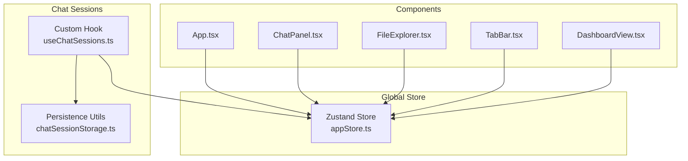
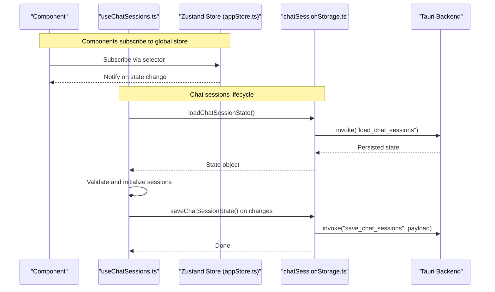
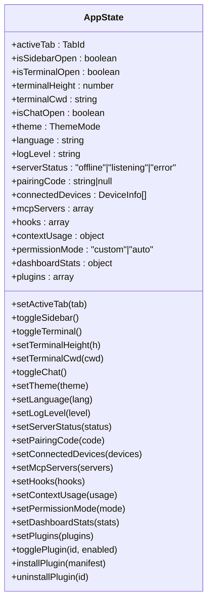
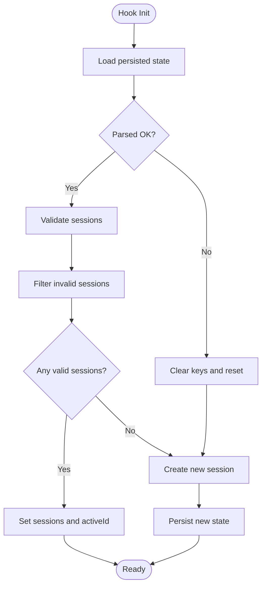
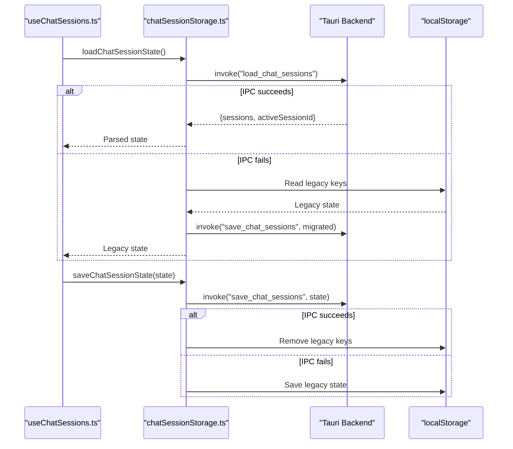
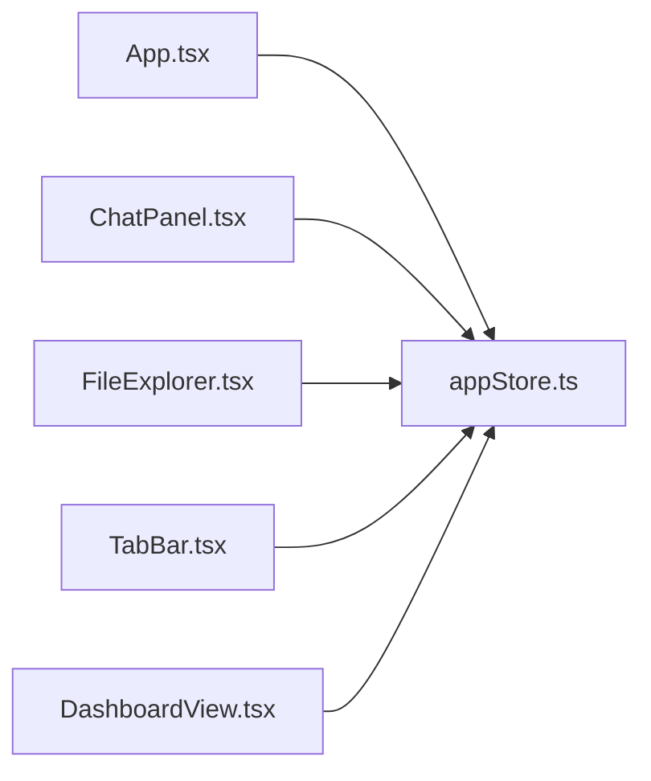
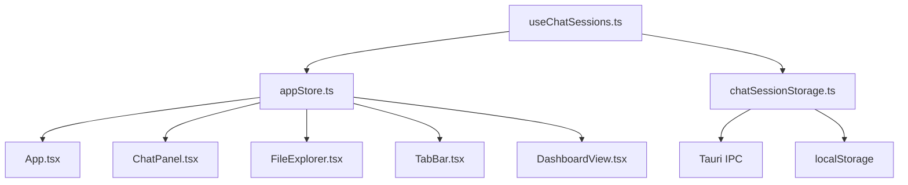

# State Management

<cite>
**Referenced Files in This Document**
- [appStore.ts](file://apps/desktop/src/stores/appStore.ts)
- [useChatSessions.ts](file://apps/desktop/src/hooks/useChatSessions.ts)
- [chatSessionStorage.ts](file://apps/desktop/src/utils/chatSessionStorage.ts)
- [App.tsx](file://apps/desktop/src/App.tsx)
- [ChatPanel.tsx](file://apps/desktop/src/components/ChatPanel.tsx)
- [FileExplorer.tsx](file://apps/desktop/src/components/FileExplorer.tsx)
- [TabBar.tsx](file://apps/desktop/src/components/TabBar.tsx)
- [DashboardView.tsx](file://apps/desktop/src/views/DashboardView.tsx)
- [useChatSessions.test.ts](file://apps/desktop/src/hooks/useChatSessions.test.ts)
- [chatSessionStorage.test.ts](file://apps/desktop/src/utils/chatSessionStorage.test.ts)
</cite>

## Table of Contents
1. [Introduction](#introduction)
2. [Project Structure](#project-structure)
3. [Core Components](#core-components)
4. [Architecture Overview](#architecture-overview)
5. [Detailed Component Analysis](#detailed-component-analysis)
6. [Dependency Analysis](#dependency-analysis)
7. [Performance Considerations](#performance-considerations)
8. [Troubleshooting Guide](#troubleshooting-guide)
9. [Conclusion](#conclusion)

## Introduction
This document explains the desktop application’s state management architecture with a focus on the Zustand-based global store and chat session persistence. It covers the state structure, persistence mechanisms, custom hooks, synchronization patterns, immutability and normalization strategies, performance optimizations, debugging and reset procedures, error handling, and integration across components.

## Project Structure
The state management spans three primary areas:
- Global application store: a single Zustand store that centralizes UI state, preferences, device connections, and plugin configuration.
- Chat session store: a custom React hook that manages chat history, active session, and persistence to Tauri backend or localStorage fallback.
- Persistence utilities: a thin wrapper around Tauri IPC that persists chat sessions and gracefully falls back to localStorage.

**Diagram sources**
- [appStore.ts:78-169](file://apps/desktop/src/stores/appStore.ts#L78-L169)
- [useChatSessions.ts:58-207](file://apps/desktop/src/hooks/useChatSessions.ts#L58-L207)
- [chatSessionStorage.ts:37-68](file://apps/desktop/src/utils/chatSessionStorage.ts#L37-L68)
- [App.tsx:9-112](file://apps/desktop/src/App.tsx#L9-L112)
- [ChatPanel.tsx:9-1000](file://apps/desktop/src/components/ChatPanel.tsx#L9-L1000)
- [FileExplorer.tsx:9-200](file://apps/desktop/src/components/FileExplorer.tsx#L9-L200)
- [TabBar.tsx:5-20](file://apps/desktop/src/components/TabBar.tsx#L5-L20)
- [DashboardView.tsx:1-120](file://apps/desktop/src/views/DashboardView.tsx#L1-L120)

**Section sources**
- [appStore.ts:78-169](file://apps/desktop/src/stores/appStore.ts#L78-L169)
- [useChatSessions.ts:58-207](file://apps/desktop/src/hooks/useChatSessions.ts#L58-L207)
- [chatSessionStorage.ts:37-68](file://apps/desktop/src/utils/chatSessionStorage.ts#L37-L68)
- [App.tsx:9-112](file://apps/desktop/src/App.tsx#L9-L112)

## Core Components
- Global Zustand store (appStore.ts):
  - Manages UI state (active tab, sidebar, terminal visibility/size/CWD, chat visibility), user preferences (theme, language, log level), device connections, MCP servers/hooks, context usage, permission mode, dashboard stats, and plugins.
  - Uses Zustand middleware to persist selected slices to localStorage.
- Chat session hook (useChatSessions.ts):
  - Provides CRUD operations for chat sessions, tracks active session, and maintains a current view state.
  - Persists sessions via Tauri IPC with a localStorage fallback and validates data integrity.
- Persistence utilities (chatSessionStorage.ts):
  - Loads/saves chat session state through Tauri IPC, with migration from legacy localStorage keys.

Key responsibilities:
- Centralized global state for UI and preferences.
- Reliable, validated persistence of chat sessions across app restarts.
- Minimal re-renders via selector-based subscriptions.

**Section sources**
- [appStore.ts:13-76](file://apps/desktop/src/stores/appStore.ts#L13-L76)
- [appStore.ts:78-169](file://apps/desktop/src/stores/appStore.ts#L78-L169)
- [useChatSessions.ts:58-207](file://apps/desktop/src/hooks/useChatSessions.ts#L58-L207)
- [chatSessionStorage.ts:37-68](file://apps/desktop/src/utils/chatSessionStorage.ts#L37-L68)

## Architecture Overview
The state architecture combines a global store for cross-cutting concerns and a specialized hook for chat sessions. Components subscribe to either the global store or the chat hook to receive updates.

**Diagram sources**
- [useChatSessions.ts:74-112](file://apps/desktop/src/hooks/useChatSessions.ts#L74-L112)
- [useChatSessions.ts:114-140](file://apps/desktop/src/hooks/useChatSessions.ts#L114-L140)
- [chatSessionStorage.ts:37-68](file://apps/desktop/src/utils/chatSessionStorage.ts#L37-L68)

## Detailed Component Analysis

### Global Zustand Store (appStore.ts)
- State shape and selectors:
  - Tabs: activeTab, setActiveTab
  - Sidebar: isSidebarOpen, toggleSidebar
  - Terminal: isTerminalOpen, terminalHeight, terminalCwd, toggleTerminal, setTerminalHeight, setTerminalCwd
  - Chat: isChatOpen, toggleChat
  - Settings: theme, language, logLevel, setTheme, setLanguage, setLogLevel
  - Communication: serverStatus, pairingCode, connectedDevices, setters
  - MCP: mcpServers, setMcpServers
  - Hooks: hooks, setHooks
  - Context usage: contextUsage, setContextUsage
  - Permission mode: permissionMode, setPermissionMode
  - Dashboard stats: dashboardStats, setDashboardStats
  - Plugins: plugins, setPlugins, togglePlugin, installPlugin, uninstallPlugin
- Persistence:
  - Uses Zustand persist with JSON storage and a partializer to store only a subset of state (theme, language, logLevel, activeTab, terminal visibility, plugins, permissionMode).
- Immutability and normalization:
  - Updates are performed via functional updates and spread operators to avoid mutating existing objects/arrays.
  - Plugins list is normalized by identity (manifest.id) for toggling/install/uninstall.

**Diagram sources**
- [appStore.ts:13-76](file://apps/desktop/src/stores/appStore.ts#L13-L76)
- [appStore.ts:78-169](file://apps/desktop/src/stores/appStore.ts#L78-L169)

**Section sources**
- [appStore.ts:13-76](file://apps/desktop/src/stores/appStore.ts#L13-L76)
- [appStore.ts:78-169](file://apps/desktop/src/stores/appStore.ts#L78-L169)

### Chat Session Hook (useChatSessions.ts)
- Responsibilities:
  - Initialize sessions from persisted storage or create a new session.
  - Validate persisted sessions to handle corruption.
  - Manage active session selection, creation, deletion, and message updates.
  - Prevent frequent writes during streaming by skipping persistence when a streaming message exists.
  - Update session titles based on the first user message and truncate long titles.
- Persistence:
  - Persists to Tauri IPC-backed storage; falls back to localStorage if IPC fails.
  - Migrates legacy localStorage keys to the new IPC-backed storage.
- Error handling:
  - On load failure, clears corrupted keys and resets to a fresh session.
  - Logs errors during persistence and continues operation.

**Diagram sources**
- [useChatSessions.ts:74-112](file://apps/desktop/src/hooks/useChatSessions.ts#L74-L112)
- [useChatSessions.ts:39-56](file://apps/desktop/src/hooks/useChatSessions.ts#L39-L56)
- [chatSessionStorage.ts:37-68](file://apps/desktop/src/utils/chatSessionStorage.ts#L37-L68)

**Section sources**
- [useChatSessions.ts:58-207](file://apps/desktop/src/hooks/useChatSessions.ts#L58-L207)
- [useChatSessions.ts:39-56](file://apps/desktop/src/hooks/useChatSessions.ts#L39-L56)
- [chatSessionStorage.ts:37-68](file://apps/desktop/src/utils/chatSessionStorage.ts#L37-L68)

### Persistence Utilities (chatSessionStorage.ts)
- Loads state via Tauri IPC; if IPC fails, reads legacy localStorage keys and migrates to IPC.
- Saves state via Tauri IPC and clears legacy keys afterward.
- Provides a typed interface for persisted state.

**Diagram sources**
- [chatSessionStorage.ts:37-68](file://apps/desktop/src/utils/chatSessionStorage.ts#L37-L68)

**Section sources**
- [chatSessionStorage.ts:37-68](file://apps/desktop/src/utils/chatSessionStorage.ts#L37-L68)

### Component Integration
- App.tsx subscribes to theme and language from the global store and updates DOM attributes accordingly.
- ChatPanel.tsx subscribes to terminal CWD and permission mode; uses getState() to read/write dashboard stats and context usage in response to events.
- FileExplorer.tsx updates terminal CWD via the global store.
- TabBar.tsx controls active tab via the global store.
- DashboardView.tsx reads dashboard stats from the global store.

**Diagram sources**
- [App.tsx:9-112](file://apps/desktop/src/App.tsx#L9-L112)
- [ChatPanel.tsx:9-1000](file://apps/desktop/src/components/ChatPanel.tsx#L9-L1000)
- [FileExplorer.tsx:9-200](file://apps/desktop/src/components/FileExplorer.tsx#L9-L200)
- [TabBar.tsx:5-20](file://apps/desktop/src/components/TabBar.tsx#L5-L20)
- [DashboardView.tsx:1-120](file://apps/desktop/src/views/DashboardView.tsx#L1-L120)

**Section sources**
- [App.tsx:9-112](file://apps/desktop/src/App.tsx#L9-L112)
- [ChatPanel.tsx:9-1000](file://apps/desktop/src/components/ChatPanel.tsx#L9-L1000)
- [FileExplorer.tsx:9-200](file://apps/desktop/src/components/FileExplorer.tsx#L9-L200)
- [TabBar.tsx:5-20](file://apps/desktop/src/components/TabBar.tsx#L5-L20)
- [DashboardView.tsx:1-120](file://apps/desktop/src/views/DashboardView.tsx#L1-L120)

## Dependency Analysis
- Components depend on the global store via selector-based subscriptions, minimizing re-renders.
- The chat hook depends on the persistence utilities and the global store for plugin state.
- Persistence utilities depend on Tauri IPC and localStorage as a fallback.

**Diagram sources**
- [appStore.ts:78-169](file://apps/desktop/src/stores/appStore.ts#L78-L169)
- [useChatSessions.ts:58-207](file://apps/desktop/src/hooks/useChatSessions.ts#L58-L207)
- [chatSessionStorage.ts:37-68](file://apps/desktop/src/utils/chatSessionStorage.ts#L37-L68)
- [App.tsx:9-112](file://apps/desktop/src/App.tsx#L9-L112)
- [ChatPanel.tsx:9-1000](file://apps/desktop/src/components/ChatPanel.tsx#L9-L1000)
- [FileExplorer.tsx:9-200](file://apps/desktop/src/components/FileExplorer.tsx#L9-L200)
- [TabBar.tsx:5-20](file://apps/desktop/src/components/TabBar.tsx#L5-L20)
- [DashboardView.tsx:1-120](file://apps/desktop/src/views/DashboardView.tsx#L1-L120)

**Section sources**
- [appStore.ts:78-169](file://apps/desktop/src/stores/appStore.ts#L78-L169)
- [useChatSessions.ts:58-207](file://apps/desktop/src/hooks/useChatSessions.ts#L58-L207)
- [chatSessionStorage.ts:37-68](file://apps/desktop/src/utils/chatSessionStorage.ts#L37-L68)

## Performance Considerations
- Selector-based subscriptions: Components subscribe to small slices of state to reduce re-renders.
- Functional updates and immutable updates: The store uses functional updates and spread operators to avoid unnecessary mutations.
- Debounced persistence: The chat hook avoids persisting during streaming by skipping writes when a streaming message is present.
- Partial persistence: The global store persists only a subset of state to localStorage to minimize overhead.
- Normalization: Plugins are normalized by manifest id for efficient toggling and updates.

[No sources needed since this section provides general guidance]

## Troubleshooting Guide
- Chat session corruption:
  - The hook validates session shapes and filters out invalid entries. If loading fails, it clears legacy keys and creates a fresh session.
- IPC failures:
  - Persistence utilities fall back to localStorage and migrate data to IPC after successful save.
- Streaming interruptions:
  - During streaming, persistence is skipped to prevent excessive IPC calls; resume after streaming completes.
- Reset procedures:
  - To reset chat sessions, remove legacy keys and rely on initialization to create a new session.
- Debugging:
  - Enable logging around persistence calls and inspect localStorage keys for migration status.
  - Use tests as behavioral references for expected behavior under various conditions.

**Section sources**
- [useChatSessions.ts:74-112](file://apps/desktop/src/hooks/useChatSessions.ts#L74-L112)
- [useChatSessions.ts:39-56](file://apps/desktop/src/hooks/useChatSessions.ts#L39-L56)
- [chatSessionStorage.ts:37-68](file://apps/desktop/src/utils/chatSessionStorage.ts#L37-L68)
- [useChatSessions.test.ts:157-202](file://apps/desktop/src/hooks/useChatSessions.test.ts#L157-L202)
- [chatSessionStorage.test.ts:48-66](file://apps/desktop/src/utils/chatSessionStorage.test.ts#L48-L66)

## Conclusion
The desktop application employs a clean separation of concerns: a global Zustand store for cross-cutting UI and preference state, and a specialized chat session hook with robust persistence and validation. Components subscribe efficiently to state slices, and persistence is resilient across IPC availability and data corruption scenarios. The architecture balances simplicity, performance, and reliability for a smooth user experience.