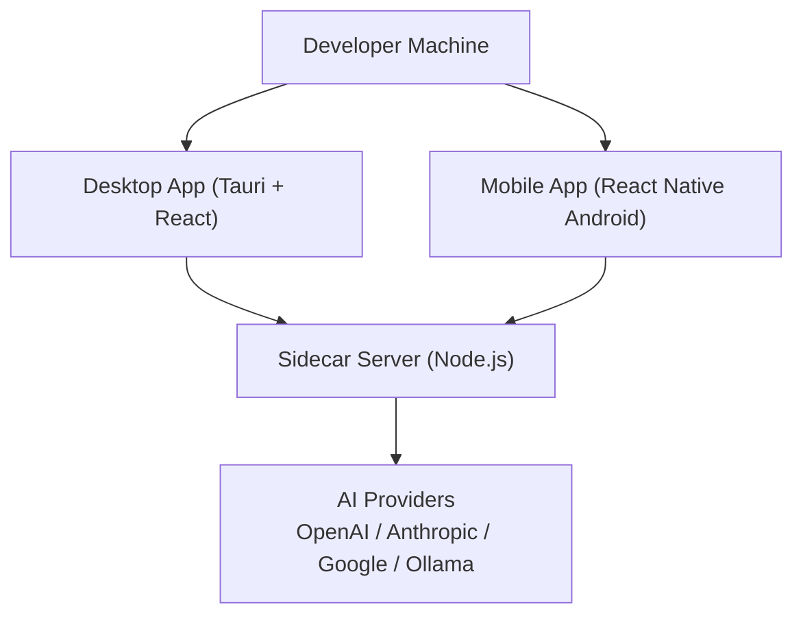

# Getting Started

<cite>
**Referenced Files in This Document**
- [README.md](file://README.md)
- [package.json](file://package.json)
- [pnpm-workspace.yaml](file://pnpm-workspace.yaml)
- [apps/desktop/package.json](file://apps/desktop/package.json)
- [apps/desktop/src-tauri/Cargo.toml](file://apps/desktop/src-tauri/Cargo.toml)
- [apps/desktop/src-tauri/tauri.conf.json](file://apps/desktop/src-tauri/tauri.conf.json)
- [apps/desktop/scripts/build-sidecar.mjs](file://apps/desktop/scripts/build-sidecar.mjs)
- [apps/desktop/src-tauri/sidecar/server.mjs](file://apps/desktop/src-tauri/sidecar/server.mjs)
- [apps/mobile/package.json](file://apps/mobile/package.json)
- [apps/mobile/android/app/src/main/AndroidManifest.xml](file://apps/mobile/android/app/src/main/AndroidManifest.xml)
- [apps/mobile/app.json](file://apps/mobile/app.json)
- [packages/shared/src/constants.ts](file://packages/shared/src/constants.ts)
- [packages/ai-engine/src/providers/ollama.ts](file://packages/ai-engine/src/providers/ollama.ts)
- [packages/ai-engine/src/router/unifiedRouter.ts](file://packages/ai-engine/src/router/unifiedRouter.ts)
- [packages/ai-engine/src/utils/secure-key-loader.ts](file://packages/ai-engine/src/utils/secure-key-loader.ts)
</cite>

## Table of Contents
1. [Introduction](#introduction)
2. [Prerequisites](#prerequisites)
3. [Installation Steps](#installation-steps)
4. [Environment Configuration](#environment-configuration)
5. [Build the Sidecar Server](#build-the-sidecar-server)
6. [Run in Development Mode](#run-in-development-mode)
7. [Architecture Overview](#architecture-overview)
8. [Troubleshooting Guide](#troubleshooting-guide)
9. [Conclusion](#conclusion)

## Introduction
This guide helps you set up GHITA CODING AGENT for development on Windows or Linux. The project consists of:
- A Tauri + React desktop app (Windows/Linux)
- A React Native Android mobile app (Android 9+)
- A Node.js sidecar server for communication and AI operations
- A shared AI engine supporting multiple providers (OpenAI, Anthropic, Google, Ollama, and more)

The desktop app requires a sidecar server to enable features like remote control, terminal access, and AI orchestration.

## Prerequisites
Ensure your system meets the following requirements before installation:
- Node.js >= 20
- pnpm >= 10.x
- Rust (required for Tauri desktop builds)
- Android Studio (required for React Native Android builds)
- Android device or emulator running Android 9+ (API 28+)
- Git

These requirements are documented in the project’s README and enforced by the workspace configuration.

**Section sources**
- [README.md:84-92](file://README.md#L84-L92)
- [package.json:40-43](file://package.json#L40-L43)
- [apps/desktop/src-tauri/Cargo.toml:1-32](file://apps/desktop/src-tauri/Cargo.toml#L1-L32)
- [apps/mobile/android/app/src/main/AndroidManifest.xml:1-38](file://apps/mobile/android/app/src/main/AndroidManifest.xml#L1-L38)

## Installation Steps
Follow these steps to prepare your environment and install dependencies:

1) Clone the repository
- Use Git to clone the project and enter the directory.

2) Install dependencies
- Run the workspace install command to install all packages and apps.

3) Configure environment variables
- Copy the example environment file to .env and add your AI provider API keys.

4) Build the sidecar server (required)
- Navigate to the sidecar directory and build the server bundle.

5) Run in development mode
- Start the desktop app (Tauri + React) and the mobile app (React Native Android) in separate terminals.

Notes:
- The README documents the exact commands for each step.
- The desktop app uses Tauri CLI and Vite for development.
- The mobile app uses React Native CLI for Android.

**Section sources**
- [README.md:93-139](file://README.md#L93-L139)
- [package.json:9-26](file://package.json#L9-L26)
- [apps/desktop/package.json:7-16](file://apps/desktop/package.json#L7-L16)
- [apps/mobile/package.json:6-16](file://apps/mobile/package.json#L6-L16)

## Environment Configuration
Configure environment variables for AI providers and communication:

- Copy the example environment file to .env and add your API keys.
- At minimum, configure one AI provider (OpenAI, Anthropic, Google, or Ollama).
- For local AI, set the Ollama base URL and ensure Ollama is running locally.
- The default Socket.IO server port is 8080 (configurable via an environment variable).

The sidecar server reads the active provider configuration and synchronizes it to the AI orchestrator. The shared constants define defaults for Ollama and the Socket.IO port.

**Section sources**
- [README.md:106-119](file://README.md#L106-L119)
- [apps/desktop/src-tauri/sidecar/server.mjs:698-752](file://apps/desktop/src-tauri/sidecar/server.mjs#L698-L752)
- [packages/shared/src/constants.ts:13](file://packages/shared/src/constants.ts#L13)
- [packages/shared/src/constants.ts:49](file://packages/shared/src/constants.ts#L49)

## Build the Sidecar Server
The desktop app requires a Node.js sidecar server for communication and AI operations. The sidecar is built with esbuild and includes resources for screenshots and terminal support.

Steps:
- Navigate to the sidecar directory.
- Run the build script to bundle the server and copy required assets.
- The build script also patches a Windows-specific helper to avoid crashes in headless environments.

After building, the desktop app loads the sidecar during runtime.

**Section sources**
- [README.md:120-129](file://README.md#L120-L129)
- [apps/desktop/scripts/build-sidecar.mjs:14-48](file://apps/desktop/scripts/build-sidecar.mjs#L14-L48)
- [apps/desktop/scripts/build-sidecar.mjs:64-100](file://apps/desktop/scripts/build-sidecar.mjs#L64-L100)

## Run in Development Mode
Start the development servers for both desktop and mobile:

- Desktop (Tauri + React)
  - Use the dedicated script to launch the Tauri app in development mode.
  - The Tauri configuration defines the frontend dev URL and resources to bundle.

- Mobile (React Native Android)
  - Use the React Native script to start Metro and run the Android app.
  - The Android manifest declares required permissions for networking and Bluetooth.

Ensure the sidecar server is built and running before launching the desktop app.

**Section sources**
- [README.md:131-139](file://README.md#L131-L139)
- [apps/desktop/package.json:7-16](file://apps/desktop/package.json#L7-L16)
- [apps/desktop/src-tauri/tauri.conf.json:6-11](file://apps/desktop/src-tauri/tauri.conf.json#L6-L11)
- [apps/mobile/package.json:6-16](file://apps/mobile/package.json#L6-L16)
- [apps/mobile/android/app/src/main/AndroidManifest.xml:1-38](file://apps/mobile/android/app/src/main/AndroidManifest.xml#L1-L38)

## Architecture Overview
The development setup involves three primary components communicating through a sidecar server:

How it works:
- The desktop app launches the sidecar server and communicates with it over Socket.IO.
- The sidecar server loads active AI provider configurations and exposes capabilities to the desktop UI.
- The mobile app connects to the sidecar server to enable remote control and pairing.

**Diagram sources**
- [apps/desktop/src-tauri/tauri.conf.json:6-11](file://apps/desktop/src-tauri/tauri.conf.json#L6-L11)
- [apps/desktop/src-tauri/sidecar/server.mjs:698-752](file://apps/desktop/src-tauri/sidecar/server.mjs#L698-L752)
- [apps/mobile/android/app/src/main/AndroidManifest.xml:1-38](file://apps/mobile/android/app/src/main/AndroidManifest.xml#L1-L38)

## Troubleshooting Guide
Common setup issues and resolutions:

- Desktop app won’t start
  - Ensure Rust is installed and Node.js >= 20 is available.
  - Rebuild the sidecar server if needed.
  - Check that port 8080 is not already in use.

- Mobile app can’t connect to desktop
  - Ensure both devices are on the same network.
  - Confirm the communication server is running (check the Dashboard view).
  - Verify the pairing code is correct.
  - Try using a manual IP address instead of cloud discovery.

- AI provider not working
  - Verify API keys are present in .env.
  - Confirm the provider is enabled in the API Manager.
  - For Ollama, ensure it is running locally and reachable at the configured base URL.
  - Check network connectivity for cloud providers.

- Skills not working
  - Some skills require specific adapters (file, terminal, screenshot).
  - Computer and browser skills are disabled by default for security.
  - Enable skills in the Skills view if needed.
  - Ensure required tools are installed (e.g., git, docker).

**Section sources**
- [README.md:143-168](file://README.md#L143-L168)
- [apps/desktop/src-tauri/sidecar/server.mjs:698-752](file://apps/desktop/src-tauri/sidecar/server.mjs#L698-L752)
- [packages/ai-engine/src/providers/ollama.ts:20-33](file://packages/ai-engine/src/providers/ollama.ts#L20-L33)

## Conclusion
You are now ready to develop GHITA CODING AGENT. Ensure all prerequisites are met, the sidecar server is built, and environment variables are configured. Start the desktop and mobile apps in development mode, and use the troubleshooting tips if you encounter issues.