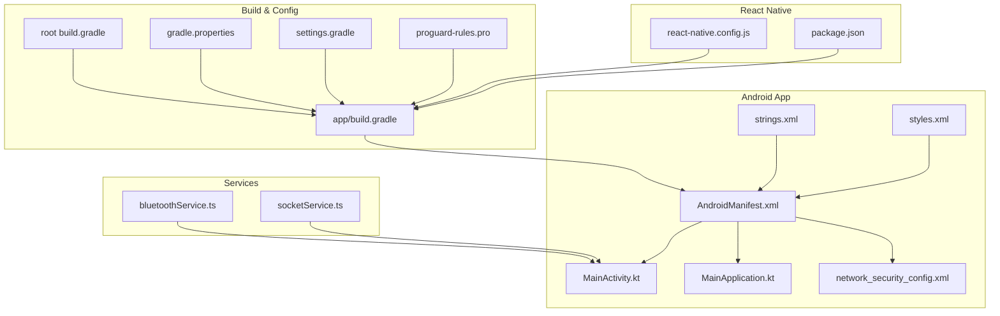
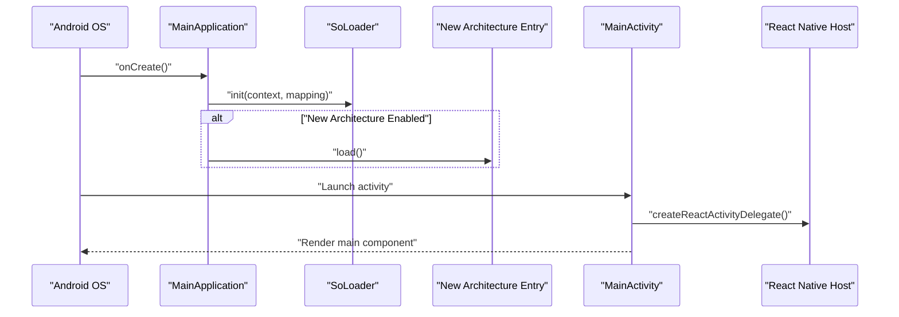
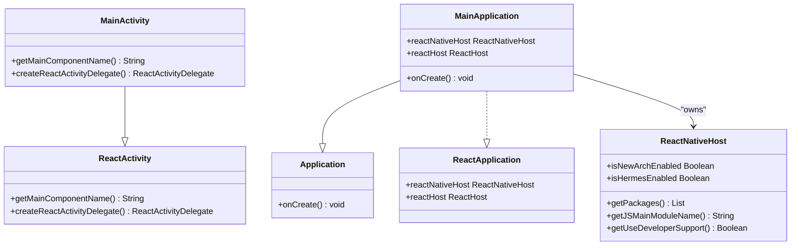
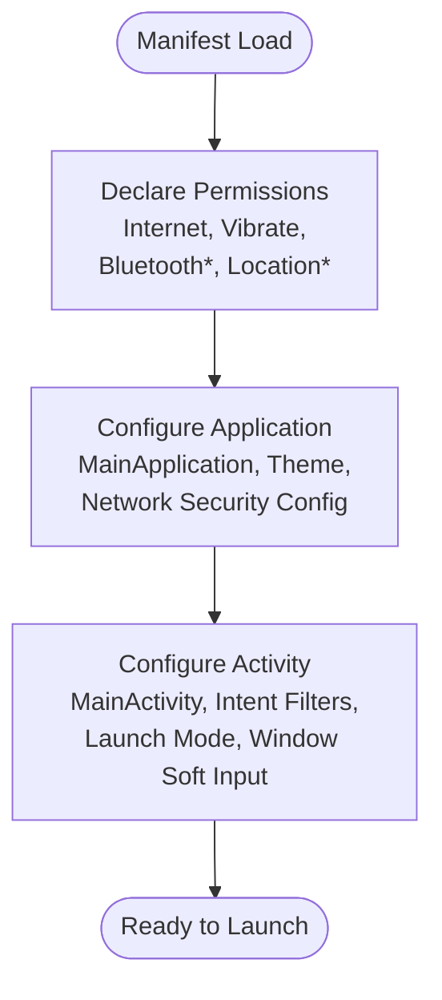
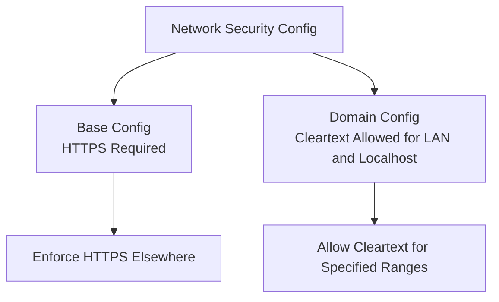
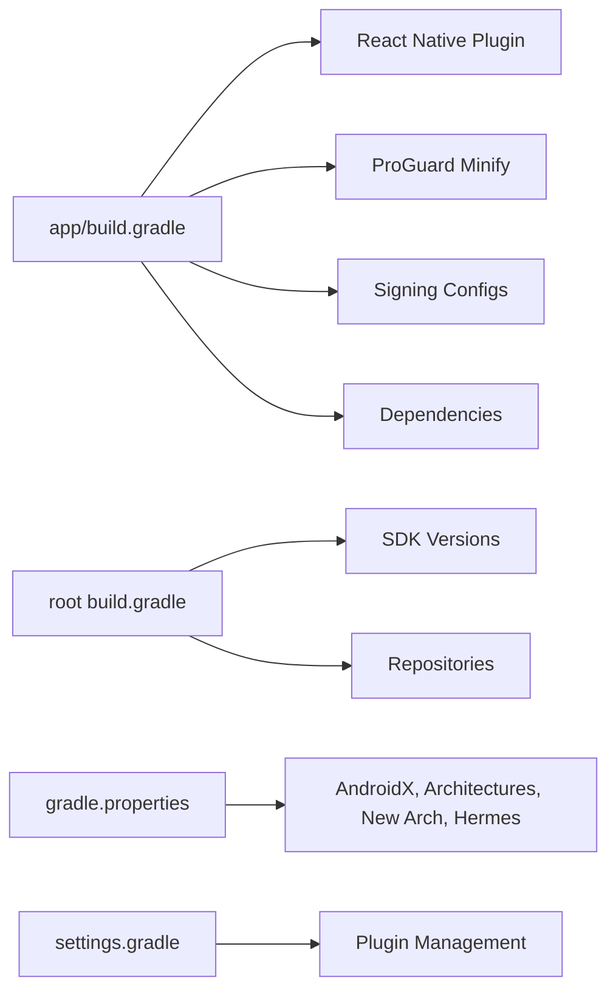
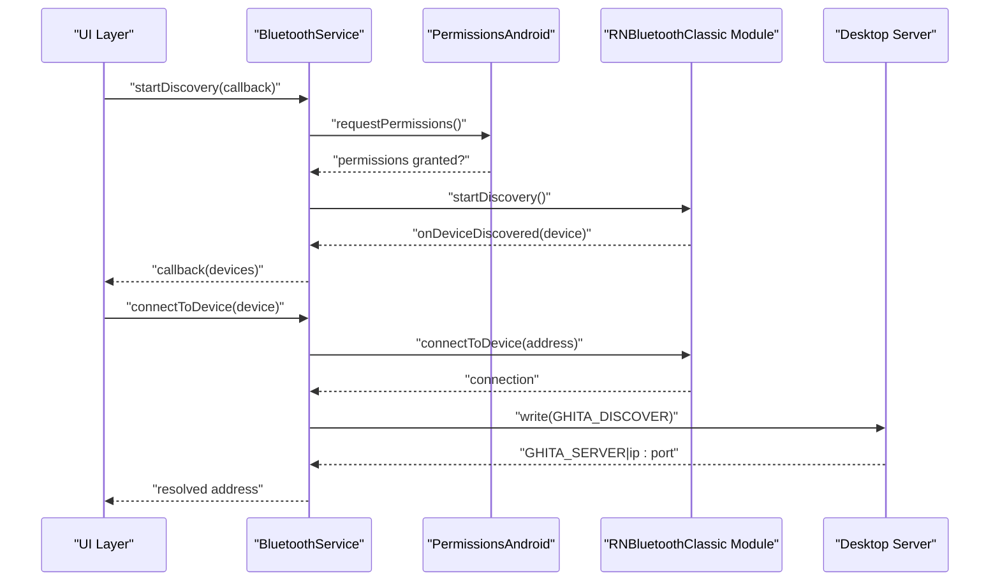
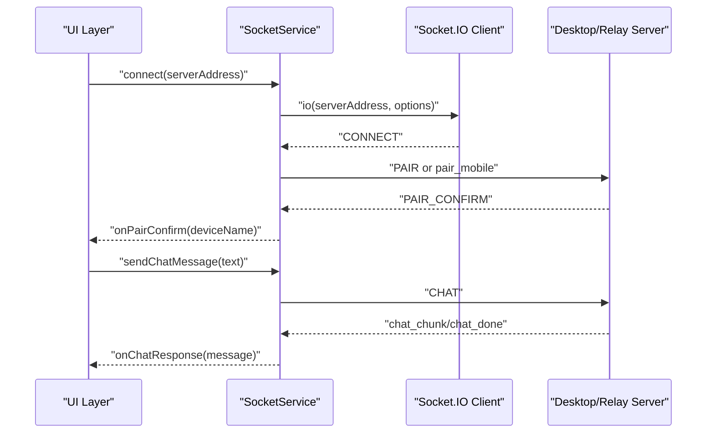
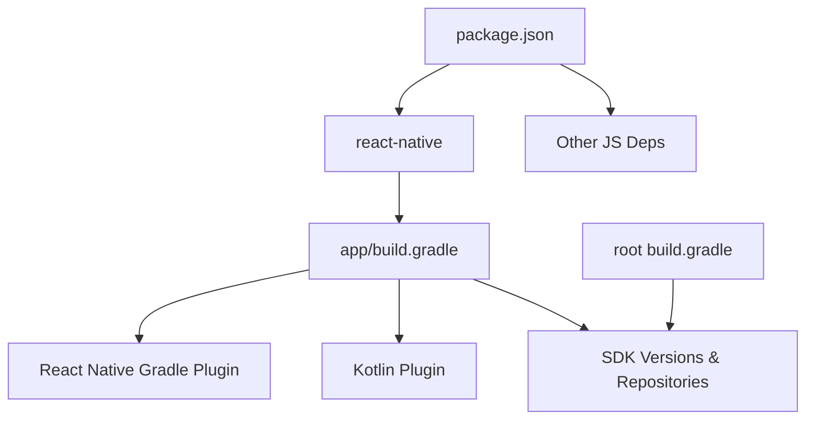

# Android Application

<cite>
**Referenced Files in This Document**
- [MainActivity.kt](file://apps/mobile/android/app/src/main/java/com/ghitamobile/MainActivity.kt)
- [MainApplication.kt](file://apps/mobile/android/app/src/main/java/com/ghitamobile/MainApplication.kt)
- [AndroidManifest.xml](file://apps/mobile/android/app/src/main/AndroidManifest.xml)
- [network_security_config.xml](file://apps/mobile/android/app/src/main/res/xml/network_security_config.xml)
- [strings.xml](file://apps/mobile/android/app/src/main/res/values/strings.xml)
- [styles.xml](file://apps/mobile/android/app/src/main/res/values/styles.xml)
- [build.gradle (app)](file://apps/mobile/android/app/build.gradle)
- [proguard-rules.pro](file://apps/mobile/android/app/proguard-rules.pro)
- [build.gradle (root)](file://apps/mobile/android/build.gradle)
- [gradle.properties](file://apps/mobile/android/gradle.properties)
- [settings.gradle](file://apps/mobile/android/settings.gradle)
- [react-native.config.js](file://apps/mobile/react-native.config.js)
- [package.json](file://apps/mobile/package.json)
- [bluetoothService.ts](file://apps/mobile/src/services/bluetoothService.ts)
- [socketService.ts](file://apps/mobile/src/services/socketService.ts)
</cite>

## Table of Contents
1. [Introduction](#introduction)
2. [Project Structure](#project-structure)
3. [Core Components](#core-components)
4. [Architecture Overview](#architecture-overview)
5. [Detailed Component Analysis](#detailed-component-analysis)
6. [Dependency Analysis](#dependency-analysis)
7. [Performance Considerations](#performance-considerations)
8. [Troubleshooting Guide](#troubleshooting-guide)
9. [Conclusion](#conclusion)
10. [Appendices](#appendices)

## Introduction
This document provides comprehensive Android application documentation for the mobile component of the GHITA Coding Agent. It focuses on the Android entry point and initialization, manifest configuration, build and packaging settings, Android-specific features (Bluetooth, network security), and operational guidance for development, debugging, and deployment. The content is derived from the repository’s Android implementation files and related configuration.

## Project Structure
The Android application resides under apps/mobile/android and integrates with React Native. Key areas include:
- Kotlin entry points: MainActivity.kt and MainApplication.kt
- Manifest and resources: AndroidManifest.xml, network_security_config.xml, strings.xml, styles.xml
- Build configuration: app/build.gradle, root build.gradle, gradle.properties, settings.gradle
- ProGuard rules: proguard-rules.pro
- React Native configuration: react-native.config.js and package.json
- Services: bluetoothService.ts and socketService.ts (JavaScript/TypeScript) that integrate with native capabilities

**Diagram sources**
- [AndroidManifest.xml:1-38](file://apps/mobile/android/app/src/main/AndroidManifest.xml#L1-L38)
- [MainActivity.kt:1-23](file://apps/mobile/android/app/src/main/java/com/ghitamobile/MainActivity.kt#L1-L23)
- [MainApplication.kt:1-45](file://apps/mobile/android/app/src/main/java/com/ghitamobile/MainApplication.kt#L1-L45)
- [network_security_config.xml:1-18](file://apps/mobile/android/app/src/main/res/xml/network_security_config.xml#L1-L18)
- [strings.xml:1-4](file://apps/mobile/android/app/src/main/res/values/strings.xml#L1-L4)
- [styles.xml:1-10](file://apps/mobile/android/app/src/main/res/values/styles.xml#L1-L10)
- [build.gradle (app):1-104](file://apps/mobile/android/app/build.gradle#L1-L104)
- [build.gradle (root):1-68](file://apps/mobile/android/build.gradle#L1-L68)
- [gradle.properties:1-41](file://apps/mobile/android/gradle.properties#L1-L41)
- [settings.gradle:1-22](file://apps/mobile/android/settings.gradle#L1-L22)
- [proguard-rules.pro:1-44](file://apps/mobile/android/app/proguard-rules.pro#L1-L44)
- [react-native.config.js:1-11](file://apps/mobile/react-native.config.js#L1-L11)
- [package.json:1-44](file://apps/mobile/package.json#L1-L44)
- [bluetoothService.ts:1-234](file://apps/mobile/src/services/bluetoothService.ts#L1-L234)
- [socketService.ts:1-525](file://apps/mobile/src/services/socketService.ts#L1-L525)

**Section sources**
- [AndroidManifest.xml:1-38](file://apps/mobile/android/app/src/main/AndroidManifest.xml#L1-L38)
- [build.gradle (app):1-104](file://apps/mobile/android/app/build.gradle#L1-L104)
- [build.gradle (root):1-68](file://apps/mobile/android/build.gradle#L1-L68)
- [gradle.properties:1-41](file://apps/mobile/android/gradle.properties#L1-L41)
- [settings.gradle:1-22](file://apps/mobile/android/settings.gradle#L1-L22)
- [react-native.config.js:1-11](file://apps/mobile/react-native.config.js#L1-L11)
- [package.json:1-44](file://apps/mobile/package.json#L1-L44)

## Core Components
- MainActivity.kt: ReactActivity subclass that defines the main component name and delegates to the default React Activity delegate with optional New Architecture and Fabric flags.
- MainApplication.kt: Application class implementing ReactApplication, configuring ReactNativeHost, ReactHost, SoLoader initialization, and New Architecture/Hermes toggles based on build configuration.
- AndroidManifest.xml: Declares permissions (Internet, Vibrate, Bluetooth, Location), network security configuration, and the exported MainActivity with MAIN/LAUNCHER intent filter.
- Resources: strings.xml and styles.xml define app name and base theme.
- Build configuration: app/build.gradle sets React Native plugin, ProGuard/minification, signing, and dependencies; root build.gradle defines SDK versions and repositories; gradle.properties enables AndroidX, architectures, New Architecture, and Hermes.

**Section sources**
- [MainActivity.kt:1-23](file://apps/mobile/android/app/src/main/java/com/ghitamobile/MainActivity.kt#L1-L23)
- [MainApplication.kt:1-45](file://apps/mobile/android/app/src/main/java/com/ghitamobile/MainApplication.kt#L1-L45)
- [AndroidManifest.xml:1-38](file://apps/mobile/android/app/src/main/AndroidManifest.xml#L1-L38)
- [strings.xml:1-4](file://apps/mobile/android/app/src/main/res/values/strings.xml#L1-L4)
- [styles.xml:1-10](file://apps/mobile/android/app/src/main/res/values/styles.xml#L1-L10)
- [build.gradle (app):1-104](file://apps/mobile/android/app/build.gradle#L1-L104)
- [build.gradle (root):1-68](file://apps/mobile/android/build.gradle#L1-L68)
- [gradle.properties:1-41](file://apps/mobile/android/gradle.properties#L1-L41)

## Architecture Overview
The Android app initializes through MainApplication.onCreate, loads native modules via SoLoader, and conditionally initializes the New Architecture entry point. MainActivity bridges to the React Native renderer and component. The app declares permissions and network security policies in the manifest and resources. Services in the React Native layer handle Bluetooth discovery and Socket.IO communication.

**Diagram sources**
- [MainApplication.kt:36-43](file://apps/mobile/android/app/src/main/java/com/ghitamobile/MainApplication.kt#L36-L43)
- [MainActivity.kt:20-21](file://apps/mobile/android/app/src/main/java/com/ghitamobile/MainActivity.kt#L20-L21)

**Section sources**
- [MainApplication.kt:36-43](file://apps/mobile/android/app/src/main/java/com/ghitamobile/MainApplication.kt#L36-L43)
- [MainActivity.kt:20-21](file://apps/mobile/android/app/src/main/java/com/ghitamobile/MainActivity.kt#L20-L21)

## Detailed Component Analysis

### Android Entry Point and Lifecycle
- MainActivity.kt
  - getMainComponentName returns the top-level React component name.
  - createReactActivityDelegate returns a DefaultReactActivityDelegate configured with fabricEnabled flag.
- MainApplication.kt
  - Implements ReactApplication with a custom ReactNativeHost that supplies packages, JS entry, developer support flag, and New Architecture/Hermes flags.
  - Initializes SoLoader and conditionally loads the New Architecture entry point during onCreate.

**Diagram sources**
- [MainActivity.kt:8-21](file://apps/mobile/android/app/src/main/java/com/ghitamobile/MainActivity.kt#L8-L21)
- [MainApplication.kt:17-31](file://apps/mobile/android/app/src/main/java/com/ghitamobile/MainApplication.kt#L17-L31)

**Section sources**
- [MainActivity.kt:8-21](file://apps/mobile/android/app/src/main/java/com/ghitamobile/MainActivity.kt#L8-L21)
- [MainApplication.kt:17-31](file://apps/mobile/android/app/src/main/java/com/ghitamobile/MainApplication.kt#L17-L31)

### AndroidManifest Configuration
- Permissions
  - INTERNET and VIBRATE are declared.
  - Bluetooth permissions include legacy BLUETOOTH and BLUETOOTH_ADMIN up to SDK 30, plus BLUETOOTH_SCAN, BLUETOOTH_CONNECT, and BLUETOOTH_ADVERTISE for newer Android versions.
  - ACCESS_FINE_LOCATION and ACCESS_COARSE_LOCATION are declared for location-based Bluetooth discovery.
- Application attributes
  - name references MainApplication.
  - networkSecurityConfig references network_security_config.xml.
  - RTL support and theme applied.
- Activity
  - MainActivity is exported with MAIN and LAUNCHER intent filters, singleTask launch mode, and extensive configChanges handling.

**Diagram sources**
- [AndroidManifest.xml:3-35](file://apps/mobile/android/app/src/main/AndroidManifest.xml#L3-L35)

**Section sources**
- [AndroidManifest.xml:3-35](file://apps/mobile/android/app/src/main/AndroidManifest.xml#L3-L35)

### Network Security Policy
- network_security_config.xml
  - Allows cleartext traffic for local LAN ranges (10.0.0.0/8, 172.16.0.0/12, 192.168.0.0/16) and localhost/127.0.0.1.
  - Requires HTTPS for all other domains via base-config with system trust anchors.

**Diagram sources**
- [network_security_config.xml:1-18](file://apps/mobile/android/app/src/main/res/xml/network_security_config.xml#L1-L18)

**Section sources**
- [network_security_config.xml:1-18](file://apps/mobile/android/app/src/main/res/xml/network_security_config.xml#L1-L18)

### Build and Packaging Configuration
- app/build.gradle
  - Applies React Native and Kotlin plugins.
  - Enables ProGuard for release builds.
  - Sets root project for autolinking and selects JSC flavor.
  - Defines signingConfigs for debug and release; release signing requires environment variables or gradle.properties entries.
  - Configures buildTypes with minifyEnabled and proguardFiles pointing to proguard-rules.pro.
  - Dependencies include react-android and conditionally hermes-android or JSC.
- root build.gradle
  - Declares repositories and SDK versions (minSdkVersion 24, compileSdkVersion 35, targetSdkVersion 34).
  - Forces subprojects to use mavenCentral and suppresses warnings.
- gradle.properties
  - Enables AndroidX, selected architectures, New Architecture, and Hermes.
  - JVM and parallelization settings optimized for build performance.
- settings.gradle
  - Configures plugin management and includes the React Native gradle plugin build.

**Diagram sources**
- [build.gradle (app):1-104](file://apps/mobile/android/app/build.gradle#L1-L104)
- [build.gradle (root):13-20](file://apps/mobile/android/build.gradle#L13-L20)
- [gradle.properties:24-40](file://apps/mobile/android/gradle.properties#L24-L40)
- [settings.gradle:1-22](file://apps/mobile/android/settings.gradle#L1-L22)

**Section sources**
- [build.gradle (app):1-104](file://apps/mobile/android/app/build.gradle#L1-L104)
- [build.gradle (root):13-20](file://apps/mobile/android/build.gradle#L13-L20)
- [gradle.properties:24-40](file://apps/mobile/android/gradle.properties#L24-L40)
- [settings.gradle:1-22](file://apps/mobile/android/settings.gradle#L1-L22)

### ProGuard Optimization Rules
- Keeps React Native, Hermes, JNI, Socket.IO, OkHttp, AsyncStorage, and Bluetooth-related classes.
- Warns for certain packages and removes logging in release builds.

**Section sources**
- [proguard-rules.pro:1-44](file://apps/mobile/android/app/proguard-rules.pro#L1-L44)

### Android-Specific Features
- Bluetooth Permissions and Discovery
  - Manifest declares Bluetooth and location permissions.
  - bluetoothService.ts handles runtime permission requests (BLUETOOTH_SCAN, BLUETOOTH_CONNECT, ACCESS_FINE_LOCATION on Android 12+; ACCESS_FINE_LOCATION on older versions), device discovery, bonding, and connection to send discovery commands and parse server responses.
- Network Security Policies
  - Cleartext allowed for LAN and localhost; HTTPS enforced elsewhere.
- Background Service Handling
  - No explicit background service is declared in the manifest. Socket.IO client runs within the app lifecycle; Bluetooth operations are initiated by the app and do not imply persistent background services.

**Diagram sources**
- [AndroidManifest.xml:6-13](file://apps/mobile/android/app/src/main/AndroidManifest.xml#L6-L13)
- [bluetoothService.ts:63-152](file://apps/mobile/src/services/bluetoothService.ts#L63-L152)
- [bluetoothService.ts:171-223](file://apps/mobile/src/services/bluetoothService.ts#L171-L223)

**Section sources**
- [AndroidManifest.xml:6-13](file://apps/mobile/android/app/src/main/AndroidManifest.xml#L6-L13)
- [bluetoothService.ts:63-152](file://apps/mobile/src/services/bluetoothService.ts#L63-L152)
- [bluetoothService.ts:171-223](file://apps/mobile/src/services/bluetoothService.ts#L171-L223)

### Socket.IO Client Integration
- socketService.ts manages connection lifecycle, pairing, events, and reconnection strategies.
- Supports local LAN and cloud modes, with automatic reconnection attempts and health checks for local mode.
- Emits and listens to domain-specific events for chat, screenshots, approvals, telemetry, and language sync.

**Diagram sources**
- [socketService.ts:80-111](file://apps/mobile/src/services/socketService.ts#L80-L111)
- [socketService.ts:330-407](file://apps/mobile/src/services/socketService.ts#L330-L407)
- [socketService.ts:424-463](file://apps/mobile/src/services/socketService.ts#L424-L463)

**Section sources**
- [socketService.ts:80-111](file://apps/mobile/src/services/socketService.ts#L80-L111)
- [socketService.ts:330-407](file://apps/mobile/src/services/socketService.ts#L330-L407)
- [socketService.ts:424-463](file://apps/mobile/src/services/socketService.ts#L424-L463)

## Dependency Analysis
- React Native and JavaScript dependencies are managed in package.json.
- Android build depends on React Native Gradle plugin, Kotlin, and platform SDKs defined in root build.gradle.
- The app build.gradle depends on autolinking and selects JSC or Hermes based on hermesEnabled.

**Diagram sources**
- [package.json:17-28](file://apps/mobile/package.json#L17-L28)
- [build.gradle (app):2-3](file://apps/mobile/android/app/build.gradle#L2-L3)
- [build.gradle (root):13-20](file://apps/mobile/android/build.gradle#L13-L20)

**Section sources**
- [package.json:17-28](file://apps/mobile/package.json#L17-L28)
- [build.gradle (app):2-3](file://apps/mobile/android/app/build.gradle#L2-L3)
- [build.gradle (root):13-20](file://apps/mobile/android/build.gradle#L13-L20)

## Performance Considerations
- Enable New Architecture and Hermes as configured to improve rendering and JS performance.
- Use ProGuard/minification in release builds to reduce APK size and bytecode overhead.
- Optimize JVM and Gradle settings in gradle.properties for faster builds.
- Limit unnecessary re-renders in React components and avoid heavy synchronous work on the UI thread.
- Prefer WebSocket transport and polling with appropriate timeouts and reconnection delays as configured.

[No sources needed since this section provides general guidance]

## Troubleshooting Guide
- Release signing failures
  - Symptom: Build fails due to missing release keystore credentials.
  - Resolution: Provide GHITA_RELEASE_KEYSTORE_PATH, GHITA_RELEASE_KEYSTORE_PASSWORD, GHITA_RELEASE_KEY_ALIAS, and GHITA_RELEASE_KEY_PASSWORD via environment variables or gradle.properties. Alternatively, build debug variants locally.
  - Reference: [build.gradle (app):56-80](file://apps/mobile/android/app/build.gradle#L56-L80)
- ProGuard-related runtime issues
  - Symptom: Crashes or missing classes after release build.
  - Resolution: Review proguard-rules.pro keeps for React Native, Socket.IO, OkHttp, AsyncStorage, and Bluetooth modules; ensure logging removal does not hide diagnostics.
  - Reference: [proguard-rules.pro:12-43](file://apps/mobile/android/app/proguard-rules.pro#L12-L43)
- Bluetooth permission denials on Android 12+
  - Symptom: Discovery fails due to missing BLUETOOTH_SCAN or BLUETOOTH_CONNECT.
  - Resolution: Ensure runtime permission requests are granted; verify manifest permissions and app target SDK.
  - Reference: [AndroidManifest.xml:6-13](file://apps/mobile/android/app/src/main/AndroidManifest.xml#L6-L13), [bluetoothService.ts:63-88](file://apps/mobile/src/services/bluetoothService.ts#L63-L88)
- Network security policy blocking local LAN
  - Symptom: Cannot connect to local IP addresses in release builds.
  - Resolution: Confirm network_security_config.xml allows cleartext for intended ranges; ensure device/emulator IP falls within allowed CIDRs.
  - Reference: [network_security_config.xml:3-10](file://apps/mobile/android/app/src/main/res/xml/network_security_config.xml#L3-L10)
- Socket.IO connectivity issues
  - Symptom: Repeated reconnection attempts or pairing failures.
  - Resolution: Verify server availability, correct serverAddress, and event handlers; inspect logs for connection_error and error events.
  - Reference: [socketService.ts:372-386](file://apps/mobile/src/services/socketService.ts#L372-L386), [socketService.ts:505-514](file://apps/mobile/src/services/socketService.ts#L505-L514)

**Section sources**
- [build.gradle (app):56-80](file://apps/mobile/android/app/build.gradle#L56-L80)
- [proguard-rules.pro:12-43](file://apps/mobile/android/app/proguard-rules.pro#L12-L43)
- [AndroidManifest.xml:6-13](file://apps/mobile/android/app/src/main/AndroidManifest.xml#L6-L13)
- [bluetoothService.ts:63-88](file://apps/mobile/src/services/bluetoothService.ts#L63-L88)
- [network_security_config.xml:3-10](file://apps/mobile/android/app/src/main/res/xml/network_security_config.xml#L3-L10)
- [socketService.ts:372-386](file://apps/mobile/src/services/socketService.ts#L372-L386)
- [socketService.ts:505-514](file://apps/mobile/src/services/socketService.ts#L505-L514)

## Conclusion
The Android application integrates React Native with a Kotlin entry point and a robust build configuration supporting modern Android development practices. It declares necessary permissions for Bluetooth and network operations, enforces secure defaults with network security policies, and leverages ProGuard for release optimization. The React Native services encapsulate Bluetooth discovery and Socket.IO communication, enabling seamless remote control scenarios. Proper configuration of SDK versions, signing, and permissions ensures reliable development and deployment across supported Android versions.

[No sources needed since this section summarizes without analyzing specific files]

## Appendices

### Android Version Compatibility and SDK Considerations
- minSdkVersion: 24
- compileSdkVersion: 35
- targetSdkVersion: 34
- Notes: Ensure device/emulator targets align with these versions; adjust targetSdkVersion according to platform requirements and testing coverage.

**Section sources**
- [build.gradle (root):15-17](file://apps/mobile/android/build.gradle#L15-L17)

### React Native Configuration References
- react-native.config.js: Points to the Android/iOS source directories.
- package.json: Scripts for building and running the Android app, including release assembly and lint/typecheck.

**Section sources**
- [react-native.config.js:1-11](file://apps/mobile/react-native.config.js#L1-L11)
- [package.json:6-15](file://apps/mobile/package.json#L6-L15)