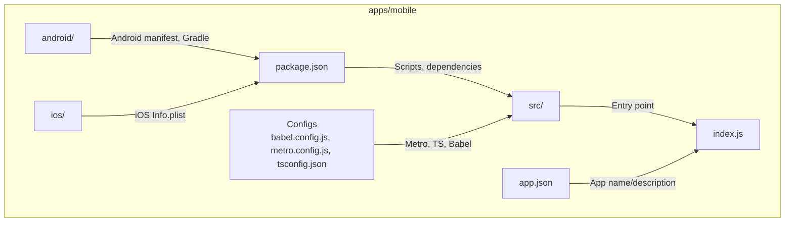
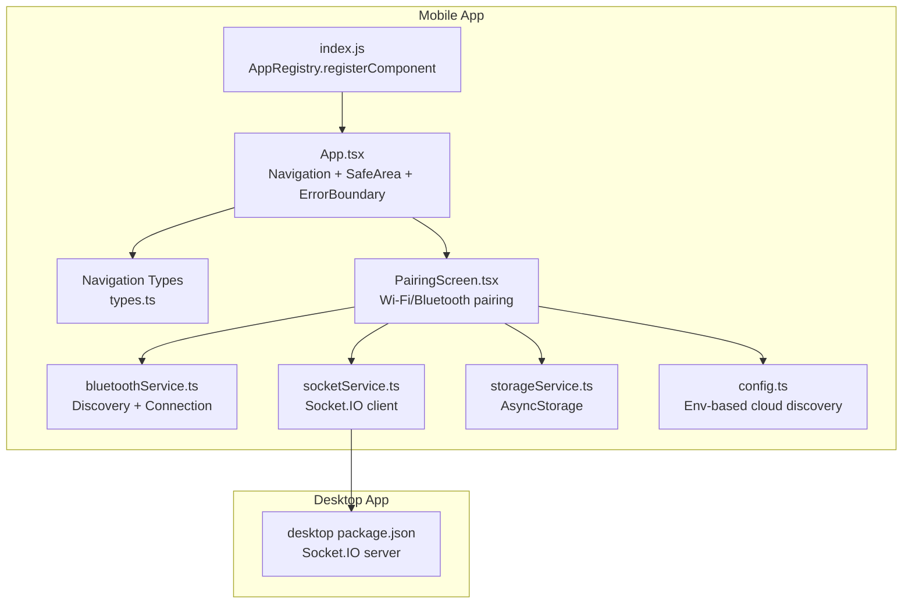
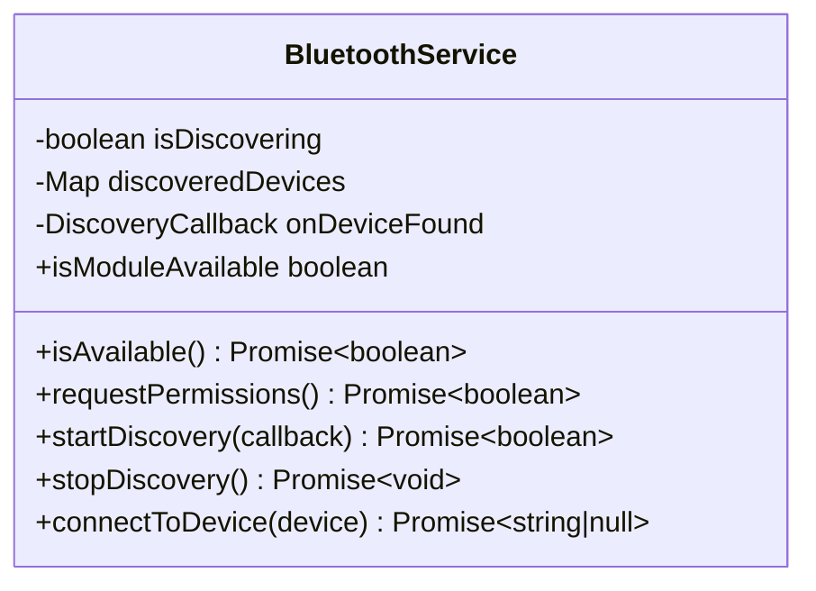
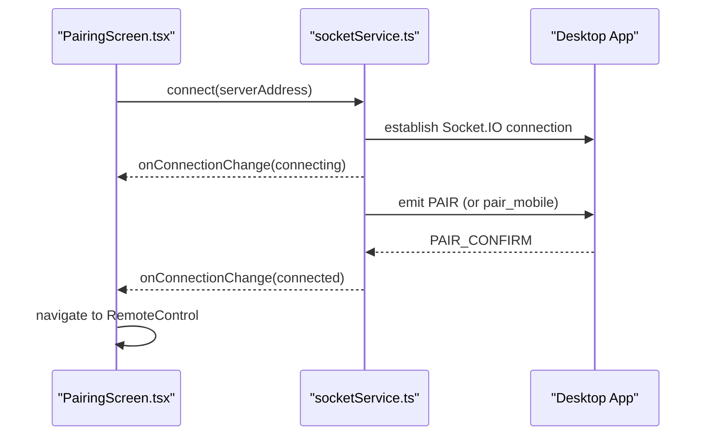
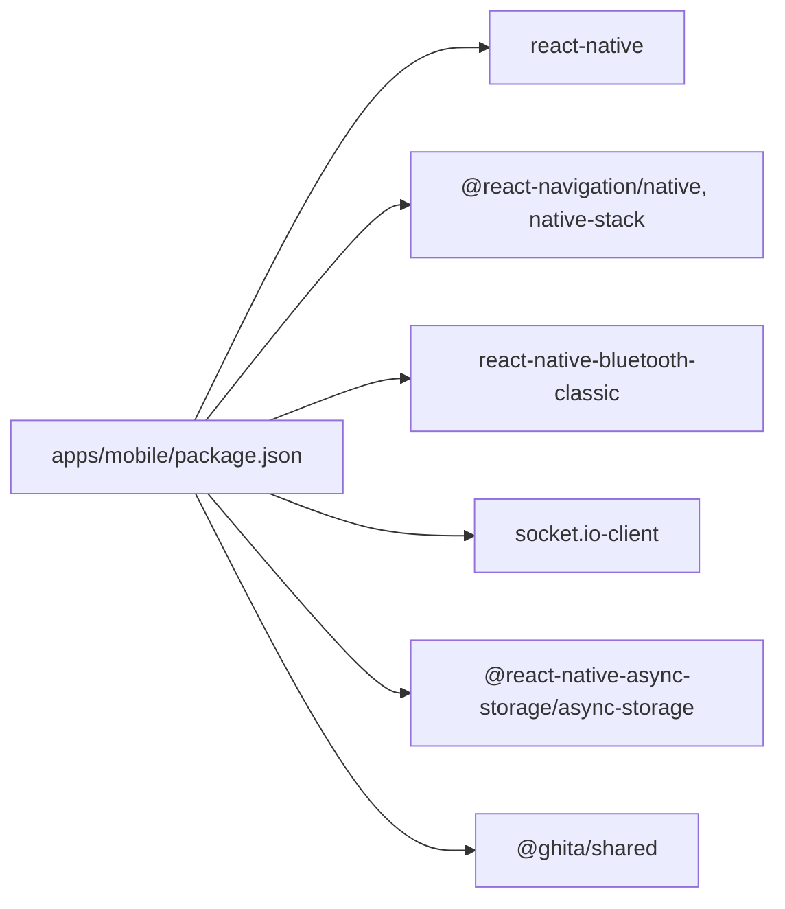

# Mobile Application Overview

<cite>
**Referenced Files in This Document**
- [package.json](file://apps/mobile/package.json)
- [app.json](file://apps/mobile/app.json)
- [babel.config.js](file://apps/mobile/babel.config.js)
- [metro.config.js](file://apps/mobile/metro.config.js)
- [react-native.config.js](file://apps/mobile/react-native.config.js)
- [tsconfig.json](file://apps/mobile/tsconfig.json)
- [AndroidManifest.xml](file://apps/mobile/android/app/src/main/AndroidManifest.xml)
- [android/build.gradle](file://apps/mobile/android/build.gradle)
- [ios/Info.plist](file://apps/mobile/ios/GhitaMobile/Info.plist)
- [App.tsx](file://apps/mobile/src/App.tsx)
- [config.ts](file://apps/mobile/src/config.ts)
- [index.js](file://apps/mobile/index.js)
- [types.ts](file://apps/mobile/src/navigation/types.ts)
- [PairingScreen.tsx](file://apps/mobile/src/screens/PairingScreen.tsx)
- [bluetoothService.ts](file://apps/mobile/src/services/bluetoothService.ts)
- [socketService.ts](file://apps/mobile/src/services/socketService.ts)
- [storageService.ts](file://apps/mobile/src/services/storageService.ts)
- [desktop package.json](file://apps/desktop/package.json)
</cite>

## Table of Contents
1. [Introduction](#introduction)
2. [Project Structure](#project-structure)
3. [Core Components](#core-components)
4. [Architecture Overview](#architecture-overview)
5. [Detailed Component Analysis](#detailed-component-analysis)
6. [Dependency Analysis](#dependency-analysis)
7. [Performance Considerations](#performance-considerations)
8. [Troubleshooting Guide](#troubleshooting-guide)
9. [Conclusion](#conclusion)
10. [Appendices](#appendices)

## Introduction
This document provides a comprehensive overview of the mobile application built with React Native. It explains the cross-platform strategy, integration with the desktop counterpart, project structure, build configuration, and development workflow. It also documents the minimum SDK requirements for Android and iOS, the application architecture (entry point, asset management, and build optimization), and the development environment setup, debugging tools, and testing approaches. Finally, it details the synchronization mechanisms and data flow patterns between the mobile and desktop applications.

## Project Structure
The mobile application resides under apps/mobile and follows a standard React Native project layout with platform-specific folders for Android and iOS, TypeScript configuration, Metro bundler configuration, and a monorepo-aware setup that resolves shared packages from the workspace.

**Diagram sources**
- [package.json:1-44](file://apps/mobile/package.json#L1-L44)
- [babel.config.js:1-4](file://apps/mobile/babel.config.js#L1-L4)
- [metro.config.js:1-43](file://apps/mobile/metro.config.js#L1-L43)
- [tsconfig.json:1-29](file://apps/mobile/tsconfig.json#L1-L29)
- [AndroidManifest.xml:1-38](file://apps/mobile/android/app/src/main/AndroidManifest.xml#L1-L38)
- [ios/Info.plist:1-57](file://apps/mobile/ios/GhitaMobile/Info.plist#L1-L57)
- [index.js:1-11](file://apps/mobile/index.js#L1-L11)
- [app.json:1-5](file://apps/mobile/app.json#L1-L5)

**Section sources**
- [package.json:1-44](file://apps/mobile/package.json#L1-L44)
- [babel.config.js:1-4](file://apps/mobile/babel.config.js#L1-L4)
- [metro.config.js:1-43](file://apps/mobile/metro.config.js#L1-L43)
- [tsconfig.json:1-29](file://apps/mobile/tsconfig.json#L1-L29)
- [react-native.config.js:1-11](file://apps/mobile/react-native.config.js#L1-L11)
- [AndroidManifest.xml:1-38](file://apps/mobile/android/app/src/main/AndroidManifest.xml#L1-L38)
- [ios/Info.plist:1-57](file://apps/mobile/ios/GhitaMobile/Info.plist#L1-L57)
- [index.js:1-11](file://apps/mobile/index.js#L1-L11)
- [app.json:1-5](file://apps/mobile/app.json#L1-L5)

## Core Components
- Entry point and app bootstrap:
  - The React Native entry point registers the app component with the platform runtime.
  - The root component composes navigation, safe area provider, internationalization, and an error boundary.
- Navigation:
  - A native stack navigator defines three screens: Pairing, RemoteControl, and Settings.
- Services:
  - Bluetooth service for device discovery and connection.
  - Socket service for real-time communication with the desktop.
  - Storage service for persistent settings, paired devices, last server address, device ID, and auth token.
- Configuration:
  - Environment-driven configuration for cloud discovery endpoints and keys.

**Section sources**
- [index.js:1-11](file://apps/mobile/index.js#L1-L11)
- [App.tsx:1-102](file://apps/mobile/src/App.tsx#L1-L102)
- [types.ts:1-21](file://apps/mobile/src/navigation/types.ts#L1-L21)
- [bluetoothService.ts:1-234](file://apps/mobile/src/services/bluetoothService.ts#L1-L234)
- [socketService.ts:1-525](file://apps/mobile/src/services/socketService.ts#L1-L525)
- [storageService.ts:1-147](file://apps/mobile/src/services/storageService.ts#L1-L147)
- [config.ts:1-9](file://apps/mobile/src/config.ts#L1-L9)

## Architecture Overview
The mobile application uses React Native to deliver a cross-platform client that pairs with a desktop counterpart via Wi-Fi or Bluetooth. The pairing process discovers the desktop endpoint, establishes a Socket.IO session, and synchronizes state and commands bidirectionally.

**Diagram sources**
- [index.js:1-11](file://apps/mobile/index.js#L1-L11)
- [App.tsx:1-102](file://apps/mobile/src/App.tsx#L1-L102)
- [types.ts:1-21](file://apps/mobile/src/navigation/types.ts#L1-L21)
- [PairingScreen.tsx:1-797](file://apps/mobile/src/screens/PairingScreen.tsx#L1-L797)
- [bluetoothService.ts:1-234](file://apps/mobile/src/services/bluetoothService.ts#L1-L234)
- [socketService.ts:1-525](file://apps/mobile/src/services/socketService.ts#L1-L525)
- [storageService.ts:1-147](file://apps/mobile/src/services/storageService.ts#L1-L147)
- [config.ts:1-9](file://apps/mobile/src/config.ts#L1-L9)
- [desktop package.json:1-61](file://apps/desktop/package.json#L1-L61)

## Detailed Component Analysis

### Cross-Platform Strategy and Build Configuration
- React Native version and ecosystem:
  - The project targets a modern React Native version and integrates with community plugins and navigation libraries.
- Metro configuration:
  - The bundler is configured for a pnpm monorepo, enabling resolution of shared packages from the workspace and supporting platform-specific extensions (.android.js, .ios.js, .native.js).
- TypeScript configuration:
  - Strict TypeScript settings with ES2020 target/module/lib, JSX for React Native, and path mapping to shared packages.
- Babel preset:
  - Uses the official React Native Babel preset for transpilation.
- React Native CLI configuration:
  - Explicitly sets Android and iOS source directories for the CLI.

**Section sources**
- [package.json:1-44](file://apps/mobile/package.json#L1-L44)
- [metro.config.js:1-43](file://apps/mobile/metro.config.js#L1-L43)
- [tsconfig.json:1-29](file://apps/mobile/tsconfig.json#L1-L29)
- [babel.config.js:1-4](file://apps/mobile/babel.config.js#L1-L4)
- [react-native.config.js:1-11](file://apps/mobile/react-native.config.js#L1-L11)

### Android Platform Configuration and Requirements
- Minimum SDK and target SDK:
  - The Gradle configuration defines the minimum SDK version and target SDK version for Android builds.
- Permissions:
  - Internet, vibration, Bluetooth classic, BLE scan/connect/advertising, and location permissions are declared in the manifest.
- Network security:
  - A network security config is referenced to manage cleartext traffic policies.
- Application metadata:
  - The main activity is exported and configured with launch mode and window soft input behavior.

**Section sources**
- [android/build.gradle:13-20](file://apps/mobile/android/build.gradle#L13-L20)
- [AndroidManifest.xml:1-38](file://apps/mobile/android/app/src/main/AndroidManifest.xml#L1-L38)

### iOS Platform Configuration and Requirements
- Bundle identifiers and display name:
  - The Info.plist defines bundle display name and identifiers.
- Security and networking:
  - Arbitrary loads are disallowed; local networking is permitted.
- Bluetooth usage descriptions:
  - Descriptions for peripheral and always usage are provided.
- Location usage:
  - Description for location access is included.
- Supported orientations:
  - Portrait and landscape orientations are supported.
- Hardware requirements:
  - Requires arm64 architecture.

**Section sources**
- [ios/Info.plist:1-57](file://apps/mobile/ios/GhitaMobile/Info.plist#L1-L57)

### Entry Point and App Bootstrap
- Entry point registration:
  - The app component is registered with the platform runtime using the app name from app.json.
- Root component composition:
  - The root component wraps the app in an error boundary, safe area provider, navigation container, and i18n provider, and defines a dark navigation theme.

**Section sources**
- [index.js:1-11](file://apps/mobile/index.js#L1-L11)
- [app.json:1-5](file://apps/mobile/app.json#L1-L5)
- [App.tsx:1-102](file://apps/mobile/src/App.tsx#L1-L102)

### Navigation and Screens
- Navigation stack:
  - Three screens are defined: Pairing, RemoteControl, and Settings, with typed parameters for the RemoteControl screen.
- Pairing screen:
  - Implements Wi-Fi and Bluetooth pairing modes, device discovery, connection attempts, and pairing confirmation.

**Section sources**
- [types.ts:1-21](file://apps/mobile/src/navigation/types.ts#L1-L21)
- [PairingScreen.tsx:1-797](file://apps/mobile/src/screens/PairingScreen.tsx#L1-L797)

### Bluetooth Service
- Availability and permissions:
  - Checks availability and enables Bluetooth, requests appropriate permissions on Android (including location for legacy versions).
- Discovery:
  - Starts discovery, listens for devices, merges bonded devices, and updates the UI with discovered devices.
- Connection:
  - Connects to a device via RFCOMM, sends a discovery message, and parses the server address from the response.
- Fallback:
  - Provides a virtual discovery mode for environments where the Bluetooth module is unavailable.

**Diagram sources**
- [bluetoothService.ts:1-234](file://apps/mobile/src/services/bluetoothService.ts#L1-L234)

**Section sources**
- [bluetoothService.ts:1-234](file://apps/mobile/src/services/bluetoothService.ts#L1-L234)

### Socket Service (Real-Time Communication)
- Connection lifecycle:
  - Establishes connections with WebSocket and polling transports, supports reconnection attempts, and tracks connection state.
- Pairing:
  - Sends pairing codes or device tokens depending on local vs cloud connection type.
- Events:
  - Handles screenshot streaming, chat streaming, approval requests, telemetry, status updates, language sync, and error propagation.
- Health monitoring:
  - Monitors local LAN availability and recovers to direct connection when available.

**Diagram sources**
- [PairingScreen.tsx:1-797](file://apps/mobile/src/screens/PairingScreen.tsx#L1-L797)
- [socketService.ts:1-525](file://apps/mobile/src/services/socketService.ts#L1-L525)
- [desktop package.json:1-61](file://apps/desktop/package.json#L1-L61)

**Section sources**
- [socketService.ts:1-525](file://apps/mobile/src/services/socketService.ts#L1-L525)

### Storage Service
- Persistence:
  - Uses AsyncStorage to persist settings, paired devices, last server address, device ID, and auth token.
- Defaults:
  - Applies default settings when none are found.
- Device identity:
  - Generates a unique device ID per installation if not present.

**Section sources**
- [storageService.ts:1-147](file://apps/mobile/src/services/storageService.ts#L1-L147)

### Asset Management and Build Optimization
- Metro monorepo support:
  - Resolves node_modules from both the project and monorepo root, and includes platform-specific extensions to optimize bundling.
- Transform options:
  - Inline requires are enabled to reduce overhead during development and production builds.
- TypeScript path mapping:
  - Maps @ghita/shared to the shared package source for consistent imports across platforms.

**Section sources**
- [metro.config.js:1-43](file://apps/mobile/metro.config.js#L1-L43)
- [tsconfig.json:1-29](file://apps/mobile/tsconfig.json#L1-L29)

### Development Environment Setup and Workflow
- Scripts:
  - Provides scripts for starting the dev server, building, linting, type checking, cleaning, and platform-specific runs.
- Dev server:
  - Starts Metro and exposes the dev server for live reload and debugging.
- Type checking and linting:
  - Enforces type safety and code quality via TypeScript and ESLint.

**Section sources**
- [package.json:6-16](file://apps/mobile/package.json#L6-L16)

### Debugging Tools and Testing Approaches
- React DevTools and Flipper:
  - Recommended for inspecting component trees and network traffic.
- Metro debugging:
  - Enable remote JS debugging and inspect network requests.
- Unit and integration testing:
  - Use Jest and React Native testing library for component and service tests.
- End-to-end testing:
  - Consider Detox or Appium for device-level flows.

[No sources needed since this section provides general guidance]

## Dependency Analysis
The mobile application depends on React Native, navigation libraries, Bluetooth Classic, Socket.IO client, and AsyncStorage. It also consumes shared types and constants from the workspace’s shared package.

**Diagram sources**
- [package.json:17-29](file://apps/mobile/package.json#L17-L29)

**Section sources**
- [package.json:17-29](file://apps/mobile/package.json#L17-L29)

## Performance Considerations
- Inline requires:
  - Enabled in Metro to reduce module initialization overhead.
- Platform-specific extensions:
  - Allows splitting logic per platform to minimize bundle size.
- Reconnection strategy:
  - Socket.IO reconnection with capped delays reduces wasted bandwidth during transient failures.
- Health checks:
  - Local LAN health monitoring helps recover quickly when switching networks.

[No sources needed since this section provides general guidance]

## Troubleshooting Guide
- Pairing fails:
  - Verify permissions (location/BT) on Android; confirm the pairing code and server address; check network connectivity and firewall rules.
- Bluetooth discovery issues:
  - Ensure Bluetooth is enabled and permissions granted; use the virtual discovery mode for testing.
- Socket connection errors:
  - Confirm the desktop is running and exposing the Socket.IO server; check timeouts and CORS settings.
- AsyncStorage persistence:
  - If data clears unexpectedly, verify AsyncStorage availability and storage quotas.

**Section sources**
- [PairingScreen.tsx:1-797](file://apps/mobile/src/screens/PairingScreen.tsx#L1-L797)
- [bluetoothService.ts:1-234](file://apps/mobile/src/services/bluetoothService.ts#L1-L234)
- [socketService.ts:1-525](file://apps/mobile/src/services/socketService.ts#L1-L525)
- [storageService.ts:1-147](file://apps/mobile/src/services/storageService.ts#L1-L147)

## Conclusion
The mobile application leverages React Native to provide a robust cross-platform client that pairs with the desktop counterpart over Wi-Fi or Bluetooth. Its architecture centers around a clear separation of concerns: navigation, real-time communication via Socket.IO, Bluetooth device discovery, and persistent storage. The project is configured for a monorepo environment, with strong TypeScript and Metro settings to streamline development and optimize builds. The desktop application complements the mobile client with a Socket.IO server, enabling seamless remote control and collaboration.

## Appendices

### Minimum SDK and Compatibility Requirements
- Android:
  - Minimum SDK version is defined in the Gradle configuration.
  - Target and compile SDK versions are set for compatibility with current toolchains.
- iOS:
  - Requires arm64 architecture and specifies supported interface orientations.
  - Arbitrary network loads are restricted for security compliance.

**Section sources**
- [android/build.gradle:13-20](file://apps/mobile/android/build.gradle#L13-L20)
- [ios/Info.plist:43-52](file://apps/mobile/ios/GhitaMobile/Info.plist#L43-L52)

### Relationship Between Mobile and Desktop Applications
- Real-time communication:
  - The mobile app connects to the desktop via Socket.IO, sending pairing codes and receiving screenshots, chat responses, and telemetry.
- Synchronization:
  - Language synchronization events are exchanged to keep UI languages aligned.
- Data flow:
  - Pairing initiates a session; subsequent commands and approvals are streamed bidirectionally.

**Section sources**
- [socketService.ts:1-525](file://apps/mobile/src/services/socketService.ts#L1-L525)
- [desktop package.json:1-61](file://apps/desktop/package.json#L1-L61)