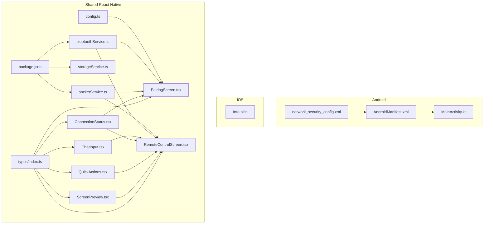
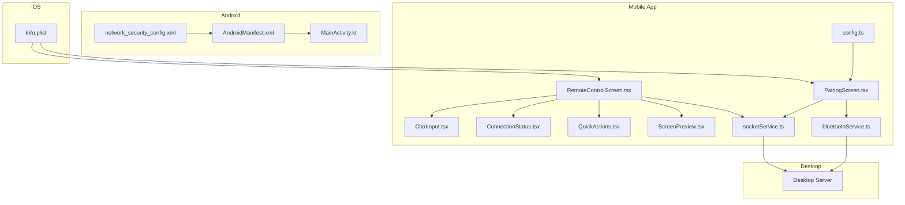
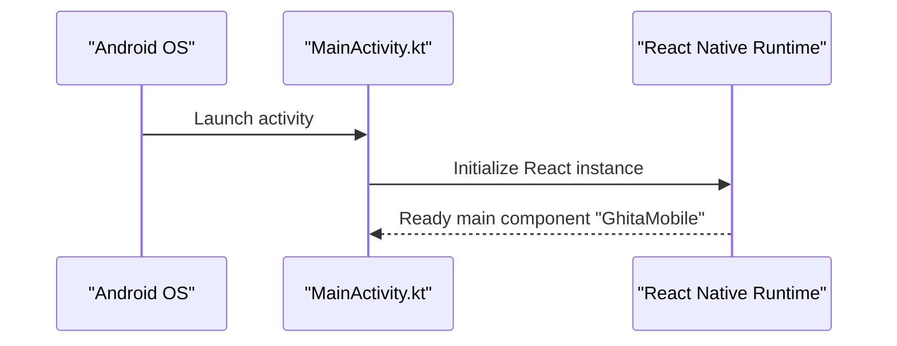
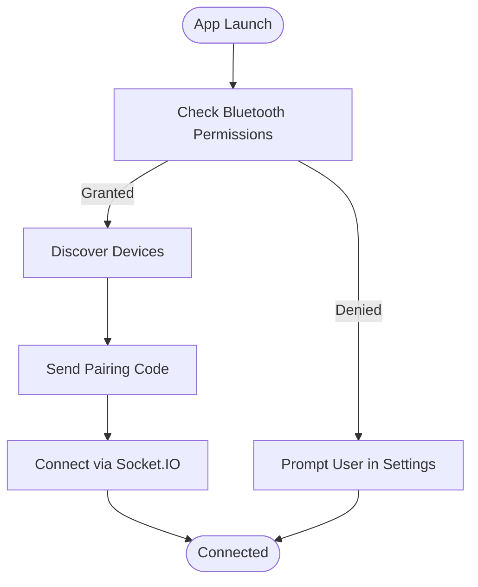
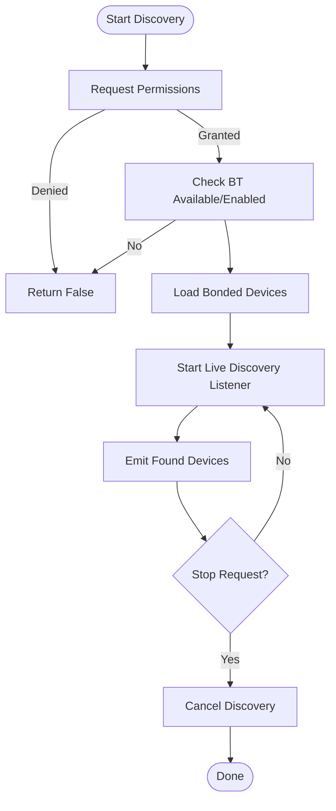
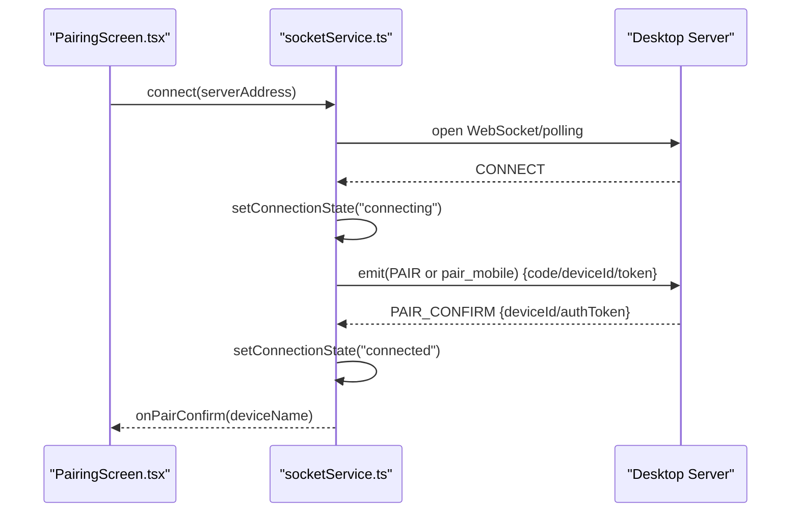
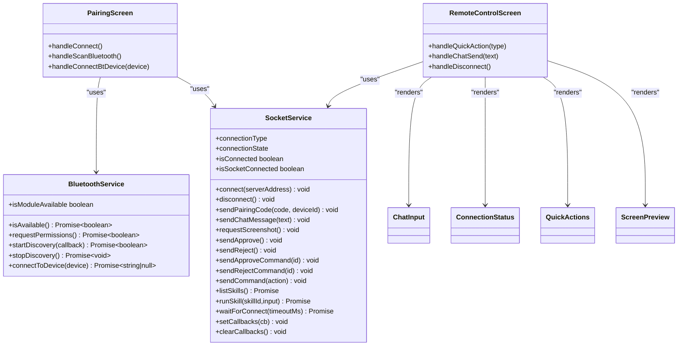
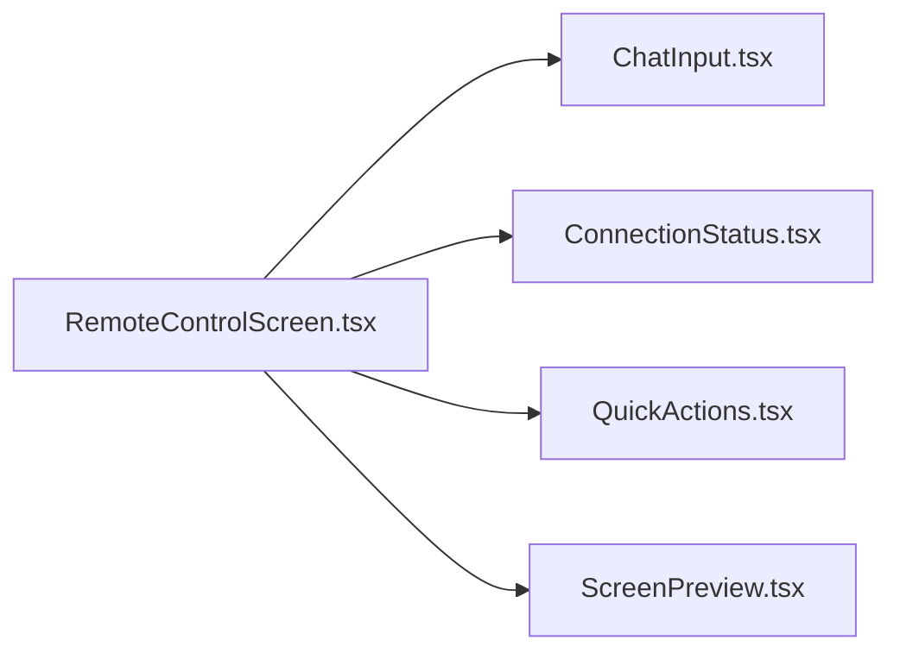
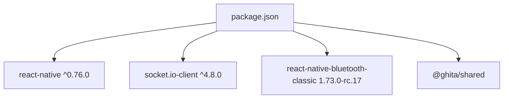

# Mobile Applications

<cite>
**Referenced Files in This Document**
- [AndroidManifest.xml](file://apps/mobile/android/app/src/main/AndroidManifest.xml)
- [MainActivity.kt](file://apps/mobile/android/app/src/main/java/com/ghitamobile/MainActivity.kt)
- [network_security_config.xml](file://apps/mobile/android/app/src/main/res/xml/network_security_config.xml)
- [package.json](file://apps/mobile/package.json)
- [Info.plist](file://apps/mobile/ios/GhitaMobile/Info.plist)
- [bluetoothService.ts](file://apps/mobile/src/services/bluetoothService.ts)
- [socketService.ts](file://apps/mobile/src/services/socketService.ts)
- [storageService.ts](file://apps/mobile/src/services/storageService.ts)
- [config.ts](file://apps/mobile/src/config.ts)
- [ChatInput.tsx](file://apps/mobile/src/components/ChatInput.tsx)
- [ConnectionStatus.tsx](file://apps/mobile/src/components/ConnectionStatus.tsx)
- [QuickActions.tsx](file://apps/mobile/src/components/QuickActions.tsx)
- [ScreenPreview.tsx](file://apps/mobile/src/components/ScreenPreview.tsx)
- [PairingScreen.tsx](file://apps/mobile/src/screens/PairingScreen.tsx)
- [RemoteControlScreen.tsx](file://apps/mobile/src/screens/RemoteControlScreen.tsx)
- [types/index.ts](file://apps/mobile/src/types/index.ts)
</cite>

## Table of Contents
1. [Introduction](#introduction)
2. [Project Structure](#project-structure)
3. [Core Components](#core-components)
4. [Architecture Overview](#architecture-overview)
5. [Detailed Component Analysis](#detailed-component-analysis)
6. [Dependency Analysis](#dependency-analysis)
7. [Performance Considerations](#performance-considerations)
8. [Troubleshooting Guide](#troubleshooting-guide)
9. [Conclusion](#conclusion)
10. [Appendices](#appendices)

## Introduction
This document explains the mobile applications built with React Native for Android and iOS. It covers the cross-platform strategy, integration with the desktop application via Socket.IO and Bluetooth, Android-specific implementation details (entry point, permissions, and security configuration), iOS native integration and App Store considerations, and the mobile services architecture. It also documents mobile-specific features such as remote desktop control, screen sharing, two-factor authentication via pairing codes, and the UI components that power the user experience.

## Project Structure
The mobile application is organized into:
- Android app module with Gradle build configuration and AndroidManifest permissions
- iOS app module with Info.plist configuration and native integration
- Shared React Native code under src/ including services, screens, components, and types
- Package configuration and dependencies

**Diagram sources**
- [AndroidManifest.xml:1-38](file://apps/mobile/android/app/src/main/AndroidManifest.xml#L1-L38)
- [network_security_config.xml:1-18](file://apps/mobile/android/app/src/main/res/xml/network_security_config.xml#L1-L18)
- [MainActivity.kt:1-23](file://apps/mobile/android/app/src/main/java/com/ghitamobile/MainActivity.kt#L1-L23)
- [Info.plist:1-57](file://apps/mobile/ios/GhitaMobile/Info.plist#L1-L57)
- [package.json:1-44](file://apps/mobile/package.json#L1-L44)
- [config.ts:1-9](file://apps/mobile/src/config.ts#L1-L9)
- [bluetoothService.ts:1-234](file://apps/mobile/src/services/bluetoothService.ts#L1-L234)
- [socketService.ts:1-525](file://apps/mobile/src/services/socketService.ts#L1-L525)
- [storageService.ts](file://apps/mobile/src/services/storageService.ts)
- [ChatInput.tsx:1-99](file://apps/mobile/src/components/ChatInput.tsx#L1-L99)
- [ConnectionStatus.tsx:1-92](file://apps/mobile/src/components/ConnectionStatus.tsx#L1-L92)
- [QuickActions.tsx:1-97](file://apps/mobile/src/components/QuickActions.tsx#L1-L97)
- [ScreenPreview.tsx:1-112](file://apps/mobile/src/components/ScreenPreview.tsx#L1-L112)
- [PairingScreen.tsx:1-797](file://apps/mobile/src/screens/PairingScreen.tsx#L1-L797)
- [RemoteControlScreen.tsx:1-776](file://apps/mobile/src/screens/RemoteControlScreen.tsx#L1-L776)
- [types/index.ts:1-60](file://apps/mobile/src/types/index.ts#L1-L60)

**Section sources**
- [AndroidManifest.xml:1-38](file://apps/mobile/android/app/src/main/AndroidManifest.xml#L1-L38)
- [MainActivity.kt:1-23](file://apps/mobile/android/app/src/main/java/com/ghitamobile/MainActivity.kt#L1-L23)
- [Info.plist:1-57](file://apps/mobile/ios/GhitaMobile/Info.plist#L1-L57)
- [package.json:1-44](file://apps/mobile/package.json#L1-L44)
- [config.ts:1-9](file://apps/mobile/src/config.ts#L1-L9)

## Core Components
- Bluetooth service: Handles device discovery, permission requests, and pairing via Bluetooth Classic and a custom protocol over RFCOMM.
- Socket.IO service: Manages real-time connection to the desktop, pairing, chat, screenshots, approvals, telemetry, and reconnection logic.
- Storage service: Persists pairing tokens, device identifiers, and settings.
- UI components: ChatInput, ConnectionStatus, QuickActions, ScreenPreview.
- Screens: PairingScreen (Wi-Fi/Bluetooth modes), RemoteControlScreen (main dashboard).

**Section sources**
- [bluetoothService.ts:1-234](file://apps/mobile/src/services/bluetoothService.ts#L1-L234)
- [socketService.ts:1-525](file://apps/mobile/src/services/socketService.ts#L1-L525)
- [storageService.ts](file://apps/mobile/src/services/storageService.ts)
- [ChatInput.tsx:1-99](file://apps/mobile/src/components/ChatInput.tsx#L1-L99)
- [ConnectionStatus.tsx:1-92](file://apps/mobile/src/components/ConnectionStatus.tsx#L1-L92)
- [QuickActions.tsx:1-97](file://apps/mobile/src/components/QuickActions.tsx#L1-L97)
- [ScreenPreview.tsx:1-112](file://apps/mobile/src/components/ScreenPreview.tsx#L1-L112)
- [PairingScreen.tsx:1-797](file://apps/mobile/src/screens/PairingScreen.tsx#L1-L797)
- [RemoteControlScreen.tsx:1-776](file://apps/mobile/src/screens/RemoteControlScreen.tsx#L1-L776)

## Architecture Overview
The mobile app uses React Native to share UI and business logic across platforms. Android and iOS integrate natively through:
- Android: MainActivity as the React activity entry point, AndroidManifest permissions, and network security configuration.
- iOS: Info.plist for permissions and ATS exceptions, and native stack integration.

Communication with the desktop:
- Bluetooth Classic for initial discovery and pairing when Wi-Fi is unavailable or when using hostname/cloud discovery fallback.
- Socket.IO for real-time chat, screenshots, approvals, telemetry, and session management.

**Diagram sources**
- [PairingScreen.tsx:1-797](file://apps/mobile/src/screens/PairingScreen.tsx#L1-L797)
- [RemoteControlScreen.tsx:1-776](file://apps/mobile/src/screens/RemoteControlScreen.tsx#L1-L776)
- [ChatInput.tsx:1-99](file://apps/mobile/src/components/ChatInput.tsx#L1-L99)
- [ConnectionStatus.tsx:1-92](file://apps/mobile/src/components/ConnectionStatus.tsx#L1-L92)
- [QuickActions.tsx:1-97](file://apps/mobile/src/components/QuickActions.tsx#L1-L97)
- [ScreenPreview.tsx:1-112](file://apps/mobile/src/components/ScreenPreview.tsx#L1-L112)
- [bluetoothService.ts:1-234](file://apps/mobile/src/services/bluetoothService.ts#L1-L234)
- [socketService.ts:1-525](file://apps/mobile/src/services/socketService.ts#L1-L525)
- [config.ts:1-9](file://apps/mobile/src/config.ts#L1-L9)
- [AndroidManifest.xml:1-38](file://apps/mobile/android/app/src/main/AndroidManifest.xml#L1-L38)
- [network_security_config.xml:1-18](file://apps/mobile/android/app/src/main/res/xml/network_security_config.xml#L1-L18)
- [MainActivity.kt:1-23](file://apps/mobile/android/app/src/main/java/com/ghitamobile/MainActivity.kt#L1-L23)
- [Info.plist:1-57](file://apps/mobile/ios/GhitaMobile/Info.plist#L1-L57)

## Detailed Component Analysis

### Android Implementation
- Entry point: MainActivity extends the React activity and delegates to the default React activity delegate.
- Permissions and security:
  - Internet, Bluetooth, Bluetooth admin, BLE scan/connect/advertise, location permissions.
  - Network security configuration allows cleartext traffic only for local LAN ranges and localhost.
- Minimum SDK: Implicitly supported by React Native version and Android Gradle configuration; the project targets modern Android versions with appropriate permissions.

**Diagram sources**
- [MainActivity.kt:8-22](file://apps/mobile/android/app/src/main/java/com/ghitamobile/MainActivity.kt#L8-L22)

**Section sources**
- [AndroidManifest.xml:1-38](file://apps/mobile/android/app/src/main/AndroidManifest.xml#L1-L38)
- [network_security_config.xml:1-18](file://apps/mobile/android/app/src/main/res/xml/network_security_config.xml#L1-L18)
- [MainActivity.kt:1-23](file://apps/mobile/android/app/src/main/java/com/ghitamobile/MainActivity.kt#L1-L23)

### iOS Implementation and App Store Considerations
- Permissions:
  - Bluetooth always and peripheral usage descriptions for discovery and pairing.
  - Location usage description for legacy Bluetooth scanning on older iOS versions.
  - App Transport Security explicitly allows local networking while blocking arbitrary cleartext.
- Native integration:
  - Uses React Native CLI and standard iOS project structure with Info.plist configuration.
- App Store considerations:
  - Provide accurate privacy labels and ensure Bluetooth usage descriptions are present.
  - Avoid NSAllowsArbitraryLoads; maintain strict ATS except for local networking.

**Diagram sources**
- [Info.plist:27-40](file://apps/mobile/ios/GhitaMobile/Info.plist#L27-L40)

**Section sources**
- [Info.plist:1-57](file://apps/mobile/ios/GhitaMobile/Info.plist#L1-L57)

### Bluetooth Service
Responsibilities:
- Availability and enablement checks
- Permission requests (Android 12+ BLE permissions and location)
- Device discovery (bonded devices and live discovery)
- Connection to a device and exchange of a discovery message to obtain server address
- Timeout handling and graceful disconnects

**Diagram sources**
- [bluetoothService.ts:49-165](file://apps/mobile/src/services/bluetoothService.ts#L49-L165)

**Section sources**
- [bluetoothService.ts:1-234](file://apps/mobile/src/services/bluetoothService.ts#L1-L234)

### Socket.IO Client Integration
Responsibilities:
- Connect to local or cloud servers, manage reconnection attempts, and health checks for local LAN recovery
- Pairing via pairing code and optional device ID and auth token
- Real-time events: screenshots, chat streaming, approvals, telemetry, status updates
- Graceful error handling and session expiration management
- Token persistence and retrieval

**Diagram sources**
- [socketService.ts:80-130](file://apps/mobile/src/services/socketService.ts#L80-L130)
- [socketService.ts:330-407](file://apps/mobile/src/services/socketService.ts#L330-L407)
- [PairingScreen.tsx:215-254](file://apps/mobile/src/screens/PairingScreen.tsx#L215-L254)

**Section sources**
- [socketService.ts:1-525](file://apps/mobile/src/services/socketService.ts#L1-L525)
- [PairingScreen.tsx:1-797](file://apps/mobile/src/screens/PairingScreen.tsx#L1-L797)

### Mobile Services Architecture
- Bluetooth service encapsulates device discovery and pairing logic.
- Socket service manages connection lifecycle, pairing, and real-time events.
- Storage service persists tokens and settings.
- UI components consume service state and dispatch actions.

**Diagram sources**
- [bluetoothService.ts:41-234](file://apps/mobile/src/services/bluetoothService.ts#L41-L234)
- [socketService.ts:28-525](file://apps/mobile/src/services/socketService.ts#L28-L525)
- [PairingScreen.tsx:109-254](file://apps/mobile/src/screens/PairingScreen.tsx#L109-L254)
- [RemoteControlScreen.tsx:234-294](file://apps/mobile/src/screens/RemoteControlScreen.tsx#L234-L294)
- [ChatInput.tsx:18-61](file://apps/mobile/src/components/ChatInput.tsx#L18-L61)
- [ConnectionStatus.tsx:25-74](file://apps/mobile/src/components/ConnectionStatus.tsx#L25-L74)
- [QuickActions.tsx:26-60](file://apps/mobile/src/components/QuickActions.tsx#L26-L60)
- [ScreenPreview.tsx:18-75](file://apps/mobile/src/components/ScreenPreview.tsx#L18-L75)

**Section sources**
- [bluetoothService.ts:1-234](file://apps/mobile/src/services/bluetoothService.ts#L1-L234)
- [socketService.ts:1-525](file://apps/mobile/src/services/socketService.ts#L1-L525)
- [PairingScreen.tsx:1-797](file://apps/mobile/src/screens/PairingScreen.tsx#L1-L797)
- [RemoteControlScreen.tsx:1-776](file://apps/mobile/src/screens/RemoteControlScreen.tsx#L1-L776)

### Mobile UI Components
- ChatInput: Text input with send button, disabled states, and internationalized placeholders.
- ConnectionStatus: Animated indicator showing connecting/pairing/connected/disconnected/error states.
- QuickActions: Grid of actions (screenshot, skills, cancel, approve, reject).
- ScreenPreview: Base64 JPEG preview with loading and error states.

**Diagram sources**
- [RemoteControlScreen.tsx:47-50](file://apps/mobile/src/screens/RemoteControlScreen.tsx#L47-L50)
- [ChatInput.tsx:18-61](file://apps/mobile/src/components/ChatInput.tsx#L18-L61)
- [ConnectionStatus.tsx:25-74](file://apps/mobile/src/components/ConnectionStatus.tsx#L25-L74)
- [QuickActions.tsx:26-60](file://apps/mobile/src/components/QuickActions.tsx#L26-L60)
- [ScreenPreview.tsx:18-75](file://apps/mobile/src/components/ScreenPreview.tsx#L18-L75)

**Section sources**
- [ChatInput.tsx:1-99](file://apps/mobile/src/components/ChatInput.tsx#L1-L99)
- [ConnectionStatus.tsx:1-92](file://apps/mobile/src/components/ConnectionStatus.tsx#L1-L92)
- [QuickActions.tsx:1-97](file://apps/mobile/src/components/QuickActions.tsx#L1-L97)
- [ScreenPreview.tsx:1-112](file://apps/mobile/src/components/ScreenPreview.tsx#L1-L112)

### Mobile-Specific Features
- Remote desktop control:
  - Screenshot requests and previews
  - Chat input and streaming responses
  - Quick actions for approvals and cancellation
- Two-factor authentication:
  - Pairing code exchange during Socket.IO pairing
  - Optional device ID and auth token persistence
- Screen sharing and interaction:
  - Real-time base64 JPEG frames delivered via Socket.IO events
- Security measures:
  - Local LAN cleartext allowed only for private networks
  - Session expiration handling and re-pairing prompts
  - Vibration feedback for connection, messages, and approvals

**Section sources**
- [RemoteControlScreen.tsx:234-294](file://apps/mobile/src/screens/RemoteControlScreen.tsx#L234-L294)
- [socketService.ts:135-147](file://apps/mobile/src/services/socketService.ts#L135-L147)
- [socketService.ts:388-407](file://apps/mobile/src/services/socketService.ts#L388-L407)
- [ScreenPreview.tsx:18-75](file://apps/mobile/src/components/ScreenPreview.tsx#L18-L75)
- [network_security_config.xml:1-18](file://apps/mobile/android/app/src/main/res/xml/network_security_config.xml#L1-L18)

## Dependency Analysis
- React Native version and core libraries are declared in package.json.
- Socket.IO client and Bluetooth Classic plugin are integrated.
- Shared types are re-exported from the shared package.

**Diagram sources**
- [package.json:17-28](file://apps/mobile/package.json#L17-L28)

**Section sources**
- [package.json:1-44](file://apps/mobile/package.json#L1-L44)
- [types/index.ts:6-14](file://apps/mobile/src/types/index.ts#L6-L14)

## Performance Considerations
- Prefer WebSocket transport with polling fallback for resilient connectivity.
- Limit chat history and screenshot caching to reduce memory pressure.
- Debounce UI interactions and avoid unnecessary re-renders in screens.
- Use platform-specific optimizations (e.g., native driver for animations).
- Minimize base64 image processing on the UI thread; render images efficiently.

## Troubleshooting Guide
Common issues and resolutions:
- Bluetooth discovery fails:
  - Verify permissions are granted and device is enabled.
  - On Android 12+, ensure BLUETOOTH_SCAN and BLUETOOTH_CONNECT are accepted.
- Socket.IO connection timeouts:
  - Confirm server is reachable and firewall allows WebSocket/polling.
  - Check local LAN health checks and cloud fallback logic.
- Pairing failures:
  - Ensure pairing code matches and session is not expired.
  - Re-pair if prompted due to session expiry.
- iOS ATS errors:
  - Do not set NSAllowsArbitraryLoads; keep local networking allowed only for trusted domains.

**Section sources**
- [bluetoothService.ts:63-88](file://apps/mobile/src/services/bluetoothService.ts#L63-L88)
- [socketService.ts:372-386](file://apps/mobile/src/services/socketService.ts#L372-L386)
- [socketService.ts:505-514](file://apps/mobile/src/services/socketService.ts#L505-L514)
- [Info.plist:27-34](file://apps/mobile/ios/GhitaMobile/Info.plist#L27-L34)

## Conclusion
The mobile application leverages React Native to deliver a unified experience across Android and iOS, integrating tightly with the desktop via Bluetooth and Socket.IO. Android’s permissions and network security configuration ensure safe local LAN connectivity, while iOS provides explicit Bluetooth and ATS policies. The UI components and screens orchestrate pairing, real-time chat, screen previews, and approvals, with robust error handling and reconnection strategies.

## Appendices
- Configuration:
  - Cloud discovery API key and URL are loaded from environment variables.
- Types:
  - Shared types are re-exported for consistency across platforms.

**Section sources**
- [config.ts:5-9](file://apps/mobile/src/config.ts#L5-L9)
- [types/index.ts:6-14](file://apps/mobile/src/types/index.ts#L6-L14)