# Mobile Services and Features

<cite>
**Referenced Files in This Document**
- [bluetoothService.ts](file://apps/mobile/src/services/bluetoothService.ts)
- [socketService.ts](file://apps/mobile/src/services/socketService.ts)
- [storageService.ts](file://apps/mobile/src/services/storageService.ts)
- [ChatInput.tsx](file://apps/mobile/src/components/ChatInput.tsx)
- [ConnectionStatus.tsx](file://apps/mobile/src/components/ConnectionStatus.tsx)
- [QuickActions.tsx](file://apps/mobile/src/components/QuickActions.tsx)
- [ScreenPreview.tsx](file://apps/mobile/src/components/ScreenPreview.tsx)
- [PairingScreen.tsx](file://apps/mobile/src/screens/PairingScreen.tsx)
- [RemoteControlScreen.tsx](file://apps/mobile/src/screens/RemoteControlScreen.tsx)
- [SettingsScreen.tsx](file://apps/mobile/src/screens/SettingsScreen.tsx)
- [App.tsx](file://apps/mobile/src/App.tsx)
- [config.ts](file://apps/mobile/src/config.ts)
- [types.ts](file://apps/mobile/src/types/index.ts)
- [colors.ts](file://apps/mobile/src/theme/colors.ts)
- [styles.ts](file://apps/mobile/src/theme/styles.ts)
- [sharedSocket.ts](file://apps/desktop/src/utils/sharedSocket.ts)
- [ApiManager.tsx](file://apps/desktop/src/components/ApiManager.tsx)
- [terminal.ts](file://apps/desktop/src/components/Terminal.tsx)
</cite>

## Table of Contents
1. [Introduction](#introduction)
2. [Project Structure](#project-structure)
3. [Core Components](#core-components)
4. [Architecture Overview](#architecture-overview)
5. [Detailed Component Analysis](#detailed-component-analysis)
6. [Dependency Analysis](#dependency-analysis)
7. [Performance Considerations](#performance-considerations)
8. [Troubleshooting Guide](#troubleshooting-guide)
9. [Conclusion](#conclusion)

## Introduction
This document describes the mobile services architecture and core features for remote desktop control and real-time communication. It covers:
- Bluetooth service for device discovery, pairing, and secure connection establishment
- Socket.IO client integration for real-time communication with the desktop application
- Storage service for local data persistence, cache management, and offline functionality
- Mobile UI components for messaging, connectivity monitoring, gesture-based controls, and remote screen visualization
- Mobile-specific features including remote desktop control, screen sharing, two-factor secure pairing, and cross-platform synchronization
- Service integration patterns, error handling strategies, and performance optimization for mobile networks

## Project Structure
The mobile application is organized around three primary layers:
- Services: Bluetooth, Socket.IO, and Storage
- Components: UI widgets for messaging, status, actions, and screen preview
- Screens: Pairing, Remote Control, and Settings
- Shared configuration and types for consistent behavior across platforms

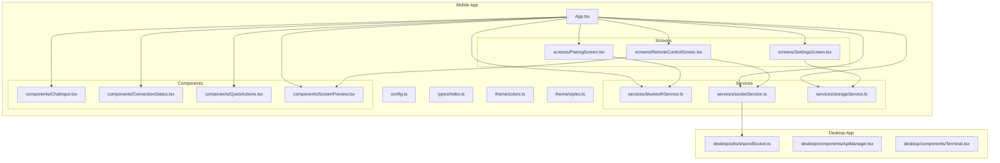

**Diagram sources**
- [App.tsx](file://apps/mobile/src/App.tsx)
- [config.ts](file://apps/mobile/src/config.ts)
- [types.ts](file://apps/mobile/src/types/index.ts)
- [colors.ts](file://apps/mobile/src/theme/colors.ts)
- [styles.ts](file://apps/mobile/src/theme/styles.ts)
- [bluetoothService.ts](file://apps/mobile/src/services/bluetoothService.ts)
- [socketService.ts](file://apps/mobile/src/services/socketService.ts)
- [storageService.ts](file://apps/mobile/src/services/storageService.ts)
- [ChatInput.tsx](file://apps/mobile/src/components/ChatInput.tsx)
- [ConnectionStatus.tsx](file://apps/mobile/src/components/ConnectionStatus.tsx)
- [QuickActions.tsx](file://apps/mobile/src/components/QuickActions.tsx)
- [ScreenPreview.tsx](file://apps/mobile/src/components/ScreenPreview.tsx)
- [PairingScreen.tsx](file://apps/mobile/src/screens/PairingScreen.tsx)
- [RemoteControlScreen.tsx](file://apps/mobile/src/screens/RemoteControlScreen.tsx)
- [SettingsScreen.tsx](file://apps/mobile/src/screens/SettingsScreen.tsx)
- [sharedSocket.ts](file://apps/desktop/src/utils/sharedSocket.ts)
- [ApiManager.tsx](file://apps/desktop/src/components/ApiManager.tsx)
- [terminal.ts](file://apps/desktop/src/components/Terminal.tsx)

**Section sources**
- [App.tsx](file://apps/mobile/src/App.tsx)
- [config.ts](file://apps/mobile/src/config.ts)
- [types.ts](file://apps/mobile/src/types/index.ts)
- [colors.ts](file://apps/mobile/src/theme/colors.ts)
- [styles.ts](file://apps/mobile/src/theme/styles.ts)

## Core Components
This section outlines the core services and UI components that enable the mobile application’s functionality.

- Bluetooth Service
  - Handles device discovery, pairing, and secure connection establishment
  - Provides APIs for scanning nearby devices, initiating pairing, and maintaining a secure channel
  - Integrates with platform-specific Bluetooth stacks via React Native modules

- Socket.IO Client Service
  - Manages real-time bidirectional communication with the desktop application
  - Implements connection lifecycle, message routing, and automatic reconnection
  - Ensures reliable delivery and error recovery for commands and screen updates

- Storage Service
  - Persists local data, manages caches, and supports offline operation
  - Offers structured storage for pairing tokens, session metadata, and cached screen frames
  - Enables cross-platform synchronization by exporting/importing data

- UI Components
  - ChatInput: Real-time messaging interface for sending typed messages to the desktop
  - ConnectionStatus: Visual indicator and status reporting for connectivity health
  - QuickActions: Gesture-based controls for common actions (e.g., copy/paste, keyboard toggle)
  - ScreenPreview: Remote screen visualization with touch-to-mouse emulation and scaling

- Screens
  - PairingScreen: Guides users through device discovery and secure pairing
  - RemoteControlScreen: Full-screen remote control with input forwarding and screen rendering
  - SettingsScreen: Configuration for network preferences, storage, and sync options

**Section sources**
- [bluetoothService.ts](file://apps/mobile/src/services/bluetoothService.ts)
- [socketService.ts](file://apps/mobile/src/services/socketService.ts)
- [storageService.ts](file://apps/mobile/src/services/storageService.ts)
- [ChatInput.tsx](file://apps/mobile/src/components/ChatInput.tsx)
- [ConnectionStatus.tsx](file://apps/mobile/src/components/ConnectionStatus.tsx)
- [QuickActions.tsx](file://apps/mobile/src/components/QuickActions.tsx)
- [ScreenPreview.tsx](file://apps/mobile/src/components/ScreenPreview.tsx)
- [PairingScreen.tsx](file://apps/mobile/src/screens/PairingScreen.tsx)
- [RemoteControlScreen.tsx](file://apps/mobile/src/screens/RemoteControlScreen.tsx)
- [SettingsScreen.tsx](file://apps/mobile/src/screens/SettingsScreen.tsx)

## Architecture Overview
The mobile architecture integrates three pillars:
- Device Discovery and Secure Link: Bluetooth service discovers nearby desktop instances, negotiates pairing, and establishes a secure transport
- Real-Time Communication: Socket.IO client connects to the desktop, exchanges commands, and streams screen updates
- Local Persistence and UI: Storage service maintains state and caches, while UI components deliver a responsive user experience

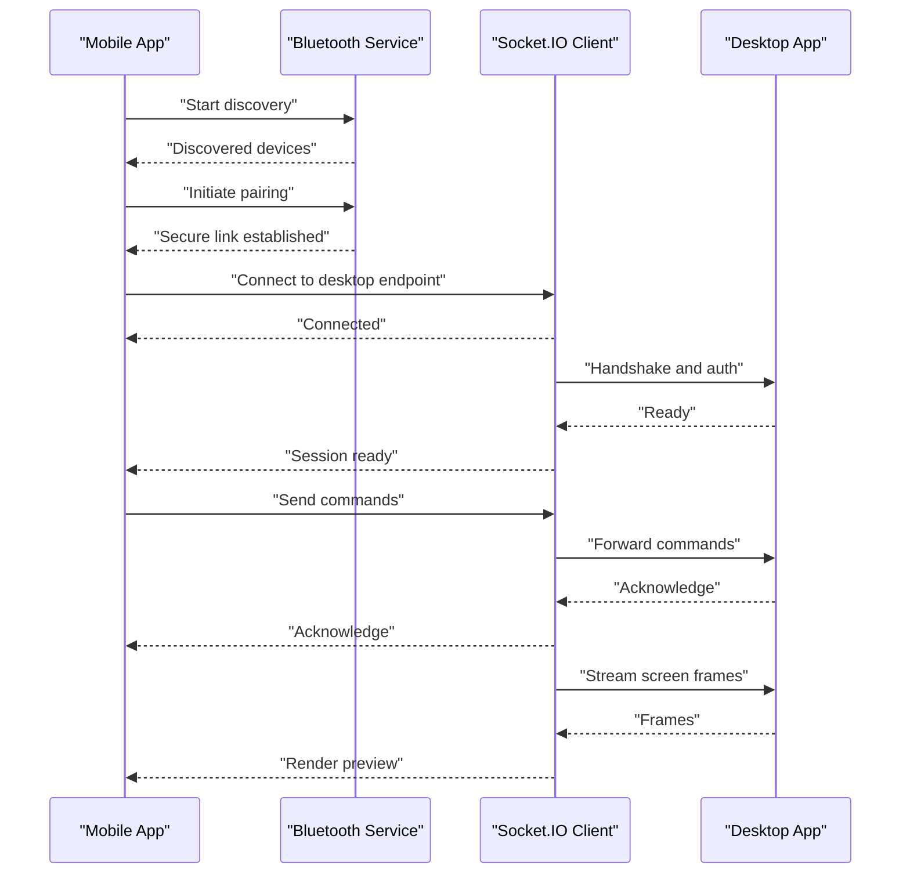

**Diagram sources**
- [bluetoothService.ts](file://apps/mobile/src/services/bluetoothService.ts)
- [socketService.ts](file://apps/mobile/src/services/socketService.ts)
- [sharedSocket.ts](file://apps/desktop/src/utils/sharedSocket.ts)

## Detailed Component Analysis

### Bluetooth Service Implementation
The Bluetooth service orchestrates device discovery, pairing, and secure connection establishment. It exposes methods for scanning, connecting, and managing the secure channel.

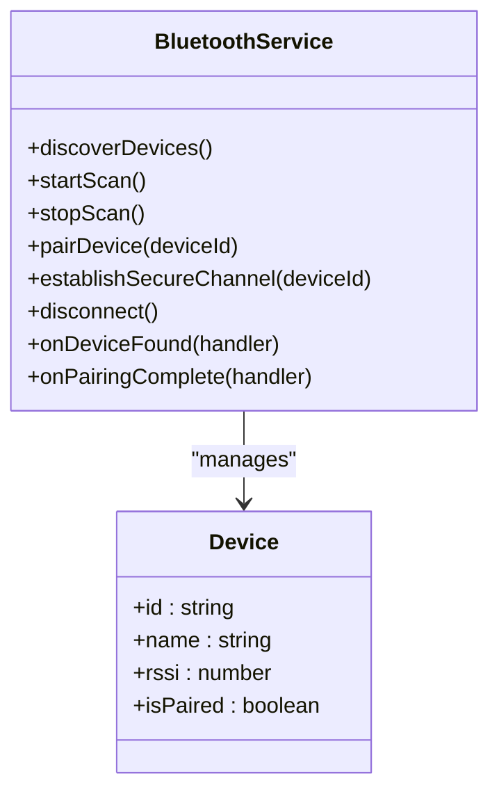

**Diagram sources**
- [bluetoothService.ts](file://apps/mobile/src/services/bluetoothService.ts)

Key responsibilities:
- Scanning and filtering nearby devices
- Initiating pairing with secure verification
- Establishing a reliable, encrypted transport
- Managing lifecycle events and cleanup

Operational flow:
- Start scanning for devices
- Filter by pairing status and signal strength
- Initiate pairing with user confirmation
- Validate pairing code and establish secure channel
- Forward connection state to Socket.IO client

**Section sources**
- [bluetoothService.ts](file://apps/mobile/src/services/bluetoothService.ts)

### Socket.IO Client Integration
The Socket.IO client manages real-time communication with the desktop application. It handles connection management, message routing, and robust error recovery.

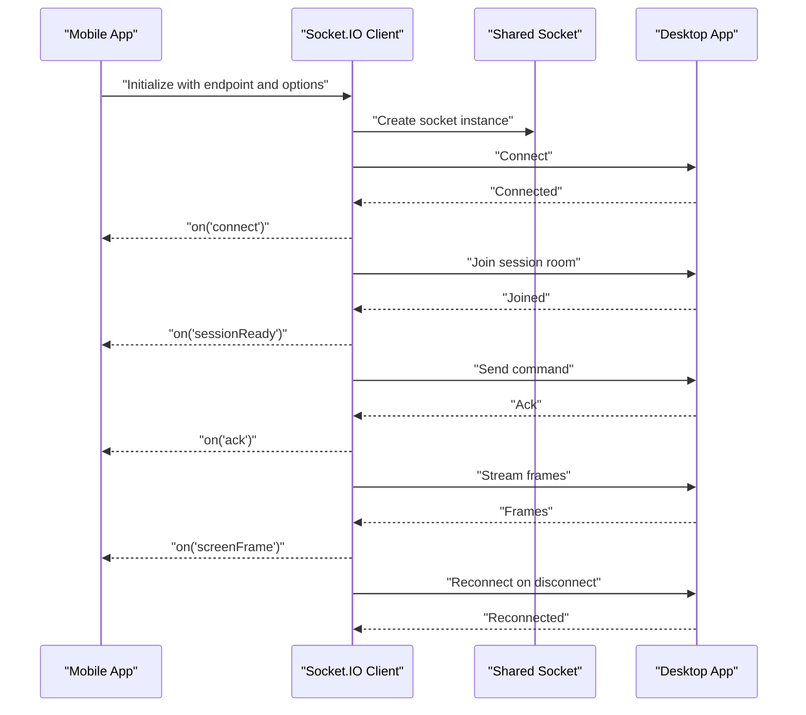

**Diagram sources**
- [socketService.ts](file://apps/mobile/src/services/socketService.ts)
- [sharedSocket.ts](file://apps/desktop/src/utils/sharedSocket.ts)

Core features:
- Connection lifecycle: connect, reconnect, and graceful shutdown
- Message handling: commands, acknowledgments, and screen frame streaming
- Error recovery: exponential backoff, fallback strategies, and user notifications
- Session management: room joining, session readiness, and state synchronization

**Section sources**
- [socketService.ts](file://apps/mobile/src/services/socketService.ts)
- [sharedSocket.ts](file://apps/desktop/src/utils/sharedSocket.ts)

### Storage Service for Local Data Persistence
The storage service provides local persistence, caching, and offline support. It enables cross-platform synchronization and ensures continuity when network conditions are poor.

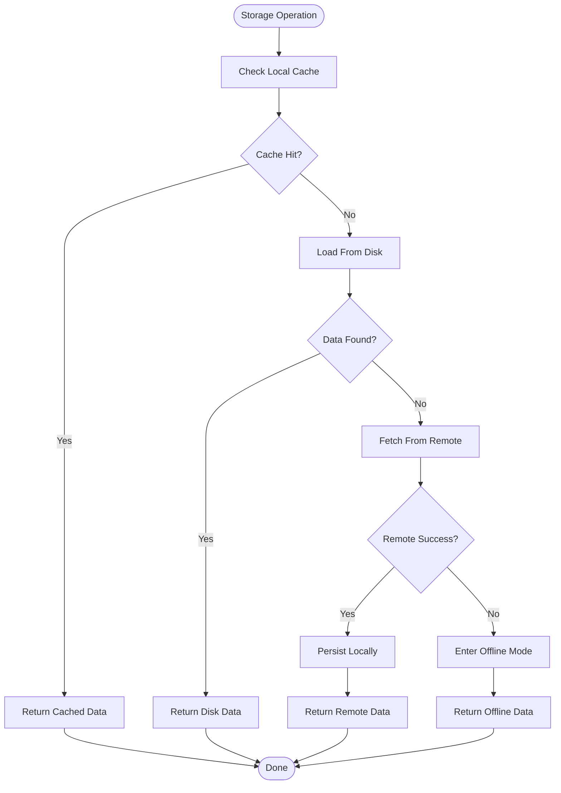

**Diagram sources**
- [storageService.ts](file://apps/mobile/src/services/storageService.ts)

Capabilities:
- Structured storage for pairing tokens, session metadata, and cached frames
- Cache invalidation and refresh policies
- Export/import for cross-platform synchronization
- Conflict resolution during sync

**Section sources**
- [storageService.ts](file://apps/mobile/src/services/storageService.ts)

### Mobile UI Components

#### ChatInput
Real-time messaging component for sending typed messages to the desktop. It validates input, formats messages, and forwards them via the Socket.IO client.

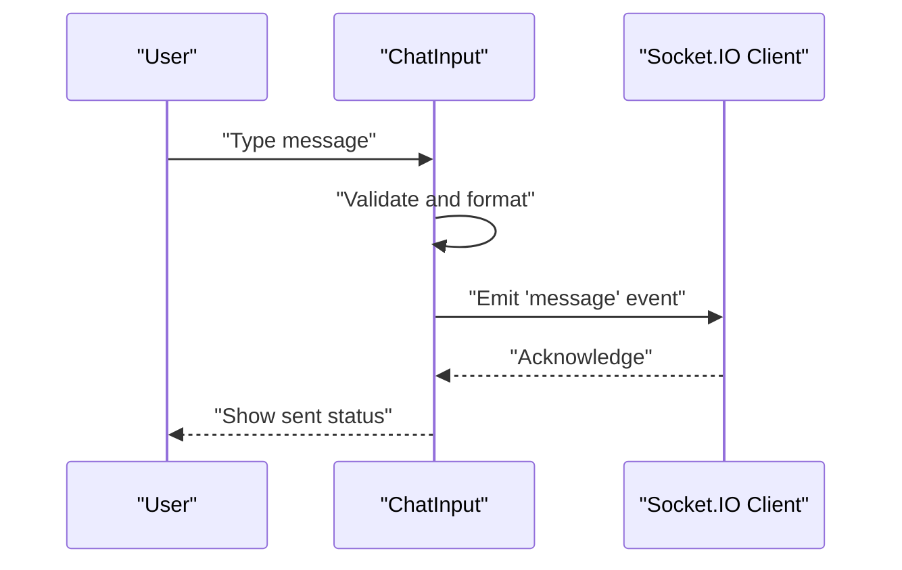

**Diagram sources**
- [ChatInput.tsx](file://apps/mobile/src/components/ChatInput.tsx)
- [socketService.ts](file://apps/mobile/src/services/socketService.ts)

**Section sources**
- [ChatInput.tsx](file://apps/mobile/src/components/ChatInput.tsx)

#### ConnectionStatus
Visual indicator and status reporter for connectivity health. It monitors connection state, displays warnings, and triggers reconnection attempts.

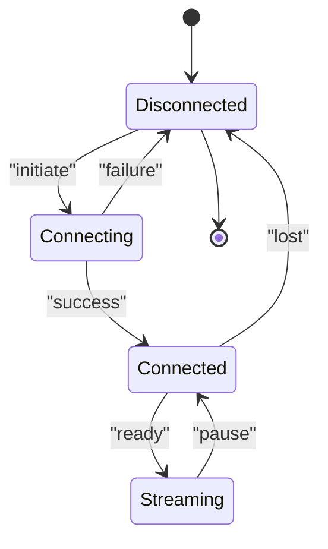

**Diagram sources**
- [ConnectionStatus.tsx](file://apps/mobile/src/components/ConnectionStatus.tsx)
- [socketService.ts](file://apps/mobile/src/services/socketService.ts)

**Section sources**
- [ConnectionStatus.tsx](file://apps/mobile/src/components/ConnectionStatus.tsx)

#### QuickActions
Gesture-based controls for common actions. It listens to gestures and emits corresponding commands to the desktop.

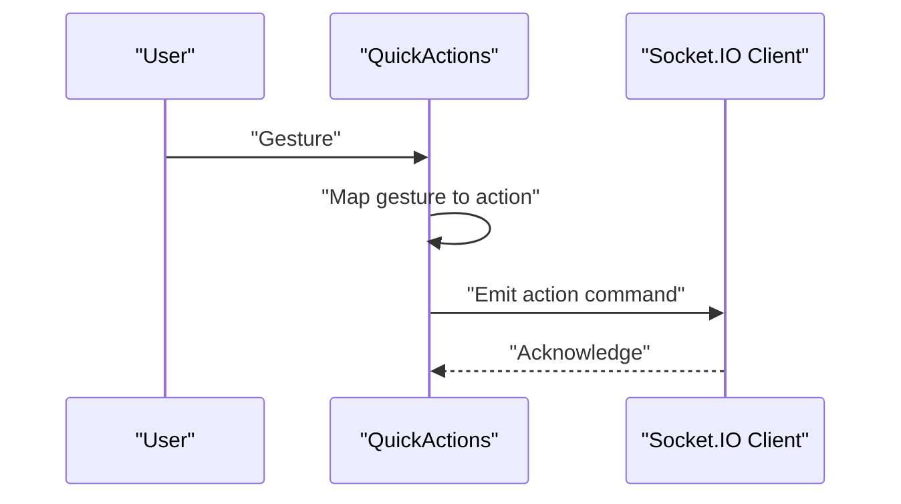

**Diagram sources**
- [QuickActions.tsx](file://apps/mobile/src/components/QuickActions.tsx)
- [socketService.ts](file://apps/mobile/src/services/socketService.ts)

**Section sources**
- [QuickActions.tsx](file://apps/mobile/src/components/QuickActions.tsx)

#### ScreenPreview
Remote screen visualization with touch-to-mouse emulation and scaling. It receives screen frames from the desktop and renders them efficiently.

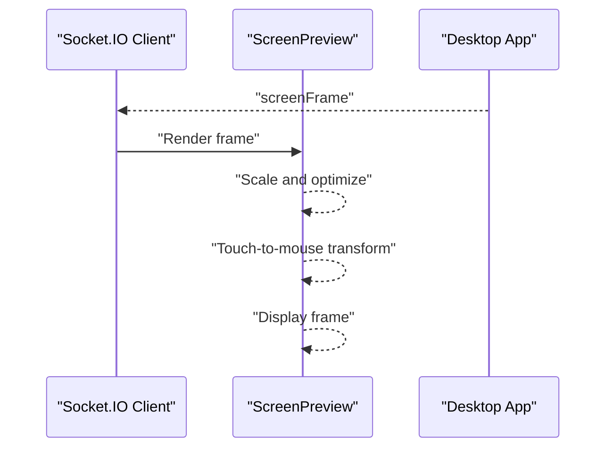

**Diagram sources**
- [ScreenPreview.tsx](file://apps/mobile/src/components/ScreenPreview.tsx)
- [socketService.ts](file://apps/mobile/src/services/socketService.ts)

**Section sources**
- [ScreenPreview.tsx](file://apps/mobile/src/components/ScreenPreview.tsx)

### Screens and Navigation
- PairingScreen: Guides users through device discovery and secure pairing, integrating with the Bluetooth service
- RemoteControlScreen: Hosts the ScreenPreview and QuickActions, and coordinates with the Socket.IO client for input forwarding
- SettingsScreen: Manages storage, network preferences, and synchronization options

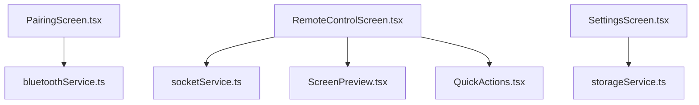

**Diagram sources**
- [PairingScreen.tsx](file://apps/mobile/src/screens/PairingScreen.tsx)
- [RemoteControlScreen.tsx](file://apps/mobile/src/screens/RemoteControlScreen.tsx)
- [SettingsScreen.tsx](file://apps/mobile/src/screens/SettingsScreen.tsx)
- [bluetoothService.ts](file://apps/mobile/src/services/bluetoothService.ts)
- [socketService.ts](file://apps/mobile/src/services/socketService.ts)
- [storageService.ts](file://apps/mobile/src/services/storageService.ts)
- [ScreenPreview.tsx](file://apps/mobile/src/components/ScreenPreview.tsx)
- [QuickActions.tsx](file://apps/mobile/src/components/QuickActions.tsx)

**Section sources**
- [PairingScreen.tsx](file://apps/mobile/src/screens/PairingScreen.tsx)
- [RemoteControlScreen.tsx](file://apps/mobile/src/screens/RemoteControlScreen.tsx)
- [SettingsScreen.tsx](file://apps/mobile/src/screens/SettingsScreen.tsx)

## Dependency Analysis
The mobile services exhibit strong cohesion within functional domains and moderate coupling to shared desktop utilities.

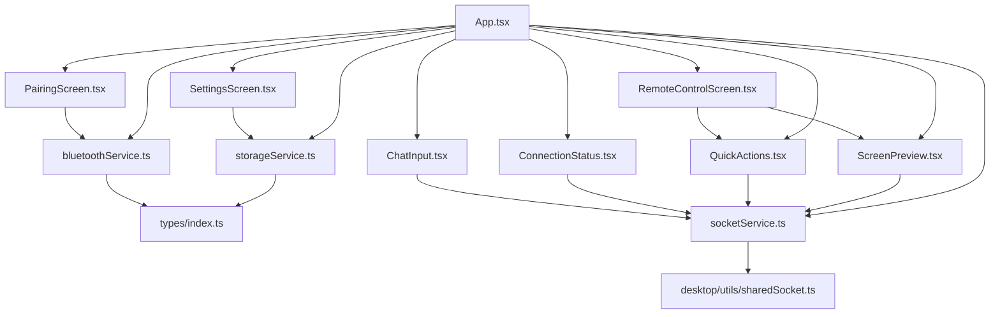

**Diagram sources**
- [bluetoothService.ts](file://apps/mobile/src/services/bluetoothService.ts)
- [socketService.ts](file://apps/mobile/src/services/socketService.ts)
- [storageService.ts](file://apps/mobile/src/services/storageService.ts)
- [ChatInput.tsx](file://apps/mobile/src/components/ChatInput.tsx)
- [ConnectionStatus.tsx](file://apps/mobile/src/components/ConnectionStatus.tsx)
- [QuickActions.tsx](file://apps/mobile/src/components/QuickActions.tsx)
- [ScreenPreview.tsx](file://apps/mobile/src/components/ScreenPreview.tsx)
- [PairingScreen.tsx](file://apps/mobile/src/screens/PairingScreen.tsx)
- [RemoteControlScreen.tsx](file://apps/mobile/src/screens/RemoteControlScreen.tsx)
- [SettingsScreen.tsx](file://apps/mobile/src/screens/SettingsScreen.tsx)
- [App.tsx](file://apps/mobile/src/App.tsx)
- [types.ts](file://apps/mobile/src/types/index.ts)
- [sharedSocket.ts](file://apps/desktop/src/utils/sharedSocket.ts)

**Section sources**
- [types.ts](file://apps/mobile/src/types/index.ts)
- [sharedSocket.ts](file://apps/desktop/src/utils/sharedSocket.ts)

## Performance Considerations
- Network resilience: Socket.IO client implements exponential backoff and retry strategies to handle intermittent connections
- Efficient rendering: ScreenPreview optimizes frame rendering and applies adaptive scaling to reduce bandwidth usage
- Local caching: Storage service minimizes redundant network requests by caching frequently accessed data
- Background processing: Bluetooth and Socket.IO operations are designed to continue across app lifecycle transitions where supported
- Battery optimization: QuickActions and input forwarding avoid unnecessary polling and batch operations where possible

[No sources needed since this section provides general guidance]

## Troubleshooting Guide
Common issues and resolutions:
- Connection failures
  - Verify Bluetooth visibility and proximity
  - Confirm pairing code acceptance on both ends
  - Retry connection after a brief delay
- Screen not updating
  - Check network stability and bandwidth
  - Restart Socket.IO client session
  - Clear cache and re-sync data
- Messages not delivered
  - Ensure session readiness before sending
  - Validate message formatting and payload limits
  - Reconnect and rejoin session room
- Storage inconsistencies
  - Trigger manual sync to resolve conflicts
  - Export/import data for cross-platform parity
  - Clear corrupted entries and rebuild cache

**Section sources**
- [socketService.ts](file://apps/mobile/src/services/socketService.ts)
- [storageService.ts](file://apps/mobile/src/services/storageService.ts)
- [ConnectionStatus.tsx](file://apps/mobile/src/components/ConnectionStatus.tsx)

## Conclusion
The mobile services architecture delivers a cohesive remote desktop experience through integrated Bluetooth discovery, robust Socket.IO communication, and resilient local storage. The UI components provide intuitive controls and real-time feedback, while the screens orchestrate pairing, control, and settings workflows. By emphasizing error recovery, performance optimization, and cross-platform synchronization, the system ensures reliability across diverse mobile environments.