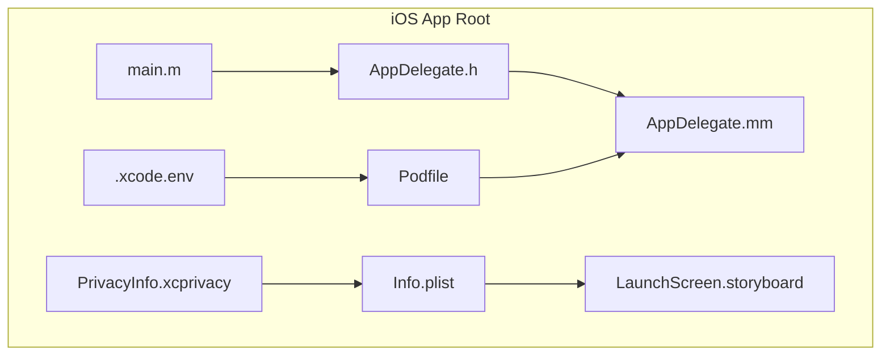
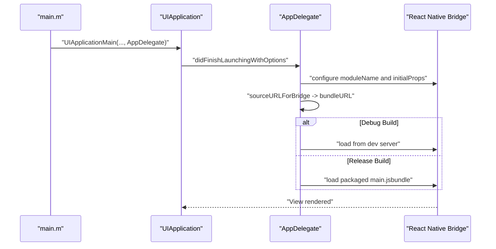
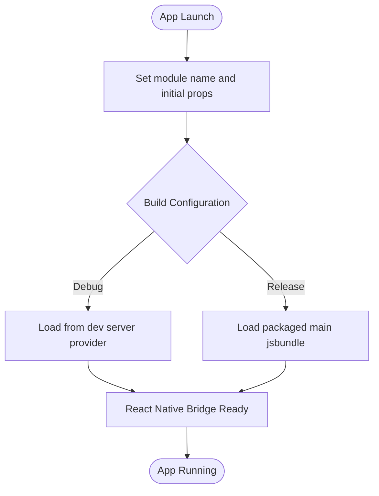
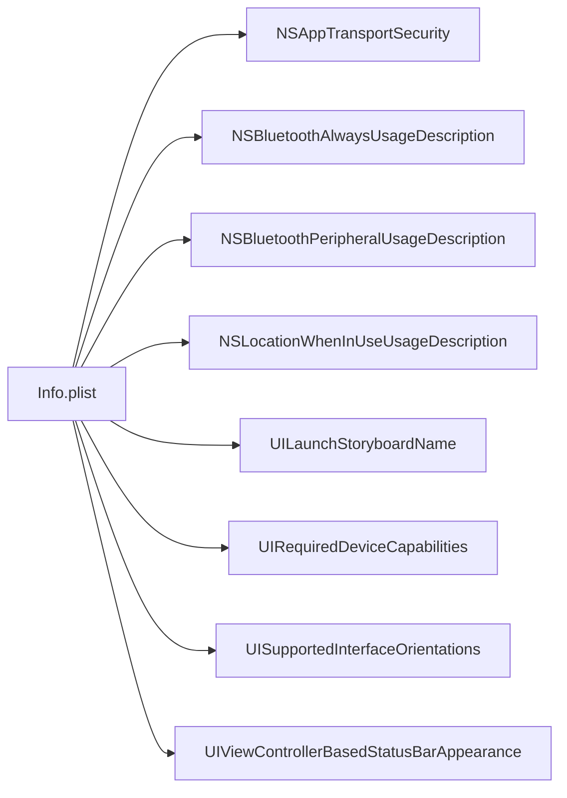
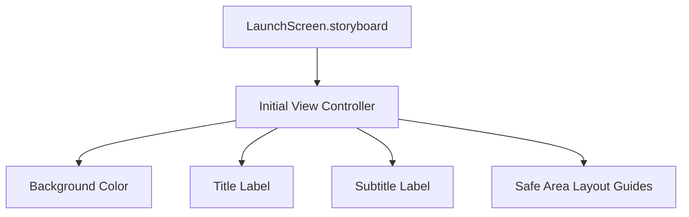
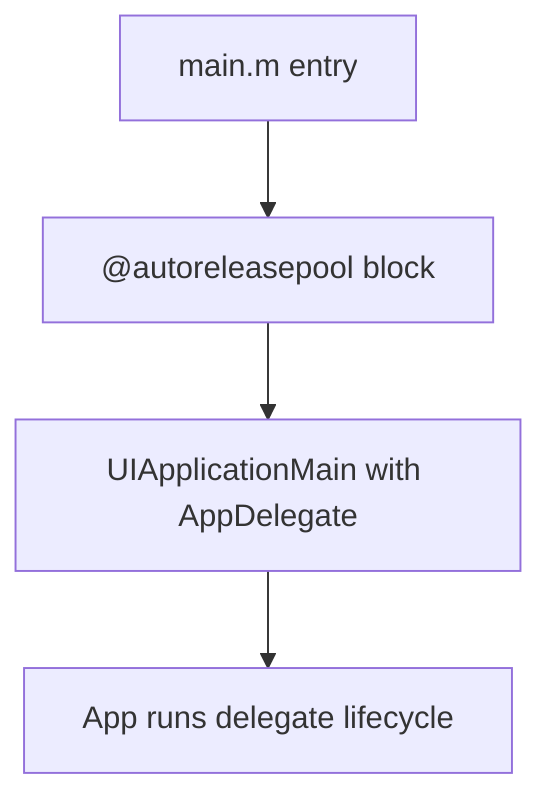
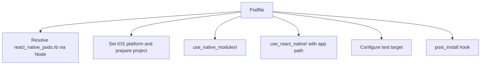
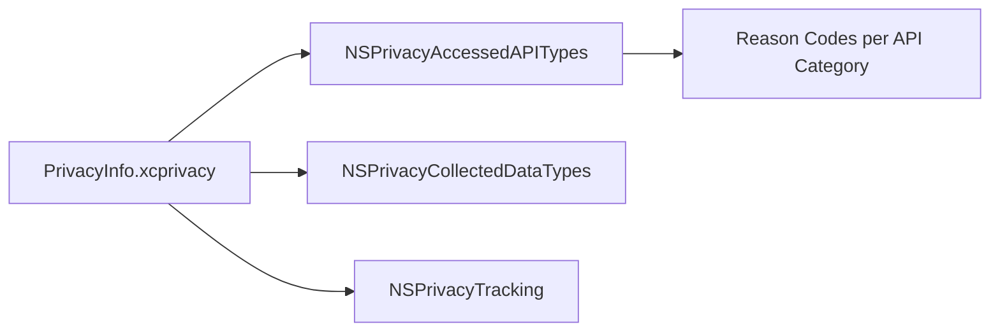
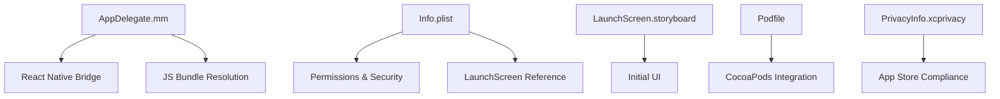

# iOS Application

<cite>
**Referenced Files in This Document**
- [AppDelegate.h](file://apps/mobile/ios/GhitaMobile/AppDelegate.h)
- [AppDelegate.mm](file://apps/mobile/ios/GhitaMobile/AppDelegate.mm)
- [Info.plist](file://apps/mobile/ios/GhitaMobile/Info.plist)
- [LaunchScreen.storyboard](file://apps/mobile/ios/GhitaMobile/LaunchScreen.storyboard)
- [main.m](file://apps/mobile/ios/GhitaMobile/main.m)
- [Podfile](file://apps/mobile/ios/Podfile)
- [PrivacyInfo.xcprivacy](file://apps/mobile/ios/GhitaMobile/PrivacyInfo.xcprivacy)
- [.xcode.env](file://apps/mobile/ios/.xcode.env)
</cite>

## Table of Contents
1. [Introduction](#introduction)
2. [Project Structure](#project-structure)
3. [Core Components](#core-components)
4. [Architecture Overview](#architecture-overview)
5. [Detailed Component Analysis](#detailed-component-analysis)
6. [Dependency Analysis](#dependency-analysis)
7. [Performance Considerations](#performance-considerations)
8. [Troubleshooting Guide](#troubleshooting-guide)
9. [Conclusion](#conclusion)
10. [Appendices](#appendices)

## Introduction
This document provides comprehensive documentation for the iOS application implementation located under apps/mobile/ios. It focuses on the iOS application lifecycle and delegate configuration, Info.plist permissions and security settings, launch screen storyboard setup, and the main entry point. It also covers dependency management via the Podfile, privacy configuration, and practical guidance for iOS development workflow, debugging, performance optimization, and App Store submission considerations.

## Project Structure
The iOS application is organized under the apps/mobile/ios/GhitaMobile directory and integrates with React Native. Key files include the application delegate, Info.plist configuration, launch screen storyboard, main entry point, and CocoaPods configuration. The project also includes a privacy manifest and an Xcode environment file for script phases.

**Diagram sources**
- [AppDelegate.h:1-7](file://apps/mobile/ios/GhitaMobile/AppDelegate.h#L1-L7)
- [AppDelegate.mm:1-32](file://apps/mobile/ios/GhitaMobile/AppDelegate.mm#L1-L32)
- [Info.plist:1-57](file://apps/mobile/ios/GhitaMobile/Info.plist#L1-L57)
- [LaunchScreen.storyboard:1-48](file://apps/mobile/ios/GhitaMobile/LaunchScreen.storyboard#L1-L48)
- [main.m:1-11](file://apps/mobile/ios/GhitaMobile/main.m#L1-L11)
- [Podfile:1-41](file://apps/mobile/ios/Podfile#L1-L41)
- [PrivacyInfo.xcprivacy:1-38](file://apps/mobile/ios/GhitaMobile/PrivacyInfo.xcprivacy#L1-L38)
- [.xcode.env:1-12](file://apps/mobile/ios/.xcode.env#L1-L12)

**Section sources**
- [AppDelegate.h:1-7](file://apps/mobile/ios/GhitaMobile/AppDelegate.h#L1-L7)
- [AppDelegate.mm:1-32](file://apps/mobile/ios/GhitaMobile/AppDelegate.mm#L1-L32)
- [Info.plist:1-57](file://apps/mobile/ios/GhitaMobile/Info.plist#L1-L57)
- [LaunchScreen.storyboard:1-48](file://apps/mobile/ios/GhitaMobile/LaunchScreen.storyboard#L1-L48)
- [main.m:1-11](file://apps/mobile/ios/GhitaMobile/main.m#L1-L11)
- [Podfile:1-41](file://apps/mobile/ios/Podfile#L1-L41)
- [PrivacyInfo.xcprivacy:1-38](file://apps/mobile/ios/GhitaMobile/PrivacyInfo.xcprivacy#L1-L38)
- [.xcode.env:1-12](file://apps/mobile/ios/.xcode.env#L1-L12)

## Core Components
- Application Delegate: Defines the React Native application lifecycle entry points and JS bundle resolution behavior for debug and release builds.
- Info.plist: Declares app metadata, required capabilities, permissions, and security policies.
- Launch Screen: Provides the initial UI shown during app startup.
- Main Entry Point: Initializes the UIKit application and sets the delegate class.
- Podfile: Configures React Native integration and CocoaPods installation behavior.
- Privacy Manifest: Declares accessed APIs and data collection/tracking status.
- Xcode Environment: Supplies environment variables for Xcode script phases.

**Section sources**
- [AppDelegate.mm:7-29](file://apps/mobile/ios/GhitaMobile/AppDelegate.mm#L7-L29)
- [Info.plist:25-54](file://apps/mobile/ios/GhitaMobile/Info.plist#L25-L54)
- [LaunchScreen.storyboard:10-47](file://apps/mobile/ios/GhitaMobile/LaunchScreen.storyboard#L10-L47)
- [main.m:5-10](file://apps/mobile/ios/GhitaMobile/main.m#L5-L10)
- [Podfile:8-24](file://apps/mobile/ios/Podfile#L8-L24)
- [PrivacyInfo.xcprivacy:5-35](file://apps/mobile/ios/GhitaMobile/PrivacyInfo.xcprivacy#L5-L35)
- [.xcode.env:6-11](file://apps/mobile/ios/.xcode.env#L6-L11)

## Architecture Overview
The iOS application initializes through main.m, which creates the UIApplication and sets the AppDelegate as the delegate. The AppDelegate configures the React Native bridge and determines whether to load the JS bundle from the dev server or the packaged bundle. Info.plist governs permissions, supported orientations, and transport security. The launch screen storyboard provides the initial UI until the RN view loads. The Podfile coordinates React Native modules and post-install hooks.

**Diagram sources**
- [main.m:5-10](file://apps/mobile/ios/GhitaMobile/main.m#L5-L10)
- [AppDelegate.mm:7-29](file://apps/mobile/ios/GhitaMobile/AppDelegate.mm#L7-L29)
- [Info.plist:41-54](file://apps/mobile/ios/GhitaMobile/Info.plist#L41-L54)

## Detailed Component Analysis

### Application Delegate Lifecycle and JS Bundle Resolution
- The AppDelegate inherits from the React Native RCTAppDelegate and overrides lifecycle and bundle resolution methods.
- The application delegate sets the module name and initial props for the RN view controller.
- The delegate selects the JS bundle source based on the build configuration:
  - Debug: loads from the dev server provider.
  - Release: loads the packaged bundle resource.

**Diagram sources**
- [AppDelegate.mm:7-29](file://apps/mobile/ios/GhitaMobile/AppDelegate.mm#L7-L29)

**Section sources**
- [AppDelegate.h:4-6](file://apps/mobile/ios/GhitaMobile/AppDelegate.h#L4-L6)
- [AppDelegate.mm:7-29](file://apps/mobile/ios/GhitaMobile/AppDelegate.mm#L7-L29)

### Info.plist Permissions, Privacy Descriptions, and Security Settings
- Transport Security: Explicitly disallows arbitrary loads and allows local networking, ensuring secure defaults.
- Bluetooth Permissions: Includes both "always" and "peripheral" usage descriptions for device discovery and pairing.
- Location Permission: Provides a rationale for location access on older Android versions during discovery.
- Launch Screen: References the LaunchScreen storyboard by name.
- Device Capabilities: Requires arm64 architecture.
- Supported Orientations: Supports portrait and landscape orientations.
- Status Bar Appearance: Disables UIViewController-based status bar appearance.

**Diagram sources**
- [Info.plist:27-54](file://apps/mobile/ios/GhitaMobile/Info.plist#L27-L54)

**Section sources**
- [Info.plist:27-54](file://apps/mobile/ios/GhitaMobile/Info.plist#L27-L54)

### Launch Screen Storyboard Setup
- The storyboard defines a launch-time view controller with branding labels and constraints.
- It uses safe areas and standard UIKit components to render the initial UI until the RN view appears.

**Diagram sources**
- [LaunchScreen.storyboard:10-47](file://apps/mobile/ios/GhitaMobile/LaunchScreen.storyboard#L10-L47)

**Section sources**
- [LaunchScreen.storyboard:10-47](file://apps/mobile/ios/GhitaMobile/LaunchScreen.storyboard#L10-L47)

### Main Entry Point Configuration
- The main.m file initializes an autorelease pool and starts the application with the AppDelegate class set as the delegate.

**Diagram sources**
- [main.m:5-10](file://apps/mobile/ios/GhitaMobile/main.m#L5-L10)

**Section sources**
- [main.m:5-10](file://apps/mobile/ios/GhitaMobile/main.m#L5-L10)

### Podfile Dependency Management and React Native Integration
- The Podfile resolves the React Native pod script via Node, sets the platform, and prepares the project for React Native.
- It supports optional framework linkage via an environment variable and configures React Native with the application root path.
- Post-install hooks integrate React Native’s installation steps.

**Diagram sources**
- [Podfile:1-41](file://apps/mobile/ios/Podfile#L1-L41)

**Section sources**
- [Podfile:1-41](file://apps/mobile/ios/Podfile#L1-L41)

### Privacy Manifest and Data Access Declarations
- The privacy manifest declares accessed API categories and reasons, including file timestamp, UserDefaults, and system boot time.
- It explicitly states no data tracking is performed.

**Diagram sources**
- [PrivacyInfo.xcprivacy:5-35](file://apps/mobile/ios/GhitaMobile/PrivacyInfo.xcprivacy#L5-L35)

**Section sources**
- [PrivacyInfo.xcprivacy:5-35](file://apps/mobile/ios/GhitaMobile/PrivacyInfo.xcprivacy#L5-L35)

### Xcode Environment for Script Phases
- The .xcode.env file exports the Node binary path for use in Xcode script phases, enabling deterministic builds and tooling resolution.

**Section sources**
- [.xcode.env:6-11](file://apps/mobile/ios/.xcode.env#L6-L11)

## Dependency Analysis
- AppDelegate depends on React Native headers and the RCTBundleURLProvider for runtime JS bundle selection.
- Info.plist influences runtime behavior such as transport security, permissions dialogs, and supported orientations.
- LaunchScreen.storyboard is referenced by Info.plist and rendered during app initialization.
- Podfile orchestrates React Native modules and post-install steps, integrating with the broader build pipeline.
- PrivacyInfo.xcprivacy informs App Store review and compliance processes.

**Diagram sources**
- [AppDelegate.mm:3-29](file://apps/mobile/ios/GhitaMobile/AppDelegate.mm#L3-L29)
- [Info.plist:27-54](file://apps/mobile/ios/GhitaMobile/Info.plist#L27-L54)
- [LaunchScreen.storyboard:10-47](file://apps/mobile/ios/GhitaMobile/LaunchScreen.storyboard#L10-L47)
- [Podfile:17-40](file://apps/mobile/ios/Podfile#L17-L40)
- [PrivacyInfo.xcprivacy:5-35](file://apps/mobile/ios/GhitaMobile/PrivacyInfo.xcprivacy#L5-L35)

**Section sources**
- [AppDelegate.mm:3-29](file://apps/mobile/ios/GhitaMobile/AppDelegate.mm#L3-L29)
- [Info.plist:27-54](file://apps/mobile/ios/GhitaMobile/Info.plist#L27-L54)
- [LaunchScreen.storyboard:10-47](file://apps/mobile/ios/GhitaMobile/LaunchScreen.storyboard#L10-L47)
- [Podfile:17-40](file://apps/mobile/ios/Podfile#L17-L40)
- [PrivacyInfo.xcprivacy:5-35](file://apps/mobile/ios/GhitaMobile/PrivacyInfo.xcprivacy#L5-L35)

## Performance Considerations
- Prefer release builds for production performance; the delegate switches to packaged bundles in non-debug configurations.
- Keep Info.plist transport security strict to avoid unnecessary network overhead and potential rejections.
- Minimize heavy work in didFinishLaunchingWithOptions to reduce cold start latency.
- Use the launch screen storyboard to present meaningful branding while the RN view initializes.

[No sources needed since this section provides general guidance]

## Troubleshooting Guide
- If the app fails to load the JS bundle in debug mode, verify the dev server availability and bundle URL provider configuration.
- If permissions dialogs do not appear or are missing descriptions, confirm the Info.plist keys for Bluetooth and location usage descriptions.
- If the launch screen does not display, ensure the UILaunchStoryboardName matches the storyboard file name.
- If CocoaPods integration fails, validate the Podfile’s Node resolution and post-install hooks.

**Section sources**
- [AppDelegate.mm:17-29](file://apps/mobile/ios/GhitaMobile/AppDelegate.mm#L17-L29)
- [Info.plist:35-42](file://apps/mobile/ios/GhitaMobile/Info.plist#L35-L42)
- [LaunchScreen.storyboard:41-41](file://apps/mobile/ios/GhitaMobile/LaunchScreen.storyboard#L41-L41)
- [Podfile:31-39](file://apps/mobile/ios/Podfile#L31-L39)

## Conclusion
The iOS application integrates React Native with a minimal yet robust delegate configuration, secure transport defaults, explicit permission descriptions, and a privacy manifest aligned with App Store requirements. The Podfile streamlines dependency management and post-install steps, while the launch screen and main entry point ensure a smooth startup experience. Following the guidance in this document will help maintain a compliant, performant, and maintainable iOS build.

[No sources needed since this section summarizes without analyzing specific files]

## Appendices
- iOS Development Workflow Tips:
  - Use Xcode for debugging and profiling; enable breakpoints in AppDelegate and RN bridge code.
  - Validate Info.plist entries before submitting to the App Store.
  - Keep the privacy manifest up to date with any new API usage or data handling.
- App Store Submission Checklist:
  - Confirm all required permissions have localized descriptions.
  - Verify transport security settings and avoid arbitrary network loads.
  - Ensure the privacy manifest accurately reflects data access and tracking status.

[No sources needed since this section provides general guidance]