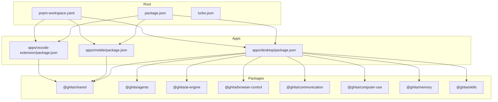
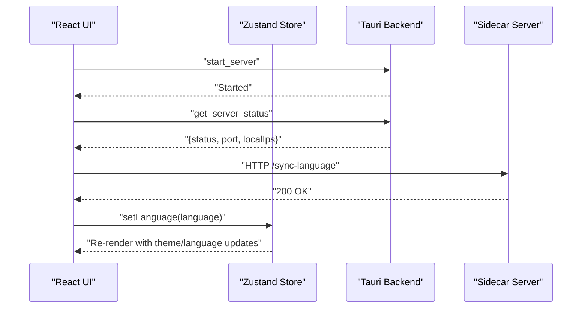
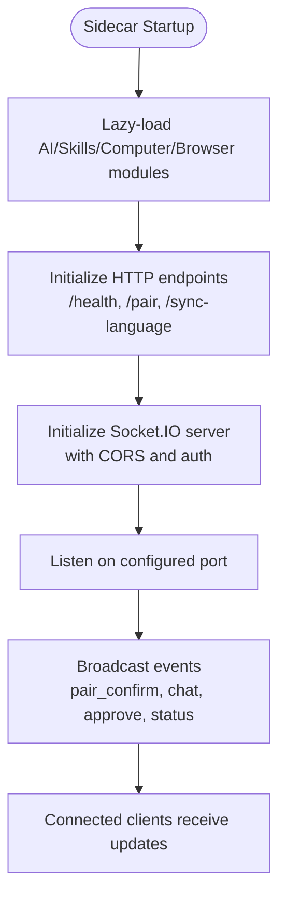
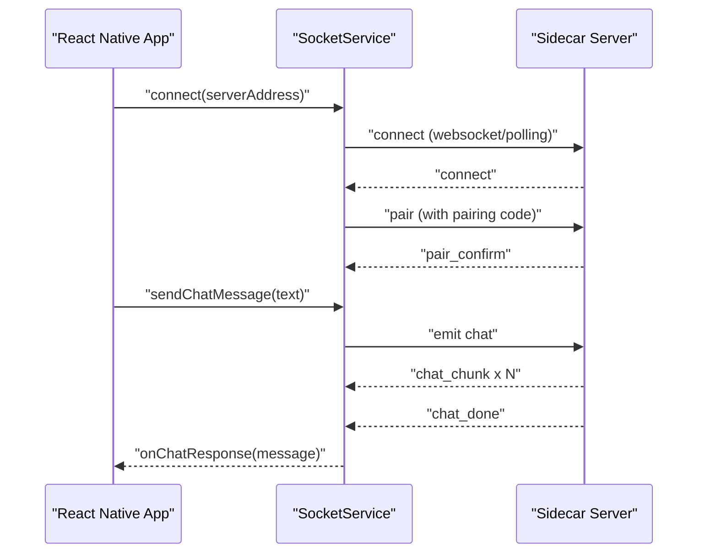
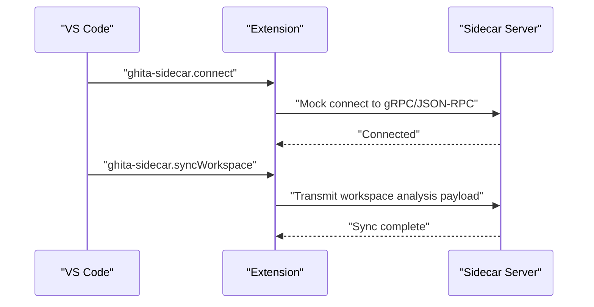
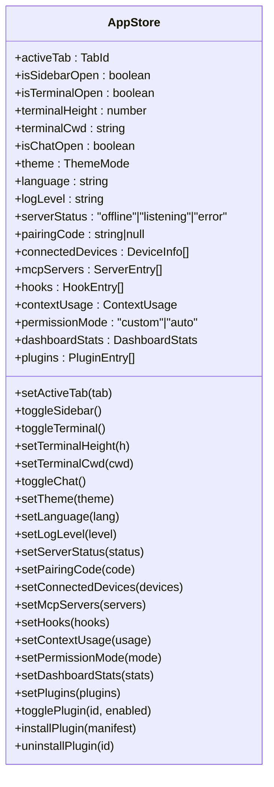
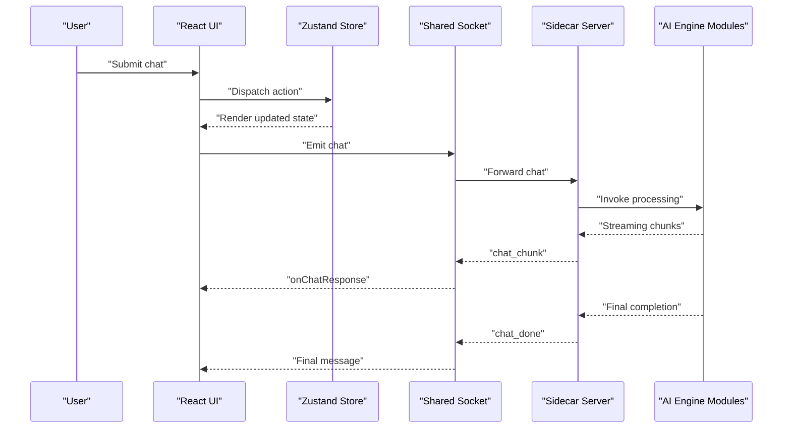
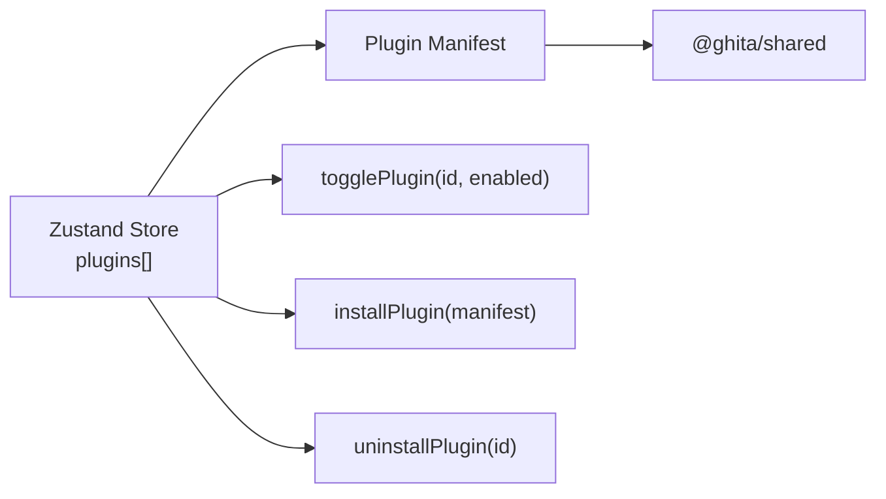
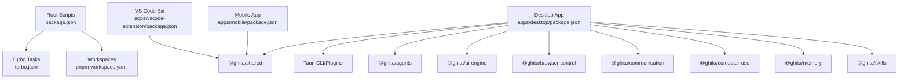

# Architecture Overview

<cite>
**Referenced Files in This Document**
- [package.json](file://package.json)
- [pnpm-workspace.yaml](file://pnpm-workspace.yaml)
- [turbo.json](file://turbo.json)
- [apps/desktop/package.json](file://apps/desktop/package.json)
- [apps/desktop/src/main.tsx](file://apps/desktop/src/main.tsx)
- [apps/desktop/src/App.tsx](file://apps/desktop/src/App.tsx)
- [apps/desktop/src/stores/appStore.ts](file://apps/desktop/src/stores/appStore.ts)
- [apps/desktop/src/utils/sharedSocket.ts](file://apps/desktop/src/utils/sharedSocket.ts)
- [apps/desktop/src-tauri/src/lib.rs](file://apps/desktop/src-tauri/src/lib.rs)
- [apps/desktop/src-tauri/src/main.rs](file://apps/desktop/src-tauri/src/main.rs)
- [apps/desktop/src-tauri/src/proxy.rs](file://apps/desktop/src-tauri/src/proxy.rs)
- [apps/desktop/src-tauri/sidecar/server.mjs](file://apps/desktop/src-tauri/sidecar/server.mjs)
- [apps/mobile/package.json](file://apps/mobile/package.json)
- [apps/mobile/src/services/socketService.ts](file://apps/mobile/src/services/socketService.ts)
- [apps/vscode-extension/package.json](file://apps/vscode-extension/package.json)
- [apps/vscode-extension/src/extension.ts](file://apps/vscode-extension/src/extension.ts)
- [packages/shared/package.json](file://packages/shared/package.json)
</cite>

## Table of Contents
1. [Introduction](#introduction)
2. [Project Structure](#project-structure)
3. [Core Components](#core-components)
4. [Architecture Overview](#architecture-overview)
5. [Detailed Component Analysis](#detailed-component-analysis)
6. [Dependency Analysis](#dependency-analysis)
7. [Performance Considerations](#performance-considerations)
8. [Troubleshooting Guide](#troubleshooting-guide)
9. [Conclusion](#conclusion)

## Introduction
This document presents the architecture overview of the GHITA CODING AGENT system. It explains how the monorepo is organized using TurboRepo and pnpm workspaces, and how the desktop application (Tauri 2.x + React), mobile applications (React Native), VS Code extension, and shared packages collaborate. It documents the relationships among the desktop sidecar server, AI engine, communication layer, and platform-specific implementations. It also describes data flow from user input through AI processing to cross-platform delivery, the state management architecture using Zustand, system boundaries and integration points, and the plugin architecture for extensibility.

## Project Structure
The repository follows a classic monorepo layout:
- Root manages shared tooling, linting, formatting, and orchestration via TurboRepo and pnpm workspaces.
- apps contains platform-specific applications:
  - Desktop (Tauri + React) with a Rust-based sidecar server and proxy.
  - Mobile (React Native) with a Socket.IO client service.
  - VS Code extension for workspace synchronization.
- packages contains shared libraries and domain modules reused across platforms.



**Diagram sources**
- [package.json:1-55](file://package.json#L1-L55)
- [pnpm-workspace.yaml:1-8](file://pnpm-workspace.yaml#L1-L8)
- [turbo.json:1-26](file://turbo.json#L1-L26)
- [apps/desktop/package.json:1-61](file://apps/desktop/package.json#L1-L61)
- [apps/mobile/package.json:1-44](file://apps/mobile/package.json#L1-L44)
- [apps/vscode-extension/package.json:1-61](file://apps/vscode-extension/package.json#L1-L61)
- [packages/shared/package.json:1-44](file://packages/shared/package.json#L1-L44)

**Section sources**
- [package.json:1-55](file://package.json#L1-L55)
- [pnpm-workspace.yaml:1-8](file://pnpm-workspace.yaml#L1-L8)
- [turbo.json:1-26](file://turbo.json#L1-L26)

## Core Components
- Desktop Application (Tauri + React)
  - React UI bootstrapped in main.tsx and rendered by App.tsx.
  - Zustand app store encapsulates UI state, communication state, and plugin metadata.
  - Shared Socket abstraction centralizes Socket.IO connections to the sidecar server.
  - Tauri commands bridge the React frontend to the Rust backend, managing the sidecar lifecycle and emitting events to the UI.
- Desktop Sidecar Server (Node.js)
  - Embedded standalone Socket.IO server for desktop↔mobile communication.
  - Lazy-loads AI engine, skills, computer use, and browser control modules to optimize startup.
  - Provides HTTP endpoints for health, pairing, language sync, and device management.
- Mobile Application (React Native)
  - SocketService encapsulates connection management, pairing, chat streaming, and approval flows.
  - Supports local LAN and cloud modes with reconnection and health checks.
- VS Code Extension
  - Provides commands to connect to the sidecar and synchronize workspace files.
  - Integrates with user configuration for sidecar port and auto-sync behavior.
- Shared Packages
  - Provide common types, constants, and utilities across platforms.
  - Enable consistent event names and data contracts for cross-platform messaging.

**Section sources**
- [apps/desktop/src/main.tsx:1-16](file://apps/desktop/src/main.tsx#L1-L16)
- [apps/desktop/src/App.tsx:1-188](file://apps/desktop/src/App.tsx#L1-L188)
- [apps/desktop/src/stores/appStore.ts:1-169](file://apps/desktop/src/stores/appStore.ts#L1-L169)
- [apps/desktop/src/utils/sharedSocket.ts:1-88](file://apps/desktop/src/utils/sharedSocket.ts#L1-L88)
- [apps/desktop/src-tauri/src/lib.rs:1-500](file://apps/desktop/src-tauri/src/lib.rs#L1-L500)
- [apps/desktop/src-tauri/sidecar/server.mjs:1-800](file://apps/desktop/src-tauri/sidecar/server.mjs#L1-L800)
- [apps/mobile/src/services/socketService.ts:1-525](file://apps/mobile/src/services/socketService.ts#L1-L525)
- [apps/vscode-extension/src/extension.ts:1-91](file://apps/vscode-extension/src/extension.ts#L1-L91)
- [packages/shared/package.json:1-44](file://packages/shared/package.json#L1-L44)

## Architecture Overview
The system is composed of three primary planes:
- Desktop Plane: React UI, Tauri backend, and embedded Node.js sidecar server.
- Mobile Plane: React Native client communicating via Socket.IO.
- VS Code Plane: Extension integrating with the desktop sidecar for workspace sync.

Communication flows:
- Desktop ↔ Mobile: Real-time bi-directional messaging via Socket.IO over localhost or optional cloud relay.
- Desktop ↔ AI Engine: Lazy-loaded modules invoked through the sidecar server.
- Desktop ↔ VS Code: Extension connects to the sidecar’s gRPC/JSON-RPC transport surface (mocked in the extension) and optionally syncs workspace files.

```mermaid
graph TB
subgraph "Desktop"
UI["React UI<br/>App.tsx"]
ZS["Zustand Store<br/>appStore.ts"]
TS["Tauri Backend<br/>lib.rs"]
SC["Sidecar Server<br/>server.mjs"]
SOCK["Shared Socket<br/>sharedSocket.ts"]
end
subgraph "Mobile"
RN["React Native App"]
SS["SocketService<br/>socketService.ts"]
end
subgraph "VS Code"
EXT["Extension<br/>extension.ts"]
end
UI --> ZS
UI --> SOCK
SOCK --> SC
TS < --> SC
RN --> SS
SS --> SC
EXT --> SC
```

**Diagram sources**
- [apps/desktop/src/App.tsx:1-188](file://apps/desktop/src/App.tsx#L1-L188)
- [apps/desktop/src/stores/appStore.ts:1-169](file://apps/desktop/src/stores/appStore.ts#L1-L169)
- [apps/desktop/src/utils/sharedSocket.ts:1-88](file://apps/desktop/src/utils/sharedSocket.ts#L1-L88)
- [apps/desktop/src-tauri/src/lib.rs:1-500](file://apps/desktop/src-tauri/src/lib.rs#L1-L500)
- [apps/desktop/src-tauri/sidecar/server.mjs:1-800](file://apps/desktop/src-tauri/sidecar/server.mjs#L1-L800)
- [apps/mobile/src/services/socketService.ts:1-525](file://apps/mobile/src/services/socketService.ts#L1-L525)
- [apps/vscode-extension/src/extension.ts:1-91](file://apps/vscode-extension/src/extension.ts#L1-L91)

## Detailed Component Analysis

### Desktop Application (Tauri + React)
- UI bootstrap and rendering are handled in main.tsx and App.tsx.
- AppContent initializes the sidecar server on startup, listens for sidecar events, and synchronizes language settings to the sidecar.
- Zustand appStore holds UI state, communication state (server status, pairing code, connected devices), and plugin metadata. It persists a subset of state to localStorage.
- Shared Socket abstraction ensures a single Socket.IO connection to the sidecar server, with session token authentication and reconnection logic.



**Diagram sources**
- [apps/desktop/src/App.tsx:71-92](file://apps/desktop/src/App.tsx#L71-L92)
- [apps/desktop/src/App.tsx:49-69](file://apps/desktop/src/App.tsx#L49-L69)
- [apps/desktop/src/stores/appStore.ts:35-110](file://apps/desktop/src/stores/appStore.ts#L35-L110)
- [apps/desktop/src-tauri/src/lib.rs:42-153](file://apps/desktop/src-tauri/src/lib.rs#L42-L153)
- [apps/desktop/src-tauri/src/lib.rs:187-235](file://apps/desktop/src-tauri/src/lib.rs#L187-L235)

**Section sources**
- [apps/desktop/src/main.tsx:1-16](file://apps/desktop/src/main.tsx#L1-L16)
- [apps/desktop/src/App.tsx:1-188](file://apps/desktop/src/App.tsx#L1-L188)
- [apps/desktop/src/stores/appStore.ts:1-169](file://apps/desktop/src/stores/appStore.ts#L1-L169)
- [apps/desktop/src/utils/sharedSocket.ts:1-88](file://apps/desktop/src/utils/sharedSocket.ts#L1-L88)
- [apps/desktop/src-tauri/src/lib.rs:1-500](file://apps/desktop/src-tauri/src/lib.rs#L1-L500)

### Desktop Sidecar Server (Node.js)
- Embedded Socket.IO server runs on a configurable port and exposes HTTP endpoints for health, pairing, and language sync.
- Lazy-loads AI engine, skills, computer use, and browser control modules to defer expensive initialization.
- Manages device pairing, approval flows, and broadcasting events to connected clients.
- Integrates with the Rust backend via Tauri commands to start/stop the sidecar and to emit IPC events to the UI.



**Diagram sources**
- [apps/desktop/src-tauri/sidecar/server.mjs:1-800](file://apps/desktop/src-tauri/sidecar/server.mjs#L1-L800)
- [apps/desktop/src-tauri/src/lib.rs:42-153](file://apps/desktop/src-tauri/src/lib.rs#L42-L153)

**Section sources**
- [apps/desktop/src-tauri/sidecar/server.mjs:1-800](file://apps/desktop/src-tauri/sidecar/server.mjs#L1-L800)
- [apps/desktop/src-tauri/src/lib.rs:1-500](file://apps/desktop/src-tauri/src/lib.rs#L1-L500)

### Mobile Application (React Native)
- SocketService encapsulates connection lifecycle, pairing, chat streaming, and approval flows.
- Supports local LAN and cloud modes with reconnection attempts and health checks.
- Emits typed callbacks for screenshots, chat responses, status updates, and cost telemetry.



**Diagram sources**
- [apps/mobile/src/services/socketService.ts:80-111](file://apps/mobile/src/services/socketService.ts#L80-L111)
- [apps/mobile/src/services/socketService.ts:330-520](file://apps/mobile/src/services/socketService.ts#L330-L520)

**Section sources**
- [apps/mobile/src/services/socketService.ts:1-525](file://apps/mobile/src/services/socketService.ts#L1-L525)

### VS Code Extension
- Provides commands to connect to the sidecar and to synchronize workspace files.
- Reads configuration for sidecar port and auto-sync behavior.
- Simulates workspace analysis and diff transmission to the Core daemon.



**Diagram sources**
- [apps/vscode-extension/src/extension.ts:25-66](file://apps/vscode-extension/src/extension.ts#L25-L66)

**Section sources**
- [apps/vscode-extension/src/extension.ts:1-91](file://apps/vscode-extension/src/extension.ts#L1-L91)
- [apps/vscode-extension/package.json:1-61](file://apps/vscode-extension/package.json#L1-L61)

### State Management Architecture (Zustand)
- Centralized state in appStore.ts includes UI tabs, sidebar visibility, terminal state, chat toggles, theme, language, log level, server status, pairing info, MCP servers, hooks, context usage, permission mode, dashboard stats, and plugins.
- Uses persistence middleware to store a subset of state in localStorage, enabling cross-session continuity for UI preferences and plugin state.
- React components subscribe to store slices to render and drive actions.



**Diagram sources**
- [apps/desktop/src/stores/appStore.ts:1-169](file://apps/desktop/src/stores/appStore.ts#L1-L169)

**Section sources**
- [apps/desktop/src/stores/appStore.ts:1-169](file://apps/desktop/src/stores/appStore.ts#L1-L169)

### Data Flow Patterns
- User Input to AI Processing:
  - Desktop: User interacts via UI; Zustand store coordinates state; Shared Socket sends chat messages to the sidecar; sidecar lazily loads AI engine modules and orchestrates skills; emits streaming chunks and final completion.
  - Mobile: User sends chat messages via SocketService; sidecar streams responses back to the mobile client.
- Cross-Platform Delivery:
  - Desktop ↔ Mobile: Socket.IO transport with pairing, approval, and telemetry.
  - Desktop ↔ VS Code: Extension connects to sidecar and syncs workspace files.



**Diagram sources**
- [apps/desktop/src/App.tsx:150-155](file://apps/desktop/src/App.tsx#L150-L155)
- [apps/desktop/src/utils/sharedSocket.ts:28-80](file://apps/desktop/src/utils/sharedSocket.ts#L28-L80)
- [apps/desktop/src-tauri/sidecar/server.mjs:1-800](file://apps/desktop/src-tauri/sidecar/server.mjs#L1-L800)

**Section sources**
- [apps/desktop/src/App.tsx:1-188](file://apps/desktop/src/App.tsx#L1-L188)
- [apps/desktop/src/utils/sharedSocket.ts:1-88](file://apps/desktop/src/utils/sharedSocket.ts#L1-L88)
- [apps/desktop/src-tauri/sidecar/server.mjs:1-800](file://apps/desktop/src-tauri/sidecar/server.mjs#L1-L800)

### Plugin Architecture
- Plugins are modeled as manifests with enable/disable toggles stored in the Zustand store.
- The desktop app can install/uninstall plugins and toggle their state; this enables modular extension of functionality without modifying core code.
- Shared types and utilities reside in @ghita/shared to maintain consistency across platforms.



**Diagram sources**
- [apps/desktop/src/stores/appStore.ts:70-76](file://apps/desktop/src/stores/appStore.ts#L70-L76)
- [apps/desktop/src/stores/appStore.ts:140-153](file://apps/desktop/src/stores/appStore.ts#L140-L153)
- [packages/shared/package.json:1-44](file://packages/shared/package.json#L1-L44)

**Section sources**
- [apps/desktop/src/stores/appStore.ts:1-169](file://apps/desktop/src/stores/appStore.ts#L1-L169)
- [packages/shared/package.json:1-44](file://packages/shared/package.json#L1-L44)

## Dependency Analysis
- Monorepo Orchestration
  - Root scripts delegate to TurboRepo tasks; pnpm workspaces define package relationships; TurboRepo defines task dependencies and caching.
- Desktop Dependencies
  - Desktop app depends on shared packages and integrates Tauri plugins for filesystem, shell, and dialogs.
- Mobile Dependencies
  - Mobile app depends on @ghita/shared and socket.io-client for real-time communication.
- VS Code Extension Dependencies
  - Depends on @ghita/shared and socket.io-client for sidecar connectivity.



**Diagram sources**
- [package.json:9-26](file://package.json#L9-L26)
- [turbo.json:3-7](file://turbo.json#L3-L7)
- [pnpm-workspace.yaml:1-8](file://pnpm-workspace.yaml#L1-L8)
- [apps/desktop/package.json:17-25](file://apps/desktop/package.json#L17-L25)
- [apps/mobile/package.json:17-28](file://apps/mobile/package.json#L17-L28)
- [apps/vscode-extension/package.json:52-54](file://apps/vscode-extension/package.json#L52-L54)

**Section sources**
- [package.json:1-55](file://package.json#L1-L55)
- [turbo.json:1-26](file://turbo.json#L1-L26)
- [pnpm-workspace.yaml:1-8](file://pnpm-workspace.yaml#L1-L8)
- [apps/desktop/package.json:1-61](file://apps/desktop/package.json#L1-L61)
- [apps/mobile/package.json:1-44](file://apps/mobile/package.json#L1-L44)
- [apps/vscode-extension/package.json:1-61](file://apps/vscode-extension/package.json#L1-L61)

## Performance Considerations
- Lazy Loading: Sidecar server defers loading of heavy modules (AI engine, skills, computer use, browser control) until first use to reduce startup latency.
- Connection Deduplication: Shared Socket ensures a single Socket.IO connection to the sidecar, avoiding redundant WebSocket overhead.
- Reconnection Strategy: Both desktop and mobile clients configure reconnection attempts and delays to improve resilience.
- Proxy Security and Limits: The Tauri proxy strips potentially unsafe headers while preserving essential ones, enforces body size limits, and applies timeouts to upstream requests.

[No sources needed since this section provides general guidance]

## Troubleshooting Guide
- Sidecar Not Starting
  - Verify Tauri commands for starting/stopping the sidecar and retrieving status.
  - Check sidecar script discovery and bundling paths.
- Connection Issues
  - Confirm Socket.IO connection establishment and pairing steps.
  - Review connection state transitions and error callbacks in SocketService.
- Language Sync Problems
  - Ensure HTTP endpoint for /sync-language is reachable and emits SYNC_LANGUAGE events.
- Proxy Errors
  - Validate proxy state transitions and upstream timeouts; confirm header stripping behavior.

**Section sources**
- [apps/desktop/src-tauri/src/lib.rs:42-153](file://apps/desktop/src-tauri/src/lib.rs#L42-L153)
- [apps/desktop/src-tauri/src/lib.rs:187-235](file://apps/desktop/src-tauri/src/lib.rs#L187-L235)
- [apps/desktop/src/utils/sharedSocket.ts:28-80](file://apps/desktop/src/utils/sharedSocket.ts#L28-L80)
- [apps/mobile/src/services/socketService.ts:330-520](file://apps/mobile/src/services/socketService.ts#L330-L520)
- [apps/desktop/src-tauri/sidecar/server.mjs:483-518](file://apps/desktop/src-tauri/sidecar/server.mjs#L483-L518)
- [apps/desktop/src-tauri/src/proxy.rs:139-224](file://apps/desktop/src-tauri/src/proxy.rs#L139-L224)

## Conclusion
The GHITA CODING AGENT employs a cohesive monorepo architecture leveraging TurboRepo and pnpm workspaces to coordinate a Tauri-powered desktop application, a React Native mobile client, and a VS Code extension. The embedded Node.js sidecar server orchestrates AI processing and cross-device communication via Socket.IO, while Zustand provides centralized state management across platforms. The plugin architecture and shared packages enable extensibility and consistency. Together, these components deliver a robust, scalable, and cross-platform AI coding assistant.