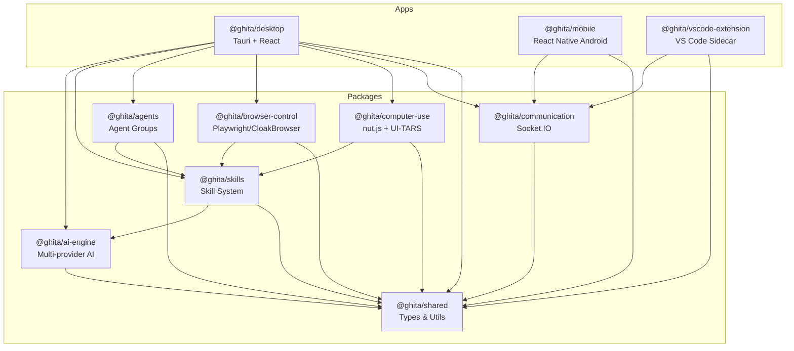
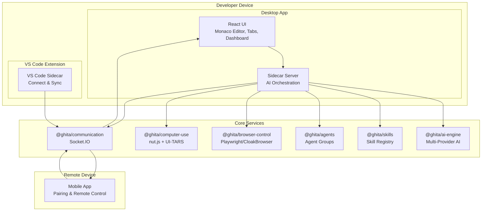
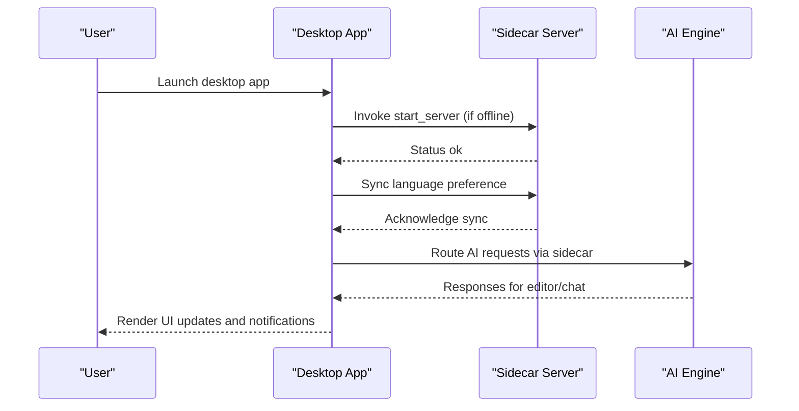
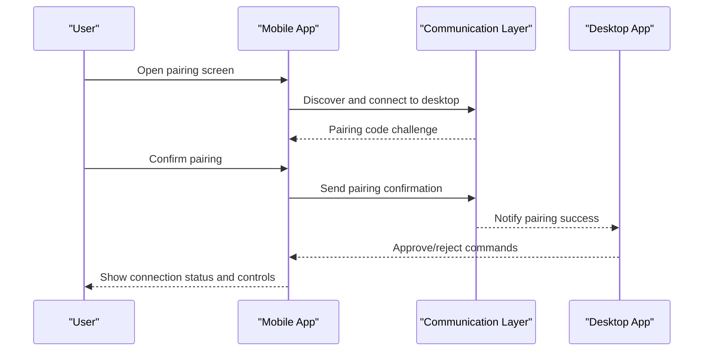
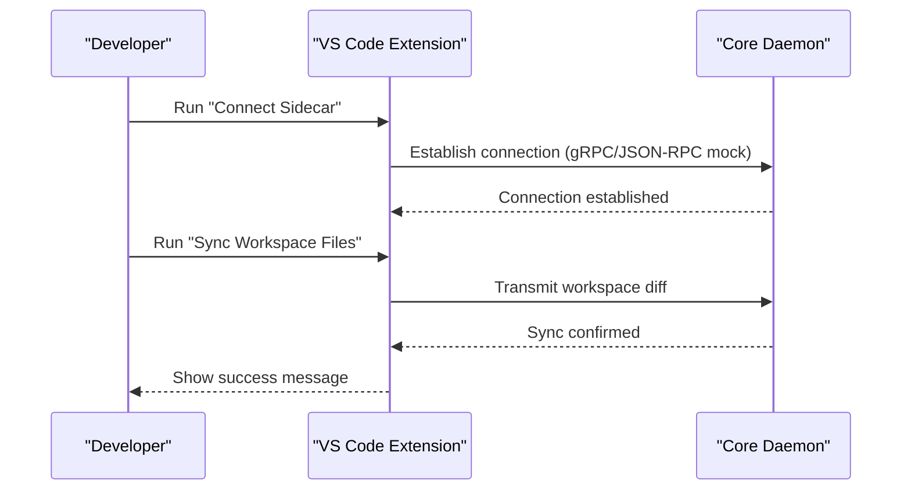
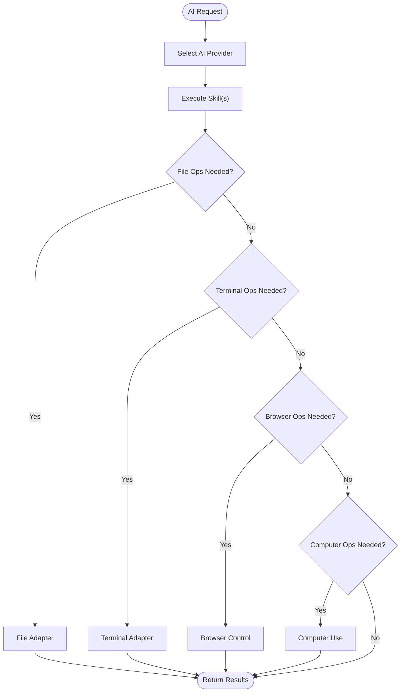
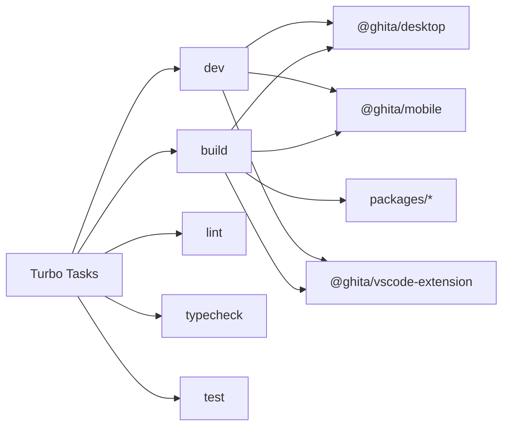

# Introduction and Purpose

<cite>
**Referenced Files in This Document**
- [README.md](file://README.md)
- [CONTRIBUTING.md](file://CONTRIBUTING.md)
- [package.json](file://package.json)
- [turbo.json](file://turbo.json)
- [apps/desktop/package.json](file://apps/desktop/package.json)
- [apps/mobile/package.json](file://apps/mobile/package.json)
- [apps/vscode-extension/package.json](file://apps/vscode-extension/package.json)
- [apps/desktop/src/App.tsx](file://apps/desktop/src/App.tsx)
- [apps/mobile/src/App.tsx](file://apps/mobile/src/App.tsx)
- [apps/vscode-extension/src/extension.ts](file://apps/vscode-extension/src/extension.ts)
- [packages/ai-engine/package.json](file://packages/ai-engine/package.json)
- [packages/skills/package.json](file://packages/skills/package.json)
- [packages/agents/package.json](file://packages/agents/package.json)
- [packages/browser-control/package.json](file://packages/browser-control/package.json)
- [packages/computer-use/package.json](file://packages/computer-use/package.json)
</cite>

## Table of Contents
1. [Introduction](#introduction)
2. [Project Structure](#project-structure)
3. [Core Components](#core-components)
4. [Architecture Overview](#architecture-overview)
5. [Detailed Component Analysis](#detailed-component-analysis)
6. [Dependency Analysis](#dependency-analysis)
7. [Performance Considerations](#performance-considerations)
8. [Troubleshooting Guide](#troubleshooting-guide)
9. [Conclusion](#conclusion)

## Introduction
GHITA CODING AGENT is an AI-powered development environment designed to unify fragmented workflows across desktop, mobile, and VS Code into a single, seamless experience. Its mission is to revolutionize developer productivity by removing friction between tools, enabling developers to write, review, automate, and control their development environment from anywhere—on a desktop app, a mobile device, or directly inside VS Code—while leveraging powerful AI capabilities.

Core problem addressed
- Fragmentation: Developers often juggle multiple tools—IDEs, terminals, browsers, phones—creating context switching and handoff overhead.
- Inconsistent AI assistance: Many AI tools operate in isolation, missing opportunities to coordinate actions across platforms.
- Limited remote control and automation: There is a gap in reliable, secure, and cross-platform remote control and browser/OS automation.

What GHITA CODING AGENT delivers
- Unified AI-assisted development: A cohesive environment spanning desktop, mobile, and VS Code.
- Cross-device collaboration: Secure pairing and remote control between devices.
- AI multi-provider orchestration: Support for multiple AI providers and local AI engines.
- Practical automation: Browser control, OS-level computer use, and skill-based workflows.
- Developer-first UX: VS Code-style editor, real-time dashboards, and consistent theming.

Vision and long-term goals
- Vision: A universal AI development companion that learns your workflows, coordinates across devices, and automates repetitive tasks so you can focus on creative and strategic work.
- Goals: Expand the skill marketplace, deepen multi-agent collaboration, improve security and privacy, and broaden platform support while maintaining simplicity and reliability.

Target audience
- Individual developers who want a powerful, portable AI assistant.
- Development teams seeking a shared, cross-platform environment for pair programming and remote collaboration.
- Remote workers needing secure, reliable control over their desktop from mobile devices.

Differentiation in the AI development space
- Multi-format unification: One workspace across desktop, mobile, and VS Code.
- Practical automation stack: Real browser control and OS-level computer use.
- Secure remote pairing: Two-way authentication for safe cross-device sessions.
- Extensible skills and agents: A marketplace and runtime for reusable AI capabilities.
- Open ecosystem: Multi-provider AI support and local AI compatibility.

## Project Structure
GHITA CODING AGENT follows a monorepo workspace managed by a modern build system, separating concerns into distinct apps and packages:

- Apps
  - Desktop: Tauri + React application for Windows/Linux with a VS Code-style interface.
  - Mobile: React Native Android app for remote pairing and control.
  - VS Code Extension: A lightweight sidecar that integrates with VS Code and coordinates with the core daemon.

- Packages
  - AI Engine: Multi-provider orchestration and runtime.
  - Skills: Reusable AI capabilities with marketplace support.
  - Agents: Agent lifecycle and group management.
  - Browser Control: Playwright/CloakBrowser-based automation.
  - Computer Use: OS-level automation using desktop control libraries.
  - Communication: Socket.IO-based desktop-mobile communication.
  - Shared: Common types, utilities, and constants.

**Diagram sources**
- [package.json:9-26](file://package.json#L9-L26)
- [turbo.json:1-26](file://turbo.json#L1-L26)
- [apps/desktop/package.json:17-43](file://apps/desktop/package.json#L17-L43)
- [apps/mobile/package.json:17-29](file://apps/mobile/package.json#L17-L29)
- [apps/vscode-extension/package.json:52-55](file://apps/vscode-extension/package.json#L52-L55)
- [packages/ai-engine/package.json:24-31](file://packages/ai-engine/package.json#L24-L31)
- [packages/skills/package.json:31-35](file://packages/skills/package.json#L31-L35)
- [packages/agents/package.json:26-29](file://packages/agents/package.json#L26-L29)
- [packages/browser-control/package.json:26-32](file://packages/browser-control/package.json#L26-L32)
- [packages/computer-use/package.json:27-32](file://packages/computer-use/package.json#L27-L32)

**Section sources**
- [README.md:58-79](file://README.md#L58-L79)
- [package.json:9-26](file://package.json#L9-L26)
- [turbo.json:1-26](file://turbo.json#L1-L26)

## Core Components
- Desktop app
  - Provides a VS Code-style interface with Monaco Editor, tabs, dashboard, and integrated AI features.
  - Manages a sidecar server for AI operations and device communication.
  - Handles pairing confirmations, command approvals, and real-time notifications.

- Mobile app
  - Enables secure pairing with the desktop and remote control via Socket.IO.
  - Offers quick actions and screen preview for remote operations.

- VS Code extension
  - Integrates with VS Code to connect to the core daemon and synchronize workspace files.
  - Provides commands to connect the sidecar and trigger workspace sync.

- AI Engine
  - Orchestrates multiple AI providers and supports local AI engines.
  - Powers agent and skill execution with standardized interfaces.

- Skills
  - Reusable AI capabilities that can be enabled/disabled per user/device.
  - Includes adapters for file operations, terminal commands, and screenshots.

- Agents
  - Agent lifecycle and group management for coordinated workflows.
  - Supports role-based collaboration and multi-agent orchestration.

- Browser Control
  - Automates Chrome-based tasks using Playwright and stealth techniques.
  - Works in tandem with computer use for end-to-end automation.

- Computer Use
  - OS-level automation for mouse, keyboard, and application control.
  - Designed with safety and opt-in permissions in mind.

- Communication
  - Socket.IO-based protocol for secure, real-time communication between desktop and mobile.
  - Supports telemetry, terminal command approval gates, and live streams.

**Section sources**
- [README.md:26-55](file://README.md#L26-L55)
- [apps/desktop/src/App.tsx:15-92](file://apps/desktop/src/App.tsx#L15-L92)
- [apps/mobile/src/App.tsx:78-102](file://apps/mobile/src/App.tsx#L78-L102)
- [apps/vscode-extension/src/extension.ts:14-79](file://apps/vscode-extension/src/extension.ts#L14-L79)
- [packages/ai-engine/package.json:24-31](file://packages/ai-engine/package.json#L24-L31)
- [packages/skills/package.json:31-35](file://packages/skills/package.json#L31-L35)
- [packages/agents/package.json:26-29](file://packages/agents/package.json#L26-L29)
- [packages/browser-control/package.json:26-32](file://packages/browser-control/package.json#L26-L32)
- [packages/computer-use/package.json:27-32](file://packages/computer-use/package.json#L27-L32)

## Architecture Overview
GHITA CODING AGENT’s architecture centers around a core daemon (sidecar server) that bridges AI orchestration, automation, and communication. The desktop app hosts the UI and sidecar, while the mobile app connects securely for remote control. The VS Code extension integrates with the same core to synchronize workspaces and trigger AI-assisted tasks.

**Diagram sources**
- [apps/desktop/src/App.tsx:71-92](file://apps/desktop/src/App.tsx#L71-L92)
- [apps/vscode-extension/src/extension.ts:25-66](file://apps/vscode-extension/src/extension.ts#L25-L66)
- [apps/mobile/src/App.tsx:1-102](file://apps/mobile/src/App.tsx#L1-L102)
- [packages/ai-engine/package.json:24-31](file://packages/ai-engine/package.json#L24-L31)
- [packages/skills/package.json:31-35](file://packages/skills/package.json#L31-L35)
- [packages/agents/package.json:26-29](file://packages/agents/package.json#L26-L29)
- [packages/browser-control/package.json:26-32](file://packages/browser-control/package.json#L26-L32)
- [packages/computer-use/package.json:27-32](file://packages/computer-use/package.json#L27-L32)
- [packages/communication/package.json:1-40](file://packages/communication/package.json#L1-L40)

## Detailed Component Analysis

### Desktop App: Seamless AI-Assisted Development
The desktop app initializes the sidecar server on startup, synchronizes language preferences, and listens for sidecar events to surface real-time feedback to the user. It provides a cohesive environment for coding, chatting, and managing AI tools.

**Diagram sources**
- [apps/desktop/src/App.tsx:71-92](file://apps/desktop/src/App.tsx#L71-L92)
- [apps/desktop/src/App.tsx:49-69](file://apps/desktop/src/App.tsx#L49-L69)
- [apps/desktop/src/App.tsx:100-168](file://apps/desktop/src/App.tsx#L100-L168)

**Section sources**
- [apps/desktop/src/App.tsx:15-92](file://apps/desktop/src/App.tsx#L15-L92)

### Mobile App: Secure Remote Control
The mobile app focuses on secure pairing and remote control. It communicates with the desktop via Socket.IO, enabling live screen previews and controlled operations with explicit approval flows.

**Diagram sources**
- [apps/mobile/src/App.tsx:78-102](file://apps/mobile/src/App.tsx#L78-L102)
- [apps/desktop/src/App.tsx:100-168](file://apps/desktop/src/App.tsx#L100-L168)

**Section sources**
- [apps/mobile/src/App.tsx:78-102](file://apps/mobile/src/App.tsx#L78-L102)

### VS Code Extension: IDE Integration
The VS Code extension provides a lightweight bridge to the core daemon, allowing developers to connect the sidecar and synchronize workspace files directly from their editor.

**Diagram sources**
- [apps/vscode-extension/src/extension.ts:25-66](file://apps/vscode-extension/src/extension.ts#L25-L66)

**Section sources**
- [apps/vscode-extension/src/extension.ts:14-79](file://apps/vscode-extension/src/extension.ts#L14-L79)

### AI Engine and Skills: Practical Automation
The AI Engine orchestrates multiple providers and powers Skills that enable practical automation across file operations, terminal commands, and browser tasks. Agents coordinate these skills into workflows.

**Diagram sources**
- [packages/ai-engine/package.json:24-31](file://packages/ai-engine/package.json#L24-L31)
- [packages/skills/package.json:31-35](file://packages/skills/package.json#L31-L35)
- [packages/browser-control/package.json:26-32](file://packages/browser-control/package.json#L26-L32)
- [packages/computer-use/package.json:27-32](file://packages/computer-use/package.json#L27-L32)

**Section sources**
- [packages/ai-engine/package.json:24-31](file://packages/ai-engine/package.json#L24-L31)
- [packages/skills/package.json:31-35](file://packages/skills/package.json#L31-L35)
- [packages/browser-control/package.json:26-32](file://packages/browser-control/package.json#L26-L32)
- [packages/computer-use/package.json:27-32](file://packages/computer-use/package.json#L27-L32)

## Dependency Analysis
The monorepo uses a build system that enforces task dependencies and caching, ensuring consistent builds across apps and packages. Workspaces are organized to minimize duplication and maximize reusability.

**Diagram sources**
- [turbo.json:3-24](file://turbo.json#L3-L24)
- [package.json:9-26](file://package.json#L9-L26)

**Section sources**
- [turbo.json:1-26](file://turbo.json#L1-L26)
- [package.json:9-26](file://package.json#L9-L26)

## Performance Considerations
- Sidecar initialization: The desktop app automatically starts the sidecar server on launch to reduce latency and ensure availability for AI and communication tasks.
- Event-driven UI updates: Real-time notifications and pairing confirmations keep the user informed without blocking the main thread.
- Minimal overhead: The VS Code extension uses lightweight commands and avoids heavy computations locally, delegating to the core daemon.

## Troubleshooting Guide
- Desktop app not starting
  - Ensure Rust and Node.js meet the minimum requirements.
  - Rebuild the sidecar server if needed.
  - Verify the sidecar port is free.

- Mobile cannot connect to desktop
  - Confirm both devices are on the same network.
  - Check the communication server status and pairing code.
  - Try manual IP address entry if automatic discovery fails.

- AI provider not working
  - Verify API keys in the environment configuration.
  - Confirm the provider is enabled in the API Manager.
  - For local AI, ensure the service is running and reachable.

- Skills not functioning
  - Some skills require specific adapters (file, terminal, screenshot).
  - Computer and browser skills are disabled by default for security.
  - Enable required skills and ensure prerequisite tools are installed.

**Section sources**
- [README.md:143-168](file://README.md#L143-L168)

## Conclusion
GHITA CODING AGENT sets out to unify fragmented development workflows by bringing AI-assisted coding, secure remote control, and practical automation together across desktop, mobile, and VS Code. By combining a robust AI engine, extensible skills, and a cohesive communication layer, it aims to become the central hub for modern, cross-platform development. Whether you are an individual developer, part of a team, or working remotely, GHITA CODING AGENT offers a consistent, secure, and powerful environment to elevate productivity and streamline workflows.