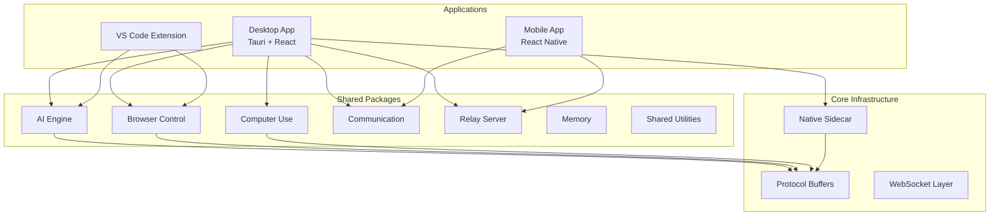
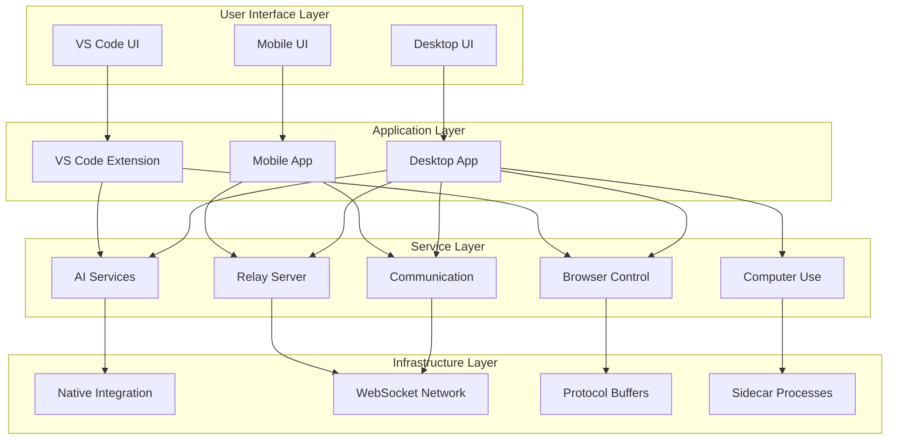
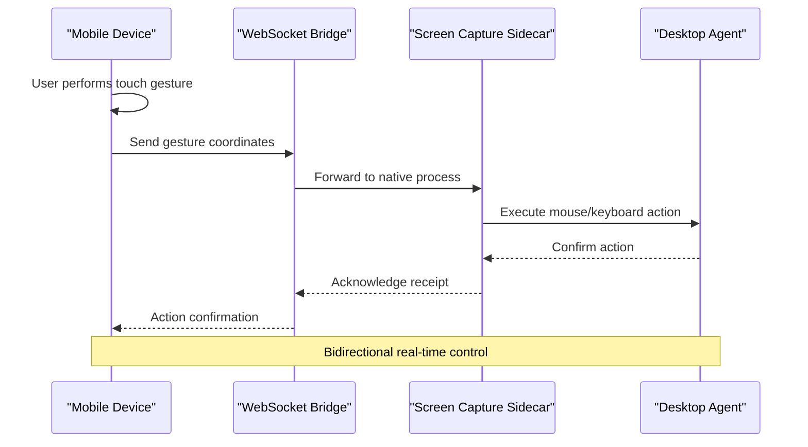
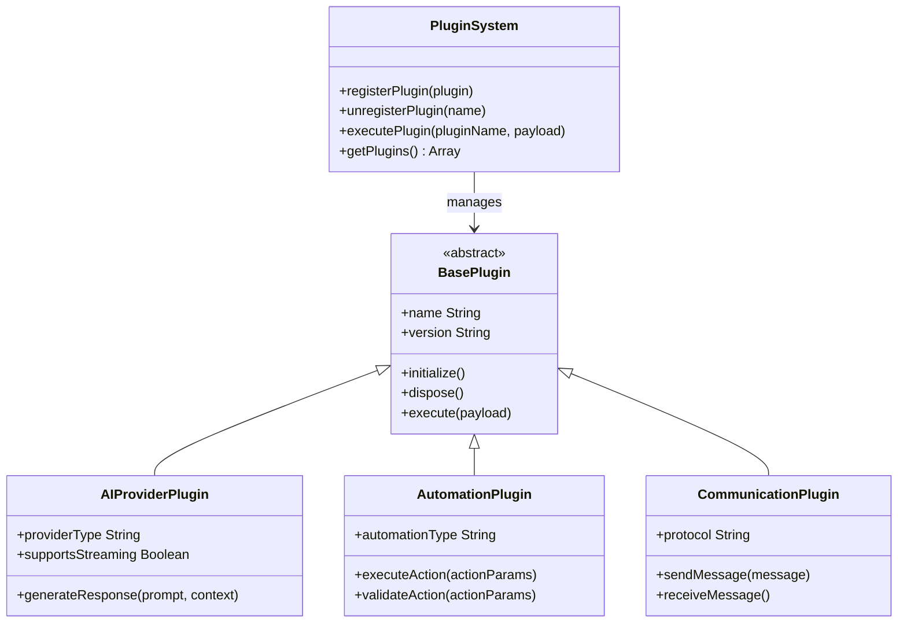
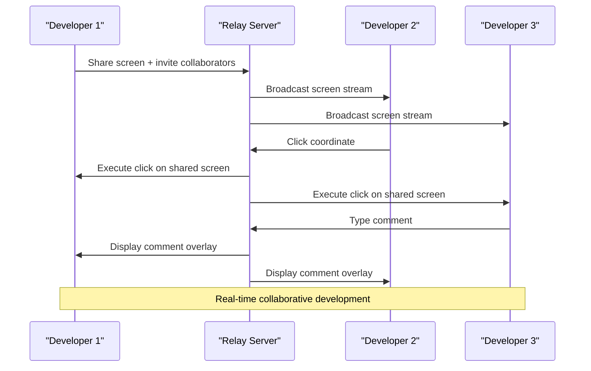

# Key Features and Capabilities

<cite>
**Referenced Files in This Document**
- [README.md](file://README.md)
- [package.json](file://package.json)
- [turbo.json](file://turbo.json)
- [apps/desktop/src/App.tsx](file://apps/desktop/src/App.tsx)
- [apps/desktop/src/main.tsx](file://apps/desktop/src/main.tsx)
- [apps/desktop/src/components/ApiManager.tsx](file://apps/desktop/src/components/ApiManager.tsx)
- [apps/desktop/src/utils/apiConfig.ts](file://apps/desktop/src/utils/apiConfig.ts)
- [apps/desktop/src/views/DashboardView.tsx](file://apps/desktop/src/views/DashboardView.tsx)
- [apps/desktop/src/views/DevicesView.tsx](file://apps/desktop/src/views/DevicesView.tsx)
- [apps/desktop/src/views/SkillsView.tsx](file://apps/desktop/src/views/SkillsView.tsx)
- [apps/desktop/src/views/AgentsView.tsx](file://apps/desktop/src/views/AgentsView.tsx)
- [apps/desktop/src/stores/appStore.ts](file://apps/desktop/src/stores/appStore.ts)
- [apps/desktop/src/utils/sharedSocket.ts](file://apps/desktop/src/utils/sharedSocket.ts)
- [apps/desktop/src-tauri/src/main.rs](file://apps/desktop/src-tauri/src/main.rs)
- [apps/desktop/src-tauri/src/lib.rs](file://apps/desktop/src-tauri/src/lib.rs)
- [apps/desktop/src-tauri/proto/agent.proto](file://apps/desktop/src-tauri/proto/agent.proto)
- [apps/desktop/src-tauri/src/proxy.rs](file://apps/desktop/src-tauri/src/proxy.rs)
- [apps/desktop/src-tauri/sidecar/server.mjs](file://apps/desktop/src-tauri/sidecar/server.mjs)
- [apps/desktop/src-tauri/sidecar/screenCapture_1.3.2.bat](file://apps/desktop/src-tauri/sidecar/screenCapture_1.3.2.bat)
- [apps/desktop/package.json](file://apps/desktop/package.json)
- [apps/mobile/src/App.tsx](file://apps/mobile/src/App.tsx)
- [apps/mobile/src/screens/RemoteControlScreen.tsx](file://apps/mobile/src/screens/RemoteControlScreen.tsx)
- [apps/mobile/src/services/socketService.ts](file://apps/mobile/src/services/socketService.ts)
- [apps/mobile/src/services/bluetoothService.ts](file://apps/mobile/src/services/bluetoothService.ts)
- [apps/mobile/src/components/ScreenPreview.tsx](file://apps/mobile/src/components/ScreenPreview.tsx)
- [apps/vscode-extension/src/extension.ts](file://apps/vscode-extension/src/extension.ts)
- [apps/vscode-extension/package.json](file://apps/vscode-extension/package.json)
- [packages/ai-engine/src/proto/agent.proto](file://packages/ai-engine/src/proto/agent.proto)
- [packages/relay-server/package.json](file://packages/relay-server/package.json)
- [packages/communication/package.json](file://packages/communication/package.json)
- [packages/browser-control/package.json](file://packages/browser-control/package.json)
- [packages/computer-use/package.json](file://packages/computer-use/package.json)
- [packages/skills/package.json](file://packages/skills/package.json)
- [packages/memory/package.json](file://packages/memory/package.json)
- [packages/shared/package.json](file://packages/shared/package.json)
</cite>

## Table of Contents
1. [Introduction](#introduction)
2. [Project Structure](#project-structure)
3. [Core Components](#core-components)
4. [Architecture Overview](#architecture-overview)
5. [Detailed Feature Analysis](#detailed-feature-analysis)
6. [Plugin-Based Extensibility System](#plugin-based-extensibility-system)
7. [Real-Time Collaboration Capabilities](#real-time-collaboration-capabilities)
8. [Cross-Platform Consistency](#cross-platform-consistency)
9. [Practical Productivity Examples](#practical-productivity-examples)
10. [Conclusion](#conclusion)

## Introduction
GHITA CODING AGENT is a comprehensive AI-powered development environment designed to enhance developer productivity through integrated AI assistance, remote desktop control, intelligent automation, and seamless workspace synchronization across desktop, mobile, and extension platforms. The system provides a unified interface for AI-assisted coding with multi-provider support, real-time remote control capabilities, browser automation, and sophisticated workspace management.

## Project Structure
The project follows a modular monorepo architecture with clear separation between platform-specific applications and shared packages:

**Diagram sources**
- [package.json:1-50](file://package.json#L1-L50)
- [turbo.json:1-30](file://turbo.json#L1-L30)
- [apps/desktop/package.json:1-40](file://apps/desktop/package.json#L1-L40)
- [apps/mobile/package.json:1-30](file://apps/mobile/package.json#L1-L30)
- [apps/vscode-extension/package.json:1-25](file://apps/vscode-extension/package.json#L1-L25)

**Section sources**
- [package.json:1-100](file://package.json#L1-L100)
- [turbo.json:1-50](file://turbo.json#L1-L50)

## Core Components
The system is built around several core architectural components that work together to provide comprehensive development assistance:

### Multi-Platform Application Layer
- **Desktop Application**: Built with Tauri and React, providing native desktop functionality with deep system integration
- **Mobile Application**: React Native-based remote control interface for iOS and Android devices
- **VS Code Extension**: Seamless IDE integration for existing development workflows

### Shared Package Ecosystem
- **AI Engine**: Centralized artificial intelligence provider abstraction supporting OpenAI, Anthropic, Google, and Ollama
- **Communication Layer**: Real-time messaging infrastructure using WebSocket connections
- **Browser Control**: Automated web interaction capabilities for testing and development tasks
- **Computer Use**: Intelligent automation for mouse, keyboard, and screen interaction
- **Memory Management**: Persistent workspace and session state management
- **Skills Framework**: Plugin-based capability extension system

**Section sources**
- [apps/desktop/src/App.tsx:1-80](file://apps/desktop/src/App.tsx#L1-L80)
- [apps/mobile/src/App.tsx:1-60](file://apps/mobile/src/App.tsx#L1-L60)
- [apps/vscode-extension/src/extension.ts:1-50](file://apps/vscode-extension/src/extension.ts#L1-L50)

## Architecture Overview
The system employs a distributed architecture with clear separation of concerns across platforms and services:

**Diagram sources**
- [apps/desktop/src-tauri/src/main.rs:1-40](file://apps/desktop/src-tauri/src/main.rs#L1-L40)
- [apps/desktop/src-tauri/src/lib.rs:1-40](file://apps/desktop/src-tauri/src/lib.rs#L1-L40)
- [apps/desktop/src-tauri/proto/agent.proto:1-30](file://apps/desktop/src-tauri/proto/agent.proto#L1-L30)
- [apps/desktop/src/utils/sharedSocket.ts:1-40](file://apps/desktop/src/utils/sharedSocket.ts#L1-L40)

## Detailed Feature Analysis

### AI-Assisted Coding with Multi-Provider Support
The AI engine provides comprehensive natural language processing and code generation capabilities through multiple provider integrations:

#### Implementation Approach
- **Provider Abstraction Layer**: Unified interface supporting OpenAI, Anthropic, Google, and Ollama providers
- **Context-Aware Processing**: Dynamic prompt engineering based on current workspace context
- **Multi-Modal Responses**: Text, code blocks, and structured data responses
- **Caching and Optimization**: Intelligent caching of prompts and responses for improved performance

#### Technical Capabilities
- Real-time code completion and suggestions
- Natural language to code translation
- Code refactoring and optimization recommendations
- Multi-language support with context preservation
- Streaming response handling for large outputs

#### User Benefits
- Reduced cognitive load through intelligent code assistance
- Consistent quality across different AI providers
- Context-aware suggestions that match current development context
- Faster prototyping and experimentation cycles

**Section sources**
- [apps/desktop/src/components/ApiManager.tsx:1-120](file://apps/desktop/src/components/ApiManager.tsx#L1-L120)
- [apps/desktop/src/utils/apiConfig.ts:1-80](file://apps/desktop/src/utils/apiConfig.ts#L1-L80)
- [apps/desktop/src/hooks/useModelSelection.ts:1-60](file://apps/desktop/src/hooks/useModelSelection.ts#L1-L60)

### Remote Desktop Control via Mobile Devices
The mobile application enables comprehensive remote desktop control with screen sharing and interactive capabilities:

#### Implementation Approach
- **Bluetooth Pairing**: Secure device discovery and pairing mechanisms
- **WebSocket Communication**: Real-time bidirectional communication between devices
- **Screen Capture Integration**: Native sidecar process for efficient screen capture
- **Touch-to-Desktop Translation**: Accurate mapping of mobile touch events to desktop interactions

#### Technical Capabilities
- Real-time screen mirroring with configurable resolution
- Touch gesture recognition and translation
- Keyboard input forwarding and special key handling
- File transfer capabilities between devices
- Battery optimization and connection management

#### User Benefits
- Ability to control development machines from anywhere
- Enhanced collaboration through shared screen experiences
- Quick access to development environments during meetings
- Streamlined debugging and testing workflows

**Diagram sources**
- [apps/mobile/src/services/socketService.ts:1-80](file://apps/mobile/src/services/socketService.ts#L1-L80)
- [apps/mobile/src/services/bluetoothService.ts:1-60](file://apps/mobile/src/services/bluetoothService.ts#L1-L60)
- [apps/desktop/src-tauri/sidecar/server.mjs:1-100](file://apps/desktop/src-tauri/sidecar/server.mjs#L1-L100)

**Section sources**
- [apps/mobile/src/screens/RemoteControlScreen.tsx:1-100](file://apps/mobile/src/screens/RemoteControlScreen.tsx#L1-L100)
- [apps/mobile/src/components/ScreenPreview.tsx:1-80](file://apps/mobile/src/components/ScreenPreview.tsx#L1-L80)
- [apps/desktop/src-tauri/sidecar/screenCapture_1.3.2.bat:1-20](file://apps/desktop/src-tauri/sidecar/screenCapture_1.3.2.bat#L1-L20)

### Intelligent Automation Through Computer Use and Browser Control
The system provides sophisticated automation capabilities for both computer interaction and web browsing:

#### Computer Use Automation
- **Mouse and Keyboard Control**: Precise cursor manipulation and input simulation
- **Screen Interaction**: Screenshot capture, region selection, and visual element detection
- **Window Management**: Application switching, window positioning, and focus control
- **File System Operations**: Drag-and-drop, clipboard operations, and file navigation

#### Browser Control Capabilities
- **Automated Testing**: Form filling, button clicking, and navigation sequences
- **Content Extraction**: Data scraping and information retrieval from web pages
- **State Management**: Session persistence and cookie handling
- **Multi-tab Operations**: Concurrent tab management and coordination

#### Implementation Approach
- **Protocol Buffer Integration**: Structured communication between components
- **Native Process Management**: Sidecar processes for low-level system access
- **Event-Driven Architecture**: Reactive automation based on system events
- **Safety Mechanisms**: Preventive measures against unintended actions

**Section sources**
- [packages/computer-use/package.json:1-25](file://packages/computer-use/package.json#L1-L25)
- [packages/browser-control/package.json:1-25](file://packages/browser-control/package.json#L1-L25)
- [apps/desktop/src-tauri/proto/agent.proto:1-30](file://apps/desktop/src-tauri/proto/agent.proto#L1-L30)

### VS Code Workspace Synchronization and Integration
Seamless integration with existing development workflows through VS Code extension:

#### Implementation Approach
- **Extension Architecture**: Standard VS Code extension framework compliance
- **Workspace Awareness**: Real-time synchronization of open files and project state
- **Command Integration**: Custom commands that leverage GHITA agent capabilities
- **Settings Management**: Persistent configuration across sessions

#### Technical Capabilities
- File tree synchronization with desktop application
- Active editor state sharing for context-aware AI assistance
- Integrated chat interface within VS Code UI
- Cross-platform workspace consistency

#### User Benefits
- Familiar IDE environment with enhanced AI capabilities
- Minimal workflow disruption through native integration
- Consistent development experience across different contexts
- Leveraging existing VS Code ecosystem and extensions

**Section sources**
- [apps/vscode-extension/src/extension.ts:1-120](file://apps/vscode-extension/src/extension.ts#L1-L120)
- [apps/vscode-extension/package.json:1-30](file://apps/vscode-extension/package.json#L1-L30)

## Plugin-Based Extensibility System
The system employs a sophisticated plugin architecture that enables dynamic feature addition and customization:

### Plugin Architecture Overview

**Diagram sources**
- [packages/skills/package.json:1-25](file://packages/skills/package.json#L1-L25)
- [packages/ai-engine/src/proto/agent.proto:1-30](file://packages/ai-engine/src/proto/agent.proto#L1-L30)

### Plugin Types and Capabilities
- **AI Provider Plugins**: Extendable AI service integrations with standardized interfaces
- **Automation Plugins**: Customizable automation workflows and action handlers
- **Communication Plugins**: Flexible messaging protocols and transport mechanisms
- **Skill Plugins**: Domain-specific capabilities and specialized functions

### Extensibility Benefits
- **Modular Architecture**: Independent feature development and deployment
- **Version Compatibility**: Backward compatibility and gradual migration paths
- **Security Isolation**: Sandboxed plugin execution with resource limitations
- **Performance Optimization**: Lazy loading and selective activation of plugins

**Section sources**
- [packages/skills/package.json:1-25](file://packages/skills/package.json#L1-L25)
- [packages/shared/package.json:1-25](file://packages/shared/package.json#L1-L25)

## Real-Time Collaboration Capabilities
The system provides advanced real-time collaboration features that distinguish it from traditional development tools:

### Multi-Device Synchronization
- **Live Screen Sharing**: Real-time screen mirroring with multiple viewer support
- **Cooperative Editing**: Simultaneous editing capabilities with conflict resolution
- **Shared Workspaces**: Persistent collaborative environments across sessions
- **Activity Tracking**: Comprehensive audit trails of collaborative activities

### Communication Infrastructure
- **WebSocket-Based Messaging**: Low-latency bidirectional communication
- **Message Queuing**: Reliable delivery with retry mechanisms and acknowledgments
- **Presence Management**: Real-time status updates and availability indicators
- **Secure Channels**: Encrypted communication channels with authentication

### Collaboration Features
- **Multi-User Sessions**: Support for team-based development environments
- **Role-Based Access**: Different permission levels for various collaborators
- **Activity Broadcasting**: Live updates of all significant actions and changes
- **Conflict Resolution**: Intelligent merging of concurrent modifications

**Diagram sources**
- [packages/relay-server/package.json:1-25](file://packages/relay-server/package.json#L1-L25)
- [apps/desktop/src/utils/sharedSocket.ts:1-80](file://apps/desktop/src/utils/sharedSocket.ts#L1-L80)

**Section sources**
- [packages/communication/package.json:1-25](file://packages/communication/package.json#L1-L25)
- [packages/relay-server/package.json:1-25](file://packages/relay-server/package.json#L1-L25)

## Cross-Platform Consistency
The system ensures consistent functionality and user experience across all supported platforms:

### Platform-Specific Optimizations
- **Desktop**: Full native capabilities with system-level integration
- **Mobile**: Touch-optimized interfaces with gesture support
- **VS Code**: Seamless IDE integration with familiar workflows

### Consistency Mechanisms
- **Unified API Layer**: Standardized interfaces across all platforms
- **Centralized State Management**: Synchronized application state across devices
- **Common Protocol Definitions**: Shared communication standards and data formats
- **Consistent Authentication**: Single sign-on across all platform components

### User Experience Continuity
- **Familiar Navigation Patterns**: Consistent UI paradigms across platforms
- **Shared Feature Sets**: Equivalent functionality regardless of chosen platform
- **Persistent User Preferences**: Configuration synchronization across devices
- **Unified Help and Documentation**: Consistent learning resources and support

**Section sources**
- [apps/desktop/src/views/DashboardView.tsx:1-60](file://apps/desktop/src/views/DashboardView.tsx#L1-L60)
- [apps/desktop/src/views/DevicesView.tsx:1-60](file://apps/desktop/src/views/DevicesView.tsx#L1-L60)
- [apps/mobile/src/screens/PairingScreen.tsx:1-60](file://apps/mobile/src/screens/PairingScreen.tsx#L1-L60)

## Practical Productivity Examples
The combination of these features creates powerful workflows that significantly enhance developer productivity:

### Example 1: Remote Debugging and Pair Programming
A developer working remotely can share their screen with colleagues while receiving AI-powered code suggestions. The mobile app allows for quick gestures to navigate between files and execute debugging commands, while the VS Code extension maintains familiar editing capabilities.

### Example 2: Cross-Platform Development Workflow
Teams can collaborate on projects from different locations using shared workspaces. Desktop users handle complex development tasks while mobile users provide quick feedback and navigation assistance. The AI engine provides context-aware suggestions that adapt to the current platform and task context.

### Example 3: Automated Testing and Quality Assurance
The browser control capabilities enable automated testing scenarios that can be triggered from any platform. Results are synchronized across devices, allowing teams to review test outcomes and coordinate fixes in real-time.

### Example 4: Knowledge Sharing and Onboarding
New team members can quickly become productive through AI-assisted onboarding, guided tours of the codebase, and real-time collaboration with experienced developers. The system maintains consistent learning experiences across all platforms.

## Conclusion
GHITA CODING AGENT represents a paradigm shift in developer tooling by combining AI assistance, remote collaboration, and intelligent automation into a cohesive platform. Its modular architecture, real-time communication capabilities, and cross-platform consistency create unprecedented opportunities for enhancing developer productivity while maintaining flexibility and extensibility for future enhancements.

The system's plugin-based architecture ensures that new capabilities can be seamlessly integrated without disrupting existing workflows, while the unified communication infrastructure enables truly collaborative development experiences that go far beyond traditional development tools.