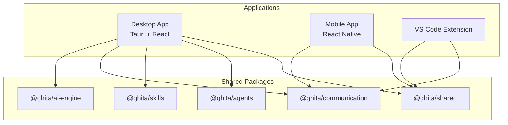
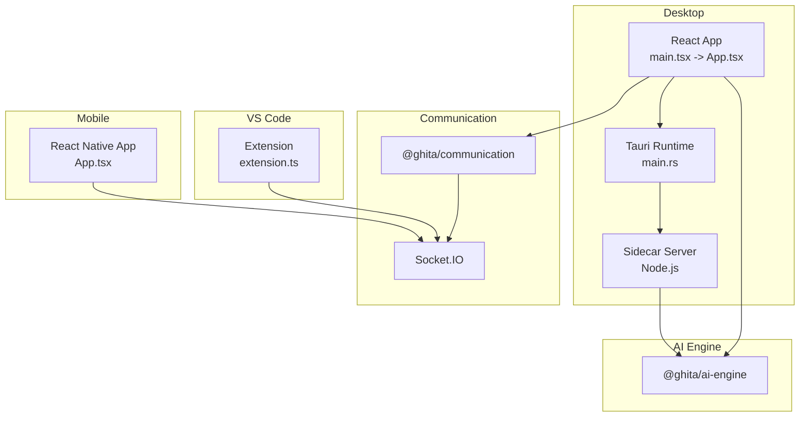
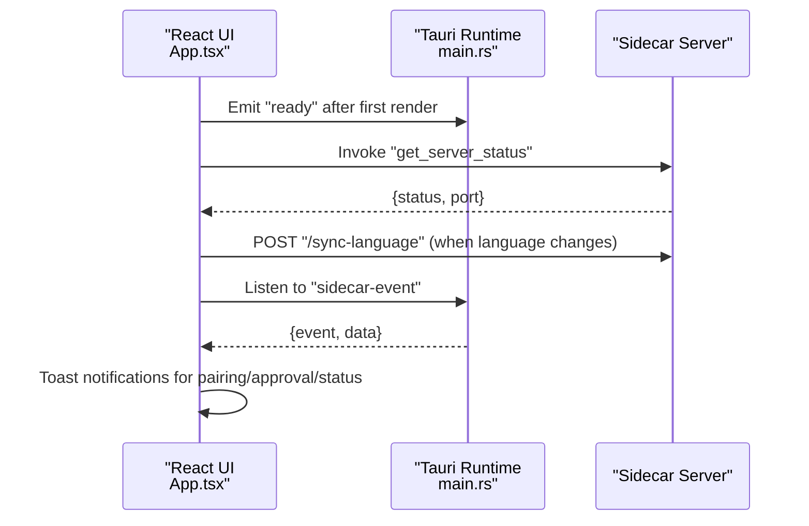
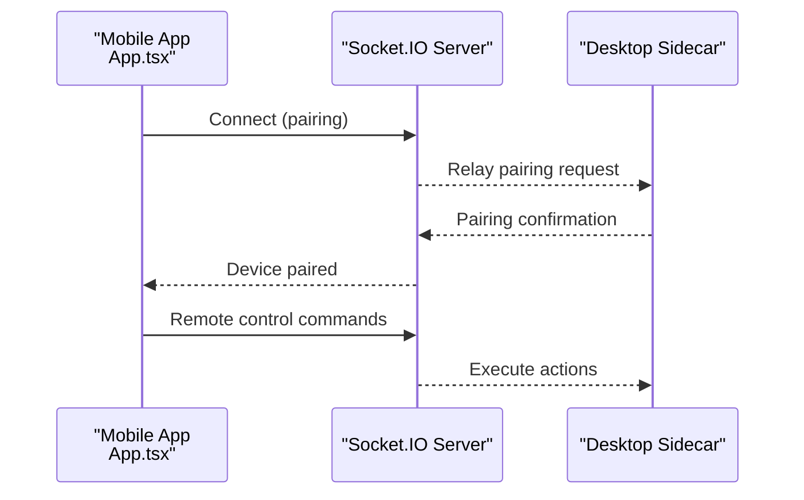
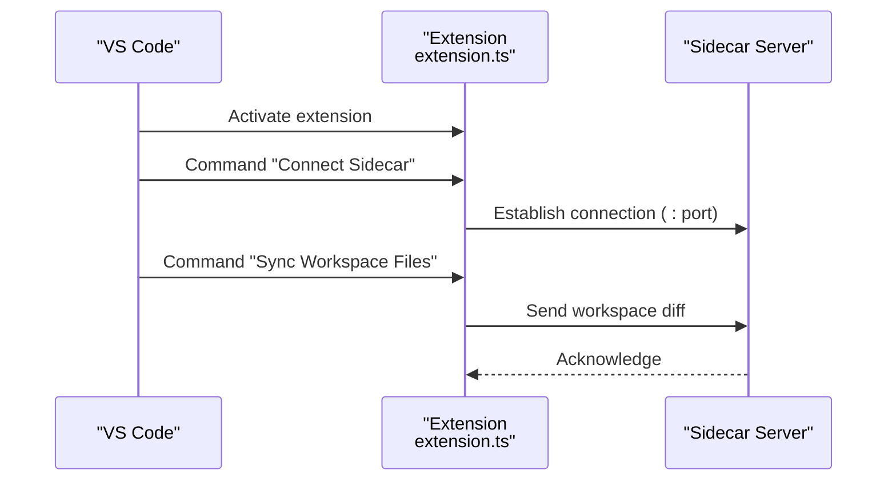
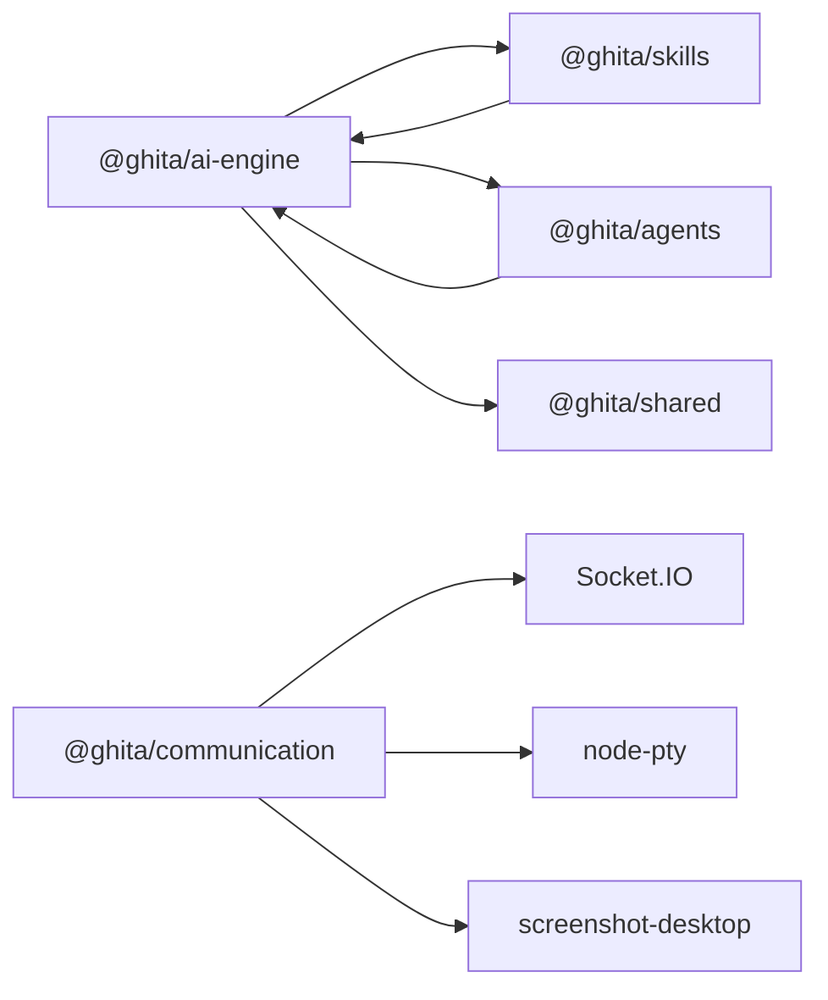
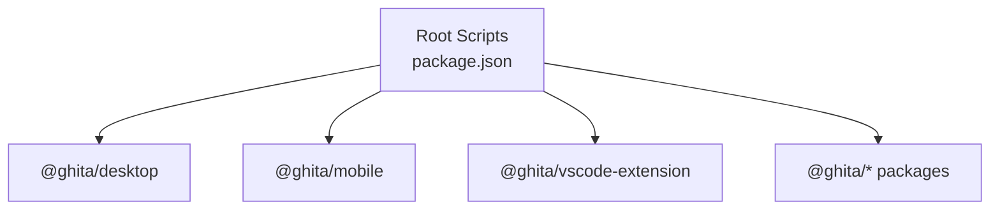

# Project Overview

<cite>
**Referenced Files in This Document**
- [README.md](file://README.md)
- [package.json](file://package.json)
- [apps/desktop/package.json](file://apps/desktop/package.json)
- [apps/mobile/package.json](file://apps/mobile/package.json)
- [apps/vscode-extension/package.json](file://apps/vscode-extension/package.json)
- [apps/desktop/src/main.tsx](file://apps/desktop/src/main.tsx)
- [apps/desktop/src/App.tsx](file://apps/desktop/src/App.tsx)
- [apps/desktop/src-tauri/tauri.conf.json](file://apps/desktop/src-tauri/tauri.conf.json)
- [apps/desktop/src-tauri/src/main.rs](file://apps/desktop/src-tauri/src/main.rs)
- [apps/mobile/src/App.tsx](file://apps/mobile/src/App.tsx)
- [apps/vscode-extension/src/extension.ts](file://apps/vscode-extension/src/extension.ts)
- [packages/ai-engine/package.json](file://packages/ai-engine/package.json)
- [packages/communication/package.json](file://packages/communication/package.json)
- [packages/skills/package.json](file://packages/skills/package.json)
- [packages/agents/package.json](file://packages/agents/package.json)
</cite>

## Table of Contents
1. [Introduction](#introduction)
2. [Project Structure](#project-structure)
3. [Core Components](#core-components)
4. [Architecture Overview](#architecture-overview)
5. [Detailed Component Analysis](#detailed-component-analysis)
6. [Dependency Analysis](#dependency-analysis)
7. [Performance Considerations](#performance-considerations)
8. [Troubleshooting Guide](#troubleshooting-guide)
9. [Conclusion](#conclusion)

## Introduction
GHITA CODING AGENT is a versatile AI-powered development environment designed to unify AI-assisted coding across desktop, mobile, and VS Code. It enables developers to leverage AI across platforms while maintaining a consistent workflow. The platform integrates:
- AI-assisted coding with multiple provider support
- Remote desktop control via mobile devices
- Intelligent automation capabilities
- Cross-platform consistency through a shared AI engine and communication backbone

Target audience and primary use cases:
- Individual developers who want a powerful, AI-enhanced IDE-like experience on desktop with mobile oversight
- Teams collaborating remotely, enabling shared visibility and control across devices
- Remote workers needing secure, real-time access to desktop environments from mobile devices
- Developers seeking a unified AI orchestration layer that supports multiple providers and skills

Value propositions:
- Unified AI experience spanning desktop, mobile, and editor extensions
- Real-time remote control and telemetry via Socket.IO
- Extensible skill system for automating repetitive tasks
- Secure pairing and consent-based approvals for sensitive actions

**Section sources**
- [README.md:22-36](file://README.md#L22-L36)
- [README.md:41-55](file://README.md#L41-L55)

## Project Structure
The project follows a monorepo layout with three main applications and a set of shared packages:
- Desktop application (Tauri + React) for the primary development environment
- Mobile application (React Native) for remote control and oversight
- VS Code extension for seamless workspace integration
- Shared packages for AI orchestration, communication, skills, agents, and utilities

**Diagram sources**
- [package.json:9-26](file://package.json#L9-L26)
- [apps/desktop/package.json:17-43](file://apps/desktop/package.json#L17-L43)
- [apps/mobile/package.json:17-29](file://apps/mobile/package.json#L17-L29)
- [apps/vscode-extension/package.json:52-55](file://apps/vscode-extension/package.json#L52-L55)
- [packages/ai-engine/package.json:24-31](file://packages/ai-engine/package.json#L24-L31)
- [packages/communication/package.json:24-28](file://packages/communication/package.json#L24-L28)
- [packages/skills/package.json:31-34](file://packages/skills/package.json#L31-L34)
- [packages/agents/package.json:26-29](file://packages/agents/package.json#L26-L29)

**Section sources**
- [README.md:58-78](file://README.md#L58-L78)
- [package.json:1-55](file://package.json#L1-L55)

## Core Components
Key capabilities and technologies:
- AI-assisted coding with multi-provider orchestration (OpenAI, Anthropic, Google, Ollama, and more)
- Remote desktop control via Android devices using Socket.IO
- AI skills and agent groups for modular automation
- Computer use and browser control powered by dedicated engines
- Secure pairing and consent-based approvals for sensitive operations
- VS Code extension for workspace synchronization and sidecar connectivity

Technology stack highlights:
- Desktop: Tauri 2.x + React 18 (TypeScript)
- Mobile: React Native (Android minSdk=28)
- AI Engine: Vercel AI SDK / LiteLLM / LangChain.js
- Browser Control: Playwright / CloakBrowser
- Computer Use: nut.js / UI-TARS
- Communication: Socket.IO
- Local AI: Ollama
- Code Editor: Monaco Editor
- Terminal: xterm.js + node-pty
- Build: Turborepo + pnpm workspace

Practical examples:
- Pair your Android device to the desktop for remote control and screen sharing
- Switch between AI providers without changing workflows
- Create reusable AI skills for tasks like code generation, refactoring, or testing
- Use the VS Code extension to keep your workspace synchronized with the desktop sidecar

**Section sources**
- [README.md:26-55](file://README.md#L26-L55)
- [apps/desktop/package.json:17-43](file://apps/desktop/package.json#L17-L43)
- [apps/mobile/package.json:17-29](file://apps/mobile/package.json#L17-L29)
- [apps/vscode-extension/package.json:52-55](file://apps/vscode-extension/package.json#L52-L55)

## Architecture Overview
GHITA CODING AGENT’s architecture connects three client platforms with a shared AI engine and communication layer. The desktop app embeds a Node.js sidecar server for AI operations and local integrations. The mobile app communicates with the desktop via Socket.IO, while the VS Code extension interacts with the sidecar to synchronize workspace changes.

**Diagram sources**
- [apps/desktop/src/main.tsx:1-16](file://apps/desktop/src/main.tsx#L1-L16)
- [apps/desktop/src/App.tsx:179-188](file://apps/desktop/src/App.tsx#L179-L188)
- [apps/desktop/src-tauri/src/main.rs:4-6](file://apps/desktop/src-tauri/src/main.rs#L4-L6)
- [apps/mobile/src/App.tsx:78-102](file://apps/mobile/src/App.tsx#L78-L102)
- [apps/vscode-extension/src/extension.ts:14-91](file://apps/vscode-extension/src/extension.ts#L14-L91)
- [packages/ai-engine/package.json:24-31](file://packages/ai-engine/package.json#L24-L31)
- [packages/communication/package.json:24-28](file://packages/communication/package.json#L24-L28)

**Section sources**
- [apps/desktop/src-tauri/tauri.conf.json:1-73](file://apps/desktop/src-tauri/tauri.conf.json#L1-L73)
- [apps/desktop/src/App.tsx:50-92](file://apps/desktop/src/App.tsx#L50-L92)

## Detailed Component Analysis

### Desktop Application (Tauri + React)
The desktop app initializes the React UI and coordinates with the embedded sidecar server. It handles:
- First-render readiness signaling to Tauri
- Automatic sidecar startup and health checks
- Real-time event handling from the sidecar (pairing confirmations, approvals, messages)
- Language synchronization with the sidecar server

**Diagram sources**
- [apps/desktop/src/App.tsx:20-34](file://apps/desktop/src/App.tsx#L20-L34)
- [apps/desktop/src/App.tsx:71-92](file://apps/desktop/src/App.tsx#L71-L92)
- [apps/desktop/src/App.tsx:95-168](file://apps/desktop/src/App.tsx#L95-L168)
- [apps/desktop/src-tauri/src/main.rs:4-6](file://apps/desktop/src-tauri/src/main.rs#L4-L6)

**Section sources**
- [apps/desktop/src/main.tsx:1-16](file://apps/desktop/src/main.tsx#L1-L16)
- [apps/desktop/src/App.tsx:179-188](file://apps/desktop/src/App.tsx#L179-L188)
- [apps/desktop/src-tauri/tauri.conf.json:12-42](file://apps/desktop/src-tauri/tauri.conf.json#L12-L42)

### Mobile Application (React Native)
The mobile app provides a navigation-driven interface for pairing, remote control, and settings. It communicates with the desktop via Socket.IO and maintains a dark-themed UI with safe area support.

**Diagram sources**
- [apps/mobile/src/App.tsx:78-102](file://apps/mobile/src/App.tsx#L78-L102)
- [packages/communication/package.json:24-28](file://packages/communication/package.json#L24-L28)

**Section sources**
- [apps/mobile/src/App.tsx:1-102](file://apps/mobile/src/App.tsx#L1-L102)
- [apps/mobile/package.json:17-29](file://apps/mobile/package.json#L17-L29)

### VS Code Extension
The VS Code extension adds a status bar item and commands to connect to the sidecar and synchronize workspace files. It reads configuration for the sidecar port and auto-sync behavior.

**Diagram sources**
- [apps/vscode-extension/src/extension.ts:14-91](file://apps/vscode-extension/src/extension.ts#L14-L91)
- [apps/vscode-extension/package.json:33-42](file://apps/vscode-extension/package.json#L33-L42)

**Section sources**
- [apps/vscode-extension/src/extension.ts:14-91](file://apps/vscode-extension/src/extension.ts#L14-L91)
- [apps/vscode-extension/package.json:16-45](file://apps/vscode-extension/package.json#L16-L45)

### AI Engine and Communication Packages
The AI engine orchestrates multiple providers and integrates with skills and agents. Communication packages enable desktop-to-mobile connectivity and terminal/screen capture utilities.

**Diagram sources**
- [packages/ai-engine/package.json:24-31](file://packages/ai-engine/package.json#L24-L31)
- [packages/communication/package.json:24-28](file://packages/communication/package.json#L24-L28)
- [packages/skills/package.json:31-34](file://packages/skills/package.json#L31-L34)
- [packages/agents/package.json:26-29](file://packages/agents/package.json#L26-L29)

**Section sources**
- [packages/ai-engine/package.json:1-44](file://packages/ai-engine/package.json#L1-L44)
- [packages/communication/package.json:1-36](file://packages/communication/package.json#L1-L36)
- [packages/skills/package.json:1-42](file://packages/skills/package.json#L1-L42)
- [packages/agents/package.json:1-37](file://packages/agents/package.json#L1-L37)

## Dependency Analysis
The workspace uses Turborepo and pnpm to manage builds and dependencies across apps and packages. Scripts orchestrate development, building, and testing across the monorepo.

**Diagram sources**
- [package.json:9-26](file://package.json#L9-L26)

**Section sources**
- [package.json:1-55](file://package.json#L1-L55)

## Performance Considerations
- Use the sidecar server to offload heavy AI operations from the main UI thread
- Minimize unnecessary Socket.IO traffic by batching updates and using consent gates for sensitive actions
- Keep AI provider credentials and ports configured for optimal latency
- Prefer local AI (Ollama) for reduced network overhead during development

## Troubleshooting Guide
Common issues and resolutions:
- Desktop app fails to start: verify Rust and Node.js versions, rebuild the sidecar, and ensure port 8080 is free
- Mobile cannot connect: confirm both devices are on the same network, check the dashboard for server status, and verify the pairing code
- AI provider errors: validate API keys in the environment file, enable the provider in the API Manager, and ensure local AI is running if selected
- Skills not working: enable required skills and adapters, and confirm prerequisite tools are installed

**Section sources**
- [README.md:143-168](file://README.md#L143-L168)

## Conclusion
GHITA CODING AGENT delivers a cohesive, cross-platform AI development environment. By combining a Tauri-powered desktop app, a React Native mobile client, and a VS Code extension, it enables developers to work seamlessly across devices. The shared AI engine and communication layer ensure consistent behavior and extensibility, while security-first features like consent-based approvals and secure pairing protect sensitive operations.