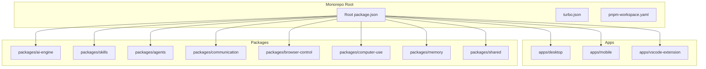
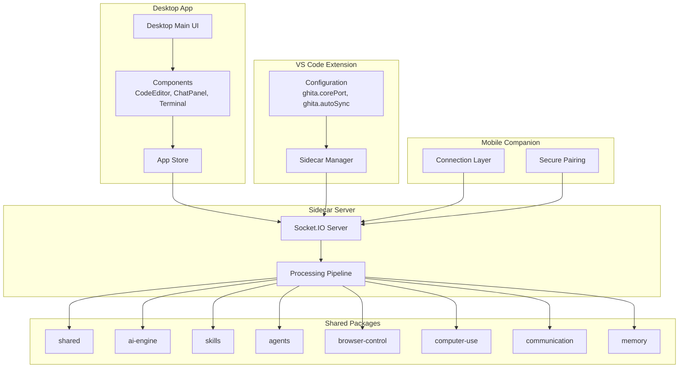
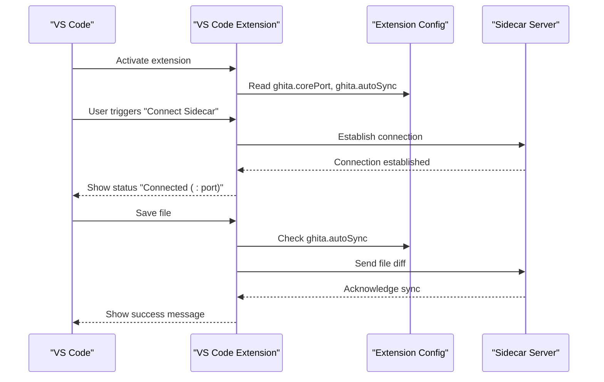
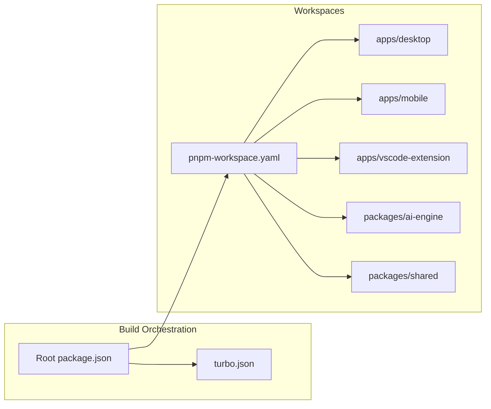

# Project Roadmap

<cite>
**Referenced Files in This Document**
- [README.md](file://README.md)
- [CONTRIBUTING.md](file://CONTRIBUTING.md)
- [package.json](file://package.json)
- [turbo.json](file://turbo.json)
- [pnpm-workspace.yaml](file://pnpm-workspace.yaml)
- [apps/vscode-extension/package.json](file://apps/vscode-extension/package.json)
- [apps/vscode-extension/src/extension.ts](file://apps/vscode-extension/src/extension.ts)
</cite>

## Table of Contents
1. [Introduction](#introduction)
2. [Project Structure](#project-structure)
3. [Core Components](#core-components)
4. [Architecture Overview](#architecture-overview)
5. [Detailed Component Analysis](#detailed-component-analysis)
6. [Dependency Analysis](#dependency-analysis)
7. [Performance Considerations](#performance-considerations)
8. [Troubleshooting Guide](#troubleshooting-guide)
9. [Conclusion](#conclusion)
10. [Appendices](#appendices)

## Introduction
This roadmap outlines the current development phase and future enhancement plans for GHITA CODING AGENT. The project is focused on AI-driven development workflows, cross-platform integration, and community-driven innovation. It currently supports a desktop application with a VS Code-style interface, a mobile companion for remote control, a VS Code extension for sidecar integration, and a modular package architecture for AI orchestration, skills, agents, and automation.

Key strategic directions:
- AI provider integrations and multi-provider orchestration
- Expanded automation capabilities (computer use, browser control)
- Enhanced mobile features and secure pairing
- Improved VS Code extension functionality and workspace synchronization
- Governance and community contribution model
- Scalability and infrastructure improvements

## Project Structure
The repository follows a monorepo layout managed by Turborepo and pnpm workspaces, separating cross-platform apps and reusable packages.

**Diagram sources**
- [package.json:1-55](file://package.json#L1-L55)
- [turbo.json:1-26](file://turbo.json#L1-L26)
- [pnpm-workspace.yaml:1-8](file://pnpm-workspace.yaml#L1-L8)

**Section sources**
- [README.md:58-79](file://README.md#L58-L79)
- [package.json:9-26](file://package.json#L9-L26)
- [turbo.json:3-24](file://turbo.json#L3-L24)
- [pnpm-workspace.yaml:1-8](file://pnpm-workspace.yaml#L1-L8)

## Core Components
Current capabilities and building blocks:
- Desktop app (Tauri 2.x + React) with VS Code-style editor and multi-tab UI
- Mobile app (React Native) for Android with secure pairing and remote control
- VS Code extension (sidecar) for connection and workspace synchronization
- AI engine supporting multiple providers and orchestration
- Automation packages for browser control, computer use, and agent memory
- Communication bridge for desktop-mobile connectivity

These components collectively enable AI-assisted development workflows across platforms and environments.

**Section sources**
- [README.md:26-54](file://README.md#L26-L54)
- [apps/vscode-extension/package.json:1-61](file://apps/vscode-extension/package.json#L1-L61)
- [apps/vscode-extension/src/extension.ts:14-91](file://apps/vscode-extension/src/extension.ts#L14-L91)

## Architecture Overview
The system integrates a desktop core, a mobile companion, and a VS Code sidecar, communicating via a Socket.IO-based sidecar server and shared packages.

**Diagram sources**
- [README.md:41-54](file://README.md#L41-L54)
- [apps/vscode-extension/package.json:17-44](file://apps/vscode-extension/package.json#L17-L44)
- [apps/vscode-extension/src/extension.ts:14-91](file://apps/vscode-extension/src/extension.ts#L14-L91)

## Detailed Component Analysis

### AI Provider Integrations and Orchestration
- Current state: Multi-provider support including OpenAI, Anthropic, Google, Ollama, and more; orchestrated via Vercel AI SDK/LiteLLM/LangChain.js
- Future enhancements:
  - Expand provider catalog and improve routing logic
  - Introduce fallback strategies and cost-aware selection
  - Add provider-specific prompt adapters and response normalization
  - Implement rate limiting and quota monitoring per provider

**Section sources**
- [README.md:29](file://README.md#L29)
- [README.md:47](file://README.md#L47)

### Expanded Automation Capabilities
- Computer use: Mouse/keyboard control and application automation
- Browser control: Automated web tasks with Playwright/CloakBrowser
- Skills system: Extensible skill registry for domain-specific actions
- Agent groups: Specialized agent teams for collaborative workflows

Planned improvements:
- Enhanced UI automation with better error handling and retries
- Advanced browser automation with session persistence and state management
- Skill marketplace and community-contributed skill registry
- Agent orchestration with planning and execution monitoring

**Section sources**
- [README.md:32-33](file://README.md#L32-L33)
- [README.md:30-31](file://README.md#L30-L31)

### Enhanced Mobile Features and Security
- Secure pairing with two-way authentication
- Remote control over WiFi/Socket.IO
- Cross-platform mobile UI with localization support

Future roadmap:
- Biometric authentication for pairing
- Offline capability with local AI inference
- Enhanced gesture control and accessibility features
- Improved network resilience and adaptive bitrate streaming

**Section sources**
- [README.md:35-37](file://README.md#L35-L37)

### Improved VS Code Extension Functionality
Current capabilities:
- Connect to sidecar server
- Workspace file synchronization
- Auto-sync on save with configurable settings

Enhancement plans:
- Real-time diff transmission and conflict resolution
- IntelliSense integration with AI suggestions
- Debugging support and breakpoint synchronization
- Multi-root workspace support
- Command palette integration for common tasks

**Diagram sources**
- [apps/vscode-extension/src/extension.ts:25-78](file://apps/vscode-extension/src/extension.ts#L25-L78)
- [apps/vscode-extension/package.json:33-43](file://apps/vscode-extension/package.json#L33-L43)

**Section sources**
- [apps/vscode-extension/src/extension.ts:14-91](file://apps/vscode-extension/src/extension.ts#L14-L91)
- [apps/vscode-extension/package.json:17-44](file://apps/vscode-extension/package.json#L17-L44)

### Cross-Platform Integration Improvements
- Desktop: Tauri 2.x + React (Windows/Linux)
- Mobile: React Native (Android)
- VS Code: Sidecar extension with configuration

Future enhancements:
- macOS desktop support
- iOS mobile companion
- Web dashboard for browser-based access
- Containerized deployment options

**Section sources**
- [README.md:45-46](file://README.md#L45-L46)

### Community-Driven Feature Development
The project encourages community contributions through:
- Clear contribution guidelines and workflow
- Issue templates and pull request standards
- Code style enforcement and automated checks
- Multilingual documentation and i18n support

Governance model:
- Open collaboration via GitHub Issues and Pull Requests
- Maintainer review and approval process
- Feature proposals through discussions and decisions documents
- Release planning aligned with community feedback

**Section sources**
- [CONTRIBUTING.md:34-95](file://CONTRIBUTING.md#L34-L95)
- [CONTRIBUTING.md:115-130](file://CONTRIBUTING.md#L115-L130)

## Dependency Analysis
The monorepo uses Turborepo for task orchestration and pnpm for workspace management, enabling efficient builds and consistent dependency resolution across apps and packages.

**Diagram sources**
- [turbo.json:1-26](file://turbo.json#L1-L26)
- [pnpm-workspace.yaml:1-8](file://pnpm-workspace.yaml#L1-L8)
- [package.json:9-26](file://package.json#L9-L26)

**Section sources**
- [turbo.json:3-24](file://turbo.json#L3-L24)
- [pnpm-workspace.yaml:1-8](file://pnpm-workspace.yaml#L1-L8)
- [package.json:9-26](file://package.json#L9-L26)

## Performance Considerations
- Monorepo optimization: Turborepo caching and incremental builds reduce build times across apps and packages
- Workspace management: pnpm workspaces minimize disk usage and speed up installs
- Platform-specific optimizations: Tauri desktop app provides native performance; React Native mobile ensures responsive UI
- Scalability planning: Socket.IO-based sidecar server designed for concurrent connections; containerization ready for horizontal scaling

## Troubleshooting Guide
Common issues and resolutions:
- Desktop app startup failures: Verify Rust and Node.js versions, rebuild sidecar server, check port availability
- Mobile connectivity problems: Ensure same network, confirm communication server status, validate pairing code
- AI provider configuration: Verify API keys, enable providers in API Manager, check local AI service status
- Skill system issues: Enable required skills, ensure dependencies are installed, adjust security settings

**Section sources**
- [README.md:143-168](file://README.md#L143-L168)

## Conclusion
GHITA CODING AGENT is positioned to become a comprehensive AI-assisted development platform with cross-platform reach and strong community engagement. The roadmap emphasizes expanding AI provider capabilities, deepening automation features, enhancing mobile and VS Code experiences, and strengthening governance for sustainable growth. Infrastructure improvements will ensure scalability to support increased user adoption while maintaining performance and reliability.

## Appendices

### Timeline Expectations
- Q3 2026: Enhanced VS Code extension with advanced sync and AI integration
- Q4 2026: Mobile app expansion with biometric security and offline capabilities
- Q1 2027: Cross-platform desktop support and web dashboard
- Q2 2027: Advanced agent orchestration and skills marketplace

### Governance and Contribution Model
Community contributions are integrated through:
- GitHub Issues for bug reports and feature requests
- Pull Request process with automated checks and maintainer review
- Discussion documents capturing decisions and roadmap alignment
- Release planning incorporating community feedback

**Section sources**
- [CONTRIBUTING.md:195-234](file://CONTRIBUTING.md#L195-L234)