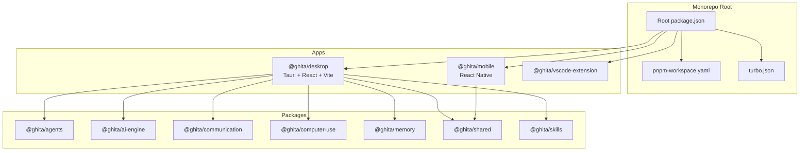
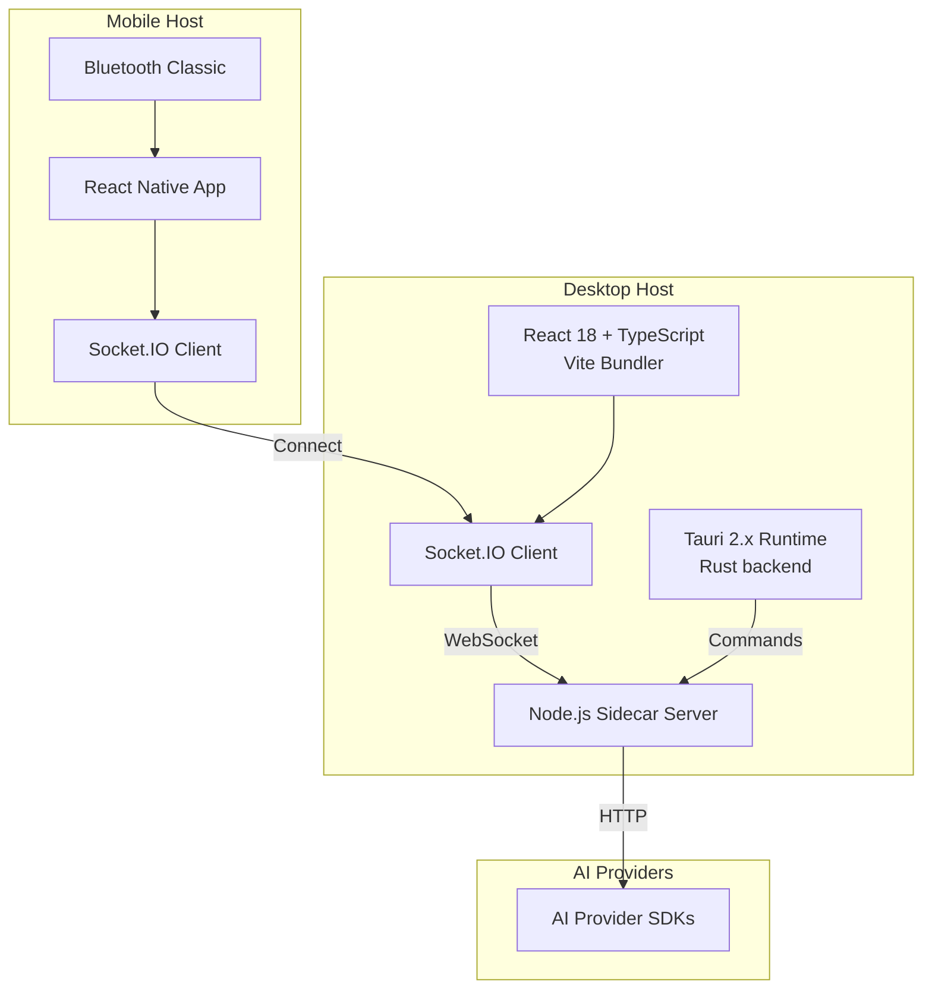
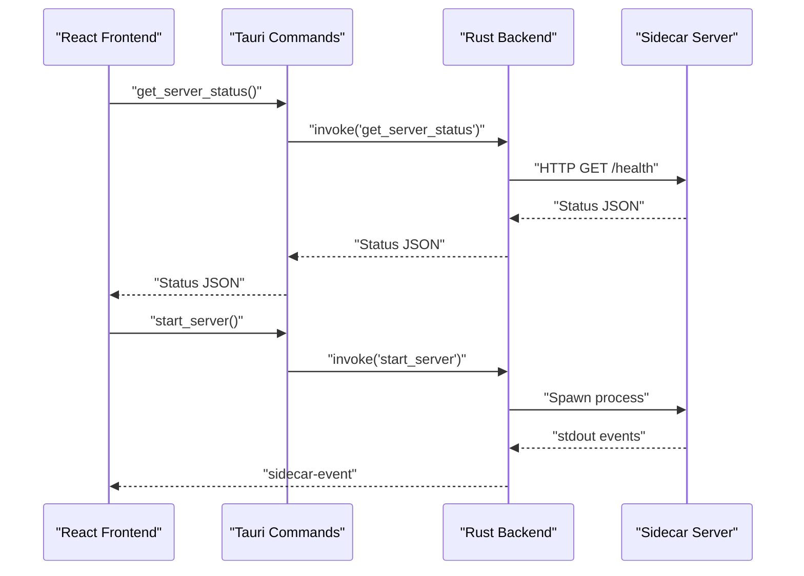
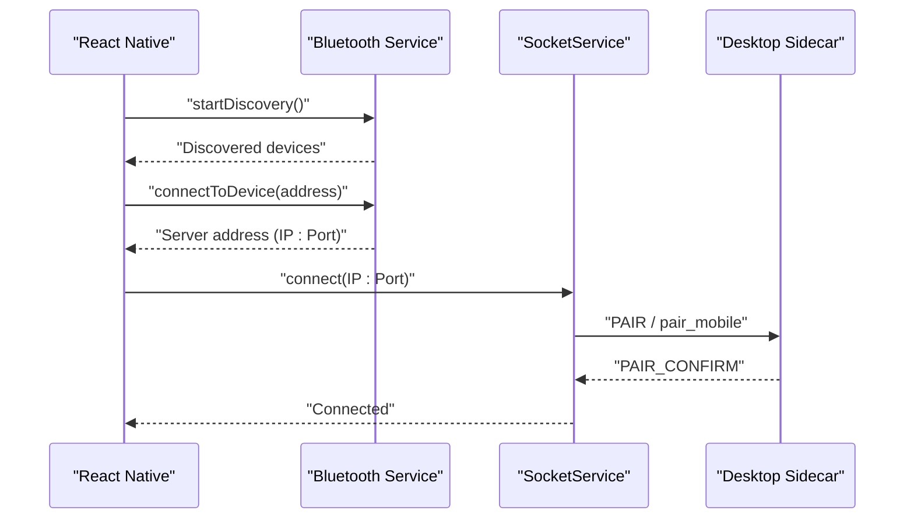
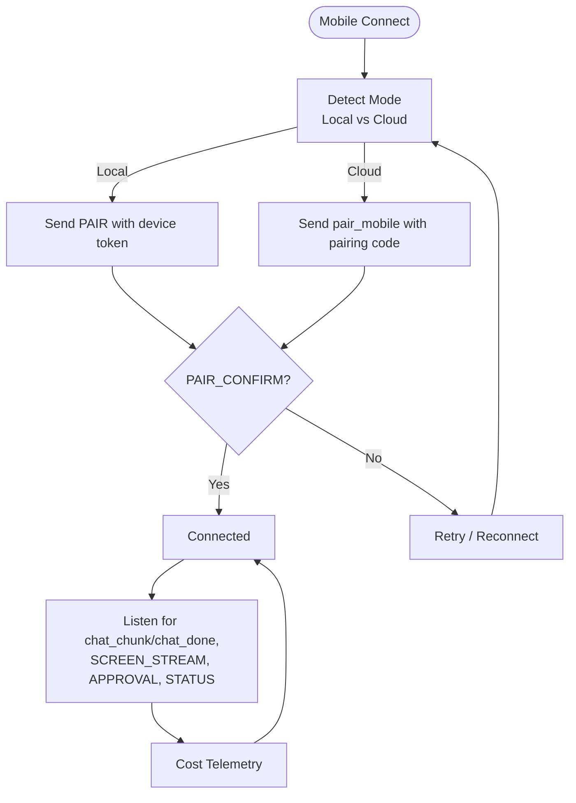
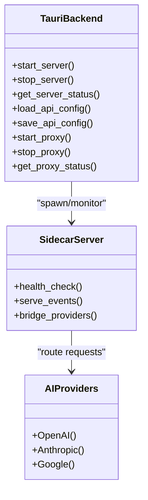
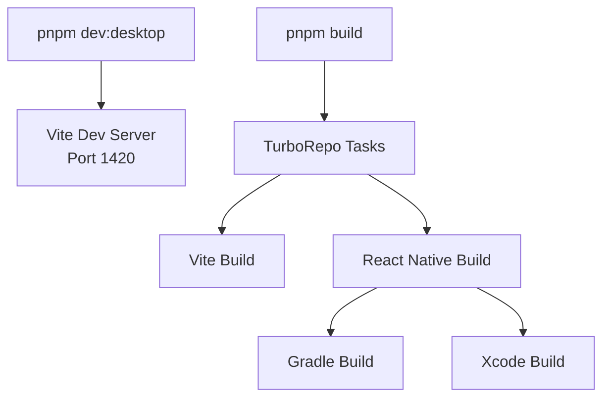
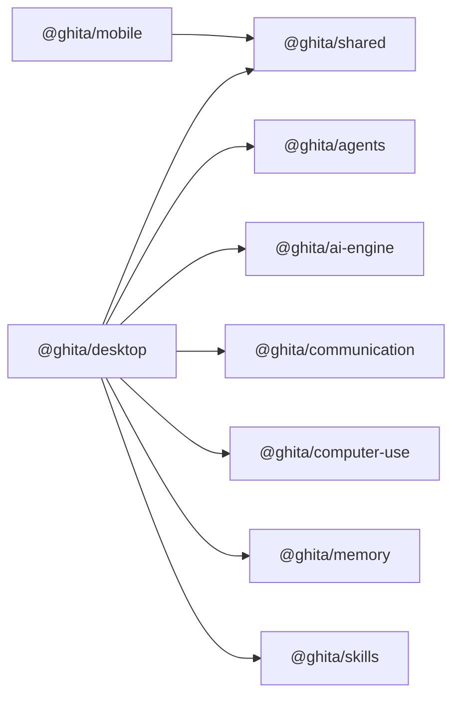

# Technology Stack

<cite>
**Referenced Files in This Document**
- [package.json](file://package.json)
- [pnpm-workspace.yaml](file://pnpm-workspace.yaml)
- [turbo.json](file://turbo.json)
- [apps/desktop/package.json](file://apps/desktop/package.json)
- [apps/desktop/vite.config.ts](file://apps/desktop/vite.config.ts)
- [apps/desktop/src-tauri/tauri.conf.json](file://apps/desktop/src-tauri/tauri.conf.json)
- [apps/desktop/src-tauri/Cargo.toml](file://apps/desktop/src-tauri/Cargo.toml)
- [apps/desktop/src-tauri/src/lib.rs](file://apps/desktop/src-tauri/src/lib.rs)
- [apps/desktop/src/utils/sharedSocket.ts](file://apps/desktop/src/utils/sharedSocket.ts)
- [apps/mobile/package.json](file://apps/mobile/package.json)
- [apps/mobile/android/build.gradle](file://apps/mobile/android/build.gradle)
- [apps/mobile/ios/Podfile](file://apps/mobile/ios/Podfile)
- [apps/mobile/src/services/socketService.ts](file://apps/mobile/src/services/socketService.ts)
- [apps/mobile/src/services/bluetoothService.ts](file://apps/mobile/src/services/bluetoothService.ts)
</cite>

## Table of Contents
1. [Introduction](#introduction)
2. [Project Structure](#project-structure)
3. [Core Components](#core-components)
4. [Architecture Overview](#architecture-overview)
5. [Detailed Component Analysis](#detailed-component-analysis)
6. [Dependency Analysis](#dependency-analysis)
7. [Performance Considerations](#performance-considerations)
8. [Troubleshooting Guide](#troubleshooting-guide)
9. [Conclusion](#conclusion)

## Introduction
This document describes the technology stack powering GHITA CODING AGENT. It covers the desktop application built with Tauri 2.x and React 18 + TypeScript, the cross-platform mobile app using React Native, and the real-time communication layer powered by Socket.IO. It also documents the backend technologies integrated via Tauri’s Rust runtime, Node.js sidecar server, and AI provider SDKs. The build system leverages TurboRepo and pnpm for monorepo management, Vite for frontend bundling, and Gradle/Xcode for mobile builds. Development tools include Vitest for testing, Better-SQLite3 for data persistence, and an internationalization framework. The document explains rationale, version compatibility, platform-specific considerations, and cross-platform strategies.

## Project Structure
The repository is organized as a monorepo managed by pnpm workspaces and TurboRepo. Applications include:
- Desktop app under apps/desktop (Tauri + React + Vite)
- Mobile app under apps/mobile (React Native Android/iOS)
- VS Code extension under apps/vscode-extension
- Shared packages under packages/*

Key monorepo configuration files:
- Root package manager and engine constraints
- Workspace definitions
- Task orchestration with caching and incremental builds

**Diagram sources**
- [package.json:1-55](file://package.json#L1-L55)
- [pnpm-workspace.yaml:1-8](file://pnpm-workspace.yaml#L1-L8)
- [turbo.json:1-26](file://turbo.json#L1-L26)
- [apps/desktop/package.json:1-61](file://apps/desktop/package.json#L1-L61)
- [apps/mobile/package.json:1-44](file://apps/mobile/package.json#L1-L44)

**Section sources**
- [package.json:1-55](file://package.json#L1-L55)
- [pnpm-workspace.yaml:1-8](file://pnpm-workspace.yaml#L1-L8)
- [turbo.json:1-26](file://turbo.json#L1-L26)

## Core Components
- Desktop Application (Tauri 2.x + React 18 + TypeScript)
  - Frontend: React 18 with TypeScript, Vite for dev/build, Zustand for state, Socket.IO client for real-time communication, Monaco Editor for code editing, Xterm for terminal emulation.
  - Backend integration: Tauri CLI 2.x, Tauri APIs for Shell, FS, Dialog plugins; Rust-based sidecar server management and OS-level commands.
- Mobile Application (React Native)
  - Cross-platform UI with React Navigation, Bluetooth Classic for device discovery and pairing, Socket.IO client for remote control, AsyncStorage for persistence.
- Real-Time Communication
  - Socket.IO client/server for bidirectional messaging, streaming chat responses, approvals, telemetry, and keepalive.
- Build System
  - TurboRepo for task orchestration, pnpm for workspace management, Vite for frontend bundling, Gradle/Xcode for Android/iOS builds.
- Development Tools
  - Vitest for unit/integration tests, Better-SQLite3 for local data persistence, i18n framework for internationalization.

**Section sources**
- [apps/desktop/package.json:17-61](file://apps/desktop/package.json#L17-L61)
- [apps/desktop/vite.config.ts:11-114](file://apps/desktop/vite.config.ts#L11-L114)
- [apps/desktop/src-tauri/tauri.conf.json:1-73](file://apps/desktop/src-tauri/tauri.conf.json#L1-L73)
- [apps/desktop/src-tauri/Cargo.toml:15-32](file://apps/desktop/src-tauri/Cargo.toml#L15-L32)
- [apps/desktop/src/utils/sharedSocket.ts:24-88](file://apps/desktop/src/utils/sharedSocket.ts#L24-L88)
- [apps/mobile/package.json:17-44](file://apps/mobile/package.json#L17-L44)
- [apps/mobile/src/services/socketService.ts:27-525](file://apps/mobile/src/services/socketService.ts#L27-L525)
- [apps/mobile/src/services/bluetoothService.ts:41-234](file://apps/mobile/src/services/bluetoothService.ts#L41-L234)

## Architecture Overview
GHITA CODING AGENT employs a hybrid desktop-first architecture:
- Desktop app embeds a web-based UI inside a native shell via Tauri. The frontend communicates with a Node.js sidecar server launched and managed by the Rust backend.
- The mobile app connects to the desktop either locally (LAN) or via a cloud relay (disabled in current implementation), using Socket.IO for real-time control and screen sharing.
- AI providers are integrated through SDKs and the sidecar server, enabling multi-provider orchestration and skill execution.

**Diagram sources**
- [apps/desktop/src-tauri/src/lib.rs:372-500](file://apps/desktop/src-tauri/src/lib.rs#L372-L500)
- [apps/desktop/src/utils/sharedSocket.ts:24-88](file://apps/desktop/src/utils/sharedSocket.ts#L24-L88)
- [apps/mobile/src/services/socketService.ts:27-525](file://apps/mobile/src/services/socketService.ts#L27-L525)
- [apps/desktop/src-tauri/tauri.conf.json:40](file://apps/desktop/src-tauri/tauri.conf.json#L40)

## Detailed Component Analysis

### Desktop Application (Tauri + React + Socket.IO)
- Framework and Tooling
  - Tauri 2.x with CLI 2.x integrates Rust-based plugins (Shell, FS, Dialog, Updater) and exposes commands to the frontend.
  - Vite provides fast dev server and optimized production builds; aliases and pre-bundling improve startup performance.
- Real-Time Communication
  - A shared Socket.IO client connects to the sidecar server, authenticating with a per-session token. It deduplicates concurrent connection attempts and handles reconnection.
- Backend Integration
  - Rust backend manages a Node.js sidecar lifecycle, exposing commands to start/stop the server, query status, manage local IP visibility, and persist configuration and chat sessions.
- Data Persistence
  - JSON-backed storage for API configuration and chat sessions; SQLite is available via Better-SQLite3 for optional persistence.

**Diagram sources**
- [apps/desktop/src-tauri/src/lib.rs:186-235](file://apps/desktop/src-tauri/src/lib.rs#L186-L235)
- [apps/desktop/src/utils/sharedSocket.ts:24-88](file://apps/desktop/src/utils/sharedSocket.ts#L24-L88)

**Section sources**
- [apps/desktop/src-tauri/tauri.conf.json:12-42](file://apps/desktop/src-tauri/tauri.conf.json#L12-L42)
- [apps/desktop/src-tauri/Cargo.toml:15-32](file://apps/desktop/src-tauri/Cargo.toml#L15-L32)
- [apps/desktop/src-tauri/src/lib.rs:372-500](file://apps/desktop/src-tauri/src/lib.rs#L372-L500)
- [apps/desktop/src/utils/sharedSocket.ts:24-88](file://apps/desktop/src/utils/sharedSocket.ts#L24-L88)
- [apps/desktop/vite.config.ts:47-112](file://apps/desktop/vite.config.ts#L47-L112)

### Mobile Application (React Native + Socket.IO + Bluetooth)
- Connectivity
  - Socket.IO client supports local LAN and cloud modes, with automatic reconnection and health checks for local recovery.
  - Pairing flows differ by mode: local pairing uses device tokens and auth; cloud mode uses a pairing code and auth token.
- Device Discovery
  - Bluetooth Classic service discovers nearby devices, requests server info, and establishes a connection to retrieve the desktop server address.
- UI and Navigation
  - React Navigation stacks for screens, with components for pairing, remote control, and settings.

**Diagram sources**
- [apps/mobile/src/services/bluetoothService.ts:93-223](file://apps/mobile/src/services/bluetoothService.ts#L93-L223)
- [apps/mobile/src/services/socketService.ts:80-147](file://apps/mobile/src/services/socketService.ts#L80-L147)

**Section sources**
- [apps/mobile/src/services/socketService.ts:27-525](file://apps/mobile/src/services/socketService.ts#L27-L525)
- [apps/mobile/src/services/bluetoothService.ts:41-234](file://apps/mobile/src/services/bluetoothService.ts#L41-L234)
- [apps/mobile/android/build.gradle:13-20](file://apps/mobile/android/build.gradle#L13-L20)
- [apps/mobile/ios/Podfile:17-40](file://apps/mobile/ios/Podfile#L17-L40)

### Real-Time Communication Layer (Socket.IO)
- Desktop
  - Shared Socket.IO client ensures a single connection across components, reducing overhead and simplifying state.
- Mobile
  - Comprehensive event handling for screenshots, streaming chat chunks, approvals, telemetry, and language sync.
  - Health checks monitor local server availability and trigger reconnection logic.

**Diagram sources**
- [apps/mobile/src/services/socketService.ts:330-520](file://apps/mobile/src/services/socketService.ts#L330-L520)
- [apps/desktop/src/utils/sharedSocket.ts:24-88](file://apps/desktop/src/utils/sharedSocket.ts#L24-L88)

**Section sources**
- [apps/desktop/src/utils/sharedSocket.ts:24-88](file://apps/desktop/src/utils/sharedSocket.ts#L24-L88)
- [apps/mobile/src/services/socketService.ts:27-525](file://apps/mobile/src/services/socketService.ts#L27-L525)

### Backend Technologies (Rust + Node.js Sidecar + AI SDKs)
- Rust Backend (Tauri)
  - Manages sidecar lifecycle, exposes commands for updates, storage, LAN toggles, proxy control, and server status.
  - Uses Tokio for async runtime, Hyper for HTTP server capabilities, and Reqwest for HTTP client operations.
- Node.js Sidecar
  - Launched from Rust, runs alongside the desktop app, serving as the primary bridge to AI providers and handling real-time events.
- AI Provider SDKs
  - Integrated via sidecar and packages; multi-provider orchestration is supported by shared packages and communication modules.

**Diagram sources**
- [apps/desktop/src-tauri/src/lib.rs:372-500](file://apps/desktop/src-tauri/src/lib.rs#L372-L500)
- [apps/desktop/src-tauri/Cargo.toml:23-32](file://apps/desktop/src-tauri/Cargo.toml#L23-L32)

**Section sources**
- [apps/desktop/src-tauri/src/lib.rs:372-500](file://apps/desktop/src-tauri/src/lib.rs#L372-L500)
- [apps/desktop/src-tauri/Cargo.toml:15-32](file://apps/desktop/src-tauri/Cargo.toml#L15-L32)

### Build System (TurboRepo + pnpm + Vite + Gradle/Xcode)
- Monorepo Orchestration
  - TurboRepo defines task dependencies and caching; pnpm manages workspaces and binary dependencies.
- Frontend Build
  - Vite resolves platform-specific targets, pre-bundles heavy dependencies, and splits vendor bundles for optimal loading.
- Mobile Builds
  - Android uses Gradle with modern SDK versions and Kotlin; iOS uses CocoaPods with React Native pods.

**Diagram sources**
- [package.json:9-26](file://package.json#L9-L26)
- [turbo.json:3-24](file://turbo.json#L3-L24)
- [apps/desktop/vite.config.ts:47-112](file://apps/desktop/vite.config.ts#L47-L112)
- [apps/mobile/android/build.gradle:13-20](file://apps/mobile/android/build.gradle#L13-L20)
- [apps/mobile/ios/Podfile:17-40](file://apps/mobile/ios/Podfile#L17-L40)

**Section sources**
- [package.json:9-26](file://package.json#L9-L26)
- [turbo.json:3-24](file://turbo.json#L3-L24)
- [apps/desktop/vite.config.ts:47-112](file://apps/desktop/vite.config.ts#L47-L112)
- [apps/mobile/android/build.gradle:13-20](file://apps/mobile/android/build.gradle#L13-L20)
- [apps/mobile/ios/Podfile:17-40](file://apps/mobile/ios/Podfile#L17-L40)

### Development Tools (Testing, Persistence, i18n)
- Testing
  - Vitest is configured for unit and integration tests across apps and packages.
- Data Persistence
  - Better-SQLite3 is declared as a build-required dependency; JSON files are used for configuration and chat sessions.
- Internationalization
  - i18n context and translation resources are present in both desktop and mobile apps.

**Section sources**
- [apps/desktop/package.json:58-58](file://apps/desktop/package.json#L58-L58)
- [apps/mobile/package.json:41-41](file://apps/mobile/package.json#L41-L41)
- [package.json:44-50](file://package.json#L44-L50)

## Dependency Analysis
- Internal Package Dependencies
  - Desktop app depends on shared packages (@ghita/agents, @ghita/ai-engine, @ghita/communication, @ghita/computer-use, @ghita/memory, @ghita/skills, @ghita/shared).
  - Mobile app depends on @ghita/shared for types and constants.
- External Dependencies
  - Desktop: React 18, Socket.IO client, Tauri plugins, Monaco Editor, Xterm.
  - Mobile: React Native, React Navigation, Socket.IO client, Bluetooth Classic, AsyncStorage.

**Diagram sources**
- [apps/desktop/package.json:17-26](file://apps/desktop/package.json#L17-L26)
- [apps/mobile/package.json:17-29](file://apps/mobile/package.json#L17-L29)

**Section sources**
- [apps/desktop/package.json:17-26](file://apps/desktop/package.json#L17-L26)
- [apps/mobile/package.json:17-29](file://apps/mobile/package.json#L17-L29)

## Performance Considerations
- Desktop
  - Vite pre-bundling and manual chunk splitting reduce initial load time; strict port and environment variable exposure improve reliability.
  - Rust backend uses Tokio runtime and efficient HTTP client; sidecar server health checks prevent stale connections.
- Mobile
  - Socket.IO reconnection with exponential backoff and health checks maintain connectivity; Bluetooth discovery is permission-aware and throttled.
- Monorepo
  - TurboRepo caching accelerates builds; pnpm hoisting reduces disk usage and improves install speed.

[No sources needed since this section provides general guidance]

## Troubleshooting Guide
- Desktop Sidecar Not Starting
  - Verify sidecar script paths and bundled Node executable; confirm environment variables and LAN toggle state.
  - Check stdout forwarding and emitted sidecar events.
- Socket.IO Connection Issues
  - Desktop: Ensure the shared socket receives a valid port from Tauri commands; confirm auth token presence.
  - Mobile: Validate local health checks and pairing flows; inspect event handlers for errors.
- Mobile Bluetooth Discovery
  - Confirm permissions on Android 12+; ensure device is discoverable and responds with the expected server info format.

**Section sources**
- [apps/desktop/src-tauri/src/lib.rs:41-168](file://apps/desktop/src-tauri/src/lib.rs#L41-L168)
- [apps/desktop/src/utils/sharedSocket.ts:24-88](file://apps/desktop/src/utils/sharedSocket.ts#L24-L88)
- [apps/mobile/src/services/socketService.ts:330-520](file://apps/mobile/src/services/socketService.ts#L330-L520)
- [apps/mobile/src/services/bluetoothService.ts:63-88](file://apps/mobile/src/services/bluetoothService.ts#L63-L88)

## Conclusion
GHITA CODING AGENT combines Tauri 2.x and React 18 for a performant desktop host, React Native for cross-platform mobile control, and Socket.IO for robust real-time communication. The Rust backend integrates tightly with a Node.js sidecar to orchestrate AI provider SDKs and manage OS-level capabilities. TurboRepo and pnpm streamline monorepo operations, while Vite, Gradle, and Xcode deliver efficient builds. The architecture balances modularity, cross-platform compatibility, and developer productivity.